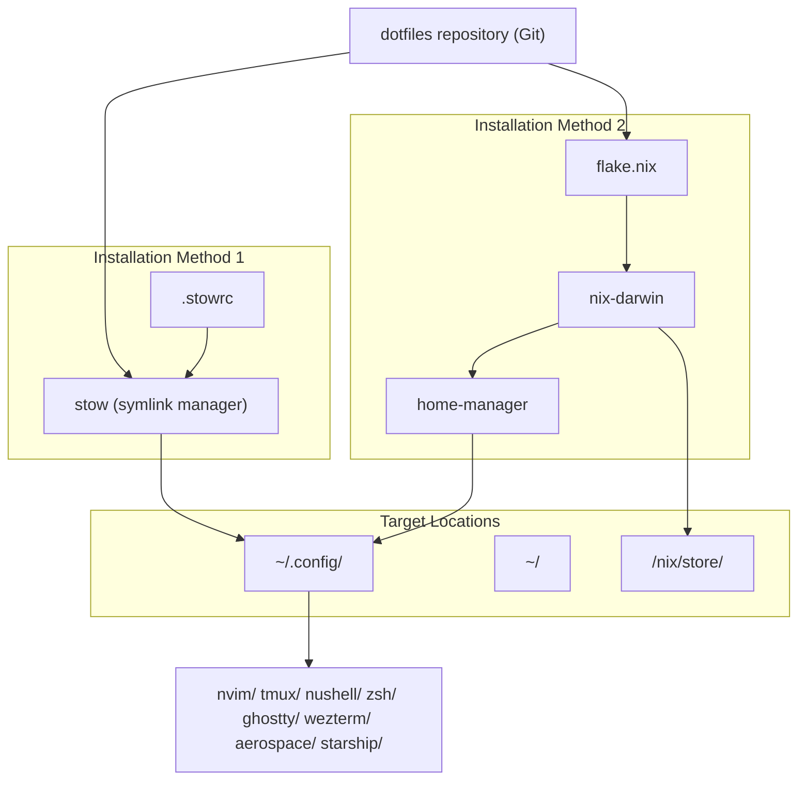
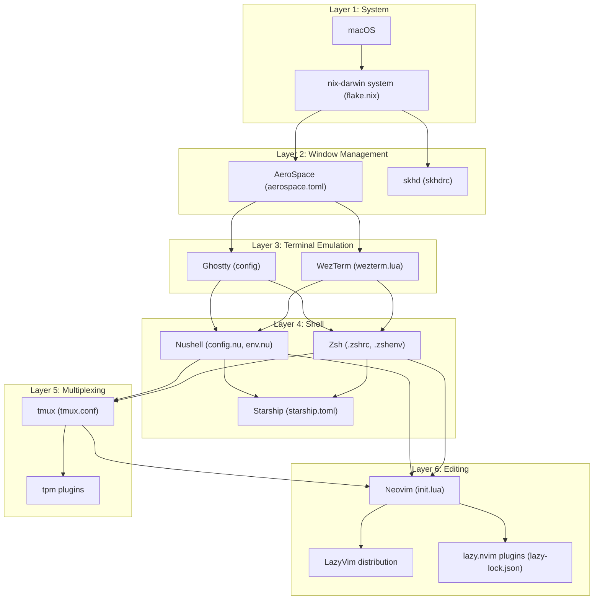
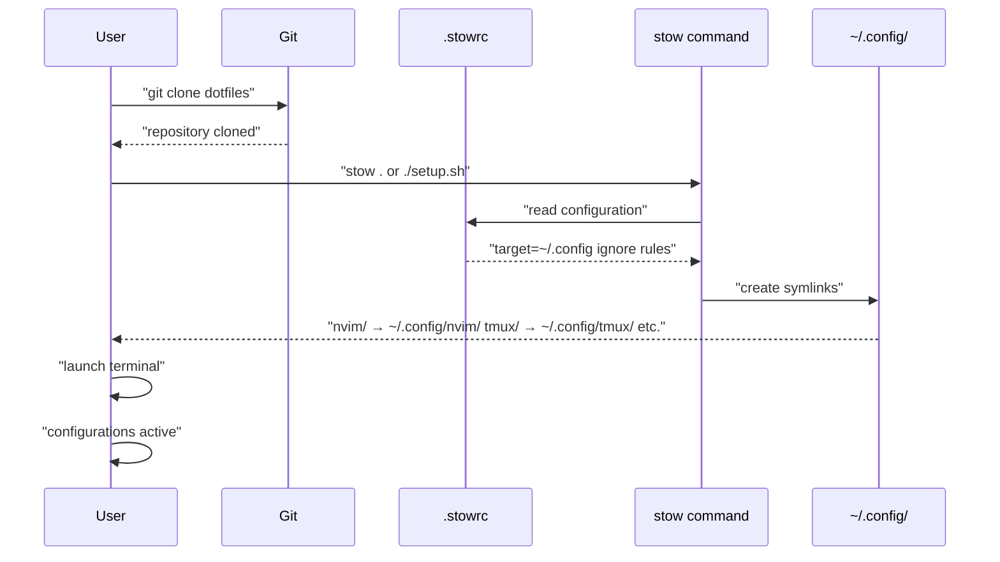
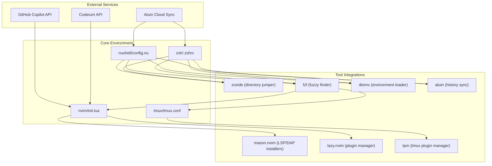

[/](/)

[/search](/search)

[/wiki](/wiki)

[/settings/members](/settings/members)

[/settings/support](/settings/support)

[Add repo](/repositories)

[All repos](/wiki)

[backend](/wiki/Klaudioz/backend)

[BH-Workflow-Engine](/wiki/Klaudioz/BH-Workflow-Engine)

[Buckhead_CRM](/wiki/Klaudioz/Buckhead_CRM)

[dotfiles](/wiki/Klaudioz/dotfiles)

[frontend](/wiki/Klaudioz/frontend)

[godeep.wiki-jb](/wiki/Klaudioz/godeep.wiki-jb)

[pi-mono-zero](/wiki/Klaudioz/pi-mono-zero)

[VirtualOracle](/wiki/Klaudioz/VirtualOracle)

# OverviewLink copied!

> **Relevant source files**
> * [.stowrc](https://github.com/Klaudioz/dotfiles/blob/2febda55/.stowrc)
> * [README.md](https://github.com/Klaudioz/dotfiles/blob/2febda55/README.md)
> * [setup.sh](https://github.com/Klaudioz/dotfiles/blob/2febda55/setup.sh)

## Purpose and ScopeLink copied!

This document provides a comprehensive introduction to the dotfiles repository located at [https://github.com/Klaudioz/dotfiles](https://github.com/Klaudioz/dotfiles). This repository contains a complete macOS development environment configuration that manages system settings, terminal emulation, shell environments, text editing, window management, and development tooling through declarative configuration files. The repository supports two installation methods: manual symlink management via `stow` and declarative system configuration via `nix-darwin`.

For detailed installation instructions, see [Installation and Setup](#1.1). For architectural details on how components interact, see [System Architecture](#1.2).

**Sources:** [README.md L1-L7](https://github.com/Klaudioz/dotfiles/blob/2febda55/README.md#L1-L7)

 [setup.sh L1-L2](https://github.com/Klaudioz/dotfiles/blob/2febda55/setup.sh#L1-L2)

## What This Repository ContainsLink copied!

This dotfiles repository manages configuration for the following categories of tools:

| Category | Primary Tools | Configuration Files | Importance Score |
| --- | --- | --- | --- |
| Text Editor | Neovim, LazyVim | `nvim/`, `lazy-lock.json` | 31.22 |
| Terminal Multiplexer | tmux | `tmux/tmux.conf`, `tmux/tmux.reset.conf` | 27.00 |
| Shell Environment | Nushell, Zsh | `nushell/`, `zsh/` | 25.98 / 10.44 |
| System Configuration | nix-darwin, home-manager | `flake.nix`, `flake.lock` | 13.67 |
| Terminal Emulators | Ghostty, WezTerm | `ghostty/`, `wezterm/` | 10.40 / 9.92 |
| Dotfile Management | stow | `.stowrc`, `setup.sh` | 9.61 |
| Window Management | AeroSpace, skhd | `aerospace/`, `skhd/` | 8.88 / 4.25 |
| Prompt Styling | Starship | `starship/` | 7.30 |

The repository contains over 50 Neovim plugins, multiple tmux plugins, extensive shell aliases and functions, and integrations with external services like GitHub Copilot, Atuin, and various LSP servers.

**Sources:** Based on high-level diagrams and importance scores

## Design PhilosophyLink copied!

The configuration follows three core principles:

**Declarative Configuration**: System state is defined through configuration files tracked in version control, not through imperative commands. The `flake.nix` file declares the complete system state for `nix-darwin`, while `lazy-lock.json` locks Neovim plugin versions.

**Layered Architecture**: The system is organized in distinct layers, each handling specific concerns:

* System Management (nix-darwin, home-manager, stow)
* Terminal Emulation (Ghostty, WezTerm)
* Shell Environment (Nushell, Zsh, Starship)
* Session Management (tmux)
* Text Editing (Neovim)
* Window Management (AeroSpace, skhd)

**Reproducibility with Flexibility**: Base configurations are version-controlled and locked (`flake.lock`, `lazy-lock.json`), ensuring reproducible deployments. However, runtime state (tmux sessions via tmux-resurrect, Neovim sessions via persistence.nvim, shell history via atuin) adapts dynamically to usage patterns.

**Sources:** [.stowrc L1-L5](https://github.com/Klaudioz/dotfiles/blob/2febda55/.stowrc#L1-L5)

 [README.md L1-L7](https://github.com/Klaudioz/dotfiles/blob/2febda55/README.md#L1-L7)

## Core TechnologiesLink copied!

### Configuration Management SystemsLink copied!



**Diagram: Configuration Deployment Paths**

The repository supports two deployment approaches:

1. **stow-based deployment**: The `stow` command reads [.stowrc L1](https://github.com/Klaudioz/dotfiles/blob/2febda55/.stowrc#L1-L1)  which specifies `--target=~/.config` and creates symlinks from the repository to the target directory. The [setup.sh L2](https://github.com/Klaudioz/dotfiles/blob/2febda55/setup.sh#L2-L2)  script executes `stow .` to deploy all configurations.
2. **nix-darwin deployment**: The `flake.nix` file defines a declarative system configuration that installs packages to `/nix/store` and manages `~/.config` through `home-manager` integration. See [System Configuration with Nix-Darwin](#2) for details.

**Sources:** [README.md L3-L6](https://github.com/Klaudioz/dotfiles/blob/2febda55/README.md#L3-L6)

 [setup.sh L1-L2](https://github.com/Klaudioz/dotfiles/blob/2febda55/setup.sh#L1-L2)

 [.stowrc L1-L2](https://github.com/Klaudioz/dotfiles/blob/2febda55/.stowrc#L1-L2)

### Runtime Environment StackLink copied!



**Diagram: Runtime Layer Dependencies**

Each layer builds upon the previous one:

* **Layer 1** (System): `nix-darwin` manages the macOS system state through `flake.nix`
* **Layer 2** (Window Management): `AeroSpace` manages window layouts with hotkeys from `skhd`
* **Layer 3** (Terminal Emulation): `Ghostty` or `WezTerm` provide the terminal interface
* **Layer 4** (Shell): `Nushell` or `Zsh` provide the command-line environment with `Starship` prompts
* **Layer 5** (Multiplexing): `tmux` manages multiple terminal sessions
* **Layer 6** (Editing): `Neovim` with `LazyVim` provides the text editing environment

**Sources:** Based on repository structure and initialization sequence

## Repository StructureLink copied!

The repository follows the XDG Base Directory specification with configuration organized by application:

```markdown
dotfiles/
├── .stowrc                    # stow configuration
├── setup.sh                   # stow deployment script
├── flake.nix                  # nix-darwin system definition
├── flake.lock                 # nix dependency versions
├── nvim/                      # Neovim configuration (importance: 31.22)
│   ├── init.lua              # Entry point
│   ├── lazy-lock.json        # Plugin version lock
│   └── lua/                  # Lua configuration modules
├── tmux/                      # tmux configuration (importance: 27.00)
│   ├── tmux.conf             # Main configuration
│   └── tmux.reset.conf       # Keybinding reset
├── nushell/                   # Nushell configuration (importance: 25.98)
│   ├── config.nu             # Shell configuration
│   └── env.nu                # Environment variables
├── zsh/                       # Zsh configuration (importance: 10.44)
│   ├── .zshrc                # Shell configuration
│   └── .zshenv               # Environment setup
├── ghostty/                   # Ghostty terminal (importance: 10.40)
│   └── config                # Terminal configuration
├── wezterm/                   # WezTerm terminal (importance: 9.92)
│   └── wezterm.lua           # Terminal configuration
├── aerospace/                 # AeroSpace WM (importance: 8.88)
│   └── aerospace.toml        # Window manager configuration
├── starship/                  # Starship prompt (importance: 7.30)
│   └── starship.toml         # Prompt configuration
└── skhd/                      # skhd hotkeys (importance: 4.25)
    └── skhdrc                # Hotkey definitions
```

The [.stowrc L1](https://github.com/Klaudioz/dotfiles/blob/2febda55/.stowrc#L1-L1)

 file configures `stow` to symlink these directories to `~/.config/`, while [.stowrc L3-L4](https://github.com/Klaudioz/dotfiles/blob/2febda55/.stowrc#L3-L4)

 ignores `.DS_Store` and `atuin/*` files during deployment.

**Sources:** [.stowrc L1-L5](https://github.com/Klaudioz/dotfiles/blob/2febda55/.stowrc#L1-L5)

 [README.md L1-L7](https://github.com/Klaudioz/dotfiles/blob/2febda55/README.md#L1-L7)

 [setup.sh L1-L2](https://github.com/Klaudioz/dotfiles/blob/2febda55/setup.sh#L1-L2)

## Installation WorkflowLink copied!

### Method 1: stow-based InstallationLink copied!



**Diagram: stow Installation Sequence**

The [setup.sh L2](https://github.com/Klaudioz/dotfiles/blob/2febda55/setup.sh#L2-L2)

 script executes `stow .`, which:

1. Reads [.stowrc L1](https://github.com/Klaudioz/dotfiles/blob/2febda55/.stowrc#L1-L1)  to determine the target directory (`~/.config`)
2. Reads [.stowrc L3-L5](https://github.com/Klaudioz/dotfiles/blob/2febda55/.stowrc#L3-L5)  for ignore patterns (`.DS_Store`, `atuin/*`)
3. Creates symlinks from repository directories to `~/.config/`

After symlinking, launching a terminal or Neovim immediately uses the new configurations.

**Sources:** [README.md L3-L6](https://github.com/Klaudioz/dotfiles/blob/2febda55/README.md#L3-L6)

 [setup.sh L1-L2](https://github.com/Klaudioz/dotfiles/blob/2febda55/setup.sh#L1-L2)

 [.stowrc L1-L5](https://github.com/Klaudioz/dotfiles/blob/2febda55/.stowrc#L1-L5)

### Method 2: nix-darwin InstallationLink copied!

For nix-darwin installation, the `flake.nix` file defines the complete system configuration. See [System Configuration with Nix-Darwin](#2) and [Flake Configuration](#2.1) for complete details on this declarative approach.

**Sources:** Based on nix-darwin architecture

## Key Integration PointsLink copied!

The following diagram shows how external tools and services integrate with the core environment:



**Diagram: External Integration Architecture**

Key integration points include:

* **AI Coding Assistants**: GitHub Copilot and Codeium integrate with `nvim/init.lua` for code completion
* **Shell History Sync**: Atuin syncs shell history to the cloud from both `nushell/config.nu` and `zsh/.zshrc`
* **Package Management**: `mason.nvim` installs LSP servers and debuggers for Neovim, `lazy.nvim` manages plugins, `tpm` manages tmux plugins
* **Navigation Tools**: `zoxide`, `fzf`, and `direnv` integrate with both shell configurations
* **Cross-Tool Usage**: `fzf` is used by shells, tmux, and Neovim for consistent fuzzy-finding

For detailed integration information, see:

* [Language Server Protocol (LSP)](#4.3) for mason.nvim LSP setup
* [Plugin Ecosystem](#4.2) for lazy.nvim plugin management
* [tmux Plugin System](#5.2) for tpm configuration
* [Navigation and Discovery Tools](#7.3) for tool integration details

**Sources:** Based on tool integration architecture

## Component Importance HierarchyLink copied!

The following table ranks major components by their importance score, which reflects configuration complexity, file count, and centrality to the development workflow:

| Rank | Component | Importance | Primary Files | Purpose |
| --- | --- | --- | --- | --- |
| 1 | Neovim | 31.22 | `nvim/init.lua`, `nvim/lazy-lock.json` | Text editor with 50+ plugins |
| 2 | tmux | 27.00 | `tmux/tmux.conf`, `tmux/tmux.reset.conf` | Terminal multiplexing |
| 3 | Nushell | 25.98 | `nushell/config.nu`, `nushell/env.nu` | Modern shell environment |
| 4 | Plugin Management | 15.70 | `nvim/lazy-lock.json` | Neovim plugin versioning |
| 5 | nix-darwin | 13.67 | `flake.nix`, `flake.lock` | System configuration |
| 6 | Zsh | 10.44 | `zsh/.zshrc`, `zsh/.zshenv` | Traditional shell |
| 7 | Ghostty | 10.40 | `ghostty/config` | Terminal emulator |
| 8 | WezTerm | 9.92 | `wezterm/wezterm.lua` | Terminal emulator |
| 9 | stow | 9.61 | `.stowrc`, `setup.sh` | Symlink manager |
| 10 | AeroSpace | 8.88 | `aerospace/aerospace.toml` | Window manager |
| 11 | Starship | 7.30 | `starship/starship.toml` | Shell prompt |
| 12 | skhd | 4.25 | `skhd/skhdrc` | Hotkey daemon |

Neovim has the highest importance (31.22) due to its extensive plugin ecosystem and central role in the development workflow. See [Neovim Editor Configuration](#4) for comprehensive documentation.

**Sources:** Based on importance scores from high-level architecture

## Next StepsLink copied!

To get started with this dotfiles configuration:

1. **Installation**: Follow [Installation and Setup](#1.1) to deploy configurations
2. **Architecture**: Read [System Architecture](#1.2) for detailed component interactions
3. **Component Configuration**: Navigate to specific sections for detailed configuration documentation: * [System Configuration with Nix-Darwin](#2) * [Terminal Environment](#3) * [Neovim Editor Configuration](#4) * [Terminal Multiplexing with tmux](#5) * [Window Management](#6) * [Development Workflow Integration](#7)

Each subsection provides detailed configuration information, keybindings, and integration details for its respective component.

**Sources:** Based on table of contents structure

Refresh this wiki

Last indexed: 18 December 2025 ([2febda](https://github.com/Klaudioz/dotfiles/commit/2febda55))

### On this page

* [Overview](#1-overview)
* [Purpose and Scope](#1-purpose-and-scope)
* [What This Repository Contains](#1-what-this-repository-contains)
* [Design Philosophy](#1-design-philosophy)
* [Core Technologies](#1-core-technologies)
* [Configuration Management Systems](#1-configuration-management-systems)
* [Runtime Environment Stack](#1-runtime-environment-stack)
* [Repository Structure](#1-repository-structure)
* [Installation Workflow](#1-installation-workflow)
* [Method 1: stow-based Installation](#1-method-1-stow-based-installation)
* [Method 2: nix-darwin Installation](#1-method-2-nix-darwin-installation)
* [Key Integration Points](#1-key-integration-points)
* [Component Importance Hierarchy](#1-component-importance-hierarchy)
* [Next Steps](#1-next-steps)

Ask Devin about dotfiles