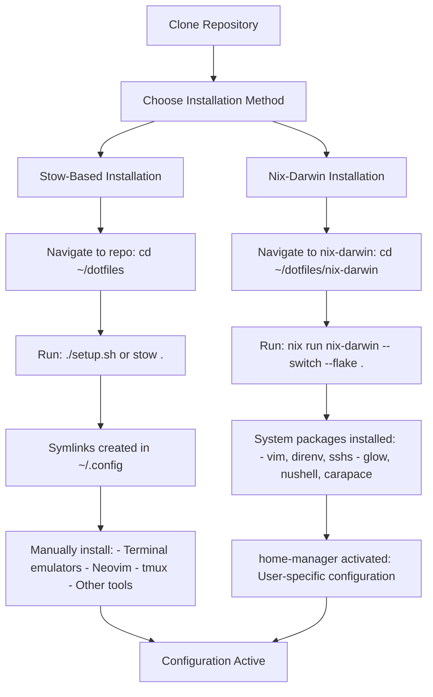
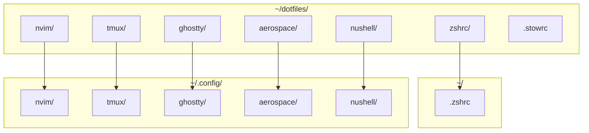
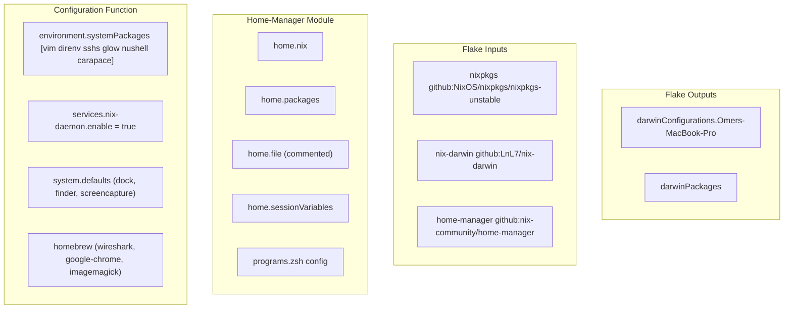
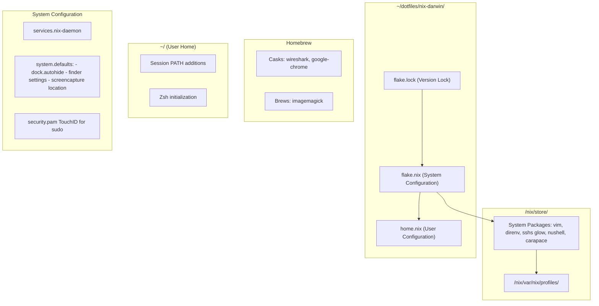

[/](/)

[/search](/search)

[/wiki](/wiki)

[/settings/members](/settings/members)

[/settings/support](/settings/support)

[Add repo](/repositories)

[All repos](/wiki)

[backend](/wiki/Klaudioz/backend)

[BH-Workflow-Engine](/wiki/Klaudioz/BH-Workflow-Engine)

[Buckhead_CRM](/wiki/Klaudioz/Buckhead_CRM)

[dotfiles](/wiki/Klaudioz/dotfiles)

[frontend](/wiki/Klaudioz/frontend)

[godeep.wiki-jb](/wiki/Klaudioz/godeep.wiki-jb)

[pi-mono-zero](/wiki/Klaudioz/pi-mono-zero)

[VirtualOracle](/wiki/Klaudioz/VirtualOracle)

# Installation and SetupLink copied!

> **Relevant source files**
> * [.stowrc](https://github.com/Klaudioz/dotfiles/blob/2febda55/.stowrc)
> * [README.md](https://github.com/Klaudioz/dotfiles/blob/2febda55/README.md)
> * [nix-darwin/flake.nix](https://github.com/Klaudioz/dotfiles/blob/2febda55/nix-darwin/flake.nix)
> * [nix-darwin/home.nix](https://github.com/Klaudioz/dotfiles/blob/2febda55/nix-darwin/home.nix)
> * [nix/nix.conf](https://github.com/Klaudioz/dotfiles/blob/2febda55/nix/nix.conf)
> * [setup.sh](https://github.com/Klaudioz/dotfiles/blob/2febda55/setup.sh)

## Purpose and ScopeLink copied!

This document provides comprehensive instructions for installing and deploying the dotfiles configuration on a macOS system. It covers two primary installation methods: the simpler `stow`-based symlinking approach and the more comprehensive `nix-darwin` declarative system configuration. The document includes prerequisites, step-by-step installation procedures, verification steps, and troubleshooting guidance.

For information about the architectural design and how components interact, see [System Architecture](#1.2). For detailed configuration of specific components, refer to their respective sections ([Nix-Darwin](#2), [Terminal Environment](#3), [Neovim](#4), [tmux](#5), [Window Management](#6)).

---

## PrerequisitesLink copied!

Before installing the dotfiles, ensure the following requirements are met:

| Requirement | Stow Method | Nix-Darwin Method | Installation Command |
| --- | --- | --- | --- |
| **macOS** | Required | Required | N/A (base OS) |
| **Git** | Required | Required | Pre-installed on macOS |
| **Xcode Command Line Tools** | Recommended | Required | `xcode-select --install` |
| **Stow** | Required | Optional | `brew install stow` |
| **Nix Package Manager** | Not required | Required | See below |
| **Homebrew** | Recommended | Recommended | `/bin/bash -c "$(curl -fsSL https://raw.githubusercontent.com/Homebrew/install/HEAD/install.sh)"` |

### Installing Nix (for Nix-Darwin Method)Link copied!

The Nix-Darwin method requires the Nix package manager with flake support. Install using the Determinate Systems installer:

```
curl --proto '=https' --tlsv1.2 -sSf -L https://install.determinate.systems/nix | sh -s -- install
```

This installer automatically enables flakes and the nix-daemon, configuring [nix/nix.conf L1-L2](https://github.com/Klaudioz/dotfiles/blob/2febda55/nix/nix.conf#L1-L2)

 experimental features.

**Sources:** [nix/nix.conf L1-L2](https://github.com/Klaudioz/dotfiles/blob/2febda55/nix/nix.conf#L1-L2)

---

## Installation Methods OverviewLink copied!



**Diagram: Installation Method Decision Flow**

The repository supports two installation approaches with different trade-offs:

* **Stow Method**: Simple symlinking via [setup.sh L1-L2](https://github.com/Klaudioz/dotfiles/blob/2febda55/setup.sh#L1-L2)  using GNU Stow with configuration from [.stowrc L1-L4](https://github.com/Klaudioz/dotfiles/blob/2febda55/.stowrc#L1-L4)  Provides manual control but requires separate installation of applications.
* **Nix-Darwin Method**: Declarative system configuration via [nix-darwin/flake.nix L1-L78](https://github.com/Klaudioz/dotfiles/blob/2febda55/nix-darwin/flake.nix#L1-L78)  that manages system packages, macOS defaults, and integrates home-manager for user configuration.

**Sources:** [README.md L1-L6](https://github.com/Klaudioz/dotfiles/blob/2febda55/README.md#L1-L6)

 [setup.sh L1-L2](https://github.com/Klaudioz/dotfiles/blob/2febda55/setup.sh#L1-L2)

 [.stowrc L1-L4](https://github.com/Klaudioz/dotfiles/blob/2febda55/.stowrc#L1-L4)

 [nix-darwin/flake.nix L1-L78](https://github.com/Klaudioz/dotfiles/blob/2febda55/nix-darwin/flake.nix#L1-L78)

---

## Method 1: Stow-Based InstallationLink copied!

### Step 1: Clone RepositoryLink copied!

```
git clone https://github.com/Klaudioz/dotfiles.git ~/dotfilescd ~/dotfiles
```

### Step 2: Understanding Stow ConfigurationLink copied!

The [.stowrc L1-L4](https://github.com/Klaudioz/dotfiles/blob/2febda55/.stowrc#L1-L4)

 file configures Stow behavior:

| Configuration | Value | Purpose |
| --- | --- | --- |
| `--target` | `~/.config` | Target directory for symlinks |
| `--ignore` | `.stowrc`, `DS_Store`, `atuin/*` | Files/directories to skip |

This targets `~/.config` as the destination, meaning subdirectories in the repository will be symlinked into `~/.config/[subdirectory]`.

### Step 3: Execute StowLink copied!

Run the provided setup script:

```
./setup.sh
```

Or execute `stow` directly:

```
stow .
```

Both commands perform the same operation, symlinking configuration directories into `~/.config/` according to [.stowrc L1](https://github.com/Klaudioz/dotfiles/blob/2febda55/.stowrc#L1-L1)

 rules.

### Step 4: Verify SymlinksLink copied!

```
ls -la ~/.config/nvimls -la ~/.config/tmuxls -la ~/.config/ghosttyls -la ~/.config/aerospace
```

Each should show symlinks pointing back to `~/dotfiles/[directory]`.

### Step 5: Install ApplicationsLink copied!

Stow only creates symlinks; applications must be installed separately:

```
# Terminal Emulatorsbrew install --cask ghostty wezterm# Shell Toolsbrew install nushell zsh starship# Terminal Multiplexerbrew install tmux# Editorbrew install neovim# Window Managerbrew install --cask nikitabobko/tap/aerospace# Additional Toolsbrew install stow fzf fd ripgrep bat zoxide atuin direnv
```

### Stow File Deployment MapLink copied!



**Diagram: Stow Symlink Deployment Mapping**

**Sources:** [README.md L3-L6](https://github.com/Klaudioz/dotfiles/blob/2febda55/README.md#L3-L6)

 [setup.sh L1-L2](https://github.com/Klaudioz/dotfiles/blob/2febda55/setup.sh#L1-L2)

 [.stowrc L1-L4](https://github.com/Klaudioz/dotfiles/blob/2febda55/.stowrc#L1-L4)

---

## Method 2: Nix-Darwin InstallationLink copied!

### Step 1: Clone RepositoryLink copied!

```
git clone https://github.com/Klaudioz/dotfiles.git ~/dotfilescd ~/dotfiles/nix-darwin
```

### Step 2: Understanding Flake StructureLink copied!

The [nix-darwin/flake.nix L1-L78](https://github.com/Klaudioz/dotfiles/blob/2febda55/nix-darwin/flake.nix#L1-L78)

 defines the system configuration:



**Diagram: Nix-Darwin Flake Structure and Data Flow**

Key components in [nix-darwin/flake.nix L1-L78](https://github.com/Klaudioz/dotfiles/blob/2febda55/nix-darwin/flake.nix#L1-L78)

:

* **Inputs** ([nix-darwin/flake.nix L4-L12](https://github.com/Klaudioz/dotfiles/blob/2febda55/nix-darwin/flake.nix#L4-L12) ): Specifies `nixpkgs`, `nix-darwin`, and `home-manager` sources
* **Configuration Function** ([nix-darwin/flake.nix L16-L60](https://github.com/Klaudioz/dotfiles/blob/2febda55/nix-darwin/flake.nix#L16-L60) ): Defines system packages, services, defaults, and Homebrew integration
* **Darwin Configuration** ([nix-darwin/flake.nix L63-L73](https://github.com/Klaudioz/dotfiles/blob/2febda55/nix-darwin/flake.nix#L63-L73) ): Creates `darwinConfigurations."Omers-MacBook-Pro"` for aarch64-darwin
* **Home-Manager Integration** ([nix-darwin/flake.nix L67-L71](https://github.com/Klaudioz/dotfiles/blob/2febda55/nix-darwin/flake.nix#L67-L71) ): Imports [nix-darwin/home.nix L1-L51](https://github.com/Klaudioz/dotfiles/blob/2febda55/nix-darwin/home.nix#L1-L51)  for user configuration

### Step 3: Customize ConfigurationLink copied!

Before building, customize the configuration:

1. **Update hostname** in [nix-darwin/flake.nix L63](https://github.com/Klaudioz/dotfiles/blob/2febda55/nix-darwin/flake.nix#L63-L63) : Change `"Omers-MacBook-Pro"` to your machine's hostname: ``` scutil --get ComputerName ```
2. **Update username** in [nix-darwin/flake.nix L36](https://github.com/Klaudioz/dotfiles/blob/2febda55/nix-darwin/flake.nix#L36-L36)  and [nix-darwin/home.nix L7-L8](https://github.com/Klaudioz/dotfiles/blob/2febda55/nix-darwin/home.nix#L7-L8) : Change `"omerxx"` to your username: ``` whoami ```
3. **Review system packages** in [nix-darwin/flake.nix L19-L27](https://github.com/Klaudioz/dotfiles/blob/2febda55/nix-darwin/flake.nix#L19-L27) : Add or remove packages as needed
4. **Review Homebrew casks** in [nix-darwin/flake.nix L53-L59](https://github.com/Klaudioz/dotfiles/blob/2febda55/nix-darwin/flake.nix#L53-L59) : Customize GUI applications

### Step 4: Build and Apply ConfigurationLink copied!

Execute the initial build and switch:

```
nix run nix-darwin -- switch --flake .
```

This command:

1. Evaluates [nix-darwin/flake.nix L1-L78](https://github.com/Klaudioz/dotfiles/blob/2febda55/nix-darwin/flake.nix#L1-L78)
2. Installs packages to `/nix/store/`
3. Applies system defaults from [nix-darwin/flake.nix L41-L49](https://github.com/Klaudioz/dotfiles/blob/2febda55/nix-darwin/flake.nix#L41-L49)
4. Activates home-manager from [nix-darwin/home.nix L1-L51](https://github.com/Klaudioz/dotfiles/blob/2febda55/nix-darwin/home.nix#L1-L51)
5. Creates activation scripts in `/nix/var/nix/profiles/`

### Step 5: Subsequent RebuildsLink copied!

After the initial installation, use the `darwin-rebuild` command:

```
# Switch to new configurationdarwin-rebuild switch --flake ~/dotfiles/nix-darwin# Build without switching (for testing)darwin-rebuild build --flake ~/dotfiles/nix-darwin# Show differences from current configurationdarwin-rebuild build --flake ~/dotfiles/nix-darwin && nix store diff-closures /nix/var/nix/profiles/system ./result
```

### Step 6: Understanding Home-Manager IntegrationLink copied!

The [nix-darwin/home.nix L1-L51](https://github.com/Klaudioz/dotfiles/blob/2febda55/nix-darwin/home.nix#L1-L51)

 manages user-level configuration:

| Configuration | Location | Purpose |
| --- | --- | --- |
| `home.username` | [nix-darwin/home.nix L7](https://github.com/Klaudioz/dotfiles/blob/2febda55/nix-darwin/home.nix#L7-L7) | User identity |
| `home.homeDirectory` | [nix-darwin/home.nix L8](https://github.com/Klaudioz/dotfiles/blob/2febda55/nix-darwin/home.nix#L8-L8) | Home directory path |
| `home.stateVersion` | [nix-darwin/home.nix L9](https://github.com/Klaudioz/dotfiles/blob/2febda55/nix-darwin/home.nix#L9-L9) | Schema version |
| `home.packages` | [nix-darwin/home.nix L12](https://github.com/Klaudioz/dotfiles/blob/2febda55/nix-darwin/home.nix#L12-L12) | User-specific packages |
| `home.file` | [nix-darwin/home.nix L17-L31](https://github.com/Klaudioz/dotfiles/blob/2febda55/nix-darwin/home.nix#L17-L31) | Dotfile management (commented out) |
| `home.sessionVariables` | [nix-darwin/home.nix L33](https://github.com/Klaudioz/dotfiles/blob/2febda55/nix-darwin/home.nix#L33-L33) | Environment variables |
| `home.sessionPath` | [nix-darwin/home.nix L36-L39](https://github.com/Klaudioz/dotfiles/blob/2febda55/nix-darwin/home.nix#L36-L39) | PATH additions |
| `programs.zsh` | [nix-darwin/home.nix L41-L50](https://github.com/Klaudioz/dotfiles/blob/2febda55/nix-darwin/home.nix#L41-L50) | Zsh configuration |

Note that `home.file` entries are commented out in [nix-darwin/home.nix L18-L30](https://github.com/Klaudioz/dotfiles/blob/2febda55/nix-darwin/home.nix#L18-L30)

 suggesting that configuration files are managed by Stow or directly in `~/.config/` rather than through home-manager declarative file management.

### Nix-Darwin System Configuration MappingLink copied!



**Diagram: Nix-Darwin Configuration to System Mapping**

**Sources:** [nix-darwin/flake.nix L1-L78](https://github.com/Klaudioz/dotfiles/blob/2febda55/nix-darwin/flake.nix#L1-L78)

 [nix-darwin/home.nix L1-L51](https://github.com/Klaudioz/dotfiles/blob/2febda55/nix-darwin/home.nix#L1-L51)

---

## Post-Installation ConfigurationLink copied!

### Verify System StateLink copied!

After installation, verify the configuration is active:

```
# Check Nix-Darwin system profile (if using Nix-Darwin)ls -la /run/current-system# Verify symlinks (if using Stow)ls -la ~/.config/nvimls -la ~/.config/tmux# Check installed packageswhich nvim tmux nu zsh# Verify Nix daemon (if using Nix-Darwin)launchctl list | grep nix-daemon# Check home-manager generation (if using Nix-Darwin)home-manager generations
```

### Initialize Plugin ManagersLink copied!

Several components use plugin managers that require initialization:

#### Neovim (lazy.nvim)

```
# Launch Neovim to trigger lazy.nvim bootstrapnvim# Install plugins (will auto-trigger on first launch):Lazy install
```

#### tmux (tpm)

```
# Launch tmuxtmux# Install tmux plugins (prefix + I)# Default prefix is Ctrl+Space (custom configuration)
```

#### Shell Tools

```
# Initialize zoxide databasecd ~cd ~/Documentscd ~/Downloads# Initialize atuin (requires account creation)atuin register -u <username> -e <email>atuin login -u <username>atuin sync
```

### Configure Git IdentityLink copied!

```
git config --global user.name "Your Name"git config --global user.email "your.email@example.com"
```

**Sources:** Configuration initialization patterns observed in system architecture diagrams

---

## Installation Comparison MatrixLink copied!

| Aspect | Stow Method | Nix-Darwin Method |
| --- | --- | --- |
| **Complexity** | Low | High |
| **Setup Time** | 10-15 minutes | 20-30 minutes |
| **Reproducibility** | Manual reinstall required | Fully reproducible from flake.lock |
| **System Integration** | None (symlinks only) | Deep (manages system packages, defaults) |
| **Update Process** | `git pull && stow .` | `darwin-rebuild switch --flake .` |
| **Rollback** | Git checkout only | `darwin-rebuild switch --rollback` |
| **Package Management** | Manual via Homebrew | Declarative via Nix + Homebrew |
| **macOS Defaults** | Manual via `defaults write` | Declarative via system.defaults |
| **Multi-Machine** | Requires manual setup each time | Single flake for all machines |
| **Learning Curve** | Minimal | Steep (Nix language) |
| **Dependencies** | Stow only | Nix, Nix-Darwin, Home-Manager |

**Sources:** Comparison based on installation method analysis

---

## TroubleshootingLink copied!

### Stow-Related IssuesLink copied!

**Problem**: `stow: ERROR: Target ~/.config/nvim already exists`

**Solution**: Remove existing configurations before stowing:

```
rm -rf ~/.config/nvimstow .
```

**Problem**: Stow ignores certain directories

**Solution**: Check [.stowrc L1-L4](https://github.com/Klaudioz/dotfiles/blob/2febda55/.stowrc#L1-L4)

 for ignore patterns. The configuration excludes `.stowrc`, `DS_Store`, and `atuin/*`.

### Nix-Darwin IssuesLink copied!

**Problem**: `error: experimental Nix feature 'flakes' is disabled`

**Solution**: Ensure [nix/nix.conf L1](https://github.com/Klaudioz/dotfiles/blob/2febda55/nix/nix.conf#L1-L1)

 contains `experimental-features = nix-command flakes`, or the Determinate Systems installer was used.

**Problem**: `error: unable to find user 'omerxx'`

**Solution**: Update username in [nix-darwin/flake.nix L36](https://github.com/Klaudioz/dotfiles/blob/2febda55/nix-darwin/flake.nix#L36-L36)

 and [nix-darwin/home.nix L7](https://github.com/Klaudioz/dotfiles/blob/2febda55/nix-darwin/home.nix#L7-L7)

 to match your system username.

**Problem**: Build fails with permission errors

**Solution**: Ensure nix-daemon is running and build-users exist:

```
sudo launchctl kickstart -k system/org.nixos.nix-daemondscl . -list /Users | grep nixbld
```

**Problem**: Home-Manager activation fails

**Solution**: Check for backup files created by [nix-darwin/flake.nix L37](https://github.com/Klaudioz/dotfiles/blob/2febda55/nix-darwin/flake.nix#L37-L37)

 (`home-manager.backupFileExtension = "backup"`). Remove conflicting files:

```sql
find ~/ -name "*.backup" -delete
```

### General IssuesLink copied!

**Problem**: Shell completions not working

**Solution**: Ensure shell initialization is complete. For Zsh, verify [nix-darwin/home.nix L43-L48](https://github.com/Klaudioz/dotfiles/blob/2febda55/nix-darwin/home.nix#L43-L48)

 adds Nix paths. For Nushell, check Carapace is installed per [nix-darwin/flake.nix L26](https://github.com/Klaudioz/dotfiles/blob/2febda55/nix-darwin/flake.nix#L26-L26)

**Problem**: Applications can't find configurations

**Solution**: Verify symlinks or Nix store paths:

```
# For Stowls -la ~/.config/nvim# Should show: nvim -> ../dotfiles/nvim# For Nix-Darwinecho $PATH# Should include: /run/current-system/sw/bin
```

**Sources:** Common installation issues and solutions

---

## Next StepsLink copied!

After successful installation:

1. **Review System Architecture** ([#1.2](#1.2)): Understand how components interact
2. **Configure Nix-Darwin** ([#2](#2)): Customize system packages and settings
3. **Set Up Shell Environment** ([#3](#3)): Configure Nushell or Zsh preferences
4. **Customize Neovim** ([#4](#4)): Add plugins and configure LSP servers
5. **Configure tmux** ([#5](#5)): Customize multiplexer settings and keybindings
6. **Set Up Window Management** ([#6](#6)): Configure AeroSpace and skhd hotkeys

**Sources:** Navigation to related documentation sections

Refresh this wiki

Last indexed: 18 December 2025 ([2febda](https://github.com/Klaudioz/dotfiles/commit/2febda55))

### On this page

* [Installation and Setup](#1.1-installation-and-setup)
* [Purpose and Scope](#1.1-purpose-and-scope)
* [Prerequisites](#1.1-prerequisites)
* [Installing Nix (for Nix-Darwin Method)](#1.1-installing-nix-for-nix-darwin-method)
* [Installation Methods Overview](#1.1-installation-methods-overview)
* [Method 1: Stow-Based Installation](#1.1-method-1-stow-based-installation)
* [Step 1: Clone Repository](#1.1-step-1-clone-repository)
* [Step 2: Understanding Stow Configuration](#1.1-step-2-understanding-stow-configuration)
* [Step 3: Execute Stow](#1.1-step-3-execute-stow)
* [Step 4: Verify Symlinks](#1.1-step-4-verify-symlinks)
* [Step 5: Install Applications](#1.1-step-5-install-applications)
* [Stow File Deployment Map](#1.1-stow-file-deployment-map)
* [Method 2: Nix-Darwin Installation](#1.1-method-2-nix-darwin-installation)
* [Step 1: Clone Repository](#1.1-step-1-clone-repository-1)
* [Step 2: Understanding Flake Structure](#1.1-step-2-understanding-flake-structure)
* [Step 3: Customize Configuration](#1.1-step-3-customize-configuration)
* [Step 4: Build and Apply Configuration](#1.1-step-4-build-and-apply-configuration)
* [Step 5: Subsequent Rebuilds](#1.1-step-5-subsequent-rebuilds)
* [Step 6: Understanding Home-Manager Integration](#1.1-step-6-understanding-home-manager-integration)
* [Nix-Darwin System Configuration Mapping](#1.1-nix-darwin-system-configuration-mapping)
* [Post-Installation Configuration](#1.1-post-installation-configuration)
* [Verify System State](#1.1-verify-system-state)
* [Initialize Plugin Managers](#1.1-initialize-plugin-managers)
* [Configure Git Identity](#1.1-configure-git-identity)
* [Installation Comparison Matrix](#1.1-installation-comparison-matrix)
* [Troubleshooting](#1.1-troubleshooting)
* [Stow-Related Issues](#1.1-stow-related-issues)
* [Nix-Darwin Issues](#1.1-nix-darwin-issues)
* [General Issues](#1.1-general-issues)
* [Next Steps](#1.1-next-steps)

Ask Devin about dotfiles