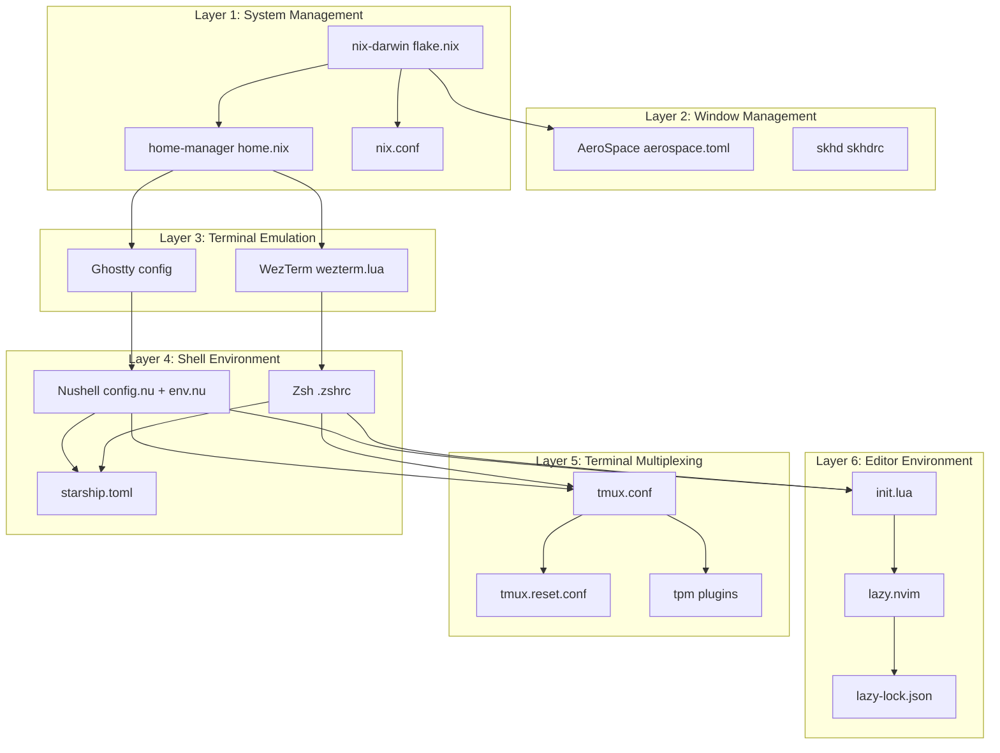
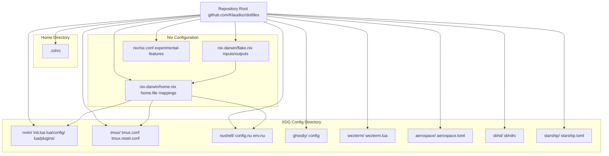
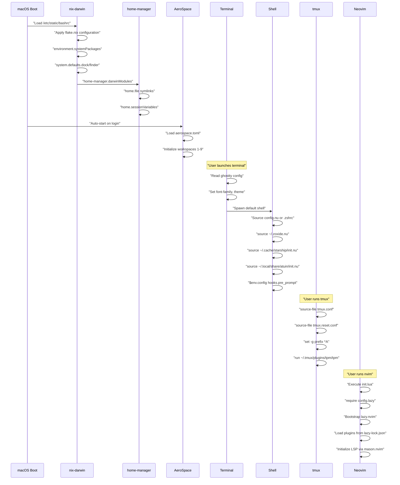
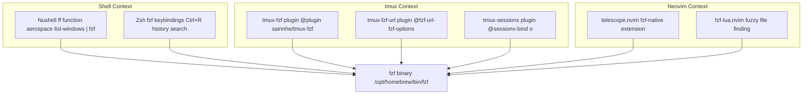
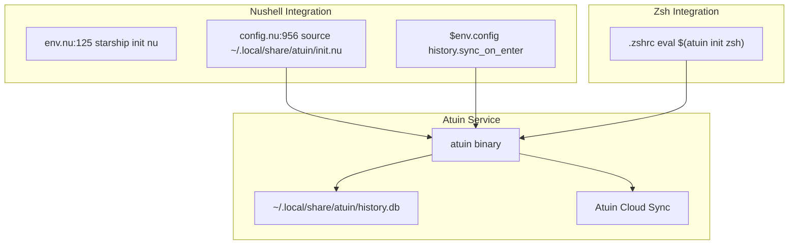
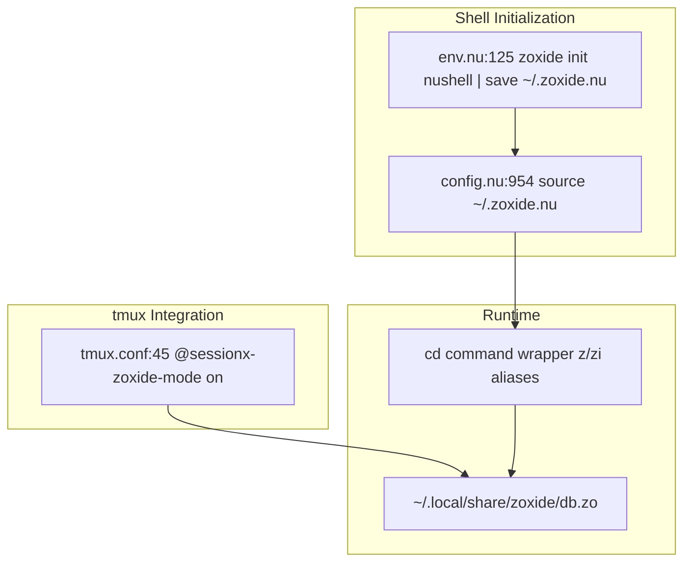
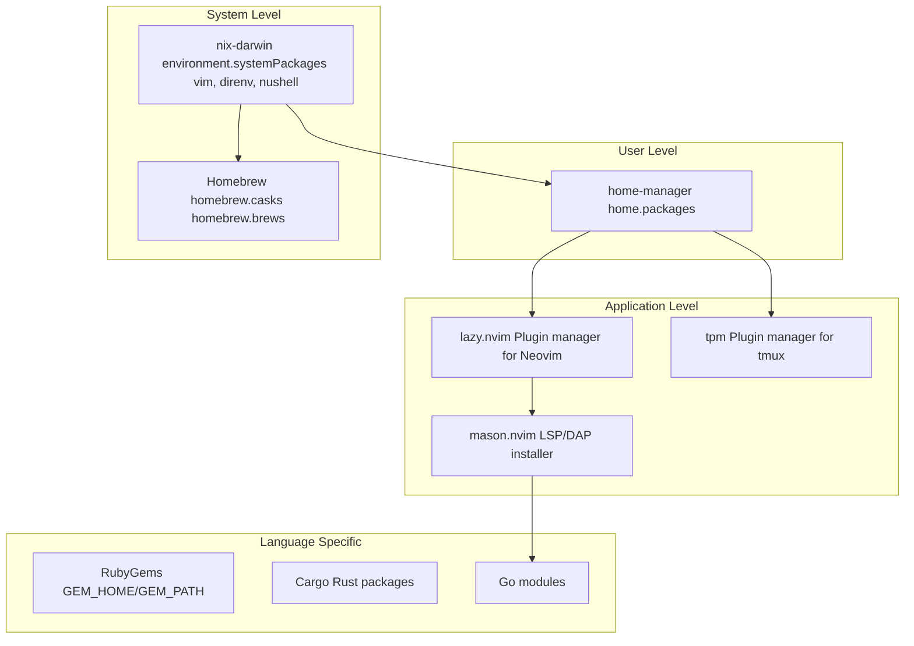
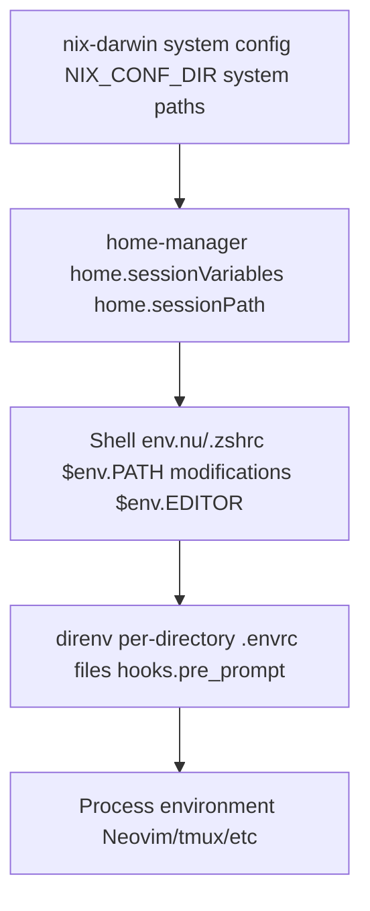
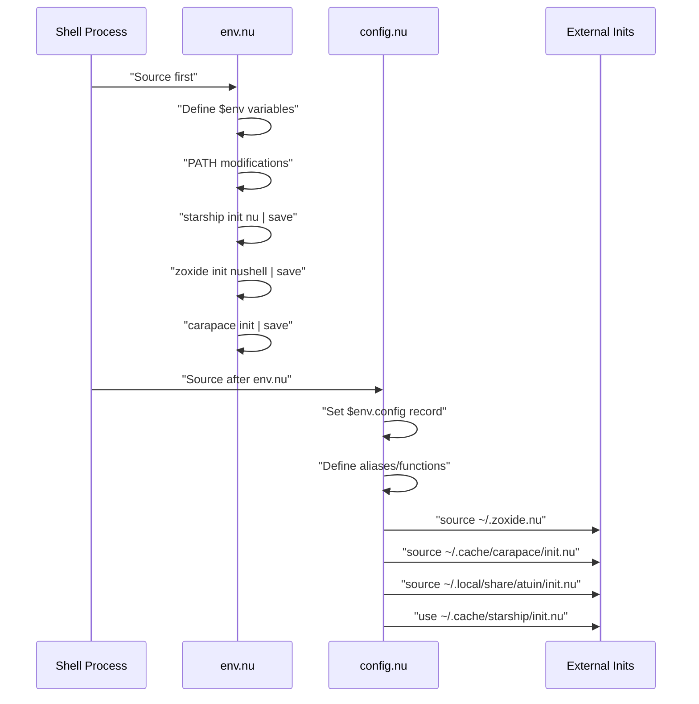
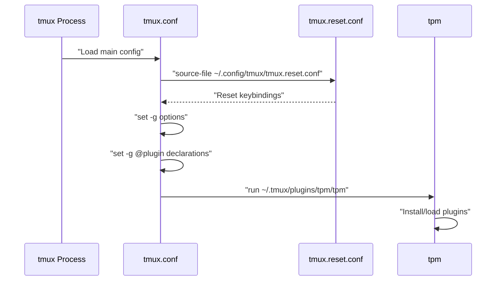

[/](/)

[/search](/search)

[/wiki](/wiki)

[/settings/members](/settings/members)

[/settings/support](/settings/support)

[Add repo](/repositories)

[All repos](/wiki)

[backend](/wiki/Klaudioz/backend)

[BH-Workflow-Engine](/wiki/Klaudioz/BH-Workflow-Engine)

[Buckhead_CRM](/wiki/Klaudioz/Buckhead_CRM)

[dotfiles](/wiki/Klaudioz/dotfiles)

[frontend](/wiki/Klaudioz/frontend)

[godeep.wiki-jb](/wiki/Klaudioz/godeep.wiki-jb)

[pi-mono-zero](/wiki/Klaudioz/pi-mono-zero)

[VirtualOracle](/wiki/Klaudioz/VirtualOracle)

# System ArchitectureLink copied!

> **Relevant source files**
> * [.gitignore](https://github.com/Klaudioz/dotfiles/blob/2febda55/.gitignore)
> * [nix-darwin/flake.nix](https://github.com/Klaudioz/dotfiles/blob/2febda55/nix-darwin/flake.nix)
> * [nix-darwin/home.nix](https://github.com/Klaudioz/dotfiles/blob/2febda55/nix-darwin/home.nix)
> * [nix/nix.conf](https://github.com/Klaudioz/dotfiles/blob/2febda55/nix/nix.conf)
> * [nushell/config.nu](https://github.com/Klaudioz/dotfiles/blob/2febda55/nushell/config.nu)
> * [nushell/env.nu](https://github.com/Klaudioz/dotfiles/blob/2febda55/nushell/env.nu)
> * [nvim/init.lua](https://github.com/Klaudioz/dotfiles/blob/2febda55/nvim/init.lua)
> * [tmux/tmux.conf](https://github.com/Klaudioz/dotfiles/blob/2febda55/tmux/tmux.conf)

## Purpose and ScopeLink copied!

This document provides a comprehensive architectural overview of the dotfiles system, detailing how components are organized into distinct layers and how they interact at runtime. It covers the structural relationships between configuration files, the initialization sequence from system boot to editor launch, and the integration patterns that enable cross-tool functionality. For installation procedures, see [Installation and Setup](#1.1). For detailed configuration of individual subsystems, see [System Configuration with Nix-Darwin](#2), [Terminal Environment](#3), [Neovim Editor Configuration](#4), [Terminal Multiplexing with tmux](#5), and [Window Management](#6).

---

## Architectural LayersLink copied!

The dotfiles system implements a six-layer architecture where each layer builds upon the previous one, with clear separation of concerns and well-defined integration points.

### Layer HierarchyLink copied!

**Sources:** [nix-darwin/flake.nix L1-L78](https://github.com/Klaudioz/dotfiles/blob/2febda55/nix-darwin/flake.nix#L1-L78)

 [nix-darwin/home.nix L1-L51](https://github.com/Klaudioz/dotfiles/blob/2febda55/nix-darwin/home.nix#L1-L51)

 [tmux/tmux.conf L1-L70](https://github.com/Klaudioz/dotfiles/blob/2febda55/tmux/tmux.conf#L1-L70)

 [nvim/init.lua L1-L4](https://github.com/Klaudioz/dotfiles/blob/2febda55/nvim/init.lua#L1-L4)

 [nushell/config.nu L1-L973](https://github.com/Klaudioz/dotfiles/blob/2febda55/nushell/config.nu#L1-L973)

 [nushell/env.nu L1-L134](https://github.com/Klaudioz/dotfiles/blob/2febda55/nushell/env.nu#L1-L134)

---

## Configuration File HierarchyLink copied!

The system uses a dual-approach configuration strategy: declarative Nix-based configuration coexisting with traditional dotfile symlinking. Configuration files are organized by tool under `~/.config/` with version control at the repository root.

### Configuration Directory StructureLink copied!

**Configuration Deployment Methods:**

| Method | Files | Location | Command |
| --- | --- | --- | --- |
| Nix-Darwin | `flake.nix`, `home.nix` | `/nix/store/*` | `darwin-rebuild switch --flake` |
| Home Manager | `home.nix` mappings | `~/.config/*` | `home-manager switch` |
| Stow | All dotfiles | `~/.config/*` | `stow -d ~/dotfiles -t ~` |

**Sources:** [nix-darwin/flake.nix L1-L78](https://github.com/Klaudioz/dotfiles/blob/2febda55/nix-darwin/flake.nix#L1-L78)

 [nix-darwin/home.nix L17-L31](https://github.com/Klaudioz/dotfiles/blob/2febda55/nix-darwin/home.nix#L17-L31)

 [nix/nix.conf L1-L3](https://github.com/Klaudioz/dotfiles/blob/2febda55/nix/nix.conf#L1-L3)

---

## System Initialization SequenceLink copied!

The system initializes in a well-defined sequence, with each component waiting for its dependencies to be ready before starting.

### Boot to Editor FlowLink copied!

**Key Configuration Variables:**

* **Nix-Darwin System**: `environment.systemPackages`, `system.defaults`, `services.nix-daemon.enable` ([nix-darwin/flake.nix L19-L28](https://github.com/Klaudioz/dotfiles/blob/2febda55/nix-darwin/flake.nix#L19-L28) )
* **Home Manager**: `home.file`, `home.sessionVariables`, `home.sessionPath` ([nix-darwin/home.nix L17-L39](https://github.com/Klaudioz/dotfiles/blob/2febda55/nix-darwin/home.nix#L17-L39) )
* **Nushell**: `$env.config`, `$env.EDITOR`, `$env.PATH` ([nushell/config.nu L142-L262](https://github.com/Klaudioz/dotfiles/blob/2febda55/nushell/config.nu#L142-L262)  [nushell/env.nu L33-L134](https://github.com/Klaudioz/dotfiles/blob/2febda55/nushell/env.nu#L33-L134) )
* **tmux**: `set -g prefix`, `set-option -g default-terminal`, `set -g @plugin` ([tmux/tmux.conf L5-L31](https://github.com/Klaudioz/dotfiles/blob/2febda55/tmux/tmux.conf#L5-L31) )
* **Neovim**: `vim.g.codeium_platform_override`, `require("config.lazy")` ([nvim/init.lua L2-L3](https://github.com/Klaudioz/dotfiles/blob/2febda55/nvim/init.lua#L2-L3) )

**Sources:** [nix-darwin/flake.nix L14-L60](https://github.com/Klaudioz/dotfiles/blob/2febda55/nix-darwin/flake.nix#L14-L60)

 [nushell/env.nu L100-L134](https://github.com/Klaudioz/dotfiles/blob/2febda55/nushell/env.nu#L100-L134)

 [tmux/tmux.conf L1-L7](https://github.com/Klaudioz/dotfiles/blob/2febda55/tmux/tmux.conf#L1-L7)

 [nvim/init.lua L1-L4](https://github.com/Klaudioz/dotfiles/blob/2febda55/nvim/init.lua#L1-L4)

---

## Core Integration PatternsLink copied!

The system implements several cross-cutting integration patterns that enable tools to work cohesively.

### Integration Pattern: Fuzzy Finding with fzfLink copied!

**Integration Mechanisms:**

| Integration Type | Source Component | Target Component | Method |
| --- | --- | --- | --- |
| Environment Variables | Nushell `env.nu` | All processes | `$env.EDITOR = "nvim"` |
| Shell Aliases | Nushell `config.nu` | Command execution | `alias v = nvim` |
| Shell Functions | Nushell `config.nu` | AeroSpace | `aerospace list-windows |
| tmux Keybindings | `tmux.conf` | Shell commands | `bind-key -n M-g run-shell "tmux neww..."` |
| Plugin Options | `tmux.conf` | tpm plugins | `set -g @sessionx-bind 'o'` |
| Lua Configuration | `init.lua` | Neovim plugins | `vim.g.codeium_platform_override` |

**Sources:** [nushell/config.nu L918-L920](https://github.com/Klaudioz/dotfiles/blob/2febda55/nushell/config.nu#L918-L920)

 [tmux/tmux.conf L18-L46](https://github.com/Klaudioz/dotfiles/blob/2febda55/tmux/tmux.conf#L18-L46)

 [nvim/init.lua L3](https://github.com/Klaudioz/dotfiles/blob/2febda55/nvim/init.lua#L3-L3)

---

### Integration Pattern: Shell History with AtuinLink copied!

**Sources:** [nushell/config.nu L190-L195](https://github.com/Klaudioz/dotfiles/blob/2febda55/nushell/config.nu#L190-L195)

 [nushell/config.nu L956](https://github.com/Klaudioz/dotfiles/blob/2febda55/nushell/config.nu#L956-L956)

 [nushell/env.nu L124-L125](https://github.com/Klaudioz/dotfiles/blob/2febda55/nushell/env.nu#L124-L125)

---

### Integration Pattern: Directory Navigation with zoxideLink copied!

**Sources:** [nushell/env.nu L125](https://github.com/Klaudioz/dotfiles/blob/2febda55/nushell/env.nu#L125-L125)

 [nushell/config.nu L954](https://github.com/Klaudioz/dotfiles/blob/2febda55/nushell/config.nu#L954-L954)

 [tmux/tmux.conf L45](https://github.com/Klaudioz/dotfiles/blob/2febda55/tmux/tmux.conf#L45-L45)

---

## Component DependenciesLink copied!

The following table maps the primary dependencies between major components, showing which configuration keys or mechanisms establish the connections.

| Dependent Component | Dependency | Connection Mechanism | Configuration Location |
| --- | --- | --- | --- |
| Nushell | Starship | `starship init nu` piped to file | [nushell/env.nu L124](https://github.com/Klaudioz/dotfiles/blob/2febda55/nushell/env.nu#L124-L124) |
| Nushell | zoxide | `zoxide init nushell` piped to file | [nushell/env.nu L125](https://github.com/Klaudioz/dotfiles/blob/2febda55/nushell/env.nu#L125-L125) |
| Nushell | Atuin | `source ~/.local/share/atuin/init.nu` | [nushell/config.nu L956](https://github.com/Klaudioz/dotfiles/blob/2febda55/nushell/config.nu#L956-L956) |
| Nushell | Carapace | `source ~/.cache/carapace/init.nu` | [nushell/config.nu L955](https://github.com/Klaudioz/dotfiles/blob/2febda55/nushell/config.nu#L955-L955) |
| Nushell | direnv | `hooks.pre_prompt` with `direnv export json` | [nushell/config.nu L280-L290](https://github.com/Klaudioz/dotfiles/blob/2febda55/nushell/config.nu#L280-L290) |
| tmux | tpm | `run '~/.tmux/plugins/tpm/tpm'` | [tmux/tmux.conf L69](https://github.com/Klaudioz/dotfiles/blob/2febda55/tmux/tmux.conf#L69-L69) |
| tmux | resurrect | `set -g @plugin 'tmux-plugins/tmux-resurrect'` | [tmux/tmux.conf L24](https://github.com/Klaudioz/dotfiles/blob/2febda55/tmux/tmux.conf#L24-L24) |
| tmux | continuum | `set -g @plugin 'tmux-plugins/tmux-continuum'` | [tmux/tmux.conf L25](https://github.com/Klaudioz/dotfiles/blob/2febda55/tmux/tmux.conf#L25-L25) |
| tmux | sessionx | `set -g @plugin 'omerxx/tmux-sessionx'` | [tmux/tmux.conf L30](https://github.com/Klaudioz/dotfiles/blob/2febda55/tmux/tmux.conf#L30-L30) |
| tmux | Neovim | `set -g @resurrect-strategy-nvim 'session'` | [tmux/tmux.conf L49](https://github.com/Klaudioz/dotfiles/blob/2febda55/tmux/tmux.conf#L49-L49) |
| Neovim | lazy.nvim | `require("config.lazy")` | [nvim/init.lua L2](https://github.com/Klaudioz/dotfiles/blob/2febda55/nvim/init.lua#L2-L2) |
| Neovim | Codeium | `vim.g.codeium_platform_override = "mac-arm64"` | [nvim/init.lua L3](https://github.com/Klaudioz/dotfiles/blob/2febda55/nvim/init.lua#L3-L3) |
| Home Manager | Nix-Darwin | `home-manager.darwinModules.home-manager` | [nix-darwin/flake.nix L67](https://github.com/Klaudioz/dotfiles/blob/2febda55/nix-darwin/flake.nix#L67-L67) |
| Home Manager | User configs | `home-manager.users.omerxx = import ./home.nix` | [nix-darwin/flake.nix L70](https://github.com/Klaudioz/dotfiles/blob/2febda55/nix-darwin/flake.nix#L70-L70) |

**Sources:** [nushell/config.nu L953-L957](https://github.com/Klaudioz/dotfiles/blob/2febda55/nushell/config.nu#L953-L957)

 [nushell/env.nu L123-L131](https://github.com/Klaudioz/dotfiles/blob/2febda55/nushell/env.nu#L123-L131)

 [tmux/tmux.conf L21-L49](https://github.com/Klaudioz/dotfiles/blob/2febda55/tmux/tmux.conf#L21-L49)

 [nvim/init.lua L1-L4](https://github.com/Klaudioz/dotfiles/blob/2febda55/nvim/init.lua#L1-L4)

 [nix-darwin/flake.nix L67-L71](https://github.com/Klaudioz/dotfiles/blob/2febda55/nix-darwin/flake.nix#L67-L71)

---

## Package Management StrategyLink copied!

The system employs a multi-layered package management approach combining Nix, Homebrew, and language-specific package managers.

### Package Manager HierarchyLink copied!

**Nix System Packages** ([nix-darwin/flake.nix L19-L27](https://github.com/Klaudioz/dotfiles/blob/2febda55/nix-darwin/flake.nix#L19-L27)

):

* `pkgs.vim`, `pkgs.direnv`, `pkgs.sshs`, `pkgs.glow`, `pkgs.nushell`, `pkgs.carapace`

**Homebrew Casks** ([nix-darwin/flake.nix L53-L56](https://github.com/Klaudioz/dotfiles/blob/2febda55/nix-darwin/flake.nix#L53-L56)

):

* `wireshark`, `google-chrome`

**Homebrew Brews** ([nix-darwin/flake.nix L57-L59](https://github.com/Klaudioz/dotfiles/blob/2febda55/nix-darwin/flake.nix#L57-L59)

):

* `imagemagick`

**Ruby Gem Configuration** ([nushell/config.nu L959-L970](https://github.com/Klaudioz/dotfiles/blob/2febda55/nushell/config.nu#L959-L970)

):

* `$env.GEM_HOME = $gem_home`
* `$env.GEM_PATH = $gem_home`
* Path: `~/.gem/ruby/3.4.0/bin`

**Sources:** [nix-darwin/flake.nix L16-L59](https://github.com/Klaudioz/dotfiles/blob/2febda55/nix-darwin/flake.nix#L16-L59)

 [nushell/config.nu L959-L971](https://github.com/Klaudioz/dotfiles/blob/2febda55/nushell/config.nu#L959-L971)

---

## Environment Variable PropagationLink copied!

Environment variables flow through the system in a cascading manner, with each layer potentially overriding or augmenting values from previous layers.

**Key Environment Variables:**

| Variable | Set By | Value | Location |
| --- | --- | --- | --- |
| `NIX_CONF_DIR` | Nushell env.nu | `/Users/omerxx/.config/nix` | [nushell/env.nu L128](https://github.com/Klaudioz/dotfiles/blob/2febda55/nushell/env.nu#L128-L128) |
| `STARSHIP_CONFIG` | Nushell env.nu | `/Users/omerxx/.config/starship/starship.toml` | [nushell/env.nu L127](https://github.com/Klaudioz/dotfiles/blob/2febda55/nushell/env.nu#L127-L127) |
| `EDITOR` | Nushell env.nu | `nvim` | [nushell/env.nu L133](https://github.com/Klaudioz/dotfiles/blob/2febda55/nushell/env.nu#L133-L133) |
| `GEM_HOME` | Nushell config.nu | `~/.gem/ruby/3.4.0` | [nushell/config.nu L964](https://github.com/Klaudioz/dotfiles/blob/2febda55/nushell/config.nu#L964-L964) |
| `CARAPACE_BRIDGES` | Nushell env.nu | `zsh,fish,bash,inshellisense` | [nushell/env.nu L129](https://github.com/Klaudioz/dotfiles/blob/2febda55/nushell/env.nu#L129-L129) |
| `DIRENV_LOG_FORMAT` | Nushell config.nu | `""` (empty) | [nushell/config.nu L971](https://github.com/Klaudioz/dotfiles/blob/2febda55/nushell/config.nu#L971-L971) |

**PATH Construction** ([nushell/env.nu L100-L109](https://github.com/Klaudioz/dotfiles/blob/2febda55/nushell/env.nu#L100-L109)

):

* Conditional on `IN_NIX_SHELL` and `DEVBOX_SHELL_ENABLED` not present
* Appends: `/opt/homebrew/bin`, `/run/current-system/sw/bin`, `~/.local/bin`, ruby paths

**Sources:** [nushell/env.nu L100-L134](https://github.com/Klaudioz/dotfiles/blob/2febda55/nushell/env.nu#L100-L134)

 [nushell/config.nu L959-L971](https://github.com/Klaudioz/dotfiles/blob/2febda55/nushell/config.nu#L959-L971)

---

## Configuration File Loading OrderLink copied!

Understanding the exact order in which configuration files are loaded is critical for debugging and customization.

### Nushell Configuration ChainLink copied!

**Load Order:**

1. `env.nu` - Environment setup ([nushell/env.nu L1-L134](https://github.com/Klaudioz/dotfiles/blob/2febda55/nushell/env.nu#L1-L134) )
2. Init script generation (`starship init`, `zoxide init`, `carapace`) ([nushell/env.nu L123-L131](https://github.com/Klaudioz/dotfiles/blob/2febda55/nushell/env.nu#L123-L131) )
3. `config.nu` - Configuration record ([nushell/config.nu L142-L902](https://github.com/Klaudioz/dotfiles/blob/2febda55/nushell/config.nu#L142-L902) )
4. Sourcing external inits ([nushell/config.nu L953-L957](https://github.com/Klaudioz/dotfiles/blob/2febda55/nushell/config.nu#L953-L957) )
5. Ruby environment setup ([nushell/config.nu L959-L970](https://github.com/Klaudioz/dotfiles/blob/2febda55/nushell/config.nu#L959-L970) )

### tmux Configuration ChainLink copied!

**Load Order:**

1. `tmux.reset.conf` sourced first ([tmux/tmux.conf L1](https://github.com/Klaudioz/dotfiles/blob/2febda55/tmux/tmux.conf#L1-L1) )
2. Terminal options (`default-terminal`, `terminal-overrides`) ([tmux/tmux.conf L2-L3](https://github.com/Klaudioz/dotfiles/blob/2febda55/tmux/tmux.conf#L2-L3) )
3. Prefix and base settings ([tmux/tmux.conf L5-L16](https://github.com/Klaudioz/dotfiles/blob/2febda55/tmux/tmux.conf#L5-L16) )
4. Plugin options (`@fzf-url-*`, `@sessionx-*`, etc.) ([tmux/tmux.conf L18-L67](https://github.com/Klaudioz/dotfiles/blob/2febda55/tmux/tmux.conf#L18-L67) )
5. tpm execution ([tmux/tmux.conf L69](https://github.com/Klaudioz/dotfiles/blob/2febda55/tmux/tmux.conf#L69-L69) )

**Sources:** [tmux/tmux.conf L1-L70](https://github.com/Klaudioz/dotfiles/blob/2febda55/tmux/tmux.conf#L1-L70)

 [nushell/env.nu L1-L134](https://github.com/Klaudioz/dotfiles/blob/2febda55/nushell/env.nu#L1-L134)

 [nushell/config.nu L1-L973](https://github.com/Klaudioz/dotfiles/blob/2febda55/nushell/config.nu#L1-L973)

---

## System State PersistenceLink copied!

The system implements multiple persistence mechanisms to maintain state across sessions and reboots.

| State Type | Persistence Mechanism | Storage Location | Configuration |
| --- | --- | --- | --- |
| Nix packages | `flake.lock` | Version controlled | Automatic |
| Neovim plugins | `lazy-lock.json` | Version controlled | Automatic |
| tmux sessions | tmux-resurrect | `~/.tmux/resurrect/` | [tmux/tmux.conf L24](https://github.com/Klaudioz/dotfiles/blob/2febda55/tmux/tmux.conf#L24-L24) |
| tmux auto-restore | tmux-continuum | Background save | [tmux/tmux.conf L25-L48](https://github.com/Klaudioz/dotfiles/blob/2febda55/tmux/tmux.conf#L25-L48) |
| Shell history | Atuin | `~/.local/share/atuin/` | Synced to cloud |
| Directory frecency | zoxide | `~/.local/share/zoxide/db.zo` | Local database |
| Neovim sessions | persistence.nvim | Plugin-managed | Per-directory |

**tmux Persistence Configuration:**

* Resurrect strategy: `set -g @resurrect-strategy-nvim 'session'` ([tmux/tmux.conf L49](https://github.com/Klaudioz/dotfiles/blob/2febda55/tmux/tmux.conf#L49-L49) )
* Auto-restore: `set -g @continuum-restore 'on'` ([tmux/tmux.conf L48](https://github.com/Klaudioz/dotfiles/blob/2febda55/tmux/tmux.conf#L48-L48) )

**Nushell History Settings** ([nushell/config.nu L190-L195](https://github.com/Klaudioz/dotfiles/blob/2febda55/nushell/config.nu#L190-L195)

):

* Max size: `100_000`
* Sync on enter: `true`
* File format: `plaintext`
* Isolation: `false`

**Sources:** [tmux/tmux.conf L24-L49](https://github.com/Klaudioz/dotfiles/blob/2febda55/tmux/tmux.conf#L24-L49)

 [nushell/config.nu L190-L195](https://github.com/Klaudioz/dotfiles/blob/2febda55/nushell/config.nu#L190-L195)

Refresh this wiki

Last indexed: 18 December 2025 ([2febda](https://github.com/Klaudioz/dotfiles/commit/2febda55))

### On this page

* [System Architecture](#1.2-system-architecture)
* [Purpose and Scope](#1.2-purpose-and-scope)
* [Architectural Layers](#1.2-architectural-layers)
* [Layer Hierarchy](#1.2-layer-hierarchy)
* [Configuration File Hierarchy](#1.2-configuration-file-hierarchy)
* [Configuration Directory Structure](#1.2-configuration-directory-structure)
* [System Initialization Sequence](#1.2-system-initialization-sequence)
* [Boot to Editor Flow](#1.2-boot-to-editor-flow)
* [Core Integration Patterns](#1.2-core-integration-patterns)
* [Integration Pattern: Fuzzy Finding with fzf](#1.2-integration-pattern-fuzzy-finding-with-fzf)
* [Integration Pattern: Shell History with Atuin](#1.2-integration-pattern-shell-history-with-atuin)
* [Integration Pattern: Directory Navigation with zoxide](#1.2-integration-pattern-directory-navigation-with-zoxide)
* [Component Dependencies](#1.2-component-dependencies)
* [Package Management Strategy](#1.2-package-management-strategy)
* [Package Manager Hierarchy](#1.2-package-manager-hierarchy)
* [Environment Variable Propagation](#1.2-environment-variable-propagation)
* [Configuration File Loading Order](#1.2-configuration-file-loading-order)
* [Nushell Configuration Chain](#1.2-nushell-configuration-chain)
* [tmux Configuration Chain](#1.2-tmux-configuration-chain)
* [System State Persistence](#1.2-system-state-persistence)

Ask Devin about dotfiles