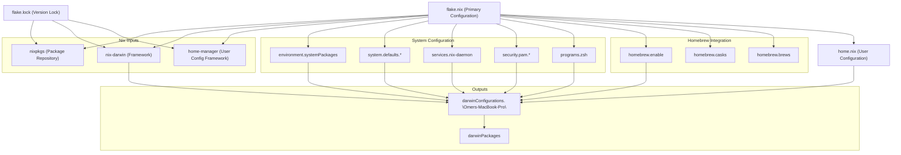
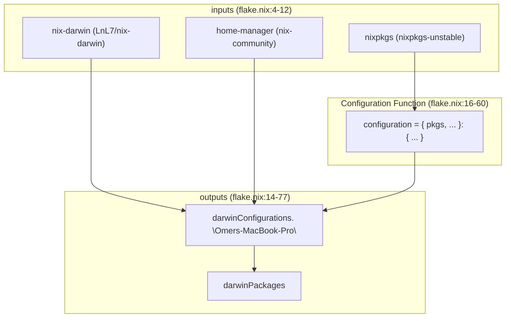
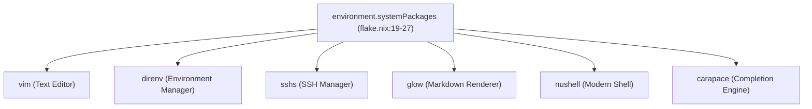
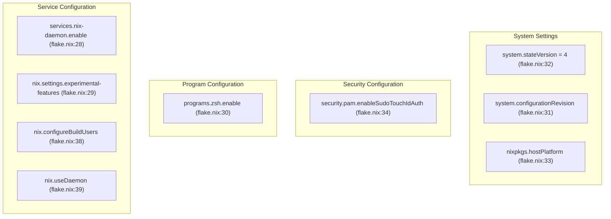
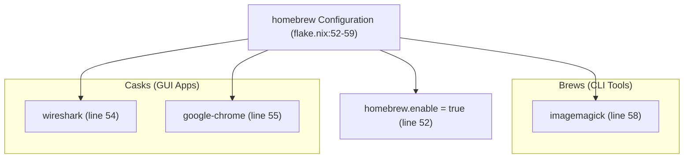
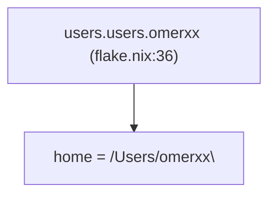
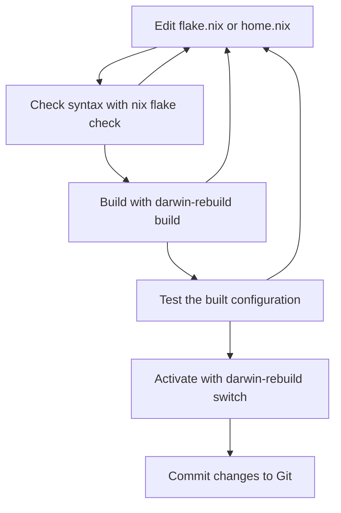

[/](/)

[/search](/search)

[/wiki](/wiki)

[/settings/members](/settings/members)

[/settings/support](/settings/support)

[Add repo](/repositories)

[All repos](/wiki)

[backend](/wiki/Klaudioz/backend)

[BH-Workflow-Engine](/wiki/Klaudioz/BH-Workflow-Engine)

[Buckhead_CRM](/wiki/Klaudioz/Buckhead_CRM)

[dotfiles](/wiki/Klaudioz/dotfiles)

[frontend](/wiki/Klaudioz/frontend)

[godeep.wiki-jb](/wiki/Klaudioz/godeep.wiki-jb)

[pi-mono-zero](/wiki/Klaudioz/pi-mono-zero)

[VirtualOracle](/wiki/Klaudioz/VirtualOracle)

# System Configuration with Nix-DarwinLink copied!

> **Relevant source files**
> * [nix-darwin/flake.nix](https://github.com/Klaudioz/dotfiles/blob/2febda55/nix-darwin/flake.nix)
> * [nix-darwin/home.nix](https://github.com/Klaudioz/dotfiles/blob/2febda55/nix-darwin/home.nix)
> * [nix/nix.conf](https://github.com/Klaudioz/dotfiles/blob/2febda55/nix/nix.conf)

## Purpose and ScopeLink copied!

This document explains the declarative system configuration approach used in this dotfiles repository through **nix-darwin**, a Nix-based system configuration tool for macOS. It covers the overall architecture, the flake-based configuration structure, system-wide package installation, macOS system defaults, and the integration with home-manager for user-specific configuration.

For detailed information about:

* The flake.nix file structure and inputs/outputs, see [Flake Configuration](#2.1)
* System package and service management details, see [Package and Service Management](#2.2)
* User-specific configuration with home-manager, see [Home Manager Integration](#2.3)

## What is Nix-DarwinLink copied!

Nix-Darwin is a declarative system configuration framework for macOS that uses the Nix package manager. It enables:

* **Declarative System State**: The entire system configuration is defined in `.nix` files, making it reproducible and version-controllable
* **Atomic Updates**: System changes are applied atomically, allowing rollback if issues occur
* **Reproducible Builds**: The `flake.lock` file ensures that package versions are pinned, creating identical environments across machines
* **Integration with Home-Manager**: User-specific configurations can be managed alongside system configuration

In this repository, nix-darwin serves as the foundation layer with an importance score of 13.67, managing system-level packages, services, and macOS defaults.

**Sources:** [nix-darwin/flake.nix L1-L79](https://github.com/Klaudioz/dotfiles/blob/2febda55/nix-darwin/flake.nix#L1-L79)

## System Architecture OverviewLink copied!

The following diagram illustrates how nix-darwin fits into the overall system management architecture:



**Diagram: Nix-Darwin Configuration Architecture**

This diagram shows the relationships between the primary configuration files (`flake.nix`, `home.nix`), their inputs from the Nix ecosystem (nixpkgs, nix-darwin, home-manager), and how they combine to produce the `darwinConfigurations."Omers-MacBook-Pro"` output.

**Sources:** [nix-darwin/flake.nix L1-L79](https://github.com/Klaudioz/dotfiles/blob/2febda55/nix-darwin/flake.nix#L1-L79)

## Declarative Configuration ModelLink copied!

Nix-Darwin uses a **declarative configuration model** where the desired system state is defined rather than scripted. The configuration is written in the Nix expression language and organized into modules.

### Key PrinciplesLink copied!

| Principle | Description | Implementation |
| --- | --- | --- |
| **Single Source of Truth** | All system configuration resides in version-controlled `.nix` files | [nix-darwin/flake.nix L1-L79](https://github.com/Klaudioz/dotfiles/blob/2febda55/nix-darwin/flake.nix#L1-L79) |
| **Idempotency** | Applying the same configuration multiple times produces the same result | Managed by nix-darwin framework |
| **Atomicity** | Configuration changes are applied as atomic transactions | System generations in `/nix/var/nix/profiles/` |
| **Reproducibility** | `flake.lock` ensures exact dependency versions | Generated automatically by Nix |
| **Composability** | Configuration is split into modules (system + home-manager) | [nix-darwin/flake.nix L65-L72](https://github.com/Klaudioz/dotfiles/blob/2febda55/nix-darwin/flake.nix#L65-L72) |

### Configuration StructureLink copied!

The configuration follows this structure:

```markdown
nix-darwin/
├── flake.nix       # Primary system configuration with inputs/outputs
├── home.nix        # Home-manager user configuration
└── flake.lock      # Generated lock file for reproducible builds
```

**Sources:** [nix-darwin/flake.nix L1-L79](https://github.com/Klaudioz/dotfiles/blob/2febda55/nix-darwin/flake.nix#L1-L79)

 [nix-darwin/home.nix L1-L51](https://github.com/Klaudioz/dotfiles/blob/2febda55/nix-darwin/home.nix#L1-L51)

## Flake-Based ConfigurationLink copied!

This repository uses **Nix Flakes**, a newer Nix feature that provides:

* **Explicit Inputs**: All dependencies are declared in `inputs` ([nix-darwin/flake.nix L4-L12](https://github.com/Klaudioz/dotfiles/blob/2febda55/nix-darwin/flake.nix#L4-L12) )
* **Hermetic Evaluation**: Flakes are evaluated in isolation from the system
* **Lock Files**: `flake.lock` pins exact versions of all inputs
* **Composable Outputs**: Configuration produces well-defined outputs

### Flake Inputs and OutputsLink copied!



**Diagram: Flake Inputs/Outputs Flow**

The `inputs` section declares three primary dependencies:

* `nixpkgs`: Package repository from the unstable channel
* `nix-darwin`: The darwin system framework
* `home-manager`: User configuration framework

These inputs are consumed by the `outputs` function to produce the `darwinConfigurations` and `darwinPackages` outputs.

**Sources:** [nix-darwin/flake.nix L4-L12](https://github.com/Klaudioz/dotfiles/blob/2febda55/nix-darwin/flake.nix#L4-L12)

 [nix-darwin/flake.nix L14-L77](https://github.com/Klaudioz/dotfiles/blob/2febda55/nix-darwin/flake.nix#L14-L77)

## System-Wide Package ManagementLink copied!

System-wide packages are declared in `environment.systemPackages` and are available to all users on the system.

### Installed System PackagesLink copied!

The following packages are installed system-wide:



**Diagram: System Package Declaration**

| Package | Purpose | Configuration Location |
| --- | --- | --- |
| `vim` | Basic text editor available system-wide | [nix-darwin/flake.nix L21](https://github.com/Klaudioz/dotfiles/blob/2febda55/nix-darwin/flake.nix#L21-L21) |
| `direnv` | Directory-specific environment variable management | [nix-darwin/flake.nix L22](https://github.com/Klaudioz/dotfiles/blob/2febda55/nix-darwin/flake.nix#L22-L22) |
| `sshs` | SSH connection manager | [nix-darwin/flake.nix L23](https://github.com/Klaudioz/dotfiles/blob/2febda55/nix-darwin/flake.nix#L23-L23) |
| `glow` | Terminal-based markdown renderer | [nix-darwin/flake.nix L24](https://github.com/Klaudioz/dotfiles/blob/2febda55/nix-darwin/flake.nix#L24-L24) |
| `nushell` | Modern shell with structured data support | [nix-darwin/flake.nix L25](https://github.com/Klaudioz/dotfiles/blob/2febda55/nix-darwin/flake.nix#L25-L25) |
| `carapace` | Multi-shell completion generator | [nix-darwin/flake.nix L26](https://github.com/Klaudioz/dotfiles/blob/2febda55/nix-darwin/flake.nix#L26-L26) |

**Sources:** [nix-darwin/flake.nix L19-L27](https://github.com/Klaudioz/dotfiles/blob/2febda55/nix-darwin/flake.nix#L19-L27)

## macOS System Defaults ConfigurationLink copied!

Nix-Darwin provides declarative configuration of macOS system preferences through the `system.defaults` module. This eliminates the need for manual configuration or separate scripts.

### Configured System DefaultsLink copied!

```

```

**Diagram: macOS System Defaults Configuration**

| Setting | Value | Effect |
| --- | --- | --- |
| `dock.autohide` | `true` | Automatically hide the Dock when not in use |
| `dock.mru-spaces` | `false` | Disable automatic rearrangement of Spaces based on most recent use |
| `finder.AppleShowAllExtensions` | `true` | Show all file extensions in Finder |
| `finder.FXPreferredViewStyle` | `"clmv"` | Set Finder to column view by default |
| `loginwindow.LoginwindowText` | `"devops-toolbox"` | Display custom text on login window |
| `screencapture.location` | `"~/Pictures/screenshots"` | Save screenshots to specific directory |
| `screensaver.askForPasswordDelay` | `10` | Require password 10 seconds after screensaver starts |

**Sources:** [nix-darwin/flake.nix L41-L49](https://github.com/Klaudioz/dotfiles/blob/2febda55/nix-darwin/flake.nix#L41-L49)

## Services and System ConfigurationLink copied!

Nix-Darwin manages system services and core system settings through dedicated configuration options.

### Nix Daemon ConfigurationLink copied!



**Diagram: Services and System Settings**

| Configuration | Value/State | Purpose |
| --- | --- | --- |
| `services.nix-daemon.enable` | `true` | Enable the Nix daemon for multi-user Nix installations |
| `nix.settings.experimental-features` | `"nix-command flakes"` | Enable experimental flake support and new CLI |
| `programs.zsh.enable` | `true` | Enable Zsh as default shell (macOS Catalina default) |
| `security.pam.enableSudoTouchIdAuth` | `true` | Allow Touch ID for sudo authentication |
| `system.stateVersion` | `4` | Track system configuration version |
| `nixpkgs.hostPlatform` | `"aarch64-darwin"` | Specify Apple Silicon platform |

The experimental features configuration is also mirrored in [nix/nix.conf L1](https://github.com/Klaudioz/dotfiles/blob/2febda55/nix/nix.conf#L1-L1)

 for consistency across Nix installations.

**Sources:** [nix-darwin/flake.nix L28-L34](https://github.com/Klaudioz/dotfiles/blob/2febda55/nix-darwin/flake.nix#L28-L34)

 [nix/nix.conf L1](https://github.com/Klaudioz/dotfiles/blob/2febda55/nix/nix.conf#L1-L1)

## Homebrew IntegrationLink copied!

While Nix manages most packages, Homebrew is integrated for packages that are not available or work better through Homebrew (particularly GUI applications).

### Homebrew Configuration StructureLink copied!



**Diagram: Homebrew Package Declarations**

| Category | Package | Purpose | Configuration |
| --- | --- | --- | --- |
| **Casks** | `wireshark` | Network protocol analyzer (GUI) | [nix-darwin/flake.nix L54](https://github.com/Klaudioz/dotfiles/blob/2febda55/nix-darwin/flake.nix#L54-L54) |
| **Casks** | `google-chrome` | Web browser | [nix-darwin/flake.nix L55](https://github.com/Klaudioz/dotfiles/blob/2febda55/nix-darwin/flake.nix#L55-L55) |
| **Brews** | `imagemagick` | Image manipulation CLI tool | [nix-darwin/flake.nix L58](https://github.com/Klaudioz/dotfiles/blob/2febda55/nix-darwin/flake.nix#L58-L58) |

**Note:** As indicated in [nix-darwin/flake.nix L51](https://github.com/Klaudioz/dotfiles/blob/2febda55/nix-darwin/flake.nix#L51-L51)

 Homebrew must be installed manually before nix-darwin can manage its packages.

**Sources:** [nix-darwin/flake.nix L51-L59](https://github.com/Klaudioz/dotfiles/blob/2febda55/nix-darwin/flake.nix#L51-L59)

## Home-Manager IntegrationLink copied!

Home-Manager is integrated as a nix-darwin module to manage user-specific configuration alongside system configuration. This creates a unified configuration system.

### Home-Manager Module IntegrationLink copied!

```

```

**Diagram: Home-Manager Integration Architecture**

### Configuration OptionsLink copied!

| Option | Value | Purpose |
| --- | --- | --- |
| `home-manager.useGlobalPkgs` | `true` | Use system's nixpkgs for consistency |
| `home-manager.useUserPackages` | `true` | Install user packages to user profile |
| `home-manager.users.omerxx` | `import ./home.nix` | User-specific configuration file |
| `home-manager.backupFileExtension` | `"backup"` | Backup existing files when creating symlinks |

### User Configuration ElementsLink copied!

The `home.nix` file configures user-specific settings:

| Configuration | Location | Purpose |
| --- | --- | --- |
| `home.username` | [nix-darwin/home.nix L7](https://github.com/Klaudioz/dotfiles/blob/2febda55/nix-darwin/home.nix#L7-L7) | Define username (`omerxx`) |
| `home.homeDirectory` | [nix-darwin/home.nix L8](https://github.com/Klaudioz/dotfiles/blob/2febda55/nix-darwin/home.nix#L8-L8) | Define home directory path |
| `home.stateVersion` | [nix-darwin/home.nix L9](https://github.com/Klaudioz/dotfiles/blob/2febda55/nix-darwin/home.nix#L9-L9) | Track home-manager version (`23.05`) |
| `home.packages` | [nix-darwin/home.nix L12-L13](https://github.com/Klaudioz/dotfiles/blob/2febda55/nix-darwin/home.nix#L12-L13) | User-specific packages (currently empty) |
| `home.file` | [nix-darwin/home.nix L17-L31](https://github.com/Klaudioz/dotfiles/blob/2febda55/nix-darwin/home.nix#L17-L31) | Dotfile management (commented out) |
| `home.sessionVariables` | [nix-darwin/home.nix L33-L34](https://github.com/Klaudioz/dotfiles/blob/2febda55/nix-darwin/home.nix#L33-L34) | Environment variables |
| `home.sessionPath` | [nix-darwin/home.nix L36-L39](https://github.com/Klaudioz/dotfiles/blob/2febda55/nix-darwin/home.nix#L36-L39) | PATH additions for Nix |
| `programs.zsh` | [nix-darwin/home.nix L41-L50](https://github.com/Klaudioz/dotfiles/blob/2febda55/nix-darwin/home.nix#L41-L50) | Zsh-specific configuration |

**Note:** The `home.file` section ([nix-darwin/home.nix L18-L30](https://github.com/Klaudioz/dotfiles/blob/2febda55/nix-darwin/home.nix#L18-L30)

) is commented out because this repository uses `stow` for dotfile management instead of home-manager's built-in file management. See [Overview](#1) for alternative dotfile management approaches.

**Sources:** [nix-darwin/flake.nix L37](https://github.com/Klaudioz/dotfiles/blob/2febda55/nix-darwin/flake.nix#L37-L37)

 [nix-darwin/flake.nix L65-L72](https://github.com/Klaudioz/dotfiles/blob/2febda55/nix-darwin/flake.nix#L65-L72)

 [nix-darwin/home.nix L1-L51](https://github.com/Klaudioz/dotfiles/blob/2febda55/nix-darwin/home.nix#L1-L51)

## User ConfigurationLink copied!

The user account configuration is defined at the system level:



**Diagram: User Account Declaration**

This configures the primary user account with the home directory path. The username `omerxx` must match the `home.username` in [nix-darwin/home.nix L7](https://github.com/Klaudioz/dotfiles/blob/2febda55/nix-darwin/home.nix#L7-L7)

 for proper home-manager integration.

**Sources:** [nix-darwin/flake.nix L36](https://github.com/Klaudioz/dotfiles/blob/2febda55/nix-darwin/flake.nix#L36-L36)

 [nix-darwin/home.nix L7](https://github.com/Klaudioz/dotfiles/blob/2febda55/nix-darwin/home.nix#L7-L7)

## Build and Activation ProcessLink copied!

The nix-darwin configuration is built and activated using the following process:

### Build ProcessLink copied!

```mermaid
sequenceDiagram
  participant User
  participant flake.nix
  participant flake.lock
  participant /nix/store
  participant /nix/var/nix/profiles/system

  User->>flake.nix: darwin-rebuild switch
  flake.nix->>flake.lock: Read locked input versions
  flake.lock-->>flake.nix: nixpkgs, nix-darwin, home-manager versions
  flake.nix->>flake.nix: Evaluate configuration function
  flake.nix->>/nix/store: Build packages & configuration
  /nix/store->>/nix/store: Store in /nix/store/<hash>-darwin-system
  /nix/store->>/nix/var/nix/profiles/system: Create new generation symlink
  /nix/var/nix/profiles/system->>User: Activate system configuration
  User->>User: Apply macOS defaults
  User->>User: Restart services
```

**Diagram: Build and Activation Sequence**

### Common CommandsLink copied!

| Command | Purpose |
| --- | --- |
| `darwin-rebuild switch` | Build and activate new configuration |
| `darwin-rebuild build` | Build configuration without activating |
| `darwin-rebuild check` | Check configuration for errors |
| `darwin-rebuild --rollback` | Roll back to previous generation |
| `nix flake update` | Update `flake.lock` to latest versions |
| `nix flake lock` | Regenerate `flake.lock` without updating |

### System GenerationsLink copied!

Each build creates a new **system generation** stored in `/nix/var/nix/profiles/system-*-link`. This allows:

* **Rollback**: Revert to any previous configuration
* **Comparison**: Diff between generations
* **Audit Trail**: Track when changes were applied

The `system.configurationRevision` ([nix-darwin/flake.nix L31](https://github.com/Klaudioz/dotfiles/blob/2febda55/nix-darwin/flake.nix#L31-L31)

) tracks the Git commit associated with each generation.

**Sources:** [nix-darwin/flake.nix L31](https://github.com/Klaudioz/dotfiles/blob/2febda55/nix-darwin/flake.nix#L31-L31)

## Platform ConfigurationLink copied!

The system is configured for Apple Silicon (ARM64):

```
nixpkgs.hostPlatform = "aarch64-darwin"
```

This setting at [nix-darwin/flake.nix L33](https://github.com/Klaudioz/dotfiles/blob/2febda55/nix-darwin/flake.nix#L33-L33)

 ensures:

* Packages are built for ARM64 architecture
* System checks validate compatibility
* Binary caches provide appropriate binaries

The darwin system function also explicitly specifies `system = "aarch64-darwin"` at [nix-darwin/flake.nix L64](https://github.com/Klaudioz/dotfiles/blob/2febda55/nix-darwin/flake.nix#L64-L64)

 for consistency.

**Sources:** [nix-darwin/flake.nix L33](https://github.com/Klaudioz/dotfiles/blob/2febda55/nix-darwin/flake.nix#L33-L33)

 [nix-darwin/flake.nix L64](https://github.com/Klaudioz/dotfiles/blob/2febda55/nix-darwin/flake.nix#L64-L64)

## Configuration WorkflowLink copied!

The typical workflow for managing nix-darwin configuration:



**Diagram: Configuration Management Workflow**

This workflow ensures:

1. Syntax validation before building
2. Build verification before activation
3. Testing opportunity before system-wide changes
4. Version control of working configurations

**Sources:** [nix-darwin/flake.nix L1-L79](https://github.com/Klaudioz/dotfiles/blob/2febda55/nix-darwin/flake.nix#L1-L79)

## SummaryLink copied!

Nix-Darwin provides a **declarative, reproducible, and version-controlled** approach to macOS system configuration. Key benefits include:

* **Single Configuration Source**: All system settings in [nix-darwin/flake.nix](https://github.com/Klaudioz/dotfiles/blob/2febda55/nix-darwin/flake.nix)
* **Reproducibility**: `flake.lock` ensures consistent package versions
* **Atomic Updates**: System changes are applied atomically with rollback capability
* **Integration**: Combines system-level (nix-darwin) and user-level (home-manager) configuration
* **Hybrid Package Management**: Nix packages with Homebrew integration for macOS-specific apps

For more detailed information about specific aspects:

* Flake structure and dependency management: [Flake Configuration](#2.1)
* Package installation and service configuration: [Package and Service Management](#2.2)
* User-specific configuration details: [Home Manager Integration](#2.3)

**Sources:** [nix-darwin/flake.nix L1-L79](https://github.com/Klaudioz/dotfiles/blob/2febda55/nix-darwin/flake.nix#L1-L79)

 [nix-darwin/home.nix L1-L51](https://github.com/Klaudioz/dotfiles/blob/2febda55/nix-darwin/home.nix#L1-L51)

 [nix/nix.conf L1-L2](https://github.com/Klaudioz/dotfiles/blob/2febda55/nix/nix.conf#L1-L2)

Refresh this wiki

Last indexed: 18 December 2025 ([2febda](https://github.com/Klaudioz/dotfiles/commit/2febda55))

### On this page

* [System Configuration with Nix-Darwin](#2-system-configuration-with-nix-darwin)
* [Purpose and Scope](#2-purpose-and-scope)
* [What is Nix-Darwin](#2-what-is-nix-darwin)
* [System Architecture Overview](#2-system-architecture-overview)
* [Declarative Configuration Model](#2-declarative-configuration-model)
* [Key Principles](#2-key-principles)
* [Configuration Structure](#2-configuration-structure)
* [Flake-Based Configuration](#2-flake-based-configuration)
* [Flake Inputs and Outputs](#2-flake-inputs-and-outputs)
* [System-Wide Package Management](#2-system-wide-package-management)
* [Installed System Packages](#2-installed-system-packages)
* [macOS System Defaults Configuration](#2-macos-system-defaults-configuration)
* [Configured System Defaults](#2-configured-system-defaults)
* [Services and System Configuration](#2-services-and-system-configuration)
* [Nix Daemon Configuration](#2-nix-daemon-configuration)
* [Homebrew Integration](#2-homebrew-integration)
* [Homebrew Configuration Structure](#2-homebrew-configuration-structure)
* [Home-Manager Integration](#2-home-manager-integration)
* [Home-Manager Module Integration](#2-home-manager-module-integration)
* [Configuration Options](#2-configuration-options)
* [User Configuration Elements](#2-user-configuration-elements)
* [User Configuration](#2-user-configuration)
* [Build and Activation Process](#2-build-and-activation-process)
* [Build Process](#2-build-process)
* [Common Commands](#2-common-commands)
* [System Generations](#2-system-generations)
* [Platform Configuration](#2-platform-configuration)
* [Configuration Workflow](#2-configuration-workflow)
* [Summary](#2-summary)

Ask Devin about dotfiles

  

Syntax error in text

mermaid version 11.4.1

Syntax error in text

mermaid version 11.4.1