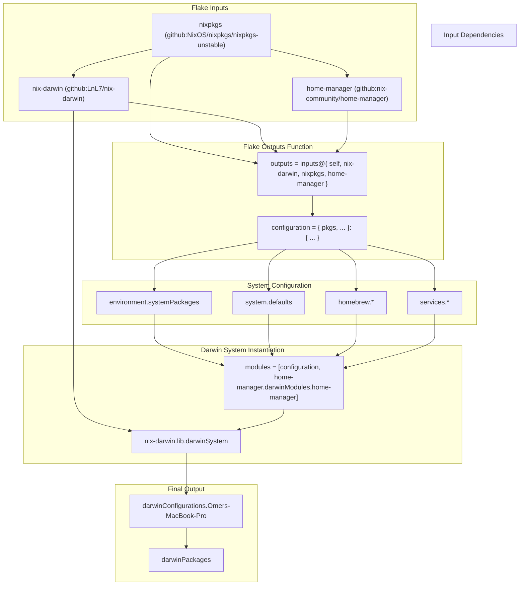
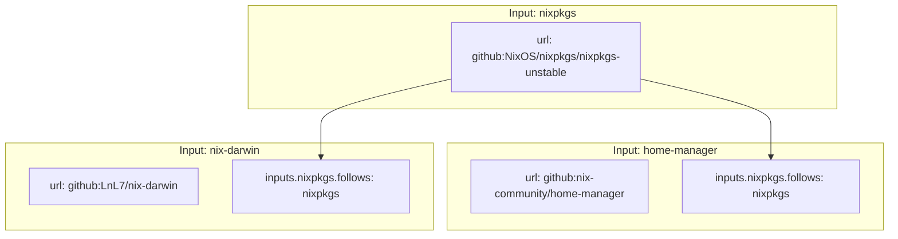
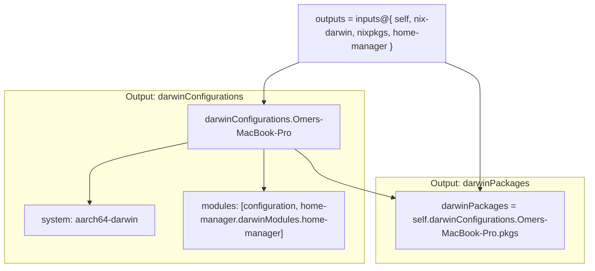

[/](/)

[/search](/search)

[/wiki](/wiki)

[/settings/members](/settings/members)

[/settings/support](/settings/support)

[Add repo](/repositories)

[All repos](/wiki)

[backend](/wiki/Klaudioz/backend)

[BH-Workflow-Engine](/wiki/Klaudioz/BH-Workflow-Engine)

[Buckhead_CRM](/wiki/Klaudioz/Buckhead_CRM)

[dotfiles](/wiki/Klaudioz/dotfiles)

[frontend](/wiki/Klaudioz/frontend)

[godeep.wiki-jb](/wiki/Klaudioz/godeep.wiki-jb)

[pi-mono-zero](/wiki/Klaudioz/pi-mono-zero)

[VirtualOracle](/wiki/Klaudioz/VirtualOracle)

# Flake ConfigurationLink copied!

> **Relevant source files**
> * [nix-darwin/flake.lock](https://github.com/Klaudioz/dotfiles/blob/2febda55/nix-darwin/flake.lock)
> * [nix-darwin/flake.nix](https://github.com/Klaudioz/dotfiles/blob/2febda55/nix-darwin/flake.nix)
> * [nix-darwin/home.nix](https://github.com/Klaudioz/dotfiles/blob/2febda55/nix-darwin/home.nix)
> * [nix/nix.conf](https://github.com/Klaudioz/dotfiles/blob/2febda55/nix/nix.conf)
> * [tmux/tmux.reset.conf](https://github.com/Klaudioz/dotfiles/blob/2febda55/tmux/tmux.reset.conf)

This document details the Nix flake configuration that forms the foundation of the declarative system management approach. It covers the structure of [nix-darwin/flake.nix](https://github.com/Klaudioz/dotfiles/blob/2febda55/nix-darwin/flake.nix)

 the input/output architecture, and the version locking mechanism provided by [nix-darwin/flake.lock](https://github.com/Klaudioz/dotfiles/blob/2febda55/nix-darwin/flake.lock)

For information about the packages and services managed by the flake, see [Package and Service Management](#2.2). For details on home-manager integration declared within the flake, see [Home Manager Integration](#2.3).

## OverviewLink copied!

The flake configuration at [nix-darwin/flake.nix L1-L78](https://github.com/Klaudioz/dotfiles/blob/2febda55/nix-darwin/flake.nix#L1-L78)

 serves as the single entry point for the entire nix-darwin system. It declares external dependencies (inputs), produces system configurations (outputs), and coordinates the integration of nix-darwin with home-manager for comprehensive system and user-space management.

**Key Components:**

| Component | Purpose | Location |
| --- | --- | --- |
| `inputs` | Declares external dependencies and their sources | [nix-darwin/flake.nix L4-L12](https://github.com/Klaudioz/dotfiles/blob/2febda55/nix-darwin/flake.nix#L4-L12) |
| `outputs` | Produces the Darwin system configuration | [nix-darwin/flake.nix L14-L77](https://github.com/Klaudioz/dotfiles/blob/2febda55/nix-darwin/flake.nix#L14-L77) |
| `configuration` | Defines system-level settings and packages | [nix-darwin/flake.nix L16-L60](https://github.com/Klaudioz/dotfiles/blob/2febda55/nix-darwin/flake.nix#L16-L60) |
| `darwinConfigurations` | Named system configurations | [nix-darwin/flake.nix L63-L73](https://github.com/Klaudioz/dotfiles/blob/2febda55/nix-darwin/flake.nix#L63-L73) |
| `flake.lock` | Pins exact versions of all inputs | [nix-darwin/flake.lock L1-L69](https://github.com/Klaudioz/dotfiles/blob/2febda55/nix-darwin/flake.lock#L1-L69) |

Sources: [nix-darwin/flake.nix L1-L78](https://github.com/Klaudioz/dotfiles/blob/2febda55/nix-darwin/flake.nix#L1-L78)

## Flake Structure and Data FlowLink copied!

The following diagram illustrates how the flake inputs flow through the configuration function to produce the final Darwin system:



**Flow Description:**

1. **Inputs** are fetched from their respective GitHub repositories
2. Input dependencies ensure `nixpkgs` is shared across all inputs via the `follows` directive
3. The **outputs function** receives all inputs as parameters
4. The **configuration function** defines system packages, defaults, homebrew packages, and services
5. **Darwin system instantiation** combines the configuration with home-manager modules
6. **Final outputs** produce the named system configuration and package set

Sources: [nix-darwin/flake.nix L4-L77](https://github.com/Klaudioz/dotfiles/blob/2febda55/nix-darwin/flake.nix#L4-L77)

## Input DeclarationsLink copied!

The `inputs` attribute declares three external dependencies with specific versioning strategies:



### nixpkgsLink copied!

Declared at [nix-darwin/flake.nix L5](https://github.com/Klaudioz/dotfiles/blob/2febda55/nix-darwin/flake.nix#L5-L5)

 `nixpkgs` provides the package repository. The `nixpkgs-unstable` branch is used to access the latest package versions.

### nix-darwinLink copied!

Declared at [nix-darwin/flake.nix L6-L7](https://github.com/Klaudioz/dotfiles/blob/2febda55/nix-darwin/flake.nix#L6-L7)

 `nix-darwin` provides the macOS system configuration framework. The `inputs.nixpkgs.follows = "nixpkgs"` directive at [nix-darwin/flake.nix L7](https://github.com/Klaudioz/dotfiles/blob/2febda55/nix-darwin/flake.nix#L7-L7)

 ensures it uses the same nixpkgs version as the root flake, preventing duplicate dependency trees.

### home-managerLink copied!

Declared at [nix-darwin/flake.nix L8-L11](https://github.com/Klaudioz/dotfiles/blob/2febda55/nix-darwin/flake.nix#L8-L11)

 `home-manager` manages user-specific configurations. It also follows the root flake's nixpkgs version at [nix-darwin/flake.nix L10](https://github.com/Klaudioz/dotfiles/blob/2febda55/nix-darwin/flake.nix#L10-L10)

**Input Following Pattern:**

| Input | Follows nixpkgs? | Purpose |
| --- | --- | --- |
| `nixpkgs` | N/A (root) | Package repository |
| `nix-darwin` | Yes | Prevents duplicate nixpkgs in closure |
| `home-manager` | Yes | Prevents duplicate nixpkgs in closure |

Sources: [nix-darwin/flake.nix L4-L12](https://github.com/Klaudioz/dotfiles/blob/2febda55/nix-darwin/flake.nix#L4-L12)

## Output StructureLink copied!

The `outputs` function at [nix-darwin/flake.nix L14](https://github.com/Klaudioz/dotfiles/blob/2febda55/nix-darwin/flake.nix#L14-L14)

 receives all inputs and produces two main outputs:



### darwinConfigurationsLink copied!

The `darwinConfigurations` attribute at [nix-darwin/flake.nix L63-L73](https://github.com/Klaudioz/dotfiles/blob/2febda55/nix-darwin/flake.nix#L63-L73)

 produces named system configurations. This flake defines a single configuration named `"Omers-MacBook-Pro"`:

```javascript
darwinConfigurations."Omers-MacBook-Pro" = nix-darwin.lib.darwinSystem {
  system = "aarch64-darwin";
  modules = [ 
    configuration
    home-manager.darwinModules.home-manager {
      home-manager.useGlobalPkgs = true;
      home-manager.useUserPackages = true;
      home-manager.users.omerxx = import ./home.nix;
    }
  ];
};
```

**Configuration Attributes:**

| Attribute | Value | Purpose |
| --- | --- | --- |
| `system` | `"aarch64-darwin"` | Target Apple Silicon Macs |
| `modules[0]` | `configuration` | System-level configuration function |
| `modules[1]` | `home-manager.darwinModules.home-manager` | Integrates home-manager |

The home-manager integration at [nix-darwin/flake.nix L67-L71](https://github.com/Klaudioz/dotfiles/blob/2febda55/nix-darwin/flake.nix#L67-L71)

 configures three critical settings:

* `useGlobalPkgs = true` ensures packages use the flake's nixpkgs
* `useUserPackages = true` installs user packages to the user profile
* `users.omerxx = import ./home.nix` imports user configuration from [nix-darwin/home.nix](https://github.com/Klaudioz/dotfiles/blob/2febda55/nix-darwin/home.nix)

### darwinPackagesLink copied!

The `darwinPackages` output at [nix-darwin/flake.nix L76](https://github.com/Klaudioz/dotfiles/blob/2febda55/nix-darwin/flake.nix#L76-L76)

 exposes the package set for convenience, allowing external access to the configured packages with overlays applied.

Sources: [nix-darwin/flake.nix L14-L77](https://github.com/Klaudioz/dotfiles/blob/2febda55/nix-darwin/flake.nix#L14-L77)

## Configuration FunctionLink copied!

The `configuration` function at [nix-darwin/flake.nix L16-L60](https://github.com/Klaudioz/dotfiles/blob/2febda55/nix-darwin/flake.nix#L16-L60)

 defines the system configuration as a Nix module. It receives `pkgs` and additional arguments:

```mermaid
flowchart TD

configfn["configuration = { pkgs, ... }: { ... }"]
envpkgs["environment.systemPackages"]
pkg1["pkgs.vim"]
pkg2["pkgs.direnv"]
pkg3["pkgs.sshs"]
pkg4["pkgs.glow"]
pkg5["pkgs.nushell"]
pkg6["pkgs.carapace"]
nixdaemon["services.nix-daemon.enable = true"]
expfeatures["nix.settings.experimental-features"]
buildusers["nix.configureBuildUsers = true"]
usedaemon["nix.useDaemon = true"]
zsh["programs.zsh.enable = true"]
stateversion["system.stateVersion = 4"]
configrev["system.configurationRevision"]
hostplatform["nixpkgs.hostPlatform = aarch64-darwin"]
dock["system.defaults.dock.*"]
finder["system.defaults.finder.*"]
loginwindow["system.defaults.loginwindow.*"]
screencapture["system.defaults.screencapture.*"]
screensaver["system.defaults.screensaver.*"]
touchid["security.pam.enableSudoTouchIdAuth = true"]
user["users.users.omerxx.home"]
hmbackup["home-manager.backupFileExtension"]
hbenable["homebrew.enable = true"]
hbcasks["homebrew.casks"]
hbbrews["homebrew.brews"]

configfn --> envpkgs
configfn --> nixdaemon
configfn --> expfeatures
configfn --> buildusers
configfn --> usedaemon
configfn --> zsh
configfn --> stateversion
configfn --> configrev
configfn --> hostplatform
configfn --> dock
configfn --> finder
configfn --> loginwindow
configfn --> screencapture
configfn --> screensaver
configfn --> touchid
configfn --> user
configfn --> hmbackup
configfn --> hbenable
configfn --> hbcasks
configfn --> hbbrews

subgraph Homebrew ["Homebrew"]
    hbenable
    hbcasks
    hbbrews
end

subgraph subGraph8 ["Home Manager Config"]
    hmbackup
end

subgraph Users ["Users"]
    user
end

subgraph Security ["Security"]
    touchid
end

subgraph subGraph5 ["macOS Defaults"]
    dock
    finder
    loginwindow
    screencapture
    screensaver
end

subgraph subGraph4 ["System Settings"]
    stateversion
    configrev
    hostplatform
end

subgraph Programs ["Programs"]
    zsh
end

subgraph subGraph2 ["Nix Settings"]
    expfeatures
    buildusers
    usedaemon
end

subgraph Services ["Services"]
    nixdaemon
end

subgraph subGraph0 ["System Packages"]
    envpkgs
    pkg1
    pkg2
    pkg3
    pkg4
    pkg5
    pkg6
    envpkgs --> pkg1
    envpkgs --> pkg2
    envpkgs --> pkg3
    envpkgs --> pkg4
    envpkgs --> pkg5
    envpkgs --> pkg6
end
```



### Core Configuration SectionsLink copied!

The configuration is organized into several logical sections:

**System Packages** [nix-darwin/flake.nix L19-L27](https://github.com/Klaudioz/dotfiles/blob/2febda55/nix-darwin/flake.nix#L19-L27)

:

* Installs packages to the system profile via `environment.systemPackages`
* Includes vim, direnv, sshs, glow, nushell, and carapace

**Nix Settings** [nix-darwin/flake.nix L28-L39](https://github.com/Klaudioz/dotfiles/blob/2febda55/nix-darwin/flake.nix#L28-L39)

:

* `services.nix-daemon.enable = true` enables the Nix daemon service
* `nix.settings.experimental-features = "nix-command flakes"` enables flake support
* `nix.configureBuildUsers = true` and `nix.useDaemon = true` configure multi-user Nix

**System Configuration** [nix-darwin/flake.nix L30-L33](https://github.com/Klaudioz/dotfiles/blob/2febda55/nix-darwin/flake.nix#L30-L33)

:

* `programs.zsh.enable = true` enables Zsh as the default shell
* `system.stateVersion = 4` declares the system state version
* `system.configurationRevision` tracks the Git revision
* `nixpkgs.hostPlatform = "aarch64-darwin"` targets Apple Silicon

**macOS Defaults** [nix-darwin/flake.nix L41-L49](https://github.com/Klaudioz/dotfiles/blob/2febda55/nix-darwin/flake.nix#L41-L49)

:

| Setting | Value | Effect |
| --- | --- | --- |
| `dock.autohide` | `true` | Auto-hide the Dock |
| `dock.mru-spaces` | `false` | Disable automatic space rearranging |
| `finder.AppleShowAllExtensions` | `true` | Show all file extensions |
| `finder.FXPreferredViewStyle` | `"clmv"` | Use column view in Finder |
| `loginwindow.LoginwindowText` | `"devops-toolbox"` | Custom login window text |
| `screencapture.location` | `"~/Pictures/screenshots"` | Screenshot save location |
| `screensaver.askForPasswordDelay` | `10` | Password delay after screensaver |

**Security** [nix-darwin/flake.nix L34](https://github.com/Klaudioz/dotfiles/blob/2febda55/nix-darwin/flake.nix#L34-L34)

:

* `security.pam.enableSudoTouchIdAuth = true` enables Touch ID for sudo

**User Configuration** [nix-darwin/flake.nix L36-L37](https://github.com/Klaudioz/dotfiles/blob/2febda55/nix-darwin/flake.nix#L36-L37)

:

* Defines the home directory for user `omerxx`
* Configures home-manager backup file extension

**Homebrew Integration** [nix-darwin/flake.nix L51-L59](https://github.com/Klaudioz/dotfiles/blob/2febda55/nix-darwin/flake.nix#L51-L59)

:

* Enables Homebrew package management
* Declares casks (wireshark, google-chrome) and brews (imagemagick)

Sources: [nix-darwin/flake.nix L16-L60](https://github.com/Klaudioz/dotfiles/blob/2febda55/nix-darwin/flake.nix#L16-L60)

## Lock File MechanismLink copied!

The [nix-darwin/flake.lock L1-L69](https://github.com/Klaudioz/dotfiles/blob/2febda55/nix-darwin/flake.lock#L1-L69)

 file pins exact versions of all flake inputs, ensuring reproducible builds:

```mermaid
flowchart TD

root["root node"]
nodes["nodes object"]
hm_locked["locked object"]
hm_lastmod["lastModified: 1721135958"]
hm_hash["narHash: sha256-H548..."]
hm_owner["owner: nix-community"]
hm_repo["repo: home-manager"]
hm_rev["rev: afd2021bedff2de..."]
hm_type["type: github"]
hm_follows["inputs.nixpkgs: follows root nixpkgs"]
nd_locked["locked object"]
nd_lastmod["lastModified: 1721270582"]
nd_hash["narHash: sha256-MdZm..."]
nd_owner["owner: LnL7"]
nd_repo["repo: nix-darwin"]
nd_rev["rev: a3e4a7b8ffc08c..."]
nd_type["type: github"]
nd_follows["inputs.nixpkgs: follows root nixpkgs"]
np_locked["locked object"]
np_lastmod["lastModified: 1721116560"]
np_hash["narHash: sha256-++TY..."]
np_owner["owner: NixOS"]
np_repo["repo: nixpkgs"]
np_rev["rev: 9355fa86e6f2742..."]
np_type["type: github"]
np_ref["ref: nixpkgs-unstable"]

nodes --> hm_locked
nodes --> nd_locked
nodes --> np_locked

subgraph subGraph3 ["Input: nixpkgs"]
    np_locked
    np_lastmod
    np_hash
    np_owner
    np_repo
    np_rev
    np_type
    np_ref
    np_locked --> np_lastmod
    np_locked --> np_hash
    np_locked --> np_owner
    np_locked --> np_repo
    np_locked --> np_rev
    np_locked --> np_type
    np_locked --> np_ref
end

subgraph subGraph2 ["Input: nix-darwin"]
    nd_locked
    nd_lastmod
    nd_hash
    nd_owner
    nd_repo
    nd_rev
    nd_type
    nd_follows
    nd_locked --> nd_lastmod
    nd_locked --> nd_hash
    nd_locked --> nd_owner
    nd_locked --> nd_repo
    nd_locked --> nd_rev
    nd_locked --> nd_type
    nd_locked --> nd_follows
end

subgraph subGraph1 ["Input: home-manager"]
    hm_locked
    hm_lastmod
    hm_hash
    hm_owner
    hm_repo
    hm_rev
    hm_type
    hm_follows
    hm_locked --> hm_lastmod
    hm_locked --> hm_hash
    hm_locked --> hm_owner
    hm_locked --> hm_repo
    hm_locked --> hm_rev
    hm_locked --> hm_type
    hm_locked --> hm_follows
end

subgraph subGraph0 ["flake.lock Structure"]
    root
    nodes
    root --> nodes
end
```



### Lock File ContentsLink copied!

Each input in the lock file contains:

**Locked Metadata:**

| Field | Purpose | Example |
| --- | --- | --- |
| `lastModified` | Unix timestamp of last update | `1721135958` |
| `narHash` | Content hash of the input | `sha256-H548rpPMsn...` |
| `owner` | GitHub repository owner | `nix-community` |
| `repo` | GitHub repository name | `home-manager` |
| `rev` | Git commit hash | `afd2021bedff2de92...` |
| `type` | Input source type | `github` |

**Input Dependency Tracking:**

The lock file at [nix-darwin/flake.lock L4-L7](https://github.com/Klaudioz/dotfiles/blob/2febda55/nix-darwin/flake.lock#L4-L7)

 and [nix-darwin/flake.lock L24-L27](https://github.com/Klaudioz/dotfiles/blob/2febda55/nix-darwin/flake.lock#L24-L27)

 records that both `home-manager` and `nix-darwin` follow the root flake's `nixpkgs` input, preventing version conflicts.

**Version Information:**

| Input | Commit | Date (Unix) |
| --- | --- | --- |
| `nixpkgs` | `9355fa86e6f27422963132c2c9aeedb0fb963d93` | 1721116560 |
| `nix-darwin` | `a3e4a7b8ffc08c7dc1973822a77ad432e1ec3dec` | 1721270582 |
| `home-manager` | `afd2021bedff2de92dfce0e257a3d03ae65c603d` | 1721135958 |

The lock file is automatically updated when running `nix flake update` and should be committed to version control to ensure all users build the same system configuration.

Sources: [nix-darwin/flake.lock L1-L69](https://github.com/Klaudioz/dotfiles/blob/2febda55/nix-darwin/flake.lock#L1-L69)

## Enabling Flake SupportLink copied!

Flakes are an experimental Nix feature that must be explicitly enabled. This configuration enables flakes through two mechanisms:

### System-Level EnablementLink copied!

The flake configuration itself enables experimental features at [nix-darwin/flake.nix L29](https://github.com/Klaudioz/dotfiles/blob/2febda55/nix-darwin/flake.nix#L29-L29)

:

```
nix.settings.experimental-features = "nix-command flakes";
```

This setting enables:

* `nix-command`: The new Nix CLI interface
* `flakes`: Flake functionality

### User-Level EnablementLink copied!

For users who manage Nix outside of nix-darwin, the [nix/nix.conf L1](https://github.com/Klaudioz/dotfiles/blob/2febda55/nix/nix.conf#L1-L1)

 file provides the same setting:

```
experimental-features = nix-command flakes
```

This file would typically be placed at `~/.config/nix/nix.conf` or `/etc/nix/nix.conf`.

**Additional Nix Configuration:**

The [nix/nix.conf L2](https://github.com/Klaudioz/dotfiles/blob/2febda55/nix/nix.conf#L2-L2)

 file also specifies:

```
build-users-group = nixbld
```

This declares the group for multi-user Nix builds, which is automatically managed by nix-darwin at [nix-darwin/flake.nix L38](https://github.com/Klaudioz/dotfiles/blob/2febda55/nix-darwin/flake.nix#L38-L38)

 via `nix.configureBuildUsers = true`.

Sources: [nix-darwin/flake.nix L29](https://github.com/Klaudioz/dotfiles/blob/2febda55/nix-darwin/flake.nix#L29-L29)

 [nix/nix.conf L1-L2](https://github.com/Klaudioz/dotfiles/blob/2febda55/nix/nix.conf#L1-L2)

## Flake CommandsLink copied!

With flakes enabled, the following commands operate on this configuration:

| Command | Purpose | Usage |
| --- | --- | --- |
| `nix flake show` | Display flake outputs | `nix flake show` |
| `nix flake update` | Update flake.lock | `nix flake update` |
| `nix flake lock` | Regenerate flake.lock without updating | `nix flake lock` |
| `darwin-rebuild switch --flake` | Build and activate configuration | `darwin-rebuild switch --flake .#Omers-MacBook-Pro` |
| `nix build` | Build without activating | `nix build .#darwinConfigurations.Omers-MacBook-Pro.system` |

The flake reference `.#Omers-MacBook-Pro` refers to the named configuration at [nix-darwin/flake.nix L63](https://github.com/Klaudioz/dotfiles/blob/2febda55/nix-darwin/flake.nix#L63-L63)

Sources: [nix-darwin/flake.nix L63](https://github.com/Klaudioz/dotfiles/blob/2febda55/nix-darwin/flake.nix#L63-L63)

Refresh this wiki

Last indexed: 18 December 2025 ([2febda](https://github.com/Klaudioz/dotfiles/commit/2febda55))

### On this page

* [Flake Configuration](#2.1-flake-configuration)
* [Overview](#2.1-overview)
* [Flake Structure and Data Flow](#2.1-flake-structure-and-data-flow)
* [Input Declarations](#2.1-input-declarations)
* [nixpkgs](#2.1-nixpkgs)
* [nix-darwin](#2.1-nix-darwin)
* [home-manager](#2.1-home-manager)
* [Output Structure](#2.1-output-structure)
* [darwinConfigurations](#2.1-darwinconfigurations)
* [darwinPackages](#2.1-darwinpackages)
* [Configuration Function](#2.1-configuration-function)
* [Core Configuration Sections](#2.1-core-configuration-sections)
* [Lock File Mechanism](#2.1-lock-file-mechanism)
* [Lock File Contents](#2.1-lock-file-contents)
* [Enabling Flake Support](#2.1-enabling-flake-support)
* [System-Level Enablement](#2.1-system-level-enablement)
* [User-Level Enablement](#2.1-user-level-enablement)
* [Flake Commands](#2.1-flake-commands)

Ask Devin about dotfiles

  

Syntax error in text

mermaid version 11.4.1

Syntax error in text

mermaid version 11.4.1