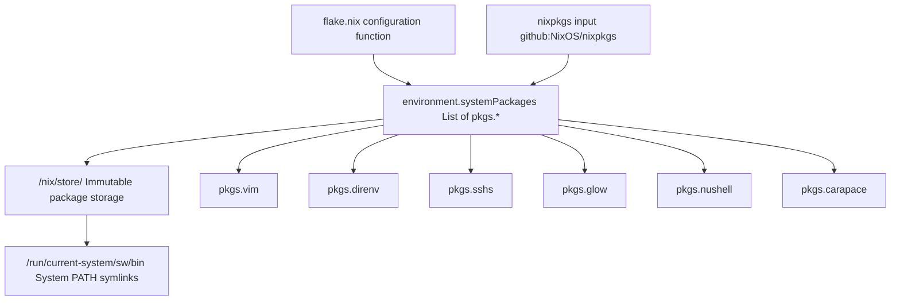
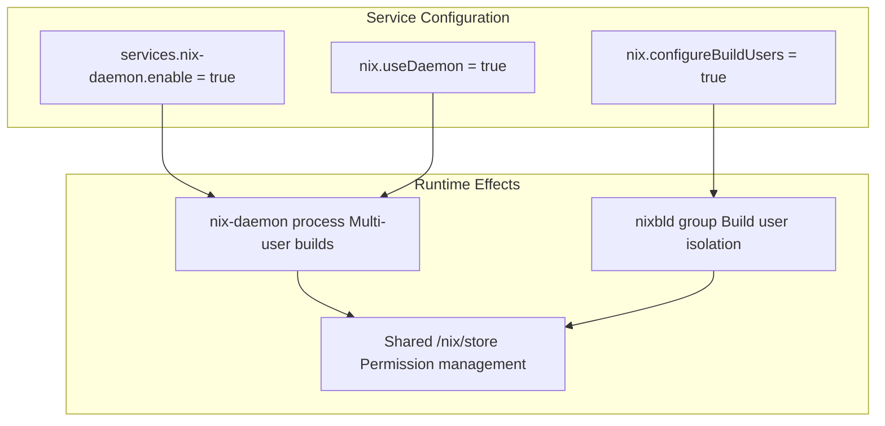
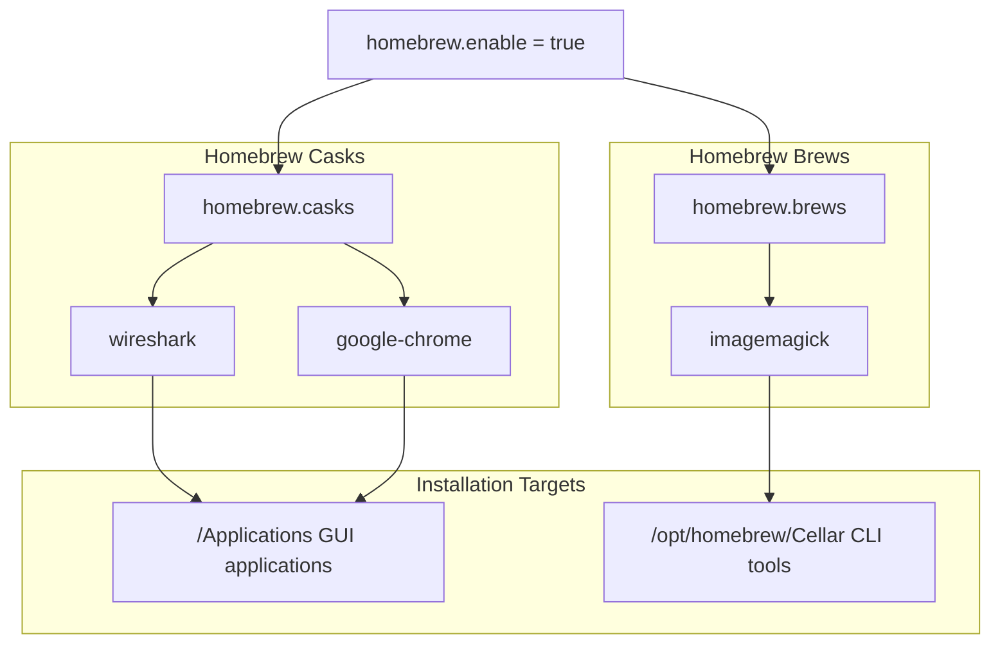
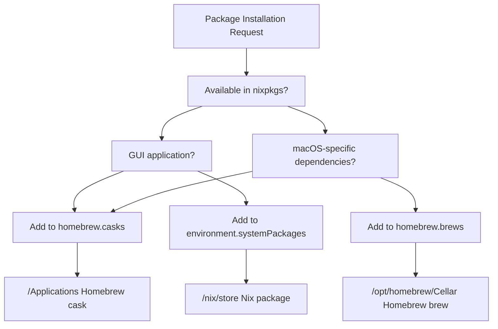

[/](/)

[/search](/search)

[/wiki](/wiki)

[/settings/members](/settings/members)

[/settings/support](/settings/support)

[Add repo](/repositories)

[All repos](/wiki)

[backend](/wiki/Klaudioz/backend)

[BH-Workflow-Engine](/wiki/Klaudioz/BH-Workflow-Engine)

[Buckhead_CRM](/wiki/Klaudioz/Buckhead_CRM)

[dotfiles](/wiki/Klaudioz/dotfiles)

[frontend](/wiki/Klaudioz/frontend)

[godeep.wiki-jb](/wiki/Klaudioz/godeep.wiki-jb)

[pi-mono-zero](/wiki/Klaudioz/pi-mono-zero)

[VirtualOracle](/wiki/Klaudioz/VirtualOracle)

# Package and Service ManagementLink copied!

> **Relevant source files**
> * [nix-darwin/flake.nix](https://github.com/Klaudioz/dotfiles/blob/2febda55/nix-darwin/flake.nix)
> * [nix-darwin/home.nix](https://github.com/Klaudioz/dotfiles/blob/2febda55/nix-darwin/home.nix)
> * [nix/nix.conf](https://github.com/Klaudioz/dotfiles/blob/2febda55/nix/nix.conf)

## Purpose and ScopeLink copied!

This document describes the package and service management layer of the nix-darwin system configuration. It covers three primary mechanisms for installing and managing software: Nix system packages via `environment.systemPackages`, the nix-daemon service that enables multi-user Nix installations, and Homebrew integration for packages that are unavailable or problematic in Nix on macOS.

For the broader flake structure that defines these configurations, see [2.1 Flake Configuration](#2.1). For user-specific package management through home-manager, see [2.3 Home Manager Integration](#2.3).

---

## System Package InstallationLink copied!

System-wide packages are declared in the `environment.systemPackages` attribute within the nix-darwin configuration. These packages become available to all users on the system and are installed to `/nix/store` with symlinks created in `/run/current-system/sw/bin`.

### Declared System PackagesLink copied!

The following packages are installed at the system level:

| Package | Purpose | Configuration Location |
| --- | --- | --- |
| `pkgs.vim` | Text editor | [nix-darwin/flake.nix L21](https://github.com/Klaudioz/dotfiles/blob/2febda55/nix-darwin/flake.nix#L21-L21) |
| `pkgs.direnv` | Environment management | [nix-darwin/flake.nix L22](https://github.com/Klaudioz/dotfiles/blob/2febda55/nix-darwin/flake.nix#L22-L22) |
| `pkgs.sshs` | SSH helper utility | [nix-darwin/flake.nix L23](https://github.com/Klaudioz/dotfiles/blob/2febda55/nix-darwin/flake.nix#L23-L23) |
| `pkgs.glow` | Markdown renderer | [nix-darwin/flake.nix L24](https://github.com/Klaudioz/dotfiles/blob/2febda55/nix-darwin/flake.nix#L24-L24) |
| `pkgs.nushell` | Modern shell | [nix-darwin/flake.nix L25](https://github.com/Klaudioz/dotfiles/blob/2febda55/nix-darwin/flake.nix#L25-L25) |
| `pkgs.carapace` | Shell completion framework | [nix-darwin/flake.nix L26](https://github.com/Klaudioz/dotfiles/blob/2febda55/nix-darwin/flake.nix#L26-L26) |

These packages are defined in [nix-darwin/flake.nix L19-L27](https://github.com/Klaudioz/dotfiles/blob/2febda55/nix-darwin/flake.nix#L19-L27)

 within the `configuration` function.

### Package Installation FlowLink copied!



**Sources:** [nix-darwin/flake.nix L19-L27](https://github.com/Klaudioz/dotfiles/blob/2febda55/nix-darwin/flake.nix#L19-L27)

---

## Nix Daemon Service ConfigurationLink copied!

The nix-daemon service enables multi-user Nix installations on macOS, allowing multiple users to safely share the Nix store while maintaining proper permissions and garbage collection.

### Service ActivationLink copied!

The daemon is enabled through three key configuration attributes:



* **`services.nix-daemon.enable`**: Activates the nix-daemon launchd service at system startup [nix-darwin/flake.nix L28](https://github.com/Klaudioz/dotfiles/blob/2febda55/nix-darwin/flake.nix#L28-L28)
* **`nix.useDaemon`**: Configures Nix commands to communicate with the daemon [nix-darwin/flake.nix L39](https://github.com/Klaudioz/dotfiles/blob/2febda55/nix-darwin/flake.nix#L39-L39)
* **`nix.configureBuildUsers`**: Automatically creates and configures build users (`nixbld1`, `nixbld2`, etc.) for isolated builds [nix-darwin/flake.nix L38](https://github.com/Klaudioz/dotfiles/blob/2febda55/nix-darwin/flake.nix#L38-L38)

**Sources:** [nix-darwin/flake.nix L28](https://github.com/Klaudioz/dotfiles/blob/2febda55/nix-darwin/flake.nix#L28-L28)

 [nix-darwin/flake.nix L38-L39](https://github.com/Klaudioz/dotfiles/blob/2febda55/nix-darwin/flake.nix#L38-L39)

### Nix Daemon Configuration FileLink copied!

The daemon's behavior is further controlled by [nix/nix.conf L1-L3](https://github.com/Klaudioz/dotfiles/blob/2febda55/nix/nix.conf#L1-L3)

:

| Setting | Value | Purpose |
| --- | --- | --- |
| `experimental-features` | `nix-command flakes` | Enables flakes and new CLI |
| `build-users-group` | `nixbld` | Specifies the build user group |

**Sources:** [nix/nix.conf L1-L3](https://github.com/Klaudioz/dotfiles/blob/2febda55/nix/nix.conf#L1-L3)

### Experimental FeaturesLink copied!

The configuration explicitly enables Nix flakes and the new command-line interface through two locations:

1. **System-wide configuration**: [nix-darwin/flake.nix L29](https://github.com/Klaudioz/dotfiles/blob/2febda55/nix-darwin/flake.nix#L29-L29)  sets `nix.settings.experimental-features = "nix-command flakes"`
2. **Daemon configuration**: [nix/nix.conf L1](https://github.com/Klaudioz/dotfiles/blob/2febda55/nix/nix.conf#L1-L1)  declares `experimental-features = nix-command flakes`

This redundancy ensures the features are available regardless of whether the system is fully rebuilt or just the daemon is restarted.

**Sources:** [nix-darwin/flake.nix L29](https://github.com/Klaudioz/dotfiles/blob/2febda55/nix-darwin/flake.nix#L29-L29)

 [nix/nix.conf L1](https://github.com/Klaudioz/dotfiles/blob/2febda55/nix/nix.conf#L1-L1)

---

## Homebrew IntegrationLink copied!

While Nix provides comprehensive package management, certain macOS applications are better distributed through Homebrew, particularly GUI applications (casks) and packages with complex macOS-specific dependencies.

### Homebrew Configuration StructureLink copied!



The configuration at [nix-darwin/flake.nix L52-L59](https://github.com/Klaudioz/dotfiles/blob/2febda55/nix-darwin/flake.nix#L52-L59)

 declares:

**Casks** (GUI applications):

* `wireshark`: Network protocol analyzer with GUI
* `google-chrome`: Web browser

**Brews** (CLI tools):

* `imagemagick`: Image manipulation library and tools

**Sources:** [nix-darwin/flake.nix L52-L59](https://github.com/Klaudioz/dotfiles/blob/2febda55/nix-darwin/flake.nix#L52-L59)

### Nix vs Homebrew Decision MatrixLink copied!

| Use Case | Package Manager | Rationale |
| --- | --- | --- |
| CLI development tools | Nix | Declarative, reproducible, version-controlled |
| macOS GUI applications | Homebrew Casks | Better macOS integration, automatic updates |
| Native macOS frameworks | Homebrew | Complex dependencies on macOS SDK |
| Cross-platform tools | Nix | Consistent across NixOS and macOS |
| Tools requiring root installation | Homebrew | Simpler permission handling |

### Homebrew PrerequisiteLink copied!

The comment at [nix-darwin/flake.nix L51](https://github.com/Klaudioz/dotfiles/blob/2febda55/nix-darwin/flake.nix#L51-L51)

 explicitly states: `# Homebrew needs to be installed on its own!`

This means Homebrew must be manually installed before deploying the nix-darwin configuration. The nix-darwin system manages the declarative package lists but does not handle Homebrew's initial installation. Install Homebrew by running:

```
/bin/bash -c "$(curl -fsSL https://raw.githubusercontent.com/Homebrew/install/HEAD/install.sh)"
```

**Sources:** [nix-darwin/flake.nix L51-L59](https://github.com/Klaudioz/dotfiles/blob/2febda55/nix-darwin/flake.nix#L51-L59)

---

## Package Management WorkflowLink copied!

### Adding System PackagesLink copied!

To add a new system-wide Nix package:

1. **Search for package**: Use `nix search nixpkgs <package-name>` to find the package in nixpkgs
2. **Edit flake**: Add `pkgs.<package-name>` to the `environment.systemPackages` list in [nix-darwin/flake.nix L19-L27](https://github.com/Klaudioz/dotfiles/blob/2febda55/nix-darwin/flake.nix#L19-L27)
3. **Rebuild system**: Run `darwin-rebuild switch --flake ~/dotfiles/nix-darwin`
4. **Verify installation**: Check that the package appears in `/run/current-system/sw/bin`

### Adding Homebrew PackagesLink copied!

For Homebrew packages:

1. **Determine type**: Decide if it's a cask (GUI) or brew (CLI)
2. **Edit flake**: Add the package name to either `homebrew.casks` [nix-darwin/flake.nix L53-L56](https://github.com/Klaudioz/dotfiles/blob/2febda55/nix-darwin/flake.nix#L53-L56)  or `homebrew.brews` [nix-darwin/flake.nix L57-L59](https://github.com/Klaudioz/dotfiles/blob/2febda55/nix-darwin/flake.nix#L57-L59)
3. **Rebuild system**: Run `darwin-rebuild switch --flake ~/dotfiles/nix-darwin`
4. **Homebrew installation**: nix-darwin will instruct Homebrew to install the declared packages

### Package Source ResolutionLink copied!



**Sources:** [nix-darwin/flake.nix L19-L27](https://github.com/Klaudioz/dotfiles/blob/2febda55/nix-darwin/flake.nix#L19-L27)

 [nix-darwin/flake.nix L52-L59](https://github.com/Klaudioz/dotfiles/blob/2febda55/nix-darwin/flake.nix#L52-L59)

---

## System Path ConfigurationLink copied!

System-wide packages become available through the system PATH, which is configured through multiple layers to ensure both Nix and Homebrew packages are accessible.

### Path PriorityLink copied!

The PATH is constructed in the following order:

1. **Nix system packages**: `/run/current-system/sw/bin` (highest priority)
2. **User Nix profile**: `$HOME/.nix-profile/bin`
3. **Homebrew packages**: `/opt/homebrew/bin`
4. **macOS system**: `/usr/bin`, `/bin`, `/usr/sbin`, `/sbin`

This priority ensures that Nix-managed packages override system defaults, providing consistent versions across the system.

### Session Path ConfigurationLink copied!

For zsh integration, [nix-darwin/home.nix L36-L39](https://github.com/Klaudioz/dotfiles/blob/2febda55/nix-darwin/home.nix#L36-L39)

 explicitly configures the session path:

```
home.sessionPath = [
  "/run/current-system/sw/bin"
  "$HOME/.nix-profile/bin"
];
```

This is reinforced in the zsh initialization at [nix-darwin/home.nix L45](https://github.com/Klaudioz/dotfiles/blob/2febda55/nix-darwin/home.nix#L45-L45)

:

```
export PATH=/run/current-system/sw/bin:$HOME/.nix-profile/bin:$PATH
```

**Sources:** [nix-darwin/home.nix L36-L39](https://github.com/Klaudioz/dotfiles/blob/2febda55/nix-darwin/home.nix#L36-L39)

 [nix-darwin/home.nix L43-L49](https://github.com/Klaudioz/dotfiles/blob/2febda55/nix-darwin/home.nix#L43-L49)

---

## System State ManagementLink copied!

### Configuration Revision TrackingLink copied!

The system tracks which Git revision of the configuration is currently deployed via [nix-darwin/flake.nix L31](https://github.com/Klaudioz/dotfiles/blob/2febda55/nix-darwin/flake.nix#L31-L31)

:

```
system.configurationRevision = self.rev or self.dirtyRev or null;
```

This allows administrators to identify exactly which configuration version is active, using either:

* `self.rev`: Clean Git commit hash
* `self.dirtyRev`: Hash of uncommitted changes
* `null`: No Git repository context

### State VersionLink copied!

The system declares `system.stateVersion = 4` at [nix-darwin/flake.nix L32](https://github.com/Klaudioz/dotfiles/blob/2febda55/nix-darwin/flake.nix#L32-L32)

 which pins the nix-darwin state schema version. This prevents automatic state migrations that could break existing systems during upgrades.

**Sources:** [nix-darwin/flake.nix L31-L32](https://github.com/Klaudioz/dotfiles/blob/2febda55/nix-darwin/flake.nix#L31-L32)

---

## Platform ConfigurationLink copied!

The system is explicitly configured for Apple Silicon (ARM64) architecture:

```
nixpkgs.hostPlatform = "aarch64-darwin";
```

This declaration at [nix-darwin/flake.nix L33](https://github.com/Klaudioz/dotfiles/blob/2febda55/nix-darwin/flake.nix#L33-L33)

 ensures that:

* All Nix packages are built for or fetched as ARM64 binaries
* The system configuration recognizes the native architecture
* Cross-compilation is not attempted unless explicitly requested

The corresponding Darwin configuration is named `"Omers-MacBook-Pro"` with matching architecture at [nix-darwin/flake.nix L63-L64](https://github.com/Klaudioz/dotfiles/blob/2febda55/nix-darwin/flake.nix#L63-L64)

**Sources:** [nix-darwin/flake.nix L33](https://github.com/Klaudioz/dotfiles/blob/2febda55/nix-darwin/flake.nix#L33-L33)

 [nix-darwin/flake.nix L63-L64](https://github.com/Klaudioz/dotfiles/blob/2febda55/nix-darwin/flake.nix#L63-L64)

Refresh this wiki

Last indexed: 18 December 2025 ([2febda](https://github.com/Klaudioz/dotfiles/commit/2febda55))

### On this page

* [Package and Service Management](#2.2-package-and-service-management)
* [Purpose and Scope](#2.2-purpose-and-scope)
* [System Package Installation](#2.2-system-package-installation)
* [Declared System Packages](#2.2-declared-system-packages)
* [Package Installation Flow](#2.2-package-installation-flow)
* [Nix Daemon Service Configuration](#2.2-nix-daemon-service-configuration)
* [Service Activation](#2.2-service-activation)
* [Nix Daemon Configuration File](#2.2-nix-daemon-configuration-file)
* [Experimental Features](#2.2-experimental-features)
* [Homebrew Integration](#2.2-homebrew-integration)
* [Homebrew Configuration Structure](#2.2-homebrew-configuration-structure)
* [Nix vs Homebrew Decision Matrix](#2.2-nix-vs-homebrew-decision-matrix)
* [Homebrew Prerequisite](#2.2-homebrew-prerequisite)
* [Package Management Workflow](#2.2-package-management-workflow)
* [Adding System Packages](#2.2-adding-system-packages)
* [Adding Homebrew Packages](#2.2-adding-homebrew-packages)
* [Package Source Resolution](#2.2-package-source-resolution)
* [System Path Configuration](#2.2-system-path-configuration)
* [Path Priority](#2.2-path-priority)
* [Session Path Configuration](#2.2-session-path-configuration)
* [System State Management](#2.2-system-state-management)
* [Configuration Revision Tracking](#2.2-configuration-revision-tracking)
* [State Version](#2.2-state-version)
* [Platform Configuration](#2.2-platform-configuration)

Ask Devin about dotfiles

  

Syntax error in text

mermaid version 11.4.1

Syntax error in text

mermaid version 11.4.1