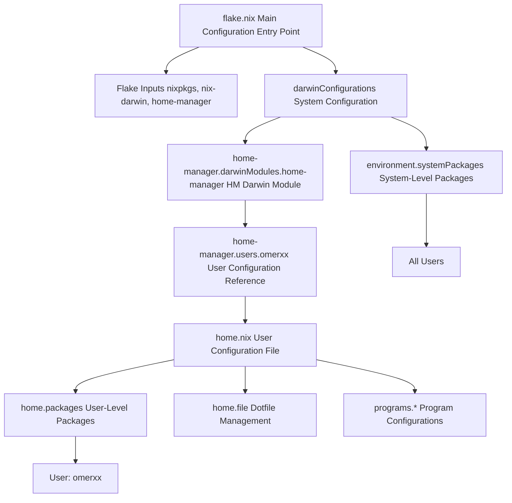
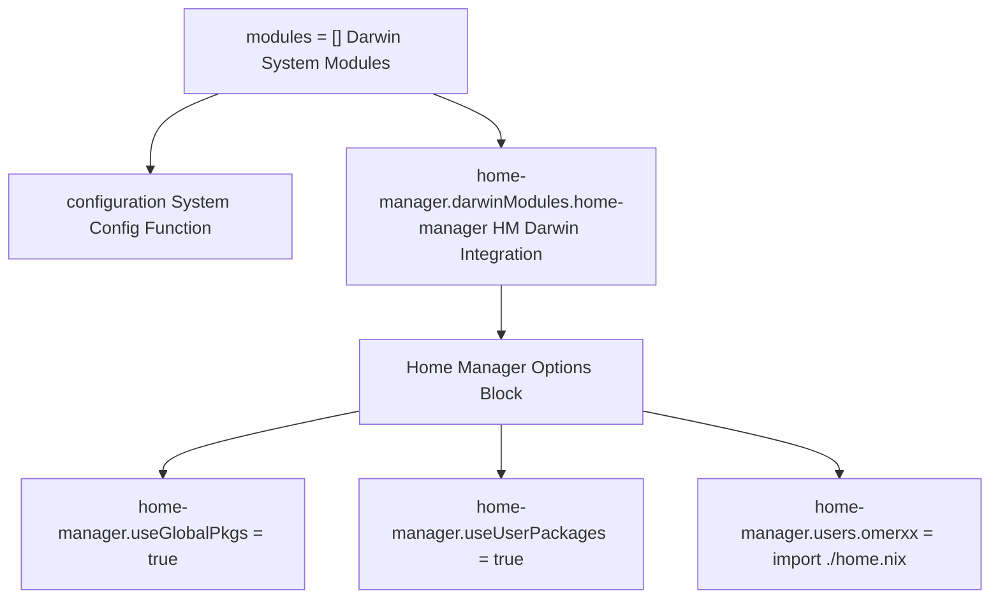
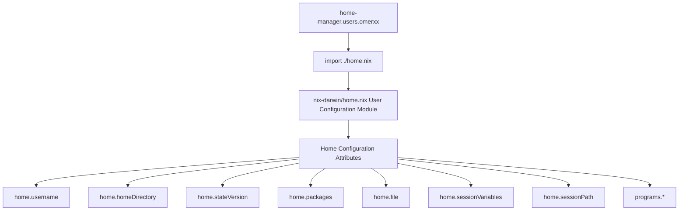
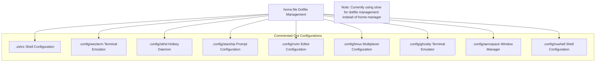
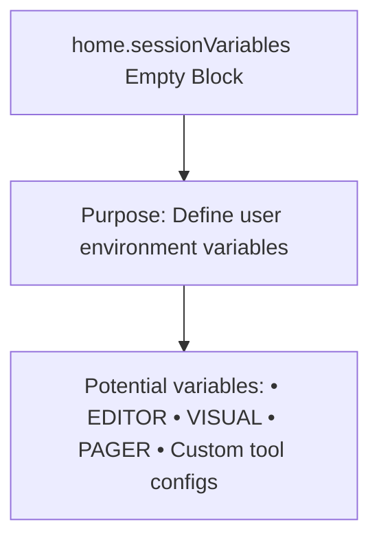
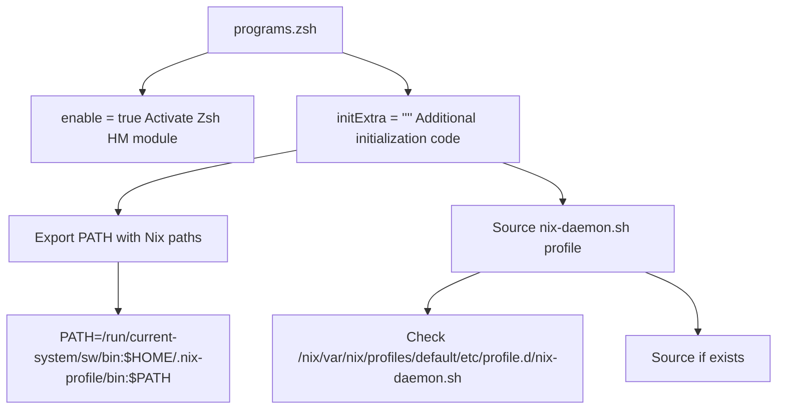
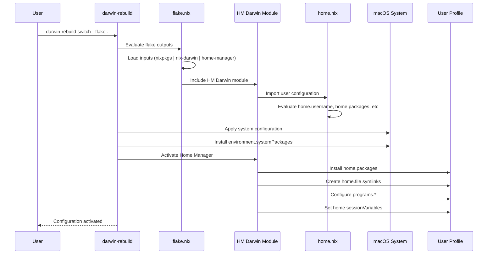

[/](/)

[/search](/search)

[/wiki](/wiki)

[/settings/members](/settings/members)

[/settings/support](/settings/support)

[Add repo](/repositories)

[All repos](/wiki)

[backend](/wiki/Klaudioz/backend)

[BH-Workflow-Engine](/wiki/Klaudioz/BH-Workflow-Engine)

[Buckhead_CRM](/wiki/Klaudioz/Buckhead_CRM)

[dotfiles](/wiki/Klaudioz/dotfiles)

[frontend](/wiki/Klaudioz/frontend)

[godeep.wiki-jb](/wiki/Klaudioz/godeep.wiki-jb)

[pi-mono-zero](/wiki/Klaudioz/pi-mono-zero)

[VirtualOracle](/wiki/Klaudioz/VirtualOracle)

# Home Manager IntegrationLink copied!

> **Relevant source files**
> * [nix-darwin/flake.nix](https://github.com/Klaudioz/dotfiles/blob/2febda55/nix-darwin/flake.nix)
> * [nix-darwin/home.nix](https://github.com/Klaudioz/dotfiles/blob/2febda55/nix-darwin/home.nix)
> * [nix/nix.conf](https://github.com/Klaudioz/dotfiles/blob/2febda55/nix/nix.conf)

## Purpose and ScopeLink copied!

This document explains how `home-manager` integrates with `nix-darwin` to provide declarative user-specific configuration management. Home Manager allows per-user package installation, dotfile management, and program configuration that complements the system-wide configuration managed by nix-darwin. This page covers the integration mechanism, configuration structure, and capabilities of Home Manager within the nix-darwin ecosystem.

For system-wide package and service management, see [Package and Service Management](#2.2). For the overall nix-darwin configuration structure, see [Flake Configuration](#2.1).

---

## Integration ArchitectureLink copied!

Home Manager integrates into the nix-darwin system as a Darwin module, enabling user-specific configurations to be managed alongside system configurations in a unified declarative approach.

### Home Manager in the Nix-Darwin StackLink copied!



**Sources:** [nix-darwin/flake.nix L1-L78](https://github.com/Klaudioz/dotfiles/blob/2febda55/nix-darwin/flake.nix#L1-L78)

This diagram illustrates the integration hierarchy. The `flake.nix` declares inputs including `home-manager` (lines 8-11), which is then integrated as a Darwin module within `darwinConfigurations` (lines 67-71). The module references the user-specific `home.nix` file, which manages user packages, dotfiles, and program configurations independently from system-level packages.

---

## Flake IntegrationLink copied!

### Input DeclarationLink copied!

Home Manager is declared as a flake input with the nixpkgs dependency relationship:

| Configuration | Value | Line Reference |
| --- | --- | --- |
| Input URL | `github:nix-community/home-manager` | [nix-darwin/flake.nix L9](https://github.com/Klaudioz/dotfiles/blob/2febda55/nix-darwin/flake.nix#L9-L9) |
| Nixpkgs follows | `inputs.nixpkgs.follows = "nixpkgs"` | [nix-darwin/flake.nix L10](https://github.com/Klaudioz/dotfiles/blob/2febda55/nix-darwin/flake.nix#L10-L10) |
| Purpose | Ensure HM uses same nixpkgs as system | Line 10 |

The `inputs.nixpkgs.follows` directive ensures that Home Manager uses the same nixpkgs version as the rest of the system, preventing version conflicts and ensuring consistency.

**Sources:** [nix-darwin/flake.nix L8-L11](https://github.com/Klaudioz/dotfiles/blob/2febda55/nix-darwin/flake.nix#L8-L11)

### Module IntegrationLink copied!

Home Manager is integrated as a Darwin module within the system configuration:



**Sources:** [nix-darwin/flake.nix L65-L72](https://github.com/Klaudioz/dotfiles/blob/2febda55/nix-darwin/flake.nix#L65-L72)

The `modules` list in [nix-darwin/flake.nix L65-L72](https://github.com/Klaudioz/dotfiles/blob/2febda55/nix-darwin/flake.nix#L65-L72)

 includes both the system `configuration` and the Home Manager Darwin module. The module is accessed via `home-manager.darwinModules.home-manager` and configured with options that control its behavior.

---

## Home Manager Module OptionsLink copied!

### Core Configuration OptionsLink copied!

The Home Manager Darwin module is configured with three primary options:

| Option | Value | Purpose | Line Reference |
| --- | --- | --- | --- |
| `home-manager.useGlobalPkgs` | `true` | Use system nixpkgs for user packages | [nix-darwin/flake.nix L68](https://github.com/Klaudioz/dotfiles/blob/2febda55/nix-darwin/flake.nix#L68-L68) |
| `home-manager.useUserPackages` | `true` | Install user packages to user profile | [nix-darwin/flake.nix L69](https://github.com/Klaudioz/dotfiles/blob/2febda55/nix-darwin/flake.nix#L69-L69) |
| `home-manager.users.omerxx` | `import ./home.nix` | User configuration file | [nix-darwin/flake.nix L70](https://github.com/Klaudioz/dotfiles/blob/2febda55/nix-darwin/flake.nix#L70-L70) |
| `home-manager.backupFileExtension` | `"backup"` | Extension for conflicting files | [nix-darwin/flake.nix L37](https://github.com/Klaudioz/dotfiles/blob/2febda55/nix-darwin/flake.nix#L37-L37) |

**`useGlobalPkgs` Option:**
When set to `true`, Home Manager uses the system's nixpkgs instead of its own. This ensures consistency between system and user packages and prevents duplicate downloads of the same package set.

**`useUserPackages` Option:**
When set to `true`, user packages are installed to the user profile (`~/.nix-profile`) rather than the system profile. This allows per-user package management without requiring system-level privileges.

**`backupFileExtension` Option:**
When Home Manager encounters an existing file that conflicts with a managed dotfile, it renames the existing file with the `.backup` extension before creating the managed symlink.

**Sources:** [nix-darwin/flake.nix L37](https://github.com/Klaudioz/dotfiles/blob/2febda55/nix-darwin/flake.nix#L37-L37)

 [nix-darwin/flake.nix L67-L71](https://github.com/Klaudioz/dotfiles/blob/2febda55/nix-darwin/flake.nix#L67-L71)

### User Configuration ReferenceLink copied!

The `home-manager.users.omerxx` option points to the user-specific configuration:



**Sources:** [nix-darwin/flake.nix L70](https://github.com/Klaudioz/dotfiles/blob/2febda55/nix-darwin/flake.nix#L70-L70)

 [nix-darwin/home.nix L1-L51](https://github.com/Klaudioz/dotfiles/blob/2febda55/nix-darwin/home.nix#L1-L51)

The `import ./home.nix` expression evaluates the `home.nix` file as a Nix module, which returns an attribute set with Home Manager configuration options.

---

## User Configuration StructureLink copied!

### Home AttributesLink copied!

The `home.nix` file defines fundamental user attributes:

| Attribute | Value | Purpose | Line Reference |
| --- | --- | --- | --- |
| `home.username` | `"omerxx"` | Unix username | [nix-darwin/home.nix L7](https://github.com/Klaudioz/dotfiles/blob/2febda55/nix-darwin/home.nix#L7-L7) |
| `home.homeDirectory` | `"/Users/omerxx"` | Home directory path | [nix-darwin/home.nix L8](https://github.com/Klaudioz/dotfiles/blob/2febda55/nix-darwin/home.nix#L8-L8) |
| `home.stateVersion` | `"23.05"` | HM state schema version | [nix-darwin/home.nix L9](https://github.com/Klaudioz/dotfiles/blob/2febda55/nix-darwin/home.nix#L9-L9) |

The `home.stateVersion` attribute determines the schema version for Home Manager's state files. This should not be changed after initial setup to prevent configuration incompatibilities.

**Sources:** [nix-darwin/home.nix L7-L9](https://github.com/Klaudioz/dotfiles/blob/2febda55/nix-darwin/home.nix#L7-L9)

### User Package ManagementLink copied!

The `home.packages` attribute defines user-specific packages:

```
home.packages = [  # User-specific packages go here];
```

Currently, the configuration in [nix-darwin/home.nix L12-L13](https://github.com/Klaudioz/dotfiles/blob/2febda55/nix-darwin/home.nix#L12-L13)

 has an empty list, indicating that user packages are managed at the system level via `environment.systemPackages` in [nix-darwin/flake.nix L19-L27](https://github.com/Klaudioz/dotfiles/blob/2febda55/nix-darwin/flake.nix#L19-L27)

 This is a valid approach but differs from the typical Home Manager pattern where user-specific tools would be defined here.

**Comparison with System Packages:**

| Scope | Declaration | Installation Location | Use Case |
| --- | --- | --- | --- |
| System | `environment.systemPackages` | `/nix/store` + system profile | Tools needed by all users |
| User | `home.packages` | `/nix/store` + user profile | Tools specific to one user |

**Sources:** [nix-darwin/home.nix L12-L13](https://github.com/Klaudioz/dotfiles/blob/2febda55/nix-darwin/home.nix#L12-L13)

 [nix-darwin/flake.nix L19-L27](https://github.com/Klaudioz/dotfiles/blob/2febda55/nix-darwin/flake.nix#L19-L27)

---

## Dotfile ManagementLink copied!

Home Manager provides declarative dotfile management through the `home.file` attribute. Files can be created, sourced from external locations, or templated with Nix expressions.

### File Management ConfigurationLink copied!

The `home.file` block in [nix-darwin/home.nix L17-L31](https://github.com/Klaudioz/dotfiles/blob/2febda55/nix-darwin/home.nix#L17-L31)

 shows commented-out dotfile management:



**Sources:** [nix-darwin/home.nix L17-L31](https://github.com/Klaudioz/dotfiles/blob/2febda55/nix-darwin/home.nix#L17-L31)

### File Management PatternsLink copied!

Home Manager supports three primary file management patterns:

| Pattern | Syntax | Use Case | Example |
| --- | --- | --- | --- |
| Source linking | `".config/app".source = ~/dotfiles/app;` | Link entire directories | Line 19-30 (commented) |
| Text content | `".zshrc".text = "content";` | Inline text content | Not currently used |
| Templating | `".config/app".text = lib.readFile ./template;` | Dynamic generation | Not currently used |

The commented configuration shows source linking would have been used for all major application configurations, pointing to a `~/dotfiles` directory. This approach is currently inactive, with the repository using `stow` for dotfile management instead (see [Installation and Setup](#1.1)).

**Sources:** [nix-darwin/home.nix L18-L30](https://github.com/Klaudioz/dotfiles/blob/2febda55/nix-darwin/home.nix#L18-L30)

---

## Session ManagementLink copied!

Home Manager manages shell session configuration through session variables and path management.

### Session VariablesLink copied!



**Sources:** [nix-darwin/home.nix L33-L34](https://github.com/Klaudioz/dotfiles/blob/2febda55/nix-darwin/home.nix#L33-L34)

The `home.sessionVariables` attribute in [nix-darwin/home.nix L33-L34](https://github.com/Klaudioz/dotfiles/blob/2febda55/nix-darwin/home.nix#L33-L34)

 is currently empty but provides a location for defining user-specific environment variables that would be set in all shells.

### Session Path ManagementLink copied!

The `home.sessionPath` attribute configures the user's `PATH` environment variable:

```
home.sessionPath = [  "/run/current-system/sw/bin"  "$HOME/.nix-profile/bin"];
```

**Path Components:**

| Path | Purpose | Priority |
| --- | --- | --- |
| `/run/current-system/sw/bin` | System profile binaries | First (highest priority) |
| `$HOME/.nix-profile/bin` | User profile binaries | Second |

The system profile path comes first, meaning system packages take precedence over user packages when executable names conflict. This is the typical Nix setup where system-managed tools are prioritized.

**Sources:** [nix-darwin/home.nix L36-L39](https://github.com/Klaudioz/dotfiles/blob/2febda55/nix-darwin/home.nix#L36-L39)

---

## Program Configuration IntegrationLink copied!

Home Manager provides program-specific configuration modules that abstract common setup patterns. The `programs` attribute enables these integrations.

### Zsh Program ConfigurationLink copied!

The configuration enables the Zsh program module:



**Sources:** [nix-darwin/home.nix L41-L50](https://github.com/Klaudioz/dotfiles/blob/2febda55/nix-darwin/home.nix#L41-L50)

### Zsh Configuration DetailsLink copied!

| Option | Value | Purpose | Line Reference |
| --- | --- | --- | --- |
| `programs.zsh.enable` | `true` | Enable Zsh HM module | [nix-darwin/home.nix L42](https://github.com/Klaudioz/dotfiles/blob/2febda55/nix-darwin/home.nix#L42-L42) |
| `programs.zsh.initExtra` | Multi-line script | Additional Zsh initialization | [nix-darwin/home.nix L43-L49](https://github.com/Klaudioz/dotfiles/blob/2febda55/nix-darwin/home.nix#L43-L49) |

The `initExtra` attribute adds custom initialization code to the Zsh configuration:

1. **PATH Export** (line 45): Explicitly prepends Nix paths to `PATH`, ensuring Nix-installed tools are available
2. **Nix Daemon Profile** (lines 46-48): Sources the nix-daemon profile script if it exists, which sets up Nix environment variables and functions

**Integration with System Zsh:**

The system-level configuration in [nix-darwin/flake.nix L30](https://github.com/Klaudioz/dotfiles/blob/2febda55/nix-darwin/flake.nix#L30-L30)

 enables Zsh as the default shell (`programs.zsh.enable = true`), while Home Manager's Zsh module in [nix-darwin/home.nix L41-L50](https://github.com/Klaudioz/dotfiles/blob/2febda55/nix-darwin/home.nix#L41-L50)

 adds user-specific initialization. This creates a two-tier Zsh configuration where system setup is handled by nix-darwin and user customization is handled by Home Manager.

**Sources:** [nix-darwin/home.nix L41-L50](https://github.com/Klaudioz/dotfiles/blob/2febda55/nix-darwin/home.nix#L41-L50)

 [nix-darwin/flake.nix L30](https://github.com/Klaudioz/dotfiles/blob/2febda55/nix-darwin/flake.nix#L30-L30)

---

## Home Manager Program ModuleLink copied!

The configuration explicitly enables the Home Manager program module:

```
programs.home-manager.enable = true;
```

This setting in [nix-darwin/home.nix L40](https://github.com/Klaudioz/dotfiles/blob/2febda55/nix-darwin/home.nix#L40-L40)

 enables the `home-manager` command-line tool, allowing the user to manage their Home Manager configuration with commands like:

* `home-manager switch` - Apply configuration changes
* `home-manager generations` - List configuration generations
* `home-manager rollback` - Roll back to previous generation

The tool operates independently of the nix-darwin rebuild process, enabling user configuration changes without system-level privileges.

**Sources:** [nix-darwin/home.nix L40](https://github.com/Klaudioz/dotfiles/blob/2febda55/nix-darwin/home.nix#L40-L40)

---

## Configuration LifecycleLink copied!

### Build and Activation FlowLink copied!



**Sources:** [nix-darwin/flake.nix L1-L78](https://github.com/Klaudioz/dotfiles/blob/2febda55/nix-darwin/flake.nix#L1-L78)

 [nix-darwin/home.nix L1-L51](https://github.com/Klaudioz/dotfiles/blob/2febda55/nix-darwin/home.nix#L1-L51)

This sequence shows how Home Manager configuration is built and activated as part of the nix-darwin rebuild process. When `darwin-rebuild switch` is executed, the flake evaluation includes the Home Manager Darwin module, which imports and evaluates the user's `home.nix`. The activation phase applies both system and user configurations in a coordinated manner.

---

## SummaryLink copied!

Home Manager integrates into the nix-darwin system through the following mechanism:

1. **Flake Input**: Home Manager is declared as a flake input with nixpkgs dependency tracking
2. **Module Integration**: The `home-manager.darwinModules.home-manager` module is included in the Darwin system configuration
3. **Configuration Options**: Module options control package sharing, user profile installation, and backup behavior
4. **User Configuration**: The `home.nix` file defines user-specific packages, dotfiles, session settings, and program configurations
5. **Unified Lifecycle**: User configuration builds and activates alongside system configuration during `darwin-rebuild`

The current configuration uses Home Manager primarily for Zsh integration and session path management, with dotfile management delegated to `stow`. This represents a hybrid approach where Home Manager provides the user configuration framework while traditional dotfile tools handle file symlinking.

**Sources:** [nix-darwin/flake.nix L1-L78](https://github.com/Klaudioz/dotfiles/blob/2febda55/nix-darwin/flake.nix#L1-L78)

 [nix-darwin/home.nix L1-L51](https://github.com/Klaudioz/dotfiles/blob/2febda55/nix-darwin/home.nix#L1-L51)

Refresh this wiki

Last indexed: 18 December 2025 ([2febda](https://github.com/Klaudioz/dotfiles/commit/2febda55))

### On this page

* [Home Manager Integration](#2.3-home-manager-integration)
* [Purpose and Scope](#2.3-purpose-and-scope)
* [Integration Architecture](#2.3-integration-architecture)
* [Home Manager in the Nix-Darwin Stack](#2.3-home-manager-in-the-nix-darwin-stack)
* [Flake Integration](#2.3-flake-integration)
* [Input Declaration](#2.3-input-declaration)
* [Module Integration](#2.3-module-integration)
* [Home Manager Module Options](#2.3-home-manager-module-options)
* [Core Configuration Options](#2.3-core-configuration-options)
* [User Configuration Reference](#2.3-user-configuration-reference)
* [User Configuration Structure](#2.3-user-configuration-structure)
* [Home Attributes](#2.3-home-attributes)
* [User Package Management](#2.3-user-package-management)
* [Dotfile Management](#2.3-dotfile-management)
* [File Management Configuration](#2.3-file-management-configuration)
* [File Management Patterns](#2.3-file-management-patterns)
* [Session Management](#2.3-session-management)
* [Session Variables](#2.3-session-variables)
* [Session Path Management](#2.3-session-path-management)
* [Program Configuration Integration](#2.3-program-configuration-integration)
* [Zsh Program Configuration](#2.3-zsh-program-configuration)
* [Zsh Configuration Details](#2.3-zsh-configuration-details)
* [Home Manager Program Module](#2.3-home-manager-program-module)
* [Configuration Lifecycle](#2.3-configuration-lifecycle)
* [Build and Activation Flow](#2.3-build-and-activation-flow)
* [Summary](#2.3-summary)

Ask Devin about dotfiles

  

Syntax error in text

mermaid version 11.4.1

Syntax error in text

mermaid version 11.4.1