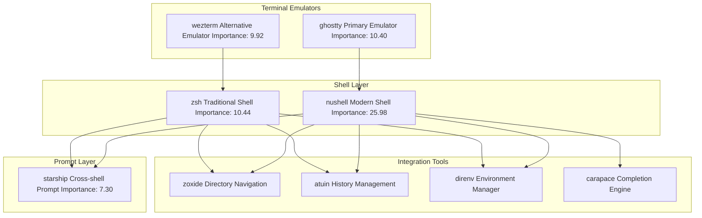
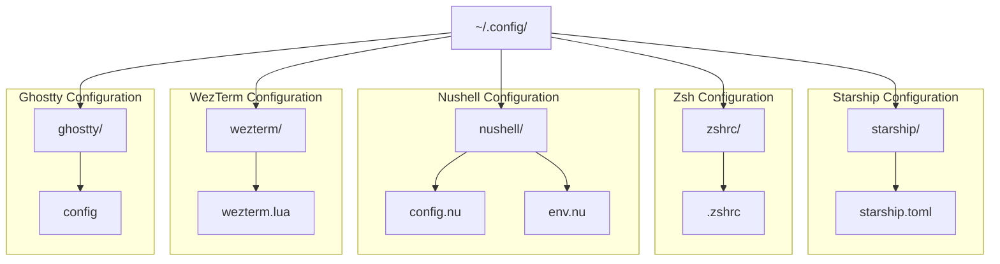
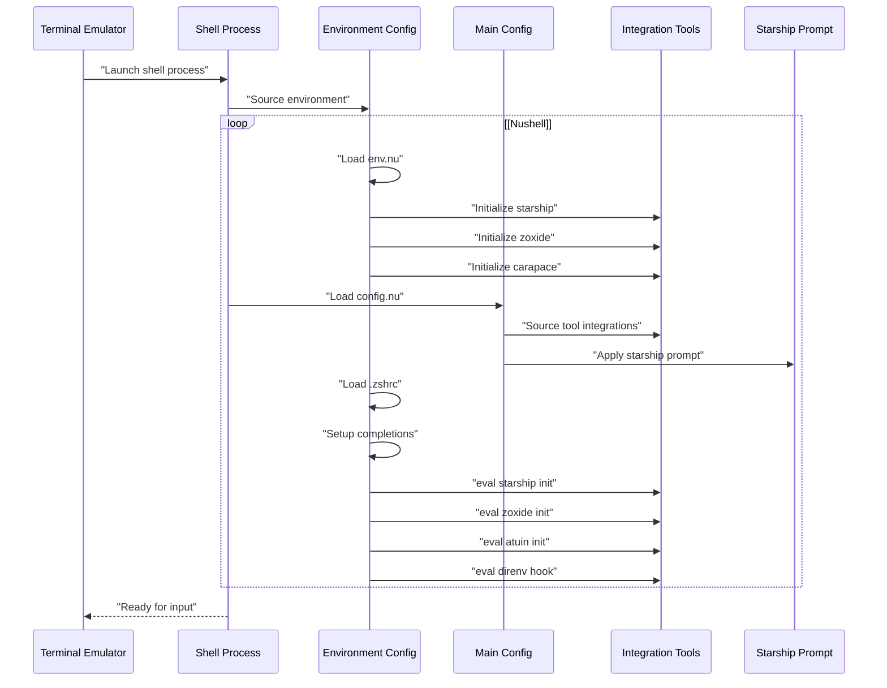
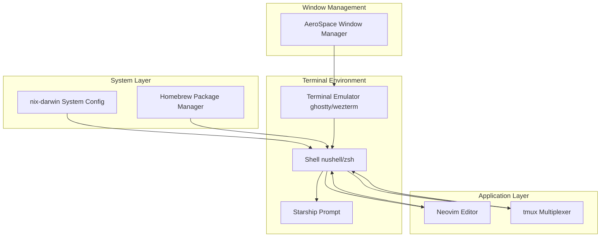

[/](/)

[/search](/search)

[/wiki](/wiki)

[/settings/members](/settings/members)

[/settings/support](/settings/support)

[Add repo](/repositories)

[All repos](/wiki)

[backend](/wiki/Klaudioz/backend)

[BH-Workflow-Engine](/wiki/Klaudioz/BH-Workflow-Engine)

[Buckhead_CRM](/wiki/Klaudioz/Buckhead_CRM)

[dotfiles](/wiki/Klaudioz/dotfiles)

[frontend](/wiki/Klaudioz/frontend)

[godeep.wiki-jb](/wiki/Klaudioz/godeep.wiki-jb)

[pi-mono-zero](/wiki/Klaudioz/pi-mono-zero)

[VirtualOracle](/wiki/Klaudioz/VirtualOracle)

# Terminal EnvironmentLink copied!

> **Relevant source files**
> * [.gitignore](https://github.com/Klaudioz/dotfiles/blob/2febda55/.gitignore)
> * [ghostty/config](https://github.com/Klaudioz/dotfiles/blob/2febda55/ghostty/config)
> * [ghostty/ps.json](https://github.com/Klaudioz/dotfiles/blob/2febda55/ghostty/ps.json)
> * [nushell/config.nu](https://github.com/Klaudioz/dotfiles/blob/2febda55/nushell/config.nu)
> * [nushell/env.nu](https://github.com/Klaudioz/dotfiles/blob/2febda55/nushell/env.nu)
> * [wezterm/wezterm.lua](https://github.com/Klaudioz/dotfiles/blob/2febda55/wezterm/wezterm.lua)
> * [zshrc/.zshrc](https://github.com/Klaudioz/dotfiles/blob/2febda55/zshrc/.zshrc)

## Purpose and ScopeLink copied!

This document provides an overview of the terminal environment layer in the dotfiles configuration. The terminal environment sits between the system configuration layer (see [System Configuration with Nix-Darwin](#2)) and the application layer (Neovim at [Neovim Editor Configuration](#4), tmux at [Terminal Multiplexing with tmux](#5)). It encompasses terminal emulators, shell environments, and prompt customization.

The terminal environment consists of:

* **Terminal Emulators**: Ghostty and WezTerm provide GPU-accelerated terminal interfaces
* **Shell Environments**: Nushell (modern, structured) and Zsh (traditional, compatible)
* **Prompt System**: Starship provides consistent cross-shell prompt styling

For detailed configuration of specific components, see:

* Terminal emulator specifics: [Terminal Emulators](#3.1)
* Shell-specific configuration: [Shell Configuration](#3.2)
* Prompt customization: [Starship Prompt](#3.3)

Sources: High-level architecture diagrams, [nushell/config.nu L1-L973](https://github.com/Klaudioz/dotfiles/blob/2febda55/nushell/config.nu#L1-L973)

 [zshrc/.zshrc L1-L157](https://github.com/Klaudioz/dotfiles/blob/2febda55/zshrc/.zshrc#L1-L157)

## Architecture OverviewLink copied!

The terminal environment layer provides the interface between the user and the system. Each component has a specific role in the interaction model.

### Terminal Environment Component HierarchyLink copied!



**Terminal Environment Layer Architecture**

This diagram illustrates the three-tier structure of the terminal environment. Terminal emulators (Ghostty and WezTerm) provide the display layer and process management. Shell environments (Nushell and Zsh) handle command interpretation and execution. The Starship prompt provides a unified presentation layer across both shells. Integration tools extend functionality through initialization hooks.

Sources: [nushell/config.nu L953-L958](https://github.com/Klaudioz/dotfiles/blob/2febda55/nushell/config.nu#L953-L958)

 [nushell/env.nu L123-L131](https://github.com/Klaudioz/dotfiles/blob/2febda55/nushell/env.nu#L123-L131)

 [zshrc/.zshrc L19-L20](https://github.com/Klaudioz/dotfiles/blob/2febda55/zshrc/.zshrc#L19-L20)

 [zshrc/.zshrc L154-L156](https://github.com/Klaudioz/dotfiles/blob/2febda55/zshrc/.zshrc#L154-L156)

## Configuration File MapLink copied!

The terminal environment configuration is distributed across multiple files in the repository structure.

### Configuration File LocationsLink copied!



**Configuration File Structure**

The configuration files are organized in the XDG Base Directory specification structure under `~/.config/`. Each component has its own directory with component-specific configuration files.

| Component | Configuration File | Purpose |
| --- | --- | --- |
| Ghostty | `ghostty/config` | Terminal emulator settings, font, appearance |
| WezTerm | `wezterm/wezterm.lua` | Terminal emulator configuration in Lua |
| Nushell | `nushell/config.nu` | Main shell configuration, aliases, keybindings |
| Nushell | `nushell/env.nu` | Environment variables, PATH, prompt functions |
| Zsh | `zshrc/.zshrc` | Shell configuration, completions, aliases |
| Starship | `starship/starship.toml` | Cross-shell prompt styling |

Sources: [ghostty/config L1-L6](https://github.com/Klaudioz/dotfiles/blob/2febda55/ghostty/config#L1-L6)

 [wezterm/wezterm.lua L1-L44](https://github.com/Klaudioz/dotfiles/blob/2febda55/wezterm/wezterm.lua#L1-L44)

 [nushell/config.nu L1-L6](https://github.com/Klaudioz/dotfiles/blob/2febda55/nushell/config.nu#L1-L6)

 [nushell/env.nu L1-L4](https://github.com/Klaudioz/dotfiles/blob/2febda55/nushell/env.nu#L1-L4)

 [zshrc/.zshrc L1-L157](https://github.com/Klaudioz/dotfiles/blob/2febda55/zshrc/.zshrc#L1-L157)

## Terminal EmulatorsLink copied!

The dotfiles configure two terminal emulators, providing choice based on preference and use case.

### Emulator ComparisonLink copied!

| Feature | Ghostty | WezTerm |
| --- | --- | --- |
| Configuration Format | Plain text | Lua script |
| Importance Score | 10.40 | 9.92 |
| Primary Use | General development | Alternative/fallback |
| Font Size | 19pt | 16pt |
| Background Blur | 20 radius | 30 opacity |
| Tab Bar | Not configured | Disabled |
| Window Decoration | Disabled | RESIZE |

### Ghostty ConfigurationLink copied!

Ghostty is configured as the primary terminal emulator with minimal settings focused on appearance:

```
font-size = 19
background-blur-radius = 20
mouse-hide-while-typing = true
window-decoration = false
macos-option-as-alt = true
```

Key features:

* `font-size = 19`: Larger font for readability
* `background-blur-radius = 20`: Translucent background with blur effect
* `window-decoration = false`: Borderless window for clean appearance
* `macos-option-as-alt = true`: macOS-specific modifier key configuration

Sources: [ghostty/config L1-L6](https://github.com/Klaudioz/dotfiles/blob/2febda55/ghostty/config#L1-L6)

### WezTerm ConfigurationLink copied!

WezTerm provides a Lua-based configuration with more extensive customization options:

The configuration defines:

* Color scheme: `Catppuccin Mocha` [wezterm/wezterm.lua L5](https://github.com/Klaudioz/dotfiles/blob/2febda55/wezterm/wezterm.lua#L5-L5)
* Font: `JetBrains Mono` at 16pt [wezterm/wezterm.lua L7-L8](https://github.com/Klaudioz/dotfiles/blob/2febda55/wezterm/wezterm.lua#L7-L8)
* Background blur: 30 with full opacity [wezterm/wezterm.lua L10](https://github.com/Klaudioz/dotfiles/blob/2febda55/wezterm/wezterm.lua#L10-L10)  [wezterm/wezterm.lua L19](https://github.com/Klaudioz/dotfiles/blob/2febda55/wezterm/wezterm.lua#L19-L19)
* Custom keybindings: * `Ctrl+q`: Toggle fullscreen [wezterm/wezterm.lua L25-L28](https://github.com/Klaudioz/dotfiles/blob/2febda55/wezterm/wezterm.lua#L25-L28) * `Ctrl+'`: Clear scrollback [wezterm/wezterm.lua L30-L33](https://github.com/Klaudioz/dotfiles/blob/2febda55/wezterm/wezterm.lua#L30-L33)
* Mouse bindings: `Ctrl+Click` opens links [wezterm/wezterm.lua L38-L41](https://github.com/Klaudioz/dotfiles/blob/2febda55/wezterm/wezterm.lua#L38-L41)

Sources: [wezterm/wezterm.lua L1-L44](https://github.com/Klaudioz/dotfiles/blob/2febda55/wezterm/wezterm.lua#L1-L44)

## Shell EnvironmentsLink copied!

Two shell environments provide different approaches to command-line interaction.

### Shell Initialization FlowLink copied!



**Shell Initialization Sequence**

This sequence shows the initialization flow for both shell environments. Nushell uses a two-file approach (`env.nu` then `config.nu`) while Zsh uses a single `.zshrc` file. Both shells initialize external tools and the Starship prompt during startup.

Sources: [nushell/env.nu L123-L131](https://github.com/Klaudioz/dotfiles/blob/2febda55/nushell/env.nu#L123-L131)

 [nushell/config.nu L953-L958](https://github.com/Klaudioz/dotfiles/blob/2febda55/nushell/config.nu#L953-L958)

 [zshrc/.zshrc L19-L20](https://github.com/Klaudioz/dotfiles/blob/2febda55/zshrc/.zshrc#L19-L20)

 [zshrc/.zshrc L154-L156](https://github.com/Klaudioz/dotfiles/blob/2febda55/zshrc/.zshrc#L154-L156)

### Nushell (Modern Shell)Link copied!

Nushell (importance: 25.98) provides a structured, data-oriented shell environment with strong typing and pipeline-based operations.

**Configuration Structure:**

* `env.nu`: Environment setup, PATH management, tool initialization [nushell/env.nu L1-L134](https://github.com/Klaudioz/dotfiles/blob/2febda55/nushell/env.nu#L1-L134)
* `config.nu`: Main configuration, aliases, keybindings, themes [nushell/config.nu L1-L973](https://github.com/Klaudioz/dotfiles/blob/2febda55/nushell/config.nu#L1-L973)

**Key Features:**

* Structured data handling with typed pipelines
* Vi editing mode: `edit_mode: vi` [nushell/config.nu L228](https://github.com/Klaudioz/dotfiles/blob/2febda55/nushell/config.nu#L228-L228)
* Custom themes: `$dark_theme` and `$light_theme` [nushell/config.nu L9-L140](https://github.com/Klaudioz/dotfiles/blob/2febda55/nushell/config.nu#L9-L140)
* Extensive keybindings: 50+ custom mappings [nushell/config.nu L387-L901](https://github.com/Klaudioz/dotfiles/blob/2febda55/nushell/config.nu#L387-L901)
* Integration with external tools via hooks [nushell/config.nu L279-L297](https://github.com/Klaudioz/dotfiles/blob/2febda55/nushell/config.nu#L279-L297)

**Tool Integrations:**

* Starship: Initialized in `env.nu` [nushell/env.nu L123-L124](https://github.com/Klaudioz/dotfiles/blob/2febda55/nushell/env.nu#L123-L124)
* Zoxide: Smart directory navigation [nushell/env.nu L125](https://github.com/Klaudioz/dotfiles/blob/2febda55/nushell/env.nu#L125-L125)  [nushell/config.nu L954](https://github.com/Klaudioz/dotfiles/blob/2febda55/nushell/config.nu#L954-L954)
* Atuin: Shell history sync [nushell/config.nu L956](https://github.com/Klaudioz/dotfiles/blob/2febda55/nushell/config.nu#L956-L956)
* Direnv: Environment management via pre-prompt hook [nushell/config.nu L280-L290](https://github.com/Klaudioz/dotfiles/blob/2febda55/nushell/config.nu#L280-L290)
* Carapace: Completion engine [nushell/env.nu L130-L131](https://github.com/Klaudioz/dotfiles/blob/2febda55/nushell/env.nu#L130-L131)  [nushell/config.nu L955](https://github.com/Klaudioz/dotfiles/blob/2febda55/nushell/config.nu#L955-L955)

Sources: [nushell/config.nu L1-L973](https://github.com/Klaudioz/dotfiles/blob/2febda55/nushell/config.nu#L1-L973)

 [nushell/env.nu L1-L134](https://github.com/Klaudioz/dotfiles/blob/2febda55/nushell/env.nu#L1-L134)

### Zsh (Traditional Shell)Link copied!

Zsh (importance: 10.44) provides a traditional Unix shell experience with extensive completion support.

**Configuration Features:**

* Case-insensitive completion: `zstyle ':completion:*' matcher-list 'm:{a-z}={A-Za-z}'` [zshrc/.zshrc L4](https://github.com/Klaudioz/dotfiles/blob/2febda55/zshrc/.zshrc#L4-L4)
* Bash completion compatibility: `bashcompinit` [zshrc/.zshrc L5](https://github.com/Klaudioz/dotfiles/blob/2febda55/zshrc/.zshrc#L5-L5)
* Auto-suggestions: Homebrew-provided plugin [zshrc/.zshrc L11-L17](https://github.com/Klaudioz/dotfiles/blob/2febda55/zshrc/.zshrc#L11-L17)
* Custom keybindings: * `Ctrl+w`: Execute suggestion [zshrc/.zshrc L12](https://github.com/Klaudioz/dotfiles/blob/2febda55/zshrc/.zshrc#L12-L12) * `Ctrl+e`: Accept suggestion [zshrc/.zshrc L13](https://github.com/Klaudioz/dotfiles/blob/2febda55/zshrc/.zshrc#L13-L13) * `Ctrl+k/j`: History navigation [zshrc/.zshrc L16-L17](https://github.com/Klaudioz/dotfiles/blob/2febda55/zshrc/.zshrc#L16-L17) * `jj`: Vi command mode [zshrc/.zshrc L95](https://github.com/Klaudioz/dotfiles/blob/2febda55/zshrc/.zshrc#L95-L95)

**Tool Integrations:**

* Starship: `eval "$(starship init zsh)"` [zshrc/.zshrc L19-L20](https://github.com/Klaudioz/dotfiles/blob/2febda55/zshrc/.zshrc#L19-L20)
* Zoxide: `eval "$(zoxide init zsh)"` [zshrc/.zshrc L154](https://github.com/Klaudioz/dotfiles/blob/2febda55/zshrc/.zshrc#L154-L154)
* Atuin: `eval "$(atuin init zsh)"` [zshrc/.zshrc L155](https://github.com/Klaudioz/dotfiles/blob/2febda55/zshrc/.zshrc#L155-L155)
* Direnv: `eval "$(direnv hook zsh)"` [zshrc/.zshrc L156](https://github.com/Klaudioz/dotfiles/blob/2febda55/zshrc/.zshrc#L156-L156)
* kubectl: Native completion [zshrc/.zshrc L8](https://github.com/Klaudioz/dotfiles/blob/2febda55/zshrc/.zshrc#L8-L8)
* AWS CLI: Native completion [zshrc/.zshrc L9](https://github.com/Klaudioz/dotfiles/blob/2febda55/zshrc/.zshrc#L9-L9)

Sources: [zshrc/.zshrc L1-L157](https://github.com/Klaudioz/dotfiles/blob/2febda55/zshrc/.zshrc#L1-L157)

## Aliases and CommandsLink copied!

Both shells define extensive alias sets for common operations.

### Common Aliases Across ShellsLink copied!

| Category | Nushell Aliases | Zsh Aliases | Purpose |
| --- | --- | --- | --- |
| Navigation | `cx = cd + ls` | `cx() = cd + l` | Change directory and list |
| Editor | `v = nvim` | `v = nvim` | Quick Neovim launch |
| Git | `gc`, `gca`, `gp`, `gst`, etc. | `gc`, `gca`, `gp`, `gst`, etc. | Git command shortcuts |
| Kubernetes | `k`, `ka`, `kg`, `kd`, etc. | `k`, `ka`, `kg`, `kd`, etc. | kubectl shortcuts |
| Clear | `c = clear` | `cl = clear` | Clear screen |
| List | `l`, `ll`, `lt` | `l`, `lt` | Enhanced listing with eza |

### Shell-Specific CommandsLink copied!

**Nushell Custom Commands:**

* `cx [arg]`: Changes directory and lists contents [nushell/config.nu L904-L907](https://github.com/Klaudioz/dotfiles/blob/2febda55/nushell/config.nu#L904-L907)
* `ff []`: Fuzzy find and focus window using AeroSpace [nushell/config.nu L918-L920](https://github.com/Klaudioz/dotfiles/blob/2febda55/nushell/config.nu#L918-L920)

**Zsh Custom Functions:**

* `ranger`: File manager integration with directory tracking [zshrc/.zshrc L123-L138](https://github.com/Klaudioz/dotfiles/blob/2febda55/zshrc/.zshrc#L123-L138)
* `fcd()`: Fuzzy find and change directory [zshrc/.zshrc L142](https://github.com/Klaudioz/dotfiles/blob/2febda55/zshrc/.zshrc#L142-L142)
* `f()`: Find file and copy path to clipboard [zshrc/.zshrc L143](https://github.com/Klaudioz/dotfiles/blob/2febda55/zshrc/.zshrc#L143-L143)
* `fv()`: Fuzzy find and open in Neovim [zshrc/.zshrc L144](https://github.com/Klaudioz/dotfiles/blob/2febda55/zshrc/.zshrc#L144-L144)

Sources: [nushell/config.nu L904-L952](https://github.com/Klaudioz/dotfiles/blob/2febda55/nushell/config.nu#L904-L952)

 [zshrc/.zshrc L27-L109](https://github.com/Klaudioz/dotfiles/blob/2febda55/zshrc/.zshrc#L27-L109)

 [zshrc/.zshrc L123-L144](https://github.com/Klaudioz/dotfiles/blob/2febda55/zshrc/.zshrc#L123-L144)

## Prompt ConfigurationLink copied!

Starship provides a unified prompt experience across both shell environments.

### Starship IntegrationLink copied!

Both shells initialize Starship but use different mechanisms:

**Nushell Starship Setup:**

```
starship init nu | save -f ~/.cache/starship/init.nuuse ~/.cache/starship/init.nu$env.STARSHIP_CONFIG = /Users/omerxx/.config/starship/starship.toml
```

The initialization generates a Nushell module and caches it for performance [nushell/env.nu L123-L127](https://github.com/Klaudioz/dotfiles/blob/2febda55/nushell/env.nu#L123-L127)

**Zsh Starship Setup:**

```
eval "$(starship init zsh)"export STARSHIP_CONFIG=~/.config/starship/starship.toml
```

The initialization is evaluated directly in the shell [zshrc/.zshrc L19-L20](https://github.com/Klaudioz/dotfiles/blob/2febda55/zshrc/.zshrc#L19-L20)

Both configurations point to the same Starship configuration file, ensuring consistent prompt appearance across shells. For detailed prompt customization, see [Starship Prompt](#3.3).

Sources: [nushell/env.nu L123-L127](https://github.com/Klaudioz/dotfiles/blob/2febda55/nushell/env.nu#L123-L127)

 [zshrc/.zshrc L19-L20](https://github.com/Klaudioz/dotfiles/blob/2febda55/zshrc/.zshrc#L19-L20)

## Environment ManagementLink copied!

Environment variables and PATH management differ between the shells but achieve similar goals.

### PATH ConfigurationLink copied!

**Nushell PATH Management:**

Nushell uses conditional PATH augmentation to avoid conflicts with Nix shells and Devbox:

```
if 'IN_NIX_SHELL' not-in $env and 'DEVBOX_SHELL_ENABLED' not-in $env {    $env.PATH = ($env.PATH | append [        /opt/homebrew/bin        /run/current-system/sw/bin        /Users/omerxx/.local/bin        ...    ])}
```

This prevents PATH pollution when working in isolated development environments [nushell/env.nu L100-L109](https://github.com/Klaudioz/dotfiles/blob/2febda55/nushell/env.nu#L100-L109)

**Zsh PATH Management:**

Zsh uses a simpler append-based approach:

```
export PATH=/usr/local/bin:/usr/bin:/bin:...export PATH=/opt/homebrew/bin:$PATHexport PATH=/run/current-system/sw/bin:$PATH
```

Paths are explicitly defined and prepended for priority [zshrc/.zshrc L70](https://github.com/Klaudioz/dotfiles/blob/2febda55/zshrc/.zshrc#L70-L70)

 [zshrc/.zshrc L115](https://github.com/Klaudioz/dotfiles/blob/2febda55/zshrc/.zshrc#L115-L115)

 [zshrc/.zshrc L121](https://github.com/Klaudioz/dotfiles/blob/2febda55/zshrc/.zshrc#L121-L121)

### Editor ConfigurationLink copied!

Both shells set `nvim` as the default editor:

* Nushell: `$env.EDITOR = "nvim"` [nushell/env.nu L133](https://github.com/Klaudioz/dotfiles/blob/2febda55/nushell/env.nu#L133-L133)
* Zsh: `export EDITOR=/opt/homebrew/bin/nvim` [zshrc/.zshrc L25](https://github.com/Klaudioz/dotfiles/blob/2febda55/zshrc/.zshrc#L25-L25)

Sources: [nushell/env.nu L100-L109](https://github.com/Klaudioz/dotfiles/blob/2febda55/nushell/env.nu#L100-L109)

 [nushell/env.nu L133](https://github.com/Klaudioz/dotfiles/blob/2febda55/nushell/env.nu#L133-L133)

 [zshrc/.zshrc L25](https://github.com/Klaudioz/dotfiles/blob/2febda55/zshrc/.zshrc#L25-L25)

 [zshrc/.zshrc L70](https://github.com/Klaudioz/dotfiles/blob/2febda55/zshrc/.zshrc#L70-L70)

 [zshrc/.zshrc L115](https://github.com/Klaudioz/dotfiles/blob/2febda55/zshrc/.zshrc#L115-L115)

 [zshrc/.zshrc L121](https://github.com/Klaudioz/dotfiles/blob/2febda55/zshrc/.zshrc#L121-L121)

## Integration with Other LayersLink copied!

The terminal environment integrates with multiple system layers to provide a cohesive development experience.

### Layer Integration PointsLink copied!



**Cross-Layer Integration Architecture**

This diagram shows how the terminal environment serves as a bridge between the system layer and application layer. System configuration tools provide packages, terminal emulators host shells, and shells launch applications like Neovim and tmux.

### Key Integration PatternsLink copied!

**System to Terminal:**

* Nix-Darwin installs system packages available to shells
* PATH includes Nix store locations: `/run/current-system/sw/bin`
* Homebrew-installed tools augment system capabilities

**Terminal to Application:**

* Shells launch Neovim via `nvim` command or aliases
* Shells integrate with tmux for session management
* Window manager (AeroSpace) controls terminal window placement

**External Service Integration:**

* Atuin provides cloud-synced shell history
* Direnv manages per-directory environments
* Zoxide provides intelligent directory jumping

For system configuration details, see [System Configuration with Nix-Darwin](#2). For application-level integration, see [Neovim Editor Configuration](#4) and [Terminal Multiplexing with tmux](#5).

Sources: [nushell/env.nu L100-L109](https://github.com/Klaudioz/dotfiles/blob/2febda55/nushell/env.nu#L100-L109)

 [nushell/config.nu L279-L290](https://github.com/Klaudioz/dotfiles/blob/2febda55/nushell/config.nu#L279-L290)

 [zshrc/.zshrc L154-L156](https://github.com/Klaudioz/dotfiles/blob/2febda55/zshrc/.zshrc#L154-L156)

Refresh this wiki

Last indexed: 18 December 2025 ([2febda](https://github.com/Klaudioz/dotfiles/commit/2febda55))

### On this page

* [Terminal Environment](#3-terminal-environment)
* [Purpose and Scope](#3-purpose-and-scope)
* [Architecture Overview](#3-architecture-overview)
* [Terminal Environment Component Hierarchy](#3-terminal-environment-component-hierarchy)
* [Configuration File Map](#3-configuration-file-map)
* [Configuration File Locations](#3-configuration-file-locations)
* [Terminal Emulators](#3-terminal-emulators)
* [Emulator Comparison](#3-emulator-comparison)
* [Ghostty Configuration](#3-ghostty-configuration)
* [WezTerm Configuration](#3-wezterm-configuration)
* [Shell Environments](#3-shell-environments)
* [Shell Initialization Flow](#3-shell-initialization-flow)
* [Nushell (Modern Shell)](#3-nushell-modern-shell)
* [Zsh (Traditional Shell)](#3-zsh-traditional-shell)
* [Aliases and Commands](#3-aliases-and-commands)
* [Common Aliases Across Shells](#3-common-aliases-across-shells)
* [Shell-Specific Commands](#3-shell-specific-commands)
* [Prompt Configuration](#3-prompt-configuration)
* [Starship Integration](#3-starship-integration)
* [Environment Management](#3-environment-management)
* [PATH Configuration](#3-path-configuration)
* [Editor Configuration](#3-editor-configuration)
* [Integration with Other Layers](#3-integration-with-other-layers)
* [Layer Integration Points](#3-layer-integration-points)
* [Key Integration Patterns](#3-key-integration-patterns)

Ask Devin about dotfiles

  

Syntax error in text

mermaid version 11.4.1

Syntax error in text

mermaid version 11.4.1