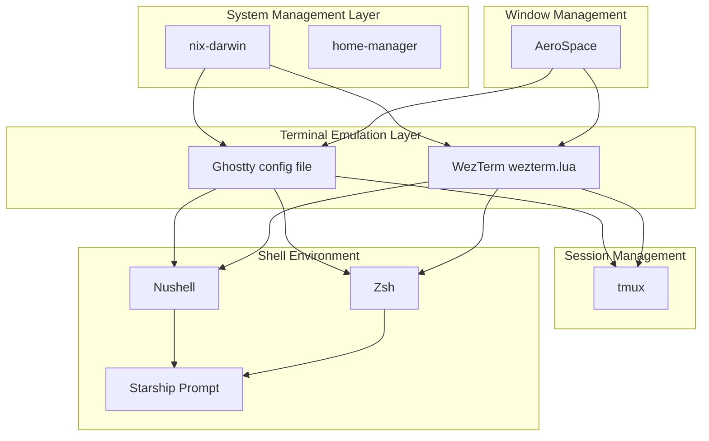
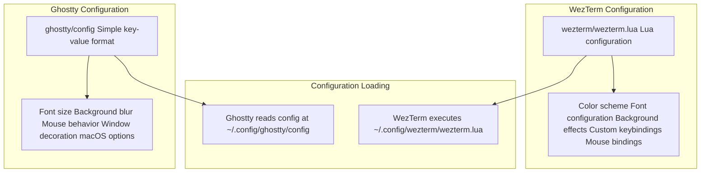
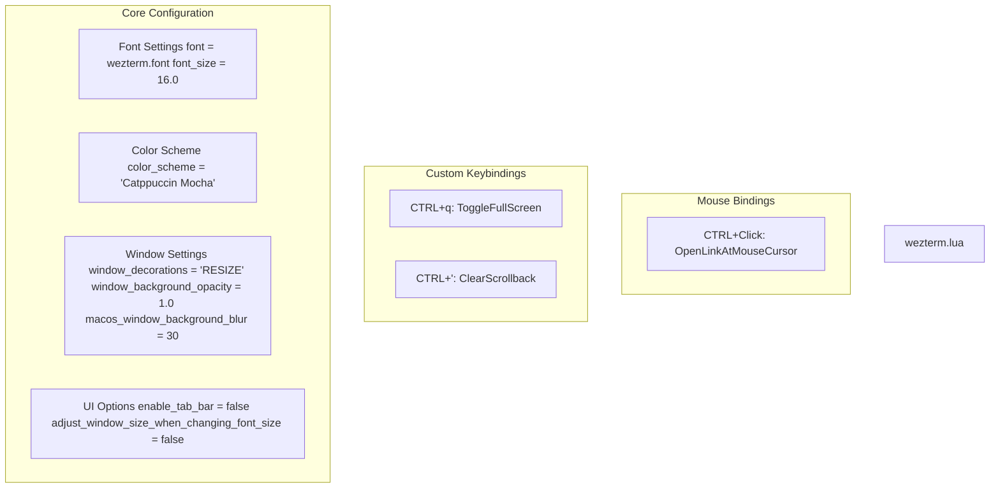
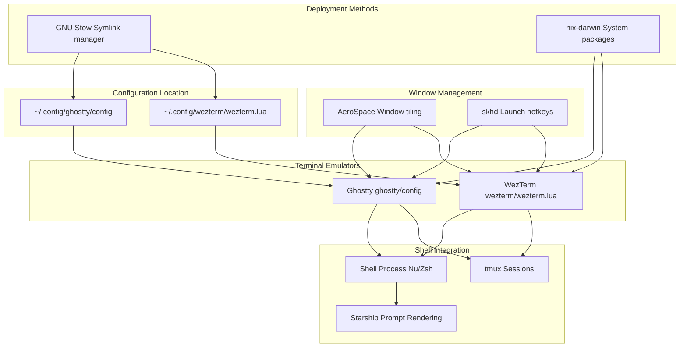

[/](/)

[/search](/search)

[/wiki](/wiki)

[/settings/members](/settings/members)

[/settings/support](/settings/support)

[Add repo](/repositories)

[All repos](/wiki)

[backend](/wiki/Klaudioz/backend)

[BH-Workflow-Engine](/wiki/Klaudioz/BH-Workflow-Engine)

[Buckhead_CRM](/wiki/Klaudioz/Buckhead_CRM)

[dotfiles](/wiki/Klaudioz/dotfiles)

[frontend](/wiki/Klaudioz/frontend)

[godeep.wiki-jb](/wiki/Klaudioz/godeep.wiki-jb)

[pi-mono-zero](/wiki/Klaudioz/pi-mono-zero)

[VirtualOracle](/wiki/Klaudioz/VirtualOracle)

# Terminal EmulatorsLink copied!

> **Relevant source files**
> * [ghostty/config](https://github.com/Klaudioz/dotfiles/blob/2febda55/ghostty/config)
> * [ghostty/ps.json](https://github.com/Klaudioz/dotfiles/blob/2febda55/ghostty/ps.json)
> * [wezterm/wezterm.lua](https://github.com/Klaudioz/dotfiles/blob/2febda55/wezterm/wezterm.lua)

## Purpose and ScopeLink copied!

This document covers the two terminal emulator configurations provided in this dotfiles repository: Ghostty and WezTerm. Both emulators serve as the graphical interface layer between macOS and the shell environment, hosting shell sessions (Nushell or Zsh) and terminal multiplexers (tmux).

For detailed configuration settings of each emulator, see [Ghostty Configuration](#3.1.1) and [WezTerm Configuration](#3.1.2). For information about the shells that run within these emulators, see [Shell Configuration](#3.2). For window management of terminal emulator windows, see [AeroSpace Tiling Window Manager](#6.1).

**Sources:** High-level system diagrams

## Terminal Emulator Layer ArchitectureLink copied!

The terminal emulators occupy a critical position in the system stack, sitting between the system management layer (nix-darwin) and the shell environment layer. They provide the graphical rendering and input handling for all terminal-based workflows.



**Sources:** High-level system diagrams, [ghostty/config](https://github.com/Klaudioz/dotfiles/blob/2febda55/ghostty/config)

 [wezterm/wezterm.lua](https://github.com/Klaudioz/dotfiles/blob/2febda55/wezterm/wezterm.lua)

## Configuration File OverviewLink copied!

Both terminal emulators use different configuration approaches that reflect their design philosophies.



**Sources:** [ghostty/config](https://github.com/Klaudioz/dotfiles/blob/2febda55/ghostty/config)

 [wezterm/wezterm.lua](https://github.com/Klaudioz/dotfiles/blob/2febda55/wezterm/wezterm.lua)

## GhosttyLink copied!

Ghostty uses a minimalist configuration approach with a simple key-value format in `ghostty/config`. The configuration file contains only 6 lines, focusing on essential visual and behavioral settings.

### Configuration StructureLink copied!

The Ghostty configuration file follows a straightforward `key = value` format:

| Setting | Value | Purpose |
| --- | --- | --- |
| `font-size` | `19` | Terminal font size |
| `background-blur-radius` | `20` | macOS window blur effect |
| `mouse-hide-while-typing` | `true` | Automatically hides cursor during keyboard input |
| `window-decoration` | `false` | Removes standard macOS window titlebar |
| `macos-option-as-alt` | `true` | Maps Option key to Alt for better keybinding compatibility |

The configuration emphasizes a clean, distraction-free terminal experience with macOS-specific optimizations. The lack of window decoration (`window-decoration = false`) combined with background blur creates a modern, minimal aesthetic that integrates well with AeroSpace's tiling window management.

For comprehensive details on each configuration option, see [Ghostty Configuration](#3.1.1).

**Sources:** [ghostty/config L1-L6](https://github.com/Klaudioz/dotfiles/blob/2febda55/ghostty/config#L1-L6)

## WezTermLink copied!

WezTerm uses Lua-based configuration via `wezterm/wezterm.lua`, providing programmatic control over terminal behavior. The configuration is more extensive than Ghostty's, with explicit control over visual appearance, keybindings, and mouse interactions.

### Configuration StructureLink copied!



**Sources:** [wezterm/wezterm.lua L1-L44](https://github.com/Klaudioz/dotfiles/blob/2febda55/wezterm/wezterm.lua#L1-L44)

### Key FeaturesLink copied!

The WezTerm configuration includes:

1. **Font Configuration**: Uses JetBrains Mono at 16pt with static window sizing [wezterm/wezterm.lua L3-L8](https://github.com/Klaudioz/dotfiles/blob/2febda55/wezterm/wezterm.lua#L3-L8)
2. **Color Scheme**: Catppuccin Mocha theme for consistent styling [wezterm/wezterm.lua L5](https://github.com/Klaudioz/dotfiles/blob/2febda55/wezterm/wezterm.lua#L5-L5)
3. **Background Effects**: macOS window blur set to 30 with full opacity [wezterm/wezterm.lua L10-L19](https://github.com/Klaudioz/dotfiles/blob/2febda55/wezterm/wezterm.lua#L10-L19)
4. **Window Decoration**: `RESIZE` mode allows resizing without full titlebar [wezterm/wezterm.lua L22](https://github.com/Klaudioz/dotfiles/blob/2febda55/wezterm/wezterm.lua#L22-L22)
5. **Tab Bar**: Disabled for cleaner appearance [wezterm/wezterm.lua L6](https://github.com/Klaudioz/dotfiles/blob/2febda55/wezterm/wezterm.lua#L6-L6)

The configuration includes commented-out alternatives for background images and varying opacity levels, suggesting experimentation with different visual styles [wezterm/wezterm.lua L12-L21](https://github.com/Klaudioz/dotfiles/blob/2febda55/wezterm/wezterm.lua#L12-L21)

For comprehensive details on keybindings, mouse bindings, and all configuration options, see [WezTerm Configuration](#3.1.2).

**Sources:** [wezterm/wezterm.lua L1-L44](https://github.com/Klaudioz/dotfiles/blob/2febda55/wezterm/wezterm.lua#L1-L44)

## Configuration ComparisonLink copied!

| Aspect | Ghostty | WezTerm |
| --- | --- | --- |
| **Configuration Format** | Simple key-value | Lua script |
| **Configuration File** | `ghostty/config` | `wezterm/wezterm.lua` |
| **Lines of Config** | 6 | 44 |
| **Font Size** | 19pt | 16pt |
| **Color Scheme** | Not specified (defaults) | Catppuccin Mocha |
| **Background Blur** | 20 | 30 |
| **Window Decoration** | Disabled (`false`) | Minimal (`RESIZE`) |
| **Window Opacity** | Not specified (default) | 1.0 (opaque) |
| **Custom Keybindings** | None configured | 2 custom bindings |
| **Mouse Bindings** | None configured | 1 custom binding |
| **Tab Bar** | Not specified | Explicitly disabled |
| **macOS Integration** | Option-as-Alt enabled | Background blur enabled |

**Sources:** [ghostty/config L1-L6](https://github.com/Klaudioz/dotfiles/blob/2febda55/ghostty/config#L1-L6)

 [wezterm/wezterm.lua L1-L44](https://github.com/Klaudioz/dotfiles/blob/2febda55/wezterm/wezterm.lua#L1-L44)

## Integration with System ComponentsLink copied!

Both terminal emulators integrate with the broader dotfiles ecosystem through multiple touchpoints:



**Sources:** High-level system diagrams, [ghostty/config](https://github.com/Klaudioz/dotfiles/blob/2febda55/ghostty/config)

 [wezterm/wezterm.lua](https://github.com/Klaudioz/dotfiles/blob/2febda55/wezterm/wezterm.lua)

### DeploymentLink copied!

Both configurations are deployed using either:

* **GNU Stow**: Symlinks configuration files from the repository to `~/.config/`
* **nix-darwin**: Manages package installation and can also handle configuration deployment

See [Installation and Setup](#1.1) for deployment procedures and [Flake Configuration](#2.1) for nix-darwin integration details.

### Shell HostingLink copied!

When launched, both terminal emulators spawn a shell process. The shell choice depends on user preference and can be configured at the system level:

* **Nushell** (`nu`) as the modern, structured shell option
* **Zsh** as the traditional shell option

Both shells initialize Starship for prompt rendering. See [Shell Configuration](#3.2) for details on shell setup.

### tmux MultiplexingLink copied!

Both emulators can host tmux sessions, which provide:

* Multiple windows within a single terminal
* Persistent sessions via tmux-resurrect
* Advanced pane management

The terminal emulator handles rendering while tmux manages logical session organization. See [Terminal Multiplexing with tmux](#5) for tmux configuration details.

### Window ManagementLink copied!

AeroSpace tiling window manager controls the positioning and sizing of terminal emulator windows. The minimal window decorations in both configurations (`window-decoration = false` for Ghostty, `window_decorations = 'RESIZE'` for WezTerm) optimize integration with tiling layouts.

See [AeroSpace Tiling Window Manager](#6.1) for workspace management and [skhd Hotkey Configuration](#6.2) for application launching shortcuts.

**Sources:** High-level system diagrams

## Choosing Between EmulatorsLink copied!

The repository provides both emulators to accommodate different use cases and preferences:

### Use Ghostty When:Link copied!

* **Simplicity is preferred**: The minimal 6-line configuration is easy to understand and modify
* **macOS-native feel is desired**: Ghostty is optimized for macOS with native integrations
* **Minimal configuration overhead**: No Lua programming knowledge required
* **Larger font sizes work better**: Configured with 19pt font for better readability

### Use WezTerm When:Link copied!

* **Programmatic configuration is needed**: Lua scripting enables complex conditional logic
* **Fine-grained control is required**: Explicit control over keybindings, mouse actions, and visual effects
* **Cross-platform consistency matters**: WezTerm's Lua config is portable across operating systems
* **Theme integration is important**: Explicitly configured with Catppuccin Mocha for consistent styling
* **Custom automation is planned**: Lua enables advanced configuration scripting

### Importance ScoresLink copied!

Based on the high-level system analysis:

* **Ghostty**: Importance score 10.40
* **WezTerm**: Importance score 9.92

Ghostty's slightly higher importance score suggests it may be the primary terminal in this configuration, though both are fully supported.

**Sources:** High-level system diagrams, [ghostty/config](https://github.com/Klaudioz/dotfiles/blob/2febda55/ghostty/config)

 [wezterm/wezterm.lua](https://github.com/Klaudioz/dotfiles/blob/2febda55/wezterm/wezterm.lua)

## Configuration File LocationsLink copied!

Both terminal emulators follow XDG Base Directory specifications:

```markdown
~/.config/
├── ghostty/
│   └── config                 # Ghostty configuration
└── wezterm/
    └── wezterm.lua           # WezTerm configuration
```

After deployment via stow or nix-darwin, these files are symlinked or copied to the appropriate `~/.config/` subdirectories. The terminal emulators automatically detect and load these configurations on startup.

For the source repository structure, both configuration directories exist at the root level:

```
dotfiles/
├── ghostty/
│   └── config
└── wezterm/
    └── wezterm.lua
```

**Sources:** [ghostty/config](https://github.com/Klaudioz/dotfiles/blob/2febda55/ghostty/config)

 [wezterm/wezterm.lua](https://github.com/Klaudioz/dotfiles/blob/2febda55/wezterm/wezterm.lua)

 high-level system diagrams

Refresh this wiki

Last indexed: 18 December 2025 ([2febda](https://github.com/Klaudioz/dotfiles/commit/2febda55))

### On this page

* [Terminal Emulators](#3.1-terminal-emulators)
* [Purpose and Scope](#3.1-purpose-and-scope)
* [Terminal Emulator Layer Architecture](#3.1-terminal-emulator-layer-architecture)
* [Configuration File Overview](#3.1-configuration-file-overview)
* [Ghostty](#3.1-ghostty)
* [Configuration Structure](#3.1-configuration-structure)
* [WezTerm](#3.1-wezterm)
* [Configuration Structure](#3.1-configuration-structure-1)
* [Key Features](#3.1-key-features)
* [Configuration Comparison](#3.1-configuration-comparison)
* [Integration with System Components](#3.1-integration-with-system-components)
* [Deployment](#3.1-deployment)
* [Shell Hosting](#3.1-shell-hosting)
* [tmux Multiplexing](#3.1-tmux-multiplexing)
* [Window Management](#3.1-window-management)
* [Choosing Between Emulators](#3.1-choosing-between-emulators)
* [Use Ghostty When:](#3.1-use-ghostty-when)
* [Use WezTerm When:](#3.1-use-wezterm-when)
* [Importance Scores](#3.1-importance-scores)
* [Configuration File Locations](#3.1-configuration-file-locations)

Ask Devin about dotfiles

  

Syntax error in text

mermaid version 11.4.1

Syntax error in text

mermaid version 11.4.1