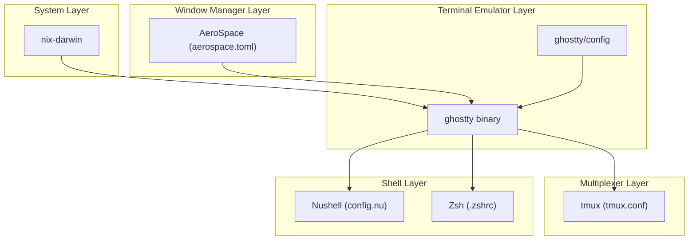
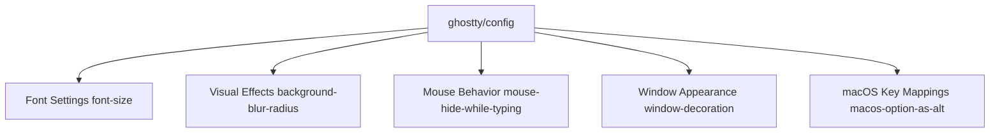
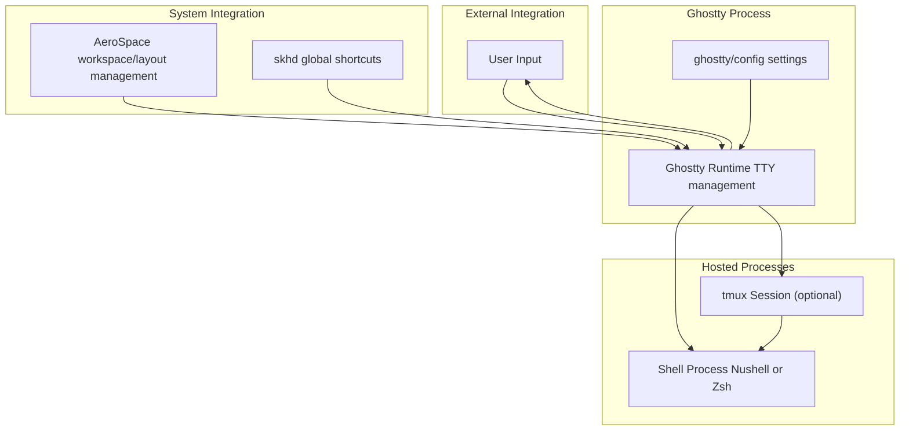
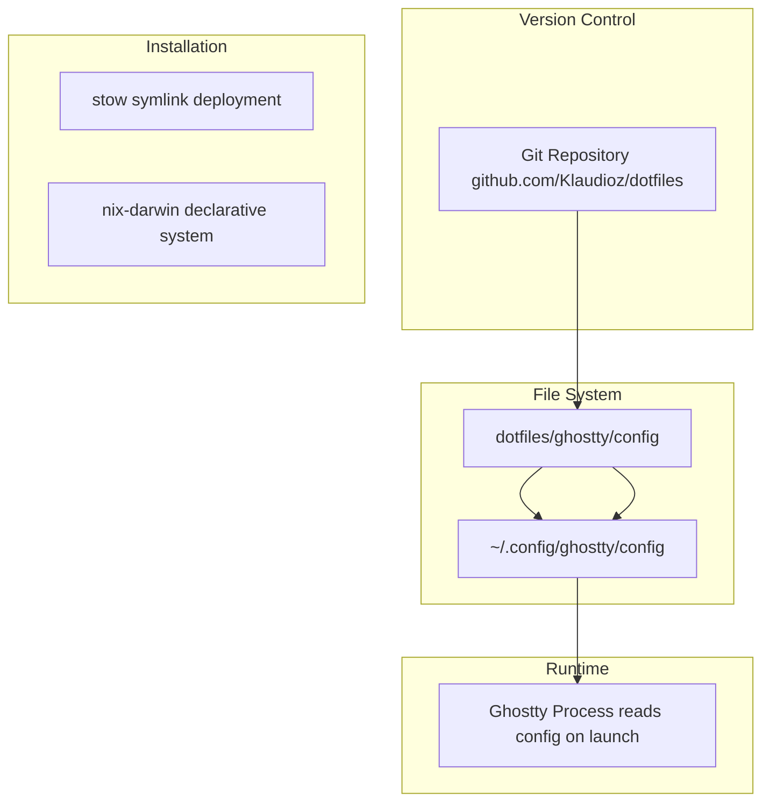

[/](/)

[/search](/search)

[/wiki](/wiki)

[/settings/members](/settings/members)

[/settings/support](/settings/support)

[Add repo](/repositories)

[All repos](/wiki)

[backend](/wiki/Klaudioz/backend)

[BH-Workflow-Engine](/wiki/Klaudioz/BH-Workflow-Engine)

[Buckhead_CRM](/wiki/Klaudioz/Buckhead_CRM)

[dotfiles](/wiki/Klaudioz/dotfiles)

[frontend](/wiki/Klaudioz/frontend)

[godeep.wiki-jb](/wiki/Klaudioz/godeep.wiki-jb)

[pi-mono-zero](/wiki/Klaudioz/pi-mono-zero)

[VirtualOracle](/wiki/Klaudioz/VirtualOracle)

# Ghostty ConfigurationLink copied!

> **Relevant source files**
> * [ghostty/config](https://github.com/Klaudioz/dotfiles/blob/2febda55/ghostty/config)
> * [ghostty/ps.json](https://github.com/Klaudioz/dotfiles/blob/2febda55/ghostty/ps.json)

## Purpose and ScopeLink copied!

This document details the configuration of Ghostty, a terminal emulator used in the dotfiles repository. Ghostty serves as one of two terminal emulator options (alongside WezTerm, documented in [3.1.2](#3.1.2)) and provides the foundational layer for hosting shell environments and terminal multiplexers.

For general information about terminal emulators and their role in the system architecture, see [3.1 Terminal Emulators](#3.1). For shell configuration that runs within Ghostty, see [3.2 Shell Configuration](#3.2). For tmux integration, see [5 Terminal Multiplexing with tmux](#5).

## Configuration OverviewLink copied!

Ghostty is configured through a single configuration file located at [ghostty/config L1-L6](https://github.com/Klaudioz/dotfiles/blob/2febda55/ghostty/config#L1-L6)

 The configuration uses a simple key-value format where each line specifies a setting with the syntax `key = value`. This minimalist configuration focuses on visual aesthetics, keyboard behavior, and macOS-specific integration.

The Ghostty configuration is managed declaratively by `nix-darwin` at the system level (importance 13.67), which ensures the terminal emulator is installed and available system-wide.

**Sources:** [ghostty/config L1-L6](https://github.com/Klaudioz/dotfiles/blob/2febda55/ghostty/config#L1-L6)

## Ghostty in the Terminal StackLink copied!

The following diagram illustrates where Ghostty sits in the system architecture and what components it hosts:

**Sources:** [ghostty/config L1-L6](https://github.com/Klaudioz/dotfiles/blob/2febda55/ghostty/config#L1-L6)

## Configuration StructureLink copied!

The Ghostty configuration file contains five distinct settings organized by functional category:

**Sources:** [ghostty/config L1-L6](https://github.com/Klaudioz/dotfiles/blob/2febda55/ghostty/config#L1-L6)

## Configuration SettingsLink copied!

### Font ConfigurationLink copied!

| Setting | Value | Purpose |
| --- | --- | --- |
| `font-size` | `19` | Sets the terminal font size in points |

The font size is configured at [ghostty/config L1](https://github.com/Klaudioz/dotfiles/blob/2febda55/ghostty/config#L1-L1)

 A value of `19` provides a comfortable reading size for modern high-resolution displays. Note that the font family itself is not specified in this configuration, meaning Ghostty will use its default font.

**Sources:** [ghostty/config L1](https://github.com/Klaudioz/dotfiles/blob/2febda55/ghostty/config#L1-L1)

### Visual EffectsLink copied!

| Setting | Value | Purpose |
| --- | --- | --- |
| `background-blur-radius` | `20` | Applies a blur effect to content behind the terminal window |

The background blur effect at [ghostty/config L2](https://github.com/Klaudioz/dotfiles/blob/2febda55/ghostty/config#L2-L2)

 creates a frosted glass aesthetic when the terminal is not fully opaque. This visual effect is particularly useful when overlaying the terminal on other content, providing visual separation while maintaining partial transparency. The blur radius of `20` creates a moderate blur effect.

**Sources:** [ghostty/config L2](https://github.com/Klaudioz/dotfiles/blob/2febda55/ghostty/config#L2-L2)

### Mouse BehaviorLink copied!

| Setting | Value | Purpose |
| --- | --- | --- |
| `mouse-hide-while-typing` | `true` | Automatically hides the mouse cursor during keyboard input |

The mouse hiding behavior at [ghostty/config L3](https://github.com/Klaudioz/dotfiles/blob/2febda55/ghostty/config#L3-L3)

 reduces visual clutter by concealing the mouse cursor when typing. The cursor reappears automatically when mouse movement is detected, providing a distraction-free typing experience.

**Sources:** [ghostty/config L3](https://github.com/Klaudioz/dotfiles/blob/2febda55/ghostty/config#L3-L3)

### Window AppearanceLink copied!

| Setting | Value | Purpose |
| --- | --- | --- |
| `window-decoration` | `false` | Disables native window title bar and controls |

Window decoration is disabled at [ghostty/config L4](https://github.com/Klaudioz/dotfiles/blob/2febda55/ghostty/config#L4-L4)

 removing the standard macOS title bar, close/minimize/maximize buttons, and window border. This creates a cleaner, more minimal appearance and maximizes usable screen space. Window management operations are instead handled by external tools like AeroSpace window manager (documented in [6.1](#6.1)).

**Sources:** [ghostty/config L4](https://github.com/Klaudioz/dotfiles/blob/2febda55/ghostty/config#L4-L4)

### macOS-Specific Key MappingsLink copied!

| Setting | Value | Purpose |
| --- | --- | --- |
| `macos-option-as-alt` | `true` | Treats the Option key as Alt for terminal key sequences |

The Option key mapping at [ghostty/config L5](https://github.com/Klaudioz/dotfiles/blob/2febda55/ghostty/config#L5-L5)

 configures macOS behavior to match standard Unix terminal expectations. By default, macOS uses the Option key for special character input (e.g., Option+e for accents). Setting this to `true` makes Option function as the Alt/Meta key, which is essential for Emacs-style keybindings and many terminal applications that expect Alt key combinations.

**Sources:** [ghostty/config L5](https://github.com/Klaudioz/dotfiles/blob/2febda55/ghostty/config#L5-L5)

## Integration PointsLink copied!

The following diagram shows how Ghostty integrates with other components in the system:

**Sources:** [ghostty/config L1-L6](https://github.com/Klaudioz/dotfiles/blob/2febda55/ghostty/config#L1-L6)

### Terminal Hosting ResponsibilitiesLink copied!

Ghostty serves as the host process for:

1. **Shell Environments**: Spawns and manages shell processes (Nushell documented in [3.2.1](#3.2.1), Zsh documented in [3.2.2](#3.2.2))
2. **Terminal Multiplexer**: Optionally runs tmux for session management (documented in [5](#5))
3. **Text Editors**: Indirectly hosts Neovim when launched from shell (documented in [4](#4))

### Window Management IntegrationLink copied!

Ghostty windows are managed by:

* **AeroSpace**: Tiling window manager that controls window position and size ([6.1](#6.1))
* **skhd**: Hotkey daemon that can launch new Ghostty instances ([6.2](#6.2))

The `window-decoration = false` setting at [ghostty/config L4](https://github.com/Klaudioz/dotfiles/blob/2febda55/ghostty/config#L4-L4)

 is particularly important for AeroSpace integration, as it removes redundant window chrome and allows the tiling window manager to have full control over window appearance and positioning.

**Sources:** [ghostty/config L4](https://github.com/Klaudioz/dotfiles/blob/2febda55/ghostty/config#L4-L4)

## Configuration ManagementLink copied!

**Sources:** [ghostty/config L1-L6](https://github.com/Klaudioz/dotfiles/blob/2febda55/ghostty/config#L1-L6)

### Deployment MethodsLink copied!

The Ghostty configuration can be deployed using two approaches:

1. **stow-based**: The `stow` utility (importance 9.61) creates symlinks from the repository to `~/.config/ghostty/config`
2. **nix-darwin**: The `nix-darwin` system (importance 13.67) manages the configuration declaratively as part of the system configuration

Both methods ensure the configuration at [ghostty/config L1-L6](https://github.com/Klaudioz/dotfiles/blob/2febda55/ghostty/config#L1-L6)

 is available to the Ghostty process at runtime.

### Configuration Modification WorkflowLink copied!

To modify Ghostty settings:

1. Edit [ghostty/config L1-L6](https://github.com/Klaudioz/dotfiles/blob/2febda55/ghostty/config#L1-L6)  in the dotfiles repository
2. Commit changes to Git for version control
3. Re-deploy using either `stow` or `nix-darwin rebuild`
4. Launch a new Ghostty instance to see changes (existing instances retain old configuration)

**Sources:** [ghostty/config L1-L6](https://github.com/Klaudioz/dotfiles/blob/2febda55/ghostty/config#L1-L6)

## Configuration SummaryLink copied!

The table below summarizes all configuration options:

| Setting | Value | Category | Effect |
| --- | --- | --- | --- |
| `font-size` | `19` | Typography | Readable font size for high-DPI displays |
| `background-blur-radius` | `20` | Visual | Frosted glass effect behind terminal |
| `mouse-hide-while-typing` | `true` | Input | Reduces visual distraction while typing |
| `window-decoration` | `false` | Window | Minimal appearance for tiling WM integration |
| `macos-option-as-alt` | `true` | Keyboard | Unix-standard Alt key behavior |

**Sources:** [ghostty/config L1-L6](https://github.com/Klaudioz/dotfiles/blob/2febda55/ghostty/config#L1-L6)

## Comparison with WezTermLink copied!

While both Ghostty and WezTerm serve as terminal emulators in this dotfiles setup, their configurations differ significantly:

* **Ghostty**: Minimal configuration (5 settings) focusing on essential behavior and macOS integration
* **WezTerm**: More extensive configuration with color schemes, complex keybindings, and advanced features (documented in [3.1.2](#3.1.2))

Ghostty's minimalist approach makes it suitable for users who prefer defaults with minor tweaks, while WezTerm provides more customization options. Both are managed by `nix-darwin` and can host the same shell environments.

**Sources:** [ghostty/config L1-L6](https://github.com/Klaudioz/dotfiles/blob/2febda55/ghostty/config#L1-L6)

Refresh this wiki

Last indexed: 18 December 2025 ([2febda](https://github.com/Klaudioz/dotfiles/commit/2febda55))

### On this page

* [Ghostty Configuration](#3.1.1-ghostty-configuration)
* [Purpose and Scope](#3.1.1-purpose-and-scope)
* [Configuration Overview](#3.1.1-configuration-overview)
* [Ghostty in the Terminal Stack](#3.1.1-ghostty-in-the-terminal-stack)
* [Configuration Structure](#3.1.1-configuration-structure)
* [Configuration Settings](#3.1.1-configuration-settings)
* [Font Configuration](#3.1.1-font-configuration)
* [Visual Effects](#3.1.1-visual-effects)
* [Mouse Behavior](#3.1.1-mouse-behavior)
* [Window Appearance](#3.1.1-window-appearance)
* [macOS-Specific Key Mappings](#3.1.1-macos-specific-key-mappings)
* [Integration Points](#3.1.1-integration-points)
* [Terminal Hosting Responsibilities](#3.1.1-terminal-hosting-responsibilities)
* [Window Management Integration](#3.1.1-window-management-integration)
* [Configuration Management](#3.1.1-configuration-management)
* [Deployment Methods](#3.1.1-deployment-methods)
* [Configuration Modification Workflow](#3.1.1-configuration-modification-workflow)
* [Configuration Summary](#3.1.1-configuration-summary)
* [Comparison with WezTerm](#3.1.1-comparison-with-wezterm)

Ask Devin about dotfiles

  

Syntax error in text

mermaid version 11.4.1

Syntax error in text

mermaid version 11.4.1