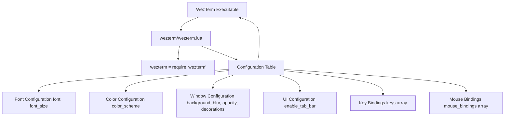
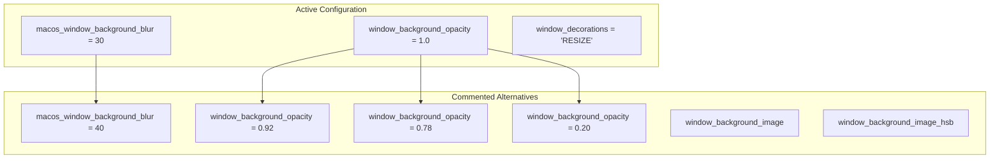
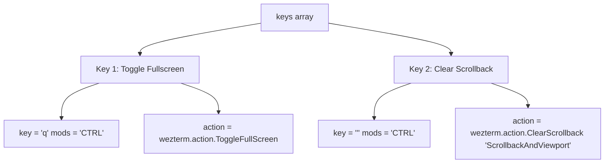
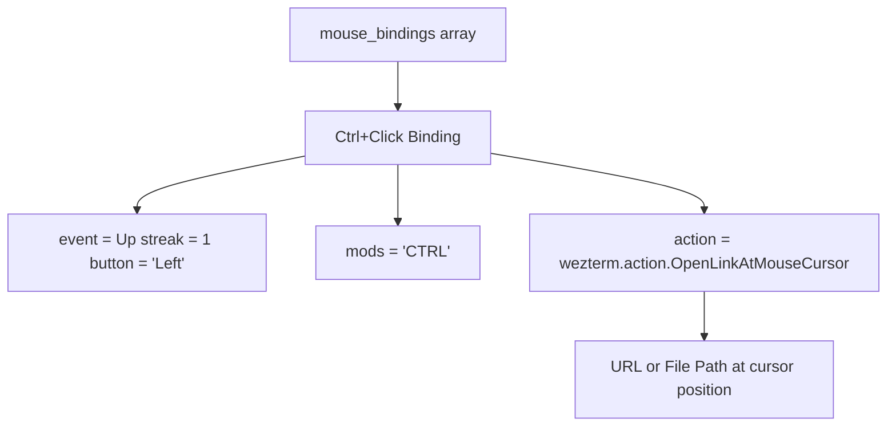
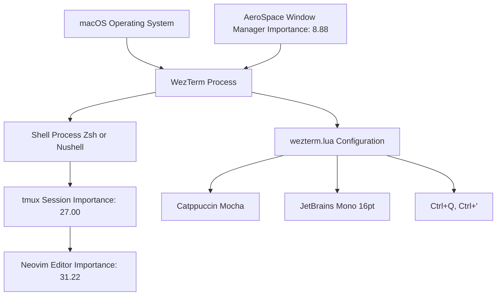

[/](/)

[/search](/search)

[/wiki](/wiki)

[/settings/members](/settings/members)

[/settings/support](/settings/support)

[Add repo](/repositories)

[All repos](/wiki)

[backend](/wiki/Klaudioz/backend)

[BH-Workflow-Engine](/wiki/Klaudioz/BH-Workflow-Engine)

[Buckhead_CRM](/wiki/Klaudioz/Buckhead_CRM)

[dotfiles](/wiki/Klaudioz/dotfiles)

[frontend](/wiki/Klaudioz/frontend)

[godeep.wiki-jb](/wiki/Klaudioz/godeep.wiki-jb)

[pi-mono-zero](/wiki/Klaudioz/pi-mono-zero)

[VirtualOracle](/wiki/Klaudioz/VirtualOracle)

# WezTerm ConfigurationLink copied!

> **Relevant source files**
> * [wezterm/wezterm.lua](https://github.com/Klaudioz/dotfiles/blob/2febda55/wezterm/wezterm.lua)

## Purpose and ScopeLink copied!

This document details the WezTerm terminal emulator configuration, one of the two terminal emulators configured in this dotfiles repository (importance: 9.92). WezTerm is a GPU-accelerated cross-platform terminal emulator and multiplexer implemented in Rust. The configuration focuses on visual aesthetics, macOS integration, and customized keybindings.

For information about the alternative terminal emulator, see [Ghostty Configuration](#3.1.1). For shell configuration that runs within WezTerm, see [Shell Configuration](#3.2).

**Sources:** [wezterm/wezterm.lua L1-L44](https://github.com/Klaudioz/dotfiles/blob/2febda55/wezterm/wezterm.lua#L1-L44)

## Configuration File StructureLink copied!

The WezTerm configuration consists of a single Lua file that returns a table of configuration options. The configuration uses the `wezterm` module to access WezTerm-specific functions and actions.



**Sources:** [wezterm/wezterm.lua L1-L2](https://github.com/Klaudioz/dotfiles/blob/2febda55/wezterm/wezterm.lua#L1-L2)

## Core Visual SettingsLink copied!

The configuration defines several core visual settings that establish WezTerm's appearance and behavior.

### Font ConfigurationLink copied!

| Setting | Value | Description |
| --- | --- | --- |
| `font` | `wezterm.font('JetBrains Mono')` | Primary font family |
| `font_size` | `16.0` | Font size in points |
| `adjust_window_size_when_changing_font_size` | `false` | Prevents window resizing when font changes |

**Sources:** [wezterm/wezterm.lua L3-L8](https://github.com/Klaudioz/dotfiles/blob/2febda55/wezterm/wezterm.lua#L3-L8)

### Color SchemeLink copied!

The configuration uses the Catppuccin Mocha color scheme, which provides a pastel-based dark theme consistent with other tools in the dotfiles ecosystem (Neovim, tmux, Starship all use Catppuccin variants).

```
color_scheme = 'Catppuccin Mocha'
```

**Sources:** [wezterm/wezterm.lua L5](https://github.com/Klaudioz/dotfiles/blob/2febda55/wezterm/wezterm.lua#L5-L5)

### Tab Bar ConfigurationLink copied!

The tab bar is explicitly disabled, as terminal multiplexing is handled by tmux (importance: 27.00) rather than WezTerm's built-in tabs:

```
enable_tab_bar = false
```

**Sources:** [wezterm/wezterm.lua L6](https://github.com/Klaudioz/dotfiles/blob/2febda55/wezterm/wezterm.lua#L6-L6)

## Window Background and TransparencyLink copied!

The configuration includes options for window background appearance, with some options commented out to show alternative configurations.



### Active SettingsLink copied!

| Setting | Value | Purpose |
| --- | --- | --- |
| `macos_window_background_blur` | `30` | Applies blur effect to content behind window (macOS-specific) |
| `window_background_opacity` | `1.0` | Fully opaque window background |
| `window_decorations` | `'RESIZE'` | Shows resize decorations but hides title bar |

**Sources:** [wezterm/wezterm.lua L10-L22](https://github.com/Klaudioz/dotfiles/blob/2febda55/wezterm/wezterm.lua#L10-L22)

### Alternative ConfigurationsLink copied!

The configuration file preserves commented-out alternatives, documenting different appearance options:

* **Background blur:** Alternative value of `40` for stronger blur effect [wezterm/wezterm.lua L9](https://github.com/Klaudioz/dotfiles/blob/2febda55/wezterm/wezterm.lua#L9-L9)
* **Opacity levels:** Values ranging from `0.20` (highly transparent) to `0.92` (nearly opaque) [wezterm/wezterm.lua L18-L21](https://github.com/Klaudioz/dotfiles/blob/2febda55/wezterm/wezterm.lua#L18-L21)
* **Background image:** Support for custom background image with HSB adjustments [wezterm/wezterm.lua L12-L17](https://github.com/Klaudioz/dotfiles/blob/2febda55/wezterm/wezterm.lua#L12-L17)

**Sources:** [wezterm/wezterm.lua L9-L21](https://github.com/Klaudioz/dotfiles/blob/2febda55/wezterm/wezterm.lua#L9-L21)

## KeybindingsLink copied!

WezTerm defines custom keybindings using the `keys` array. Each binding specifies a key, modifiers, and an action from the `wezterm.action` API.



### Defined KeybindingsLink copied!

| Key Combination | Action | Description |
| --- | --- | --- |
| `Ctrl+Q` | `wezterm.action.ToggleFullScreen` | Toggles fullscreen mode |
| `Ctrl+'` | `wezterm.action.ClearScrollback 'ScrollbackAndViewport'` | Clears both scrollback buffer and current viewport |

The `ClearScrollback` action uses the `'ScrollbackAndViewport'` parameter to clear both the scrollback history and the current terminal viewport content.

**Sources:** [wezterm/wezterm.lua L23-L34](https://github.com/Klaudioz/dotfiles/blob/2febda55/wezterm/wezterm.lua#L23-L34)

## Mouse BindingsLink copied!

WezTerm supports custom mouse bindings through the `mouse_bindings` array. Each binding specifies an event, modifiers, and an action.



### Defined Mouse BindingsLink copied!

| Mouse Action | Modifiers | Effect |
| --- | --- | --- |
| Left Click Up (single click) | `CTRL` | Opens URL or file path at mouse cursor position |

The binding uses an event specification with:

* `Up`: Mouse button release event
* `streak = 1`: Single click (not double or triple click)
* `button = 'Left'`: Left mouse button

**Sources:** [wezterm/wezterm.lua L35-L42](https://github.com/Klaudioz/dotfiles/blob/2febda55/wezterm/wezterm.lua#L35-L42)

## Configuration Options SummaryLink copied!

The following table summarizes all configuration options defined in `wezterm.lua`:

| Category | Option | Value | Line Reference |
| --- | --- | --- | --- |
| **Behavior** | `adjust_window_size_when_changing_font_size` | `false` | [wezterm/wezterm.lua L3](https://github.com/Klaudioz/dotfiles/blob/2febda55/wezterm/wezterm.lua#L3-L3) |
| **Appearance** | `color_scheme` | `'Catppuccin Mocha'` | [wezterm/wezterm.lua L5](https://github.com/Klaudioz/dotfiles/blob/2febda55/wezterm/wezterm.lua#L5-L5) |
| **UI** | `enable_tab_bar` | `false` | [wezterm/wezterm.lua L6](https://github.com/Klaudioz/dotfiles/blob/2febda55/wezterm/wezterm.lua#L6-L6) |
| **Font** | `font_size` | `16.0` | [wezterm/wezterm.lua L7](https://github.com/Klaudioz/dotfiles/blob/2febda55/wezterm/wezterm.lua#L7-L7) |
| **Font** | `font` | `wezterm.font('JetBrains Mono')` | [wezterm/wezterm.lua L8](https://github.com/Klaudioz/dotfiles/blob/2febda55/wezterm/wezterm.lua#L8-L8) |
| **Window** | `macos_window_background_blur` | `30` | [wezterm/wezterm.lua L10](https://github.com/Klaudioz/dotfiles/blob/2febda55/wezterm/wezterm.lua#L10-L10) |
| **Window** | `window_background_opacity` | `1.0` | [wezterm/wezterm.lua L19](https://github.com/Klaudioz/dotfiles/blob/2febda55/wezterm/wezterm.lua#L19-L19) |
| **Window** | `window_decorations` | `'RESIZE'` | [wezterm/wezterm.lua L22](https://github.com/Klaudioz/dotfiles/blob/2febda55/wezterm/wezterm.lua#L22-L22) |
| **Input** | `keys` | Array with 2 bindings | [wezterm/wezterm.lua L23-L34](https://github.com/Klaudioz/dotfiles/blob/2febda55/wezterm/wezterm.lua#L23-L34) |
| **Input** | `mouse_bindings` | Array with 1 binding | [wezterm/wezterm.lua L35-L42](https://github.com/Klaudioz/dotfiles/blob/2febda55/wezterm/wezterm.lua#L35-L42) |

**Sources:** [wezterm/wezterm.lua L3-L42](https://github.com/Klaudioz/dotfiles/blob/2febda55/wezterm/wezterm.lua#L3-L42)

## Integration with Terminal EnvironmentLink copied!

WezTerm serves as the host process for shell environments and terminal multiplexers. The following diagram illustrates WezTerm's position in the terminal environment stack:



WezTerm integrates with:

* **AeroSpace Window Manager** [#6.1](#6.1): Manages WezTerm window positioning and tiling
* **Shell Environments** [#3.2](#3.2): Hosts Zsh or Nushell shell processes
* **tmux** [#5](#5): Provides terminal multiplexing within WezTerm
* **Neovim** [#4](#4): Runs within tmux sessions hosted by WezTerm

**Sources:** [wezterm/wezterm.lua L1-L44](https://github.com/Klaudioz/dotfiles/blob/2febda55/wezterm/wezterm.lua#L1-L44)

## Comparison with GhosttyLink copied!

While both WezTerm and Ghostty are configured in this dotfiles repository, they have different configuration approaches and feature sets:

| Aspect | WezTerm | Ghostty |
| --- | --- | --- |
| Configuration Language | Lua | TOML |
| Tab Bar | Disabled (relies on tmux) | Disabled (relies on tmux) |
| Font | JetBrains Mono 16pt | JetBrains Mono 16pt |
| Color Scheme | Catppuccin Mocha | Catppuccin Mocha |
| Background Effects | Blur + Opacity | Blur |
| Importance Score | 9.92 | 10.40 |

Both terminal emulators use consistent visual themes (Catppuccin Mocha, JetBrains Mono) and disable built-in tabs in favor of tmux-based multiplexing.

**Sources:** [wezterm/wezterm.lua L5-L8](https://github.com/Klaudioz/dotfiles/blob/2febda55/wezterm/wezterm.lua#L5-L8)

Refresh this wiki

Last indexed: 18 December 2025 ([2febda](https://github.com/Klaudioz/dotfiles/commit/2febda55))

### On this page

* [WezTerm Configuration](#3.1.2-wezterm-configuration)
* [Purpose and Scope](#3.1.2-purpose-and-scope)
* [Configuration File Structure](#3.1.2-configuration-file-structure)
* [Core Visual Settings](#3.1.2-core-visual-settings)
* [Font Configuration](#3.1.2-font-configuration)
* [Color Scheme](#3.1.2-color-scheme)
* [Tab Bar Configuration](#3.1.2-tab-bar-configuration)
* [Window Background and Transparency](#3.1.2-window-background-and-transparency)
* [Active Settings](#3.1.2-active-settings)
* [Alternative Configurations](#3.1.2-alternative-configurations)
* [Keybindings](#3.1.2-keybindings)
* [Defined Keybindings](#3.1.2-defined-keybindings)
* [Mouse Bindings](#3.1.2-mouse-bindings)
* [Defined Mouse Bindings](#3.1.2-defined-mouse-bindings)
* [Configuration Options Summary](#3.1.2-configuration-options-summary)
* [Integration with Terminal Environment](#3.1.2-integration-with-terminal-environment)
* [Comparison with Ghostty](#3.1.2-comparison-with-ghostty)

Ask Devin about dotfiles

  

Syntax error in text

mermaid version 11.4.1

Syntax error in text

mermaid version 11.4.1