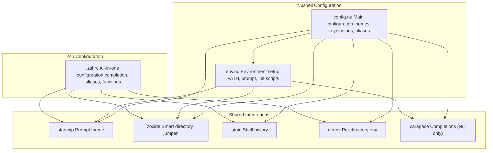
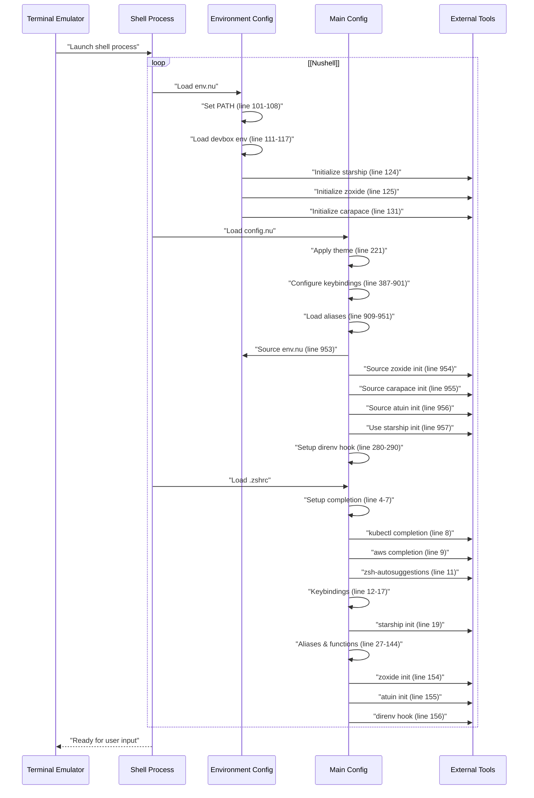
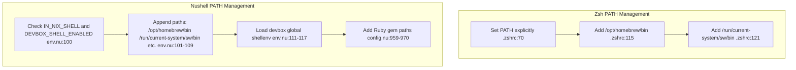
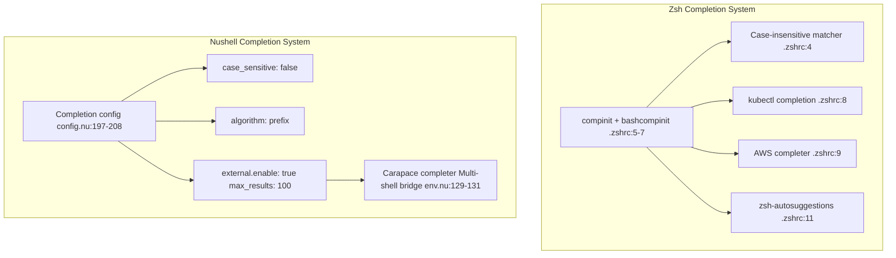

[/](/)

[/search](/search)

[/wiki](/wiki)

[/settings/members](/settings/members)

[/settings/support](/settings/support)

[Add repo](/repositories)

[All repos](/wiki)

[backend](/wiki/Klaudioz/backend)

[BH-Workflow-Engine](/wiki/Klaudioz/BH-Workflow-Engine)

[Buckhead_CRM](/wiki/Klaudioz/Buckhead_CRM)

[dotfiles](/wiki/Klaudioz/dotfiles)

[frontend](/wiki/Klaudioz/frontend)

[godeep.wiki-jb](/wiki/Klaudioz/godeep.wiki-jb)

[pi-mono-zero](/wiki/Klaudioz/pi-mono-zero)

[VirtualOracle](/wiki/Klaudioz/VirtualOracle)

# Shell ConfigurationLink copied!

> **Relevant source files**
> * [.gitignore](https://github.com/Klaudioz/dotfiles/blob/2febda55/.gitignore)
> * [nushell/config.nu](https://github.com/Klaudioz/dotfiles/blob/2febda55/nushell/config.nu)
> * [nushell/env.nu](https://github.com/Klaudioz/dotfiles/blob/2febda55/nushell/env.nu)
> * [zshrc/.zshrc](https://github.com/Klaudioz/dotfiles/blob/2febda55/zshrc/.zshrc)

## Purpose and ScopeLink copied!

This page provides an overview of the shell environment configuration, which includes two distinct shells: **Nushell** (importance 25.98) and **Zsh** (importance 10.44). It describes the organizational structure of shell configurations, the rationale for maintaining dual shells, and the common integrations shared between them. For detailed configuration of Nushell, see [Nushell Setup](#3.2.1). For detailed configuration of Zsh, see [Zsh Setup](#3.2.2). For the Starship prompt configuration used by both shells, see [Starship Prompt](#3.3).

## Dual Shell ArchitectureLink copied!

The dotfiles maintain configurations for both Nushell and Zsh, providing different use cases and interaction models:

| Aspect | Nushell | Zsh |
| --- | --- | --- |
| Primary Configuration | `nushell/config.nu` | `zshrc/.zshrc` |
| Environment Setup | `nushell/env.nu` | Inline in `.zshrc` |
| Configuration Language | Nushell DSL | Shell script |
| Data Model | Structured data (tables, records) | Text streams |
| Importance Score | 25.98 | 10.44 |
| Primary Use Case | Modern shell with structured data | Traditional POSIX-compatible shell |

**Nushell** serves as the primary modern shell, offering structured data processing and a more consistent programming language. **Zsh** provides compatibility with traditional shell scripts and extensive ecosystem support through its mature plugin system.

Sources: [nushell/config.nu L1-L903](https://github.com/Klaudioz/dotfiles/blob/2febda55/nushell/config.nu#L1-L903)

 [zshrc/.zshrc L1-L157](https://github.com/Klaudioz/dotfiles/blob/2febda55/zshrc/.zshrc#L1-L157)

## Configuration File OrganizationLink copied!



**Nushell Configuration Structure**

Nushell uses a two-file configuration approach:

* **`nushell/env.nu`**: Loaded first, sets up environment variables, PATH configuration, prompt definitions, and initializes external tool integrations [nushell/env.nu L1-L134](https://github.com/Klaudioz/dotfiles/blob/2febda55/nushell/env.nu#L1-L134)
* **`nushell/config.nu`**: Main configuration file containing themes, completion settings, keybindings, aliases, custom commands, and sources `env.nu` at the end [nushell/config.nu L953](https://github.com/Klaudioz/dotfiles/blob/2febda55/nushell/config.nu#L953-L953)

**Zsh Configuration Structure**

Zsh uses a single monolithic configuration file:

* **`zshrc/.zshrc`**: Contains all configuration including completion setup, keybindings, aliases, functions, and tool integrations [zshrc/.zshrc L1-L157](https://github.com/Klaudioz/dotfiles/blob/2febda55/zshrc/.zshrc#L1-L157)

Sources: [nushell/config.nu L953-L957](https://github.com/Klaudioz/dotfiles/blob/2febda55/nushell/config.nu#L953-L957)

 [nushell/env.nu L123-L131](https://github.com/Klaudioz/dotfiles/blob/2febda55/nushell/env.nu#L123-L131)

 [zshrc/.zshrc L19-L156](https://github.com/Klaudioz/dotfiles/blob/2febda55/zshrc/.zshrc#L19-L156)

## Shell Initialization SequenceLink copied!



Sources: [nushell/env.nu L100-L131](https://github.com/Klaudioz/dotfiles/blob/2febda55/nushell/env.nu#L100-L131)

 [nushell/config.nu L279-L972](https://github.com/Klaudioz/dotfiles/blob/2febda55/nushell/config.nu#L279-L972)

 [zshrc/.zshrc L1-L156](https://github.com/Klaudioz/dotfiles/blob/2febda55/zshrc/.zshrc#L1-L156)

## Common Integration PointsLink copied!

Both shells integrate with the same set of external tools, though the integration mechanisms differ:

### Starship PromptLink copied!

Both shells use Starship for prompt customization, configured via `~/.config/starship/starship.toml`:

* **Nushell**: Initializes in `env.nu` [nushell/env.nu L124](https://github.com/Klaudioz/dotfiles/blob/2febda55/nushell/env.nu#L124-L124)  and sources in `config.nu` [nushell/config.nu L957](https://github.com/Klaudioz/dotfiles/blob/2febda55/nushell/config.nu#L957-L957)
* **Zsh**: Initializes via `eval` [zshrc/.zshrc L19-L20](https://github.com/Klaudioz/dotfiles/blob/2febda55/zshrc/.zshrc#L19-L20)

### Zoxide (Smart Directory Navigation)Link copied!

Smart directory jumping tool that learns from usage patterns:

* **Nushell**: Initializes and saves to `~/.zoxide.nu` [nushell/env.nu L125](https://github.com/Klaudioz/dotfiles/blob/2febda55/nushell/env.nu#L125-L125)  sourced in `config.nu` [nushell/config.nu L954](https://github.com/Klaudioz/dotfiles/blob/2febda55/nushell/config.nu#L954-L954)
* **Zsh**: Evaluates initialization inline [zshrc/.zshrc L154](https://github.com/Klaudioz/dotfiles/blob/2febda55/zshrc/.zshrc#L154-L154)

### Atuin (Shell History Synchronization)Link copied!

Provides enhanced shell history with cloud synchronization:

* **Nushell**: Sources from `~/.local/share/atuin/init.nu` [nushell/config.nu L956](https://github.com/Klaudioz/dotfiles/blob/2febda55/nushell/config.nu#L956-L956)
* **Zsh**: Evaluates initialization inline [zshrc/.zshrc L155](https://github.com/Klaudioz/dotfiles/blob/2febda55/zshrc/.zshrc#L155-L155)

### Direnv (Per-Directory Environments)Link copied!

Automatically loads/unloads environment variables based on directory:

* **Nushell**: Implemented via `pre_prompt` hook that exports direnv JSON [nushell/config.nu L280-L290](https://github.com/Klaudioz/dotfiles/blob/2febda55/nushell/config.nu#L280-L290)
* **Zsh**: Evaluates hook inline [zshrc/.zshrc L156](https://github.com/Klaudioz/dotfiles/blob/2febda55/zshrc/.zshrc#L156-L156)

Sources: [nushell/env.nu L123-L131](https://github.com/Klaudioz/dotfiles/blob/2febda55/nushell/env.nu#L123-L131)

 [nushell/config.nu L280-L957](https://github.com/Klaudioz/dotfiles/blob/2febda55/nushell/config.nu#L280-L957)

 [zshrc/.zshrc L19-L156](https://github.com/Klaudioz/dotfiles/blob/2febda55/zshrc/.zshrc#L19-L156)

## Shared Alias PhilosophyLink copied!

Both shells define similar aliases for Git, Kubernetes, and directory navigation, maintaining consistency across shell environments:

### Git Aliases ComparisonLink copied!

| Alias | Nushell | Zsh | Command |
| --- | --- | --- | --- |
| `gc` | [config.nu L923](https://github.com/Klaudioz/dotfiles/blob/2febda55/config.nu#L923-L923) | [.zshrc L31](https://github.com/Klaudioz/dotfiles/blob/2febda55/.zshrc#L31-L31) | `git commit -m` |
| `gca` | [config.nu L924](https://github.com/Klaudioz/dotfiles/blob/2febda55/config.nu#L924-L924) | [.zshrc L32](https://github.com/Klaudioz/dotfiles/blob/2febda55/.zshrc#L32-L32) | `git commit -a -m` |
| `gp` | [config.nu L925](https://github.com/Klaudioz/dotfiles/blob/2febda55/config.nu#L925-L925) | [.zshrc L33](https://github.com/Klaudioz/dotfiles/blob/2febda55/.zshrc#L33-L33) | `git push origin HEAD` |
| `gst` | [config.nu L927](https://github.com/Klaudioz/dotfiles/blob/2febda55/config.nu#L927-L927) | [.zshrc L35](https://github.com/Klaudioz/dotfiles/blob/2febda55/.zshrc#L35-L35) | `git status` |
| `glog` | [config.nu L928](https://github.com/Klaudioz/dotfiles/blob/2febda55/config.nu#L928-L928) | [.zshrc L36](https://github.com/Klaudioz/dotfiles/blob/2febda55/.zshrc#L36-L36) | Formatted git log |
| `gdiff` | [config.nu L929](https://github.com/Klaudioz/dotfiles/blob/2febda55/config.nu#L929-L929) | [.zshrc L37](https://github.com/Klaudioz/dotfiles/blob/2febda55/.zshrc#L37-L37) | `git diff` |
| `gco` | [config.nu L930](https://github.com/Klaudioz/dotfiles/blob/2febda55/config.nu#L930-L930) | [.zshrc L38](https://github.com/Klaudioz/dotfiles/blob/2febda55/.zshrc#L38-L38) | `git checkout` |

### Kubernetes Aliases ComparisonLink copied!

| Alias | Nushell | Zsh | Command |
| --- | --- | --- | --- |
| `k` | [config.nu L940](https://github.com/Klaudioz/dotfiles/blob/2febda55/config.nu#L940-L940) | [.zshrc L76](https://github.com/Klaudioz/dotfiles/blob/2febda55/.zshrc#L76-L76) | `kubectl` |
| `ka` | [config.nu L941](https://github.com/Klaudioz/dotfiles/blob/2febda55/config.nu#L941-L941) | [.zshrc L77](https://github.com/Klaudioz/dotfiles/blob/2febda55/.zshrc#L77-L77) | `kubectl apply -f` |
| `kg` | [config.nu L942](https://github.com/Klaudioz/dotfiles/blob/2febda55/config.nu#L942-L942) | [.zshrc L78](https://github.com/Klaudioz/dotfiles/blob/2febda55/.zshrc#L78-L78) | `kubectl get` |
| `kd` | [config.nu L943](https://github.com/Klaudioz/dotfiles/blob/2febda55/config.nu#L943-L943) | [.zshrc L79](https://github.com/Klaudioz/dotfiles/blob/2febda55/.zshrc#L79-L79) | `kubectl describe` |
| `kgpo` | [config.nu L946](https://github.com/Klaudioz/dotfiles/blob/2febda55/config.nu#L946-L946) | [.zshrc L82](https://github.com/Klaudioz/dotfiles/blob/2febda55/.zshrc#L82-L82) | `kubectl get pod` |
| `kc` | [config.nu L948](https://github.com/Klaudioz/dotfiles/blob/2febda55/config.nu#L948-L948) | [.zshrc L84](https://github.com/Klaudioz/dotfiles/blob/2febda55/.zshrc#L84-L84) | `kubectx` |
| `kns` | [config.nu L949](https://github.com/Klaudioz/dotfiles/blob/2febda55/config.nu#L949-L949) | [.zshrc L85](https://github.com/Klaudioz/dotfiles/blob/2febda55/.zshrc#L85-L85) | `kubens` |

Sources: [nushell/config.nu L922-L951](https://github.com/Klaudioz/dotfiles/blob/2febda55/nushell/config.nu#L922-L951)

 [zshrc/.zshrc L30-L89](https://github.com/Klaudioz/dotfiles/blob/2febda55/zshrc/.zshrc#L30-L89)

## PATH ManagementLink copied!



**Nushell** employs conditional PATH management, checking for `IN_NIX_SHELL` and `DEVBOX_SHELL_ENABLED` environment variables before modifying PATH [nushell/env.nu L100-L109](https://github.com/Klaudioz/dotfiles/blob/2febda55/nushell/env.nu#L100-L109)

 It then loads devbox global environment using a pipeline that parses the output [nushell/env.nu L111-L117](https://github.com/Klaudioz/dotfiles/blob/2febda55/nushell/env.nu#L111-L117)

 and adds Ruby gem paths dynamically [nushell/config.nu L959-L970](https://github.com/Klaudioz/dotfiles/blob/2febda55/nushell/config.nu#L959-L970)

**Zsh** uses explicit PATH assignment, setting the entire PATH in one statement [zshrc/.zshrc L70](https://github.com/Klaudioz/dotfiles/blob/2febda55/zshrc/.zshrc#L70-L70)

 then prepending Homebrew [zshrc/.zshrc L115](https://github.com/Klaudioz/dotfiles/blob/2febda55/zshrc/.zshrc#L115-L115)

 and Nix paths [zshrc/.zshrc L121](https://github.com/Klaudioz/dotfiles/blob/2febda55/zshrc/.zshrc#L121-L121)

Sources: [nushell/env.nu L100-L117](https://github.com/Klaudioz/dotfiles/blob/2febda55/nushell/env.nu#L100-L117)

 [nushell/config.nu L959-L970](https://github.com/Klaudioz/dotfiles/blob/2febda55/nushell/config.nu#L959-L970)

 [zshrc/.zshrc L70-L121](https://github.com/Klaudioz/dotfiles/blob/2febda55/zshrc/.zshrc#L70-L121)

## Editor and Tool PreferencesLink copied!

Both shells configure the same editor and key tools:

| Variable/Tool | Nushell | Zsh | Value |
| --- | --- | --- | --- |
| `$env.EDITOR` | [env.nu L133](https://github.com/Klaudioz/dotfiles/blob/2febda55/env.nu#L133-L133) | [.zshrc L25](https://github.com/Klaudioz/dotfiles/blob/2febda55/.zshrc#L25-L25) | `nvim` / `/opt/homebrew/bin/nvim` |
| `$env.NIX_CONF_DIR` | [env.nu L128](https://github.com/Klaudioz/dotfiles/blob/2febda55/env.nu#L128-L128) | [.zshrc L120](https://github.com/Klaudioz/dotfiles/blob/2febda55/.zshrc#L120-L120) | `~/.config/nix` |
| `$env.STARSHIP_CONFIG` | [env.nu L127](https://github.com/Klaudioz/dotfiles/blob/2febda55/env.nu#L127-L127) | [.zshrc L20](https://github.com/Klaudioz/dotfiles/blob/2febda55/.zshrc#L20-L20) | `~/.config/starship/starship.toml` |

Sources: [nushell/env.nu L127-L133](https://github.com/Klaudioz/dotfiles/blob/2febda55/nushell/env.nu#L127-L133)

 [zshrc/.zshrc L20-L120](https://github.com/Klaudioz/dotfiles/blob/2febda55/zshrc/.zshrc#L20-L120)

## Custom Functions and CommandsLink copied!

Both shells define custom navigation functions, though with different implementations:

### Nushell Custom CommandsLink copied!

**`cx` command** [nushell/config.nu L904-L907](https://github.com/Klaudioz/dotfiles/blob/2febda55/nushell/config.nu#L904-L907)

: Changes directory and lists contents

```
def --env cx [arg] {    cd $arg    ls -l}
```

**`ff` function** [nushell/config.nu L918-L920](https://github.com/Klaudioz/dotfiles/blob/2febda55/nushell/config.nu#L918-L920)

: Uses AeroSpace window manager integration with fzf for window focusing

### Zsh Custom FunctionsLink copied!

**`cx` function** [zshrc/.zshrc L141](https://github.com/Klaudioz/dotfiles/blob/2febda55/zshrc/.zshrc#L141-L141)

: Changes directory and lists contents (similar to Nushell)

**`fcd` function** [zshrc/.zshrc L142](https://github.com/Klaudioz/dotfiles/blob/2febda55/zshrc/.zshrc#L142-L142)

: Fuzzy find and change to directory using fzf

**`f` function** [zshrc/.zshrc L143](https://github.com/Klaudioz/dotfiles/blob/2febda55/zshrc/.zshrc#L143-L143)

: Fuzzy find file and copy path to clipboard

**`fv` function** [zshrc/.zshrc L144](https://github.com/Klaudioz/dotfiles/blob/2febda55/zshrc/.zshrc#L144-L144)

: Fuzzy find and open file in Neovim

**`ranger` function** [zshrc/.zshrc L123-L137](https://github.com/Klaudioz/dotfiles/blob/2febda55/zshrc/.zshrc#L123-L137)

: Wrapper for the ranger file manager with directory change support

Sources: [nushell/config.nu L904-L920](https://github.com/Klaudioz/dotfiles/blob/2febda55/nushell/config.nu#L904-L920)

 [zshrc/.zshrc L123-L144](https://github.com/Klaudioz/dotfiles/blob/2febda55/zshrc/.zshrc#L123-L144)

## Completion SystemsLink copied!



**Nushell** uses its native completion system [nushell/config.nu L197-L208](https://github.com/Klaudioz/dotfiles/blob/2febda55/nushell/config.nu#L197-L208)

 with Carapace as a bridge to other shell completions [nushell/env.nu L129-L131](https://github.com/Klaudioz/dotfiles/blob/2febda55/nushell/env.nu#L129-L131)

 It supports external completions from `$env.PATH` and uses prefix-based matching.

**Zsh** uses the traditional `compinit` system [zshrc/.zshrc L5-L7](https://github.com/Klaudioz/dotfiles/blob/2febda55/zshrc/.zshrc#L5-L7)

 with explicit completion sources for kubectl [zshrc/.zshrc L8](https://github.com/Klaudioz/dotfiles/blob/2febda55/zshrc/.zshrc#L8-L8)

 and AWS [zshrc/.zshrc L9](https://github.com/Klaudioz/dotfiles/blob/2febda55/zshrc/.zshrc#L9-L9)

 The `zsh-autosuggestions` plugin [zshrc/.zshrc L11](https://github.com/Klaudioz/dotfiles/blob/2febda55/zshrc/.zshrc#L11-L11)

 provides inline suggestions from history.

Sources: [nushell/config.nu L197-L208](https://github.com/Klaudioz/dotfiles/blob/2febda55/nushell/config.nu#L197-L208)

 [nushell/env.nu L129-L131](https://github.com/Klaudioz/dotfiles/blob/2febda55/nushell/env.nu#L129-L131)

 [zshrc/.zshrc L4-L11](https://github.com/Klaudioz/dotfiles/blob/2febda55/zshrc/.zshrc#L4-L11)

## Keybinding ConfigurationLink copied!

Both shells support vi-mode editing, though with different configuration approaches:

**Nushell** defines keybindings in a structured record format [nushell/config.nu L387-L901](https://github.com/Klaudioz/dotfiles/blob/2febda55/nushell/config.nu#L387-L901)

 with:

* Edit mode: `vi` [nushell/config.nu L228](https://github.com/Klaudioz/dotfiles/blob/2febda55/nushell/config.nu#L228-L228)
* Extensive keybinding definitions for menus, navigation, and editing
* Support for completion, history, and help menus

**Zsh** uses `bindkey` commands [zshrc/.zshrc L12-L95](https://github.com/Klaudioz/dotfiles/blob/2febda55/zshrc/.zshrc#L12-L95)

 with:

* Custom vi-mode trigger: `jj` → vi-cmd-mode [zshrc/.zshrc L95](https://github.com/Klaudioz/dotfiles/blob/2febda55/zshrc/.zshrc#L95-L95)
* Autosuggestion keybindings: `^w` (execute), `^e` (accept), `^u` (toggle) [zshrc/.zshrc L12-L14](https://github.com/Klaudioz/dotfiles/blob/2febda55/zshrc/.zshrc#L12-L14)
* Navigation: `^k` (up), `^j` (down), `^L` (forward-word) [zshrc/.zshrc L15-L17](https://github.com/Klaudioz/dotfiles/blob/2febda55/zshrc/.zshrc#L15-L17)

Sources: [nushell/config.nu L228-L901](https://github.com/Klaudioz/dotfiles/blob/2febda55/nushell/config.nu#L228-L901)

 [zshrc/.zshrc L12-L95](https://github.com/Klaudioz/dotfiles/blob/2febda55/zshrc/.zshrc#L12-L95)

## Theme and Visual ConfigurationLink copied!

**Nushell** defines comprehensive light and dark themes [nushell/config.nu L9-L140](https://github.com/Klaudioz/dotfiles/blob/2febda55/nushell/config.nu#L9-L140)

 with color specifications for:

* Primitive types (bool, int, string, etc.)
* Shape highlighting (keywords, operators, strings, etc.)
* Menu and table styling

The active theme is set via `$env.config.color_config` [nushell/config.nu L221](https://github.com/Klaudioz/dotfiles/blob/2febda55/nushell/config.nu#L221-L221)

**Zsh** delegates theming entirely to Starship [zshrc/.zshrc L19-L20](https://github.com/Klaudioz/dotfiles/blob/2febda55/zshrc/.zshrc#L19-L20)

 relying on external configuration at `~/.config/starship/starship.toml`.

Sources: [nushell/config.nu L9-L221](https://github.com/Klaudioz/dotfiles/blob/2febda55/nushell/config.nu#L9-L221)

 [zshrc/.zshrc L19-L20](https://github.com/Klaudioz/dotfiles/blob/2febda55/zshrc/.zshrc#L19-L20)

Refresh this wiki

Last indexed: 18 December 2025 ([2febda](https://github.com/Klaudioz/dotfiles/commit/2febda55))

### On this page

* [Shell Configuration](#3.2-shell-configuration)
* [Purpose and Scope](#3.2-purpose-and-scope)
* [Dual Shell Architecture](#3.2-dual-shell-architecture)
* [Configuration File Organization](#3.2-configuration-file-organization)
* [Shell Initialization Sequence](#3.2-shell-initialization-sequence)
* [Common Integration Points](#3.2-common-integration-points)
* [Starship Prompt](#3.2-starship-prompt)
* [Zoxide (Smart Directory Navigation)](#3.2-zoxide-smart-directory-navigation)
* [Atuin (Shell History Synchronization)](#3.2-atuin-shell-history-synchronization)
* [Direnv (Per-Directory Environments)](#3.2-direnv-per-directory-environments)
* [Shared Alias Philosophy](#3.2-shared-alias-philosophy)
* [Git Aliases Comparison](#3.2-git-aliases-comparison)
* [Kubernetes Aliases Comparison](#3.2-kubernetes-aliases-comparison)
* [PATH Management](#3.2-path-management)
* [Editor and Tool Preferences](#3.2-editor-and-tool-preferences)
* [Custom Functions and Commands](#3.2-custom-functions-and-commands)
* [Nushell Custom Commands](#3.2-nushell-custom-commands)
* [Zsh Custom Functions](#3.2-zsh-custom-functions)
* [Completion Systems](#3.2-completion-systems)
* [Keybinding Configuration](#3.2-keybinding-configuration)
* [Theme and Visual Configuration](#3.2-theme-and-visual-configuration)

Ask Devin about dotfiles

  

Syntax error in text

mermaid version 11.4.1

Syntax error in text

mermaid version 11.4.1