[/](/)

[/search](/search)

[/wiki](/wiki)

[/settings/members](/settings/members)

[/settings/support](/settings/support)

[Add repo](/repositories)

[All repos](/wiki)

[backend](/wiki/Klaudioz/backend)

[BH-Workflow-Engine](/wiki/Klaudioz/BH-Workflow-Engine)

[Buckhead_CRM](/wiki/Klaudioz/Buckhead_CRM)

[dotfiles](/wiki/Klaudioz/dotfiles)

[frontend](/wiki/Klaudioz/frontend)

[godeep.wiki-jb](/wiki/Klaudioz/godeep.wiki-jb)

[pi-mono-zero](/wiki/Klaudioz/pi-mono-zero)

[VirtualOracle](/wiki/Klaudioz/VirtualOracle)

# Nushell SetupLink copied!

> **Relevant source files**
> * [.gitignore](https://github.com/Klaudioz/dotfiles/blob/2febda55/.gitignore)
> * [nushell/config.nu](https://github.com/Klaudioz/dotfiles/blob/2febda55/nushell/config.nu)
> * [nushell/env.nu](https://github.com/Klaudioz/dotfiles/blob/2febda55/nushell/env.nu)

## Purpose and ScopeLink copied!

This document details the Nushell shell configuration, which serves as the primary modern shell environment in the dotfiles repository (importance: 25.98). Nushell is a structured, data-driven shell that replaces traditional Unix shells with a pipeline-oriented approach using typed data structures. This page covers the configuration structure, environment setup, prompt customization, aliases, external tool integrations, and keybindings.

For information about the alternative Zsh shell configuration, see [Zsh Setup](#3.2.2). For terminal emulator configurations that host Nushell, see [Terminal Emulators](#3.1). For the Starship prompt used by Nushell, see [Starship Prompt](#3.3).

---

## Configuration File StructureLink copied!

Nushell uses a two-file configuration approach that separates runtime configuration from environment setup.

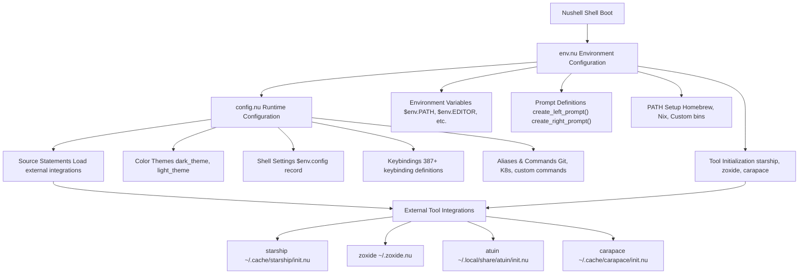

Sources: [nushell/config.nu L1-L973](https://github.com/Klaudioz/dotfiles/blob/2febda55/nushell/config.nu#L1-L973)

 [nushell/env.nu L1-L134](https://github.com/Klaudioz/dotfiles/blob/2febda55/nushell/env.nu#L1-L134)

### env.nu - Environment ConfigurationLink copied!

The `env.nu` file executes first during shell initialization and handles environment variable setup, PATH configuration, and prompt definitions.

**Key Sections:**

| Section | Lines | Purpose |
| --- | --- | --- |
| Prompt Functions | [5-35](https://github.com/Klaudioz/dotfiles/blob/2febda55/5-35) | Define `create_left_prompt()` and `create_right_prompt()` functions |
| Prompt Environment Variables | [38-47](https://github.com/Klaudioz/dotfiles/blob/2febda55/38-47) | Set `$env.PROMPT_COMMAND`, `$env.PROMPT_INDICATOR_VI_*` |
| ENV_CONVERSIONS | [65-74](https://github.com/Klaudioz/dotfiles/blob/2febda55/65-74) | Configure PATH string-to-list conversions |
| Library Directories | [78-87](https://github.com/Klaudioz/dotfiles/blob/2febda55/78-87) | Set `$env.NU_LIB_DIRS` and `$env.NU_PLUGIN_DIRS` |
| PATH Configuration | [100-109](https://github.com/Klaudioz/dotfiles/blob/2febda55/100-109) | Append Homebrew, Nix, and custom paths |
| Devbox Integration | [111-117](https://github.com/Klaudioz/dotfiles/blob/2febda55/111-117) | Load Devbox environment variables |
| Tool Initialization | [123-131](https://github.com/Klaudioz/dotfiles/blob/2febda55/123-131) | Initialize Starship, zoxide, and carapace |
| Editor Configuration | [133](https://github.com/Klaudioz/dotfiles/blob/2febda55/133) | Set `$env.EDITOR = "nvim"` |

Sources: [nushell/env.nu L1-L134](https://github.com/Klaudioz/dotfiles/blob/2febda55/nushell/env.nu#L1-L134)

### config.nu - Runtime ConfigurationLink copied!

The `config.nu` file loads after `env.nu` and defines the shell's runtime behavior, themes, keybindings, and aliases.

**Key Sections:**

| Section | Lines | Purpose |
| --- | --- | --- |
| Theme Definitions | [9-140](https://github.com/Klaudioz/dotfiles/blob/2febda55/9-140) | `dark_theme` and `light_theme` color schemes |
| Main Configuration | [142-262](https://github.com/Klaudioz/dotfiles/blob/2febda55/142-262) | `$env.config` record with all settings |
| Hooks | [279-297](https://github.com/Klaudioz/dotfiles/blob/2febda55/279-297) | `pre_prompt` (direnv), `pre_execution`, `env_change` |
| Menu Definitions | [299-385](https://github.com/Klaudioz/dotfiles/blob/2febda55/299-385) | Completion, IDE completion, history, help menus |
| Keybindings | [387-901](https://github.com/Klaudioz/dotfiles/blob/2febda55/387-901) | 50+ keybinding definitions |
| Custom Commands | [904-920](https://github.com/Klaudioz/dotfiles/blob/2febda55/904-920) | `cx` (cd+ls), `ff` (fuzzy window finder) |
| Aliases | [909-951](https://github.com/Klaudioz/dotfiles/blob/2febda55/909-951) | Git, Kubernetes, utility aliases |
| Source Statements | [953-957](https://github.com/Klaudioz/dotfiles/blob/2febda55/953-957) | Load external tool integrations |
| Ruby Configuration | [959-971](https://github.com/Klaudioz/dotfiles/blob/2febda55/959-971) | Set up Ruby gem paths |

Sources: [nushell/config.nu L1-L973](https://github.com/Klaudioz/dotfiles/blob/2febda55/nushell/config.nu#L1-L973)

---

## Initialization SequenceLink copied!

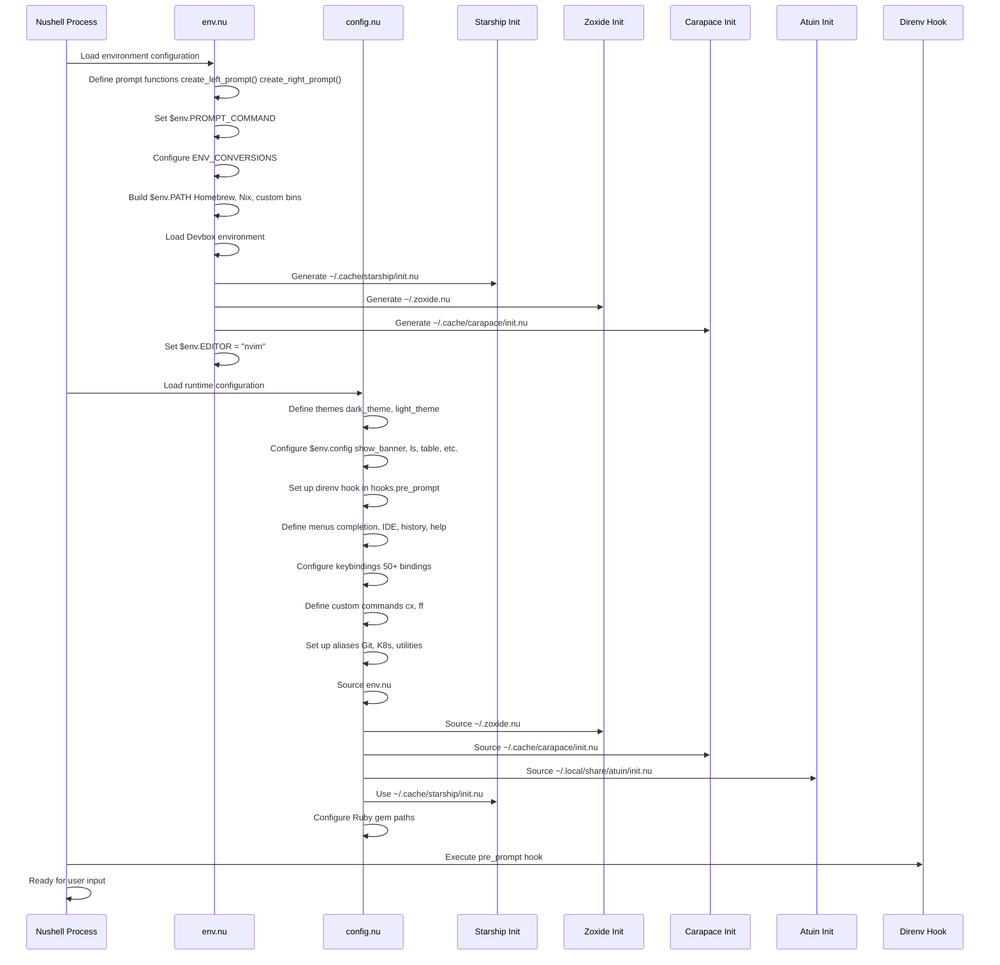

Sources: [nushell/env.nu L123-L131](https://github.com/Klaudioz/dotfiles/blob/2febda55/nushell/env.nu#L123-L131)

 [nushell/config.nu L279-L290](https://github.com/Klaudioz/dotfiles/blob/2febda55/nushell/config.nu#L279-L290)

 [nushell/config.nu L953-L971](https://github.com/Klaudioz/dotfiles/blob/2febda55/nushell/config.nu#L953-L971)

---

## Environment Variables and PATH ManagementLink copied!

### PATH ConfigurationLink copied!

The PATH is conditionally built to avoid conflicts with Nix shells and Devbox environments:

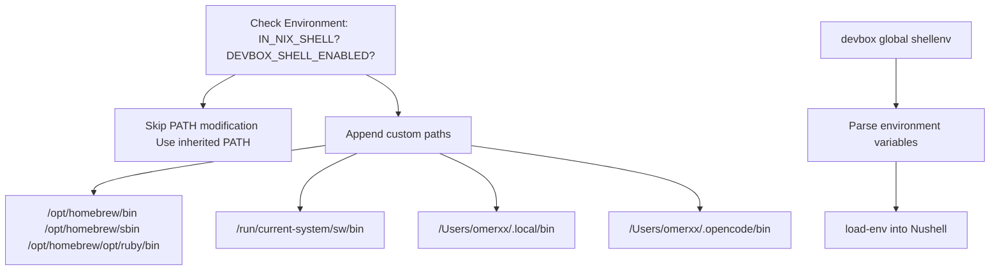

Sources: [nushell/env.nu L100-L117](https://github.com/Klaudioz/dotfiles/blob/2febda55/nushell/env.nu#L100-L117)

**Implementation:** [nushell/env.nu L100-L117](https://github.com/Klaudioz/dotfiles/blob/2febda55/nushell/env.nu#L100-L117)

The PATH logic uses the `if 'IN_NIX_SHELL' not-in $env and 'DEVBOX_SHELL_ENABLED' not-in $env` guard to prevent duplicate PATH entries when Nix or Devbox are managing the environment.

### Key Environment VariablesLink copied!

| Variable | Value | Purpose |
| --- | --- | --- |
| `$env.EDITOR` | `"nvim"` | Default text editor |
| `$env.STARSHIP_CONFIG` | `/Users/omerxx/.config/starship/starship.toml` | Starship prompt configuration |
| `$env.NIX_CONF_DIR` | `/Users/omerxx/.config/nix` | Nix configuration directory |
| `$env.CARAPACE_BRIDGES` | `'zsh,fish,bash,inshellisense'` | Completion bridges |
| `$env.GEM_HOME` | `~/.gem/ruby/3.4.0` | Ruby gem installation directory |
| `$env.GEM_PATH` | `~/.gem/ruby/3.4.0` | Ruby gem search path |
| `$env.DIRENV_LOG_FORMAT` | `""` | Silence direnv logging |

Sources: [nushell/env.nu L127-L134](https://github.com/Klaudioz/dotfiles/blob/2febda55/nushell/env.nu#L127-L134)

 [nushell/config.nu L959-L971](https://github.com/Klaudioz/dotfiles/blob/2febda55/nushell/config.nu#L959-L971)

### ENV_CONVERSIONSLink copied!

Nushell requires explicit conversion rules for environment variables that cross the string/structured-data boundary:

```
$env.ENV_CONVERSIONS = {    "PATH": {        from_string: { |s| $s | split row (char esep) | path expand --no-symlink }        to_string: { |v| $v | path expand --no-symlink | str join (char esep) }    }}
```

This enables PATH to be treated as a list internally while maintaining compatibility with external programs expecting a string.

Sources: [nushell/env.nu L65-L74](https://github.com/Klaudioz/dotfiles/blob/2febda55/nushell/env.nu#L65-L74)

---

## Prompt CustomizationLink copied!

Nushell uses custom functions to generate dynamic prompts rather than static string templates.

### Left Prompt FunctionLink copied!

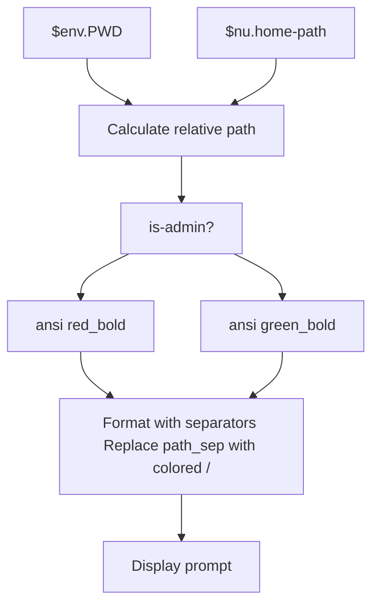

Sources: [nushell/env.nu L5-L17](https://github.com/Klaudioz/dotfiles/blob/2febda55/nushell/env.nu#L5-L17)

**Implementation:** The `create_left_prompt` function [nushell/env.nu L5-L17](https://github.com/Klaudioz/dotfiles/blob/2febda55/nushell/env.nu#L5-L17)

 computes the current directory relative to home, applies color coding based on admin status, and formats path separators with distinct colors.

### Right Prompt FunctionLink copied!

The `create_right_prompt` function [nushell/env.nu L19-L35](https://github.com/Klaudioz/dotfiles/blob/2febda55/nushell/env.nu#L19-L35)

 displays:

* Last exit code (if non-zero) in red bold
* Current timestamp with colored separators
* AM/PM indicator with underline

### Prompt Environment VariablesLink copied!

| Variable | Value | Purpose |
| --- | --- | --- |
| `$env.PROMPT_COMMAND` | `{ |  |
| `$env.PROMPT_COMMAND_RIGHT` | `{ |  |
| `$env.PROMPT_INDICATOR` | `{ |  |
| `$env.PROMPT_INDICATOR_VI_INSERT` | `{ |  |
| `$env.PROMPT_INDICATOR_VI_NORMAL` | `{ |  |
| `$env.PROMPT_MULTILINE_INDICATOR` | `{ |  |

Sources: [nushell/env.nu L38-L47](https://github.com/Klaudioz/dotfiles/blob/2febda55/nushell/env.nu#L38-L47)

---

## Themes and Color ConfigurationLink copied!

Nushell defines comprehensive color themes for syntax highlighting and UI elements.

### Theme StructureLink copied!

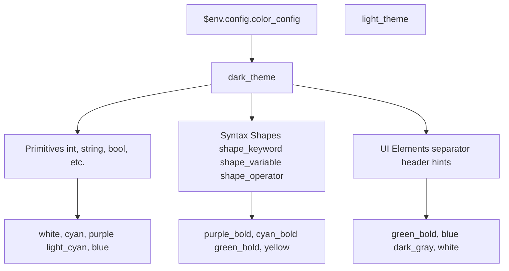

Sources: [nushell/config.nu L9-L140](https://github.com/Klaudioz/dotfiles/blob/2febda55/nushell/config.nu#L9-L140)

### Theme CategoriesLink copied!

| Category | Elements | Example Colors |
| --- | --- | --- |
| **Primitives** | `bool`, `int`, `string`, `float`, `date` | `light_cyan`, `white`, `purple` |
| **Syntax Shapes** | `shape_keyword`, `shape_variable`, `shape_operator` | `cyan_bold`, `purple`, `yellow` |
| **UI Components** | `header`, `hints`, `separator` | `green_bold`, `dark_gray`, `white` |
| **Search Results** | `search_result` | `{ bg: red fg: white }` |

The active theme is set via `$env.config.color_config = $dark_theme` [nushell/config.nu L221](https://github.com/Klaudioz/dotfiles/blob/2febda55/nushell/config.nu#L221-L221)

Sources: [nushell/config.nu L9-L140](https://github.com/Klaudioz/dotfiles/blob/2febda55/nushell/config.nu#L9-L140)

 [nushell/config.nu L221](https://github.com/Klaudioz/dotfiles/blob/2febda55/nushell/config.nu#L221-L221)

---

## Configuration SettingsLink copied!

The main configuration is stored in the `$env.config` record [nushell/config.nu L142-L262](https://github.com/Klaudioz/dotfiles/blob/2febda55/nushell/config.nu#L142-L262)

### Core SettingsLink copied!

| Setting | Value | Purpose |
| --- | --- | --- |
| `show_banner` | `false` | Disable startup banner |
| `edit_mode` | `"vi"` | Vi-style keybindings |
| `use_grid_icons` | `true` | Enable grid icons in ls |
| `shell_integration` | Multiple OSC codes | Terminal integration features |
| `recursion_limit` | `50` | Maximum recursion depth |

Sources: [nushell/config.nu L142-L262](https://github.com/Klaudioz/dotfiles/blob/2febda55/nushell/config.nu#L142-L262)

### Table ConfigurationLink copied!

```css
table: {    mode: rounded    index_mode: always    show_empty: true    padding: { left: 1, right: 1 }    trim: {        methodology: wrapping        wrapping_try_keep_words: true        truncating_suffix: "..."    }}
```

Sources: [nushell/config.nu L154-L166](https://github.com/Klaudioz/dotfiles/blob/2febda55/nushell/config.nu#L154-L166)

### History ConfigurationLink copied!

```
history: {    max_size: 100_000    sync_on_enter: true    file_format: "plaintext"    isolation: false}
```

This configuration allows history sharing across sessions. For more sophisticated history management, Atuin is integrated (see [External Tool Integration](https://github.com/Klaudioz/dotfiles/blob/2febda55/External Tool Integration)

).

Sources: [nushell/config.nu L190-L195](https://github.com/Klaudioz/dotfiles/blob/2febda55/nushell/config.nu#L190-L195)

### Completion SystemLink copied!

```
completions: {    case_sensitive: false    quick: true    partial: true    algorithm: "prefix"    external: {        enable: true        max_results: 100        completer: null    }    use_ls_colors: true}
```

The `completer: null` setting is overridden by Carapace integration for advanced completions.

Sources: [nushell/config.nu L197-L208](https://github.com/Klaudioz/dotfiles/blob/2febda55/nushell/config.nu#L197-L208)

---

## Aliases and Custom CommandsLink copied!

### Custom CommandsLink copied!

#### cx - Change Directory with Listing

```
def --env cx [arg] {    cd $arg    ls -l}
```

The `--env` flag allows the command to modify the environment (change directory).

Sources: [nushell/config.nu L904-L907](https://github.com/Klaudioz/dotfiles/blob/2febda55/nushell/config.nu#L904-L907)

#### ff - Fuzzy Window Finder

```
def ff [] {    aerospace list-windows --all | fzf --bind 'enter:execute(bash -c "aerospace focus --window-id {1}")+abort'}
```

Integrates with AeroSpace window manager to provide fuzzy window switching.

Sources: [nushell/config.nu L918-L920](https://github.com/Klaudioz/dotfiles/blob/2febda55/nushell/config.nu#L918-L920)

### Utility AliasesLink copied!

| Alias | Command | Purpose |
| --- | --- | --- |
| `l` | `ls --all` | List all files |
| `c` | `clear` | Clear screen |
| `ll` | `ls -l` | Long listing |
| `lt` | `eza --tree --level=2 --long --icons --git` | Tree view with git status |
| `v` | `nvim` | Launch Neovim |
| `hms` | `/nix/store/.../home-manager switch` | Home manager switch |
| `as` | `aerospace` | AeroSpace shortcut |
| `asr` | `atuin scripts run` | Run Atuin scripts |

Sources: [nushell/config.nu L909-L916](https://github.com/Klaudioz/dotfiles/blob/2febda55/nushell/config.nu#L909-L916)

### Git AliasesLink copied!

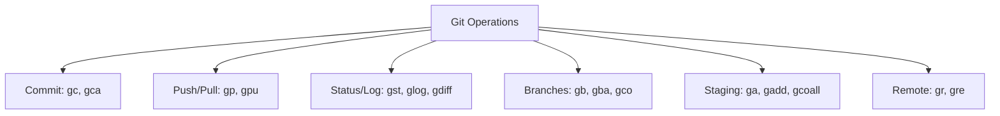

Sources: [nushell/config.nu L922-L938](https://github.com/Klaudioz/dotfiles/blob/2febda55/nushell/config.nu#L922-L938)

**Notable Git Aliases:**

* `glog`: Graphical log with custom format [nushell/config.nu L928](https://github.com/Klaudioz/dotfiles/blob/2febda55/nushell/config.nu#L928-L928)
* `ga`: Interactive staging with `git add -p` [nushell/config.nu L934](https://github.com/Klaudioz/dotfiles/blob/2febda55/nushell/config.nu#L934-L934)
* `gcoall`: Reset all changes with `git checkout -- .` [nushell/config.nu L935](https://github.com/Klaudioz/dotfiles/blob/2febda55/nushell/config.nu#L935-L935)

### Kubernetes AliasesLink copied!

| Alias | Command | Purpose |
| --- | --- | --- |
| `k` | `kubectl` | Main kubectl shortcut |
| `ka` | `kubectl apply -f` | Apply configuration |
| `kg` | `kubectl get` | Get resources |
| `kd` | `kubectl describe` | Describe resources |
| `kdel` | `kubectl delete` | Delete resources |
| `kl` | `kubectl logs -f` | Follow logs |
| `ke` | `kubectl exec -it` | Interactive exec |
| `kgpo` | `kubectl get pod` | Get pods |
| `kgd` | `kubectl get deployments` | Get deployments |
| `kc` | `kubectx` | Switch context |
| `kns` | `kubens` | Switch namespace |

Sources: [nushell/config.nu L939-L952](https://github.com/Klaudioz/dotfiles/blob/2febda55/nushell/config.nu#L939-L952)

---

## External Tool IntegrationLink copied!

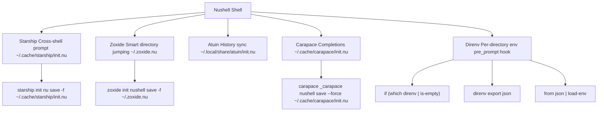

Sources: [nushell/env.nu L123-L131](https://github.com/Klaudioz/dotfiles/blob/2febda55/nushell/env.nu#L123-L131)

 [nushell/config.nu L279-L290](https://github.com/Klaudioz/dotfiles/blob/2febda55/nushell/config.nu#L279-L290)

 [nushell/config.nu L953-L957](https://github.com/Klaudioz/dotfiles/blob/2febda55/nushell/config.nu#L953-L957)

### Starship PromptLink copied!

Initialized in `env.nu` and loaded in `config.nu`:

```
# env.nustarship init nu | save -f ~/.cache/starship/init.nu$env.STARSHIP_CONFIG = /Users/omerxx/.config/starship/starship.toml# config.nuuse ~/.cache/starship/init.nu
```

Sources: [nushell/env.nu L123-L127](https://github.com/Klaudioz/dotfiles/blob/2febda55/nushell/env.nu#L123-L127)

 [nushell/config.nu L957](https://github.com/Klaudioz/dotfiles/blob/2febda55/nushell/config.nu#L957-L957)

### Zoxide - Smart Directory JumpingLink copied!

Zoxide provides the `z` command for intelligent directory navigation based on frecency (frequency + recency).

**Initialization:** [nushell/env.nu L125](https://github.com/Klaudioz/dotfiles/blob/2febda55/nushell/env.nu#L125-L125)

**Loading:** [nushell/config.nu L954](https://github.com/Klaudioz/dotfiles/blob/2febda55/nushell/config.nu#L954-L954)

### Atuin - Shell History SyncLink copied!

Atuin provides cloud-synchronized shell history with search capabilities.

**Loading:** [nushell/config.nu L956](https://github.com/Klaudioz/dotfiles/blob/2febda55/nushell/config.nu#L956-L956)

**Scripts:** The `asr` alias [nushell/config.nu L916](https://github.com/Klaudioz/dotfiles/blob/2febda55/nushell/config.nu#L916-L916)

 provides access to Atuin script execution.

### Carapace - Advanced CompletionsLink copied!

Carapace generates completions from multiple sources including zsh, fish, and bash completers.

**Configuration:** `$env.CARAPACE_BRIDGES = 'zsh,fish,bash,inshellisense'` [nushell/env.nu L129](https://github.com/Klaudioz/dotfiles/blob/2febda55/nushell/env.nu#L129-L129)

**Initialization:** [nushell/env.nu L130-L131](https://github.com/Klaudioz/dotfiles/blob/2febda55/nushell/env.nu#L130-L131)

**Loading:** [nushell/config.nu L955](https://github.com/Klaudioz/dotfiles/blob/2febda55/nushell/config.nu#L955-L955)

### Direnv - Per-Directory EnvironmentsLink copied!

Direnv automatically loads environment variables when entering directories with `.envrc` files.

**Implementation:** [nushell/config.nu L279-L290](https://github.com/Klaudioz/dotfiles/blob/2febda55/nushell/config.nu#L279-L290)

The `pre_prompt` hook checks for direnv, exports its environment as JSON, parses it, and loads it into Nushell's environment. PATH variables are split into list format.

---

## KeybindingsLink copied!

Nushell supports extensive keybinding customization with 50+ bindings defined [nushell/config.nu L387-L901](https://github.com/Klaudioz/dotfiles/blob/2febda55/nushell/config.nu#L387-L901)

### Keybinding StructureLink copied!

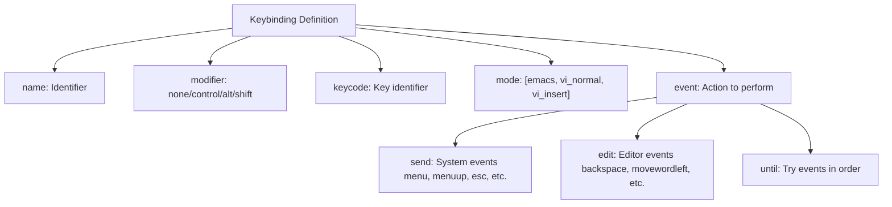

Sources: [nushell/config.nu L387-L901](https://github.com/Klaudioz/dotfiles/blob/2febda55/nushell/config.nu#L387-L901)

### Menu KeybindingsLink copied!

| Keybinding | Action | Description |
| --- | --- | --- |
| `Tab` | `completion_menu` | Standard completion |
| `Ctrl+n` | `ide_completion_menu` | IDE-style completion |
| `Ctrl+r` | `history_menu` | History search |
| `F1` | `help_menu` | Help menu |
| `Shift+Tab` | `menuprevious` | Previous completion |

Sources: [nushell/config.nu L396-L441](https://github.com/Klaudioz/dotfiles/blob/2febda55/nushell/config.nu#L396-L441)

### Navigation KeybindingsLink copied!

| Keybinding | Action | Description |
| --- | --- | --- |
| `Ctrl+a` / `Home` | `movetolinestart` | Start of line |
| `Ctrl+e` / `End` | `movetolineend` | End of line |
| `Ctrl+Left` / `Alt+b` | `movewordleft` | Word left |
| `Ctrl+Right` / `Alt+f` | `movewordright` | Word right |
| `Ctrl+p` / `Up` | `up` | Previous command |
| `Ctrl+t` / `Down` | `down` | Next command |

Sources: [nushell/config.nu L504-L646](https://github.com/Klaudioz/dotfiles/blob/2febda55/nushell/config.nu#L504-L646)

### Editing KeybindingsLink copied!

| Keybinding | Action | Description |
| --- | --- | --- |
| `Ctrl+h` / `Backspace` | `backspace` | Delete character backward |
| `Ctrl+w` / `Alt+Backspace` | `backspaceword` | Delete word backward |
| `Alt+d` | `cutwordright` | Cut word forward |
| `Ctrl+k` | `cuttoend` | Cut to end of line |
| `Ctrl+u` | `cutfromstart` | Cut from start of line |
| `Ctrl+y` | `pastecutbufferbefore` | Paste cut buffer |
| `Ctrl+z` | `undo` | Undo change |
| `Ctrl+g` | `redo` | Redo change |

Sources: [nushell/config.nu L647-L863](https://github.com/Klaudioz/dotfiles/blob/2febda55/nushell/config.nu#L647-L863)

### System KeybindingsLink copied!

| Keybinding | Action | Description |
| --- | --- | --- |
| `Ctrl+c` | `ctrlc` | Cancel command |
| `Ctrl+d` | `ctrld` | Quit shell |
| `Ctrl+l` | `clearscreen` | Clear screen |
| `Ctrl+q` | `searchhistory` | Search history |
| `Ctrl+o` | `openeditor` | Open command in external editor |
| `Esc` | `esc` | Escape/cancel |

Sources: [nushell/config.nu L462-L502](https://github.com/Klaudioz/dotfiles/blob/2febda55/nushell/config.nu#L462-L502)

---

## MenusLink copied!

Nushell provides four customizable menu types for different interaction patterns.

### Menu TypesLink copied!

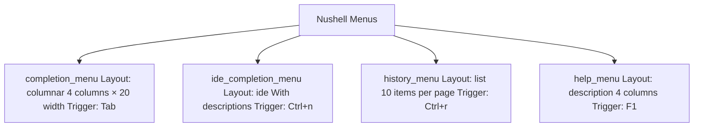

Sources: [nushell/config.nu L299-L385](https://github.com/Klaudioz/dotfiles/blob/2febda55/nushell/config.nu#L299-L385)

### Completion MenuLink copied!

Standard completion with columnar layout [nushell/config.nu L302-L319](https://github.com/Klaudioz/dotfiles/blob/2febda55/nushell/config.nu#L302-L319)

:

* 4 columns
* 20 character width per column
* Green text with underlined matches
* Yellow descriptions

### IDE Completion MenuLink copied!

Advanced completion with integrated descriptions [nushell/config.nu L320-L352](https://github.com/Klaudioz/dotfiles/blob/2febda55/nushell/config.nu#L320-L352)

:

* Side-by-side layout
* Max 50 character width for completions
* Max 10 rows height
* Border enabled
* Right-side description preference

### History MenuLink copied!

List-based history navigation [nushell/config.nu L353-L366](https://github.com/Klaudioz/dotfiles/blob/2febda55/nushell/config.nu#L353-L366)

:

* 10 items per page
* Green text with reverse selection
* Yellow descriptions

### Help MenuLink copied!

Context-sensitive help [nushell/config.nu L367-L384](https://github.com/Klaudioz/dotfiles/blob/2febda55/nushell/config.nu#L367-L384)

:

* Description layout
* 4 columns
* 4 selection rows
* 10 description rows

---

## HooksLink copied!

Nushell hooks execute code at specific lifecycle points.

### Pre-Prompt Hook - Direnv IntegrationLink copied!

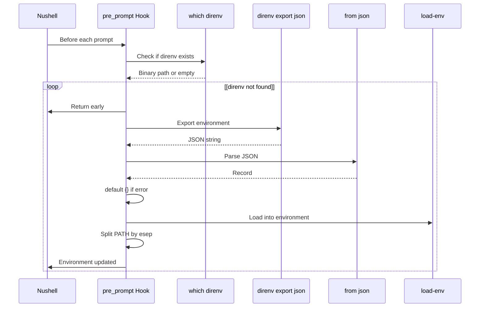

Sources: [nushell/config.nu L279-L290](https://github.com/Klaudioz/dotfiles/blob/2febda55/nushell/config.nu#L279-L290)

**Implementation Details:**

1. Check if `direnv` exists [nushell/config.nu L281-L283](https://github.com/Klaudioz/dotfiles/blob/2febda55/nushell/config.nu#L281-L283)
2. Try to export environment [nushell/config.nu L284](https://github.com/Klaudioz/dotfiles/blob/2febda55/nushell/config.nu#L284-L284)
3. Parse JSON and default to empty record [nushell/config.nu L285](https://github.com/Klaudioz/dotfiles/blob/2febda55/nushell/config.nu#L285-L285)
4. Load environment variables [nushell/config.nu L285](https://github.com/Klaudioz/dotfiles/blob/2febda55/nushell/config.nu#L285-L285)
5. Convert PATH to list format [nushell/config.nu L286-L288](https://github.com/Klaudioz/dotfiles/blob/2febda55/nushell/config.nu#L286-L288)
6. Catch any errors silently [nushell/config.nu L289](https://github.com/Klaudioz/dotfiles/blob/2febda55/nushell/config.nu#L289-L289)

### Other HooksLink copied!

| Hook | Purpose | Configuration |
| --- | --- | --- |
| `pre_execution` | Before command execution | `[{ null }]` (disabled) |
| `env_change.PWD` | When directory changes | `[{ |
| `display_output` | Format pipeline output | Conditional table display based on terminal width |
| `command_not_found` | Handle unknown commands | `{ null }` (disabled) |

Sources: [nushell/config.nu L291-L297](https://github.com/Klaudioz/dotfiles/blob/2febda55/nushell/config.nu#L291-L297)

---

## Shell Integration FeaturesLink copied!

Nushell supports modern terminal integration via OSC (Operating System Command) escape sequences.

### Enabled OSC CodesLink copied!

| OSC Code | Purpose | Status |
| --- | --- | --- |
| `osc2` | Window/tab title with path abbreviation | Enabled |
| `osc7` | Communicate working directory to terminal | Enabled |
| `osc8` | Clickable links in output | Enabled |
| `osc9_9` | ConEmu-style path communication | Disabled |
| `osc133` | Final Term protocol (prompt markers) | Enabled |
| `osc633` | VS Code shell integration | Enabled |

Sources: [nushell/config.nu L229-L256](https://github.com/Klaudioz/dotfiles/blob/2febda55/nushell/config.nu#L229-L256)

**Benefits:**

* Terminal can track current directory for new tab spawning
* VS Code integration for command tracking
* Clickable file paths in `ls` output
* Proper prompt detection for terminal features

---

## Ruby Environment ConfigurationLink copied!

Ruby gem paths are configured at the end of `config.nu` [nushell/config.nu L959-L971](https://github.com/Klaudioz/dotfiles/blob/2febda55/nushell/config.nu#L959-L971)

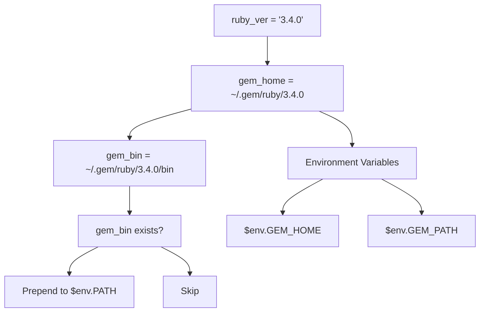

Sources: [nushell/config.nu L959-L971](https://github.com/Klaudioz/dotfiles/blob/2febda55/nushell/config.nu#L959-L971)

This configuration ensures Ruby gems installed with `gem install --user-install` are accessible in the shell.

---

## Best Practices and Usage PatternsLink copied!

### Vi ModeLink copied!

The shell is configured with `edit_mode: "vi"` [nushell/config.nu L228](https://github.com/Klaudioz/dotfiles/blob/2febda55/nushell/config.nu#L228-L228)

 enabling vi-style editing with distinct mode indicators:

* Insert mode: `:`
* Normal mode: `>`

### Structured Data PipelineLink copied!

Nushell's primary advantage is treating command output as structured data. Examples from the configuration:

```
# Devbox integration parsingdevbox global shellenv --format nushell --preserve-path-stack -r  | lines   | parse "$env.{name} = \"{value}\""  | where name != null   | transpose -r   | into record   | load-env
```

This pipeline demonstrates:

1. Capture multi-line output
2. Parse into structured records
3. Filter null values
4. Transform into record format
5. Load into environment

Sources: [nushell/config.nu L111-L117](https://github.com/Klaudioz/dotfiles/blob/2febda55/nushell/config.nu#L111-L117)

### Custom Menu SelectionLink copied!

The configuration provides multiple completion styles:

* Press `Tab` for standard columnar completion
* Press `Ctrl+n` for IDE-style completion with descriptions
* Press `Ctrl+r` for history search

### Direnv Integration PatternLink copied!

The direnv hook pattern [nushell/config.nu L279-L290](https://github.com/Klaudioz/dotfiles/blob/2febda55/nushell/config.nu#L279-L290)

 can be adapted for other tools:

1. Check tool availability
2. Export configuration
3. Parse into Nushell structures
4. Load into environment
5. Handle errors gracefully

---

## Related ConfigurationsLink copied!

* **Terminal Emulators**: See [Ghostty Configuration](#3.1.1) and [WezTerm Configuration](#3.1.2) for terminal settings
* **Alternative Shell**: See [Zsh Setup](#3.2.2) for the traditional shell configuration
* **Prompt Styling**: See [Starship Prompt](#3.3) for cross-shell prompt customization
* **Editor Integration**: See [Neovim Editor Configuration](#4) for the `$env.EDITOR` target

Refresh this wiki

Last indexed: 18 December 2025 ([2febda](https://github.com/Klaudioz/dotfiles/commit/2febda55))

### On this page

* [Nushell Setup](#3.2.1-nushell-setup)
* [Purpose and Scope](#3.2.1-purpose-and-scope)
* [Configuration File Structure](#3.2.1-configuration-file-structure)
* [env.nu - Environment Configuration](#3.2.1-envnu---environment-configuration)
* [config.nu - Runtime Configuration](#3.2.1-confignu---runtime-configuration)
* [Initialization Sequence](#3.2.1-initialization-sequence)
* [Environment Variables and PATH Management](#3.2.1-environment-variables-and-path-management)
* [PATH Configuration](#3.2.1-path-configuration)
* [Key Environment Variables](#3.2.1-key-environment-variables)
* [ENV_CONVERSIONS](#3.2.1-env_conversions)
* [Prompt Customization](#3.2.1-prompt-customization)
* [Left Prompt Function](#3.2.1-left-prompt-function)
* [Right Prompt Function](#3.2.1-right-prompt-function)
* [Prompt Environment Variables](#3.2.1-prompt-environment-variables)
* [Themes and Color Configuration](#3.2.1-themes-and-color-configuration)
* [Theme Structure](#3.2.1-theme-structure)
* [Theme Categories](#3.2.1-theme-categories)
* [Configuration Settings](#3.2.1-configuration-settings)
* [Core Settings](#3.2.1-core-settings)
* [Table Configuration](#3.2.1-table-configuration)
* [History Configuration](#3.2.1-history-configuration)
* [Completion System](#3.2.1-completion-system)
* [Aliases and Custom Commands](#3.2.1-aliases-and-custom-commands)
* [Custom Commands](#3.2.1-custom-commands)
* [Utility Aliases](#3.2.1-utility-aliases)
* [Git Aliases](#3.2.1-git-aliases)
* [Kubernetes Aliases](#3.2.1-kubernetes-aliases)
* [External Tool Integration](#3.2.1-external-tool-integration)
* [Starship Prompt](#3.2.1-starship-prompt)
* [Zoxide - Smart Directory Jumping](#3.2.1-zoxide---smart-directory-jumping)
* [Atuin - Shell History Sync](#3.2.1-atuin---shell-history-sync)
* [Carapace - Advanced Completions](#3.2.1-carapace---advanced-completions)
* [Direnv - Per-Directory Environments](#3.2.1-direnv---per-directory-environments)
* [Keybindings](#3.2.1-keybindings)
* [Keybinding Structure](#3.2.1-keybinding-structure)
* [Menu Keybindings](#3.2.1-menu-keybindings)
* [Navigation Keybindings](#3.2.1-navigation-keybindings)
* [Editing Keybindings](#3.2.1-editing-keybindings)
* [System Keybindings](#3.2.1-system-keybindings)
* [Menus](#3.2.1-menus)
* [Menu Types](#3.2.1-menu-types)
* [Completion Menu](#3.2.1-completion-menu)
* [IDE Completion Menu](#3.2.1-ide-completion-menu)
* [History Menu](#3.2.1-history-menu)
* [Help Menu](#3.2.1-help-menu)
* [Hooks](#3.2.1-hooks)
* [Pre-Prompt Hook - Direnv Integration](#3.2.1-pre-prompt-hook---direnv-integration)
* [Other Hooks](#3.2.1-other-hooks)
* [Shell Integration Features](#3.2.1-shell-integration-features)
* [Enabled OSC Codes](#3.2.1-enabled-osc-codes)
* [Ruby Environment Configuration](#3.2.1-ruby-environment-configuration)
* [Best Practices and Usage Patterns](#3.2.1-best-practices-and-usage-patterns)
* [Vi Mode](#3.2.1-vi-mode)
* [Structured Data Pipeline](#3.2.1-structured-data-pipeline)
* [Custom Menu Selection](#3.2.1-custom-menu-selection)
* [Direnv Integration Pattern](#3.2.1-direnv-integration-pattern)
* [Related Configurations](#3.2.1-related-configurations)

Ask Devin about dotfiles

  

Syntax error in text

mermaid version 11.4.1

Syntax error in text

mermaid version 11.4.1