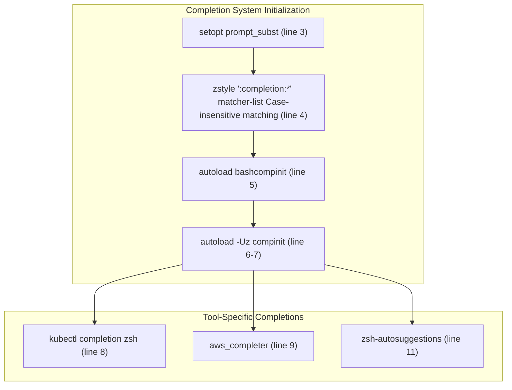
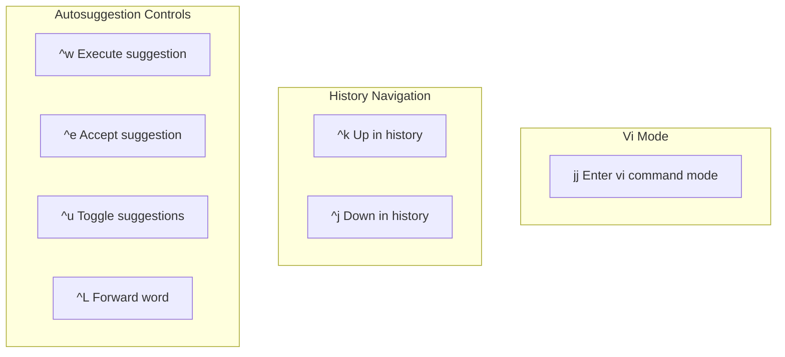
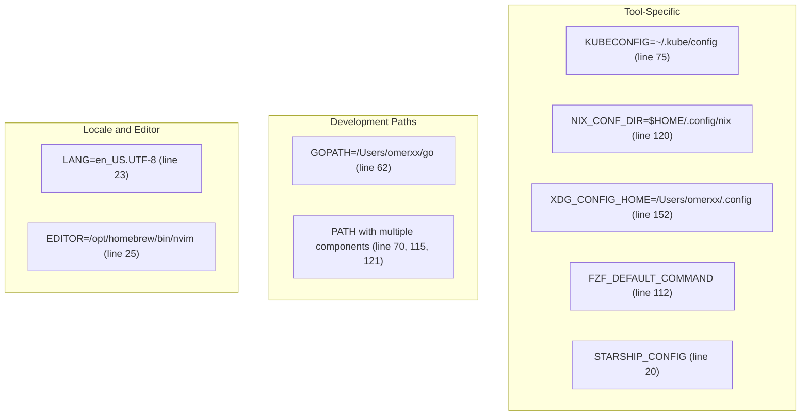
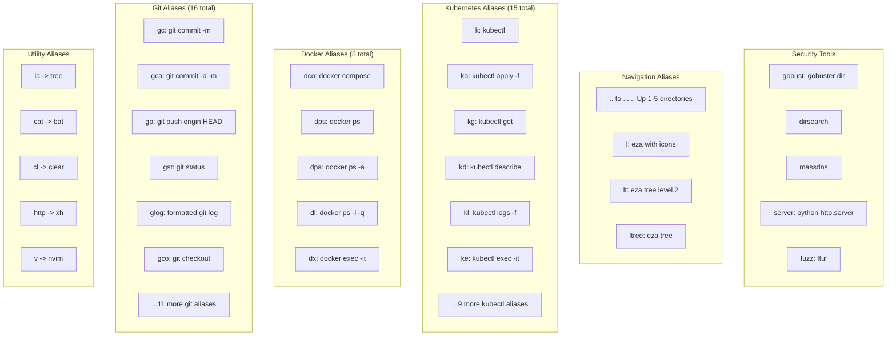
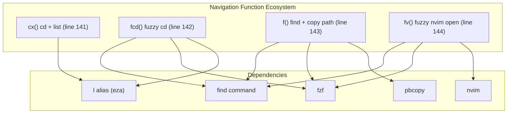
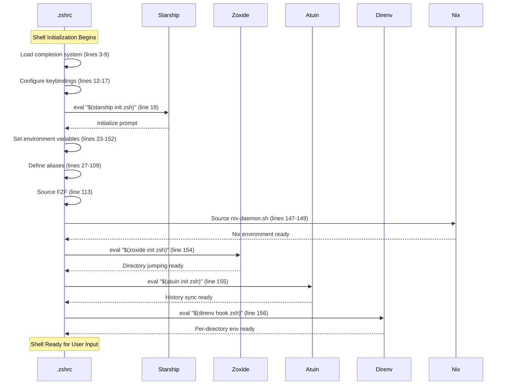
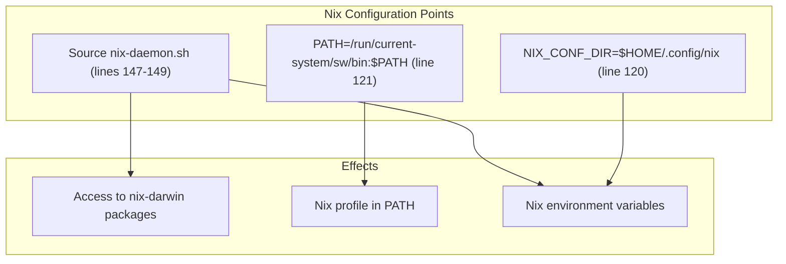
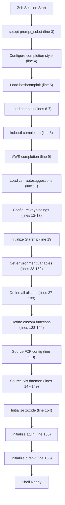

[/](/)

[/search](/search)

[/wiki](/wiki)

[/settings/members](/settings/members)

[/settings/support](/settings/support)

[Add repo](/repositories)

[All repos](/wiki)

[backend](/wiki/Klaudioz/backend)

[BH-Workflow-Engine](/wiki/Klaudioz/BH-Workflow-Engine)

[Buckhead_CRM](/wiki/Klaudioz/Buckhead_CRM)

[dotfiles](/wiki/Klaudioz/dotfiles)

[frontend](/wiki/Klaudioz/frontend)

[godeep.wiki-jb](/wiki/Klaudioz/godeep.wiki-jb)

[pi-mono-zero](/wiki/Klaudioz/pi-mono-zero)

[VirtualOracle](/wiki/Klaudioz/VirtualOracle)

# Zsh SetupLink copied!

> **Relevant source files**
> * [zshrc/.zshrc](https://github.com/Klaudioz/dotfiles/blob/2febda55/zshrc/.zshrc)

## Purpose and ScopeLink copied!

This document provides a comprehensive guide to the Zsh shell configuration in this dotfiles repository. It covers the completion system setup, keybinding customization, environment variables, extensive alias definitions organized by workflow category (Git, Docker, Kubernetes, etc.), custom shell functions, and external tool integrations including Starship, zoxide, atuin, and direnv.

For Nushell configuration, see [3.2.1](#3.2.1). For cross-shell Starship prompt configuration, see [3.3](#3.3). For terminal emulator configuration that hosts the shell, see [3.1](#3.1).

Sources: [zshrc/.zshrc L1-L157](https://github.com/Klaudioz/dotfiles/blob/2febda55/zshrc/.zshrc#L1-L157)

## Configuration File LocationLink copied!

The primary Zsh configuration resides in a single `.zshrc` file located at `zshrc/.zshrc`. This file is symlinked to `~/.zshrc` during installation via `stow` or managed through `nix-darwin`. The configuration follows a traditional Zsh setup pattern without oh-my-zsh or similar frameworks, providing direct control over all shell behavior.

Sources: [zshrc/.zshrc L1-L2](https://github.com/Klaudioz/dotfiles/blob/2febda55/zshrc/.zshrc#L1-L2)

## Completion System ArchitectureLink copied!

### Core Completion SetupLink copied!

The completion system initializes through a combination of Zsh's native `compinit` and `bashcompinit` for bash-compatible completions:



**Completion System Configuration**

| Feature | Configuration | Location |
| --- | --- | --- |
| Case insensitivity | `zstyle ':completion:*' matcher-list 'm:{a-z}={A-Za-z}'` | [zshrc/.zshrc L4](https://github.com/Klaudioz/dotfiles/blob/2febda55/zshrc/.zshrc#L4-L4) |
| Bash compatibility | `autoload bashcompinit && bashcompinit` | [zshrc/.zshrc L5](https://github.com/Klaudioz/dotfiles/blob/2febda55/zshrc/.zshrc#L5-L5) |
| Native completion | `autoload -Uz compinit; compinit` | [zshrc/.zshrc L6-L7](https://github.com/Klaudioz/dotfiles/blob/2febda55/zshrc/.zshrc#L6-L7) |
| kubectl completion | `source <(kubectl completion zsh)` | [zshrc/.zshrc L8](https://github.com/Klaudioz/dotfiles/blob/2febda55/zshrc/.zshrc#L8-L8) |
| AWS CLI completion | `complete -C '/usr/local/bin/aws_completer' aws` | [zshrc/.zshrc L9](https://github.com/Klaudioz/dotfiles/blob/2febda55/zshrc/.zshrc#L9-L9) |

### Zsh-Autosuggestions IntegrationLink copied!

The configuration loads `zsh-autosuggestions` from Homebrew and defines custom keybindings for suggestion control:

| Keybinding | Action | Configuration Line |
| --- | --- | --- |
| `Ctrl+w` | Execute suggestion | [zshrc/.zshrc L12](https://github.com/Klaudioz/dotfiles/blob/2febda55/zshrc/.zshrc#L12-L12) |
| `Ctrl+e` | Accept suggestion | [zshrc/.zshrc L13](https://github.com/Klaudioz/dotfiles/blob/2febda55/zshrc/.zshrc#L13-L13) |
| `Ctrl+u` | Toggle suggestions | [zshrc/.zshrc L14](https://github.com/Klaudioz/dotfiles/blob/2febda55/zshrc/.zshrc#L14-L14) |
| `Ctrl+L` | Move forward one word | [zshrc/.zshrc L15](https://github.com/Klaudioz/dotfiles/blob/2febda55/zshrc/.zshrc#L15-L15) |

Sources: [zshrc/.zshrc L3-L17](https://github.com/Klaudioz/dotfiles/blob/2febda55/zshrc/.zshrc#L3-L17)

## KeybindingsLink copied!

### Navigation KeybindingsLink copied!

The configuration establishes custom navigation keybindings that enhance movement through command history and suggestions:



**Complete Keybinding Reference**

| Key Sequence | Function | Line Reference |
| --- | --- | --- |
| `^w` | `autosuggest-execute` | [zshrc/.zshrc L12](https://github.com/Klaudioz/dotfiles/blob/2febda55/zshrc/.zshrc#L12-L12) |
| `^e` | `autosuggest-accept` | [zshrc/.zshrc L13](https://github.com/Klaudioz/dotfiles/blob/2febda55/zshrc/.zshrc#L13-L13) |
| `^u` | `autosuggest-toggle` | [zshrc/.zshrc L14](https://github.com/Klaudioz/dotfiles/blob/2febda55/zshrc/.zshrc#L14-L14) |
| `^L` | `vi-forward-word` | [zshrc/.zshrc L15](https://github.com/Klaudioz/dotfiles/blob/2febda55/zshrc/.zshrc#L15-L15) |
| `^k` | `up-line-or-search` | [zshrc/.zshrc L16](https://github.com/Klaudioz/dotfiles/blob/2febda55/zshrc/.zshrc#L16-L16) |
| `^j` | `down-line-or-search` | [zshrc/.zshrc L17](https://github.com/Klaudioz/dotfiles/blob/2febda55/zshrc/.zshrc#L17-L17) |
| `jj` | `vi-cmd-mode` | [zshrc/.zshrc L95](https://github.com/Klaudioz/dotfiles/blob/2febda55/zshrc/.zshrc#L95-L95) |

Sources: [zshrc/.zshrc L12-L17](https://github.com/Klaudioz/dotfiles/blob/2febda55/zshrc/.zshrc#L12-L17)

 [zshrc/.zshrc L95](https://github.com/Klaudioz/dotfiles/blob/2febda55/zshrc/.zshrc#L95-L95)

## Environment VariablesLink copied!

### Core Environment ConfigurationLink copied!



**Environment Variable Reference**

| Variable | Value | Purpose | Line |
| --- | --- | --- | --- |
| `LANG` | `en_US.UTF-8` | System locale | [zshrc/.zshrc L23](https://github.com/Klaudioz/dotfiles/blob/2febda55/zshrc/.zshrc#L23-L23) |
| `EDITOR` | `/opt/homebrew/bin/nvim` | Default text editor | [zshrc/.zshrc L25](https://github.com/Klaudioz/dotfiles/blob/2febda55/zshrc/.zshrc#L25-L25) |
| `GOPATH` | `/Users/omerxx/go` | Go workspace | [zshrc/.zshrc L62](https://github.com/Klaudioz/dotfiles/blob/2febda55/zshrc/.zshrc#L62-L62) |
| `KUBECONFIG` | `~/.kube/config` | Kubernetes config | [zshrc/.zshrc L75](https://github.com/Klaudioz/dotfiles/blob/2febda55/zshrc/.zshrc#L75-L75) |
| `FZF_DEFAULT_COMMAND` | `fd --type f --hidden --follow` | FZF file finding | [zshrc/.zshrc L112](https://github.com/Klaudioz/dotfiles/blob/2febda55/zshrc/.zshrc#L112-L112) |
| `NIX_CONF_DIR` | `$HOME/.config/nix` | Nix configuration | [zshrc/.zshrc L120](https://github.com/Klaudioz/dotfiles/blob/2febda55/zshrc/.zshrc#L120-L120) |
| `XDG_CONFIG_HOME` | `/Users/omerxx/.config` | XDG base directory | [zshrc/.zshrc L152](https://github.com/Klaudioz/dotfiles/blob/2febda55/zshrc/.zshrc#L152-L152) |
| `STARSHIP_CONFIG` | `~/.config/starship/starship.toml` | Starship prompt config | [zshrc/.zshrc L20](https://github.com/Klaudioz/dotfiles/blob/2febda55/zshrc/.zshrc#L20-L20) |

### PATH ConstructionLink copied!

The `PATH` environment variable is assembled from multiple sources across three separate assignments:

1. **Initial PATH** [zshrc/.zshrc L70](https://github.com/Klaudioz/dotfiles/blob/2febda55/zshrc/.zshrc#L70-L70) : Includes system directories, Go binaries, and Cargo binaries
2. **Homebrew PATH** [zshrc/.zshrc L115](https://github.com/Klaudioz/dotfiles/blob/2febda55/zshrc/.zshrc#L115-L115) : Prepends `/opt/homebrew/bin`
3. **Nix PATH** [zshrc/.zshrc L121](https://github.com/Klaudioz/dotfiles/blob/2febda55/zshrc/.zshrc#L121-L121) : Prepends `/run/current-system/sw/bin`

Final precedence order: Nix → Homebrew → System → Go → Cargo

Sources: [zshrc/.zshrc L23](https://github.com/Klaudioz/dotfiles/blob/2febda55/zshrc/.zshrc#L23-L23)

 [zshrc/.zshrc L25](https://github.com/Klaudioz/dotfiles/blob/2febda55/zshrc/.zshrc#L25-L25)

 [zshrc/.zshrc L62](https://github.com/Klaudioz/dotfiles/blob/2febda55/zshrc/.zshrc#L62-L62)

 [zshrc/.zshrc L70](https://github.com/Klaudioz/dotfiles/blob/2febda55/zshrc/.zshrc#L70-L70)

 [zshrc/.zshrc L75](https://github.com/Klaudioz/dotfiles/blob/2febda55/zshrc/.zshrc#L75-L75)

 [zshrc/.zshrc L112](https://github.com/Klaudioz/dotfiles/blob/2febda55/zshrc/.zshrc#L112-L112)

 [zshrc/.zshrc L115](https://github.com/Klaudioz/dotfiles/blob/2febda55/zshrc/.zshrc#L115-L115)

 [zshrc/.zshrc L120-L121](https://github.com/Klaudioz/dotfiles/blob/2febda55/zshrc/.zshrc#L120-L121)

 [zshrc/.zshrc L152](https://github.com/Klaudioz/dotfiles/blob/2febda55/zshrc/.zshrc#L152-L152)

## Alias DefinitionsLink copied!

### Alias Organization StructureLink copied!

The configuration defines 60+ aliases organized by workflow category:



### Git AliasesLink copied!

| Alias | Command | Purpose |
| --- | --- | --- |
| `gc` | `git commit -m` | Quick commit with message |
| `gca` | `git commit -a -m` | Commit all with message |
| `gp` | `git push origin HEAD` | Push current branch |
| `gpu` | `git pull origin` | Pull from origin |
| `gst` | `git status` | Repository status |
| `glog` | `git log --graph --topo-order --pretty='...'` | Pretty formatted log |
| `gdiff` | `git diff` | Show differences |
| `gco` | `git checkout` | Switch branches |
| `gb` | `git branch` | List branches |
| `gba` | `git branch -a` | List all branches |
| `gadd` | `git add` | Stage files |
| `ga` | `git add -p` | Interactive staging |
| `gcoall` | `git checkout -- .` | Discard all changes |
| `gr` | `git remote` | Manage remotes |
| `gre` | `git reset` | Reset staging |

Sources: [zshrc/.zshrc L30-L45](https://github.com/Klaudioz/dotfiles/blob/2febda55/zshrc/.zshrc#L30-L45)

### Docker AliasesLink copied!

| Alias | Command | Purpose |
| --- | --- | --- |
| `dco` | `docker compose` | Docker Compose shorthand |
| `dps` | `docker ps` | List running containers |
| `dpa` | `docker ps -a` | List all containers |
| `dl` | `docker ps -l -q` | Latest container ID |
| `dx` | `docker exec -it` | Interactive container exec |

Sources: [zshrc/.zshrc L47-L52](https://github.com/Klaudioz/dotfiles/blob/2febda55/zshrc/.zshrc#L47-L52)

### Kubernetes AliasesLink copied!

| Alias | Command | Purpose |
| --- | --- | --- |
| `k` | `kubectl` | kubectl shorthand |
| `ka` | `kubectl apply -f` | Apply resources |
| `kg` | `kubectl get` | Get resources |
| `kd` | `kubectl describe` | Describe resources |
| `kdel` | `kubectl delete` | Delete resources |
| `kl` | `kubectl logs -f` | Follow logs |
| `kgpo` | `kubectl get pod` | List pods |
| `kgd` | `kubectl get deployments` | List deployments |
| `kc` | `kubectx` | Switch context |
| `kns` | `kubens` | Switch namespace |
| `ke` | `kubectl exec -it` | Interactive exec |
| `kcns` | `kubectl config set-context --current --namespace` | Set namespace |

Sources: [zshrc/.zshrc L74-L89](https://github.com/Klaudioz/dotfiles/blob/2febda55/zshrc/.zshrc#L74-L89)

### Directory Navigation AliasesLink copied!

| Alias | Command | Purpose |
| --- | --- | --- |
| `..` | `cd ..` | Up one directory |
| `...` | `cd ../..` | Up two directories |
| `....` | `cd ../../..` | Up three directories |
| `.....` | `cd ../../../..` | Up four directories |
| `......` | `cd ../../../../..` | Up five directories |

Sources: [zshrc/.zshrc L54-L59](https://github.com/Klaudioz/dotfiles/blob/2febda55/zshrc/.zshrc#L54-L59)

### File Listing Aliases (Eza)Link copied!

| Alias | Command | Purpose |
| --- | --- | --- |
| `l` | `eza -l --icons --git -a` | Detailed list with icons |
| `lt` | `eza --tree --level=2 --long --icons --git` | Tree view level 2 |
| `ltree` | `eza --tree --level=2 --icons --git` | Tree view (compact) |

Sources: [zshrc/.zshrc L97-L100](https://github.com/Klaudioz/dotfiles/blob/2febda55/zshrc/.zshrc#L97-L100)

### Utility AliasesLink copied!

| Alias | Command | Purpose |
| --- | --- | --- |
| `la` | `tree` | Directory tree |
| `cat` | `bat` | Syntax-highlighted cat |
| `cl` | `clear` | Clear terminal |
| `http` | `xh` | HTTP client |
| `v` | `/Users/omerxx/.nix-profile/bin/nvim` | Neovim shorthand |
| `nm` | `nmap -sC -sV -oN nmap` | Nmap with defaults |
| `rr` | `ranger` | File manager |
| `mat` | `osascript... && tmux neww "cmatrix"` | Matrix screen effect |

Sources: [zshrc/.zshrc L27-L28](https://github.com/Klaudioz/dotfiles/blob/2febda55/zshrc/.zshrc#L27-L28)

 [zshrc/.zshrc L65](https://github.com/Klaudioz/dotfiles/blob/2febda55/zshrc/.zshrc#L65-L65)

 [zshrc/.zshrc L68](https://github.com/Klaudioz/dotfiles/blob/2febda55/zshrc/.zshrc#L68-L68)

 [zshrc/.zshrc L72](https://github.com/Klaudioz/dotfiles/blob/2febda55/zshrc/.zshrc#L72-L72)

 [zshrc/.zshrc L92](https://github.com/Klaudioz/dotfiles/blob/2febda55/zshrc/.zshrc#L92-L92)

 [zshrc/.zshrc L117](https://github.com/Klaudioz/dotfiles/blob/2febda55/zshrc/.zshrc#L117-L117)

 [zshrc/.zshrc L138](https://github.com/Klaudioz/dotfiles/blob/2febda55/zshrc/.zshrc#L138-L138)

### Security Tool AliasesLink copied!

| Alias | Command | Purpose |
| --- | --- | --- |
| `gobust` | `gobuster dir --wordlist ~/security/wordlists/...` | Directory busting |
| `dirsearch` | `python dirsearch.py -w db/dicc.txt...` | Directory search |
| `massdns` | `~/hacking/tools/massdns/bin/massdns...` | Mass DNS resolution |
| `server` | `python -m http.server 4445` | Local HTTP server |
| `tunnel` | `ngrok http 4445` | Ngrok tunnel |
| `fuzz` | `ffuf -w ~/hacking/SecLists/...` | Web fuzzing |
| `gr` | `~/go/src/github.com/tomnomnom/gf/gf` | Pattern matching |

Sources: [zshrc/.zshrc L102-L109](https://github.com/Klaudioz/dotfiles/blob/2febda55/zshrc/.zshrc#L102-L109)

## Custom FunctionsLink copied!

### Navigation FunctionsLink copied!

The configuration defines four custom navigation functions that integrate with fzf and other tools:



**Function Reference**

| Function | Syntax | Behavior | Line |
| --- | --- | --- | --- |
| `cx` | `cx <directory>` | Change directory and list contents with `l` | [zshrc/.zshrc L141](https://github.com/Klaudioz/dotfiles/blob/2febda55/zshrc/.zshrc#L141-L141) |
| `fcd` | `fcd` | Fuzzy find directory (excluding hidden) and cd + list | [zshrc/.zshrc L142](https://github.com/Klaudioz/dotfiles/blob/2febda55/zshrc/.zshrc#L142-L142) |
| `f` | `f` | Fuzzy find file and copy path to clipboard | [zshrc/.zshrc L143](https://github.com/Klaudioz/dotfiles/blob/2febda55/zshrc/.zshrc#L143-L143) |
| `fv` | `fv` | Fuzzy find file and open in Neovim | [zshrc/.zshrc L144](https://github.com/Klaudioz/dotfiles/blob/2febda55/zshrc/.zshrc#L144-L144) |

### Ranger Integration FunctionLink copied!

The `ranger` function provides directory navigation persistence, allowing ranger to change the shell's working directory on exit:

**Function Flow:**

1. Creates temporary file for directory communication [zshrc/.zshrc L125](https://github.com/Klaudioz/dotfiles/blob/2febda55/zshrc/.zshrc#L125-L125)
2. Launches ranger with custom quit mapping [zshrc/.zshrc L126-L132](https://github.com/Klaudioz/dotfiles/blob/2febda55/zshrc/.zshrc#L126-L132)
3. Reads directory from temp file on quit [zshrc/.zshrc L133](https://github.com/Klaudioz/dotfiles/blob/2febda55/zshrc/.zshrc#L133-L133)
4. Changes shell directory if different [zshrc/.zshrc L134](https://github.com/Klaudioz/dotfiles/blob/2febda55/zshrc/.zshrc#L134-L134)
5. Cleans up temporary file [zshrc/.zshrc L136](https://github.com/Klaudioz/dotfiles/blob/2febda55/zshrc/.zshrc#L136-L136)

Sources: [zshrc/.zshrc L123-L144](https://github.com/Klaudioz/dotfiles/blob/2febda55/zshrc/.zshrc#L123-L144)

## External Tool IntegrationsLink copied!

### Tool Integration FlowLink copied!



### Starship PromptLink copied!

The Starship prompt initializes via `eval` and loads its configuration from `~/.config/starship/starship.toml`:

```javascript
eval "$(starship init zsh)"
export STARSHIP_CONFIG=~/.config/starship/starship.toml
```

For detailed Starship configuration including modules and themes, see [3.3](#3.3).

Sources: [zshrc/.zshrc L19-L20](https://github.com/Klaudioz/dotfiles/blob/2febda55/zshrc/.zshrc#L19-L20)

### Zoxide IntegrationLink copied!

Zoxide provides smart directory jumping based on frecency (frequency + recency). Initialization occurs at shell startup:

```
eval "$(zoxide init zsh)"
```

**Usage Patterns:**

* `z <partial-path>` - Jump to most frequent matching directory
* Works with the `cx` custom function [zshrc/.zshrc L141](https://github.com/Klaudioz/dotfiles/blob/2febda55/zshrc/.zshrc#L141-L141)
* Replaces traditional `cd` for frequently accessed directories

Sources: [zshrc/.zshrc L154](https://github.com/Klaudioz/dotfiles/blob/2febda55/zshrc/.zshrc#L154-L154)

### Atuin IntegrationLink copied!

Atuin replaces default shell history with searchable, synced history:

```
eval "$(atuin init zsh)"
```

**Features:**

* Cloud-synced history across machines
* Full-text search through command history
* SQLite-backed storage
* Privacy-focused encryption

Sources: [zshrc/.zshrc L155](https://github.com/Klaudioz/dotfiles/blob/2febda55/zshrc/.zshrc#L155-L155)

### Direnv IntegrationLink copied!

Direnv automatically loads/unloads environment variables based on directory:

```
eval "$(direnv hook zsh)"
```

**Behavior:**

* Activates `.envrc` files when entering directories
* Deactivates when leaving directories
* Common for project-specific environment variables
* Integrates with Nix for development shells

Sources: [zshrc/.zshrc L156](https://github.com/Klaudioz/dotfiles/blob/2febda55/zshrc/.zshrc#L156-L156)

### FZF ConfigurationLink copied!

FZF provides fuzzy finding functionality with custom default command:

```javascript
export FZF_DEFAULT_COMMAND='fd --type f --hidden --follow'
[ -f ~/.fzf.zsh ] && source ~/.fzf.zsh
```

**Integration Points:**

* Custom functions: `fcd`, `f`, `fv` [zshrc/.zshrc L142-L144](https://github.com/Klaudioz/dotfiles/blob/2febda55/zshrc/.zshrc#L142-L144)
* Uses `fd` for faster file discovery
* Includes hidden files but follows symlinks
* Sources additional FZF configuration if available

Sources: [zshrc/.zshrc L112-L113](https://github.com/Klaudioz/dotfiles/blob/2febda55/zshrc/.zshrc#L112-L113)

### Nix IntegrationLink copied!

Nix integration occurs through multiple mechanisms:



**Configuration Details:**

1. **Config Directory**: Sets `NIX_CONF_DIR` for Nix configuration [zshrc/.zshrc L120](https://github.com/Klaudioz/dotfiles/blob/2febda55/zshrc/.zshrc#L120-L120)
2. **PATH Priority**: Prepends `/run/current-system/sw/bin` for nix-darwin packages [zshrc/.zshrc L121](https://github.com/Klaudioz/dotfiles/blob/2febda55/zshrc/.zshrc#L121-L121)
3. **Daemon Script**: Sources `/nix/var/nix/profiles/default/etc/profile.d/nix-daemon.sh` if present [zshrc/.zshrc L147-L149](https://github.com/Klaudioz/dotfiles/blob/2febda55/zshrc/.zshrc#L147-L149)

Sources: [zshrc/.zshrc L120-L121](https://github.com/Klaudioz/dotfiles/blob/2febda55/zshrc/.zshrc#L120-L121)

 [zshrc/.zshrc L147-L149](https://github.com/Klaudioz/dotfiles/blob/2febda55/zshrc/.zshrc#L147-L149)

## Initialization SequenceLink copied!

### Complete Startup FlowLink copied!



**Initialization Phases:**

| Phase | Lines | Components |
| --- | --- | --- |
| Completion Setup | 3-9 | prompt_subst, compinit, kubectl, AWS |
| Interactive Features | 11-17 | zsh-autosuggestions, keybindings |
| Prompt | 19-20 | Starship initialization |
| Environment | 23-152 | All environment variables |
| Aliases & Functions | 27-144 | 60+ aliases, 5 custom functions |
| Tool Integration | 147-156 | Nix, zoxide, atuin, direnv |

The initialization order ensures that foundational components (completion, prompt) load before user-facing features (aliases, functions), with external tool integrations occurring last to ensure all dependencies are available.

Sources: [zshrc/.zshrc L1-L157](https://github.com/Klaudioz/dotfiles/blob/2febda55/zshrc/.zshrc#L1-L157)

## Configuration MaintenanceLink copied!

### Modifying the ConfigurationLink copied!

The `.zshrc` file can be modified directly at `zshrc/.zshrc`. After modifications:

1. **Immediate reload**: `source ~/.zshrc`
2. **Verify syntax**: Open new shell session
3. **Test integrations**: Verify tool commands work (`z`, `atuin`, etc.)

### Adding New AliasesLink copied!

Add aliases in the appropriate category block (Git, Docker, K8s, etc.) to maintain organization:

```
# Add after existing Git aliases (line 45)alias gnew="git checkout -b"# Add after existing Docker aliases (line 52)  alias dcl="docker compose logs -f"
```

### Adding Custom FunctionsLink copied!

Define functions after line 144, before tool integrations. Ensure proper error handling and cleanup for complex functions.

Sources: [zshrc/.zshrc L1-L157](https://github.com/Klaudioz/dotfiles/blob/2febda55/zshrc/.zshrc#L1-L157)

Refresh this wiki

Last indexed: 18 December 2025 ([2febda](https://github.com/Klaudioz/dotfiles/commit/2febda55))

### On this page

* [Zsh Setup](#3.2.2-zsh-setup)
* [Purpose and Scope](#3.2.2-purpose-and-scope)
* [Configuration File Location](#3.2.2-configuration-file-location)
* [Completion System Architecture](#3.2.2-completion-system-architecture)
* [Core Completion Setup](#3.2.2-core-completion-setup)
* [Zsh-Autosuggestions Integration](#3.2.2-zsh-autosuggestions-integration)
* [Keybindings](#3.2.2-keybindings)
* [Navigation Keybindings](#3.2.2-navigation-keybindings)
* [Environment Variables](#3.2.2-environment-variables)
* [Core Environment Configuration](#3.2.2-core-environment-configuration)
* [PATH Construction](#3.2.2-path-construction)
* [Alias Definitions](#3.2.2-alias-definitions)
* [Alias Organization Structure](#3.2.2-alias-organization-structure)
* [Git Aliases](#3.2.2-git-aliases)
* [Docker Aliases](#3.2.2-docker-aliases)
* [Kubernetes Aliases](#3.2.2-kubernetes-aliases)
* [Directory Navigation Aliases](#3.2.2-directory-navigation-aliases)
* [File Listing Aliases (Eza)](#3.2.2-file-listing-aliases-eza)
* [Utility Aliases](#3.2.2-utility-aliases)
* [Security Tool Aliases](#3.2.2-security-tool-aliases)
* [Custom Functions](#3.2.2-custom-functions)
* [Navigation Functions](#3.2.2-navigation-functions)
* [Ranger Integration Function](#3.2.2-ranger-integration-function)
* [External Tool Integrations](#3.2.2-external-tool-integrations)
* [Tool Integration Flow](#3.2.2-tool-integration-flow)
* [Starship Prompt](#3.2.2-starship-prompt)
* [Zoxide Integration](#3.2.2-zoxide-integration)
* [Atuin Integration](#3.2.2-atuin-integration)
* [Direnv Integration](#3.2.2-direnv-integration)
* [FZF Configuration](#3.2.2-fzf-configuration)
* [Nix Integration](#3.2.2-nix-integration)
* [Initialization Sequence](#3.2.2-initialization-sequence)
* [Complete Startup Flow](#3.2.2-complete-startup-flow)
* [Configuration Maintenance](#3.2.2-configuration-maintenance)
* [Modifying the Configuration](#3.2.2-modifying-the-configuration)
* [Adding New Aliases](#3.2.2-adding-new-aliases)
* [Adding Custom Functions](#3.2.2-adding-custom-functions)

Ask Devin about dotfiles

  

Syntax error in text

mermaid version 11.4.1

Syntax error in text

mermaid version 11.4.1