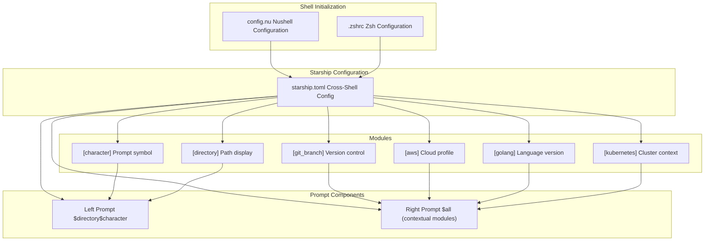
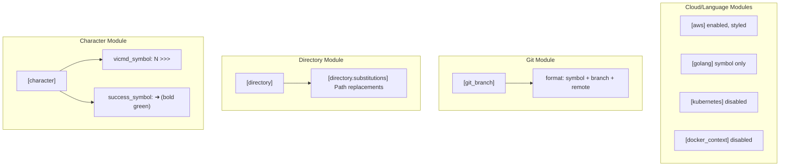
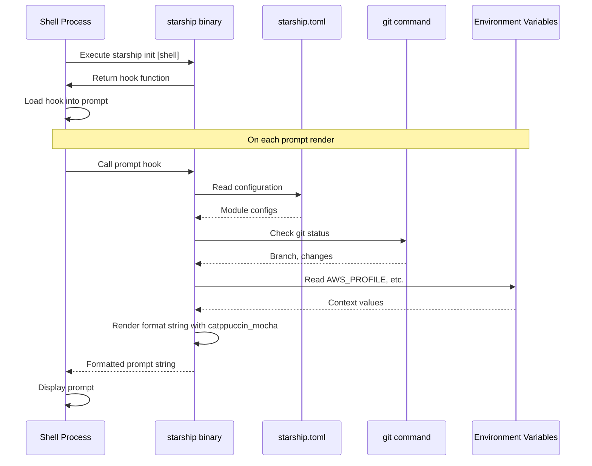

[/](/)

[/search](/search)

[/wiki](/wiki)

[/settings/members](/settings/members)

[/settings/support](/settings/support)

[Add repo](/repositories)

[All repos](/wiki)

[backend](/wiki/Klaudioz/backend)

[BH-Workflow-Engine](/wiki/Klaudioz/BH-Workflow-Engine)

[Buckhead_CRM](/wiki/Klaudioz/Buckhead_CRM)

[dotfiles](/wiki/Klaudioz/dotfiles)

[frontend](/wiki/Klaudioz/frontend)

[godeep.wiki-jb](/wiki/Klaudioz/godeep.wiki-jb)

[pi-mono-zero](/wiki/Klaudioz/pi-mono-zero)

[VirtualOracle](/wiki/Klaudioz/VirtualOracle)

# Starship PromptLink copied!

> **Relevant source files**
> * [starship/starship.toml](https://github.com/Klaudioz/dotfiles/blob/2febda55/starship/starship.toml)

## Purpose and ScopeLink copied!

This document describes the Starship prompt configuration used across both Nushell and Zsh shells in this dotfiles repository. Starship provides a minimal, informative, cross-shell prompt with a consistent appearance and behavior. The configuration defines prompt layout, module behaviors, color theming, and integration points with development tools like Git, AWS, Golang, and Kubernetes.

For shell-specific configuration details, see [Nushell Setup](#3.2.1) and [Zsh Setup](#3.2.2). For the overall terminal environment architecture, see [Terminal Environment](#3).

---

## Configuration OverviewLink copied!

Starship is configured through a single TOML file that applies consistently across both shells. The configuration follows a split-prompt design with minimal left-side information and comprehensive right-side context.



**Sources:** [starship/starship.toml L1-L67](https://github.com/Klaudioz/dotfiles/blob/2febda55/starship/starship.toml#L1-L67)

---

## Prompt Format StructureLink copied!

The prompt uses a split layout design where the left side shows essential navigation context while the right side displays tool-specific information.

### Left Prompt ConfigurationLink copied!

The left prompt displays only the current directory and command prompt character, creating a clean and minimal appearance:

| Component | Variable | Description |
| --- | --- | --- |
| Directory | `$directory` | Current working directory path |
| Character | `$character` | Prompt symbol (changes with vi mode) |

The format is defined at [starship/starship.toml L3](https://github.com/Klaudioz/dotfiles/blob/2febda55/starship/starship.toml#L3-L3)

 as `format = """$directory$character"""`.

### Right Prompt ConfigurationLink copied!

The right prompt contains all contextual modules using the special `$all` variable, which includes Git status, language versions, cloud profiles, and other context-aware information. This is defined at [starship/starship.toml L6](https://github.com/Klaudioz/dotfiles/blob/2febda55/starship/starship.toml#L6-L6)

 as `right_format = """$all"""`.

### Global SettingsLink copied!

| Setting | Value | Purpose |
| --- | --- | --- |
| `add_newline` | `false` | Removes extra newline before prompt |
| `command_timeout` | `1000` | Maximum milliseconds for command execution |
| `palette` | `catppuccin_mocha` | Color scheme applied to all modules |

**Sources:** [starship/starship.toml L1-L7](https://github.com/Klaudioz/dotfiles/blob/2febda55/starship/starship.toml#L1-L7)

---

## Module ConfigurationsLink copied!

Starship's behavior is controlled through module configurations, each prefixed with brackets (e.g., `[character]`, `[git_branch]`). Modules can be enabled, disabled, or customized with specific formatting.



### Character ModuleLink copied!

The character module defines the prompt symbol that appears at the end of the left prompt:

* **Normal Mode Symbol**: `[N] >>>` when in vi command mode
* **Success Symbol**: `➜` (bold green) after successful command execution

**Sources:** [starship/starship.toml L9-L11](https://github.com/Klaudioz/dotfiles/blob/2febda55/starship/starship.toml#L9-L11)

### Directory ModuleLink copied!

The directory module handles path display with custom substitutions:

```
[directory.substitutions]'~/tests/starship-custom' = 'work-project'
```

This replaces specific paths with shorter aliases, useful for frequently-accessed project directories.

**Sources:** [starship/starship.toml L13-L14](https://github.com/Klaudioz/dotfiles/blob/2febda55/starship/starship.toml#L13-L14)

### Git Branch ModuleLink copied!

Displays current Git branch with remote branch information:

```xml
[git_branch]format = '<FileRef file-url="https://github.com/Klaudioz/dotfiles/blob/2febda55/$symbol$branch(#LNaN-LNaN" NaN  file-path="$symbol$branch(">Hii</FileRef>'
```

The format shows:

* Git symbol (`$symbol`)
* Local branch name (`$branch`)
* Remote branch name if different (`:$remote_branch`)

**Sources:** [starship/starship.toml L16-L17](https://github.com/Klaudioz/dotfiles/blob/2febda55/starship/starship.toml#L16-L17)

### AWS ModuleLink copied!

Displays AWS profile and region information for cloud development contexts:

| Configuration | Value | Purpose |
| --- | --- | --- |
| `format` | `<FileRef file-url="https://github.com/Klaudioz/dotfiles/blob/2febda55/$symbol(profile#LNaN-LNaN" NaN  file-path="$symbol(profile">Hii</FileRef>` | Shows profile and region |
| `disabled` | `false` | Module is active |
| `style` | `bold blue` | Color styling |
| `symbol` | `` | AWS cloud icon |

This module appears when AWS credentials are active in the environment.

**Sources:** [starship/starship.toml L19-L23](https://github.com/Klaudioz/dotfiles/blob/2febda55/starship/starship.toml#L19-L23)

### Golang ModuleLink copied!

A simplified module showing only the Go language icon:

```xml
[golang]format = '<FileRef file-url="https://github.com/Klaudioz/dotfiles/blob/2febda55/ " undefined  file-path=" ">Hii</FileRef>'
```

This displays when in a directory containing Go files, providing quick visual confirmation of the project language.

**Sources:** [starship/starship.toml L25-L26](https://github.com/Klaudioz/dotfiles/blob/2febda55/starship/starship.toml#L25-L26)

### Kubernetes ModuleLink copied!

The Kubernetes module is disabled by default but configured with context-aware patterns:

```xml
[kubernetes]symbol = '☸ 'disabled = truedetect_files = ['Dockerfile']format = '<FileRef file-url="https://github.com/Klaudioz/dotfiles/blob/2febda55/$symbol$context( \\($namespace\\))" undefined  file-path="$symbol$context( \\($namespace\\))">Hii</FileRef> 'contexts = [  { context_pattern = "arn:aws:eks:us-west-2:577926974532:cluster/zd-pvc-omer",     style = "green",     context_alias = "omerxx",     symbol = " " },]
```

When enabled, it detects Kubernetes contexts based on `Dockerfile` presence and applies custom styling for specific EKS clusters.

**Sources:** [starship/starship.toml L28-L35](https://github.com/Klaudioz/dotfiles/blob/2febda55/starship/starship.toml#L28-L35)

### Docker Context ModuleLink copied!

The Docker context module is disabled to reduce prompt clutter:

```
[docker_context]disabled = true
```

**Sources:** [starship/starship.toml L37-L38](https://github.com/Klaudioz/dotfiles/blob/2febda55/starship/starship.toml#L37-L38)

---

## Color PaletteLink copied!

The configuration uses the Catppuccin Mocha color palette, a popular theme designed for reduced eye strain with warm colors on a dark background. The palette is defined at [starship/starship.toml L40-L66](https://github.com/Klaudioz/dotfiles/blob/2febda55/starship/starship.toml#L40-L66)

 under `[palettes.catppuccin_mocha]`.

### Color Reference TableLink copied!

| Color Name | Hex Value | Usage Context |
| --- | --- | --- |
| `rosewater` | `#f5e0dc` | Subtle accents |
| `flamingo` | `#f2cdcd` | Light accents |
| `pink` | `#f5c2e7` | Highlights |
| `mauve` | `#cba6f7` | Primary accent |
| `red` | `#f38ba8` | Errors, warnings |
| `maroon` | `#eba0ac` | Secondary errors |
| `peach` | `#fab387` | Important information |
| `yellow` | `#f9e2af` | Warnings |
| `green` | `#a6e3a1` | Success, additions |
| `teal` | `#94e2d5` | Info |
| `sky` | `#89dceb` | Info variation |
| `sapphire` | `#74c7ec` | Accents |
| `blue` | `#89b4fa` | Primary information |
| `lavender` | `#b4befe` | Subtle information |
| `text` | `#cdd6f4` | Primary text |
| `subtext1` | `#bac2de` | Secondary text |
| `subtext0` | `#a6adc8` | Tertiary text |
| `overlay2` | `#9399b2` | UI elements |
| `overlay1` | `#7f849c` | UI elements |
| `overlay0` | `#6c7086` | UI elements |
| `surface2` | `#585b70` | Backgrounds |
| `surface1` | `#45475a` | Backgrounds |
| `surface0` | `#313244` | Backgrounds |
| `base` | `#1e1e2e` | Primary background |
| `mantle` | `#181825` | Secondary background |
| `crust` | `#11111b` | Darkest background |

These colors are automatically applied to module styles throughout the prompt based on semantic meaning (e.g., `green` for success symbols, `blue` for AWS information).

**Sources:** [starship/starship.toml L40-L66](https://github.com/Klaudioz/dotfiles/blob/2febda55/starship/starship.toml#L40-L66)

---

## Shell IntegrationLink copied!

Starship integrates with shells through initialization commands that hook into the shell's prompt rendering mechanism. The configuration file location is automatically detected by Starship based on XDG conventions.



### Nushell IntegrationLink copied!

Nushell loads Starship in its environment configuration. The initialization happens early in the shell startup process, making Starship's prompt available immediately.

**Related Configuration:** See [Nushell Setup](#3.2.1) for details on Starship initialization in `config.nu`.

### Zsh IntegrationLink copied!

Zsh similarly initializes Starship through an `eval` statement that sets up the `PROMPT` variable to call Starship on each command execution.

**Related Configuration:** See [Zsh Setup](#3.2.2) for details on Starship initialization in `.zshrc`.

**Sources:** [starship/starship.toml L1-L67](https://github.com/Klaudioz/dotfiles/blob/2febda55/starship/starship.toml#L1-L67)

---

## Configuration File LocationLink copied!

The Starship configuration file is located at:

```
~/.config/starship/starship.toml
```

This follows XDG Base Directory specifications and is automatically detected by Starship. When deployed via `stow`, the file is symlinked from the repository to this location. When deployed via `nix-darwin`, the configuration is managed declaratively.

**Sources:** [starship/starship.toml L1-L67](https://github.com/Klaudioz/dotfiles/blob/2febda55/starship/starship.toml#L1-L67)

---

## Module Detection BehaviorLink copied!

Starship modules are context-aware and only appear when relevant. This table summarizes detection behavior:

| Module | Appears When | Configuration |
| --- | --- | --- |
| `character` | Always | Character symbols change with vi mode |
| `directory` | Always | Shows current working directory |
| `git_branch` | Inside git repository | Format includes remote branch |
| `aws` | `AWS_PROFILE` set in environment | Enabled by default |
| `golang` | `.go` files present | Symbol-only display |
| `kubernetes` | Disabled | Would detect via `Dockerfile` if enabled |
| `docker_context` | Disabled | N/A |

This selective display keeps the prompt clean while providing relevant contextual information when needed.

**Sources:** [starship/starship.toml L19-L38](https://github.com/Klaudioz/dotfiles/blob/2febda55/starship/starship.toml#L19-L38)

---

## Performance ConsiderationsLink copied!

The configuration includes a `command_timeout` setting of 1000 milliseconds at [starship/starship.toml L7](https://github.com/Klaudioz/dotfiles/blob/2febda55/starship/starship.toml#L7-L7)

 This prevents slow-responding modules (like network-dependent AWS or Kubernetes queries) from blocking prompt rendering. If a module exceeds this timeout, it will be skipped for that prompt render.

The minimal left prompt design (`$directory$character`) ensures fast initial display, while the right prompt with `$all` modules renders contextual information without blocking user input.

**Sources:** [starship/starship.toml L7](https://github.com/Klaudioz/dotfiles/blob/2febda55/starship/starship.toml#L7-L7)

Refresh this wiki

Last indexed: 18 December 2025 ([2febda](https://github.com/Klaudioz/dotfiles/commit/2febda55))

### On this page

* [Starship Prompt](#3.3-starship-prompt)
* [Purpose and Scope](#3.3-purpose-and-scope)
* [Configuration Overview](#3.3-configuration-overview)
* [Prompt Format Structure](#3.3-prompt-format-structure)
* [Left Prompt Configuration](#3.3-left-prompt-configuration)
* [Right Prompt Configuration](#3.3-right-prompt-configuration)
* [Global Settings](#3.3-global-settings)
* [Module Configurations](#3.3-module-configurations)
* [Character Module](#3.3-character-module)
* [Directory Module](#3.3-directory-module)
* [Git Branch Module](#3.3-git-branch-module)
* [AWS Module](#3.3-aws-module)
* [Golang Module](#3.3-golang-module)
* [Kubernetes Module](#3.3-kubernetes-module)
* [Docker Context Module](#3.3-docker-context-module)
* [Color Palette](#3.3-color-palette)
* [Color Reference Table](#3.3-color-reference-table)
* [Shell Integration](#3.3-shell-integration)
* [Nushell Integration](#3.3-nushell-integration)
* [Zsh Integration](#3.3-zsh-integration)
* [Configuration File Location](#3.3-configuration-file-location)
* [Module Detection Behavior](#3.3-module-detection-behavior)
* [Performance Considerations](#3.3-performance-considerations)

Ask Devin about dotfiles

  

Syntax error in text

mermaid version 11.4.1

Syntax error in text

mermaid version 11.4.1