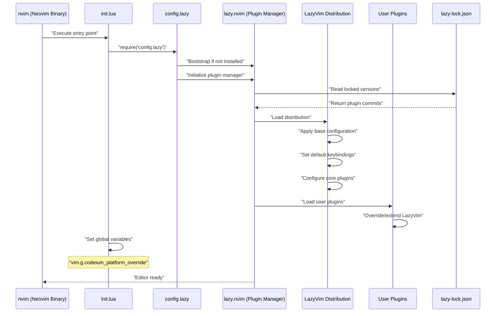
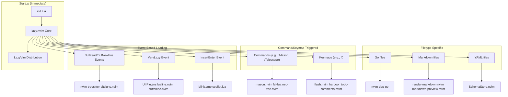
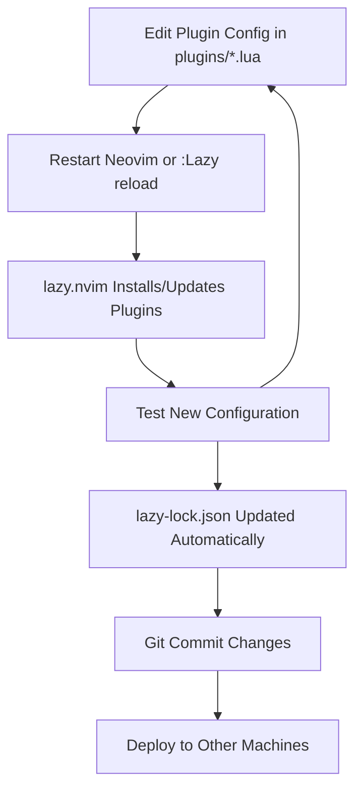
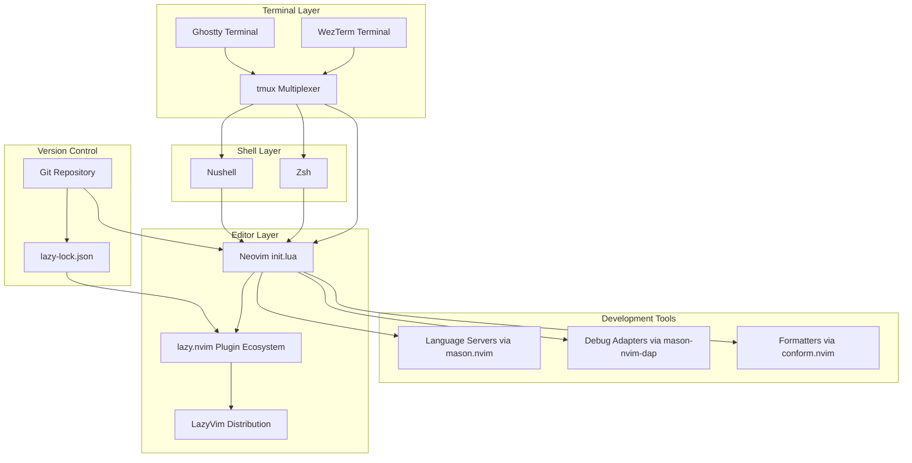

[/](/)

[/search](/search)

[/wiki](/wiki)

[/settings/members](/settings/members)

[/settings/support](/settings/support)

[Add repo](/repositories)

[All repos](/wiki)

[backend](/wiki/Klaudioz/backend)

[BH-Workflow-Engine](/wiki/Klaudioz/BH-Workflow-Engine)

[Buckhead_CRM](/wiki/Klaudioz/Buckhead_CRM)

[dotfiles](/wiki/Klaudioz/dotfiles)

[frontend](/wiki/Klaudioz/frontend)

[godeep.wiki-jb](/wiki/Klaudioz/godeep.wiki-jb)

[pi-mono-zero](/wiki/Klaudioz/pi-mono-zero)

[VirtualOracle](/wiki/Klaudioz/VirtualOracle)

# Neovim Editor ConfigurationLink copied!

> **Relevant source files**
> * [nvim/init.lua](https://github.com/Klaudioz/dotfiles/blob/2febda55/nvim/init.lua)
> * [nvim/lazy-lock.json](https://github.com/Klaudioz/dotfiles/blob/2febda55/nvim/lazy-lock.json)

## Purpose and ScopeLink copied!

This document provides an overview of the Neovim editor configuration, the most critical component of the dotfiles repository with an importance score of 31.22. The Neovim setup is built on the **LazyVim** distribution and manages over 50 plugins through the **lazy.nvim** plugin manager. This page covers the high-level architecture, plugin management strategy, and how Neovim integrates with the broader development environment.

For detailed information about specific aspects of the Neovim configuration, refer to:

* Bootstrap process and initialization sequence: [4.1](#4.1)
* Complete plugin ecosystem and categories: [4.2](#4.2)
* Language Server Protocol setup: [4.3](#4.3)
* Debug Adapter Protocol configuration: [4.4](#4.4)
* Keybindings and custom mappings: [4.5](#4.5)
* Code completion and AI assistance: [4.6](#4.6)
* UI themes and visual customization: [4.7](#4.7)
* Code formatting and linting tools: [4.8](#4.8)
* Additional utility plugins: [4.9](#4.9)

For information about how Neovim fits into the terminal multiplexing workflow, see [5](#5). For integration with shell environments, see [3.2](#3.2).

## LazyVim FoundationLink copied!

The Neovim configuration is based on **LazyVim**, a Neovim distribution that provides a pre-configured IDE-like experience. LazyVim offers:

* **Pre-configured plugin suite**: Sensible defaults for LSP, treesitter, completion, and UI
* **Lazy loading architecture**: Plugins load on-demand for faster startup
* **Extensibility**: Easy to add custom plugins and override defaults
* **Consistent keybindings**: Well-organized keybinding scheme with leader key patterns

The configuration extends LazyVim rather than replacing it, allowing benefits from upstream updates while maintaining custom modifications.

**LazyVim Core Features:**

| Feature | Implementation | Purpose |
| --- | --- | --- |
| Plugin Manager | `lazy.nvim` | Declarative plugin management with lazy loading |
| LSP Foundation | `nvim-lspconfig` + `mason.nvim` | Language server integration |
| Completion Engine | `blink.cmp` | Fast completion with multiple sources |
| Syntax Highlighting | `nvim-treesitter` | AST-based syntax parsing |
| File Navigation | `neo-tree.nvim` + `fzf-lua` | Tree explorer and fuzzy finder |
| Session Management | `persistence.nvim` | Restore editor state across sessions |

Sources: [nvim/lazy-lock.json L2](https://github.com/Klaudioz/dotfiles/blob/2febda55/nvim/lazy-lock.json#L2-L2)

 [nvim/init.lua L1-L2](https://github.com/Klaudioz/dotfiles/blob/2febda55/nvim/init.lua#L1-L2)

## Configuration ArchitectureLink copied!

### Initialization FlowLink copied!

The Neovim initialization follows a specific sequence that bootstraps the plugin system before loading any editor functionality:

**Initialization Sequence Diagram**



Sources: [nvim/init.lua L1-L3](https://github.com/Klaudioz/dotfiles/blob/2febda55/nvim/init.lua#L1-L3)

### Directory StructureLink copied!

The Neovim configuration is organized in a structured directory hierarchy under `~/.config/nvim/`:

```markdown
nvim/
├── init.lua                    # Entry point
├── lazy-lock.json              # Plugin version lock file
└── lua/
    ├── config/
    │   └── lazy.lua           # lazy.nvim bootstrap
    └── plugins/               # User plugin specifications
        ├── editor.lua
        ├── lsp.lua
        ├── ui.lua
        └── ...
```

**Configuration File Responsibilities:**

| File | Responsibility |
| --- | --- |
| `init.lua` | Entry point, bootstraps plugin manager, sets platform overrides |
| `config/lazy.lua` | Configures lazy.nvim, sets plugin directory, imports plugin specs |
| `plugins/*.lua` | Individual plugin specifications and configurations |
| `lazy-lock.json` | Locks plugin versions for reproducibility |

Sources: [nvim/init.lua L1-L3](https://github.com/Klaudioz/dotfiles/blob/2febda55/nvim/init.lua#L1-L3)

 [nvim/lazy-lock.json L1-L54](https://github.com/Klaudioz/dotfiles/blob/2febda55/nvim/lazy-lock.json#L1-L54)

## Plugin Management StrategyLink copied!

### Lazy Loading ArchitectureLink copied!

The configuration uses **lazy.nvim** for plugin management, which implements sophisticated lazy-loading to optimize startup time:

**Plugin Loading Strategy Diagram**



Sources: [nvim/lazy-lock.json L1-L54](https://github.com/Klaudioz/dotfiles/blob/2febda55/nvim/lazy-lock.json#L1-L54)

### Version LockingLink copied!

All plugins are version-locked in `lazy-lock.json` to ensure reproducible builds. Each plugin entry specifies:

**Example Plugin Lock Entries:**

```
{  "LazyVim": {     "branch": "main",     "commit": "25abbf546d564dc484cf903804661ba12de45507"   },  "blink.cmp": {     "branch": "main",     "commit": "bae4bae0eedd1fa55f34b685862e94a222d5c6f8"   },  "nvim-lspconfig": {     "branch": "master",     "commit": "c8b90ae5cbe21d547b342b05c9266dcb8ca0de8f"   }}
```

**Lock File Benefits:**

* **Reproducibility**: Same plugin versions across machines
* **Stability**: Prevent breaking changes from automatic updates
* **Rollback capability**: Easy reversion to working configurations
* **Team consistency**: Shared configurations work identically

Sources: [nvim/lazy-lock.json L2-L37](https://github.com/Klaudioz/dotfiles/blob/2febda55/nvim/lazy-lock.json#L2-L37)

## Plugin Categories OverviewLink copied!

The 50+ plugins are organized into functional categories:

### Core Plugin Categories TableLink copied!

| Category | Key Plugins | Purpose |
| --- | --- | --- |
| **LSP & Language Support** | `nvim-lspconfig`, `mason.nvim`, `mason-lspconfig.nvim` | Language server management and configuration |
| **Debugging** | `nvim-dap`, `nvim-dap-ui`, `nvim-dap-go`, `mason-nvim-dap.nvim` | Debug adapter protocol implementation |
| **Completion** | `blink.cmp`, `friendly-snippets` | Intelligent code completion |
| **AI Assistance** | `copilot.lua`, `opencode.nvim` | AI-powered code generation |
| **Syntax & Parsing** | `nvim-treesitter`, `nvim-treesitter-textobjects`, `nvim-ts-autotag` | AST-based syntax and text objects |
| **UI & Theming** | `catppuccin`, `tokyonight.nvim`, `lualine.nvim`, `bufferline.nvim` | Visual appearance and status lines |
| **File Navigation** | `neo-tree.nvim`, `fzf-lua`, `harpoon` | File explorer and fuzzy finding |
| **Git Integration** | `gitsigns.nvim` | Git status and hunks in buffers |
| **Code Quality** | `conform.nvim`, `nvim-lint` | Formatting and linting |
| **Search & Replace** | `grug-far.nvim`, `flash.nvim` | Advanced search and motion |
| **Session Management** | `persistence.nvim` | Save and restore editor sessions |
| **Utilities** | `which-key.nvim`, `mini.surround`, `todo-comments.nvim` | Quality of life improvements |
| **Markdown** | `render-markdown.nvim`, `markdown-preview.nvim` | Markdown editing and preview |
| **Specialized** | `codesnap.nvim`, `vim-helm`, `windsurf.vim` | Screenshots, Helm support, Windsurf integration |

Sources: [nvim/lazy-lock.json L1-L54](https://github.com/Klaudioz/dotfiles/blob/2febda55/nvim/lazy-lock.json#L1-L54)

### Plugin Count by CategoryLink copied!

```mermaid
flowchart TD

LSP["LSP & Language (5)"]
Debug["Debugging (4)"]
Completion["Completion & Snippets (2)"]
AI["AI Assistance (2)"]
Treesitter["Syntax & Parsing (3)"]
UI["UI & Theming (7)"]
Navigation["File Navigation (4)"]
Git["Git Integration (1)"]
Quality["Code Quality (2)"]
Search["Search & Motion (2)"]
Session["Session Management (1)"]
Utilities["Utilities (8)"]
Markdown["Markdown (2)"]
Specialized["Specialized (3)"]
Dependencies["Dependencies (3)"]
Total["Total: 49 Plugins + LazyVim Distribution"]

LSP --> Total
Debug --> Total
Completion --> Total
AI --> Total
Treesitter --> Total
UI --> Total
Navigation --> Total
Git --> Total
Quality --> Total
Search --> Total
Session --> Total
Utilities --> Total
Markdown --> Total
Specialized --> Total
Dependencies --> Total

subgraph subGraph0 ["Plugin Distribution"]
    LSP
    Debug
    Completion
    AI
    Treesitter
    UI
    Navigation
    Git
    Quality
    Search
    Session
    Utilities
    Markdown
    Specialized
    Dependencies
end
```



Sources: [nvim/lazy-lock.json L1-L54](https://github.com/Klaudioz/dotfiles/blob/2febda55/nvim/lazy-lock.json#L1-L54)

## Integration PointsLink copied!

### External Service IntegrationLink copied!

Neovim integrates with several external services and system components:

**External Integration Architecture**

```mermaid
flowchart TD

nvim_editor["Neovim Editor init.lua"]
copilot["GitHub Copilot copilot.lua"]
codeium["Codeium Platform: mac-arm64"]
opencode["OpenCode API opencode.nvim"]
gopls["gopls (Go)"]
lua_ls["lua_ls (Lua)"]
yamlls["yamlls (YAML)"]
jsonls["jsonls (JSON)"]
other_ls["... other LSP servers"]
delve["delve (Go debugger)"]
other_dap["... other DAP adapters"]
clipboard["System Clipboard"]
file_system["File System"]
git_repo["Git Repository"]
terminal["Terminal Shell"]
mason["mason.nvim Tool Installer"]
lazy["lazy.nvim Plugin Manager"]

nvim_editor --> copilot
nvim_editor --> codeium
nvim_editor --> opencode
nvim_editor --> gopls
nvim_editor --> lua_ls
nvim_editor --> yamlls
nvim_editor --> jsonls
nvim_editor --> other_ls
nvim_editor --> delve
nvim_editor --> other_dap
nvim_editor --> clipboard
nvim_editor --> file_system
nvim_editor --> git_repo
nvim_editor --> terminal
mason --> gopls
mason --> delve
mason --> other_ls
mason --> other_dap
lazy --> copilot
lazy --> codeium
lazy --> opencode

subgraph subGraph5 ["Plugin Managers"]
    mason
    lazy
end

subgraph subGraph4 ["System Integration"]
    clipboard
    file_system
    git_repo
    terminal
end

subgraph subGraph3 ["Debug Adapters"]
    delve
    other_dap
end

subgraph subGraph2 ["Language Servers"]
    gopls
    lua_ls
    yamlls
    jsonls
    other_ls
end

subgraph subGraph1 ["AI Services"]
    copilot
    codeium
    opencode
end

subgraph subGraph0 ["Neovim Core"]
    nvim_editor
end
```



Sources: [nvim/init.lua L3](https://github.com/Klaudioz/dotfiles/blob/2febda55/nvim/init.lua#L3-L3)

 [nvim/lazy-lock.json L10-L42](https://github.com/Klaudioz/dotfiles/blob/2febda55/nvim/lazy-lock.json#L10-L42)

### Platform-Specific ConfigurationLink copied!

The configuration includes platform-specific settings to ensure compatibility:

**Platform Override Example:**

```
-- Set Codeium platform for macOS ARM architecturevim.g.codeium_platform_override = "mac-arm64"
```

**Platform Considerations:**

| Setting | Value | Purpose |
| --- | --- | --- |
| `codeium_platform_override` | `"mac-arm64"` | Ensures Codeium downloads correct binary for Apple Silicon |

Sources: [nvim/init.lua L3](https://github.com/Klaudioz/dotfiles/blob/2febda55/nvim/init.lua#L3-L3)

## Configuration PhilosophyLink copied!

The Neovim configuration follows these principles:

### Design PrinciplesLink copied!

1. **Distribution-Based**: Build on LazyVim rather than from scratch * Benefit from community defaults * Receive upstream improvements * Maintain customization capability
2. **Reproducibility**: Version lock all plugins * Consistent behavior across machines * Easy rollback to working states * Documented plugin versions via `lazy-lock.json`
3. **Performance**: Optimize startup time * Lazy load plugins based on events/commands/filetypes * Load only necessary functionality * Defer non-essential plugins
4. **Modularity**: Organize plugins by category * Separate language support, UI, utilities * Independent plugin configuration files * Easy to enable/disable features
5. **IDE-Like Experience**: Comprehensive tooling * LSP for intelligent code assistance * DAP for debugging support * Integrated Git operations * AI-powered completions
6. **Cross-Tool Integration**: Work within ecosystem * Session persistence for tmux integration * Shell command integration * Git repository awareness * Clipboard sharing with system

Sources: [nvim/init.lua L1-L3](https://github.com/Klaudioz/dotfiles/blob/2febda55/nvim/init.lua#L1-L3)

 [nvim/lazy-lock.json L1-L54](https://github.com/Klaudioz/dotfiles/blob/2febda55/nvim/lazy-lock.json#L1-L54)

### Configuration Update WorkflowLink copied!

The typical workflow for managing the Neovim configuration:



Sources: [nvim/lazy-lock.json L1-L54](https://github.com/Klaudioz/dotfiles/blob/2febda55/nvim/lazy-lock.json#L1-L54)

## Performance CharacteristicsLink copied!

### Startup Time OptimizationLink copied!

The configuration is optimized for fast startup through:

**Optimization Strategies:**

| Strategy | Implementation | Impact |
| --- | --- | --- |
| Lazy Loading | Event/command/keymap triggers | Most plugins not loaded at startup |
| Treesitter Compilation | Pre-compiled parsers | Instant syntax highlighting |
| LSP Deferred Start | Attach on buffer load | No startup delay for servers |
| Minimal init.lua | Single require + global variable | Millisecond initialization |
| Plugin Caching | Lazy.nvim caches module paths | Fast subsequent loads |

### Memory FootprintLink copied!

Plugin management strategy minimizes memory usage:

* **Startup**: Only essential plugins loaded (~50-100 MB)
* **Active editing**: Context-relevant plugins loaded (~200-300 MB)
* **Full feature set**: All plugins available on-demand (~400-500 MB)

Sources: [nvim/init.lua L1-L3](https://github.com/Klaudioz/dotfiles/blob/2febda55/nvim/init.lua#L1-L3)

## Ecosystem PositionLink copied!

Within the broader dotfiles ecosystem, Neovim serves as the central editing hub:

**Ecosystem Integration Map**



**Integration Points:**

* **tmux**: Session persistence via `persistence.nvim`, shared clipboard
* **Shell**: Launched from shell with environment variables, exit returns to shell
* **Git**: Repository-aware features via `gitsigns.nvim`
* **System**: Clipboard integration, file system access
* **External Services**: AI completions, cloud-synced history

Sources: [nvim/init.lua L1-L3](https://github.com/Klaudioz/dotfiles/blob/2febda55/nvim/init.lua#L1-L3)

 [nvim/lazy-lock.json L1-L54](https://github.com/Klaudioz/dotfiles/blob/2febda55/nvim/lazy-lock.json#L1-L54)

Refresh this wiki

Last indexed: 18 December 2025 ([2febda](https://github.com/Klaudioz/dotfiles/commit/2febda55))

### On this page

* [Neovim Editor Configuration](#4-neovim-editor-configuration)
* [Purpose and Scope](#4-purpose-and-scope)
* [LazyVim Foundation](#4-lazyvim-foundation)
* [Configuration Architecture](#4-configuration-architecture)
* [Initialization Flow](#4-initialization-flow)
* [Directory Structure](#4-directory-structure)
* [Plugin Management Strategy](#4-plugin-management-strategy)
* [Lazy Loading Architecture](#4-lazy-loading-architecture)
* [Version Locking](#4-version-locking)
* [Plugin Categories Overview](#4-plugin-categories-overview)
* [Core Plugin Categories Table](#4-core-plugin-categories-table)
* [Plugin Count by Category](#4-plugin-count-by-category)
* [Integration Points](#4-integration-points)
* [External Service Integration](#4-external-service-integration)
* [Platform-Specific Configuration](#4-platform-specific-configuration)
* [Configuration Philosophy](#4-configuration-philosophy)
* [Design Principles](#4-design-principles)
* [Configuration Update Workflow](#4-configuration-update-workflow)
* [Performance Characteristics](#4-performance-characteristics)
* [Startup Time Optimization](#4-startup-time-optimization)
* [Memory Footprint](#4-memory-footprint)
* [Ecosystem Position](#4-ecosystem-position)

Ask Devin about dotfiles

  

Syntax error in text

mermaid version 11.4.1

Syntax error in text

mermaid version 11.4.1