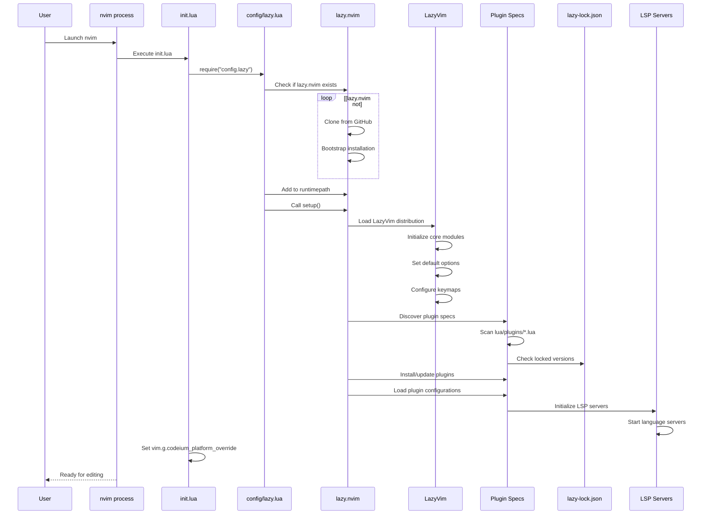
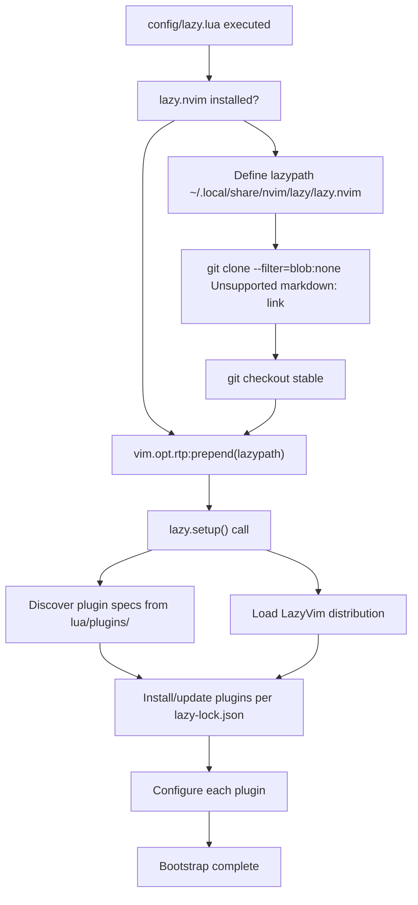
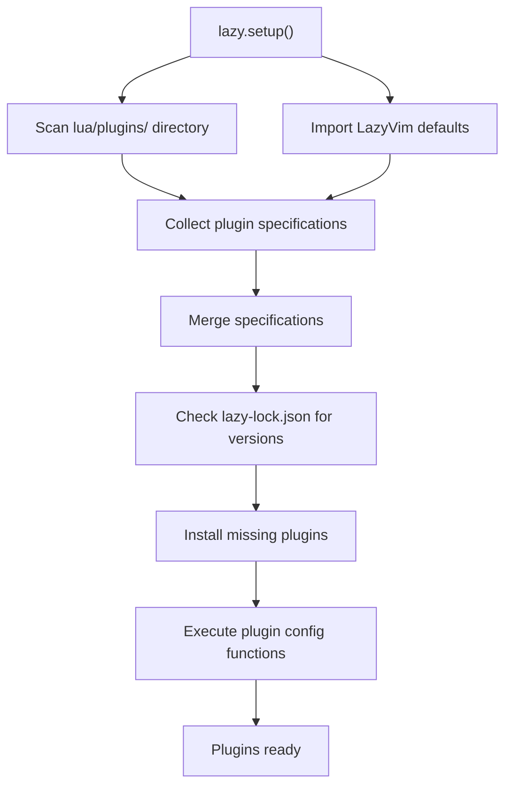
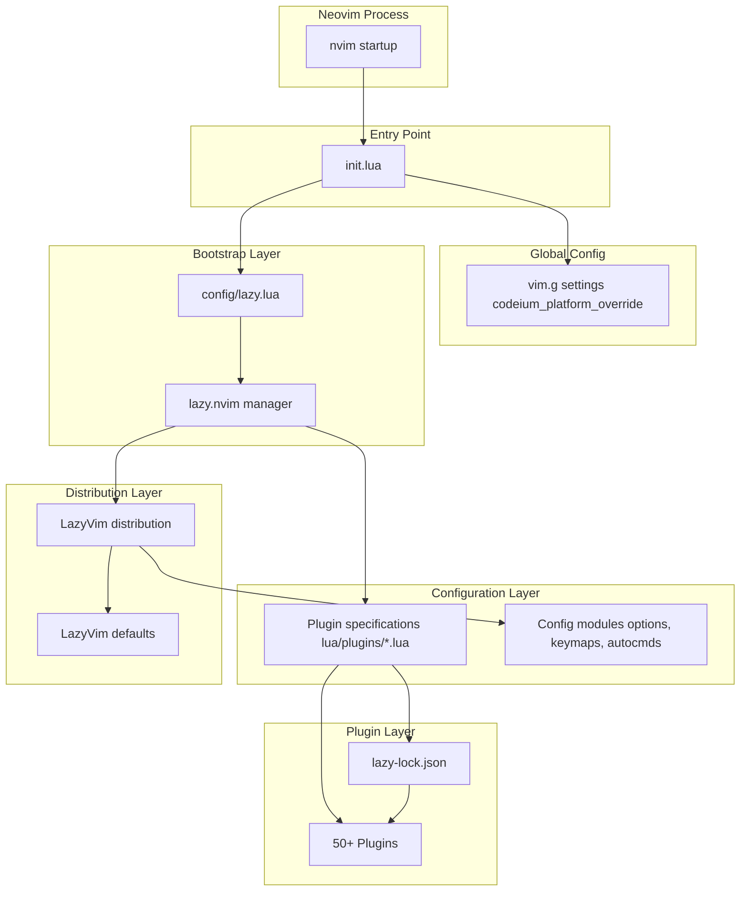

[/](/)

[/search](/search)

[/wiki](/wiki)

[/settings/members](/settings/members)

[/settings/support](/settings/support)

[Add repo](/repositories)

[All repos](/wiki)

[backend](/wiki/Klaudioz/backend)

[BH-Workflow-Engine](/wiki/Klaudioz/BH-Workflow-Engine)

[Buckhead_CRM](/wiki/Klaudioz/Buckhead_CRM)

[dotfiles](/wiki/Klaudioz/dotfiles)

[frontend](/wiki/Klaudioz/frontend)

[godeep.wiki-jb](/wiki/Klaudioz/godeep.wiki-jb)

[pi-mono-zero](/wiki/Klaudioz/pi-mono-zero)

[VirtualOracle](/wiki/Klaudioz/VirtualOracle)

# Bootstrap and InitializationLink copied!

> **Relevant source files**
> * [nvim/init.lua](https://github.com/Klaudioz/dotfiles/blob/2febda55/nvim/init.lua)

## Purpose and ScopeLink copied!

This document explains the Neovim initialization and bootstrap process, detailing how the editor starts up, loads its plugin manager, and prepares the development environment. This covers the entry point configuration, the lazy.nvim bootstrapping mechanism, LazyVim distribution loading, and global variable setup that occurs before any plugins or LSP servers initialize.

For information about the plugins that get loaded after bootstrap, see [Plugin Ecosystem](#4.2). For LSP server initialization details, see [Language Server Protocol (LSP)](#4.3). For the overall Neovim configuration architecture, see [Neovim Editor Configuration](#4).

## Entry Point ArchitectureLink copied!

Neovim's initialization begins with the `init.lua` file, which serves as the primary entry point for all configuration. This file has a minimal surface area by design, delegating the heavy lifting to modular configuration files.

### init.lua StructureLink copied!

The entry point consists of two primary operations:

1. **Plugin Manager Bootstrap**: [nvim/init.lua L2](https://github.com/Klaudioz/dotfiles/blob/2febda55/nvim/init.lua#L2-L2)  invokes `require("config.lazy")`, which triggers the lazy.nvim bootstrap process and loads all plugin specifications
2. **Platform Configuration**: [nvim/init.lua L3](https://github.com/Klaudioz/dotfiles/blob/2febda55/nvim/init.lua#L3-L3)  sets `vim.g.codeium_platform_override = "mac-arm64"` to ensure AI completion tools recognize the ARM-based macOS platform

```javascript
-- bootstrap lazy.nvim, LazyVim and your pluginsrequire("config.lazy")vim.g.codeium_platform_override = "mac-arm64"
```

**Sources:** [nvim/init.lua L1-L4](https://github.com/Klaudioz/dotfiles/blob/2febda55/nvim/init.lua#L1-L4)

## Initialization Sequence FlowLink copied!

The following diagram illustrates the complete initialization sequence from Neovim launch to a fully operational editor environment.

**Diagram: Neovim Initialization Sequence**



**Sources:** [nvim/init.lua L1-L4](https://github.com/Klaudioz/dotfiles/blob/2febda55/nvim/init.lua#L1-L4)

## Configuration Module StructureLink copied!

The `config.lazy` module referenced in [nvim/init.lua L2](https://github.com/Klaudioz/dotfiles/blob/2febda55/nvim/init.lua#L2-L2)

 follows a standard structure for lazy.nvim configuration. This module is responsible for bootstrapping the plugin manager and orchestrating the loading of all plugin specifications.

### Expected Directory LayoutLink copied!

```markdown
nvim/
├── init.lua                    # Entry point
├── lazy-lock.json             # Plugin version lock file
└── lua/
    ├── config/
    │   ├── lazy.lua           # lazy.nvim bootstrap
    │   ├── autocmds.lua       # Auto commands
    │   ├── keymaps.lua        # Keybindings
    │   └── options.lua        # Editor options
    └── plugins/
        ├── *.lua              # Plugin specifications
        └── ...
```

**Sources:** [nvim/init.lua L2](https://github.com/Klaudioz/dotfiles/blob/2febda55/nvim/init.lua#L2-L2)

## Lazy.nvim Bootstrap MechanismLink copied!

The bootstrap process for lazy.nvim follows a standard pattern that ensures the plugin manager is available before any plugins are loaded. The process occurs in the `config/lazy.lua` module.

**Diagram: lazy.nvim Bootstrap Process**



**Sources:** [nvim/init.lua L2](https://github.com/Klaudioz/dotfiles/blob/2febda55/nvim/init.lua#L2-L2)

## LazyVim Distribution IntegrationLink copied!

LazyVim is a Neovim configuration distribution built on top of lazy.nvim. It provides a pre-configured set of plugins, keybindings, and sensible defaults that serve as the foundation for this configuration.

### LazyVim Loading ProcessLink copied!

When `lazy.setup()` is called, it loads the LazyVim distribution which:

1. **Initializes Core Modules**: Sets up fundamental Neovim configuration including editor options, autocommands, and core keymaps
2. **Provides Plugin Defaults**: Offers pre-configured plugin specifications that can be extended or overridden
3. **Establishes Conventions**: Defines directory structure conventions and loading patterns
4. **Configures UI Defaults**: Sets up status line, buffer line, and other UI components

The LazyVim distribution is imported as a plugin specification itself, typically with `{ "LazyVim/LazyVim", import = "lazyvim.plugins" }` in the lazy.setup() call.

**Sources:** [nvim/init.lua L1-L2](https://github.com/Klaudioz/dotfiles/blob/2febda55/nvim/init.lua#L1-L2)

## Global Variable ConfigurationLink copied!

After the lazy.nvim bootstrap completes, the initialization process sets global variables that affect plugin behavior. Currently, one critical global variable is configured:

### Codeium Platform OverrideLink copied!

[nvim/init.lua L3](https://github.com/Klaudioz/dotfiles/blob/2febda55/nvim/init.lua#L3-L3)

 sets `vim.g.codeium_platform_override = "mac-arm64"` to explicitly specify the platform architecture for Codeium AI completion integration. This is necessary because:

* **Architecture Detection**: AI completion services need accurate platform information to download correct binaries
* **ARM Support**: Ensures that ARM64-specific binaries are used on Apple Silicon Macs
* **Plugin Compatibility**: Allows Codeium and similar AI tools to function correctly without platform detection failures

This global variable must be set after lazy.nvim initialization but before plugins are loaded, making the init.lua file the appropriate location.

**Sources:** [nvim/init.lua L3](https://github.com/Klaudioz/dotfiles/blob/2febda55/nvim/init.lua#L3-L3)

## Plugin Discovery and LoadingLink copied!

After bootstrap, lazy.nvim discovers and loads plugin specifications through a convention-based approach.

**Diagram: Plugin Discovery Flow**



The plugin discovery process:

| Stage | Action | Location |
| --- | --- | --- |
| Scan | Automatically require all `*.lua` files | `lua/plugins/` directory |
| Import | Load LazyVim default plugins | LazyVim distribution |
| Merge | Combine custom and default specs | lazy.nvim core |
| Lock | Verify versions against lock file | `lazy-lock.json` |
| Install | Download missing plugins | `~/.local/share/nvim/lazy/` |
| Configure | Execute each plugin's config function | Plugin specifications |

**Sources:** [nvim/init.lua L2](https://github.com/Klaudioz/dotfiles/blob/2febda55/nvim/init.lua#L2-L2)

## Bootstrap Performance ConsiderationsLink copied!

The bootstrap process is optimized for fast startup through several mechanisms:

1. **Lazy Loading**: Plugins are loaded on-demand based on file types, commands, or keybindings rather than at startup
2. **Compiled Loader**: lazy.nvim compiles plugin loading into a cached module for faster subsequent startups
3. **Minimal init.lua**: The entry point performs only essential operations, delegating everything else to lazy-loaded modules
4. **Version Locking**: `lazy-lock.json` prevents unnecessary network checks by locking plugin versions

These optimizations ensure that despite loading 50+ plugins (as noted in the high-level architecture), the editor remains responsive and starts quickly.

**Sources:** [nvim/init.lua L1-L4](https://github.com/Klaudioz/dotfiles/blob/2febda55/nvim/init.lua#L1-L4)

## Error Handling During BootstrapLink copied!

The bootstrap process includes error handling at multiple levels:

### Bootstrap Failure RecoveryLink copied!

If lazy.nvim fails to bootstrap:

* The git clone operation includes retry logic
* Failed installations log to `:messages` buffer
* Neovim continues to start with base functionality
* Users can manually run `:Lazy sync` to retry

### Plugin Loading ErrorsLink copied!

If individual plugins fail during initialization:

* lazy.nvim captures errors without crashing
* Failed plugins are marked in the `:Lazy` UI
* Error details are accessible via `:messages`
* Other plugins continue to load normally

**Sources:** [nvim/init.lua L2](https://github.com/Klaudioz/dotfiles/blob/2febda55/nvim/init.lua#L2-L2)

## Initialization SummaryLink copied!

The initialization process can be summarized in this component interaction diagram:

**Diagram: Component Initialization Dependencies**



**Sources:** [nvim/init.lua L1-L4](https://github.com/Klaudioz/dotfiles/blob/2febda55/nvim/init.lua#L1-L4)

## File Path Reference TableLink copied!

| File | Purpose | Loaded By |
| --- | --- | --- |
| `nvim/init.lua` | Entry point | Neovim executable |
| `nvim/lua/config/lazy.lua` | Bootstrap lazy.nvim | init.lua require |
| `nvim/lazy-lock.json` | Plugin version lock | lazy.nvim |
| `nvim/lua/plugins/*.lua` | Plugin specifications | lazy.nvim auto-discovery |
| `nvim/lua/config/options.lua` | Editor options | LazyVim/lazy.nvim |
| `nvim/lua/config/keymaps.lua` | Keybindings | LazyVim/lazy.nvim |
| `nvim/lua/config/autocmds.lua` | Auto commands | LazyVim/lazy.nvim |

**Sources:** [nvim/init.lua L1-L4](https://github.com/Klaudioz/dotfiles/blob/2febda55/nvim/init.lua#L1-L4)

Refresh this wiki

Last indexed: 18 December 2025 ([2febda](https://github.com/Klaudioz/dotfiles/commit/2febda55))

### On this page

* [Bootstrap and Initialization](#4.1-bootstrap-and-initialization)
* [Purpose and Scope](#4.1-purpose-and-scope)
* [Entry Point Architecture](#4.1-entry-point-architecture)
* [init.lua Structure](#4.1-initlua-structure)
* [Initialization Sequence Flow](#4.1-initialization-sequence-flow)
* [Configuration Module Structure](#4.1-configuration-module-structure)
* [Expected Directory Layout](#4.1-expected-directory-layout)
* [Lazy.nvim Bootstrap Mechanism](#4.1-lazynvim-bootstrap-mechanism)
* [LazyVim Distribution Integration](#4.1-lazyvim-distribution-integration)
* [LazyVim Loading Process](#4.1-lazyvim-loading-process)
* [Global Variable Configuration](#4.1-global-variable-configuration)
* [Codeium Platform Override](#4.1-codeium-platform-override)
* [Plugin Discovery and Loading](#4.1-plugin-discovery-and-loading)
* [Bootstrap Performance Considerations](#4.1-bootstrap-performance-considerations)
* [Error Handling During Bootstrap](#4.1-error-handling-during-bootstrap)
* [Bootstrap Failure Recovery](#4.1-bootstrap-failure-recovery)
* [Plugin Loading Errors](#4.1-plugin-loading-errors)
* [Initialization Summary](#4.1-initialization-summary)
* [File Path Reference Table](#4.1-file-path-reference-table)

Ask Devin about dotfiles

  

Syntax error in text

mermaid version 11.4.1

Syntax error in text

mermaid version 11.4.1