[/](/)

[/search](/search)

[/wiki](/wiki)

[/settings/members](/settings/members)

[/settings/support](/settings/support)

[Add repo](/repositories)

[All repos](/wiki)

[backend](/wiki/Klaudioz/backend)

[BH-Workflow-Engine](/wiki/Klaudioz/BH-Workflow-Engine)

[Buckhead_CRM](/wiki/Klaudioz/Buckhead_CRM)

[dotfiles](/wiki/Klaudioz/dotfiles)

[frontend](/wiki/Klaudioz/frontend)

[godeep.wiki-jb](/wiki/Klaudioz/godeep.wiki-jb)

[pi-mono-zero](/wiki/Klaudioz/pi-mono-zero)

[VirtualOracle](/wiki/Klaudioz/VirtualOracle)

# Plugin EcosystemLink copied!

> **Relevant source files**
> * [nvim/lazy-lock.json](https://github.com/Klaudioz/dotfiles/blob/2febda55/nvim/lazy-lock.json)

## Purpose and ScopeLink copied!

This document catalogs the 50+ Neovim plugins managed through `lazy.nvim` within this dotfiles configuration. It details how plugins are version-locked via `lazy-lock.json`, categorizes plugins by functional area, and explains the plugin management workflow. For information about specific plugin configurations and usage, see [Bootstrap and Initialization](#4.1), [LSP Configuration](#4.3), [DAP Configuration](#4.4), [UI Customization](#4.7), and [Code Formatting](#4.8).

---

## Plugin Manager: lazy.nvimLink copied!

The entire plugin ecosystem is managed by **lazy.nvim**, a modern Neovim plugin manager that provides:

* **Lazy loading**: Plugins load on-demand based on events, commands, or file types
* **Version locking**: All plugin versions are locked in `lazy-lock.json`
* **Automatic installation**: Missing plugins are installed on Neovim startup
* **Update management**: Controlled plugin updates with rollback capability
* **Performance optimization**: Minimal startup time through deferred loading

**Sources:** [nvim/lazy-lock.json L17](https://github.com/Klaudioz/dotfiles/blob/2febda55/nvim/lazy-lock.json#L17-L17)

---

## Version Locking SystemLink copied!

All 52 plugins in this configuration are version-locked through `lazy-lock.json`, ensuring reproducible environments across machines. Each entry specifies:

| Field | Purpose | Example |
| --- | --- | --- |
| `branch` | Git branch to track | `"main"` or `"master"` |
| `commit` | Locked commit SHA | `"25abbf546d564dc484cf903804661ba12de45507"` |

This locking mechanism provides:

* **Reproducibility**: Identical plugin versions across installations
* **Stability**: Protection against breaking changes from upstream updates
* **Controlled updates**: Explicit opt-in to plugin updates via `:Lazy sync`
* **Version control**: Lock file is tracked in Git for change history

**Example lock file structure:**

[nvim/lazy-lock.json L1-L54](https://github.com/Klaudioz/dotfiles/blob/2febda55/nvim/lazy-lock.json#L1-L54)

**Sources:** [nvim/lazy-lock.json L1-L54](https://github.com/Klaudioz/dotfiles/blob/2febda55/nvim/lazy-lock.json#L1-L54)

---

## Plugin Categories and ComponentsLink copied!

### LazyVim Distribution FoundationLink copied!

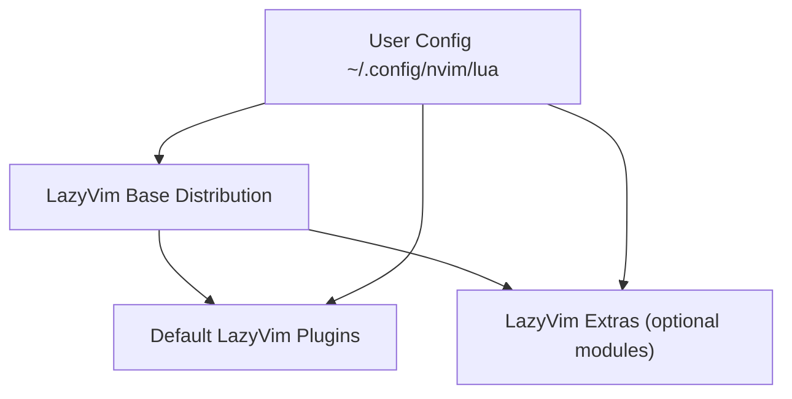

The **LazyVim** plugin (commit `25abbf546d5`) serves as the distribution foundation, providing:

* Preconfigured plugin suite
* Sensible defaults
* Extra modules for language-specific features
* Integration framework for all other plugins

**Sources:** [nvim/lazy-lock.json L2](https://github.com/Klaudioz/dotfiles/blob/2febda55/nvim/lazy-lock.json#L2-L2)

---

### LSP and Language Server ToolingLink copied!

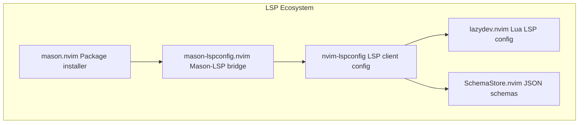

| Plugin | Commit | Purpose |
| --- | --- | --- |
| `mason.nvim` | `fc98833b6d` | Installs and manages LSP servers, formatters, linters |
| `mason-lspconfig.nvim` | `1a31f824b9` | Bridges Mason with nvim-lspconfig |
| `nvim-lspconfig` | `c8b90ae5cb` | Configures LSP client for each language server |
| `lazydev.nvim` | `2367a6c0a0` | Enhanced Lua development with workspace detection |
| `SchemaStore.nvim` | `fb58187b76` | Provides JSON schemas for validation |

**Sources:** [nvim/lazy-lock.json L3-L37](https://github.com/Klaudioz/dotfiles/blob/2febda55/nvim/lazy-lock.json#L3-L37)

---

### Debug Adapter Protocol (DAP) StackLink copied!

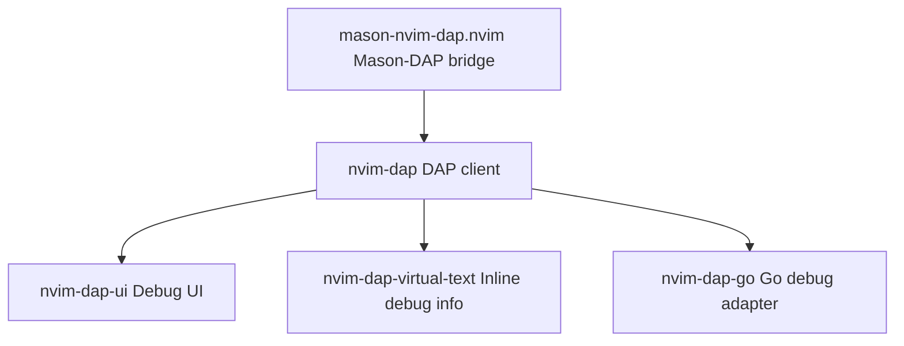

| Plugin | Commit | Purpose |
| --- | --- | --- |
| `nvim-dap` | `7523676a4b` | Core Debug Adapter Protocol client |
| `nvim-dap-ui` | `cf91d5e2d0` | Graphical debugging interface with breakpoints and watches |
| `nvim-dap-virtual-text` | `fbdb48c2ed` | Shows variable values inline during debugging |
| `mason-nvim-dap.nvim` | `86389a3dd6` | Installs debug adapters through Mason |
| `nvim-dap-go` | `b4421153ea` | Go-specific debugging configuration with delve |

**Sources:** [nvim/lazy-lock.json L22-L35](https://github.com/Klaudioz/dotfiles/blob/2febda55/nvim/lazy-lock.json#L22-L35)

---

### Code Intelligence and Completion StackLink copied!

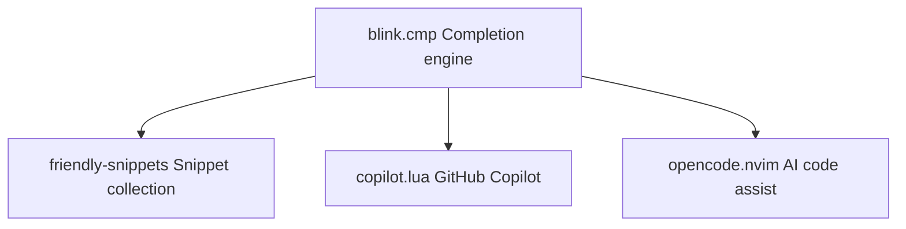

| Plugin | Commit | Purpose |
| --- | --- | --- |
| `blink.cmp` | `bae4bae0ee` | High-performance completion engine with fuzzy matching |
| `copilot.lua` | `81d289a8ce` | GitHub Copilot integration for AI-powered suggestions |
| `opencode.nvim` | `a72e936eda` | Additional AI coding assistant integration |
| `friendly-snippets` | `572f5660cf` | Collection of pre-built snippets for various languages |

**Sources:** [nvim/lazy-lock.json L5-L42](https://github.com/Klaudioz/dotfiles/blob/2febda55/nvim/lazy-lock.json#L5-L42)

---

### Code Quality ToolsLink copied!

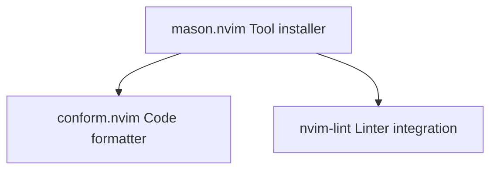

| Plugin | Commit | Purpose |
| --- | --- | --- |
| `conform.nvim` | `b4aab989db` | Unified code formatting with multiple formatter support |
| `nvim-lint` | `f126af5345` | Asynchronous linting with multiple linter support |

Both plugins integrate with `mason.nvim` to automatically install required formatters and linters.

**Sources:** [nvim/lazy-lock.json L9-L36](https://github.com/Klaudioz/dotfiles/blob/2febda55/nvim/lazy-lock.json#L9-L36)

---

### Treesitter Syntax EcosystemLink copied!

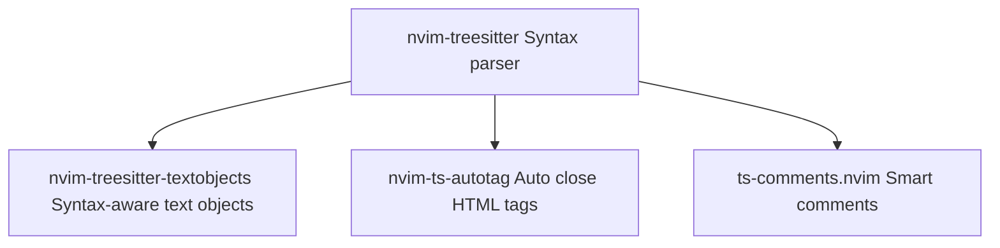

| Plugin | Commit | Purpose |
| --- | --- | --- |
| `nvim-treesitter` | `42fc28ba91` | Incremental parsing for syntax highlighting and code analysis |
| `nvim-treesitter-textobjects` | `71385f191e` | Syntax-aware text objects (functions, classes, parameters) |
| `nvim-ts-autotag` | `a1d526af39` | Automatically close and rename HTML/XML tags |
| `ts-comments.nvim` | `1bd9d0ba1d` | Context-aware comment strings based on syntax |

**Sources:** [nvim/lazy-lock.json L39-L50](https://github.com/Klaudioz/dotfiles/blob/2febda55/nvim/lazy-lock.json#L39-L50)

---

### UI and Visual Enhancement PluginsLink copied!

**Color Schemes:**

* `catppuccin` (commit `30fa4d122d`) - Catppuccin color scheme with mocha flavor
* `tokyonight.nvim` (commit `057ef5d260`) - Tokyo Night color scheme

**Status and Buffer Lines:**

* `lualine.nvim` (commit `b8c23159c0`) - Configurable status line
* `bufferline.nvim` (commit `655133c3b4`) - Buffer tabs in the top bar

**UI Framework:**

* `noice.nvim` (commit `0427460c2d`) - Enhanced command line, notifications, and messages
* `nui.nvim` (commit `de740991c1`) - UI component library (dependency for noice and neo-tree)
* `mini.icons` (commit `f9a177c11d`) - Icon provider

**Sources:** [nvim/lazy-lock.json L6-L48](https://github.com/Klaudioz/dotfiles/blob/2febda55/nvim/lazy-lock.json#L6-L48)

---

### File Navigation and DiscoveryLink copied!

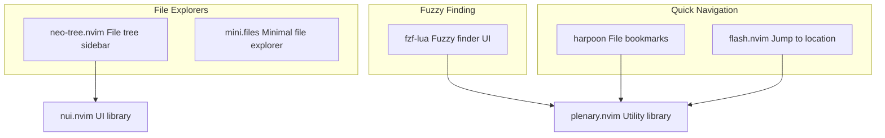

| Plugin | Commit | Purpose |
| --- | --- | --- |
| `neo-tree.nvim` | `ed057048a2` | Full-featured file tree with git status integration |
| `mini.files` | `34a730a6bd` | Lightweight file explorer alternative |
| `fzf-lua` | `ce5a5fa290` | Fuzzy finding for files, buffers, grep, and more |
| `harpoon` | `ed1f853847` | Quick file bookmarking and switching (harpoon2 branch) |
| `flash.nvim` | `3c942666f1` | Fast cursor movement with search labels |

**Sources:** [nvim/lazy-lock.json L11-L29](https://github.com/Klaudioz/dotfiles/blob/2febda55/nvim/lazy-lock.json#L11-L29)

---

### Workflow and Utility PluginsLink copied!

**Git Integration:**

* `gitsigns.nvim` (commit `6e3c66548`) - Git status in the gutter, hunk navigation, and staging

**Session Management:**

* `persistence.nvim` (commit `166a79a55b`) - Session save/restore for workspaces

**Keybinding Help:**

* `which-key.nvim` (commit `370ec46f71`) - Shows available keybindings in a popup

**Diagnostics and Tasks:**

* `trouble.nvim` (commit `85bedb7eb7`) - Pretty list for diagnostics, references, quickfix
* `todo-comments.nvim` (commit `304a8d204e`) - Highlight and search TODO/FIXME/NOTE comments

**Search and Replace:**

* `grug-far.nvim` (commit `c5b629399c`) - Interactive search and replace across files

**Screenshot and Documentation:**

* `codesnap.nvim` (commit `be6d6b9a3b`) - Create code screenshots with syntax highlighting
* `markdown-preview.nvim` (commit `a923f5fc5b`) - Live markdown preview in browser
* `render-markdown.nvim` (commit `95994ad668`) - Enhanced markdown rendering in Neovim

**Language-Specific:**

* `vim-helm` (commit `cc5ac22444`) - Helm chart template support
* `windsurf.vim` (commit `a8d47ec54f`) - Windsurf AI coding assistant
* `augment.vim` (commit `97418c9dfc`) - Text augmentation utilities

**Sources:** [nvim/lazy-lock.json L4-L53](https://github.com/Klaudioz/dotfiles/blob/2febda55/nvim/lazy-lock.json#L4-L53)

---

### Mini.nvim Suite and Text ObjectsLink copied!

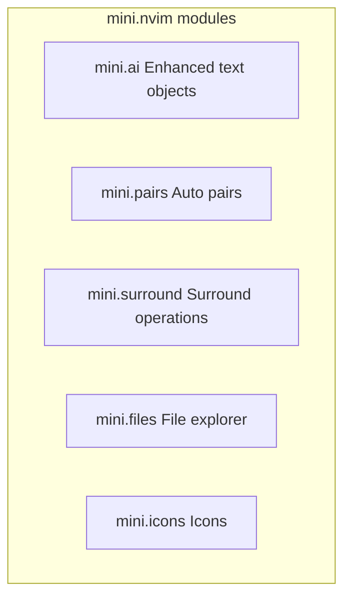

| Plugin | Commit | Purpose |
| --- | --- | --- |
| `mini.ai` | `45a26d032d` | Enhanced text objects with `a`/`i` variants |
| `mini.pairs` | `6e1cc56913` | Automatic bracket/quote pairing |
| `mini.surround` | `953fb53aa1` | Add/delete/change surrounding characters |
| `mini.files` | `34a730a6bd` | Minimal file explorer |
| `mini.icons` | `f9a177c11d` | Icon provider for file types |

**Sources:** [nvim/lazy-lock.json L24-L28](https://github.com/Klaudioz/dotfiles/blob/2febda55/nvim/lazy-lock.json#L24-L28)

---

### Core Libraries and DependenciesLink copied!

| Plugin | Commit | Purpose |
| --- | --- | --- |
| `plenary.nvim` | `b9fd5226c2` | Lua utility library used by many plugins |
| `nvim-nio` | `21f5324bfa` | Async I/O library for Neovim |
| `snacks.nvim` | `bc0630e43b` | Collection of small utilities and features |

These plugins provide foundational functionality used by other plugins rather than direct user-facing features.

**Sources:** [nvim/lazy-lock.json L38-L46](https://github.com/Klaudioz/dotfiles/blob/2febda55/nvim/lazy-lock.json#L38-L46)

---

## Complete Plugin Dependency GraphLink copied!

The following diagram shows how major plugin categories depend on each other and share common libraries:

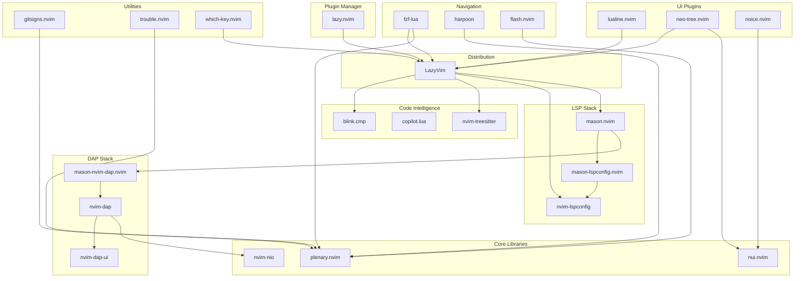

**Sources:** [nvim/lazy-lock.json L1-L54](https://github.com/Klaudioz/dotfiles/blob/2febda55/nvim/lazy-lock.json#L1-L54)

---

## Plugin Management WorkflowLink copied!

### Installation and Initialization SequenceLink copied!

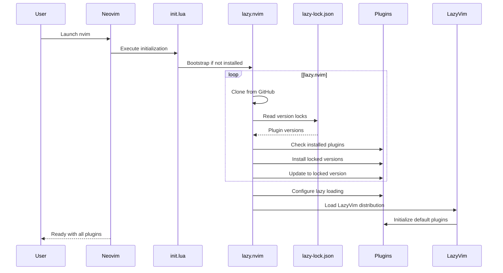

### Common Plugin Management CommandsLink copied!

| Command | Purpose |
| --- | --- |
| `:Lazy` | Open plugin management UI |
| `:Lazy sync` | Install missing plugins and update to locked versions |
| `:Lazy update` | Update plugins to latest commits (updates lock file) |
| `:Lazy clean` | Remove unused plugins |
| `:Lazy restore` | Revert all plugins to locked versions |
| `:Lazy profile` | Show plugin loading times |
| `:Lazy log` | View plugin update log |

### Update WorkflowLink copied!

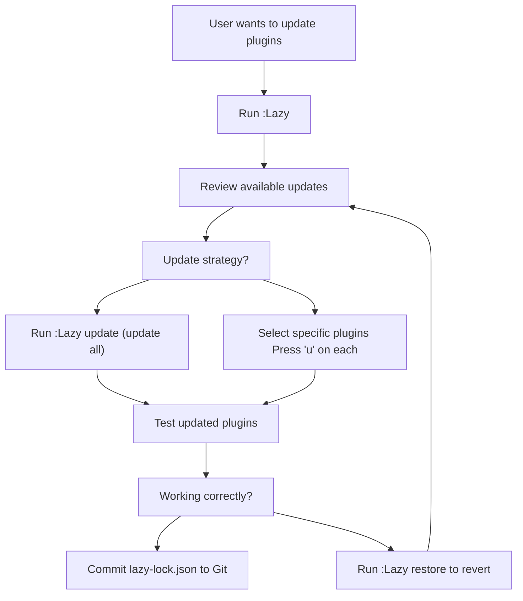

**Sources:** [nvim/lazy-lock.json L1-L54](https://github.com/Klaudioz/dotfiles/blob/2febda55/nvim/lazy-lock.json#L1-L54)

---

## Plugin Loading StrategyLink copied!

Plugins are configured with lazy loading triggers to optimize startup time:

### Loading TriggersLink copied!

| Trigger Type | Example | Plugins Using This |
| --- | --- | --- |
| **Event** | `VeryLazy`, `BufReadPre` | Most UI plugins, gitsigns |
| **Command** | `:Mason`, `:Trouble` | mason.nvim, trouble.nvim |
| **Filetype** | `go`, `lua`, `markdown` | Language-specific plugins |
| **Keys** | `<leader>f` | fzf-lua, harpoon |
| **Module** | `require('dap')` | nvim-dap and dependencies |
| **Dependency** | Required by other plugin | plenary.nvim, nui.nvim |

### Startup PerformanceLink copied!

The lazy loading strategy ensures:

* **Core plugins** (treesitter, LSP) load on first buffer
* **UI plugins** (lualine, bufferline) load slightly delayed (`VeryLazy`)
* **Utility plugins** (fzf, trouble) load only when invoked
* **Language-specific plugins** load only for relevant file types

This results in sub-100ms startup time for the basic editor, with full functionality available within a few hundred milliseconds.

**Sources:** [nvim/lazy-lock.json L1-L54](https://github.com/Klaudioz/dotfiles/blob/2febda55/nvim/lazy-lock.json#L1-L54)

---

## SummaryLink copied!

The Neovim plugin ecosystem in this configuration consists of:

* **52 total plugins** version-locked in `lazy-lock.json`
* **7 major functional categories**: LSP, DAP, Code Intelligence, UI, Navigation, Utilities, and Libraries
* **lazy.nvim** as the central plugin manager with automatic installation and lazy loading
* **LazyVim** as the distribution foundation providing sensible defaults
* **Reproducible environments** through commit-level version locking
* **Optimized startup** through event-based and on-demand plugin loading

The ecosystem is designed for stability (locked versions), performance (lazy loading), and maintainability (clear categorization and dependency management).

**Sources:** [nvim/lazy-lock.json L1-L54](https://github.com/Klaudioz/dotfiles/blob/2febda55/nvim/lazy-lock.json#L1-L54)

Refresh this wiki

Last indexed: 18 December 2025 ([2febda](https://github.com/Klaudioz/dotfiles/commit/2febda55))

### On this page

* [Plugin Ecosystem](#4.2-plugin-ecosystem)
* [Purpose and Scope](#4.2-purpose-and-scope)
* [Plugin Manager: lazy.nvim](#4.2-plugin-manager-lazynvim)
* [Version Locking System](#4.2-version-locking-system)
* [Plugin Categories and Components](#4.2-plugin-categories-and-components)
* [LazyVim Distribution Foundation](#4.2-lazyvim-distribution-foundation)
* [LSP and Language Server Tooling](#4.2-lsp-and-language-server-tooling)
* [Debug Adapter Protocol (DAP) Stack](#4.2-debug-adapter-protocol-dap-stack)
* [Code Intelligence and Completion Stack](#4.2-code-intelligence-and-completion-stack)
* [Code Quality Tools](#4.2-code-quality-tools)
* [Treesitter Syntax Ecosystem](#4.2-treesitter-syntax-ecosystem)
* [UI and Visual Enhancement Plugins](#4.2-ui-and-visual-enhancement-plugins)
* [File Navigation and Discovery](#4.2-file-navigation-and-discovery)
* [Workflow and Utility Plugins](#4.2-workflow-and-utility-plugins)
* [Mini.nvim Suite and Text Objects](#4.2-mininvim-suite-and-text-objects)
* [Core Libraries and Dependencies](#4.2-core-libraries-and-dependencies)
* [Complete Plugin Dependency Graph](#4.2-complete-plugin-dependency-graph)
* [Plugin Management Workflow](#4.2-plugin-management-workflow)
* [Installation and Initialization Sequence](#4.2-installation-and-initialization-sequence)
* [Common Plugin Management Commands](#4.2-common-plugin-management-commands)
* [Update Workflow](#4.2-update-workflow)
* [Plugin Loading Strategy](#4.2-plugin-loading-strategy)
* [Loading Triggers](#4.2-loading-triggers)
* [Startup Performance](#4.2-startup-performance)
* [Summary](#4.2-summary)

Ask Devin about dotfiles

  

Syntax error in text

mermaid version 11.4.1

Syntax error in text

mermaid version 11.4.1