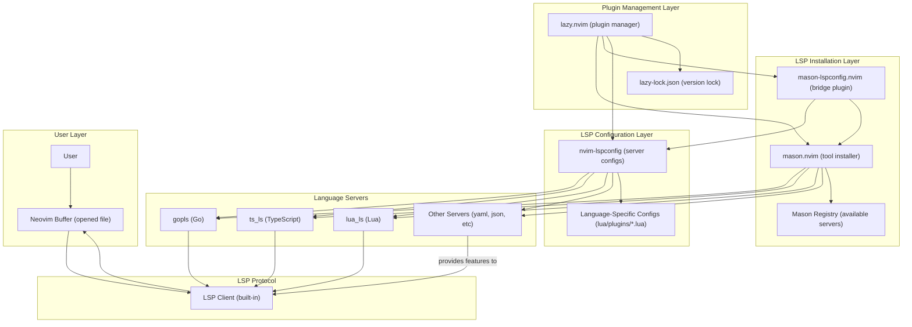
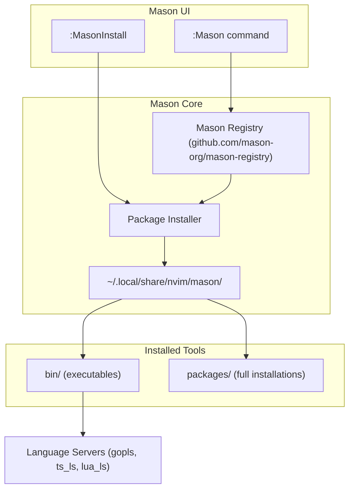
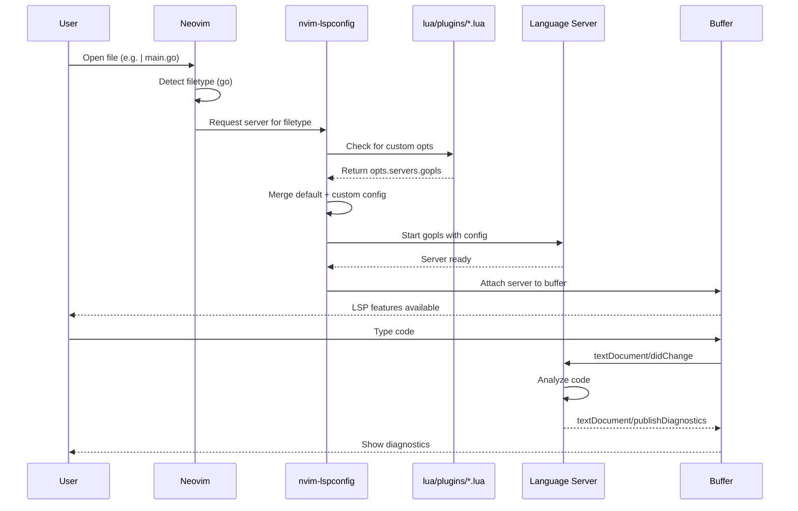
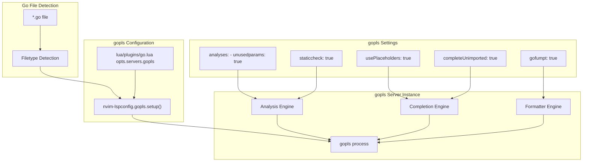
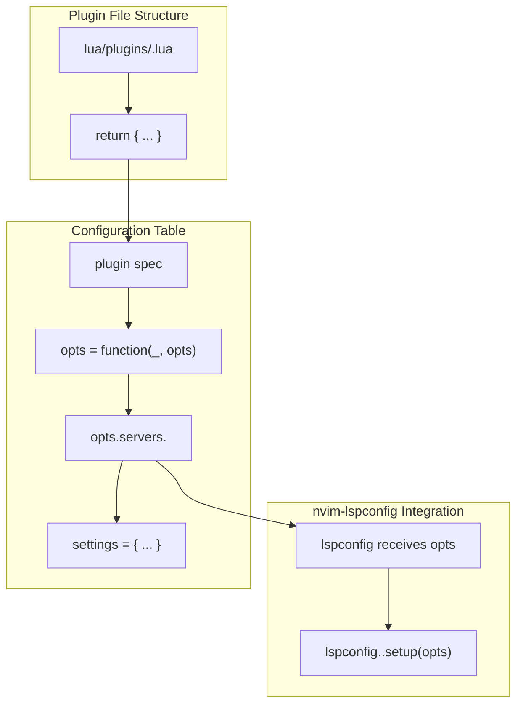
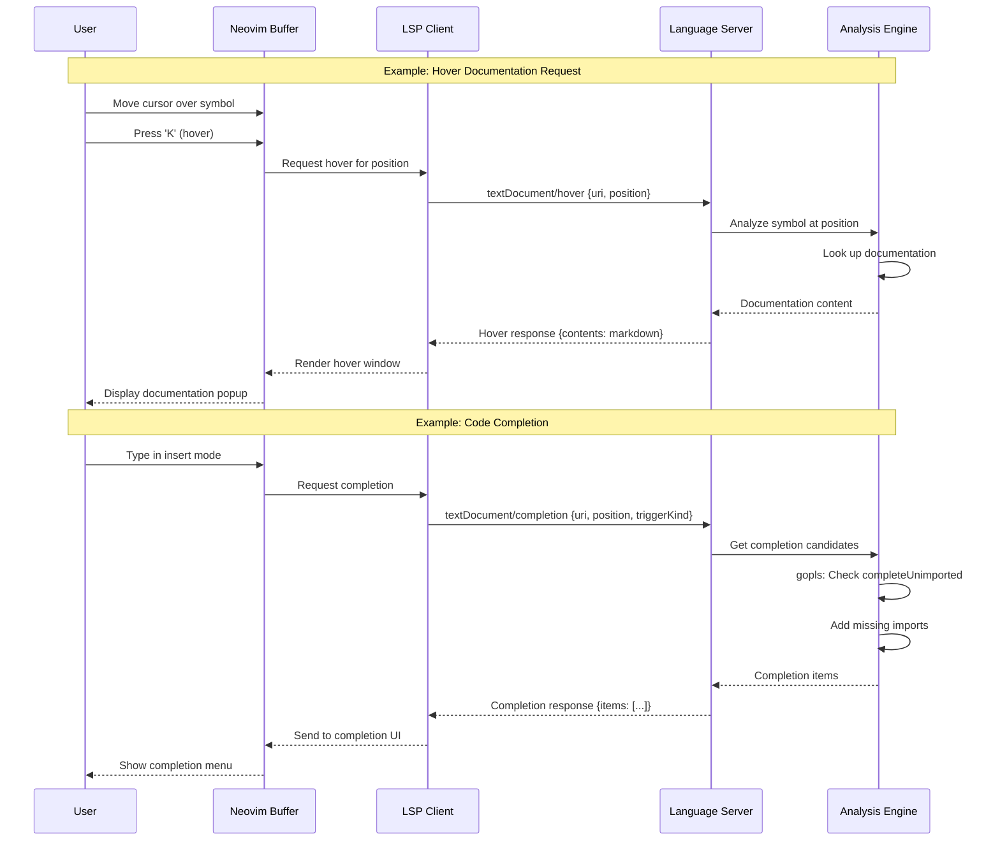
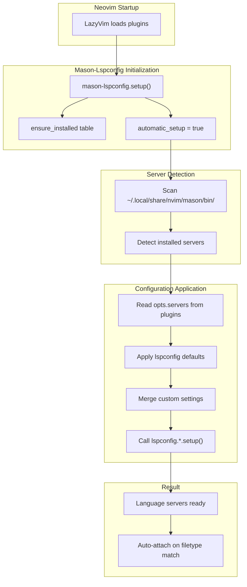
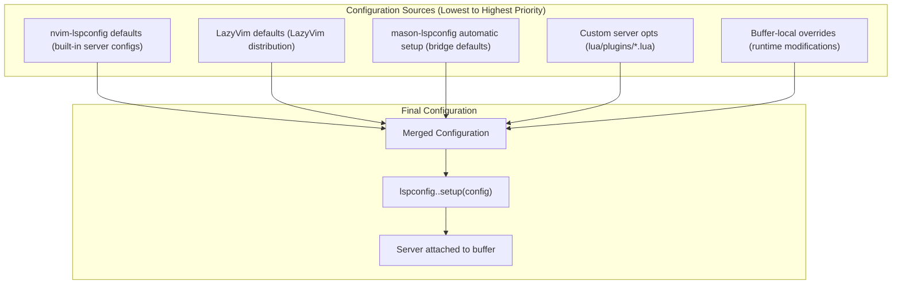
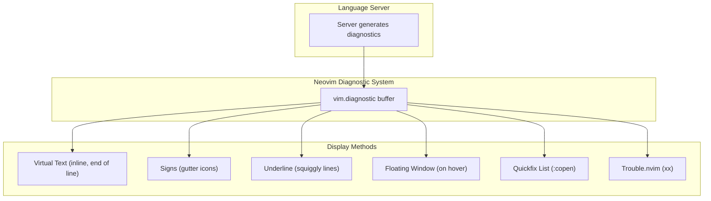
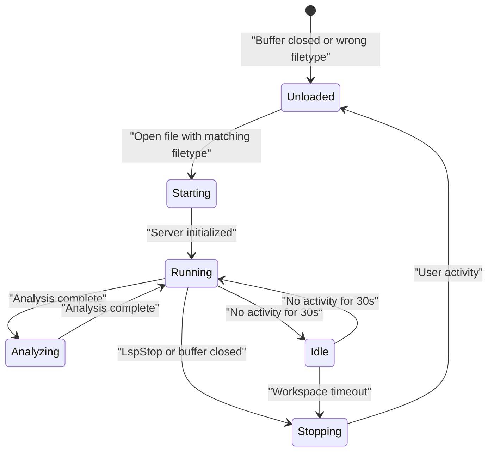

[/](/)

[/search](/search)

[/wiki](/wiki)

[/settings/members](/settings/members)

[/settings/support](/settings/support)

[Add repo](/repositories)

[All repos](/wiki)

[backend](/wiki/Klaudioz/backend)

[BH-Workflow-Engine](/wiki/Klaudioz/BH-Workflow-Engine)

[Buckhead_CRM](/wiki/Klaudioz/Buckhead_CRM)

[dotfiles](/wiki/Klaudioz/dotfiles)

[frontend](/wiki/Klaudioz/frontend)

[godeep.wiki-jb](/wiki/Klaudioz/godeep.wiki-jb)

[pi-mono-zero](/wiki/Klaudioz/pi-mono-zero)

[VirtualOracle](/wiki/Klaudioz/VirtualOracle)

# Language Server Protocol (LSP)Link copied!

> **Relevant source files**
> * [nvim/lazy-lock.json](https://github.com/Klaudioz/dotfiles/blob/2febda55/nvim/lazy-lock.json)
> * [nvim/lua/config/keymaps.lua](https://github.com/Klaudioz/dotfiles/blob/2febda55/nvim/lua/config/keymaps.lua)
> * [nvim/lua/plugins/copilot.lua](https://github.com/Klaudioz/dotfiles/blob/2febda55/nvim/lua/plugins/copilot.lua)
> * [nvim/lua/plugins/go.lua](https://github.com/Klaudioz/dotfiles/blob/2febda55/nvim/lua/plugins/go.lua)

## Purpose and ScopeLink copied!

This document details the Language Server Protocol (LSP) configuration in Neovim, covering the installation and management of language servers through `mason.nvim`, their configuration via `nvim-lspconfig`, and language-specific setups. LSP provides core code intelligence features including completion, diagnostics, go-to-definition, and refactoring. This page focuses specifically on LSP server configuration and integration; for related topics, see [Code Intelligence and Completion](#4.6) for completion UI and AI-assisted features, [Debug Adapter Protocol (DAP)](#4.4) for debugging capabilities, and [Code Formatting and Linting](#4.8) for code quality tools.

## LSP Architecture OverviewLink copied!

The LSP configuration follows a three-layer architecture where each component has a distinct responsibility in the language server lifecycle.

### Component Interaction DiagramLink copied!

**Sources:** [nvim/lazy-lock.json L21-L37](https://github.com/Klaudioz/dotfiles/blob/2febda55/nvim/lazy-lock.json#L21-L37)

### Plugin Version ManagementLink copied!

The LSP ecosystem plugins are version-locked in `lazy-lock.json` to ensure reproducible builds:

| Plugin | Purpose | Locked Commit |
| --- | --- | --- |
| `mason.nvim` | Language server installer | `fc98833b6da5` |
| `mason-lspconfig.nvim` | Bridge between mason and lspconfig | `1a31f824b9cd` |
| `nvim-lspconfig` | Language server configurations | `c8b90ae5cbe2` |

**Sources:** [nvim/lazy-lock.json L21-L37](https://github.com/Klaudioz/dotfiles/blob/2febda55/nvim/lazy-lock.json#L21-L37)

## Mason.nvim: Language Server InstallationLink copied!

`mason.nvim` provides a unified interface for installing language servers, formatters, linters, and debug adapters. It manages these tools in an isolated environment, separate from system package managers.

### Installation ArchitectureLink copied!

Mason stores all installed tools in `~/.local/share/nvim/mason/`, making them available to Neovim without polluting the system PATH. The `mason-lspconfig.nvim` plugin provides automatic setup, ensuring that installed language servers are automatically configured with sensible defaults.

**Sources:** [nvim/lazy-lock.json L21-L23](https://github.com/Klaudioz/dotfiles/blob/2febda55/nvim/lazy-lock.json#L21-L23)

## nvim-lspconfig: Server ConfigurationLink copied!

`nvim-lspconfig` provides configuration templates for over 100 language servers. It handles the attachment of language servers to buffers based on filetype detection.

### Configuration FlowLink copied!

The configuration system uses a functional options pattern where custom configurations can extend or override default settings. The `opts` parameter in plugin specifications allows language-specific customization.

**Sources:** [nvim/lazy-lock.json L37](https://github.com/Klaudioz/dotfiles/blob/2febda55/nvim/lazy-lock.json#L37-L37)

 [nvim/lua/plugins/go.lua L1-L24](https://github.com/Klaudioz/dotfiles/blob/2febda55/nvim/lua/plugins/go.lua#L1-L24)

## Language-Specific ConfigurationsLink copied!

Language servers can be customized through dedicated configuration files in the `lua/plugins/` directory. Each configuration file exports a table that modifies the behavior of `nvim-lspconfig`.

### Go Language Server (gopls)Link copied!

The Go configuration demonstrates comprehensive language server customization through analysis options, code formatting preferences, and completion behavior.

#### gopls Configuration Details

The `gopls` configuration in [nvim/lua/plugins/go.lua L1-L24](https://github.com/Klaudioz/dotfiles/blob/2febda55/nvim/lua/plugins/go.lua#L1-L24)

 demonstrates several key customization patterns:

**Analysis Settings** [nvim/lua/plugins/go.lua L11-L13](https://github.com/Klaudioz/dotfiles/blob/2febda55/nvim/lua/plugins/go.lua#L11-L13)

:

* `unusedparams: true` - Detects unused function parameters
* `staticcheck: true` - Enables staticcheck analyzers for comprehensive code analysis

**Completion Settings** [nvim/lua/plugins/go.lua L15-L16](https://github.com/Klaudioz/dotfiles/blob/2febda55/nvim/lua/plugins/go.lua#L15-L16)

:

* `usePlaceholders: true` - Inserts placeholder text for function arguments during completion
* `completeUnimported: true` - Enables auto-import of unimported packages during completion

**Formatting Settings** [nvim/lua/plugins/go.lua L17](https://github.com/Klaudioz/dotfiles/blob/2febda55/nvim/lua/plugins/go.lua#L17-L17)

:

* `gofumpt: true` - Uses `gofumpt` (stricter `gofmt`) for code formatting

The configuration uses a functional options pattern [nvim/lua/plugins/go.lua L3-L22](https://github.com/Klaudioz/dotfiles/blob/2febda55/nvim/lua/plugins/go.lua#L3-L22)

 where the `opts` function receives existing options and returns modified options, allowing multiple plugins to compose configurations without conflicts.

**Sources:** [nvim/lua/plugins/go.lua L1-L24](https://github.com/Klaudioz/dotfiles/blob/2febda55/nvim/lua/plugins/go.lua#L1-L24)

### Configuration Extension PatternLink copied!

The standard pattern for extending language server configurations follows this structure:

This pattern allows language-specific configuration files to remain isolated while integrating seamlessly with the `nvim-lspconfig` setup process managed by `mason-lspconfig.nvim`.

**Sources:** [nvim/lua/plugins/go.lua L1-L24](https://github.com/Klaudioz/dotfiles/blob/2febda55/nvim/lua/plugins/go.lua#L1-L24)

## LSP-Powered FeaturesLink copied!

Language servers provide a comprehensive set of features through the LSP protocol. These features are automatically available once a language server attaches to a buffer.

### Feature MatrixLink copied!

| LSP Feature | Protocol Method | User Action | Description |
| --- | --- | --- | --- |
| **Code Completion** | `textDocument/completion` | Insert mode typing | Context-aware suggestions including auto-imports |
| **Diagnostics** | `textDocument/publishDiagnostics` | Automatic | Real-time error/warning display |
| **Go to Definition** | `textDocument/definition` | `gd` (default) | Jump to symbol definition |
| **Go to Type Definition** | `textDocument/typeDefinition` | `gy` (default) | Jump to type definition |
| **Find References** | `textDocument/references` | `gr` (default) | List all references to symbol |
| **Hover Documentation** | `textDocument/hover` | `K` (default) | Display documentation popup |
| **Signature Help** | `textDocument/signatureHelp` | Insert mode | Function parameter hints |
| **Rename** | `textDocument/rename` | `<leader>cr` (LazyVim) | Rename symbol across workspace |
| **Code Actions** | `textDocument/codeAction` | `<leader>ca` (LazyVim) | Apply fixes and refactorings |
| **Formatting** | `textDocument/formatting` | `<leader>cf` (LazyVim) | Format document/range |
| **Symbol Search** | `textDocument/documentSymbol` | `<leader>ss` (LazyVim) | Search symbols in document |
| **Workspace Symbols** | `workspace/symbol` | `<leader>sS` (LazyVim) | Search symbols in workspace |

### LSP Request-Response FlowLink copied!

**Sources:** [nvim/lua/plugins/go.lua L15-L16](https://github.com/Klaudioz/dotfiles/blob/2febda55/nvim/lua/plugins/go.lua#L15-L16)

## Integration with Mason-LspconfigLink copied!

The `mason-lspconfig.nvim` plugin provides the bridge between `mason.nvim` and `nvim-lspconfig`, enabling automatic server setup when servers are installed through Mason.

### Automatic Setup FlowLink copied!

This automatic setup eliminates the need for manual `require('lspconfig').<server>.setup()` calls for each language server. The bridge plugin detects servers installed by Mason and automatically configures them using both default and custom settings.

**Sources:** [nvim/lazy-lock.json L21-L37](https://github.com/Klaudioz/dotfiles/blob/2febda55/nvim/lazy-lock.json#L21-L37)

## LSP Configuration HierarchyLink copied!

The LSP configuration system supports multiple layers of configuration, allowing for global defaults, server-specific defaults, and user customizations to coexist.

### Configuration PrecedenceLink copied!

For example, the gopls configuration demonstrates this hierarchy:

1. **nvim-lspconfig** provides baseline gopls configuration
2. **LazyVim** may add common keybindings and UI integrations
3. **mason-lspconfig** ensures automatic setup when gopls is installed
4. **Custom configuration** [nvim/lua/plugins/go.lua L8-L20](https://github.com/Klaudioz/dotfiles/blob/2febda55/nvim/lua/plugins/go.lua#L8-L20)  adds specific analyses, completeUnimported, and gofumpt settings

**Sources:** [nvim/lua/plugins/go.lua L1-L24](https://github.com/Klaudioz/dotfiles/blob/2febda55/nvim/lua/plugins/go.lua#L1-L24)

 [nvim/lazy-lock.json L21-L37](https://github.com/Klaudioz/dotfiles/blob/2febda55/nvim/lazy-lock.json#L21-L37)

## Server Management CommandsLink copied!

Language servers installed through Mason can be managed through both UI and command-line interfaces.

### Mason CommandsLink copied!

| Command | Description | Usage Example |
| --- | --- | --- |
| `:Mason` | Open Mason UI | Browse and install servers interactively |
| `:MasonInstall <server>` | Install specific server | `:MasonInstall gopls` |
| `:MasonUninstall <server>` | Uninstall server | `:MasonUninstall gopls` |
| `:MasonUpdate` | Update all installed packages | Automatic update of Mason registry |
| `:MasonLog` | Open Mason log file | Debug installation issues |

### LSP CommandsLink copied!

| Command | Description | Usage Example |
| --- | --- | --- |
| `:LspInfo` | Show attached servers | View servers for current buffer |
| `:LspStart <server>` | Manually start server | `:LspStart gopls` |
| `:LspStop <server>` | Stop server | `:LspStop gopls` |
| `:LspRestart` | Restart all servers | Apply configuration changes |

**Sources:** [nvim/lazy-lock.json L21-L23](https://github.com/Klaudioz/dotfiles/blob/2febda55/nvim/lazy-lock.json#L21-L23)

## Diagnostic ConfigurationLink copied!

Language servers provide diagnostics (errors, warnings, hints) which are displayed through Neovim's diagnostic system. LazyVim configures these with sensible defaults including virtual text, signs, and underlines.

### Diagnostic Display LocationsLink copied!

Diagnostics are severity-categorized as ERROR, WARN, INFO, or HINT, each with distinct visual indicators. The gopls configuration with `staticcheck: true` [nvim/lua/plugins/go.lua L14](https://github.com/Klaudioz/dotfiles/blob/2febda55/nvim/lua/plugins/go.lua#L14-L14)

 enables comprehensive static analysis, resulting in more detailed diagnostic information.

**Sources:** [nvim/lua/plugins/go.lua L14](https://github.com/Klaudioz/dotfiles/blob/2febda55/nvim/lua/plugins/go.lua#L14-L14)

## Performance ConsiderationsLink copied!

Language servers can be resource-intensive, particularly for large codebases. The configuration includes several optimizations:

### Server Lifecycle ManagementLink copied!

The gopls configuration includes `completeUnimported: true` [nvim/lua/plugins/go.lua L16](https://github.com/Klaudioz/dotfiles/blob/2febda55/nvim/lua/plugins/go.lua#L16-L16)

 which may increase completion latency slightly as the server searches the entire module graph, but provides superior developer experience by automatically suggesting and importing packages.

**Sources:** [nvim/lua/plugins/go.lua L16](https://github.com/Klaudioz/dotfiles/blob/2febda55/nvim/lua/plugins/go.lua#L16-L16)

## TroubleshootingLink copied!

Common LSP issues and their resolution paths:

| Issue | Diagnostic Command | Common Causes | Resolution |
| --- | --- | --- | --- |
| Server not attaching | `:LspInfo` | Server not installed, wrong filetype | Check Mason installation, verify filetype detection |
| No completions | `:lua =vim.lsp.get_clients()` | Server not initialized, capabilities missing | Restart server, check server logs |
| Diagnostics not showing | `:lua =vim.diagnostic.get()` | Diagnostics disabled, server error | Check diagnostic configuration, review server logs |
| Slow performance | `:LspInfo` check client count | Multiple servers attached, large workspace | Reduce `root_dir` scope, disable unused servers |
| Auto-import not working | Check `opts.servers.gopls.settings.gopls.completeUnimported` | Setting disabled or wrong | Verify [nvim/lua/plugins/go.lua L16](https://github.com/Klaudioz/dotfiles/blob/2febda55/nvim/lua/plugins/go.lua#L16-L16)    is `true` |

The `:LspLog` command opens the LSP client log file at `~/.local/state/nvim/lsp.log` for detailed debugging information.

**Sources:** [nvim/lua/plugins/go.lua L16](https://github.com/Klaudioz/dotfiles/blob/2febda55/nvim/lua/plugins/go.lua#L16-L16)

Refresh this wiki

Last indexed: 18 December 2025 ([2febda](https://github.com/Klaudioz/dotfiles/commit/2febda55))

### On this page

* [Language Server Protocol (LSP)](#4.3-language-server-protocol-lsp)
* [Purpose and Scope](#4.3-purpose-and-scope)
* [LSP Architecture Overview](#4.3-lsp-architecture-overview)
* [Component Interaction Diagram](#4.3-component-interaction-diagram)
* [Plugin Version Management](#4.3-plugin-version-management)
* [Mason.nvim: Language Server Installation](#4.3-masonnvim-language-server-installation)
* [Installation Architecture](#4.3-installation-architecture)
* [nvim-lspconfig: Server Configuration](#4.3-nvim-lspconfig-server-configuration)
* [Configuration Flow](#4.3-configuration-flow)
* [Language-Specific Configurations](#4.3-language-specific-configurations)
* [Go Language Server (gopls)](#4.3-go-language-server-gopls)
* [Configuration Extension Pattern](#4.3-configuration-extension-pattern)
* [LSP-Powered Features](#4.3-lsp-powered-features)
* [Feature Matrix](#4.3-feature-matrix)
* [LSP Request-Response Flow](#4.3-lsp-request-response-flow)
* [Integration with Mason-Lspconfig](#4.3-integration-with-mason-lspconfig)
* [Automatic Setup Flow](#4.3-automatic-setup-flow)
* [LSP Configuration Hierarchy](#4.3-lsp-configuration-hierarchy)
* [Configuration Precedence](#4.3-configuration-precedence)
* [Server Management Commands](#4.3-server-management-commands)
* [Mason Commands](#4.3-mason-commands)
* [LSP Commands](#4.3-lsp-commands)
* [Diagnostic Configuration](#4.3-diagnostic-configuration)
* [Diagnostic Display Locations](#4.3-diagnostic-display-locations)
* [Performance Considerations](#4.3-performance-considerations)
* [Server Lifecycle Management](#4.3-server-lifecycle-management)
* [Troubleshooting](#4.3-troubleshooting)

Ask Devin about dotfiles

  

Syntax error in text

mermaid version 11.4.1

Syntax error in text

mermaid version 11.4.1