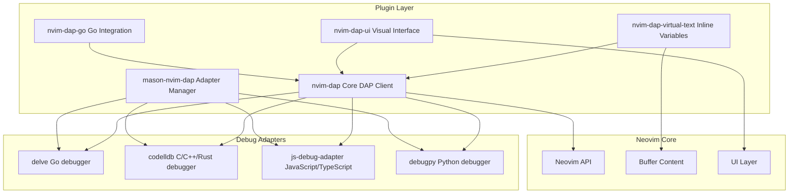
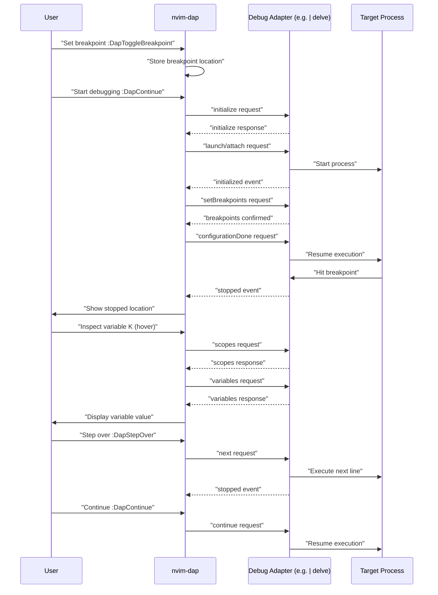
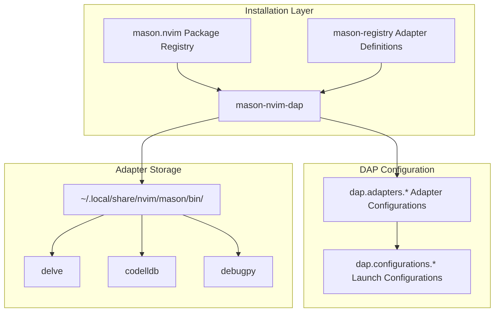
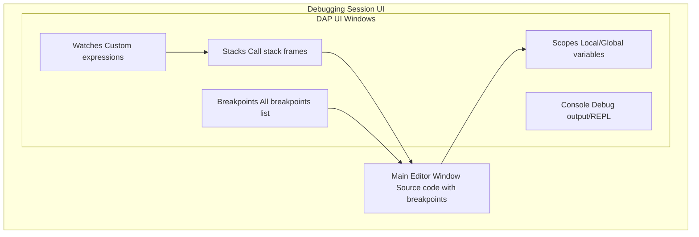
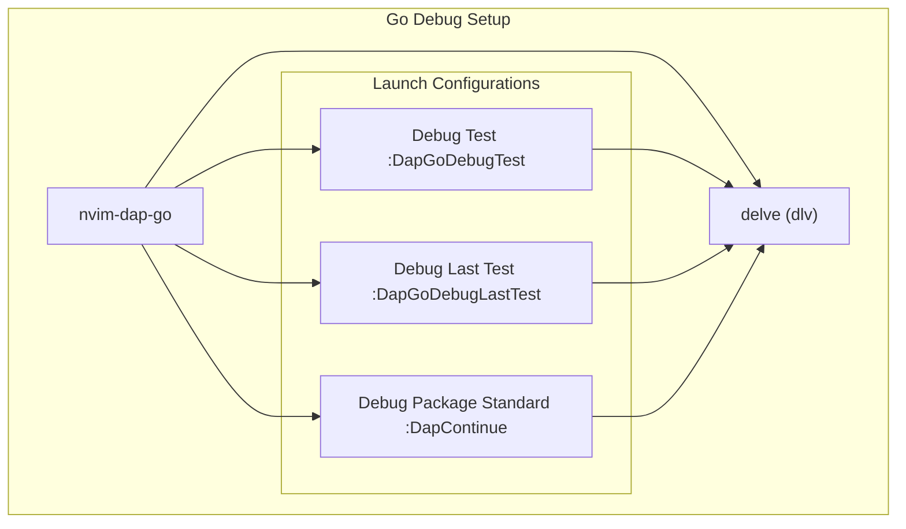
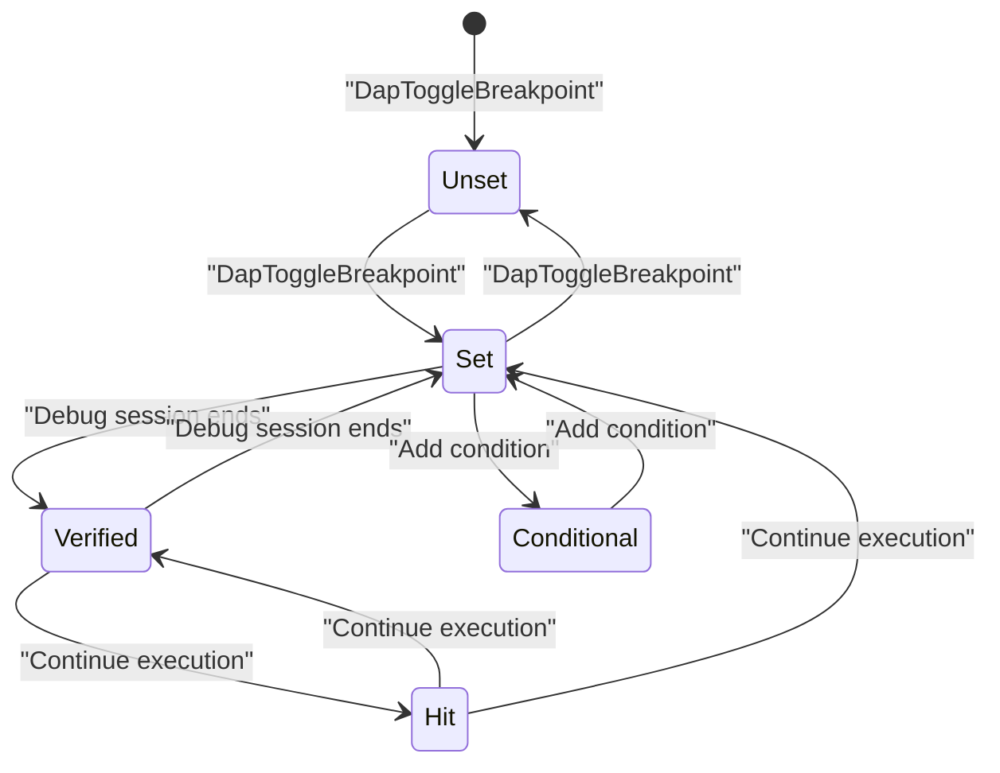
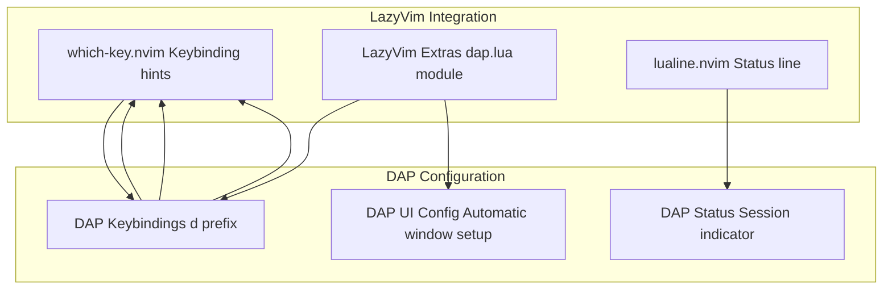
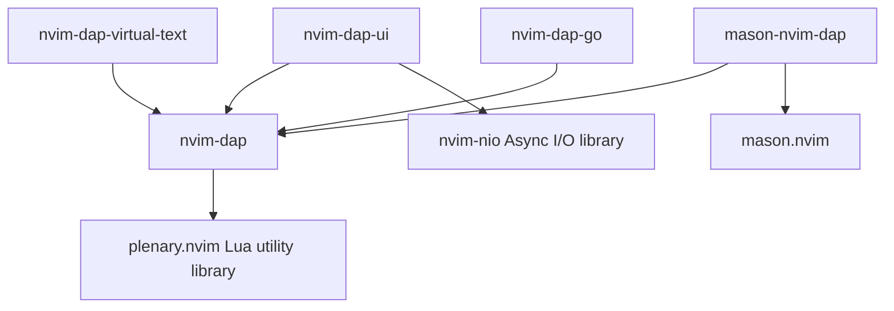

[/](/)

[/search](/search)

[/wiki](/wiki)

[/settings/members](/settings/members)

[/settings/support](/settings/support)

[Add repo](/repositories)

[All repos](/wiki)

[backend](/wiki/Klaudioz/backend)

[BH-Workflow-Engine](/wiki/Klaudioz/BH-Workflow-Engine)

[Buckhead_CRM](/wiki/Klaudioz/Buckhead_CRM)

[dotfiles](/wiki/Klaudioz/dotfiles)

[frontend](/wiki/Klaudioz/frontend)

[godeep.wiki-jb](/wiki/Klaudioz/godeep.wiki-jb)

[pi-mono-zero](/wiki/Klaudioz/pi-mono-zero)

[VirtualOracle](/wiki/Klaudioz/VirtualOracle)

# Debug Adapter Protocol (DAP)Link copied!

> **Relevant source files**
> * [nvim/lazy-lock.json](https://github.com/Klaudioz/dotfiles/blob/2febda55/nvim/lazy-lock.json)

## Purpose and ScopeLink copied!

This document describes the Debug Adapter Protocol (DAP) configuration within the Neovim editor environment. DAP provides language-agnostic debugging capabilities, allowing Neovim to interface with debuggers for various programming languages through a standardized protocol.

This page covers the core debugging infrastructure (`nvim-dap`), debug adapter installation through `mason-nvim-dap`, UI enhancements via `nvim-dap-ui` and `nvim-dap-virtual-text`, and language-specific adapter configurations. For general language server configuration, see [Language Server Protocol (LSP)](#4.3). For code completion features, see [Code Intelligence and Completion](#4.6).

---

## DAP Plugin EcosystemLink copied!

The DAP implementation consists of five primary plugins managed by `lazy.nvim`:

| Plugin | Version Commit | Purpose |
| --- | --- | --- |
| `nvim-dap` | 7523676a4be1 | Core DAP client implementing the protocol |
| `mason-nvim-dap` | 86389a3dd687 | Automatic debug adapter installation |
| `nvim-dap-ui` | cf91d5e2d07c | Visual debugging interface |
| `nvim-dap-virtual-text` | fbdb48c2ed45 | Inline variable display during debugging |
| `nvim-dap-go` | b4421153ead5 | Go-specific debugging enhancements |

**DAP Plugin Architecture**



Sources: [nvim/lazy-lock.json L32-L35](https://github.com/Klaudioz/dotfiles/blob/2febda55/nvim/lazy-lock.json#L32-L35)

---

## Core DAP Client (nvim-dap)Link copied!

The `nvim-dap` plugin implements the Debug Adapter Protocol specification, serving as the central client that communicates with language-specific debug adapters. It provides the fundamental debugging primitives: breakpoints, stepping, variable inspection, and stack trace navigation.

### Debug Adapter Protocol FlowLink copied!



### Key DAP CommandsLink copied!

The configuration exposes these core debugging commands:

| Command | Function | Typical Keybinding |
| --- | --- | --- |
| `:DapContinue` | Start/continue debugging session | `<leader>dc` |
| `:DapToggleBreakpoint` | Set/remove breakpoint at cursor | `<leader>db` |
| `:DapStepOver` | Execute current line, skip functions | `<leader>dO` |
| `:DapStepInto` | Step into function call | `<leader>di` |
| `:DapStepOut` | Step out of current function | `<leader>do` |
| `:DapTerminate` | Stop debugging session | `<leader>dt` |

Sources: [nvim/lazy-lock.json L32](https://github.com/Klaudioz/dotfiles/blob/2febda55/nvim/lazy-lock.json#L32-L32)

---

## Debug Adapter Installation (mason-nvim-dap)Link copied!

The `mason-nvim-dap` plugin integrates with `mason.nvim` to automatically install and configure debug adapters. This provides a seamless installation experience similar to LSP server management.

### Adapter Installation ArchitectureLink copied!



### Supported Debug AdaptersLink copied!

Common debug adapters available through `mason-nvim-dap`:

| Language | Adapter Name | Executable | Purpose |
| --- | --- | --- | --- |
| Go | `delve` | `dlv` | Native Go debugging |
| Python | `debugpy` | `python -m debugpy` | Python debugging |
| C/C++/Rust | `codelldb` | `codelldb` | LLDB-based debugging |
| JavaScript/TypeScript | `js-debug-adapter` | `js-debug-adapter` | Node.js/browser debugging |
| C# | `netcoredbg` | `netcoredbg` | .NET debugging |

Sources: [nvim/lazy-lock.json L22](https://github.com/Klaudioz/dotfiles/blob/2febda55/nvim/lazy-lock.json#L22-L22)

---

## DAP UI ComponentsLink copied!

### nvim-dap-uiLink copied!

The `nvim-dap-ui` plugin provides a comprehensive visual debugging interface that opens automatically when a debugging session starts. It creates multiple specialized windows:

**DAP UI Window Layout**



UI elements provided by `nvim-dap-ui`:

| Element | Purpose | Display Content |
| --- | --- | --- |
| **Scopes** | Variable inspection | Local variables, function arguments, globals |
| **Watches** | Expression evaluation | User-defined expressions evaluated in current context |
| **Stacks** | Call stack navigation | Function call hierarchy with file/line information |
| **Breakpoints** | Breakpoint management | List of all breakpoints across files |
| **Console** | Debug output | stdout/stderr and REPL for runtime evaluation |

Sources: [nvim/lazy-lock.json L34](https://github.com/Klaudioz/dotfiles/blob/2febda55/nvim/lazy-lock.json#L34-L34)

### nvim-dap-virtual-textLink copied!

The `nvim-dap-virtual-text` plugin displays variable values inline as virtual text next to the code during debugging sessions. This provides immediate visual feedback without requiring interaction with separate windows.

**Virtual Text Display Example**

```javascript
function calculateTotal(items) {
    let sum = 0;           // sum = 0
    for (let i = 0; i < items.length; i++) {  // i = 2, items.length = 5
        sum += items[i];   // sum = 45, items[i] = 20
    }
    return sum;            // <breakpoint here>
}
```

Sources: [nvim/lazy-lock.json L35](https://github.com/Klaudioz/dotfiles/blob/2febda55/nvim/lazy-lock.json#L35-L35)

---

## Language-Specific DAP ConfigurationLink copied!

### Go Debugging (nvim-dap-go)Link copied!

The `nvim-dap-go` plugin provides specialized Go debugging support through integration with Delve. It automatically configures debug adapter settings optimized for Go development.

**Go Debug Configuration Components**



#### Go-Specific Debug Commands

| Command | Purpose | Use Case |
| --- | --- | --- |
| `:DapGoDebugTest` | Debug test at cursor | Debug specific `*_test.go` function |
| `:DapGoDebugLastTest` | Re-debug last test | Quickly re-run previous test debug session |
| `:DapContinue` with Go file | Debug main package | Debug `main()` function in current package |

#### Delve Adapter Configuration

Typical `delve` adapter configuration structure:

```
dap.adapters.delve = {  type = 'server',  host = '127.0.0.1',  port = '${port}',  executable = {    command = 'dlv',    args = {'dap', '-l', '127.0.0.1:${port}'}  }}
```

Debug configurations for Go typically include:

* **Debug**: Launch main package with debugger attached
* **Debug Test**: Run specific test function with debugger
* **Attach**: Attach to already-running Go process

Sources: [nvim/lazy-lock.json L33](https://github.com/Klaudioz/dotfiles/blob/2febda55/nvim/lazy-lock.json#L33-L33)

---

## Debugging Workflow IntegrationLink copied!

### Breakpoint ManagementLink copied!

**Breakpoint Lifecycle**



### Session ManagementLink copied!

A typical debugging session follows this workflow:

1. **Setup Phase** * Set breakpoints using `:DapToggleBreakpoint` * Optionally configure launch parameters
2. **Start Phase** * Execute `:DapContinue` to launch debug session * `nvim-dap` initializes adapter * `nvim-dap-ui` opens debugging windows * Adapter launches/attaches to target process
3. **Debug Phase** * Execution stops at breakpoints * Inspect variables via scopes window or hover * `nvim-dap-virtual-text` displays inline values * Step through code using step commands * Evaluate expressions in console/watches
4. **Termination Phase** * Execute `:DapTerminate` or allow program completion * `nvim-dap-ui` closes debugging windows * Breakpoints remain set for next session

Sources: [nvim/lazy-lock.json L32-L35](https://github.com/Klaudioz/dotfiles/blob/2febda55/nvim/lazy-lock.json#L32-L35)

---

## Integration with LazyVimLink copied!

The DAP configuration integrates with LazyVim's key binding and UI systems:

### LazyVim DAP Integration PointsLink copied!



### Debug Keybinding CategoriesLink copied!

Debug commands are organized under the `<leader>d` prefix:

| Prefix | Category | Example Commands |
| --- | --- | --- |
| `<leader>db` | Breakpoints | Toggle breakpoint |
| `<leader>dc` | Control | Continue, pause |
| `<leader>ds` | Stepping | Step over, into, out |
| `<leader>dg` | Go-specific | Debug test, debug last |
| `<leader>du` | UI | Toggle UI, evaluate expression |

Sources: [nvim/lazy-lock.json L32-L35](https://github.com/Klaudioz/dotfiles/blob/2febda55/nvim/lazy-lock.json#L32-L35)

---

## Configuration File LocationsLink copied!

DAP-related configuration files in the dotfiles repository are typically located at:

| Configuration Type | Expected Location | Purpose |
| --- | --- | --- |
| Plugin specification | `nvim/lua/plugins/dap.lua` | Plugin installation and basic setup |
| Adapter configuration | `nvim/lua/config/dap/adapters.lua` | Language-specific adapter settings |
| Launch configurations | `nvim/lua/config/dap/configurations.lua` | Debug launch parameters |
| Keybindings | `nvim/lua/config/keymaps.lua` | Debug command mappings |

Plugin versions are locked in [nvim/lazy-lock.json L32-L35](https://github.com/Klaudioz/dotfiles/blob/2febda55/nvim/lazy-lock.json#L32-L35)

---

## Dependencies and RequirementsLink copied!

### Plugin DependenciesLink copied!

DAP functionality requires these dependencies:



### External Tool RequirementsLink copied!

Debug adapters require external debugger tools:

* **delve**: Requires Go toolchain installed
* **debugpy**: Requires Python 3.6+
* **codelldb**: Standalone, no additional requirements
* **js-debug-adapter**: Requires Node.js runtime

Sources: [nvim/lazy-lock.json L32-L44](https://github.com/Klaudioz/dotfiles/blob/2febda55/nvim/lazy-lock.json#L32-L44)

Refresh this wiki

Last indexed: 18 December 2025 ([2febda](https://github.com/Klaudioz/dotfiles/commit/2febda55))

### On this page

* [Debug Adapter Protocol (DAP)](#4.4-debug-adapter-protocol-dap)
* [Purpose and Scope](#4.4-purpose-and-scope)
* [DAP Plugin Ecosystem](#4.4-dap-plugin-ecosystem)
* [Core DAP Client (nvim-dap)](#4.4-core-dap-client-nvim-dap)
* [Debug Adapter Protocol Flow](#4.4-debug-adapter-protocol-flow)
* [Key DAP Commands](#4.4-key-dap-commands)
* [Debug Adapter Installation (mason-nvim-dap)](#4.4-debug-adapter-installation-mason-nvim-dap)
* [Adapter Installation Architecture](#4.4-adapter-installation-architecture)
* [Supported Debug Adapters](#4.4-supported-debug-adapters)
* [DAP UI Components](#4.4-dap-ui-components)
* [nvim-dap-ui](#4.4-nvim-dap-ui)
* [nvim-dap-virtual-text](#4.4-nvim-dap-virtual-text)
* [Language-Specific DAP Configuration](#4.4-language-specific-dap-configuration)
* [Go Debugging (nvim-dap-go)](#4.4-go-debugging-nvim-dap-go)
* [Debugging Workflow Integration](#4.4-debugging-workflow-integration)
* [Breakpoint Management](#4.4-breakpoint-management)
* [Session Management](#4.4-session-management)
* [Integration with LazyVim](#4.4-integration-with-lazyvim)
* [LazyVim DAP Integration Points](#4.4-lazyvim-dap-integration-points)
* [Debug Keybinding Categories](#4.4-debug-keybinding-categories)
* [Configuration File Locations](#4.4-configuration-file-locations)
* [Dependencies and Requirements](#4.4-dependencies-and-requirements)
* [Plugin Dependencies](#4.4-plugin-dependencies)
* [External Tool Requirements](#4.4-external-tool-requirements)

Ask Devin about dotfiles

  

Syntax error in text

mermaid version 11.4.1

Syntax error in text

mermaid version 11.4.1