[/](/)

[/search](/search)

[/wiki](/wiki)

[/settings/members](/settings/members)

[/settings/support](/settings/support)

[Add repo](/repositories)

[All repos](/wiki)

[backend](/wiki/Klaudioz/backend)

[BH-Workflow-Engine](/wiki/Klaudioz/BH-Workflow-Engine)

[Buckhead_CRM](/wiki/Klaudioz/Buckhead_CRM)

[dotfiles](/wiki/Klaudioz/dotfiles)

[frontend](/wiki/Klaudioz/frontend)

[godeep.wiki-jb](/wiki/Klaudioz/godeep.wiki-jb)

[pi-mono-zero](/wiki/Klaudioz/pi-mono-zero)

[VirtualOracle](/wiki/Klaudioz/VirtualOracle)

# Keybindings and MappingsLink copied!

> **Relevant source files**
> * [nvim/lua/config/keymaps.lua](https://github.com/Klaudioz/dotfiles/blob/2febda55/nvim/lua/config/keymaps.lua)
> * [nvim/lua/plugins/copilot.lua](https://github.com/Klaudioz/dotfiles/blob/2febda55/nvim/lua/plugins/copilot.lua)
> * [nvim/lua/plugins/go.lua](https://github.com/Klaudioz/dotfiles/blob/2febda55/nvim/lua/plugins/go.lua)

## Purpose and ScopeLink copied!

This document details the keybinding and mapping configuration in Neovim, including custom keymaps, mode-specific bindings, plugin-provided mappings, and the overall keybinding philosophy. This covers the mappings defined in custom configuration files as well as those inherited from the LazyVim distribution. For general Neovim setup and plugin architecture, see [Neovim Editor Configuration](#4). For specific plugin configurations that include keybindings, see the relevant plugin sections ([LSP](#4.3), [DAP](#4.4), [UI](#4.7)).

---

## Keybinding ArchitectureLink copied!

Neovim keybindings in this configuration come from three primary sources: LazyVim defaults, custom configuration in `nvim/lua/config/keymaps.lua`, and plugin-specific keymaps. These layers build upon each other, with custom mappings able to override both LazyVim and plugin defaults.

### Keybinding Source HierarchyLink copied!

**Sources:** [nvim/lua/config/keymaps.lua L1-L6](https://github.com/Klaudioz/dotfiles/blob/2febda55/nvim/lua/config/keymaps.lua#L1-L6)

---

## Custom Keymaps ConfigurationLink copied!

The primary custom keybinding configuration resides in `nvim/lua/config/keymaps.lua`. This file is automatically loaded on the `VeryLazy` event, ensuring keymaps are available after the initial UI loads but before user interaction.

### Insert Mode Escape MappingsLink copied!

The configuration defines two alternative escape sequences for leaving insert mode:

| Mapping | Mode | Action | `noremap` | Purpose |
| --- | --- | --- | --- | --- |
| `jj` | Insert | `<Esc>` | `false` | Quick escape to normal mode |
| `jk` | Insert | `<Esc>` | `false` | Alternative escape sequence |

Both mappings are defined using `vim.api.nvim_set_keymap()` with `noremap = false`, allowing them to potentially trigger other recursive mappings. The choice of `jj` and `jk` as escape sequences follows a common Vim pattern where these letter combinations rarely appear in natural typing, minimizing accidental triggers while providing easy access on home row keys.

**Sources:** [nvim/lua/config/keymaps.lua L4-L5](https://github.com/Klaudioz/dotfiles/blob/2febda55/nvim/lua/config/keymaps.lua#L4-L5)

---

## LazyVim Default KeybindingsLink copied!

LazyVim provides an extensive set of default keybindings that form the foundation of the editor's keybinding scheme. These defaults are referenced in the keymaps configuration file and are documented at the official LazyVim repository.

### LazyVim Keybinding CategoriesLink copied!

The LazyVim defaults establish conventions such as:

* **Leader key prefix** for most custom commands
* **Buffer commands** under `<leader>b`
* **Search commands** under `<leader>s`
* **Code actions** under `<leader>c`
* **Git operations** under `<leader>g`
* **UI toggles** under `<leader>u`

**Sources:** [nvim/lua/config/keymaps.lua L2](https://github.com/Klaudioz/dotfiles/blob/2febda55/nvim/lua/config/keymaps.lua#L2-L2)

---

## Plugin-Specific KeybindingsLink copied!

Several plugins define their own keybindings that integrate with the overall mapping scheme. These are typically configured in plugin specification files under `nvim/lua/plugins/`.

### Copilot Suggestion KeymapsLink copied!

The GitHub Copilot integration defines keymaps for navigating between AI suggestions:

| Keymap | Action | Handler | Notes |
| --- | --- | --- | --- |
| `<M-]>` | Next suggestion | `copilot.lua` | Navigate to next Copilot suggestion |
| `<M-<FileRef file-url="https://github.com/Klaudioz/dotfiles/blob/2febda55/>` | Previous suggestion | `copilot.lua` | Navigate to previous Copilot suggestion |

---

## Mode-Specific Mapping SystemLink copied!

Neovim keybindings are mode-aware, with different mappings active in different editor modes. The custom configuration primarily focuses on insert mode, while LazyVim provides comprehensive mappings across all modes.

### Mode Mapping ArchitectureLink copied!

```mermaid
flowchart TD

NormalMode["Normal Mode n"]
InsertMode["Insert Mode i"]
VisualMode["Visual Mode v"]
VisualBlockMode["Visual Block Mode x"]
CommandMode["Command Mode c"]
TerminalMode["Terminal Mode t"]
InsertEscape["jj/jk → Esc"]
NormalMappings["Navigation LSP bindings Window management"]
VisualMappings["Text manipulation Indentation Movement"]
TerminalMappings["Terminal toggle Exit terminal"]

InsertMode --> InsertEscape
NormalMode --> NormalMappings
VisualMode --> VisualMappings
VisualBlockMode --> VisualMappings
TerminalMode --> TerminalMappings

subgraph subGraph2 ["LazyVim Mappings"]
    NormalMappings
    VisualMappings
    TerminalMappings
end

subgraph subGraph1 ["Custom Mappings"]
    InsertEscape
end

subgraph subGraph0 ["Editor Modes"]
    NormalMode
    InsertMode
    VisualMode
    VisualBlockMode
    CommandMode
    TerminalMode
end
```

The mode-specific approach ensures that:

* **Insert mode** has minimal mappings to avoid interfering with text input
* **Normal mode** contains the majority of navigation and command mappings
* **Visual mode** provides text manipulation operations
* **Terminal mode** has escape and window management bindings

**Sources:** [nvim/lua/config/keymaps.lua L4-L5](https://github.com/Klaudioz/dotfiles/blob/2febda55/nvim/lua/config/keymaps.lua#L4-L5)

---

## Leader Key PhilosophyLink copied!

The leader key serves as a namespace prefix for custom commands and plugin operations. LazyVim uses the space key as the default leader, providing a mnemonic structure for command organization.

### Leader Key Mapping TreeLink copied!

This hierarchical structure provides:

* **Discoverability**: Related commands are grouped under common prefixes
* **Memorability**: Mnemonic first letters (b=buffer, c=code, f=find, g=git)
* **Extensibility**: New commands can be added to existing categories
* **Consistency**: Similar operations across different contexts use similar patterns

**Sources:** [nvim/lua/config/keymaps.lua L2](https://github.com/Klaudioz/dotfiles/blob/2febda55/nvim/lua/config/keymaps.lua#L2-L2)

---

## Keymap API UsageLink copied!

The configuration uses the Neovim Lua API function `vim.api.nvim_set_keymap()` for defining keymaps. This API provides fine-grained control over mapping behavior.

### API Function SignatureLink copied!

For the custom escape mappings, the function is called with:

* **mode**: `"i"` (insert mode)
* **lhs**: `"jj"` or `"jk"` (trigger sequence)
* **rhs**: `"<Esc>"` (escape key)
* **opts**: `{ noremap = false }` (allow recursive mapping)

The `noremap = false` setting permits these mappings to trigger other mappings if `<Esc>` has been remapped elsewhere, ensuring compatibility with plugin-defined escape behaviors.

**Sources:** [nvim/lua/config/keymaps.lua L4-L5](https://github.com/Klaudioz/dotfiles/blob/2febda55/nvim/lua/config/keymaps.lua#L4-L5)

---

## Plugin Keymap Configuration PatternLink copied!

Plugins define keymaps within their specification files, typically in the `opts` table or via dedicated `keys` configuration. The Copilot plugin demonstrates this pattern:

### Copilot Keymap StructureLink copied!

The plugin configuration demonstrates several keybinding patterns:

* **Conditional keymaps**: `accept` is disabled when `vim.g.ai_cmp` is set, allowing the completion engine to handle acceptance
* **Explicit delegation**: Setting `accept = false` explicitly delegates functionality to another plugin
* **Meta key usage**: `<M-]>` and `<M-<FileRef file-url="https://github.com/Klaudioz/dotfiles/blob/2febda55/>` use the Meta (Alt) modifier for plugin-specific shortcuts\n- **Auto-trigger integration**#LNaN-LNaN" NaN  file-path=">` use the Meta (Alt) modifier for plugin-specific shortcuts\n- **Auto-trigger integration**">Hii

---

## Keybinding DiscoveryLink copied!

LazyVim includes the `which-key.nvim` plugin (not shown in provided files but part of LazyVim) that provides interactive keybinding discovery. When a leader key or partial key sequence is pressed, a popup displays available completions.

### Discovery WorkflowLink copied!

This discovery mechanism makes the extensive keybinding system approachable without requiring memorization of all commands.

**Sources:** [nvim/lua/config/keymaps.lua L2](https://github.com/Klaudioz/dotfiles/blob/2febda55/nvim/lua/config/keymaps.lua#L2-L2)

---

## Configuration Loading SequenceLink copied!

Keymaps are loaded at specific points during Neovim initialization to ensure correct precedence and availability.

### Keymap Loading TimelineLink copied!

The `VeryLazy` event timing for custom keymaps ensures they:

* Don't slow down initial startup
* Load after LazyVim defaults are established
* Are available before user can interact with the editor
* Can override plugin defaults if needed

**Sources:** [nvim/lua/config/keymaps.lua L1-L2](https://github.com/Klaudioz/dotfiles/blob/2febda55/nvim/lua/config/keymaps.lua#L1-L2)

---

## Integration with LSP KeybindingsLink copied!

While LSP-specific keybindings are detailed in [LSP Configuration](#4.3), the general keymap system provides the foundation for LSP mappings. LazyVim establishes conventions that LSP keybindings follow.

### LSP Keymap Integration PointsLink copied!

LSP commands integrate seamlessly because:

* They follow the same leader key conventions
* They use mnemonic prefixes (g=goto, c=code)
* They respect the mode-specific mapping system
* They integrate with which-key for discoverability

**Sources:** [nvim/lua/config/keymaps.lua L2](https://github.com/Klaudioz/dotfiles/blob/2febda55/nvim/lua/config/keymaps.lua#L2-L2)

 [nvim/lua/plugins/go.lua L1-L24](https://github.com/Klaudioz/dotfiles/blob/2febda55/nvim/lua/plugins/go.lua#L1-L24)

---

## SummaryLink copied!

The keybinding system in this Neovim configuration is built on a three-layer architecture: Vim/LazyVim defaults provide comprehensive base functionality, plugin specifications add context-specific mappings, and custom keymaps in `config/keymaps.lua` add personal preferences and overrides. The system emphasizes discoverability through which-key integration, consistency through leader key namespacing, and flexibility through mode-specific mappings. Custom mappings are minimal (`jj`/`jk` for escape), allowing LazyVim's well-designed defaults to handle the majority of editor operations while plugin keymaps provide specialized functionality in their respective domains.

Refresh this wiki

Last indexed: 18 December 2025 ([2febda](https://github.com/Klaudioz/dotfiles/commit/2febda55))

### On this page

* [Keybindings and Mappings](#4.5-keybindings-and-mappings)
* [Purpose and Scope](#4.5-purpose-and-scope)
* [Keybinding Architecture](#4.5-keybinding-architecture)
* [Keybinding Source Hierarchy](#4.5-keybinding-source-hierarchy)
* [Custom Keymaps Configuration](#4.5-custom-keymaps-configuration)
* [Insert Mode Escape Mappings](#4.5-insert-mode-escape-mappings)
* [LazyVim Default Keybindings](#4.5-lazyvim-default-keybindings)
* [LazyVim Keybinding Categories](#4.5-lazyvim-keybinding-categories)
* [Plugin-Specific Keybindings](#4.5-plugin-specific-keybindings)
* [Copilot Suggestion Keymaps](#4.5-copilot-suggestion-keymaps)
* [Mode-Specific Mapping System](#4.5-mode-specific-mapping-system)
* [Mode Mapping Architecture](#4.5-mode-mapping-architecture)
* [Leader Key Philosophy](#4.5-leader-key-philosophy)
* [Leader Key Mapping Tree](#4.5-leader-key-mapping-tree)
* [Keymap API Usage](#4.5-keymap-api-usage)
* [API Function Signature](#4.5-api-function-signature)
* [Plugin Keymap Configuration Pattern](#4.5-plugin-keymap-configuration-pattern)
* [Copilot Keymap Structure](#4.5-copilot-keymap-structure)
* [Keybinding Discovery](#4.5-keybinding-discovery)
* [Discovery Workflow](#4.5-discovery-workflow)
* [Configuration Loading Sequence](#4.5-configuration-loading-sequence)
* [Keymap Loading Timeline](#4.5-keymap-loading-timeline)
* [Integration with LSP Keybindings](#4.5-integration-with-lsp-keybindings)
* [LSP Keymap Integration Points](#4.5-lsp-keymap-integration-points)
* [Summary](#4.5-summary)

Ask Devin about dotfiles

  

Syntax error in text

mermaid version 11.4.1

Syntax error in text

mermaid version 11.4.1