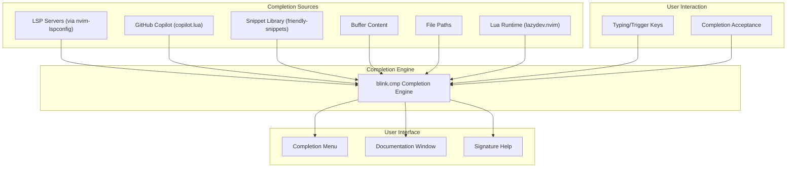
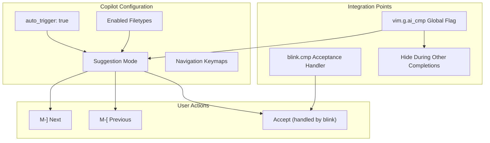
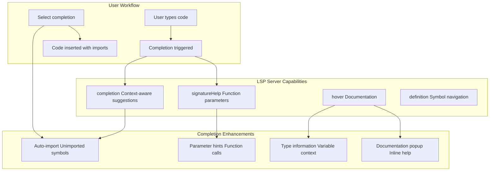
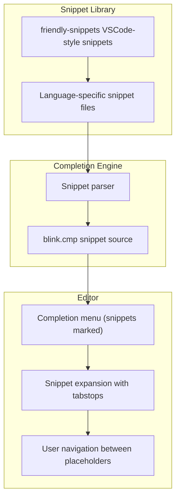
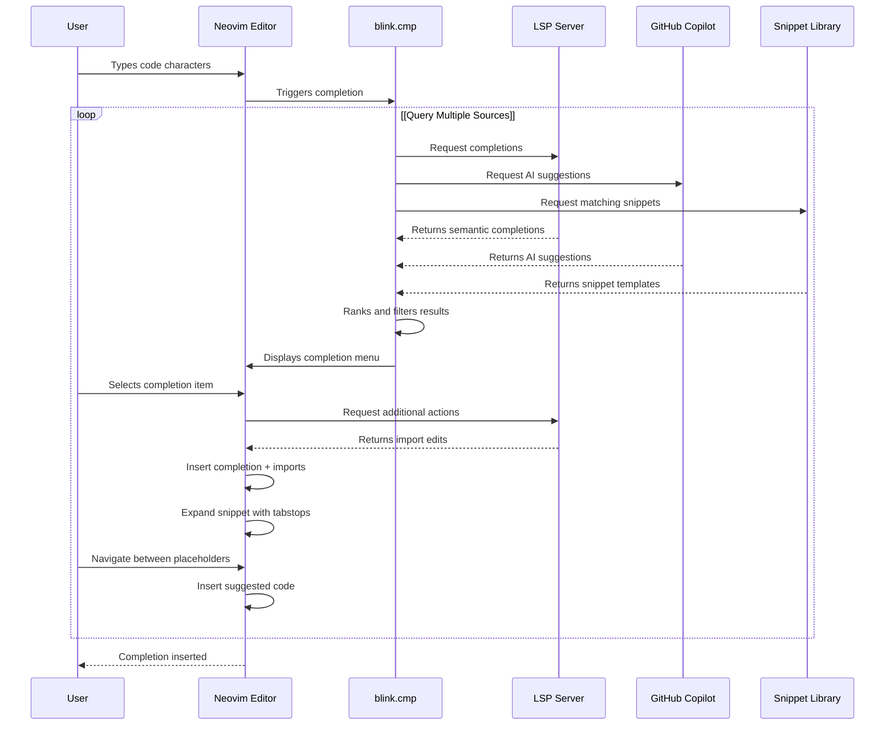

[/](/)

[/search](/search)

[/wiki](/wiki)

[/settings/members](/settings/members)

[/settings/support](/settings/support)

[Add repo](/repositories)

[All repos](/wiki)

[backend](/wiki/Klaudioz/backend)

[BH-Workflow-Engine](/wiki/Klaudioz/BH-Workflow-Engine)

[Buckhead_CRM](/wiki/Klaudioz/Buckhead_CRM)

[dotfiles](/wiki/Klaudioz/dotfiles)

[frontend](/wiki/Klaudioz/frontend)

[godeep.wiki-jb](/wiki/Klaudioz/godeep.wiki-jb)

[pi-mono-zero](/wiki/Klaudioz/pi-mono-zero)

[VirtualOracle](/wiki/Klaudioz/VirtualOracle)

# Code Intelligence and CompletionLink copied!

> **Relevant source files**
> * [nvim/lazy-lock.json](https://github.com/Klaudioz/dotfiles/blob/2febda55/nvim/lazy-lock.json)
> * [nvim/lua/config/keymaps.lua](https://github.com/Klaudioz/dotfiles/blob/2febda55/nvim/lua/config/keymaps.lua)
> * [nvim/lua/plugins/copilot.lua](https://github.com/Klaudioz/dotfiles/blob/2febda55/nvim/lua/plugins/copilot.lua)
> * [nvim/lua/plugins/go.lua](https://github.com/Klaudioz/dotfiles/blob/2febda55/nvim/lua/plugins/go.lua)

## Purpose and ScopeLink copied!

This page documents the code intelligence and completion infrastructure in Neovim, which provides context-aware code suggestions, AI-assisted coding, and snippet management. The completion system integrates multiple sources including Language Server Protocol (LSP) servers, AI models, and snippet libraries to deliver intelligent code completion.

For LSP server configuration and installation, see [Language Server Protocol (LSP)](#4.3). For broader AI-assisted development features beyond completion, see [AI-Assisted Development](#7.4).

## Completion System ArchitectureLink copied!

The completion system is built around `blink.cmp` as the central completion engine, which aggregates suggestions from multiple sources and presents them in a unified interface.

**Sources:** [nvim/lazy-lock.json L5](https://github.com/Klaudioz/dotfiles/blob/2febda55/nvim/lazy-lock.json#L5-L5)

 [nvim/lazy-lock.json L10](https://github.com/Klaudioz/dotfiles/blob/2febda55/nvim/lazy-lock.json#L10-L10)

 [nvim/lazy-lock.json L12](https://github.com/Klaudioz/dotfiles/blob/2febda55/nvim/lazy-lock.json#L12-L12)

 [nvim/lazy-lock.json L18](https://github.com/Klaudioz/dotfiles/blob/2febda55/nvim/lazy-lock.json#L18-L18)

## blink.cmp Completion EngineLink copied!

`blink.cmp` serves as the primary completion engine, replacing traditional completion frameworks. It is configured through the LazyVim plugin system and locked at a specific version for stability.

| Component | Version/Commit | Purpose |
| --- | --- | --- |
| `blink.cmp` | `bae4bae0eedd1fa55f34b685862e94a222d5c6f8` | Core completion engine providing fuzzy matching, filtering, and UI |
| `friendly-snippets` | `572f5660cf05f8cd8834e096d7b4c921ba18e175` | VSCode-style snippet collection for multiple languages |
| `lazydev.nvim` | `2367a6c0a01eb9edb0464731cc0fb61ed9ab9d2c` | Lua development enhancements with proper type information |

The completion engine integrates seamlessly with LazyVim's existing keybindings and provides a fast, asynchronous completion experience with minimal latency.

**Sources:** [nvim/lazy-lock.json L5](https://github.com/Klaudioz/dotfiles/blob/2febda55/nvim/lazy-lock.json#L5-L5)

 [nvim/lazy-lock.json L12](https://github.com/Klaudioz/dotfiles/blob/2febda55/nvim/lazy-lock.json#L12-L12)

 [nvim/lazy-lock.json L18](https://github.com/Klaudioz/dotfiles/blob/2febda55/nvim/lazy-lock.json#L18-L18)

## AI-Assisted CompletionLink copied!

The configuration includes two AI-powered completion sources that provide context-aware code suggestions based on machine learning models.

### GitHub Copilot IntegrationLink copied!

GitHub Copilot is integrated through `copilot.lua`, providing inline code suggestions as you type. The configuration enables conditional behavior based on the `vim.g.ai_cmp` global variable.

**Configuration Details:**

| Setting | Value | Purpose |
| --- | --- | --- |
| `suggestion.enabled` | `not vim.g.ai_cmp` | Toggles suggestion mode based on completion mode |
| `suggestion.auto_trigger` | `true` | Automatically shows suggestions while typing |
| `suggestion.hide_during_completion` | `vim.g.ai_cmp` | Hides Copilot when other completion is active |
| `suggestion.keymap.accept` | `false` | Acceptance delegated to blink.cmp |
| `suggestion.keymap.next` | `<M-]>` | Navigate to next suggestion |
| `suggestion.keymap.prev` | `<M-<FileRef file-url="https://github.com/Klaudioz/dotfiles/blob/2febda55/>` | Navigate to previous suggestion |

### Codeium IntegrationLink copied!

In addition to Copilot, the repository includes support for Codeium, an alternative AI coding assistant. Codeium is available as a plugin option and can be used alongside or instead of Copilot.

**Sources:** [nvim/lazy-lock.json L1-L54](https://github.com/Klaudioz/dotfiles/blob/2febda55/nvim/lazy-lock.json#L1-L54)

## LSP-Powered Code IntelligenceLink copied!

Language Server Protocol servers provide semantic code intelligence, including context-aware completions, function signatures, and import suggestions. The completion system automatically queries active LSP servers for suggestions.

### LSP Completion FeaturesLink copied!

### Language-Specific Intelligence: Go ExampleLink copied!

The Go language configuration demonstrates advanced LSP-powered completion features through `gopls` (Go language server).

**gopls Completion Configuration:**

| Setting | Value | Purpose |
| --- | --- | --- |
| `completeUnimported` | `true` | Suggests completions for packages not yet imported, automatically adding import statements |
| `usePlaceholders` | `true` | Inserts parameter placeholders in function call completions |
| `analyses.unusedparams` | `true` | Analyzes and reports unused parameters for better code quality |
| `staticcheck` | `true` | Enables advanced static analysis during completion |
| `gofumpt` | `true` | Uses stricter formatting rules for code organization |

The `completeUnimported` setting is particularly significant for code intelligence: when you type a function name from an unimported package, `gopls` will suggest the completion and automatically add the appropriate import statement when accepted, streamlining the development workflow.

**Sources:** [nvim/lua/plugins/go.lua L1-L25](https://github.com/Klaudioz/dotfiles/blob/2febda55/nvim/lua/plugins/go.lua#L1-L25)

## Snippet ManagementLink copied!

The completion system includes access to a comprehensive snippet library through `friendly-snippets`, providing pre-defined code templates for common patterns across multiple programming languages.

**Snippet Integration Flow:**

Snippets appear in the completion menu with special indicators and expand into multi-line templates with tabstops, allowing developers to quickly jump between placeholder positions.

**Sources:** [nvim/lazy-lock.json L12](https://github.com/Klaudioz/dotfiles/blob/2febda55/nvim/lazy-lock.json#L12-L12)

## Lua Development EnhancementLink copied!

For Neovim Lua configuration and plugin development, `lazydev.nvim` provides enhanced completion with proper type information for the Neovim API.

**lazydev.nvim Benefits:**

* Complete Neovim API documentation in completion items
* Type information for `vim.*` functions and tables
* Plugin development support with proper module resolution
* Integration with the Lua language server for accurate completions

This ensures that when editing Neovim configuration files (like the plugins in this repository), developers receive accurate, context-aware completions with full API documentation.

**Sources:** [nvim/lazy-lock.json L18](https://github.com/Klaudioz/dotfiles/blob/2febda55/nvim/lazy-lock.json#L18-L18)

## Completion WorkflowLink copied!

The typical completion workflow integrates all sources into a seamless development experience:

This workflow ensures that regardless of the completion source, the user experience remains consistent, with the completion engine handling ranking, filtering, and presentation while respecting the unique characteristics of each source (auto-imports for LSP, tabstops for snippets, multi-line for AI).

**Sources:** [nvim/lazy-lock.json L5](https://github.com/Klaudioz/dotfiles/blob/2febda55/nvim/lazy-lock.json#L5-L5)

 [nvim/lazy-lock.json L10](https://github.com/Klaudioz/dotfiles/blob/2febda55/nvim/lazy-lock.json#L10-L10)

 [nvim/lazy-lock.json L37](https://github.com/Klaudioz/dotfiles/blob/2febda55/nvim/lazy-lock.json#L37-L37)

 [nvim/lua/plugins/copilot.lua L1-L21](https://github.com/Klaudioz/dotfiles/blob/2febda55/nvim/lua/plugins/copilot.lua#L1-L21)

## Integration with LazyVimLink copied!

The completion system is built on top of LazyVim's foundation, inheriting sensible defaults while allowing customization through plugin configurations. LazyVim provides:

* Pre-configured completion keybindings (Tab/Enter for acceptance, navigation keys)
* Integration with the UI theme and status line
* Lazy-loading of completion components for fast startup
* Compatibility with other LazyVim plugins (LSP, DAP, formatting)

Custom configurations in [nvim/lua/plugins/copilot.lua L1-L21](https://github.com/Klaudioz/dotfiles/blob/2febda55/nvim/lua/plugins/copilot.lua#L1-L21)

 and [nvim/lua/plugins/go.lua L1-L25](https://github.com/Klaudioz/dotfiles/blob/2febda55/nvim/lua/plugins/go.lua#L1-L25)

 extend LazyVim's defaults without replacing the entire completion system, following the LazyVim plugin extension pattern.

**Sources:** [nvim/lazy-lock.json L2](https://github.com/Klaudioz/dotfiles/blob/2febda55/nvim/lazy-lock.json#L2-L2)

 [nvim/lua/plugins/copilot.lua L1-L21](https://github.com/Klaudioz/dotfiles/blob/2febda55/nvim/lua/plugins/copilot.lua#L1-L21)

 [nvim/lua/plugins/go.lua L1-L25](https://github.com/Klaudioz/dotfiles/blob/2febda55/nvim/lua/plugins/go.lua#L1-L25)

## Plugin Version ManagementLink copied!

All completion-related plugins are locked to specific versions through `lazy-lock.json`, ensuring reproducible behavior across installations:

| Plugin | Locked Commit | Purpose in Completion |
| --- | --- | --- |
| `blink.cmp` | `bae4bae0eed...` | Core completion engine |
| `copilot.lua` | `81d289a8ce5...` | GitHub Copilot integration |
| `friendly-snippets` | `572f5660cf0...` | Snippet library |
| `lazydev.nvim` | `2367a6c0a01...` | Lua API completions |
| `nvim-lspconfig` | `c8b90ae5cbe...` | LSP server configurations |

This version locking prevents breaking changes from upstream plugins and ensures that the completion system behaves consistently across different machines and time periods. To update plugins, modify `lazy-lock.json` or run the LazyVim update command.

**Sources:** [nvim/lazy-lock.json L5](https://github.com/Klaudioz/dotfiles/blob/2febda55/nvim/lazy-lock.json#L5-L5)

 [nvim/lazy-lock.json L10](https://github.com/Klaudioz/dotfiles/blob/2febda55/nvim/lazy-lock.json#L10-L10)

 [nvim/lazy-lock.json L12](https://github.com/Klaudioz/dotfiles/blob/2febda55/nvim/lazy-lock.json#L12-L12)

 [nvim/lazy-lock.json L18](https://github.com/Klaudioz/dotfiles/blob/2febda55/nvim/lazy-lock.json#L18-L18)

 [nvim/lazy-lock.json L37](https://github.com/Klaudioz/dotfiles/blob/2febda55/nvim/lazy-lock.json#L37-L37)

Refresh this wiki

Last indexed: 18 December 2025 ([2febda](https://github.com/Klaudioz/dotfiles/commit/2febda55))

### On this page

* [Code Intelligence and Completion](#4.6-code-intelligence-and-completion)
* [Purpose and Scope](#4.6-purpose-and-scope)
* [Completion System Architecture](#4.6-completion-system-architecture)
* [blink.cmp Completion Engine](#4.6-blinkcmp-completion-engine)
* [AI-Assisted Completion](#4.6-ai-assisted-completion)
* [GitHub Copilot Integration](#4.6-github-copilot-integration)
* [Codeium Integration](#4.6-codeium-integration)
* [LSP-Powered Code Intelligence](#4.6-lsp-powered-code-intelligence)
* [LSP Completion Features](#4.6-lsp-completion-features)
* [Language-Specific Intelligence: Go Example](#4.6-language-specific-intelligence-go-example)
* [Snippet Management](#4.6-snippet-management)
* [Lua Development Enhancement](#4.6-lua-development-enhancement)
* [Completion Workflow](#4.6-completion-workflow)
* [Integration with LazyVim](#4.6-integration-with-lazyvim)
* [Plugin Version Management](#4.6-plugin-version-management)

Ask Devin about dotfiles

  

Syntax error in text

mermaid version 11.4.1

Syntax error in text

mermaid version 11.4.1