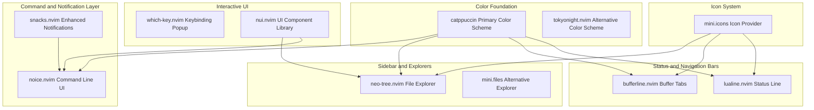
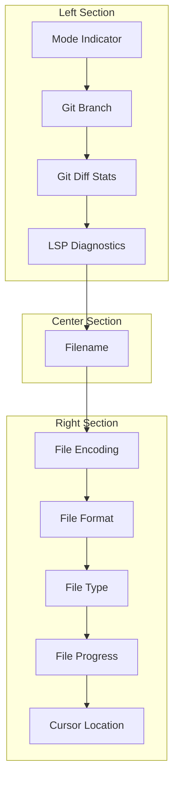
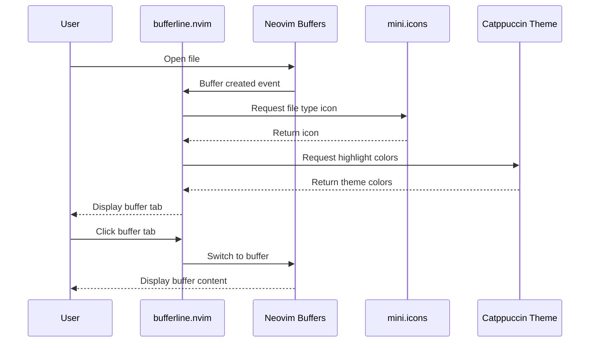
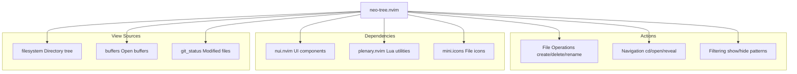
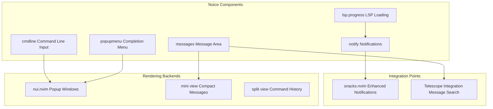
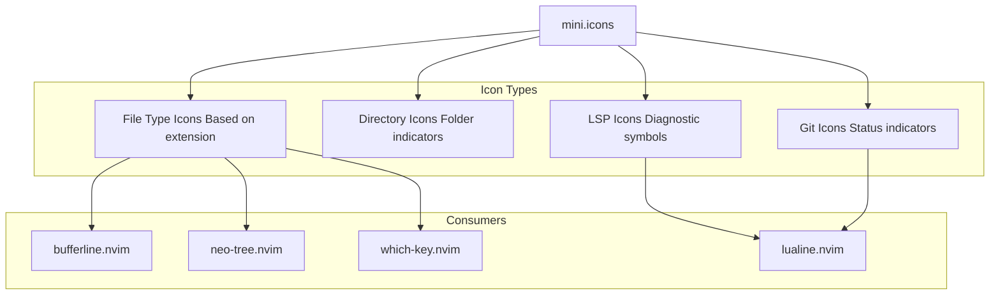
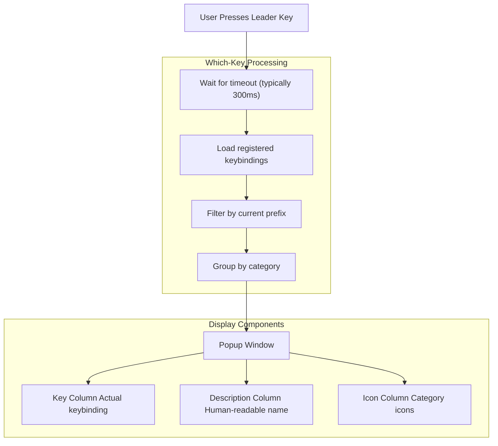
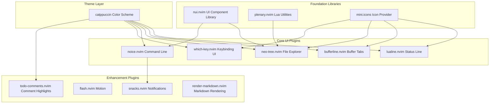

[/](/)

[/search](/search)

[/wiki](/wiki)

[/settings/members](/settings/members)

[/settings/support](/settings/support)

[Add repo](/repositories)

[All repos](/wiki)

[backend](/wiki/Klaudioz/backend)

[BH-Workflow-Engine](/wiki/Klaudioz/BH-Workflow-Engine)

[Buckhead_CRM](/wiki/Klaudioz/Buckhead_CRM)

[dotfiles](/wiki/Klaudioz/dotfiles)

[frontend](/wiki/Klaudioz/frontend)

[godeep.wiki-jb](/wiki/Klaudioz/godeep.wiki-jb)

[pi-mono-zero](/wiki/Klaudioz/pi-mono-zero)

[VirtualOracle](/wiki/Klaudioz/VirtualOracle)

# UI and Visual CustomizationLink copied!

> **Relevant source files**
> * [nvim/lazy-lock.json](https://github.com/Klaudioz/dotfiles/blob/2febda55/nvim/lazy-lock.json)

## Purpose and ScopeLink copied!

This document covers the visual and user interface customization layer of the Neovim configuration (importance 31.22). It details the plugins and configurations that control the editor's appearance, including color schemes, status line, buffer tabs, file explorers, notification systems, and icon themes. These components create a modern, aesthetically pleasing development environment with consistent visual feedback.

For core Neovim initialization and plugin management, see [Bootstrap and Initialization](#4.1). For the complete plugin ecosystem overview, see [Plugin Ecosystem](#4.2). For keybinding-related functionality, see [Keybindings and Mappings](#4.5).

---

## UI Plugin ArchitectureLink copied!

The UI customization layer consists of multiple specialized plugins that work together to create a cohesive visual experience. These plugins are managed by `lazy.nvim` and their versions are locked in `lazy-lock.json`.

### UI Component OrganizationLink copied!

**Sources:** [nvim/lazy-lock.json L1-L54](https://github.com/Klaudioz/dotfiles/blob/2febda55/nvim/lazy-lock.json#L1-L54)

---

## Color SchemesLink copied!

The configuration includes two primary color schemes: Catppuccin (primary) and TokyoNight (alternative). Both provide dark themes optimized for extended coding sessions.

### Catppuccin ThemeLink copied!

Catppuccin is the primary color scheme, using the Mocha variant (dark theme with warm tones). It integrates with multiple plugins to provide consistent theming across the entire editor.

#### Catppuccin Integration Table

| Component | Integration Method | Purpose |
| --- | --- | --- |
| `lualine.nvim` | Theme module | Status line colors |
| `bufferline.nvim` | Highlight groups | Buffer tab colors |
| `neo-tree.nvim` | Highlight groups | File explorer colors |
| `noice.nvim` | Highlight groups | Command line colors |
| `snacks.nvim` | Highlight groups | Notification colors |
| `which-key.nvim` | Highlight groups | Keybinding popup colors |

The Catppuccin plugin is locked at commit `30fa4d122d9b22ad8b2e0ab1b533c8c26c4dde86` in [nvim/lazy-lock.json L7](https://github.com/Klaudioz/dotfiles/blob/2febda55/nvim/lazy-lock.json#L7-L7)

### TokyoNight ThemeLink copied!

TokyoNight provides an alternative dark color scheme with cooler tones and high contrast. It's available as a secondary theme option.

The TokyoNight plugin is locked at commit `057ef5d260c1931f1dffd0f052c685dcd14100a3` in [nvim/lazy-lock.json L48](https://github.com/Klaudioz/dotfiles/blob/2febda55/nvim/lazy-lock.json#L48-L48)

**Sources:** [nvim/lazy-lock.json L7](https://github.com/Klaudioz/dotfiles/blob/2febda55/nvim/lazy-lock.json#L7-L7)

 [nvim/lazy-lock.json L48](https://github.com/Klaudioz/dotfiles/blob/2febda55/nvim/lazy-lock.json#L48-L48)

---

## Status Line ConfigurationLink copied!

The status line is implemented using `lualine.nvim`, providing contextual information about the current file, editor mode, LSP status, and Git integration.

### Lualine Component StructureLink copied!

### Lualine FeaturesLink copied!

* **Mode Display**: Visual indicator for Normal, Insert, Visual, Command modes
* **Git Integration**: Branch name and diff statistics (+/-/~)
* **LSP Diagnostics**: Error, warning, info, hint counts with icons
* **File Information**: Encoding, format, file type
* **Navigation**: Line/column position and file progress percentage
* **Theming**: Uses Catppuccin color palette for consistent appearance

The lualine plugin is locked at commit `b8c23159c0161f4b89196f74ee3a6d02cdc3a955` in [nvim/lazy-lock.json L19](https://github.com/Klaudioz/dotfiles/blob/2febda55/nvim/lazy-lock.json#L19-L19)

**Sources:** [nvim/lazy-lock.json L19](https://github.com/Klaudioz/dotfiles/blob/2febda55/nvim/lazy-lock.json#L19-L19)

---

## Buffer LineLink copied!

The buffer line is implemented using `bufferline.nvim`, providing a tab-like interface for managing open buffers at the top of the editor.

### Buffer Line FeaturesLink copied!

| Feature | Description |
| --- | --- |
| **Tab Style** | Visual tabs for each open buffer |
| **Modified Indicator** | Shows unsaved changes with visual marker |
| **Close Buttons** | Individual close buttons per buffer |
| **Buffer Numbers** | Optional buffer numbers for quick navigation |
| **Separator Style** | Configurable separator characters |
| **Diagnostics** | LSP diagnostic counts in buffer tabs |
| **Sorting** | Sort by buffer number, extension, or directory |
| **Grouping** | Pin important buffers to the left |

### Buffer Line Integration FlowLink copied!

The bufferline plugin is locked at commit `655133c3b4c3e5e05ec549b9f8cc2894ac6f51b3` in [nvim/lazy-lock.json L6](https://github.com/Klaudioz/dotfiles/blob/2febda55/nvim/lazy-lock.json#L6-L6)

**Sources:** [nvim/lazy-lock.json L6](https://github.com/Klaudioz/dotfiles/blob/2febda55/nvim/lazy-lock.json#L6-L6)

 [nvim/lazy-lock.json L26](https://github.com/Klaudioz/dotfiles/blob/2febda55/nvim/lazy-lock.json#L26-L26)

---

## File ExplorerLink copied!

The primary file explorer is `neo-tree.nvim`, a modern file tree implementation with multiple view modes and rich features.

### Neo-Tree ViewsLink copied!

Neo-Tree provides three distinct view modes accessible from a single interface:

| View Mode | Key | Purpose |
| --- | --- | --- |
| **Filesystem** | Default | Browse and manage files/directories |
| **Buffers** | Toggle | List all open buffers |
| **Git Status** | Toggle | Show Git-tracked changes |

### Neo-Tree File System ArchitectureLink copied!

### Neo-Tree FeaturesLink copied!

* **Window Management**: Floating window or sidebar placement
* **File Operations**: Create, delete, rename, copy, move files/directories
* **Git Integration**: Visual indicators for modified, staged, untracked files
* **Filtering**: Hide/show dotfiles, gitignored files, custom patterns
* **Search**: Fuzzy find files within the tree
* **Icons**: File type icons from `mini.icons`
* **Theming**: Catppuccin highlight groups for consistent colors

The neo-tree plugin is locked at commit `ed057048a281b418d5318dd5153f9486daa517a3` in [nvim/lazy-lock.json L29](https://github.com/Klaudioz/dotfiles/blob/2febda55/nvim/lazy-lock.json#L29-L29)

### Mini.Files AlternativeLink copied!

`mini.files` provides a minimalist alternative file explorer with a different interaction model focusing on simplicity.

The mini.files plugin is locked at commit `34a730a6bdb09c3e6755fe34b20a78a5d81d21c4` in [nvim/lazy-lock.json L25](https://github.com/Klaudioz/dotfiles/blob/2febda55/nvim/lazy-lock.json#L25-L25)

**Sources:** [nvim/lazy-lock.json L29](https://github.com/Klaudioz/dotfiles/blob/2febda55/nvim/lazy-lock.json#L29-L29)

 [nvim/lazy-lock.json L25](https://github.com/Klaudioz/dotfiles/blob/2febda55/nvim/lazy-lock.json#L25-L25)

 [nvim/lazy-lock.json L31](https://github.com/Klaudioz/dotfiles/blob/2febda55/nvim/lazy-lock.json#L31-L31)

 [nvim/lazy-lock.json L44](https://github.com/Klaudioz/dotfiles/blob/2febda55/nvim/lazy-lock.json#L44-L44)

 [nvim/lazy-lock.json L26](https://github.com/Klaudioz/dotfiles/blob/2febda55/nvim/lazy-lock.json#L26-L26)

---

## Command Line and NotificationsLink copied!

The command line interface is enhanced by `noice.nvim`, which completely replaces Neovim's default command line, messages, and notification system with a modern UI.

### Noice Component ArchitectureLink copied!

### Noice FeaturesLink copied!

| Feature | Description |
| --- | --- |
| **Command Line** | Popup-style command input with syntax highlighting |
| **Completions** | Enhanced completion menu with documentation |
| **Messages** | Scrollable message history with search |
| **Notifications** | Desktop-style notifications for long operations |
| **LSP Progress** | Progress indicators for LSP initialization |
| **Search** | Searchable message and command history |
| **Routing** | Configurable message routing to different views |

The noice plugin is locked at commit `0427460c2d7f673ad60eb02b35f5e9926cf67c59` in [nvim/lazy-lock.json L30](https://github.com/Klaudioz/dotfiles/blob/2febda55/nvim/lazy-lock.json#L30-L30)

### Snacks.nvim EnhancementsLink copied!

`snacks.nvim` provides additional UI enhancements including improved notification styling and dashboard functionality.

The snacks plugin is locked at commit `bc0630e43be5699bb94dadc302c0d21615421d93` in [nvim/lazy-lock.json L46](https://github.com/Klaudioz/dotfiles/blob/2febda55/nvim/lazy-lock.json#L46-L46)

**Sources:** [nvim/lazy-lock.json L30](https://github.com/Klaudioz/dotfiles/blob/2febda55/nvim/lazy-lock.json#L30-L30)

 [nvim/lazy-lock.json L31](https://github.com/Klaudioz/dotfiles/blob/2febda55/nvim/lazy-lock.json#L31-L31)

 [nvim/lazy-lock.json L46](https://github.com/Klaudioz/dotfiles/blob/2febda55/nvim/lazy-lock.json#L46-L46)

---

## Icon SystemLink copied!

Icons throughout the editor are provided by `mini.icons`, a lightweight icon plugin that supplies file type icons, UI element icons, and status indicators.

### Icon CategoriesLink copied!

### Icon Integration PointsLink copied!

* **Buffer Line**: File type icons in buffer tabs
* **Neo-Tree**: File/folder icons in the explorer
* **Lualine**: Diagnostic and Git status icons
* **Which-Key**: Icons for keybinding categories
* **Completion Menu**: Icons in completion suggestions

The mini.icons plugin is locked at commit `f9a177c11daa7829389b7b6eaaec8b8a5c47052d` in [nvim/lazy-lock.json L26](https://github.com/Klaudioz/dotfiles/blob/2febda55/nvim/lazy-lock.json#L26-L26)

**Sources:** [nvim/lazy-lock.json L26](https://github.com/Klaudioz/dotfiles/blob/2febda55/nvim/lazy-lock.json#L26-L26)

---

## Keybinding UILink copied!

`which-key.nvim` provides an interactive popup that displays available keybindings when you start typing a key sequence. This serves both as a learning tool and quick reference.

### Which-Key Display ModelLink copied!

### Which-Key FeaturesLink copied!

| Feature | Description |
| --- | --- |
| **Category Grouping** | Organizes bindings by prefix (e.g., `<leader>g` for Git) |
| **Icons** | Visual icons for command categories |
| **Descriptions** | Human-readable descriptions for each binding |
| **Nested Menus** | Multi-level key sequences show progressively |
| **Filtering** | Type ahead to filter displayed options |
| **Theming** | Catppuccin-themed popup window |
| **Registration** | API for plugins to register their bindings |

### Common Which-Key PrefixesLink copied!

* `<leader>b` - Buffer operations
* `<leader>c` - Code actions (LSP)
* `<leader>f` - Find/search operations
* `<leader>g` - Git operations
* `<leader>s` - Session management
* `<leader>u` - UI toggles
* `<leader>x` - Diagnostics and quickfix

The which-key plugin is locked at commit `370ec46f710e058c9c1646273e6b225acf47cbed` in [nvim/lazy-lock.json L52](https://github.com/Klaudioz/dotfiles/blob/2febda55/nvim/lazy-lock.json#L52-L52)

**Sources:** [nvim/lazy-lock.json L52](https://github.com/Klaudioz/dotfiles/blob/2febda55/nvim/lazy-lock.json#L52-L52)

---

## Additional Visual EnhancementsLink copied!

Several smaller plugins contribute to the overall visual experience:

### Render MarkdownLink copied!

`render-markdown.nvim` provides enhanced markdown rendering with proper formatting, code block highlighting, and table rendering.

The render-markdown plugin is locked at commit `95994ad668786cd75d0ee6d0b7178bce7c3ca146` in [nvim/lazy-lock.json L45](https://github.com/Klaudioz/dotfiles/blob/2febda55/nvim/lazy-lock.json#L45-L45)

### Todo CommentsLink copied!

`todo-comments.nvim` highlights TODO, FIXME, NOTE, and other comment annotations with distinctive colors and provides search functionality.

The todo-comments plugin is locked at commit `304a8d204ee787d2544d8bc23cd38d2f929e7cc5` in [nvim/lazy-lock.json L47](https://github.com/Klaudioz/dotfiles/blob/2febda55/nvim/lazy-lock.json#L47-L47)

### Flash.nvimLink copied!

`flash.nvim` provides enhanced motion with search labels, allowing quick jumps to any visible location.

The flash plugin is locked at commit `3c942666f115e2811e959eabbdd361a025db8b63` in [nvim/lazy-lock.json L11](https://github.com/Klaudioz/dotfiles/blob/2febda55/nvim/lazy-lock.json#L11-L11)

### CodeSnapLink copied!

`codesnap.nvim` creates beautiful code screenshots with syntax highlighting and window chrome, useful for documentation and sharing.

The codesnap plugin is locked at commit `be6d6b9a3b5e6999edbda76b16dace03d9bfcd3d` in [nvim/lazy-lock.json L8](https://github.com/Klaudioz/dotfiles/blob/2febda55/nvim/lazy-lock.json#L8-L8)

**Sources:** [nvim/lazy-lock.json L45](https://github.com/Klaudioz/dotfiles/blob/2febda55/nvim/lazy-lock.json#L45-L45)

 [nvim/lazy-lock.json L47](https://github.com/Klaudioz/dotfiles/blob/2febda55/nvim/lazy-lock.json#L47-L47)

 [nvim/lazy-lock.json L11](https://github.com/Klaudioz/dotfiles/blob/2febda55/nvim/lazy-lock.json#L11-L11)

 [nvim/lazy-lock.json L8](https://github.com/Klaudioz/dotfiles/blob/2febda55/nvim/lazy-lock.json#L8-L8)

---

## UI Plugin Dependency GraphLink copied!

**Sources:** [nvim/lazy-lock.json L1-L54](https://github.com/Klaudioz/dotfiles/blob/2febda55/nvim/lazy-lock.json#L1-L54)

---

## SummaryLink copied!

The UI and visual customization layer creates a cohesive, modern development environment through carefully selected plugins:

* **Color Foundation**: Catppuccin and TokyoNight provide consistent theming
* **Information Display**: Lualine and Bufferline show contextual information
* **File Management**: Neo-tree provides comprehensive file exploration
* **Command Interface**: Noice modernizes command input and messages
* **Icons**: Mini.icons provides consistent iconography
* **Keybinding Help**: Which-key offers interactive keybinding discovery

All plugins are version-locked via `lazy-lock.json` to ensure reproducibility and are themed consistently using Catppuccin color palette. The UI layer integrates seamlessly with LSP, Git, and other development tools documented in other sections.

**Sources:** [nvim/lazy-lock.json L1-L54](https://github.com/Klaudioz/dotfiles/blob/2febda55/nvim/lazy-lock.json#L1-L54)

Refresh this wiki

Last indexed: 18 December 2025 ([2febda](https://github.com/Klaudioz/dotfiles/commit/2febda55))

### On this page

* [UI and Visual Customization](#4.7-ui-and-visual-customization)
* [Purpose and Scope](#4.7-purpose-and-scope)
* [UI Plugin Architecture](#4.7-ui-plugin-architecture)
* [UI Component Organization](#4.7-ui-component-organization)
* [Color Schemes](#4.7-color-schemes)
* [Catppuccin Theme](#4.7-catppuccin-theme)
* [TokyoNight Theme](#4.7-tokyonight-theme)
* [Status Line Configuration](#4.7-status-line-configuration)
* [Lualine Component Structure](#4.7-lualine-component-structure)
* [Lualine Features](#4.7-lualine-features)
* [Buffer Line](#4.7-buffer-line)
* [Buffer Line Features](#4.7-buffer-line-features)
* [Buffer Line Integration Flow](#4.7-buffer-line-integration-flow)
* [File Explorer](#4.7-file-explorer)
* [Neo-Tree Views](#4.7-neo-tree-views)
* [Neo-Tree File System Architecture](#4.7-neo-tree-file-system-architecture)
* [Neo-Tree Features](#4.7-neo-tree-features)
* [Mini.Files Alternative](#4.7-minifiles-alternative)
* [Command Line and Notifications](#4.7-command-line-and-notifications)
* [Noice Component Architecture](#4.7-noice-component-architecture)
* [Noice Features](#4.7-noice-features)
* [Snacks.nvim Enhancements](#4.7-snacksnvim-enhancements)
* [Icon System](#4.7-icon-system)
* [Icon Categories](#4.7-icon-categories)
* [Icon Integration Points](#4.7-icon-integration-points)
* [Keybinding UI](#4.7-keybinding-ui)
* [Which-Key Display Model](#4.7-which-key-display-model)
* [Which-Key Features](#4.7-which-key-features)
* [Common Which-Key Prefixes](#4.7-common-which-key-prefixes)
* [Additional Visual Enhancements](#4.7-additional-visual-enhancements)
* [Render Markdown](#4.7-render-markdown)
* [Todo Comments](#4.7-todo-comments)
* [Flash.nvim](#4.7-flashnvim)
* [CodeSnap](#4.7-codesnap)
* [UI Plugin Dependency Graph](#4.7-ui-plugin-dependency-graph)
* [Summary](#4.7-summary)

Ask Devin about dotfiles

  

Syntax error in text

mermaid version 11.4.1

Syntax error in text

mermaid version 11.4.1