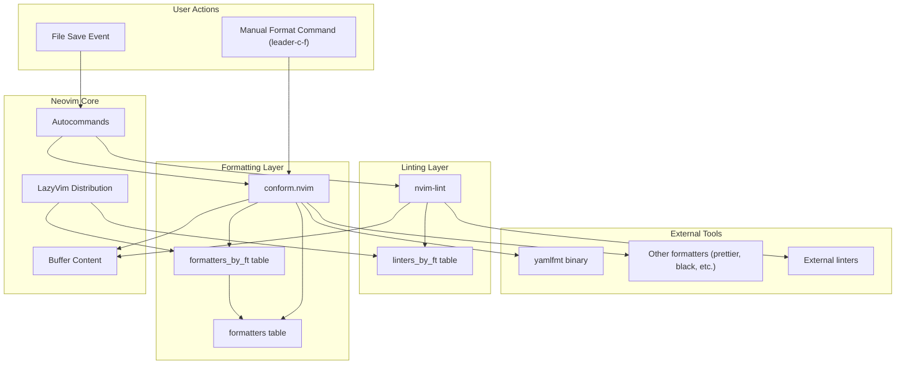
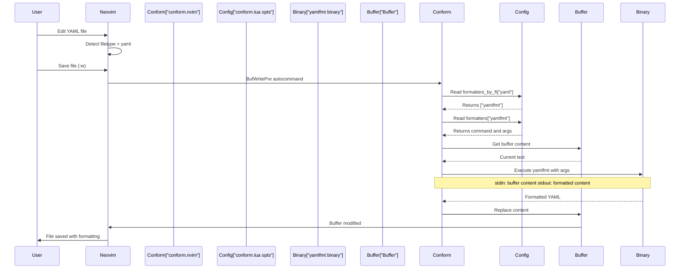
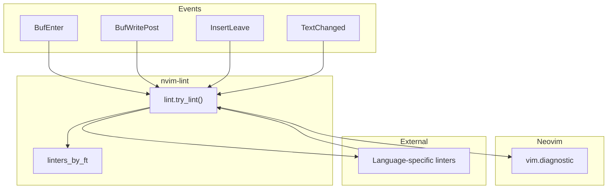
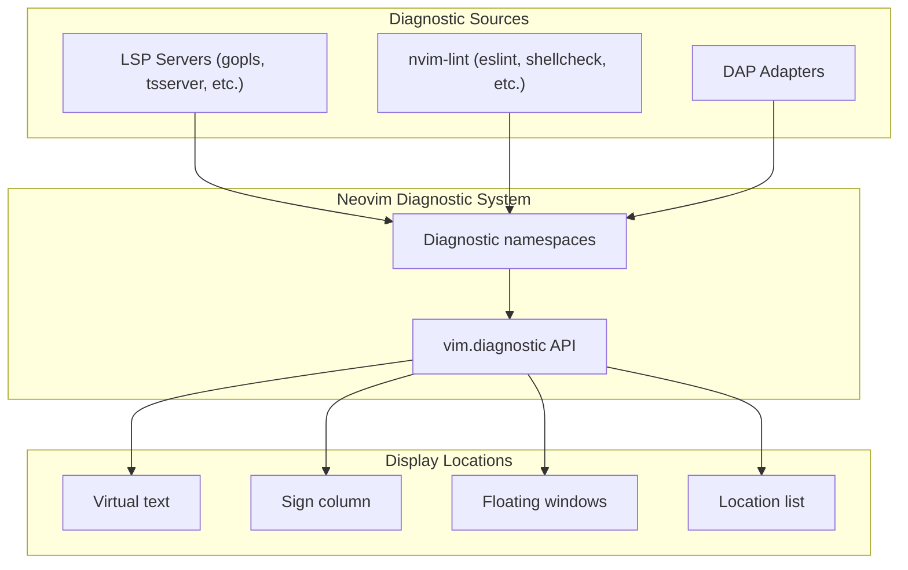

[/](/)

[/search](/search)

[/wiki](/wiki)

[/settings/members](/settings/members)

[/settings/support](/settings/support)

[Add repo](/repositories)

[All repos](/wiki)

[backend](/wiki/Klaudioz/backend)

[BH-Workflow-Engine](/wiki/Klaudioz/BH-Workflow-Engine)

[Buckhead_CRM](/wiki/Klaudioz/Buckhead_CRM)

[dotfiles](/wiki/Klaudioz/dotfiles)

[frontend](/wiki/Klaudioz/frontend)

[godeep.wiki-jb](/wiki/Klaudioz/godeep.wiki-jb)

[pi-mono-zero](/wiki/Klaudioz/pi-mono-zero)

[VirtualOracle](/wiki/Klaudioz/VirtualOracle)

# Code Formatting and LintingLink copied!

> **Relevant source files**
> * [nvim/lua/plugins/codesnap.lua](https://github.com/Klaudioz/dotfiles/blob/2febda55/nvim/lua/plugins/codesnap.lua)
> * [nvim/lua/plugins/conform.lua](https://github.com/Klaudioz/dotfiles/blob/2febda55/nvim/lua/plugins/conform.lua)
> * [nvim/lua/plugins/windsurf.lua](https://github.com/Klaudioz/dotfiles/blob/2febda55/nvim/lua/plugins/windsurf.lua)

This document covers the code quality automation tools configured in the Neovim environment, focusing on **conform.nvim** for automatic code formatting and **nvim-lint** for diagnostics. These tools provide language-agnostic interfaces for integrating external formatters and linters, ensuring consistent code style and catching potential issues during development. For broader code intelligence features including LSP diagnostics, see [Language Server Protocol (LSP)](#4.3). For completion and AI-assisted coding, see [Code Intelligence and Completion](#4.6).

## Purpose and ArchitectureLink copied!

The formatting and linting subsystem operates as part of Neovim's Core Development Tools layer (as shown in the high-level system diagrams). These tools provide:

* **Automatic formatting** via `conform.nvim` with support for format-on-save and manual formatting commands
* **Real-time linting** via `nvim-lint` for displaying diagnostics as you edit
* **Language-specific configurations** allowing per-filetype formatter and linter selection
* **Integration with LazyVim** keybindings and defaults

### System Integration PointsLink copied!



**Sources:** [nvim/lua/plugins/conform.lua L1-L14](https://github.com/Klaudioz/dotfiles/blob/2febda55/nvim/lua/plugins/conform.lua#L1-L14)

## conform.nvim ConfigurationLink copied!

The `conform.nvim` plugin provides the formatting infrastructure. LazyVim includes this plugin by default, and the custom configuration extends it with language-specific overrides.

### Plugin DeclarationLink copied!

The conform.nvim plugin is loaded and configured in [nvim/lua/plugins/conform.lua L1-L14](https://github.com/Klaudioz/dotfiles/blob/2febda55/nvim/lua/plugins/conform.lua#L1-L14)

 The structure follows LazyVim's plugin override pattern:

```
return {  "stevearc/conform.nvim",  opts = { ... }}
```

This extends LazyVim's base conform.nvim configuration rather than replacing it entirely.

### Formatter Selection by FiletypeLink copied!

The `formatters_by_ft` table maps file types to their associated formatters:

| Configuration Key | Location | Purpose |
| --- | --- | --- |
| `formatters_by_ft` | [nvim/lua/plugins/conform.lua L4-L6](https://github.com/Klaudioz/dotfiles/blob/2febda55/nvim/lua/plugins/conform.lua#L4-L6) | Maps filetypes to formatter lists |
| `formatters` | [nvim/lua/plugins/conform.lua L7-L12](https://github.com/Klaudioz/dotfiles/blob/2febda55/nvim/lua/plugins/conform.lua#L7-L12) | Defines custom formatter configurations |

The current configuration overrides YAML formatting:

```
formatters_by_ft = {  yaml = { "yamlfmt" }, -- Replace default with K8s-friendly formatter}
```

This replaces LazyVim's default YAML formatter (likely `prettier`) with `yamlfmt`, which is specifically designed for Kubernetes-style YAML files.

**Sources:** [nvim/lua/plugins/conform.lua L4-L6](https://github.com/Klaudioz/dotfiles/blob/2febda55/nvim/lua/plugins/conform.lua#L4-L6)

### Custom Formatter DefinitionsLink copied!

The `formatters` table provides detailed configuration for individual formatters:

```
formatters = {  yamlfmt = {    command = "yamlfmt",    args = { "-formatter", "basic", "-indentless_arrays=true" },  },}
```

#### yamlfmt Configuration

The `yamlfmt` formatter is configured with specific arguments:

| Argument | Value | Purpose |
| --- | --- | --- |
| `-formatter` | `basic` | Use basic formatting style |
| `-indentless_arrays` | `true` | Format arrays without additional indentation (Kubernetes convention) |

This configuration produces YAML output optimized for Kubernetes manifests and similar structured data, where array items align with their parent key rather than being further indented.

**Sources:** [nvim/lua/plugins/conform.lua L7-L12](https://github.com/Klaudioz/dotfiles/blob/2febda55/nvim/lua/plugins/conform.lua#L7-L12)

## Formatting WorkflowLink copied!

### Execution FlowLink copied!



**Sources:** [nvim/lua/plugins/conform.lua L1-L14](https://github.com/Klaudioz/dotfiles/blob/2febda55/nvim/lua/plugins/conform.lua#L1-L14)

### Manual FormattingLink copied!

LazyVim provides keybindings for manual formatting:

| Keybinding | Mode | Action |
| --- | --- | --- |
| `<leader>cf` | Normal/Visual | Format buffer or selection |
| `<leader>cF` | Normal | Format buffer with options picker |

These commands invoke `conform.nvim`'s formatting functions, which execute the same workflow as format-on-save.

## nvim-lint IntegrationLink copied!

While no custom `nvim-lint` configuration file is present in the provided files, the plugin is referenced in the system architecture. LazyVim includes `nvim-lint` by default with the following behavior:

### Linting Trigger PointsLink copied!



### Linter Configuration PatternLink copied!

The typical nvim-lint configuration structure (used by LazyVim defaults) follows this pattern:

```javascript
-- Not present in custom config, but this is the LazyVim default structurerequire("lint").linters_by_ft = {  javascript = { "eslint" },  typescript = { "eslint" },  python = { "pylint" },  -- etc.}
```

Linters run automatically on buffer events and publish diagnostics to Neovim's diagnostic system, which displays them inline and in the location list.

## Language-Specific Formatter ConfigurationLink copied!

The current configuration includes explicit overrides for specific languages. Future expansions would follow the same pattern.

### YAML FormattingLink copied!

**Formatter:** `yamlfmt`
**Installation:** Via mason.nvim or system package manager
**Configuration:** [nvim/lua/plugins/conform.lua L4-L12](https://github.com/Klaudioz/dotfiles/blob/2febda55/nvim/lua/plugins/conform.lua#L4-L12)

The YAML formatter is specifically configured for Kubernetes-style manifests with indentless arrays. This ensures that:

```
# Before formattingapiVersion: v1kind: Podmetadata:  labels:      app: myapp      tier: frontend
```

Becomes:

```
# After formattingapiVersion: v1kind: Podmetadata:  labels:  - app: myapp  - tier: frontend
```

### Adding Additional FormattersLink copied!

To add formatters for other languages, extend the `formatters_by_ft` table:

```
formatters_by_ft = {  yaml = { "yamlfmt" },  lua = { "stylua" },          -- Add Lua formatter  go = { "goimports", "gofmt" }, -- Multiple formatters run in sequence  python = { "black" },}
```

Custom formatter configurations can be added to the `formatters` table when default behavior needs adjustment.

**Sources:** [nvim/lua/plugins/conform.lua L4-L12](https://github.com/Klaudioz/dotfiles/blob/2febda55/nvim/lua/plugins/conform.lua#L4-L12)

## Integration with MasonLink copied!

While not directly configured in the conform.nvim file, formatters and linters can be automatically installed via mason.nvim (see [Language Server Protocol (LSP)](#4.3) for mason.nvim details). The typical workflow is:

1. Install tool via mason: `:MasonInstall yamlfmt`
2. Configure conform.nvim to use the tool
3. Format-on-save or manual formatting executes the tool

Mason ensures that formatter and linter binaries are available in Neovim's PATH without requiring system-wide installation.

## Formatter and Linter Tool TableLink copied!

This table documents the relationship between file types, formatters, linters, and their configuration locations:

| Language | Formatter(s) | Linter(s) | Config Location | Notes |
| --- | --- | --- | --- | --- |
| YAML | yamlfmt | - | [nvim/lua/plugins/conform.lua L4-L12](https://github.com/Klaudioz/dotfiles/blob/2febda55/nvim/lua/plugins/conform.lua#L4-L12) | K8s-optimized with indentless arrays |
| Lua | stylua | - | LazyVim default | - |
| Markdown | prettier | - | LazyVim default | - |
| JSON | prettier | - | LazyVim default | - |
| Go | goimports, gofumpt | - | LazyVim default | Via LSP and conform |
| Python | black | - | LazyVim default | - |
| TypeScript/JavaScript | prettier | eslint | LazyVim default | ESLint via nvim-lint |

## LazyVim IntegrationLink copied!

LazyVim provides comprehensive defaults for both formatting and linting. The custom configuration in this repository **extends** rather than **replaces** these defaults:

* **Keybindings:** LazyVim's `<leader>cf` and related bindings work automatically
* **Format-on-save:** Enabled by default for most file types
* **LSP integration:** LSP servers can also provide formatting; conform.nvim takes precedence
* **Diagnostic display:** nvim-lint diagnostics appear alongside LSP diagnostics

### Configuration Override StrategyLink copied!

The plugin configuration uses the `opts` key, which merges with LazyVim's defaults:

```
return {  "stevearc/conform.nvim",  opts = {    formatters_by_ft = { ... },  -- Merged with LazyVim defaults    formatters = { ... },         -- Merged with LazyVim defaults  }}
```

This approach preserves LazyVim's default configurations for languages not explicitly overridden.

**Sources:** [nvim/lua/plugins/conform.lua L1-L14](https://github.com/Klaudioz/dotfiles/blob/2febda55/nvim/lua/plugins/conform.lua#L1-L14)

## Diagnostic DisplayLink copied!

Both LSP diagnostics and nvim-lint diagnostics appear in the same Neovim diagnostic system:



Users can navigate diagnostics using LazyVim keybindings:

| Keybinding | Action |
| --- | --- |
| `]d` | Next diagnostic |
| `<FileRef file-url="https://github.com/Klaudioz/dotfiles/blob/2febda55/d` | Previous diagnostic |

Refresh this wiki

Last indexed: 18 December 2025 ([2febda](https://github.com/Klaudioz/dotfiles/commit/2febda55))

### On this page

* [Code Formatting and Linting](#4.8-code-formatting-and-linting)
* [Purpose and Architecture](#4.8-purpose-and-architecture)
* [System Integration Points](#4.8-system-integration-points)
* [conform.nvim Configuration](#4.8-conformnvim-configuration)
* [Plugin Declaration](#4.8-plugin-declaration)
* [Formatter Selection by Filetype](#4.8-formatter-selection-by-filetype)
* [Custom Formatter Definitions](#4.8-custom-formatter-definitions)
* [Formatting Workflow](#4.8-formatting-workflow)
* [Execution Flow](#4.8-execution-flow)
* [Manual Formatting](#4.8-manual-formatting)
* [nvim-lint Integration](#4.8-nvim-lint-integration)
* [Linting Trigger Points](#4.8-linting-trigger-points)
* [Linter Configuration Pattern](#4.8-linter-configuration-pattern)
* [Language-Specific Formatter Configuration](#4.8-language-specific-formatter-configuration)
* [YAML Formatting](#4.8-yaml-formatting)
* [Adding Additional Formatters](#4.8-adding-additional-formatters)
* [Integration with Mason](#4.8-integration-with-mason)
* [Formatter and Linter Tool Table](#4.8-formatter-and-linter-tool-table)
* [LazyVim Integration](#4.8-lazyvim-integration)
* [Configuration Override Strategy](#4.8-configuration-override-strategy)
* [Diagnostic Display](#4.8-diagnostic-display)

Ask Devin about dotfiles

  

Syntax error in text

mermaid version 11.4.1

Syntax error in text

mermaid version 11.4.1