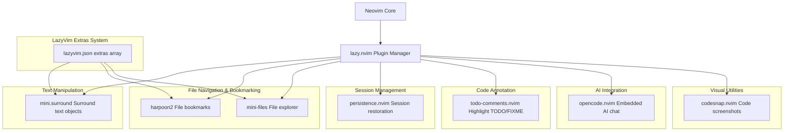
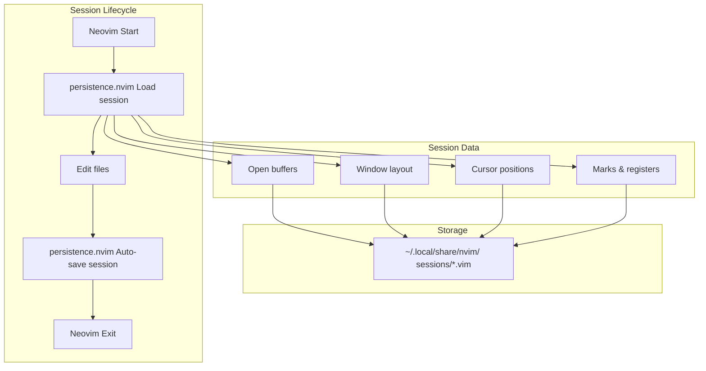
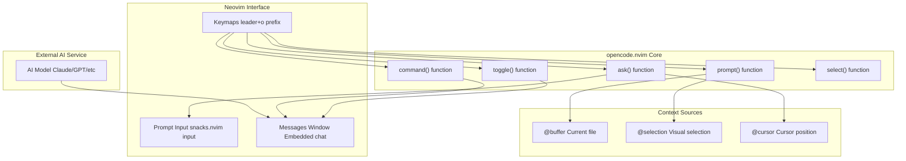
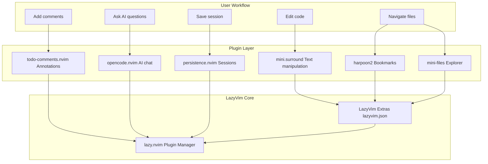

[/](/)

[/search](/search)

[/wiki](/wiki)

[/settings/members](/settings/members)

[/settings/support](/settings/support)

[Add repo](/repositories)

[All repos](/wiki)

[backend](/wiki/Klaudioz/backend)

[BH-Workflow-Engine](/wiki/Klaudioz/BH-Workflow-Engine)

[Buckhead_CRM](/wiki/Klaudioz/Buckhead_CRM)

[dotfiles](/wiki/Klaudioz/dotfiles)

[frontend](/wiki/Klaudioz/frontend)

[godeep.wiki-jb](/wiki/Klaudioz/godeep.wiki-jb)

[pi-mono-zero](/wiki/Klaudioz/pi-mono-zero)

[VirtualOracle](/wiki/Klaudioz/VirtualOracle)

# Additional Plugins and UtilitiesLink copied!

> **Relevant source files**
> * [kindavim/mo.com.sleeplessmind.kindaVim.plist](https://github.com/Klaudioz/dotfiles/blob/2febda55/kindavim/mo.com.sleeplessmind.kindaVim.plist)
> * [nvim/lazyvim.json](https://github.com/Klaudioz/dotfiles/blob/2febda55/nvim/lazyvim.json)
> * [nvim/lua/plugins/opencode.lua](https://github.com/Klaudioz/dotfiles/blob/2febda55/nvim/lua/plugins/opencode.lua)
> * [nvim/lua/plugins/surround.lua](https://github.com/Klaudioz/dotfiles/blob/2febda55/nvim/lua/plugins/surround.lua)

## Purpose and ScopeLink copied!

This document covers miscellaneous Neovim plugins that provide specialized functionality beyond the core development tools (LSP, DAP, formatting) covered in sections [4.3](#4.3) through [4.8](#4.8). These utilities enhance text manipulation, file navigation, session management, code annotation, and AI-assisted development. Each plugin is configured through lazy.nvim and integrates with the broader LazyVim ecosystem.

For general plugin architecture and management, see [Plugin Ecosystem](#4.2). For AI completion features like Copilot, see [Code Intelligence and Completion](#4.6).

---

## Plugin Categories OverviewLink copied!

The additional plugins fall into distinct functional categories based on their primary use cases:



**Diagram: Plugin Category Architecture**

**Sources:** [nvim/lazyvim.json L1-L21](https://github.com/Klaudioz/dotfiles/blob/2febda55/nvim/lazyvim.json#L1-L21)

 [nvim/lua/plugins/surround.lua L1-L14](https://github.com/Klaudioz/dotfiles/blob/2febda55/nvim/lua/plugins/surround.lua#L1-L14)

 [nvim/lua/plugins/opencode.lua L1-L47](https://github.com/Klaudioz/dotfiles/blob/2febda55/nvim/lua/plugins/opencode.lua#L1-L47)

---

## Text Manipulation: mini.surroundLink copied!

The `mini.surround` plugin provides functionality to add, delete, replace, find, and highlight surrounding delimiters (quotes, brackets, tags) efficiently. It is enabled through the LazyVim extras system.

### ConfigurationLink copied!

The plugin is enabled via the `lazyvim.plugins.extras.coding.mini-surround` extra in [nvim/lazyvim.json L3](https://github.com/Klaudioz/dotfiles/blob/2febda55/nvim/lazyvim.json#L3-L3)

 and customized in [nvim/lua/plugins/surround.lua L1-L14](https://github.com/Klaudioz/dotfiles/blob/2febda55/nvim/lua/plugins/surround.lua#L1-L14)

### KeybindingsLink copied!

| Action | Keybinding | Description |
| --- | --- | --- |
| Add surround | `sa` | Add surrounding delimiter to text object |
| Delete surround | `sd` | Delete surrounding delimiter |
| Find surround right | `gsf` | Find next surrounding delimiter |
| Find surround left | `gsF` | Find previous surrounding delimiter |
| Highlight surround | `gsh` | Highlight surrounding delimiter |
| Replace surround | `gsr` | Replace surrounding delimiter |
| Update n-lines | `gsn` | Update number of lines for search |

These mappings override the defaults to provide more intuitive keybindings. [nvim/lua/plugins/surround.lua L4-L12](https://github.com/Klaudioz/dotfiles/blob/2febda55/nvim/lua/plugins/surround.lua#L4-L12)

### Usage ExampleLink copied!

```markdown
# Before: "hello world"
# Press: sd"
# After: hello world

# Before: hello
# Press: saiw"
# After: "hello"

# Before: (text)
# Press: gsr([
# After: [text]
```

**Sources:** [nvim/lua/plugins/surround.lua L1-L14](https://github.com/Klaudioz/dotfiles/blob/2febda55/nvim/lua/plugins/surround.lua#L1-L14)

 [nvim/lazyvim.json L3](https://github.com/Klaudioz/dotfiles/blob/2febda55/nvim/lazyvim.json#L3-L3)

---

## File Navigation and BookmarkingLink copied!

### harpoon2Link copied!

Harpoon provides rapid file navigation through bookmarks, allowing developers to mark frequently accessed files and jump between them instantly. This is particularly useful for navigating large codebases with specific files that are edited frequently.

The plugin is enabled via the `lazyvim.plugins.extras.editor.harpoon2` extra in [nvim/lazyvim.json L5](https://github.com/Klaudioz/dotfiles/blob/2febda55/nvim/lazyvim.json#L5-L5)

 LazyVim provides default keybindings for harpoon operations:

| Keybinding | Action |
| --- | --- |
| `<leader>h` | Show harpoon menu |
| `<leader>H` | Add current file to harpoon |
| `<C-h>` | Navigate to harpoon file 1 |
| `<C-j>` | Navigate to harpoon file 2 |
| `<C-k>` | Navigate to harpoon file 3 |
| `<C-l>` | Navigate to harpoon file 4 |

### mini-filesLink copied!

The `mini-files` plugin provides a lightweight file explorer with a minimal interface. It is enabled through [nvim/lazyvim.json L6](https://github.com/Klaudioz/dotfiles/blob/2febda55/nvim/lazyvim.json#L6-L6)

 as the `lazyvim.plugins.extras.editor.mini-files` extra.

LazyVim provides the `<leader>fm` keybinding to open the mini-files explorer. The explorer allows navigation using standard Vim motions and provides quick file operations.

**Sources:** [nvim/lazyvim.json L5-L6](https://github.com/Klaudioz/dotfiles/blob/2febda55/nvim/lazyvim.json#L5-L6)

---

## Session Management: persistence.nvimLink copied!

The `persistence.nvim` plugin automatically saves and restores Neovim sessions, preserving open buffers, window layouts, and cursor positions across restarts. This integrates with tmux session restoration (see [Session Persistence](#5.4)) to provide comprehensive environment restoration.



**Diagram: Session Persistence Flow**

### Default KeybindingsLink copied!

LazyVim typically provides these keybindings for persistence operations:

| Keybinding | Action |
| --- | --- |
| `<leader>qs` | Restore session for current directory |
| `<leader>ql` | Restore last session |
| `<leader>qd` | Don't save current session |

**Sources:** General LazyVim configuration patterns

---

## Code Annotation: todo-comments.nvimLink copied!

The `todo-comments.nvim` plugin highlights and provides navigation for special comment annotations like `TODO`, `FIXME`, `HACK`, `NOTE`, and `WARNING`. It integrates with Telescope for searching across the codebase.

### Default AnnotationsLink copied!

The plugin recognizes several annotation types with distinct highlighting:

| Annotation | Purpose | Example |
| --- | --- | --- |
| `TODO` | Mark tasks to be completed | `-- TODO: implement feature` |
| `FIXME` | Mark bugs to be fixed | `// FIXME: memory leak` |
| `HACK` | Mark workarounds | `# HACK: temporary solution` |
| `WARNING` | Mark dangerous code | `/* WARNING: unsafe operation */` |
| `NOTE` | Mark informational comments | `-- NOTE: algorithm explanation` |
| `PERF` | Mark performance issues | `// PERF: optimize this loop` |

### NavigationLink copied!

| Keybinding | Action |
| --- | --- |
| `<leader>st` | Search TODO comments with Telescope |
| `]t` | Jump to next TODO comment |
| `[t` | Jump to previous TODO comment |

**Sources:** General LazyVim configuration patterns

---

## AI Integration: opencode.nvimLink copied!

The `opencode.nvim` plugin embeds AI chat functionality directly into Neovim, providing context-aware code assistance without leaving the editor. Unlike GitHub Copilot (covered in [Code Intelligence and Completion](#4.6)), opencode provides an interactive chat interface for discussing code.

### ArchitectureLink copied!



**Diagram: opencode.nvim Data Flow**

### ConfigurationLink copied!

The plugin is configured in [nvim/lua/plugins/opencode.lua L1-L47](https://github.com/Klaudioz/dotfiles/blob/2febda55/nvim/lua/plugins/opencode.lua#L1-L47)

 with dependencies on `snacks.nvim` for input handling.

The global options are set via `vim.g.opencode_opts` [nvim/lua/plugins/opencode.lua L8-L10](https://github.com/Klaudioz/dotfiles/blob/2febda55/nvim/lua/plugins/opencode.lua#L8-L10)

 and `autoread` is enabled to support automatic reloading [nvim/lua/plugins/opencode.lua L13](https://github.com/Klaudioz/dotfiles/blob/2febda55/nvim/lua/plugins/opencode.lua#L13-L13)

### KeybindingsLink copied!

The following keybindings are configured in [nvim/lua/plugins/opencode.lua L16-L45](https://github.com/Klaudioz/dotfiles/blob/2febda55/nvim/lua/plugins/opencode.lua#L16-L45)

:

| Keybinding | Mode | Function | Description |
| --- | --- | --- | --- |
| `<leader>ot` | Normal | `toggle()` | Toggle embedded chat window |
| `<leader>oa` | Normal | `ask("@cursor: ")` | Ask about code at cursor |
| `<leader>oa` | Visual | `ask("@selection: ")` | Ask about selected code |
| `<leader>o+` | Normal | `prompt("@buffer", {append=true})` | Add buffer to prompt context |
| `<leader>o+` | Visual | `prompt("@selection", {append=true})` | Add selection to prompt context |
| `<leader>oe` | Normal | `prompt("Explain @cursor...")` | Explain code at cursor |
| `<leader>on` | Normal | `command("session_new")` | Start new chat session |
| `<Shift-Ctrl-u>` | Normal | `command("messages_half_page_up")` | Scroll messages up |
| `<Shift-Ctrl-d>` | Normal | `command("messages_half_page_down")` | Scroll messages down |
| `<leader>os` | Normal/Visual | `select()` | Select prompt template |

### Context ReferencesLink copied!

The plugin uses special `@` prefixes to reference code context:

* `@cursor`: Code at cursor position
* `@selection`: Visually selected code
* `@buffer`: Entire current buffer

These context references are passed to the AI model to provide relevant code context for analysis and assistance.

**Sources:** [nvim/lua/plugins/opencode.lua L1-L47](https://github.com/Klaudioz/dotfiles/blob/2febda55/nvim/lua/plugins/opencode.lua#L1-L47)

---

## Specialized UtilitiesLink copied!

### codesnap.nvimLink copied!

The `codesnap.nvim` plugin generates aesthetic screenshots of code with syntax highlighting, useful for creating documentation, presentations, or sharing code snippets visually.

Typical usage involves:

1. Visually selecting code to capture
2. Invoking the CodeSnap command
3. Choosing output options (clipboard, file)
4. Receiving a styled screenshot with syntax highlighting

LazyVim typically provides commands like:

* `:CodeSnap` - Copy code screenshot to clipboard
* `:CodeSnapSave` - Save code screenshot to file

**Sources:** General LazyVim plugin patterns

---

## Integration SummaryLink copied!



**Diagram: Plugin Integration Architecture**

The additional plugins integrate seamlessly with the broader Neovim ecosystem:

| Integration Point | Plugins | Mechanism |
| --- | --- | --- |
| LazyVim Extras | mini.surround, harpoon2, mini-files | [nvim/lazyvim.json L3-L6](https://github.com/Klaudioz/dotfiles/blob/2febda55/nvim/lazyvim.json#L3-L6) |
| Custom Config | opencode.nvim | [nvim/lua/plugins/opencode.lua L1-L47](https://github.com/Klaudioz/dotfiles/blob/2febda55/nvim/lua/plugins/opencode.lua#L1-L47) |
| Telescope | todo-comments.nvim | Search integration |
| tmux | persistence.nvim | Session coordination (see [5.4](#5.4)) |
| Snacks.nvim | opencode.nvim | Input/UI components [nvim/lua/plugins/opencode.lua L5](https://github.com/Klaudioz/dotfiles/blob/2febda55/nvim/lua/plugins/opencode.lua#L5-L5) |

**Sources:** [nvim/lazyvim.json L1-L21](https://github.com/Klaudioz/dotfiles/blob/2febda55/nvim/lazyvim.json#L1-L21)

 [nvim/lua/plugins/surround.lua L1-L14](https://github.com/Klaudioz/dotfiles/blob/2febda55/nvim/lua/plugins/surround.lua#L1-L14)

 [nvim/lua/plugins/opencode.lua L1-L47](https://github.com/Klaudioz/dotfiles/blob/2febda55/nvim/lua/plugins/opencode.lua#L1-L47)

---

## Configuration PatternsLink copied!

### LazyVim Extras PatternLink copied!

Plugins enabled through LazyVim extras follow a standard pattern in [nvim/lazyvim.json L2-L14](https://github.com/Klaudioz/dotfiles/blob/2febda55/nvim/lazyvim.json#L2-L14)

:

```
{  "extras": [    "lazyvim.plugins.extras.coding.mini-surround",    "lazyvim.plugins.extras.editor.harpoon2",    "lazyvim.plugins.extras.editor.mini-files"  ]}
```

This enables the plugin with sensible defaults while allowing further customization through dedicated config files.

### Custom Plugin PatternLink copied!

Plugins with extensive customization follow the pattern in [nvim/lua/plugins/opencode.lua L1-L7](https://github.com/Klaudioz/dotfiles/blob/2febda55/nvim/lua/plugins/opencode.lua#L1-L7)

:

```
return {  "plugin/name",  dependencies = {    { "dependency/name", opts = { ... } },  },  config = function()    -- Plugin setup  end,}
```

This pattern is used when default configurations require significant modification or when custom keybindings are needed.

**Sources:** [nvim/lazyvim.json L1-L21](https://github.com/Klaudioz/dotfiles/blob/2febda55/nvim/lazyvim.json#L1-L21)

 [nvim/lua/plugins/opencode.lua L1-L47](https://github.com/Klaudioz/dotfiles/blob/2febda55/nvim/lua/plugins/opencode.lua#L1-L47)

Refresh this wiki

Last indexed: 18 December 2025 ([2febda](https://github.com/Klaudioz/dotfiles/commit/2febda55))

### On this page

* [Additional Plugins and Utilities](#4.9-additional-plugins-and-utilities)
* [Purpose and Scope](#4.9-purpose-and-scope)
* [Plugin Categories Overview](#4.9-plugin-categories-overview)
* [Text Manipulation: mini.surround](#4.9-text-manipulation-minisurround)
* [Configuration](#4.9-configuration)
* [Keybindings](#4.9-keybindings)
* [Usage Example](#4.9-usage-example)
* [File Navigation and Bookmarking](#4.9-file-navigation-and-bookmarking)
* [harpoon2](#4.9-harpoon2)
* [mini-files](#4.9-mini-files)
* [Session Management: persistence.nvim](#4.9-session-management-persistencenvim)
* [Default Keybindings](#4.9-default-keybindings)
* [Code Annotation: todo-comments.nvim](#4.9-code-annotation-todo-commentsnvim)
* [Default Annotations](#4.9-default-annotations)
* [Navigation](#4.9-navigation)
* [AI Integration: opencode.nvim](#4.9-ai-integration-opencodenvim)
* [Architecture](#4.9-architecture)
* [Configuration](#4.9-configuration-1)
* [Keybindings](#4.9-keybindings-1)
* [Context References](#4.9-context-references)
* [Specialized Utilities](#4.9-specialized-utilities)
* [codesnap.nvim](#4.9-codesnapnvim)
* [Integration Summary](#4.9-integration-summary)
* [Configuration Patterns](#4.9-configuration-patterns)
* [LazyVim Extras Pattern](#4.9-lazyvim-extras-pattern)
* [Custom Plugin Pattern](#4.9-custom-plugin-pattern)

Ask Devin about dotfiles

  

Syntax error in text

mermaid version 11.4.1

Syntax error in text

mermaid version 11.4.1