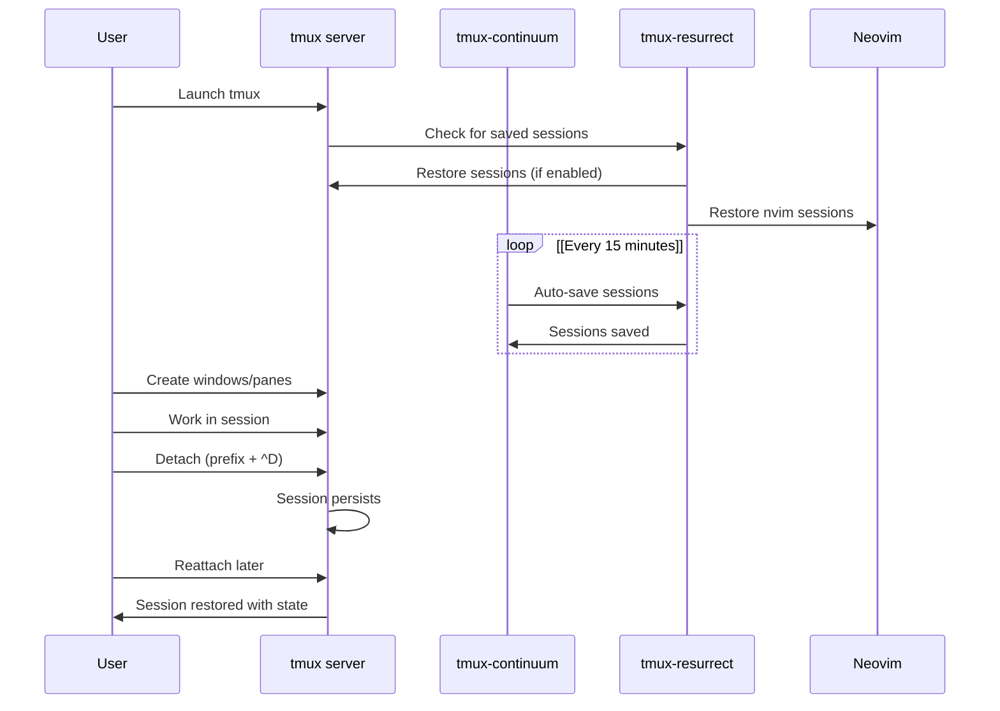

[/](/)

[/search](/search)

[/wiki](/wiki)

[/settings/members](/settings/members)

[/settings/support](/settings/support)

[Add repo](/repositories)

[All repos](/wiki)

[backend](/wiki/Klaudioz/backend)

[BH-Workflow-Engine](/wiki/Klaudioz/BH-Workflow-Engine)

[Buckhead_CRM](/wiki/Klaudioz/Buckhead_CRM)

[dotfiles](/wiki/Klaudioz/dotfiles)

[frontend](/wiki/Klaudioz/frontend)

[godeep.wiki-jb](/wiki/Klaudioz/godeep.wiki-jb)

[pi-mono-zero](/wiki/Klaudioz/pi-mono-zero)

[VirtualOracle](/wiki/Klaudioz/VirtualOracle)

# Terminal Multiplexing with tmuxLink copied!

> **Relevant source files**
> * [nix-darwin/flake.lock](https://github.com/Klaudioz/dotfiles/blob/2febda55/nix-darwin/flake.lock)
> * [tmux/tmux.conf](https://github.com/Klaudioz/dotfiles/blob/2febda55/tmux/tmux.conf)
> * [tmux/tmux.reset.conf](https://github.com/Klaudioz/dotfiles/blob/2febda55/tmux/tmux.reset.conf)

## Purpose and ScopeLink copied!

This document provides an overview of the tmux configuration within the dotfiles ecosystem. tmux serves as the terminal multiplexing layer, enabling session management, window organization, and persistent terminal environments. With an importance score of 27.00 (second only to Neovim at 31.22), tmux is a critical component that bridges terminal emulators and the editing environment.

For detailed information about specific aspects of the tmux configuration, see:

* Core settings and options: [Core tmux Configuration](#5.1)
* Plugin ecosystem: [tmux Plugin System](#5.2)
* Custom keybindings: [tmux Keybindings](#5.3)
* Session persistence features: [Session Persistence](#5.4)

For information about the terminal emulators that host tmux, see [Terminal Emulators](#3.1). For shell integration, see [Shell Configuration](#3.2).

## Configuration ArchitectureLink copied!

The tmux configuration is organized into two primary files:

| File | Purpose | Lines |
| --- | --- | --- |
| `tmux.conf` | Main configuration file containing settings, plugins, and theme | 70 |
| `tmux.reset.conf` | Custom keybinding definitions | 41 |

**Configuration Loading Flow**

```

```

Sources: [tmux/tmux.conf L1](https://github.com/Klaudioz/dotfiles/blob/2febda55/tmux/tmux.conf#L1-L1)

 [tmux/tmux.conf L21-L69](https://github.com/Klaudioz/dotfiles/blob/2febda55/tmux/tmux.conf#L21-L69)

## Role in the Development EcosystemLink copied!

tmux operates at the terminal multiplexing layer, positioned between terminal emulators (Ghostty/WezTerm) and the applications they host (shells and Neovim).

**Ecosystem Integration Points**

```

```

Sources: [tmux/tmux.conf L21-L31](https://github.com/Klaudioz/dotfiles/blob/2febda55/tmux/tmux.conf#L21-L31)

 [tmux/tmux.conf L49](https://github.com/Klaudioz/dotfiles/blob/2febda55/tmux/tmux.conf#L49-L49)

## Core Configuration ElementsLink copied!

### Prefix Key and Base SettingsLink copied!

The configuration establishes fundamental tmux behavior through a set of core options defined in [tmux/tmux.conf L2-L16](https://github.com/Klaudioz/dotfiles/blob/2febda55/tmux/tmux.conf#L2-L16)

:

| Setting | Value | Purpose |
| --- | --- | --- |
| `prefix` | `^A` (Ctrl-A) | Primary command prefix |
| `base-index` | `1` | Window indexing starts at 1 |
| `history-limit` | `1000000` | Extended scrollback buffer |
| `mode-keys` | `vi` | Vi-style key bindings |
| `default-terminal` | `screen-256color` | 256 color support |
| `set-clipboard` | `on` | System clipboard integration |
| `status-position` | `top` | macOS-style status bar |
| `escape-time` | `0` | Zero escape delay for better responsiveness |

Sources: [tmux/tmux.conf L5-L16](https://github.com/Klaudioz/dotfiles/blob/2febda55/tmux/tmux.conf#L5-L16)

### Plugin Management ArchitectureLink copied!

The configuration uses tpm (Tmux Plugin Manager) to orchestrate a plugin ecosystem:

**Plugin Dependency Graph**

```

```

Sources: [tmux/tmux.conf L21-L31](https://github.com/Klaudioz/dotfiles/blob/2febda55/tmux/tmux.conf#L21-L31)

### Terminal Color and Display ConfigurationLink copied!

The configuration ensures proper color handling and terminal compatibility:

```

```

Sources: [tmux/tmux.conf L2-L3](https://github.com/Klaudioz/dotfiles/blob/2febda55/tmux/tmux.conf#L2-L3)

 [tmux/tmux.conf L13](https://github.com/Klaudioz/dotfiles/blob/2febda55/tmux/tmux.conf#L13-L13)

 [tmux/tmux.conf L15-L16](https://github.com/Klaudioz/dotfiles/blob/2febda55/tmux/tmux.conf#L15-L16)

## Keybinding ArchitectureLink copied!

The keybinding system is defined in [tmux/tmux.reset.conf](https://github.com/Klaudioz/dotfiles/blob/2febda55/tmux/tmux.reset.conf)

 and provides vim-style navigation with custom enhancements.

**Keybinding Categories**

| Category | Example Bindings | Configuration Location |
| --- | --- | --- |
| Session Management | `^D` (detach), `S` (choose-session) | [tmux.reset.conf L6-L37](https://github.com/Klaudioz/dotfiles/blob/2febda55/tmux.reset.conf#L6-L37) |
| Window Management | `H` (previous), `L` (next), `^A` (last) | [tmux.reset.conf L9-L14](https://github.com/Klaudioz/dotfiles/blob/2febda55/tmux.reset.conf#L9-L14) |
| Pane Navigation | `h`, `j`, `k`, `l` (vim-style) | [tmux.reset.conf L24-L27](https://github.com/Klaudioz/dotfiles/blob/2febda55/tmux.reset.conf#L24-L27) |
| Pane Splitting | `s` (horizontal), `v` (vertical) | [tmux.reset.conf L21-L22](https://github.com/Klaudioz/dotfiles/blob/2febda55/tmux.reset.conf#L21-L22) |
| Pane Resizing | `,`, `.`, `-`, `=` (resize) | [tmux.reset.conf L28-L31](https://github.com/Klaudioz/dotfiles/blob/2febda55/tmux.reset.conf#L28-L31) |
| Copy Mode | `v` (begin-selection) in vi mode | [tmux.reset.conf L40](https://github.com/Klaudioz/dotfiles/blob/2febda55/tmux.reset.conf#L40-L40) |

Sources: [tmux/tmux.reset.conf](https://github.com/Klaudioz/dotfiles/blob/2febda55/tmux/tmux.reset.conf)

## Plugin Configuration HighlightsLink copied!

### Session Management PluginsLink copied!

The configuration enables robust session persistence through `tmux-resurrect` and `tmux-continuum`:

```

```

Sources: [tmux/tmux.conf L48-L49](https://github.com/Klaudioz/dotfiles/blob/2febda55/tmux/tmux.conf#L48-L49)

 [tmux/tmux.conf L41](https://github.com/Klaudioz/dotfiles/blob/2febda55/tmux/tmux.conf#L41-L41)

 [tmux/tmux.conf L45](https://github.com/Klaudioz/dotfiles/blob/2febda55/tmux/tmux.conf#L45-L45)

### Floating Pane ConfigurationLink copied!

The `tmux-floax` plugin provides floating pane functionality:

| Option | Value | Purpose |
| --- | --- | --- |
| `@floax-width` | `80%` | Floating pane width |
| `@floax-height` | `80%` | Floating pane height |
| `@floax-border-color` | `magenta` | Border color |
| `@floax-bind` | `p` | Activation keybinding |
| `@floax-change-path` | `true` | Maintain current directory |

Sources: [tmux/tmux.conf L32-L37](https://github.com/Klaudioz/dotfiles/blob/2febda55/tmux/tmux.conf#L32-L37)

### URL and Text NavigationLink copied!

The configuration integrates fzf for URL extraction and navigation:

| Plugin | Configuration | Location |
| --- | --- | --- |
| `tmux-fzf-url` | fzf options: `-p 60%,30%` with custom prompt | [tmux.conf L18](https://github.com/Klaudioz/dotfiles/blob/2febda55/tmux.conf#L18-L18) |
| `tmux-fzf-url` | history limit: `2000` URLs | [tmux.conf L19](https://github.com/Klaudioz/dotfiles/blob/2febda55/tmux.conf#L19-L19) |
| `tmux-fzf` | Generic fzf integration | [tmux.conf L27](https://github.com/Klaudioz/dotfiles/blob/2febda55/tmux.conf#L27-L27) |

Sources: [tmux/tmux.conf L18-L19](https://github.com/Klaudioz/dotfiles/blob/2febda55/tmux/tmux.conf#L18-L19)

 [tmux/tmux.conf L27-L28](https://github.com/Klaudioz/dotfiles/blob/2febda55/tmux/tmux.conf#L27-L28)

## Visual Theming with CatppuccinLink copied!

The configuration applies the Catppuccin theme with extensive customization:

**Status Bar Layout**

```

```

**Catppuccin Configuration Map**

| Component | Setting | Value | Line |
| --- | --- | --- | --- |
| Window separators | `@catppuccin_window_left_separator` | `""` | [tmux.conf L50](https://github.com/Klaudioz/dotfiles/blob/2febda55/tmux.conf#L50-L50) |
| Window separators | `@catppuccin_window_right_separator` | `" "` | [tmux.conf L51](https://github.com/Klaudioz/dotfiles/blob/2febda55/tmux.conf#L51-L51) |
| Window text | `@catppuccin_window_default_text` | `"#W"` | [tmux.conf L55](https://github.com/Klaudioz/dotfiles/blob/2febda55/tmux.conf#L55-L55) |
| Window text (current) | `@catppuccin_window_current_text` | `"#W#{?window_zoomed_flag,(),}"` | [tmux.conf L57](https://github.com/Klaudioz/dotfiles/blob/2febda55/tmux.conf#L57-L57) |
| Status modules left | `@catppuccin_status_modules_left` | `"session"` | [tmux.conf L59](https://github.com/Klaudioz/dotfiles/blob/2febda55/tmux.conf#L59-L59) |
| Status modules right | `@catppuccin_status_modules_right` | `"directory"` | [tmux.conf L58](https://github.com/Klaudioz/dotfiles/blob/2febda55/tmux.conf#L58-L58) |
| Directory display | `@catppuccin_directory_text` | `"#{b:pane_current_path}"` | [tmux.conf L65](https://github.com/Klaudioz/dotfiles/blob/2febda55/tmux.conf#L65-L65) |

Sources: [tmux/tmux.conf L50-L67](https://github.com/Klaudioz/dotfiles/blob/2febda55/tmux/tmux.conf#L50-L67)

## Integration with Other ToolsLink copied!

### Neovim IntegrationLink copied!

tmux integrates with Neovim through session persistence:

* The `@resurrect-strategy-nvim` option is set to `'session'` [tmux/tmux.conf L49](https://github.com/Klaudioz/dotfiles/blob/2febda55/tmux/tmux.conf#L49-L49)  enabling Neovim session restoration
* When tmux sessions are restored, Neovim sessions are automatically reopened with their previous state

### Shell IntegrationLink copied!

tmux interacts with both Nushell and Zsh:

* Panes spawn shell processes that inherit the terminal environment
* The `#{pane_current_path}` variable is used when splitting panes [tmux.reset.conf L21-L22](https://github.com/Klaudioz/dotfiles/blob/2febda55/tmux.reset.conf#L21-L22)
* Shell integration enables features like directory-aware pane creation

### Fuzzy Finding IntegrationLink copied!

fzf is integrated at multiple levels:

* `tmux-fzf` provides general fuzzy finding within tmux [tmux/tmux.conf L27](https://github.com/Klaudioz/dotfiles/blob/2febda55/tmux/tmux.conf#L27-L27)
* `tmux-fzf-url` enables URL extraction from pane content [tmux/tmux.conf L28](https://github.com/Klaudioz/dotfiles/blob/2febda55/tmux/tmux.conf#L28-L28)
* `tmux-sessionx` uses zoxide with fzf for intelligent session switching [tmux/tmux.conf L45](https://github.com/Klaudioz/dotfiles/blob/2febda55/tmux/tmux.conf#L45-L45)

Sources: [tmux/tmux.conf L27-L28](https://github.com/Klaudioz/dotfiles/blob/2febda55/tmux/tmux.conf#L27-L28)

 [tmux/tmux.conf L45](https://github.com/Klaudioz/dotfiles/blob/2febda55/tmux/tmux.conf#L45-L45)

## Session Management WorkflowLink copied!

**Typical Session Lifecycle**



Sources: [tmux/tmux.conf L24-L25](https://github.com/Klaudioz/dotfiles/blob/2febda55/tmux/tmux.conf#L24-L25)

 [tmux/tmux.conf L48-L49](https://github.com/Klaudioz/dotfiles/blob/2febda55/tmux/tmux.conf#L48-L49)

## Configuration Files SummaryLink copied!

The complete tmux configuration consists of:

| File | Primary Purpose | Key Features |
| --- | --- | --- |
| `~/.config/tmux/tmux.conf` | Main configuration | Settings, plugins, theme, plugin options |
| `~/.config/tmux/tmux.reset.conf` | Keybindings | Custom key mappings, vim-style navigation |
| `~/.tmux/plugins/tpm/tpm` | Plugin manager | Loaded at end of `tmux.conf` [tmux.conf L69](https://github.com/Klaudioz/dotfiles/blob/2febda55/tmux.conf#L69-L69) |

Sources: [tmux/tmux.conf L1](https://github.com/Klaudioz/dotfiles/blob/2febda55/tmux/tmux.conf#L1-L1)

 [tmux/tmux.conf L69](https://github.com/Klaudioz/dotfiles/blob/2febda55/tmux/tmux.conf#L69-L69)

 [tmux/tmux.reset.conf](https://github.com/Klaudioz/dotfiles/blob/2febda55/tmux/tmux.reset.conf)

Refresh this wiki

Last indexed: 18 December 2025 ([2febda](https://github.com/Klaudioz/dotfiles/commit/2febda55))

### On this page

* [Terminal Multiplexing with tmux](#5-terminal-multiplexing-with-tmux)
* [Purpose and Scope](#5-purpose-and-scope)
* [Configuration Architecture](#5-configuration-architecture)
* [Role in the Development Ecosystem](#5-role-in-the-development-ecosystem)
* [Core Configuration Elements](#5-core-configuration-elements)
* [Prefix Key and Base Settings](#5-prefix-key-and-base-settings)
* [Plugin Management Architecture](#5-plugin-management-architecture)
* [Terminal Color and Display Configuration](#5-terminal-color-and-display-configuration)
* [Keybinding Architecture](#5-keybinding-architecture)
* [Plugin Configuration Highlights](#5-plugin-configuration-highlights)
* [Session Management Plugins](#5-session-management-plugins)
* [Floating Pane Configuration](#5-floating-pane-configuration)
* [URL and Text Navigation](#5-url-and-text-navigation)
* [Visual Theming with Catppuccin](#5-visual-theming-with-catppuccin)
* [Integration with Other Tools](#5-integration-with-other-tools)
* [Neovim Integration](#5-neovim-integration)
* [Shell Integration](#5-shell-integration)
* [Fuzzy Finding Integration](#5-fuzzy-finding-integration)
* [Session Management Workflow](#5-session-management-workflow)
* [Configuration Files Summary](#5-configuration-files-summary)

Ask Devin about dotfiles

  

Syntax error in text

mermaid version 11.4.1

Syntax error in text

mermaid version 11.4.1

Syntax error in text

mermaid version 11.4.1

Syntax error in text

mermaid version 11.4.1

Syntax error in text

mermaid version 11.4.1

Syntax error in text

mermaid version 11.4.1

Syntax error in text

mermaid version 11.4.1

Syntax error in text

mermaid version 11.4.1