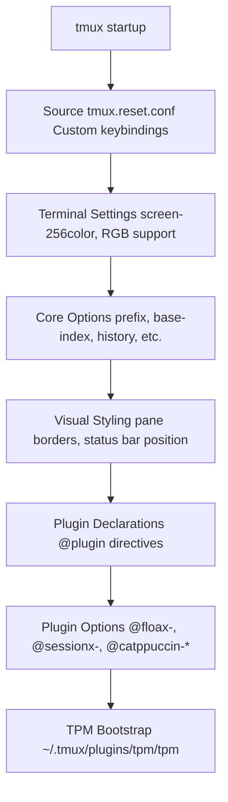
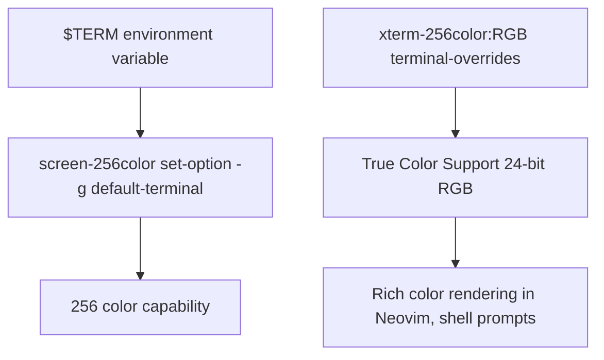
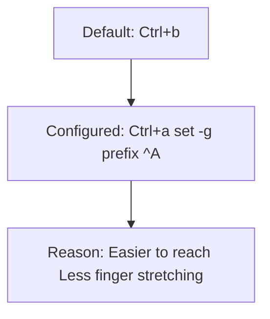
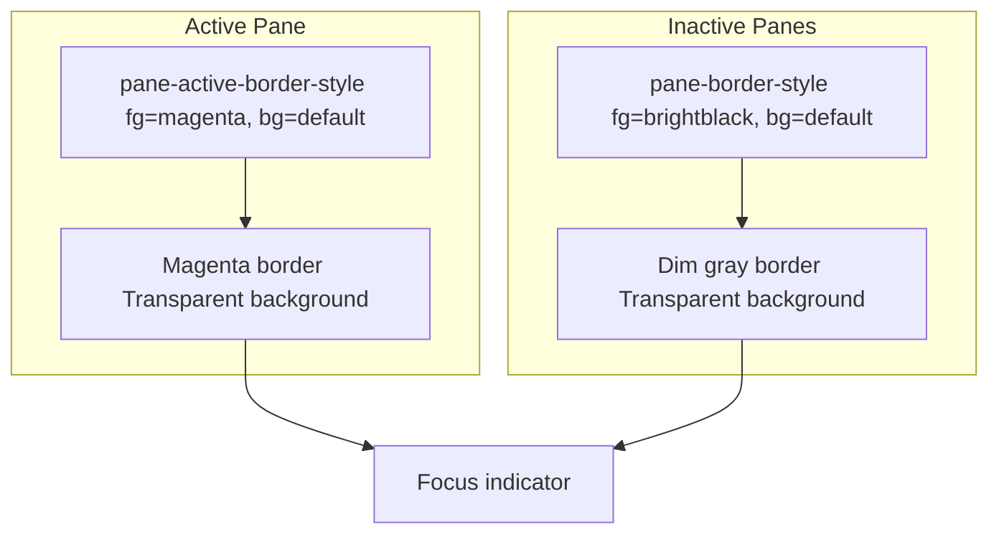
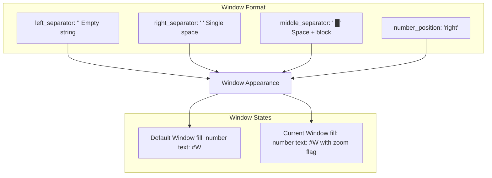
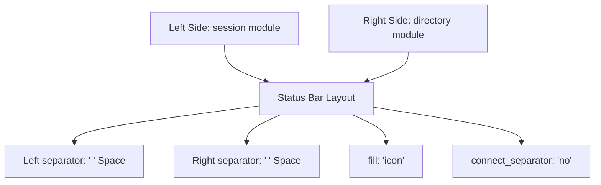
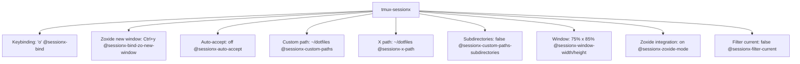

[/](/)

[/search](/search)

[/wiki](/wiki)

[/settings/members](/settings/members)

[/settings/support](/settings/support)

[Add repo](/repositories)

[All repos](/wiki)

[backend](/wiki/Klaudioz/backend)

[BH-Workflow-Engine](/wiki/Klaudioz/BH-Workflow-Engine)

[Buckhead_CRM](/wiki/Klaudioz/Buckhead_CRM)

[dotfiles](/wiki/Klaudioz/dotfiles)

[frontend](/wiki/Klaudioz/frontend)

[godeep.wiki-jb](/wiki/Klaudioz/godeep.wiki-jb)

[pi-mono-zero](/wiki/Klaudioz/pi-mono-zero)

[VirtualOracle](/wiki/Klaudioz/VirtualOracle)

# Core tmux ConfigurationLink copied!

> **Relevant source files**
> * [tmux/tmux.conf](https://github.com/Klaudioz/dotfiles/blob/2febda55/tmux/tmux.conf)

## Purpose and ScopeLink copied!

This document describes the core tmux configuration defined in [tmux/tmux.conf](https://github.com/Klaudioz/dotfiles/blob/2febda55/tmux/tmux.conf)

 It covers terminal settings, fundamental tmux options, visual styling, and the registration of plugins with their basic configuration. For detailed plugin functionality, see [tmux Plugin System](#5.2). For custom keybindings, see [tmux Keybindings](#5.3). For session persistence details, see [Session Persistence](#5.4).

The configuration file follows a layered approach: it first sources a keybinding reset file, then establishes terminal compatibility, sets core behavioral options, applies visual styling via the catppuccin theme, and finally declares plugins with their settings.

**Sources:** [tmux/tmux.conf L1-L70](https://github.com/Klaudioz/dotfiles/blob/2febda55/tmux/tmux.conf#L1-L70)

---

## Configuration StructureLink copied!

The tmux configuration is organized into distinct sections that load in sequence during tmux initialization:



**Configuration Loading Order**

| Phase | Lines | Purpose |
| --- | --- | --- |
| Keybinding Reset | 1 | Source `tmux.reset.conf` for custom key mappings |
| Terminal Setup | 2-3, 13 | Configure terminal type and color support |
| Core Options | 5-12, 14-16 | Set prefix, history, clipboard, window behavior |
| Plugin Registration | 21-31 | Declare plugins to be managed by TPM |
| Plugin Configuration | 18-19, 32-68 | Configure individual plugin options |
| TPM Execution | 69 | Bootstrap TPM to install/load plugins |

**Sources:** [tmux/tmux.conf L1-L70](https://github.com/Klaudioz/dotfiles/blob/2febda55/tmux/tmux.conf#L1-L70)

---

## Terminal SettingsLink copied!

tmux requires specific terminal configuration to ensure proper color rendering and compatibility with modern terminal emulators like Ghostty and WezTerm (see [Terminal Emulators](#3.1)).



**Terminal Option Configuration**

| Option | Value | Purpose |
| --- | --- | --- |
| `default-terminal` | `screen-256color` | Primary terminal type declaration |
| `terminal-overrides` | `xterm-256color:RGB` | Enable true color (24-bit RGB) support |
| `default-terminal` (dynamic) | `${TERM}` | Preserve host terminal's `$TERM` value |

The configuration uses `screen-256color` as the base terminal type [tmux/tmux.conf L2](https://github.com/Klaudioz/dotfiles/blob/2febda55/tmux/tmux.conf#L2-L2)

 while adding RGB color override for xterm-compatible terminals [tmux/tmux.conf L3](https://github.com/Klaudioz/dotfiles/blob/2febda55/tmux/tmux.conf#L3-L3)

 Line 13 dynamically sets `default-terminal` to the current `$TERM` value, allowing tmux to inherit the host terminal's capabilities.

**Sources:** [tmux/tmux.conf L2-L13](https://github.com/Klaudioz/dotfiles/blob/2febda55/tmux/tmux.conf#L2-L13)

---

## Core Behavioral OptionsLink copied!

The core options define tmux's fundamental behavior for session management, window organization, and user interaction.

### Prefix Key ConfigurationLink copied!



The prefix key is changed from the default `Ctrl+b` to `Ctrl+a` [tmux/tmux.conf L5](https://github.com/Klaudioz/dotfiles/blob/2febda55/tmux/tmux.conf#L5-L5)

 which is more ergonomic for frequent use as it requires less hand movement.

**Sources:** [tmux/tmux.conf L5](https://github.com/Klaudioz/dotfiles/blob/2febda55/tmux/tmux.conf#L5-L5)

### Window and Session ManagementLink copied!

| Option | Value | Effect |
| --- | --- | --- |
| `base-index` | `1` | Windows start at index 1 instead of 0 |
| `detach-on-destroy` | `off` | Keep tmux running when closing sessions |
| `escape-time` | `0` | Remove delay after Escape key press |
| `history-limit` | `1000000` | Store 1 million lines of scrollback |
| `renumber-windows` | `on` | Auto-renumber windows when one closes |
| `set-clipboard` | `on` | Synchronize with system clipboard |
| `status-position` | `top` | Display status bar at top (macOS style) |
| `mode-keys` | `vi` | Use vi keybindings in copy mode |

The `base-index` setting [tmux/tmux.conf L6](https://github.com/Klaudioz/dotfiles/blob/2febda55/tmux/tmux.conf#L6-L6)

 makes window numbering more intuitive, starting at 1 to match keyboard number row. Setting `detach-on-destroy` to `off` [tmux/tmux.conf L7](https://github.com/Klaudioz/dotfiles/blob/2febda55/tmux/tmux.conf#L7-L7)

 ensures tmux doesn't exit when the last session closes, allowing quick session switching. The `escape-time` set to 0 [tmux/tmux.conf L8](https://github.com/Klaudioz/dotfiles/blob/2febda55/tmux/tmux.conf#L8-L8)

 eliminates the delay that can interfere with Vim/Neovim usage. The massive `history-limit` of 1,000,000 lines [tmux/tmux.conf L9](https://github.com/Klaudioz/dotfiles/blob/2febda55/tmux/tmux.conf#L9-L9)

 provides extensive scrollback for debugging and log review.

**Sources:** [tmux/tmux.conf L6-L14](https://github.com/Klaudioz/dotfiles/blob/2febda55/tmux/tmux.conf#L6-L14)

---

## Visual StylingLink copied!

### Pane Border ConfigurationLink copied!



The pane border styling provides clear visual feedback about the active pane:

* **Active pane:** Magenta foreground with default (transparent) background [tmux/tmux.conf L15](https://github.com/Klaudioz/dotfiles/blob/2febda55/tmux/tmux.conf#L15-L15)
* **Inactive panes:** Bright black (dim gray) foreground with default background [tmux/tmux.conf L16](https://github.com/Klaudioz/dotfiles/blob/2febda55/tmux/tmux.conf#L16-L16)

**Sources:** [tmux/tmux.conf L15-L16](https://github.com/Klaudioz/dotfiles/blob/2febda55/tmux/tmux.conf#L15-L16)

### Status Bar PositionLink copied!

The status bar is positioned at the top of the terminal window [tmux/tmux.conf L12](https://github.com/Klaudioz/dotfiles/blob/2febda55/tmux/tmux.conf#L12-L12)

 following macOS design conventions where menu/status bars typically appear at the top of applications. This is in contrast to the traditional tmux bottom status bar.

**Sources:** [tmux/tmux.conf L12](https://github.com/Klaudioz/dotfiles/blob/2febda55/tmux/tmux.conf#L12-L12)

---

## Catppuccin Theme ConfigurationLink copied!

The status bar uses the catppuccin color scheme with extensive customization for window indicators and status modules.

### Window Display ConfigurationLink copied!



**Window Separator Configuration**

| Setting | Value | Lines |
| --- | --- | --- |
| `@catppuccin_window_left_separator` | `""` (empty) | 50 |
| `@catppuccin_window_right_separator` | `" "` (space) | 51 |
| `@catppuccin_window_middle_separator` | `" █"` (space + block) | 52 |
| `@catppuccin_window_number_position` | `"right"` | 53 |

**Window Fill and Text Configuration**

| Window State | Fill Mode | Text Format | Lines |
| --- | --- | --- | --- |
| Default | `"number"` | `"#W"` (window name) | 54-55 |
| Current | `"number"` | `"#W#{?window_zoomed_flag,(),}"` (name + zoom indicator) | 56-57 |

The current window text includes a zoom indicator: when a pane is zoomed, empty parentheses `()` appear after the window name [tmux/tmux.conf L57](https://github.com/Klaudioz/dotfiles/blob/2febda55/tmux/tmux.conf#L57-L57)

**Sources:** [tmux/tmux.conf L50-L57](https://github.com/Klaudioz/dotfiles/blob/2febda55/tmux/tmux.conf#L50-L57)

### Status Bar ModulesLink copied!



**Status Module Configuration**

| Setting | Value | Purpose |
| --- | --- | --- |
| `@catppuccin_status_modules_left` | `"session"` | Display session name on left |
| `@catppuccin_status_modules_right` | `"directory"` | Display directory basename on right |
| `@catppuccin_status_left_separator` | `" "` (space) | Left side separator |
| `@catppuccin_status_right_separator` | `" "` (space) | Right side separator |
| `@catppuccin_status_right_separator_inverse` | `"no"` | No inverse separator styling |
| `@catppuccin_status_fill` | `"icon"` | Fill mode for status items |
| `@catppuccin_status_connect_separator` | `"no"` | No connecting separators |
| `@catppuccin_directory_text` | `"#{b:pane_current_path}"` | Show basename of current directory |

The directory module uses the tmux format `#{b:pane_current_path}` [tmux/tmux.conf L65](https://github.com/Klaudioz/dotfiles/blob/2febda55/tmux/tmux.conf#L65-L65)

 which displays only the basename of the current working directory rather than the full path, keeping the status bar concise.

The commented-out sections [tmux/tmux.conf L66-L67](https://github.com/Klaudioz/dotfiles/blob/2febda55/tmux/tmux.conf#L66-L67)

 suggest that date/time and meeting calendar integration were previously used but are currently disabled.

**Sources:** [tmux/tmux.conf L58-L67](https://github.com/Klaudioz/dotfiles/blob/2febda55/tmux/tmux.conf#L58-L67)

---

## Plugin Configuration OverviewLink copied!

The configuration registers 11 plugins and sets options for several key plugins. Detailed plugin functionality is covered in [tmux Plugin System](#5.2).

### Plugin RegistrationLink copied!

```mermaid
flowchart TD

TPM["tpm Tmux Plugin Manager"]
Sensible["tmux-sensible Sensible defaults"]
Yank["tmux-yank Copy to clipboard"]
Resurrect["tmux-resurrect Save/restore sessions"]
Continuum["tmux-continuum Auto-save sessions"]
Thumbs["tmux-thumbs Text hint selection"]
Fzf["tmux-fzf Fuzzy finder integration"]
FzfUrl["tmux-fzf-url URL opener"]
Catppuccin["catppuccin-tmux Theme"]
Sessionx["tmux-sessionx Session switcher"]
Floax["tmux-floax Floating panes"]

TPM --> Sensible
TPM --> Yank
TPM --> Resurrect
TPM --> Continuum
TPM --> Thumbs
TPM --> Fzf
TPM --> FzfUrl
TPM --> Catppuccin
TPM --> Sessionx
TPM --> Floax

subgraph subGraph3 ["UI & Interaction"]
    Catppuccin
    Sessionx
    Floax
end

subgraph subGraph2 ["Navigation & Selection"]
    Thumbs
    Fzf
    FzfUrl
end

subgraph subGraph1 ["Session Management"]
    Resurrect
    Continuum
end

subgraph subGraph0 ["Foundational Plugins"]
    Sensible
    Yank
end
```



**Plugin List**

| Plugin | Lines | Category |
| --- | --- | --- |
| `tmux-plugins/tpm` | 21 | Plugin manager |
| `tmux-plugins/tmux-sensible` | 22 | Sensible defaults |
| `tmux-plugins/tmux-yank` | 23 | Clipboard integration |
| `tmux-plugins/tmux-resurrect` | 24 | Session persistence |
| `tmux-plugins/tmux-continuum` | 25 | Auto-save sessions |
| `fcsonline/tmux-thumbs` | 26 | Text hint selection |
| `sainnhe/tmux-fzf` | 27 | Fuzzy finder integration |
| `wfxr/tmux-fzf-url` | 28 | URL fuzzy finding |
| `omerxx/catppuccin-tmux` | 29 | Color theme |
| `omerxx/tmux-sessionx` | 30 | Advanced session switcher |
| `omerxx/tmux-floax` | 31 | Floating pane windows |

**Sources:** [tmux/tmux.conf L21-L31](https://github.com/Klaudioz/dotfiles/blob/2febda55/tmux/tmux.conf#L21-L31)

### Key Plugin OptionsLink copied!

#### tmux-fzf-url Configuration

| Option | Value | Purpose |
| --- | --- | --- |
| `@fzf-url-fzf-options` | `-p 60%,30% --prompt="   " --border-label=" Open URL "` | fzf window size and styling |
| `@fzf-url-history-limit` | `'2000'` | Number of URLs to track in history |

**Sources:** [tmux/tmux.conf L18-L19](https://github.com/Klaudioz/dotfiles/blob/2febda55/tmux/tmux.conf#L18-L19)

#### tmux-floax Configuration

| Option | Value | Purpose |
| --- | --- | --- |
| `@floax-width` | `'80%'` | Floating window width |
| `@floax-height` | `'80%'` | Floating window height |
| `@floax-border-color` | `'magenta'` | Border color matching active pane style |
| `@floax-text-color` | `'blue'` | Text color inside floating window |
| `@floax-bind` | `'p'` | Keybinding to toggle floating window |
| `@floax-change-path` | `'true'` | Change directory when opening floax |

**Sources:** [tmux/tmux.conf L32-L37](https://github.com/Klaudioz/dotfiles/blob/2febda55/tmux/tmux.conf#L32-L37)

#### tmux-sessionx Configuration



| Option | Value | Lines |
| --- | --- | --- |
| `@sessionx-bind` | `'o'` | 41 |
| `@sessionx-bind-zo-new-window` | `'ctrl-y'` | 38 |
| `@sessionx-auto-accept` | `'off'` | 39 |
| `@sessionx-custom-paths` | `'/Users/omerxx/dotfiles'` | 40 |
| `@sessionx-x-path` | `'~/dotfiles'` | 42 |
| `@sessionx-window-height` | `'85%'` | 43 |
| `@sessionx-window-width` | `'75%'` | 44 |
| `@sessionx-zoxide-mode` | `'on'` | 45 |
| `@sessionx-custom-paths-subdirectories` | `'false'` | 46 |
| `@sessionx-filter-current` | `'false'` | 47 |

The sessionx configuration emphasizes the dotfiles directory as a frequently accessed workspace and integrates with zoxide for smart directory jumping (see [Navigation and Discovery Tools](#7.3)).

**Sources:** [tmux/tmux.conf L38-L47](https://github.com/Klaudioz/dotfiles/blob/2febda55/tmux/tmux.conf#L38-L47)

#### Session Persistence Configuration

| Option | Value | Purpose |
| --- | --- | --- |
| `@continuum-restore` | `'on'` | Automatically restore last saved session on tmux start |
| `@resurrect-strategy-nvim` | `'session'` | Save/restore Neovim sessions using Session.vim |

The `@resurrect-strategy-nvim` setting [tmux/tmux.conf L49](https://github.com/Klaudioz/dotfiles/blob/2febda55/tmux/tmux.conf#L49-L49)

 integrates with Neovim's session persistence (see [Session Persistence](#5.4)), ensuring that when tmux sessions are restored, Neovim also restores its editor state including open files, window layouts, and cursor positions.

**Sources:** [tmux/tmux.conf L48-L49](https://github.com/Klaudioz/dotfiles/blob/2febda55/tmux/tmux.conf#L48-L49)

---

## TPM BootstrapLink copied!

The final line of the configuration [tmux/tmux.conf L69](https://github.com/Klaudioz/dotfiles/blob/2febda55/tmux/tmux.conf#L69-L69)

 executes the TPM (Tmux Plugin Manager) script:

```
run '~/.tmux/plugins/tpm/tpm'
```

This command loads TPM, which then:

1. Checks if declared plugins are installed
2. Installs missing plugins to `~/.tmux/plugins/`
3. Sources all installed plugin scripts
4. Applies plugin configurations set via `@` variables

TPM must be manually installed initially by cloning its repository to `~/.tmux/plugins/tpm`, after which it manages all other plugins automatically.

**Sources:** [tmux/tmux.conf L69](https://github.com/Klaudioz/dotfiles/blob/2febda55/tmux/tmux.conf#L69-L69)

Refresh this wiki

Last indexed: 18 December 2025 ([2febda](https://github.com/Klaudioz/dotfiles/commit/2febda55))

### On this page

* [Core tmux Configuration](#5.1-core-tmux-configuration)
* [Purpose and Scope](#5.1-purpose-and-scope)
* [Configuration Structure](#5.1-configuration-structure)
* [Terminal Settings](#5.1-terminal-settings)
* [Core Behavioral Options](#5.1-core-behavioral-options)
* [Prefix Key Configuration](#5.1-prefix-key-configuration)
* [Window and Session Management](#5.1-window-and-session-management)
* [Visual Styling](#5.1-visual-styling)
* [Pane Border Configuration](#5.1-pane-border-configuration)
* [Status Bar Position](#5.1-status-bar-position)
* [Catppuccin Theme Configuration](#5.1-catppuccin-theme-configuration)
* [Window Display Configuration](#5.1-window-display-configuration)
* [Status Bar Modules](#5.1-status-bar-modules)
* [Plugin Configuration Overview](#5.1-plugin-configuration-overview)
* [Plugin Registration](#5.1-plugin-registration)
* [Key Plugin Options](#5.1-key-plugin-options)
* [TPM Bootstrap](#5.1-tpm-bootstrap)

Ask Devin about dotfiles

  

Syntax error in text

mermaid version 11.4.1

Syntax error in text

mermaid version 11.4.1

Syntax error in text

mermaid version 11.4.1

Syntax error in text

mermaid version 11.4.1

Syntax error in text

mermaid version 11.4.1

Syntax error in text

mermaid version 11.4.1

Syntax error in text

mermaid version 11.4.1

Syntax error in text

mermaid version 11.4.1