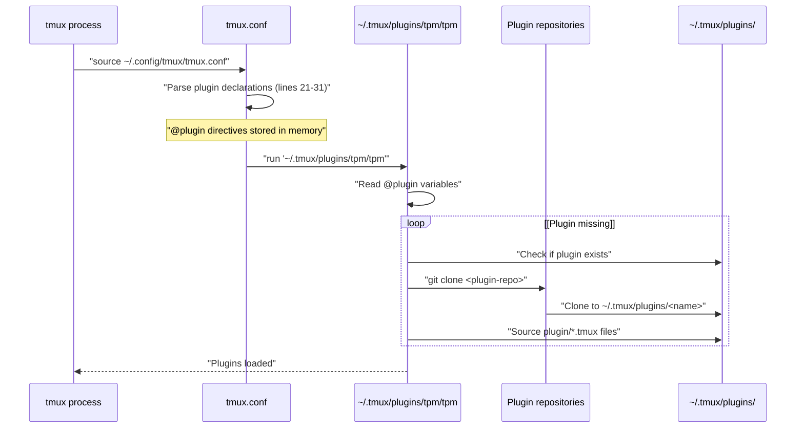
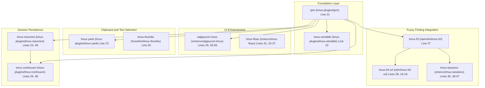
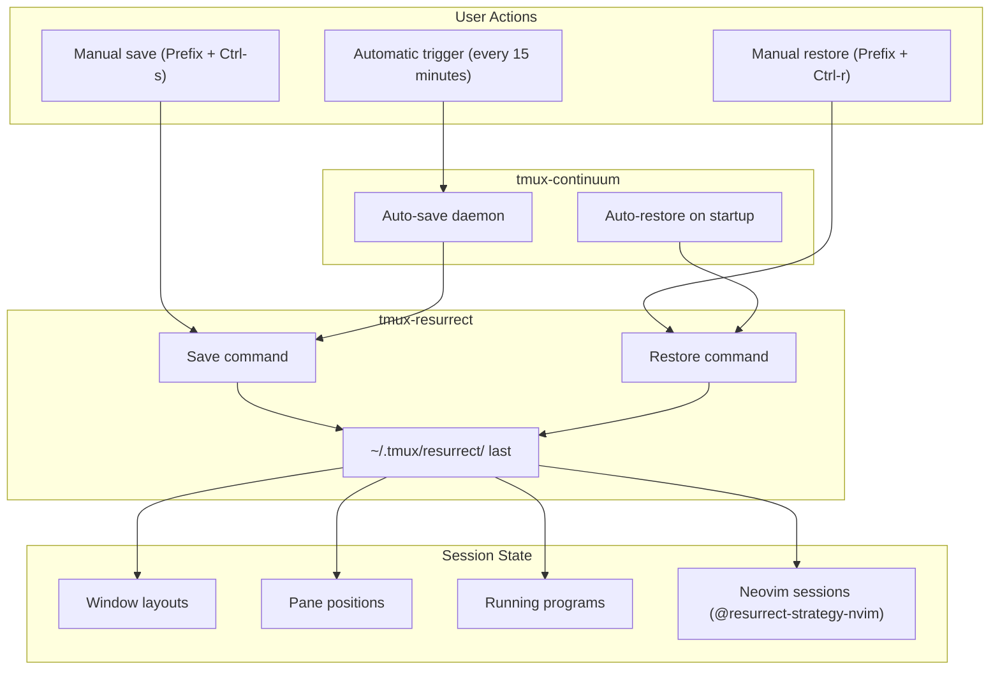
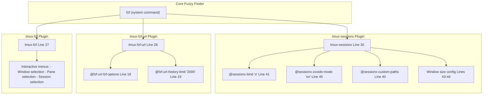
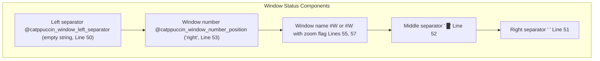
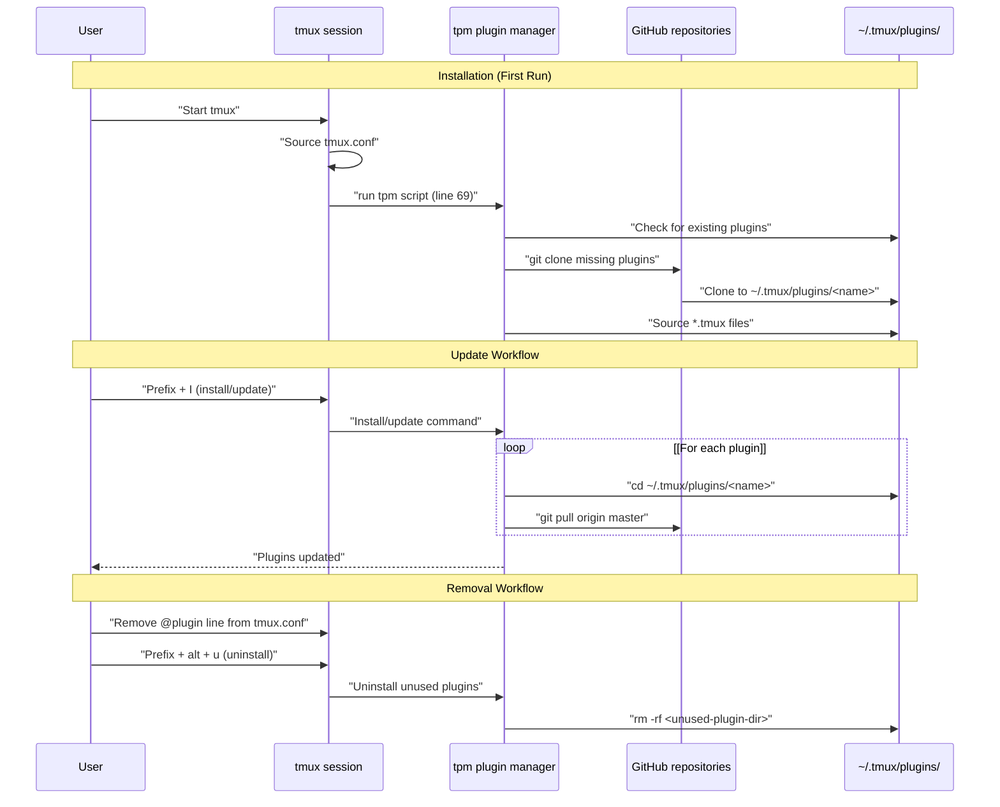
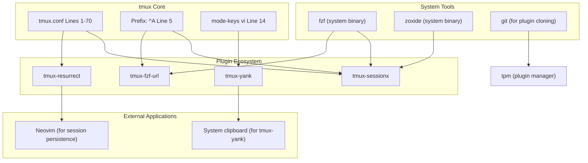
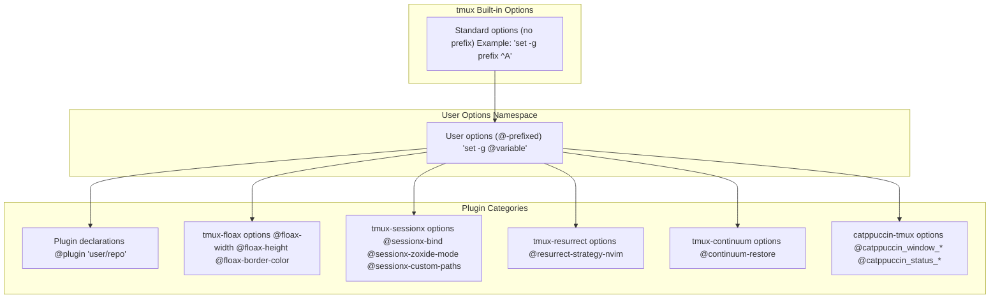

[/](/)

[/search](/search)

[/wiki](/wiki)

[/settings/members](/settings/members)

[/settings/support](/settings/support)

[Add repo](/repositories)

[All repos](/wiki)

[backend](/wiki/Klaudioz/backend)

[BH-Workflow-Engine](/wiki/Klaudioz/BH-Workflow-Engine)

[Buckhead_CRM](/wiki/Klaudioz/Buckhead_CRM)

[dotfiles](/wiki/Klaudioz/dotfiles)

[frontend](/wiki/Klaudioz/frontend)

[godeep.wiki-jb](/wiki/Klaudioz/godeep.wiki-jb)

[pi-mono-zero](/wiki/Klaudioz/pi-mono-zero)

[VirtualOracle](/wiki/Klaudioz/VirtualOracle)

# tmux Plugin SystemLink copied!

> **Relevant source files**
> * [tmux/tmux.conf](https://github.com/Klaudioz/dotfiles/blob/2febda55/tmux/tmux.conf)

## Purpose and ScopeLink copied!

This document details the tmux plugin ecosystem managed by **tpm** (Tmux Plugin Manager), including plugin installation, configuration, and integration within the broader tmux environment. The plugin system extends tmux's core functionality with features like session persistence, fuzzy finding, clipboard management, and visual enhancements.

For core tmux configuration options, see [Core tmux Configuration](#5.1). For tmux keybindings, including plugin-specific bindings, see [tmux Keybindings](#5.3). For detailed session persistence behavior, see [Session Persistence](#5.4).

**Sources:** [tmux/tmux.conf L1-L70](https://github.com/Klaudioz/dotfiles/blob/2febda55/tmux/tmux.conf#L1-L70)

---

## Plugin Manager ArchitectureLink copied!

### tpm Initialization FlowLink copied!

The plugin system is initialized through a two-stage process: plugin declaration followed by tpm execution.

**Plugin Declaration:** Plugins are declared using `set -g @plugin '<user>/<repo>'` directives [tmux/tmux.conf L21-L31](https://github.com/Klaudioz/dotfiles/blob/2febda55/tmux/tmux.conf#L21-L31)

 where each line registers a plugin with tpm. The `@plugin` variable follows tmux's user option convention (prefixed with `@`).

**Plugin Execution:** The `run '~/.tmux/plugins/tpm/tpm'` statement at the end of the configuration [tmux/tmux.conf L69](https://github.com/Klaudioz/dotfiles/blob/2febda55/tmux/tmux.conf#L69-L69)

 triggers tpm to clone missing plugins and source their initialization scripts.

**Sources:** [tmux/tmux.conf L21-L31](https://github.com/Klaudioz/dotfiles/blob/2febda55/tmux/tmux.conf#L21-L31)

 [tmux/tmux.conf L69](https://github.com/Klaudioz/dotfiles/blob/2febda55/tmux/tmux.conf#L69-L69)

---

## Installed PluginsLink copied!

### Plugin InventoryLink copied!

The configuration includes 11 plugins organized by functionality:

| Plugin Repository | Purpose | Configuration Lines |
| --- | --- | --- |
| `tmux-plugins/tpm` | Plugin manager itself | [21](https://github.com/Klaudioz/dotfiles/blob/2febda55/21) |
| `tmux-plugins/tmux-sensible` | Sensible default settings | [22](https://github.com/Klaudioz/dotfiles/blob/2febda55/22) |
| `tmux-plugins/tmux-yank` | Clipboard integration | [23](https://github.com/Klaudioz/dotfiles/blob/2febda55/23) |
| `tmux-plugins/tmux-resurrect` | Session state persistence | [24](https://github.com/Klaudioz/dotfiles/blob/2febda55/24)    [49](https://github.com/Klaudioz/dotfiles/blob/2febda55/49) |
| `tmux-plugins/tmux-continuum` | Automatic session saving | [25](https://github.com/Klaudioz/dotfiles/blob/2febda55/25)    [48](https://github.com/Klaudioz/dotfiles/blob/2febda55/48) |
| `fcsonline/tmux-thumbs` | Hint-based text copying | [26](https://github.com/Klaudioz/dotfiles/blob/2febda55/26) |
| `sainnhe/tmux-fzf` | fzf integration for tmux | [27](https://github.com/Klaudioz/dotfiles/blob/2febda55/27) |
| `wfxr/tmux-fzf-url` | URL extraction with fzf | [28](https://github.com/Klaudioz/dotfiles/blob/2febda55/28)    [18-19](https://github.com/Klaudioz/dotfiles/blob/2febda55/18-19) |
| `omerxx/catppuccin-tmux` | Catppuccin theme | [29](https://github.com/Klaudioz/dotfiles/blob/2febda55/29)    [50-65](https://github.com/Klaudioz/dotfiles/blob/2febda55/50-65) |
| `omerxx/tmux-sessionx` | Session management with fzf | [30](https://github.com/Klaudioz/dotfiles/blob/2febda55/30)    [38-47](https://github.com/Klaudioz/dotfiles/blob/2febda55/38-47) |
| `omerxx/tmux-floax` | Floating window support | [31](https://github.com/Klaudioz/dotfiles/blob/2febda55/31)    [32-37](https://github.com/Klaudioz/dotfiles/blob/2febda55/32-37) |

**Sources:** [tmux/tmux.conf L21-L31](https://github.com/Klaudioz/dotfiles/blob/2febda55/tmux/tmux.conf#L21-L31)

---

## Plugin Categories and ConfigurationLink copied!

### Foundation PluginsLink copied!

**Sources:** [tmux/tmux.conf L21-L31](https://github.com/Klaudioz/dotfiles/blob/2febda55/tmux/tmux.conf#L21-L31)

#### tmux-sensible

The `tmux-sensible` plugin provides a baseline of reasonable default settings that improve tmux usability without requiring explicit configuration. It runs automatically when loaded and requires no user configuration.

**Sources:** [tmux/tmux.conf L22](https://github.com/Klaudioz/dotfiles/blob/2febda55/tmux/tmux.conf#L22-L22)

#### tmux-yank

The `tmux-yank` plugin enhances clipboard integration, allowing seamless copying between tmux and the system clipboard. It works in conjunction with the core setting `set -g set-clipboard on` [tmux/tmux.conf L11](https://github.com/Klaudioz/dotfiles/blob/2febda55/tmux/tmux.conf#L11-L11)

 and respects vi-mode keybindings [tmux/tmux.conf L14](https://github.com/Klaudioz/dotfiles/blob/2febda55/tmux/tmux.conf#L14-L14)

**Sources:** [tmux/tmux.conf L23](https://github.com/Klaudioz/dotfiles/blob/2febda55/tmux/tmux.conf#L23-L23)

 [tmux/tmux.conf L11](https://github.com/Klaudioz/dotfiles/blob/2febda55/tmux/tmux.conf#L11-L11)

 [tmux/tmux.conf L14](https://github.com/Klaudioz/dotfiles/blob/2febda55/tmux/tmux.conf#L14-L14)

---

### Text Selection and ExtractionLink copied!

#### tmux-thumbs

The `tmux-thumbs` plugin enables hint-based text copying, displaying letter hints over text patterns (file paths, URLs, etc.) for quick selection without mouse interaction. No explicit configuration is present in the file, indicating default behavior is used.

**Sources:** [tmux/tmux.conf L26](https://github.com/Klaudioz/dotfiles/blob/2febda55/tmux/tmux.conf#L26-L26)

---

### Session Persistence SystemLink copied!

#### tmux-resurrect Configuration

The `tmux-resurrect` plugin saves and restores tmux sessions, including window layouts, pane positions, and running programs.

**Configuration:**

* `set -g @resurrect-strategy-nvim 'session'` [tmux/tmux.conf L49](https://github.com/Klaudioz/dotfiles/blob/2febda55/tmux/tmux.conf#L49-L49) : Integrates with Neovim's session management, ensuring Neovim state (open buffers, cursor positions) is preserved alongside tmux state.

**Sources:** [tmux/tmux.conf L24](https://github.com/Klaudioz/dotfiles/blob/2febda55/tmux/tmux.conf#L24-L24)

 [tmux/tmux.conf L49](https://github.com/Klaudioz/dotfiles/blob/2febda55/tmux/tmux.conf#L49-L49)

#### tmux-continuum Configuration

The `tmux-continuum` plugin automates `tmux-resurrect` by periodically saving sessions and automatically restoring them on tmux startup.

**Configuration:**

* `set -g @continuum-restore 'on'` [tmux/tmux.conf L48](https://github.com/Klaudioz/dotfiles/blob/2febda55/tmux/tmux.conf#L48-L48) : Enables automatic session restoration when tmux starts, ensuring the previous session state is recovered without manual intervention.

**Sources:** [tmux/tmux.conf L25](https://github.com/Klaudioz/dotfiles/blob/2febda55/tmux/tmux.conf#L25-L25)

 [tmux/tmux.conf L48](https://github.com/Klaudioz/dotfiles/blob/2febda55/tmux/tmux.conf#L48-L48)

---

### Fuzzy Finding PluginsLink copied!

#### tmux-fzf Configuration

The `tmux-fzf` plugin provides fuzzy finding for tmux objects (windows, panes, sessions). It requires no explicit configuration, using default keybindings provided by the plugin.

**Sources:** [tmux/tmux.conf L27](https://github.com/Klaudioz/dotfiles/blob/2febda55/tmux/tmux.conf#L27-L27)

#### tmux-fzf-url Configuration

The `tmux-fzf-url` plugin extracts URLs from visible pane content and presents them in an fzf interface for selection and opening.

**Configuration:**

* `set -g @fzf-url-fzf-options '-p 60%,30% --prompt="   " --border-label=" Open URL "'` [tmux/tmux.conf L18](https://github.com/Klaudioz/dotfiles/blob/2febda55/tmux/tmux.conf#L18-L18) : Customizes the fzf popup window to be 60% width by 30% height with centered positioning (`-p`), a custom prompt icon, and border label.
* `set -g @fzf-url-history-limit '2000'` [tmux/tmux.conf L19](https://github.com/Klaudioz/dotfiles/blob/2febda55/tmux/tmux.conf#L19-L19) : Maintains a history of 2000 URLs for quick re-access.

**Sources:** [tmux/tmux.conf L28](https://github.com/Klaudioz/dotfiles/blob/2febda55/tmux/tmux.conf#L28-L28)

 [tmux/tmux.conf L18-L19](https://github.com/Klaudioz/dotfiles/blob/2febda55/tmux/tmux.conf#L18-L19)

#### tmux-sessionx Configuration

The `tmux-sessionx` plugin provides an enhanced session switcher with fzf integration, zoxide support, and custom path management.

**Configuration Table:**

| Option | Value | Line | Purpose |
| --- | --- | --- | --- |
| `@sessionx-bind` | `'o'` | [41](https://github.com/Klaudioz/dotfiles/blob/2febda55/41) | Prefix key binding to launch sessionx |
| `@sessionx-bind-zo-new-window` | `'ctrl-y'` | [38](https://github.com/Klaudioz/dotfiles/blob/2febda55/38) | Keybinding for zoxide-powered new window |
| `@sessionx-auto-accept` | `'off'` | [39](https://github.com/Klaudioz/dotfiles/blob/2febda55/39) | Disable auto-acceptance of single match |
| `@sessionx-custom-paths` | `'/Users/omerxx/dotfiles'` | [40](https://github.com/Klaudioz/dotfiles/blob/2febda55/40) | Custom project path to include |
| `@sessionx-x-path` | `'~/dotfiles'` | [42](https://github.com/Klaudioz/dotfiles/blob/2febda55/42) | Quick access path for 'x' binding |
| `@sessionx-window-height` | `'85%'` | [43](https://github.com/Klaudioz/dotfiles/blob/2febda55/43) | fzf window height |
| `@sessionx-window-width` | `'75%'` | [44](https://github.com/Klaudioz/dotfiles/blob/2febda55/44) | fzf window width |
| `@sessionx-zoxide-mode` | `'on'` | [45](https://github.com/Klaudioz/dotfiles/blob/2febda55/45) | Enable zoxide integration |
| `@sessionx-custom-paths-subdirectories` | `'false'` | [46](https://github.com/Klaudioz/dotfiles/blob/2febda55/46) | Don't recurse into subdirectories |
| `@sessionx-filter-current` | `'false'` | [47](https://github.com/Klaudioz/dotfiles/blob/2febda55/47) | Include current session in list |

**Integration:** The zoxide integration allows sessionx to leverage directory jump history for intelligent session switching. The custom paths feature ensures the dotfiles directory is always accessible for configuration management.

**Sources:** [tmux/tmux.conf L30](https://github.com/Klaudioz/dotfiles/blob/2febda55/tmux/tmux.conf#L30-L30)

 [tmux/tmux.conf L38-L47](https://github.com/Klaudioz/dotfiles/blob/2febda55/tmux/tmux.conf#L38-L47)

---

### UI Enhancement PluginsLink copied!

#### catppuccin-tmux Configuration

The `catppuccin-tmux` plugin applies the Catppuccin Mocha color scheme to tmux's status bar with extensive customization.

**Window Status Configuration:**

**Configuration Details:**

**Window Styling:**

* `@catppuccin_window_left_separator ""` [tmux/tmux.conf L50](https://github.com/Klaudioz/dotfiles/blob/2febda55/tmux/tmux.conf#L50-L50) : No left separator for compact appearance
* `@catppuccin_window_right_separator " "` [tmux/tmux.conf L51](https://github.com/Klaudioz/dotfiles/blob/2febda55/tmux/tmux.conf#L51-L51) : Single space right separator
* `@catppuccin_window_middle_separator " █"` [tmux/tmux.conf L52](https://github.com/Klaudioz/dotfiles/blob/2febda55/tmux/tmux.conf#L52-L52) : Block character separator between window components
* `@catppuccin_window_number_position "right"` [tmux/tmux.conf L53](https://github.com/Klaudioz/dotfiles/blob/2febda55/tmux/tmux.conf#L53-L53) : Position window number on the right side
* `@catppuccin_window_default_fill "number"` [tmux/tmux.conf L54](https://github.com/Klaudioz/dotfiles/blob/2febda55/tmux/tmux.conf#L54-L54) : Fill style for inactive windows
* `@catppuccin_window_default_text "#W"` [tmux/tmux.conf L55](https://github.com/Klaudioz/dotfiles/blob/2febda55/tmux/tmux.conf#L55-L55) : Display window name (`#W`) for inactive windows
* `@catppuccin_window_current_fill "number"` [tmux/tmux.conf L56](https://github.com/Klaudioz/dotfiles/blob/2febda55/tmux/tmux.conf#L56-L56) : Fill style for active window
* `@catppuccin_window_current_text "#W#{?window_zoomed_flag,(),}"` [tmux/tmux.conf L57](https://github.com/Klaudioz/dotfiles/blob/2febda55/tmux/tmux.conf#L57-L57) : Display window name with zoom indicator when pane is zoomed

**Status Bar Modules:**

* `@catppuccin_status_modules_right "directory"` [tmux/tmux.conf L58](https://github.com/Klaudioz/dotfiles/blob/2febda55/tmux/tmux.conf#L58-L58) : Display current directory in right status
* `@catppuccin_status_modules_left "session"` [tmux/tmux.conf L59](https://github.com/Klaudioz/dotfiles/blob/2febda55/tmux/tmux.conf#L59-L59) : Display session name in left status
* `@catppuccin_status_left_separator " "` [tmux/tmux.conf L60](https://github.com/Klaudioz/dotfiles/blob/2febda55/tmux/tmux.conf#L60-L60) : Space separator for left status modules
* `@catppuccin_status_right_separator " "` [tmux/tmux.conf L61](https://github.com/Klaudioz/dotfiles/blob/2febda55/tmux/tmux.conf#L61-L61) : Space separator for right status modules
* `@catppuccin_status_right_separator_inverse "no"` [tmux/tmux.conf L62](https://github.com/Klaudioz/dotfiles/blob/2febda55/tmux/tmux.conf#L62-L62) : Disable inverse separator coloring
* `@catppuccin_status_fill "icon"` [tmux/tmux.conf L63](https://github.com/Klaudioz/dotfiles/blob/2febda55/tmux/tmux.conf#L63-L63) : Use icon-based fill style
* `@catppuccin_status_connect_separator "no"` [tmux/tmux.conf L64](https://github.com/Klaudioz/dotfiles/blob/2febda55/tmux/tmux.conf#L64-L64) : No connectors between status sections
* `@catppuccin_directory_text "#{b:pane_current_path}"` [tmux/tmux.conf L65](https://github.com/Klaudioz/dotfiles/blob/2febda55/tmux/tmux.conf#L65-L65) : Display basename of current path

**Commented Features:**

* Lines [66-67](https://github.com/Klaudioz/dotfiles/blob/2febda55/66-67)  show commented-out calendar meetings script and date/time display, indicating these features are disabled but available for future use.

**Sources:** [tmux/tmux.conf L29](https://github.com/Klaudioz/dotfiles/blob/2febda55/tmux/tmux.conf#L29-L29)

 [tmux/tmux.conf L50-L67](https://github.com/Klaudioz/dotfiles/blob/2febda55/tmux/tmux.conf#L50-L67)

#### tmux-floax Configuration

The `tmux-floax` plugin provides floating window functionality within tmux, creating popup windows for temporary tasks.

**Configuration:**

* `@floax-width '80%'` [tmux/tmux.conf L32](https://github.com/Klaudioz/dotfiles/blob/2febda55/tmux/tmux.conf#L32-L32) : Popup window width at 80% of terminal width
* `@floax-height '80%'` [tmux/tmux.conf L33](https://github.com/Klaudioz/dotfiles/blob/2febda55/tmux/tmux.conf#L33-L33) : Popup window height at 80% of terminal height
* `@floax-border-color 'magenta'` [tmux/tmux.conf L34](https://github.com/Klaudioz/dotfiles/blob/2febda55/tmux/tmux.conf#L34-L34) : Magenta border matching active pane border [tmux/tmux.conf L15](https://github.com/Klaudioz/dotfiles/blob/2febda55/tmux/tmux.conf#L15-L15)
* `@floax-text-color 'blue'` [tmux/tmux.conf L35](https://github.com/Klaudioz/dotfiles/blob/2febda55/tmux/tmux.conf#L35-L35) : Blue text color for popup content
* `@floax-bind 'p'` [tmux/tmux.conf L36](https://github.com/Klaudioz/dotfiles/blob/2febda55/tmux/tmux.conf#L36-L36) : Bind to `prefix + p` for toggling floating window
* `@floax-change-path 'true'` [tmux/tmux.conf L37](https://github.com/Klaudioz/dotfiles/blob/2febda55/tmux/tmux.conf#L37-L37) : Change working directory in float to match calling pane

**Sources:** [tmux/tmux.conf L31](https://github.com/Klaudioz/dotfiles/blob/2febda55/tmux/tmux.conf#L31-L31)

 [tmux/tmux.conf L32-L37](https://github.com/Klaudioz/dotfiles/blob/2febda55/tmux/tmux.conf#L32-L37)

---

## Plugin Management WorkflowLink copied!

### Installation and Update ProcessLink copied!

**Management Keybindings:**

| Keybinding | Action | Description |
| --- | --- | --- |
| `prefix + I` | Install/Update | Installs new plugins and updates existing ones |
| `prefix + U` | Update All | Updates all installed plugins |
| `prefix + alt + u` | Uninstall | Removes plugins not declared in config |

**Plugin Storage:** All plugins are cloned to `~/.tmux/plugins/` directory, with tpm itself located at `~/.tmux/plugins/tpm/`.

**Sources:** [tmux/tmux.conf L21-L31](https://github.com/Klaudioz/dotfiles/blob/2febda55/tmux/tmux.conf#L21-L31)

 [tmux/tmux.conf L69](https://github.com/Klaudioz/dotfiles/blob/2febda55/tmux/tmux.conf#L69-L69)

---

## Integration with Core SystemLink copied!

### Cross-Component DependenciesLink copied!

**Key Integration Points:**

1. **fzf Dependency:** Multiple plugins (`tmux-fzf`, `tmux-fzf-url`, `tmux-sessionx`) require `fzf` to be installed system-wide. This is typically handled by the Nix-Darwin configuration (see [System Configuration with Nix-Darwin](#2)) or Homebrew.
2. **zoxide Integration:** The `tmux-sessionx` plugin's zoxide mode [tmux/tmux.conf L45](https://github.com/Klaudioz/dotfiles/blob/2febda55/tmux/tmux.conf#L45-L45)  requires `zoxide` to be installed and initialized in the shell environment (see [Nushell Setup](#3.2.1) and [Zsh Setup](#3.2.2)).
3. **Neovim Session Persistence:** The `@resurrect-strategy-nvim 'session'` configuration [tmux/tmux.conf L49](https://github.com/Klaudioz/dotfiles/blob/2febda55/tmux/tmux.conf#L49-L49)  requires Neovim to support session management, which is provided by the `persistence.nvim` plugin documented in [Additional Plugins and Utilities](#4.9).
4. **Clipboard Integration:** The `tmux-yank` plugin integrates with the system clipboard, working in conjunction with `set -g set-clipboard on` [tmux/tmux.conf L11](https://github.com/Klaudioz/dotfiles/blob/2febda55/tmux/tmux.conf#L11-L11)  and respecting vi-mode keybindings [tmux/tmux.conf L14](https://github.com/Klaudioz/dotfiles/blob/2febda55/tmux/tmux.conf#L14-L14)

**Sources:** [tmux/tmux.conf L5](https://github.com/Klaudioz/dotfiles/blob/2febda55/tmux/tmux.conf#L5-L5)

 [tmux/tmux.conf L11](https://github.com/Klaudioz/dotfiles/blob/2febda55/tmux/tmux.conf#L11-L11)

 [tmux/tmux.conf L14](https://github.com/Klaudioz/dotfiles/blob/2febda55/tmux/tmux.conf#L14-L14)

 [tmux/tmux.conf L45](https://github.com/Klaudioz/dotfiles/blob/2febda55/tmux/tmux.conf#L45-L45)

 [tmux/tmux.conf L49](https://github.com/Klaudioz/dotfiles/blob/2febda55/tmux/tmux.conf#L49-L49)

---

## Configuration Variable NamespaceLink copied!

### Plugin Option ConventionLink copied!

All plugin configuration options follow the tmux user option convention using the `@` prefix:

**Namespace Organization:** Plugin options are scoped by plugin name (e.g., `@floax-*`, `@sessionx-*`, `@catppuccin_*`) preventing collisions between plugins. The tpm plugin manager itself uses the `@plugin` variable for plugin declarations.

**Sources:** [tmux/tmux.conf L18-L67](https://github.com/Klaudioz/dotfiles/blob/2febda55/tmux/tmux.conf#L18-L67)

Refresh this wiki

Last indexed: 18 December 2025 ([2febda](https://github.com/Klaudioz/dotfiles/commit/2febda55))

### On this page

* [tmux Plugin System](#5.2-tmux-plugin-system)
* [Purpose and Scope](#5.2-purpose-and-scope)
* [Plugin Manager Architecture](#5.2-plugin-manager-architecture)
* [tpm Initialization Flow](#5.2-tpm-initialization-flow)
* [Installed Plugins](#5.2-installed-plugins)
* [Plugin Inventory](#5.2-plugin-inventory)
* [Plugin Categories and Configuration](#5.2-plugin-categories-and-configuration)
* [Foundation Plugins](#5.2-foundation-plugins)
* [Text Selection and Extraction](#5.2-text-selection-and-extraction)
* [Session Persistence System](#5.2-session-persistence-system)
* [Fuzzy Finding Plugins](#5.2-fuzzy-finding-plugins)
* [UI Enhancement Plugins](#5.2-ui-enhancement-plugins)
* [Plugin Management Workflow](#5.2-plugin-management-workflow)
* [Installation and Update Process](#5.2-installation-and-update-process)
* [Integration with Core System](#5.2-integration-with-core-system)
* [Cross-Component Dependencies](#5.2-cross-component-dependencies)
* [Configuration Variable Namespace](#5.2-configuration-variable-namespace)
* [Plugin Option Convention](#5.2-plugin-option-convention)

Ask Devin about dotfiles

  

Syntax error in text

mermaid version 11.4.1

Syntax error in text

mermaid version 11.4.1

Syntax error in text

mermaid version 11.4.1

Syntax error in text

mermaid version 11.4.1

Syntax error in text

mermaid version 11.4.1

Syntax error in text

mermaid version 11.4.1

Syntax error in text

mermaid version 11.4.1

Syntax error in text

mermaid version 11.4.1