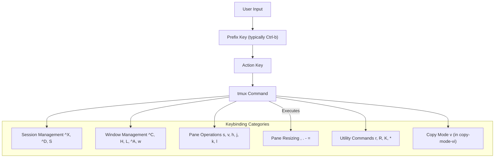
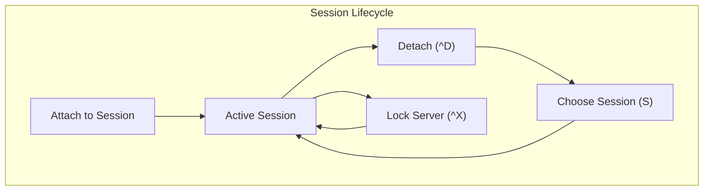
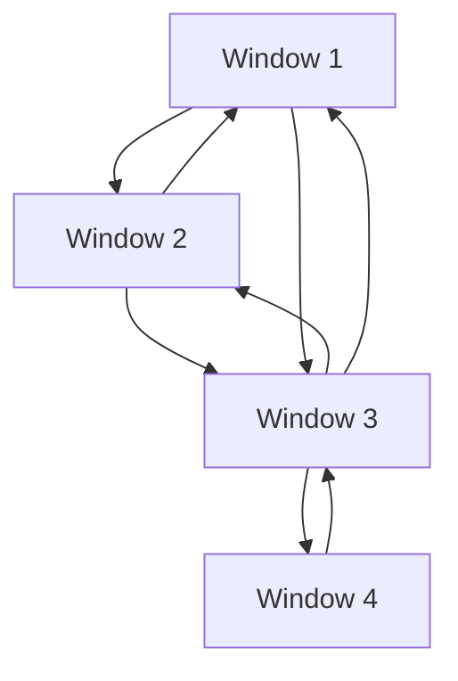
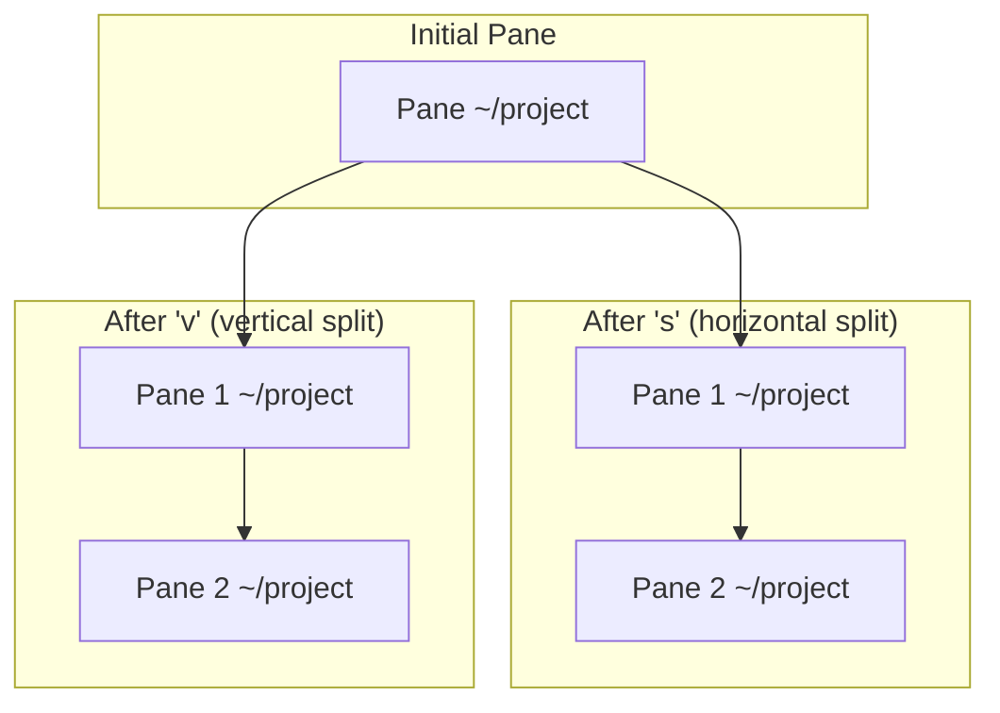
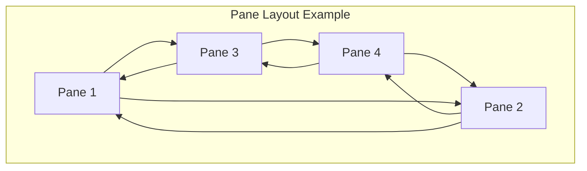
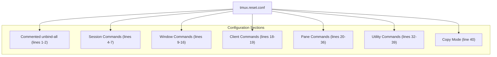

[/](/)

[/search](/search)

[/wiki](/wiki)

[/settings/members](/settings/members)

[/settings/support](/settings/support)

[Add repo](/repositories)

[All repos](/wiki)

[backend](/wiki/Klaudioz/backend)

[BH-Workflow-Engine](/wiki/Klaudioz/BH-Workflow-Engine)

[Buckhead_CRM](/wiki/Klaudioz/Buckhead_CRM)

[dotfiles](/wiki/Klaudioz/dotfiles)

[frontend](/wiki/Klaudioz/frontend)

[godeep.wiki-jb](/wiki/Klaudioz/godeep.wiki-jb)

[pi-mono-zero](/wiki/Klaudioz/pi-mono-zero)

[VirtualOracle](/wiki/Klaudioz/VirtualOracle)

# tmux KeybindingsLink copied!

> **Relevant source files**
> * [nix-darwin/flake.lock](https://github.com/Klaudioz/dotfiles/blob/2febda55/nix-darwin/flake.lock)
> * [tmux/tmux.reset.conf](https://github.com/Klaudioz/dotfiles/blob/2febda55/tmux/tmux.reset.conf)

This document provides comprehensive documentation of all custom tmux keybindings defined in the dotfiles repository. The keybindings are configured in [tmux/tmux.reset.conf](https://github.com/Klaudioz/dotfiles/blob/2febda55/tmux/tmux.reset.conf)

 This page covers user-defined mappings for session management, window navigation, pane manipulation, and utility commands.

For general tmux configuration options and settings, see [Core tmux Configuration](#5.1). For tmux plugin configurations and their associated keybindings, see [tmux Plugin System](#5.2).

## Keybinding ArchitectureLink copied!

The tmux keybinding system in this configuration follows a layered approach with a custom prefix key followed by action keys. All keybindings are defined in a single reset configuration file that replaces default tmux keybindings with an optimized set.

**Keybinding Structure Overview**

Sources: [tmux/tmux.reset.conf L1-L41](https://github.com/Klaudioz/dotfiles/blob/2febda55/tmux/tmux.reset.conf#L1-L41)

## Keybinding CategoriesLink copied!

### Session ManagementLink copied!

Session-level operations control tmux server state, session attachment/detachment, and session selection.

| Keybinding | Command | Description |
| --- | --- | --- |
| `prefix + ^X` | `lock-server` | Lock the tmux server |
| `prefix + ^D` | `detach` | Detach from current session |
| `prefix + *` | `list-clients` | List all connected clients |
| `prefix + S` | `choose-session` | Interactive session chooser |

**Session Management Flow**

Sources: [tmux/tmux.reset.conf L4-L7](https://github.com/Klaudioz/dotfiles/blob/2febda55/tmux/tmux.reset.conf#L4-L7)

 [tmux/tmux.reset.conf L37](https://github.com/Klaudioz/dotfiles/blob/2febda55/tmux/tmux.reset.conf#L37-L37)

### Window ManagementLink copied!

Window operations handle tmux window creation, navigation, and organization within a session.

| Keybinding | Command | Description |
| --- | --- | --- |
| `prefix + ^C` | `new-window -c "$HOME"` | Create new window in home directory |
| `prefix + H` | `previous-window` | Navigate to previous window |
| `prefix + L` | `next-window` | Navigate to next window |
| `prefix + ^A` | `last-window` | Switch to last active window |
| `prefix + r` | `command-prompt "rename-window %%"` | Rename current window |
| `prefix + ^W` | `list-windows` | List all windows with details |
| `prefix + w` | `list-windows` | List all windows (duplicate) |
| `prefix + "` | `choose-window` | Interactive window chooser |

**Window Navigation Pattern**

Sources: [tmux/tmux.reset.conf L5](https://github.com/Klaudioz/dotfiles/blob/2febda55/tmux/tmux.reset.conf#L5-L5)

 [tmux/tmux.reset.conf L9-L10](https://github.com/Klaudioz/dotfiles/blob/2febda55/tmux/tmux.reset.conf#L9-L10)

 [tmux/tmux.reset.conf L12-L16](https://github.com/Klaudioz/dotfiles/blob/2febda55/tmux/tmux.reset.conf#L12-L16)

 [tmux/tmux.reset.conf L23](https://github.com/Klaudioz/dotfiles/blob/2febda55/tmux/tmux.reset.conf#L23-L23)

### Pane Creation and SplittingLink copied!

Pane creation commands split the current pane into multiple panes, preserving the working directory.

| Keybinding | Command | Description |
| --- | --- | --- |
| `prefix + | ` | `split-window` |
| `prefix + s` | `split-window -v -c "#{pane_current_path}"` | Split pane vertically, preserve directory |
| `prefix + v` | `split-window -h -c "#{pane_current_path}"` | Split pane horizontally, preserve directory |

**Pane Splitting Behavior**

Note: The `#{pane_current_path}` variable ensures new panes inherit the working directory of the pane being split.

Sources: [tmux/tmux.reset.conf L20-L22](https://github.com/Klaudioz/dotfiles/blob/2febda55/tmux/tmux.reset.conf#L20-L22)

### Pane NavigationLink copied!

Vim-style directional keys enable efficient pane navigation without leaving the home row.

| Keybinding | Command | Description |
| --- | --- | --- |
| `prefix + h` | `select-pane -L` | Select pane to the left |
| `prefix + j` | `select-pane -D` | Select pane below |
| `prefix + k` | `select-pane -U` | Select pane above |
| `prefix + l` | `select-pane -R` | Select pane to the right |

**Pane Navigation Grid**

Sources: [tmux/tmux.reset.conf L24-L27](https://github.com/Klaudioz/dotfiles/blob/2febda55/tmux/tmux.reset.conf#L24-L27)

### Pane ResizingLink copied!

Repeatable keybindings allow rapid pane resizing without re-entering the prefix key. The `-r` flag in the binding enables repetition within the `repeat-time` window.

| Keybinding | Command | Description |
| --- | --- | --- |
| `prefix + ,` | `resize-pane -L 20` | Resize pane left by 20 columns (repeatable) |
| `prefix + .` | `resize-pane -R 20` | Resize pane right by 20 columns (repeatable) |
| `prefix + -` | `resize-pane -D 7` | Resize pane down by 7 rows (repeatable) |
| `prefix + =` | `resize-pane -U 7` | Resize pane up by 7 rows (repeatable) |

The `-r -T prefix` flags specify that these bindings are repeatable within the prefix key table. After the initial `prefix + key`, you can press the key repeatedly without re-entering the prefix.

**Resize Increments**

| Direction | Key | Increment | Use Case |
| --- | --- | --- | --- |
| Horizontal | `,` (left) | 20 columns | Wide terminal adjustments |
| Horizontal | `.` (right) | 20 columns | Wide terminal adjustments |
| Vertical | `-` (down) | 7 rows | Smaller vertical adjustments |
| Vertical | `=` (up) | 7 rows | Smaller vertical adjustments |

Sources: [tmux/tmux.reset.conf L28-L31](https://github.com/Klaudioz/dotfiles/blob/2febda55/tmux/tmux.reset.conf#L28-L31)

### Pane ManipulationLink copied!

Additional pane operations for zoom, swap, and destruction.

| Keybinding | Command | Description |
| --- | --- | --- |
| `prefix + z` | `resize-pane -Z` | Toggle pane zoom (maximize/restore) |
| `prefix + c` | `kill-pane` | Kill current pane |
| `prefix + x` | `swap-pane -D` | Swap pane with next pane |
| `prefix + *` | `setw synchronize-panes` | Toggle synchronized input across panes |
| `prefix + P` | `set pane-border-status` | Toggle pane border status display |

Sources: [tmux/tmux.reset.conf L17](https://github.com/Klaudioz/dotfiles/blob/2febda55/tmux/tmux.reset.conf#L17-L17)

 [tmux/tmux.reset.conf L33-L36](https://github.com/Klaudioz/dotfiles/blob/2febda55/tmux/tmux.reset.conf#L33-L36)

### Client and ConfigurationLink copied!

Commands for refreshing the tmux client and reloading configuration.

| Keybinding | Command | Description |
| --- | --- | --- |
| `prefix + ^L` | `refresh-client` | Refresh the current client |
| `prefix + l` | `refresh-client` | Refresh the current client (duplicate) |
| `prefix + R` | `source-file ~/.config/tmux/tmux.conf` | Reload tmux configuration |
| `prefix + K` | `send-keys "clear"\; send-keys "Enter"` | Clear terminal screen |

The `R` keybinding sources the main configuration file at [~/.config/tmux/tmux.conf](https://github.com/Klaudioz/dotfiles/blob/2febda55/~/.config/tmux/tmux.conf)

 which in turn sources this reset file and other configuration files.

Sources: [tmux/tmux.reset.conf L13](https://github.com/Klaudioz/dotfiles/blob/2febda55/tmux/tmux.reset.conf#L13-L13)

 [tmux/tmux.reset.conf L18-L19](https://github.com/Klaudioz/dotfiles/blob/2febda55/tmux/tmux.reset.conf#L18-L19)

 [tmux/tmux.reset.conf L38-L39](https://github.com/Klaudioz/dotfiles/blob/2febda55/tmux/tmux.reset.conf#L38-L39)

### Copy ModeLink copied!

Vim-style visual selection in copy mode.

| Keybinding | Command | Description | Mode |
| --- | --- | --- | --- |
| `v` | `send-keys -X begin-selection` | Begin visual selection | copy-mode-vi |

This binding activates visual selection in copy mode when using vi keybindings. After entering copy mode (typically with `prefix + <FileRef file-url="https://github.com/Klaudioz/dotfiles/blob/2febda55/` by default or through plugin keybindings), pressing `v` begins visual selection similar to vim's visual mode.\n\nSources#LNaN-LNaN" NaN  file-path="`by default or through plugin keybindings), pressing`v` begins visual selection similar to vim's visual mode.\n\nSources">Hii

### Command PromptLink copied!

Direct access to tmux command execution.

| Keybinding | Command | Description |
| --- | --- | --- |
| `prefix + :` | `command-prompt` | Open tmux command prompt |

This opens an interactive command prompt where any tmux command can be entered directly, similar to vim's command mode.

Sources: [tmux/tmux.reset.conf L32](https://github.com/Klaudioz/dotfiles/blob/2febda55/tmux/tmux.reset.conf#L32-L32)

## Complete Keybinding ReferenceLink copied!

The following table provides a comprehensive quick reference of all keybindings organized alphabetically by the action key.

| Action Key | Full Binding | Function | Category |
| --- | --- | --- | --- |
| `*` | `prefix + *` | List clients / Toggle pane sync | Session / Pane |
| `,` | `prefix + ,` | Resize pane left (repeatable) | Pane Resize |
| `-` | `prefix + -` | Resize pane down (repeatable) | Pane Resize |
| `.` | `prefix + .` | Resize pane right (repeatable) | Pane Resize |
| `=` | `prefix + =` | Resize pane up (repeatable) | Pane Resize |
| `:` | `prefix + :` | Command prompt | Utility |
| `"` | `prefix + "` | Choose window | Window |
| `*` | `prefix + *` | List clients | Session |
| ` | ` | `prefix + | ` |
| `^A` | `prefix + ^A` | Last window | Window |
| `^C` | `prefix + ^C` | New window | Window |
| `^D` | `prefix + ^D` | Detach | Session |
| `^L` | `prefix + ^L` | Refresh client | Utility |
| `^W` | `prefix + ^W` | List windows | Window |
| `^X` | `prefix + ^X` | Lock server | Session |
| `c` | `prefix + c` | Kill pane | Pane |
| `h` | `prefix + h` | Select pane left | Pane Nav |
| `H` | `prefix + H` | Previous window | Window |
| `j` | `prefix + j` | Select pane down | Pane Nav |
| `k` | `prefix + k` | Select pane up | Pane Nav |
| `K` | `prefix + K` | Clear screen | Utility |
| `l` | `prefix + l` | Refresh client | Utility |
| `L` | `prefix + L` | Next window | Window |
| `P` | `prefix + P` | Toggle pane border status | Pane |
| `r` | `prefix + r` | Rename window | Window |
| `R` | `prefix + R` | Reload configuration | Utility |
| `s` | `prefix + s` | Split vertically | Pane |
| `S` | `prefix + S` | Choose session | Session |
| `v` | `prefix + v` | Split horizontally | Pane |
| `v` | `v` (in copy-mode-vi) | Begin selection | Copy |
| `w` | `prefix + w` | List windows | Window |
| `x` | `prefix + x` | Swap pane | Pane |
| `z` | `prefix + z` | Toggle zoom | Pane |

Sources: [tmux/tmux.reset.conf L1-L41](https://github.com/Klaudioz/dotfiles/blob/2febda55/tmux/tmux.reset.conf#L1-L41)

## Keybinding File StructureLink copied!

The keybinding configuration is contained in a single file with a clear structure:

**File: tmux/tmux.reset.conf**

The file is sourced by the main [tmux.conf](https://github.com/Klaudioz/dotfiles/blob/2febda55/tmux.conf)

 configuration file, typically located at `~/.config/tmux/tmux.conf`. The commented `unbind-key -a` at line 2 indicates this file was originally designed to completely replace default keybindings, but that line is currently disabled.

Sources: [tmux/tmux.reset.conf L1-L41](https://github.com/Klaudioz/dotfiles/blob/2febda55/tmux/tmux.reset.conf#L1-L41)

## Integration with PluginsLink copied!

While this file defines core keybindings, additional keybindings may be provided by tmux plugins configured in the plugin system. Notable plugins that add their own keybindings include:

* **tmux-fzf**: Provides fuzzy finding interfaces (see [tmux Plugin System](#5.2))
* **tmux-sessionx**: Enhanced session management (see [tmux Plugin System](#5.2))
* **tmux-yank**: Clipboard integration (see [tmux Plugin System](#5.2))
* **tmux-floax**: Floating pane functionality (see [tmux Plugin System](#5.2))

These plugin keybindings complement the base keybindings defined in this file.

Sources: [tmux/tmux.reset.conf L1-L41](https://github.com/Klaudioz/dotfiles/blob/2febda55/tmux/tmux.reset.conf#L1-L41)

## Design PhilosophyLink copied!

The keybinding scheme follows these principles:

1. **Vim-style navigation**: Pane navigation uses `hjkl` keys consistent with vim movement
2. **Mnemonic mappings**: Keys like `s` (split vertically), `v` (split horizontally/vertically), `r` (rename), `R` (reload)
3. **Repeatable resizing**: Pane resize commands use the `-r` flag for rapid adjustments
4. **Control key combinations**: Session-critical operations like detach (`^D`) and new window (`^C`) use control keys
5. **Directory preservation**: Split commands use `#{pane_current_path}` to maintain working directory context
6. **Logical grouping**: Related operations (window navigation H/L, pane navigation hjkl) use similar key patterns

Sources: [tmux/tmux.reset.conf L1-L41](https://github.com/Klaudioz/dotfiles/blob/2febda55/tmux/tmux.reset.conf#L1-L41)

Refresh this wiki

Last indexed: 18 December 2025 ([2febda](https://github.com/Klaudioz/dotfiles/commit/2febda55))

### On this page

* [tmux Keybindings](#5.3-tmux-keybindings)
* [Keybinding Architecture](#5.3-keybinding-architecture)
* [Keybinding Categories](#5.3-keybinding-categories)
* [Session Management](#5.3-session-management)
* [Window Management](#5.3-window-management)
* [Pane Creation and Splitting](#5.3-pane-creation-and-splitting)
* [Pane Navigation](#5.3-pane-navigation)
* [Pane Resizing](#5.3-pane-resizing)
* [Pane Manipulation](#5.3-pane-manipulation)
* [Client and Configuration](#5.3-client-and-configuration)
* [Copy Mode](#5.3-copy-mode)
* [Command Prompt](#5.3-command-prompt)
* [Complete Keybinding Reference](#5.3-complete-keybinding-reference)
* [Keybinding File Structure](#5.3-keybinding-file-structure)
* [Integration with Plugins](#5.3-integration-with-plugins)
* [Design Philosophy](#5.3-design-philosophy)

Ask Devin about dotfiles

  

Syntax error in text

mermaid version 11.4.1

Syntax error in text

mermaid version 11.4.1

Syntax error in text

mermaid version 11.4.1

Syntax error in text

mermaid version 11.4.1

Syntax error in text

mermaid version 11.4.1

Syntax error in text

mermaid version 11.4.1

Syntax error in text

mermaid version 11.4.1

Syntax error in text

mermaid version 11.4.1