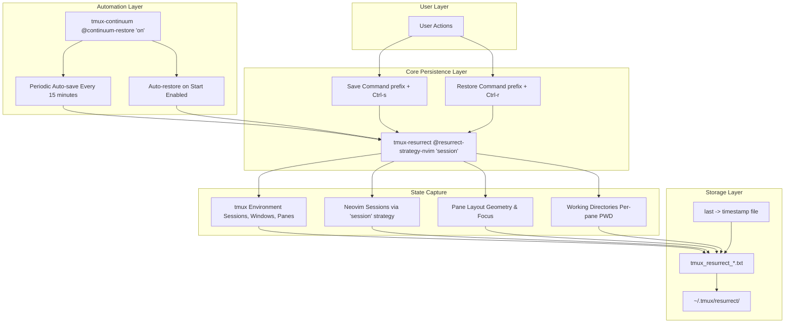
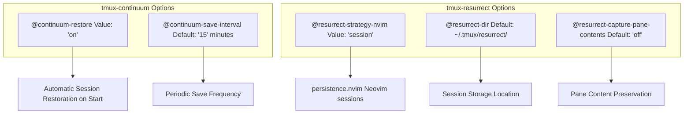
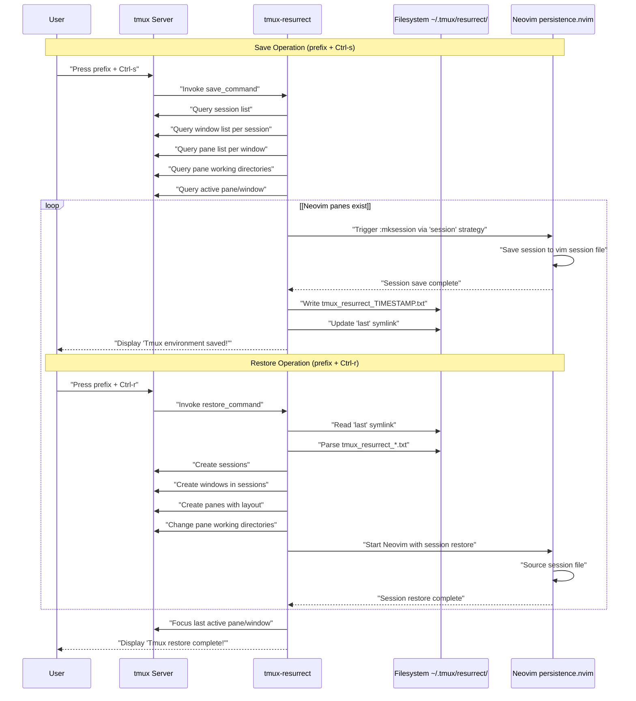
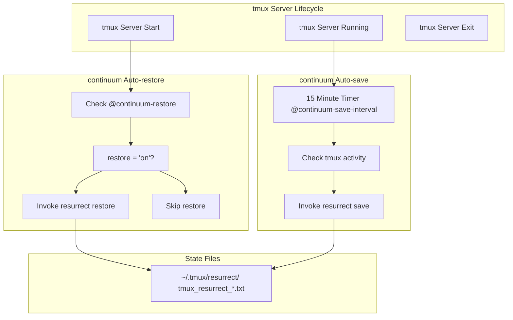
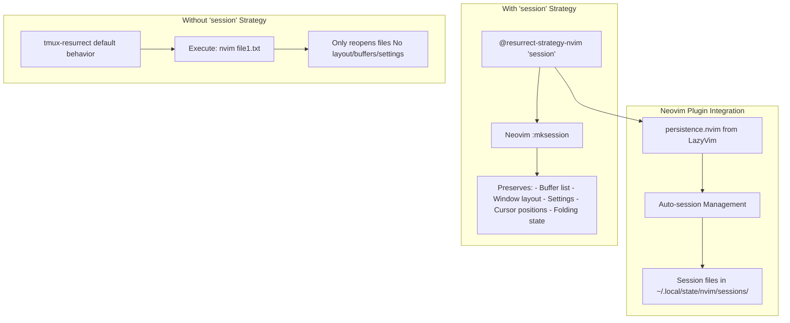
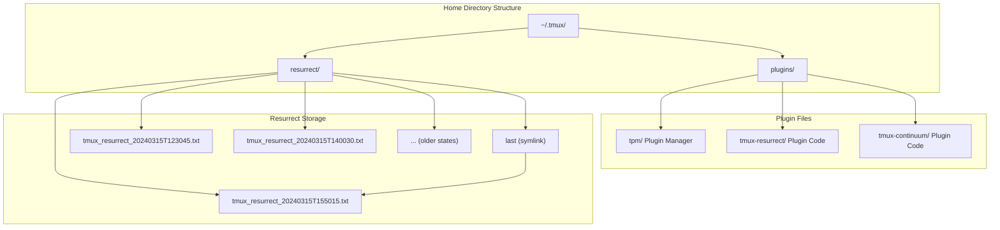
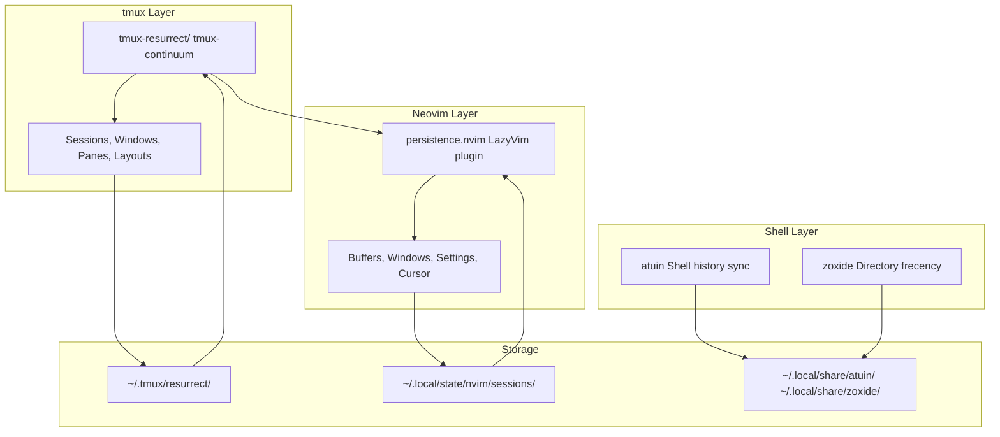

[/](/)

[/search](/search)

[/wiki](/wiki)

[/settings/members](/settings/members)

[/settings/support](/settings/support)

[Add repo](/repositories)

[All repos](/wiki)

[backend](/wiki/Klaudioz/backend)

[BH-Workflow-Engine](/wiki/Klaudioz/BH-Workflow-Engine)

[Buckhead_CRM](/wiki/Klaudioz/Buckhead_CRM)

[dotfiles](/wiki/Klaudioz/dotfiles)

[frontend](/wiki/Klaudioz/frontend)

[godeep.wiki-jb](/wiki/Klaudioz/godeep.wiki-jb)

[pi-mono-zero](/wiki/Klaudioz/pi-mono-zero)

[VirtualOracle](/wiki/Klaudioz/VirtualOracle)

# Session PersistenceLink copied!

> **Relevant source files**
> * [tmux/tmux.conf](https://github.com/Klaudioz/dotfiles/blob/2febda55/tmux/tmux.conf)

## Purpose and ScopeLink copied!

This document explains the session persistence system in tmux, which automatically saves and restores terminal sessions, windows, panes, and their working directories. The system is implemented through two plugins: `tmux-resurrect` for core save/restore functionality and `tmux-continuum` for automation. This page covers the configuration, persistence mechanisms, storage format, and integration with Neovim session management.

For the broader tmux plugin ecosystem, see [5.2](#5.2). For Neovim-specific persistence (which integrates with this system), see [4.9](#4.9).

---

## Architecture OverviewLink copied!

The session persistence system operates through a three-layer architecture: `tmux-resurrect` provides manual save/restore capabilities, `tmux-continuum` adds automation on top of resurrect, and special integration handles Neovim session state separately from terminal state.

### Persistence System ComponentsLink copied!



**Sources:** [tmux/tmux.conf L24-L25](https://github.com/Klaudioz/dotfiles/blob/2febda55/tmux/tmux.conf#L24-L25)

 [tmux/tmux.conf L48-L49](https://github.com/Klaudioz/dotfiles/blob/2febda55/tmux/tmux.conf#L48-L49)

---

## Plugin ConfigurationLink copied!

The session persistence system is configured through two plugin declarations and their associated options in the main tmux configuration.

### Core Plugin DeclarationsLink copied!

| Plugin | Purpose | Configuration Line |
| --- | --- | --- |
| `tmux-plugins/tmux-resurrect` | Provides save/restore functionality | [tmux/tmux.conf L24](https://github.com/Klaudioz/dotfiles/blob/2febda55/tmux/tmux.conf#L24-L24) |
| `tmux-plugins/tmux-continuum` | Adds automation and scheduling | [tmux/tmux.conf L25](https://github.com/Klaudioz/dotfiles/blob/2febda55/tmux/tmux.conf#L25-L25) |

### Configuration OptionsLink copied!



**Key Configuration Lines:**

```
set -g @continuum-restore 'on'
set -g @resurrect-strategy-nvim 'session'
```

The `@continuum-restore` option [tmux/tmux.conf L48](https://github.com/Klaudioz/dotfiles/blob/2febda55/tmux/tmux.conf#L48-L48)

 enables automatic restoration of the last saved session when tmux starts. The `@resurrect-strategy-nvim` option [tmux/tmux.conf L49](https://github.com/Klaudioz/dotfiles/blob/2febda55/tmux/tmux.conf#L49-L49)

 configures how Neovim sessions are handled during save/restore operations.

**Sources:** [tmux/tmux.conf L48-L49](https://github.com/Klaudioz/dotfiles/blob/2febda55/tmux/tmux.conf#L48-L49)

---

## Save and Restore MechanismLink copied!

### Manual Save/Restore WorkflowLink copied!



The save operation captures:

* All tmux sessions and their names
* Window structure within each session
* Pane layout geometry and split directions
* Working directory per pane
* Active pane and window indicators
* Neovim session state when `@resurrect-strategy-nvim 'session'` is configured

**Sources:** [tmux/tmux.conf L24](https://github.com/Klaudioz/dotfiles/blob/2febda55/tmux/tmux.conf#L24-L24)

 [tmux/tmux.conf L49](https://github.com/Klaudioz/dotfiles/blob/2febda55/tmux/tmux.conf#L49-L49)

---

## Automatic Persistence with tmux-continuumLink copied!

### Automation ArchitectureLink copied!

The `tmux-continuum` plugin extends `tmux-resurrect` with two automatic behaviors: periodic saving and automatic restoration on tmux server start.



### Continuum Configuration DetailsLink copied!

| Option | Value | Effect |
| --- | --- | --- |
| `@continuum-restore` | `'on'` | Enables automatic session restore when tmux starts |
| `@continuum-save-interval` | `'15'` (default) | Save interval in minutes (not explicitly set, uses default) |

The automatic restoration occurs during tmux server initialization, before the user sees any prompts. The automatic save runs every 15 minutes in the background, requiring no user interaction.

**Sources:** [tmux/tmux.conf L48](https://github.com/Klaudioz/dotfiles/blob/2febda55/tmux/tmux.conf#L48-L48)

---

## Neovim Session IntegrationLink copied!

### Strategy ConfigurationLink copied!

The `@resurrect-strategy-nvim 'session'` option [tmux/tmux.conf L49](https://github.com/Klaudioz/dotfiles/blob/2febda55/tmux/tmux.conf#L49-L49)

 integrates tmux persistence with Neovim's session management. This strategy tells `tmux-resurrect` to use Neovim's `:mksession` functionality rather than attempting to restore Neovim by re-running the `nvim` command with file arguments.



### Integration BehaviorLink copied!

When a Neovim pane is saved with the `'session'` strategy:

1. `tmux-resurrect` detects a running Neovim process in the pane
2. It sends a command to trigger Neovim session save (via `:mksession`)
3. The session file location is stored in the resurrect state file
4. On restore, Neovim is started with the session file argument
5. Neovim loads the full session state including: * All buffers and their content * Window splits and layout * Cursor positions in each buffer * Folding states * Local options and settings

This integrates with the `persistence.nvim` plugin configured in Neovim (see [4.9](#4.9)), which manages session files in `~/.local/state/nvim/sessions/`.

**Sources:** [tmux/tmux.conf L49](https://github.com/Klaudioz/dotfiles/blob/2febda55/tmux/tmux.conf#L49-L49)

---

## Session Storage StructureLink copied!

### File System LayoutLink copied!



### State File FormatLink copied!

The state files (`tmux_resurrect_*.txt`) are plain text files with tab-separated values. Each line represents one element of the tmux session structure.

**State File Line Types:**

| Line Type | Format | Example |
| --- | --- | --- |
| Session | `session <name> <flags>` | `session main 0` |
| Window | `window <session> <index> <flags> <name>` | `window main 1 * :editor` |
| Pane | `pane <session> <window> <pane_id> <geometry> <pwd> <active>` | `pane main 1 %0 :0,0,80x24 /home/user :` |
| Neovim | `nvim <session> <window> <pane_id> <session_file>` | `nvim main 1 %0 /path/to/session.vim` |

**Key Storage Details:**

* Timestamp format: `YYYYMMDDTHHMMSS` (ISO 8601 basic format)
* The `last` symlink always points to the most recent state file
* Old state files are retained for manual recovery if needed
* State files are typically 1-5 KB depending on complexity

**Sources:** [tmux/tmux.conf L24-L25](https://github.com/Klaudioz/dotfiles/blob/2febda55/tmux/tmux.conf#L24-L25)

---

## Usage WorkflowLink copied!

### Default KeybindingsLink copied!

With the default `tmux-resurrect` configuration, the following keybindings are available:

| Keybinding | Action | Description |
| --- | --- | --- |
| `prefix` + `Ctrl-s` | Save | Manually save current tmux session state |
| `prefix` + `Ctrl-r` | Restore | Manually restore from last saved state |

Note: The `prefix` is configured as `^A` (Ctrl-A) in [tmux/tmux.conf L5](https://github.com/Klaudioz/dotfiles/blob/2febda55/tmux/tmux.conf#L5-L5)

### Automatic WorkflowLink copied!

```

```

### Typical User ExperienceLink copied!

**First Launch (No Saved State):**

1. User starts tmux
2. `tmux-continuum` checks for saved state (none exists)
3. User creates sessions, windows, panes manually
4. After 15 minutes, state is automatically saved
5. On subsequent launches, this state is restored

**Daily Use (Saved State Exists):**

1. User starts tmux
2. `tmux-continuum` automatically restores last saved state
3. All sessions, windows, panes, and working directories reappear
4. Neovim sessions are restored with full editor state
5. User continues work from exactly where they left off
6. State is saved every 15 minutes in the background

**Manual Recovery:**

1. User can manually save at any time with `prefix` + `Ctrl-s`
2. User can manually restore at any time with `prefix` + `Ctrl-r`
3. If automatic restore fails, manual restore can recover state

**Sources:** [tmux/tmux.conf L5](https://github.com/Klaudioz/dotfiles/blob/2febda55/tmux/tmux.conf#L5-L5)

 [tmux/tmux.conf L24-L25](https://github.com/Klaudioz/dotfiles/blob/2febda55/tmux/tmux.conf#L24-L25)

 [tmux/tmux.conf L48-L49](https://github.com/Klaudioz/dotfiles/blob/2febda55/tmux/tmux.conf#L48-L49)

---

## Integration with Other ComponentsLink copied!

### Cross-Component PersistenceLink copied!



The tmux session persistence works in concert with other persistence mechanisms:

* **Neovim Sessions:** Integrated via `@resurrect-strategy-nvim 'session'` [tmux/tmux.conf L49](https://github.com/Klaudioz/dotfiles/blob/2febda55/tmux/tmux.conf#L49-L49)
* **Shell History:** Independently managed by `atuin` (see [3.2.1](#3.2.1) and [3.2.2](#3.2.2))
* **Directory History:** Independently managed by `zoxide` (see [7.3](#7.3))
* **Window Layout:** Independently managed by AeroSpace (see [6.1](#6.1))

Each persistence layer operates independently but complements the others to create a complete restoration of the working environment.

**Sources:** [tmux/tmux.conf L24-L25](https://github.com/Klaudioz/dotfiles/blob/2febda55/tmux/tmux.conf#L24-L25)

 [tmux/tmux.conf L48-L49](https://github.com/Klaudioz/dotfiles/blob/2febda55/tmux/tmux.conf#L48-L49)

Refresh this wiki

Last indexed: 18 December 2025 ([2febda](https://github.com/Klaudioz/dotfiles/commit/2febda55))

### On this page

* [Session Persistence](#5.4-session-persistence)
* [Purpose and Scope](#5.4-purpose-and-scope)
* [Architecture Overview](#5.4-architecture-overview)
* [Persistence System Components](#5.4-persistence-system-components)
* [Plugin Configuration](#5.4-plugin-configuration)
* [Core Plugin Declarations](#5.4-core-plugin-declarations)
* [Configuration Options](#5.4-configuration-options)
* [Save and Restore Mechanism](#5.4-save-and-restore-mechanism)
* [Manual Save/Restore Workflow](#5.4-manual-saverestore-workflow)
* [Automatic Persistence with tmux-continuum](#5.4-automatic-persistence-with-tmux-continuum)
* [Automation Architecture](#5.4-automation-architecture)
* [Continuum Configuration Details](#5.4-continuum-configuration-details)
* [Neovim Session Integration](#5.4-neovim-session-integration)
* [Strategy Configuration](#5.4-strategy-configuration)
* [Integration Behavior](#5.4-integration-behavior)
* [Session Storage Structure](#5.4-session-storage-structure)
* [File System Layout](#5.4-file-system-layout)
* [State File Format](#5.4-state-file-format)
* [Usage Workflow](#5.4-usage-workflow)
* [Default Keybindings](#5.4-default-keybindings)
* [Automatic Workflow](#5.4-automatic-workflow)
* [Typical User Experience](#5.4-typical-user-experience)
* [Integration with Other Components](#5.4-integration-with-other-components)
* [Cross-Component Persistence](#5.4-cross-component-persistence)

Ask Devin about dotfiles

  

Syntax error in text

mermaid version 11.4.1

Syntax error in text

mermaid version 11.4.1

Syntax error in text

mermaid version 11.4.1

Syntax error in text

mermaid version 11.4.1

Syntax error in text

mermaid version 11.4.1

Syntax error in text

mermaid version 11.4.1

Syntax error in text

mermaid version 11.4.1

Syntax error in text

mermaid version 11.4.1

Syntax error in text

mermaid version 11.4.1