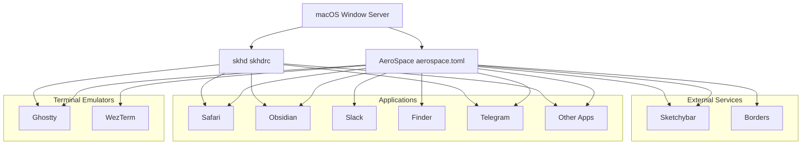
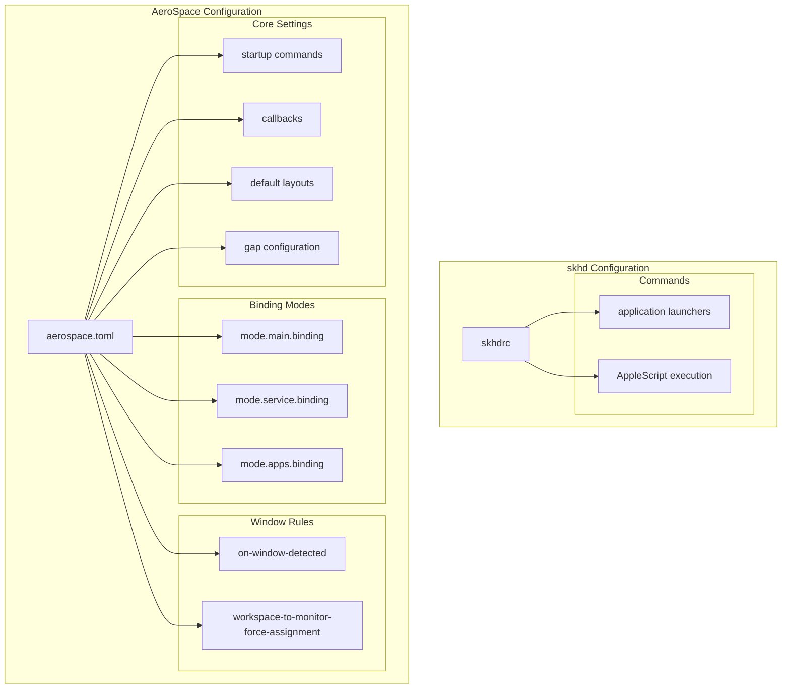
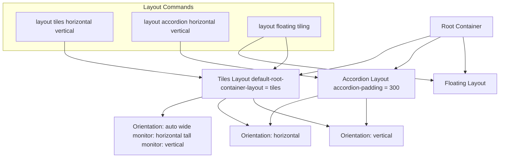
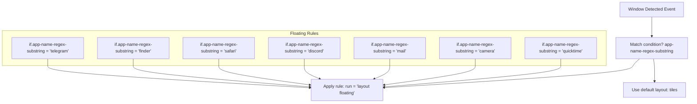

[/](/)

[/search](/search)

[/wiki](/wiki)

[/settings/members](/settings/members)

[/settings/support](/settings/support)

[Add repo](/repositories)

[All repos](/wiki)

[backend](/wiki/Klaudioz/backend)

[BH-Workflow-Engine](/wiki/Klaudioz/BH-Workflow-Engine)

[Buckhead_CRM](/wiki/Klaudioz/Buckhead_CRM)

[dotfiles](/wiki/Klaudioz/dotfiles)

[frontend](/wiki/Klaudioz/frontend)

[godeep.wiki-jb](/wiki/Klaudioz/godeep.wiki-jb)

[pi-mono-zero](/wiki/Klaudioz/pi-mono-zero)

[VirtualOracle](/wiki/Klaudioz/VirtualOracle)

# Window ManagementLink copied!

> **Relevant source files**
> * [aerospace/aerospace.toml](https://github.com/Klaudioz/dotfiles/blob/2febda55/aerospace/aerospace.toml)
> * [skhd/skhdrc](https://github.com/Klaudioz/dotfiles/blob/2febda55/skhd/skhdrc)

The window management system provides tiling window management capabilities on macOS, organizing application windows into workspaces with automatic layout management. This layer sits at the top of the development environment stack, managing the visual arrangement of terminal emulators, browsers, and other GUI applications.

This document provides an overview of the window management architecture and how its components integrate with the rest of the system. For detailed configuration of the tiling window manager, see [AeroSpace Tiling Window Manager](#6.1). For hotkey bindings and application launching shortcuts, see [skhd Hotkey Configuration](#6.2).

## Architecture OverviewLink copied!

The window management layer consists of two complementary tools:

| Component | Purpose | Configuration File | Importance Score |
| --- | --- | --- | --- |
| **AeroSpace** | Tiling window manager that automatically arranges windows into layouts | `aerospace/aerospace.toml` | 8.88 |
| **skhd** | Hotkey daemon that provides global keyboard shortcuts for launching applications | `skhd/skhdrc` | 4.25 |

AeroSpace serves as the primary window manager, implementing i3-inspired tiling behavior on macOS, while skhd provides supplementary hotkey functionality for application launching and system control.

Sources: [aerospace/aerospace.toml L1-L216](https://github.com/Klaudioz/dotfiles/blob/2febda55/aerospace/aerospace.toml#L1-L216)

 [skhd/skhdrc L1-L32](https://github.com/Klaudioz/dotfiles/blob/2febda55/skhd/skhdrc#L1-L32)

## System IntegrationLink copied!



**Window Management Integration Flow**

AeroSpace intercepts window creation events from the macOS Window Server and applies layout rules defined in `aerospace.toml`. When windows are created, AeroSpace determines whether they should be tiled or floated based on `on-window-detected` callbacks. Meanwhile, skhd listens for keyboard events and executes commands to launch applications or run AppleScripts.

Sources: [aerospace/aerospace.toml L1-L8](https://github.com/Klaudioz/dotfiles/blob/2febda55/aerospace/aerospace.toml#L1-L8)

 [aerospace/aerospace.toml L50-L89](https://github.com/Klaudioz/dotfiles/blob/2febda55/aerospace/aerospace.toml#L50-L89)

 [skhd/skhdrc L1-L32](https://github.com/Klaudioz/dotfiles/blob/2febda55/skhd/skhdrc#L1-L32)

## Configuration ArchitectureLink copied!



**Configuration Structure**

The `aerospace.toml` configuration file is organized into several logical sections that control different aspects of window management behavior. The `skhdrc` file complements this with simple hotkey-to-command mappings.

Sources: [aerospace/aerospace.toml L1-L216](https://github.com/Klaudioz/dotfiles/blob/2febda55/aerospace/aerospace.toml#L1-L216)

 [skhd/skhdrc L1-L32](https://github.com/Klaudioz/dotfiles/blob/2febda55/skhd/skhdrc#L1-L32)

## Window Management ModesLink copied!

AeroSpace implements multiple operational modes through its binding system:

### Main ModeLink copied!

The default mode for day-to-day window management operations. All primary keybindings for focusing windows, moving windows between workspaces, and changing layouts are defined in `[mode.main.binding]`.

**Key Operations:**

| Keybinding | Command | Purpose |
| --- | --- | --- |
| `alt-h/j/k/l` | `focus left/down/up/right` | Navigate between windows |
| `alt-shift-h/j/k/l` | `move left/down/up/right` | Move windows within workspace |
| `alt-1/2/3/4` | `workspace 1/2/3/4` | Switch to workspace |
| `alt-shift-1/2/3/4` | `move-node-to-workspace 1/2/3/4` | Move window to workspace |
| `alt-slash` | `layout tiles horizontal vertical` | Toggle tiling layout orientation |
| `alt-comma` | `layout accordion horizontal vertical` | Toggle accordion layout |

Sources: [aerospace/aerospace.toml L114-L196](https://github.com/Klaudioz/dotfiles/blob/2febda55/aerospace/aerospace.toml#L114-L196)

### Service ModeLink copied!

Activated via `alt-shift-semicolon`, this mode provides administrative operations for workspace management:

| Keybinding | Command | Purpose |
| --- | --- | --- |
| `esc` | `reload-config`, `mode main` | Reload configuration |
| `r` | `flatten-workspace-tree`, `mode main` | Reset workspace layout |
| `f` | `layout floating tiling`, `mode main` | Toggle floating/tiling |
| `backspace` | `close-all-windows-but-current`, `mode main` | Close all except focused |

Sources: [aerospace/aerospace.toml L200-L204](https://github.com/Klaudioz/dotfiles/blob/2febda55/aerospace/aerospace.toml#L200-L204)

### Apps ModeLink copied!

Activated via `alt-shift-enter`, this mode provides quick application launching:

```
[mode.apps.binding]
alt-w = ['exec-and-forget open -a /Applications/WezTerm.app', 'mode main']
```

Sources: [aerospace/aerospace.toml L206-L207](https://github.com/Klaudioz/dotfiles/blob/2febda55/aerospace/aerospace.toml#L206-L207)

## Workspace and Monitor ConfigurationLink copied!

AeroSpace organizes windows into four primary workspaces with explicit monitor assignments configured in the `[workspace-to-monitor-force-assignment]` section:

```
[workspace-to-monitor-force-assignment]1 = '^Built-in.*$'2 = '^DELL U.*$'3 = '^DELL S.*$'
```

This configuration uses regex patterns to assign workspaces to specific monitors:

* Workspace 1: Built-in display (MacBook screen)
* Workspace 2: DELL U-series monitor
* Workspace 3: DELL S-series monitor

Sources: [aerospace/aerospace.toml L209-L213](https://github.com/Klaudioz/dotfiles/blob/2febda55/aerospace/aerospace.toml#L209-L213)

## Layout SystemLink copied!



**Layout Configuration**

AeroSpace supports three primary layout modes controlled through the `default-root-container-layout` setting and runtime commands:

1. **Tiles Layout**: Windows are arranged in a binary tree structure, automatically subdividing space
2. **Accordion Layout**: Windows are stacked with configurable padding (`accordion-padding = 300`)
3. **Floating Layout**: Windows float freely, not managed by the tiling algorithm

The `default-root-container-orientation` set to `'auto'` automatically chooses horizontal orientation for wide monitors and vertical orientation for tall monitors.

Sources: [aerospace/aerospace.toml L16-L27](https://github.com/Klaudioz/dotfiles/blob/2febda55/aerospace/aerospace.toml#L16-L27)

 [aerospace/aerospace.toml L149-L150](https://github.com/Klaudioz/dotfiles/blob/2febda55/aerospace/aerospace.toml#L149-L150)

## Window Detection and RulesLink copied!



**Window Detection Callbacks**

The `[[on-window-detected]]` callback system allows automatic application of layout rules when windows are created. Applications that work better without tiling (messaging apps, system utilities, browsers) are configured to use floating layout by default:

```
[[on-window-detected]]if.app-name-regex-substring = 'telegram'run = 'layout floating'[[on-window-detected]]if.app-name-regex-substring = 'finder'run = 'layout floating'
```

This configuration applies to: telegram, finder, safari, camera, elgato, discord, mail, trello, quicktime.

Sources: [aerospace/aerospace.toml L50-L89](https://github.com/Klaudioz/dotfiles/blob/2febda55/aerospace/aerospace.toml#L50-L89)

## Gap ConfigurationLink copied!

The `[gaps]` section defines spacing between windows and monitor edges:

| Gap Type | Value | Description |
| --- | --- | --- |
| `inner.horizontal` | 20 | Space between windows horizontally |
| `inner.vertical` | 20 | Space between windows vertically |
| `outer.left` | 20 | Space from left monitor edge |
| `outer.bottom` | 20 | Space from bottom monitor edge |
| `outer.top` | 10 | Space from top monitor edge (smaller for menu bar) |
| `outer.right` | 20 | Space from right monitor edge |

Sources: [aerospace/aerospace.toml L102-L108](https://github.com/Klaudioz/dotfiles/blob/2febda55/aerospace/aerospace.toml#L102-L108)

## Hotkey Daemon IntegrationLink copied!

The `skhd` hotkey daemon provides global keyboard shortcuts that complement AeroSpace's window management. While AeroSpace handles window manipulation, skhd focuses on application launching:

### Application LaunchersLink copied!

```
# Safarialt - s : run-external "open" "-a" "/Applications/Safari.app/Contents/MacOS/Safari"# Telegramalt - t : run-external "open" "-a" "/Applications/Telegram.app/Contents/MacOS/Telegram"# Ghosttyalt - g : run-external "open" "-a" "/Applications/Ghostty.app"
```

### AppleScript ExecutionLink copied!

skhd can execute AppleScripts for system automation:

```
# Show datealt - d : osascript ~/.config/skhd/applescripts/pop.scpt# Close notificationsralt - n : osascript ~/.config/skhd/applescripts/notifications.scpt
```

Sources: [skhd/skhdrc L1-L32](https://github.com/Klaudioz/dotfiles/blob/2febda55/skhd/skhdrc#L1-L32)

## External Service IntegrationLink copied!

AeroSpace integrates with external macOS services through startup and event-triggered commands:

### Startup CommandsLink copied!

```
after-startup-command = ['exec-and-forget sketchybar']
```

Launches Sketchybar status bar on AeroSpace initialization.

### Workspace Change NotificationsLink copied!

```
exec-on-workspace-change = ['/bin/bash', '-c',  'sketchybar --trigger aerospace_workspace_change FOCUSED_WORKSPACE=$AEROSPACE_FOCUSED_WORKSPACE',  'exec-and-forget borders active_color=0xffe1e3e4 inactive_color=0xff494d64 width=0']
```

When workspace changes occur, AeroSpace:

1. Notifies Sketchybar with the current workspace ID via `$AEROSPACE_FOCUSED_WORKSPACE`
2. Updates the `borders` utility with color configuration for active/inactive window indicators

Sources: [aerospace/aerospace.toml L1-L7](https://github.com/Klaudioz/dotfiles/blob/2febda55/aerospace/aerospace.toml#L1-L7)

## Normalization and Behavior SettingsLink copied!

AeroSpace includes several normalization features that adjust container structure:

| Setting | Value | Effect |
| --- | --- | --- |
| `enable-normalization-flatten-containers` | `true` | Removes unnecessary container nesting |
| `enable-normalization-opposite-orientation-for-nested-containers` | `true` | Alternates container orientation to prevent degenerate layouts |
| `automatically-unhide-macos-hidden-apps` | `false` | Respects macOS hidden state (cmd-h) |
| `on-focused-monitor-changed` | `['move-mouse monitor-lazy-center']` | Moves mouse cursor when focus changes monitors |

Sources: [aerospace/aerospace.toml L12-L14](https://github.com/Klaudioz/dotfiles/blob/2febda55/aerospace/aerospace.toml#L12-L14)

 [aerospace/aerospace.toml L34](https://github.com/Klaudioz/dotfiles/blob/2febda55/aerospace/aerospace.toml#L34-L34)

 [aerospace/aerospace.toml L39](https://github.com/Klaudioz/dotfiles/blob/2febda55/aerospace/aerospace.toml#L39-L39)

## Keyboard Layout SupportLink copied!

The keyboard mapping preset is configured for QWERTY layouts:

```
[key-mapping]preset = 'qwerty'
```

This ensures keybindings are correctly interpreted on QWERTY keyboards. Alternative layouts (e.g., Dvorak) can be configured by changing this preset.

Sources: [aerospace/aerospace.toml L92-L93](https://github.com/Klaudioz/dotfiles/blob/2febda55/aerospace/aerospace.toml#L92-L93)

## Relationship to Terminal EnvironmentLink copied!

Window management integrates with the terminal environment layer (see [Terminal Environment](#3)) by managing the visual placement of terminal emulator windows. AeroSpace arranges Ghostty and WezTerm windows according to tiling rules, while the terminal emulators themselves host shells and tmux sessions. This separation of concerns allows terminal sessions to persist independently of window arrangement, with tmux-resurrect handling session persistence (see [Session Persistence](#5.4)) while AeroSpace handles visual layout.

Sources: [aerospace/aerospace.toml L1-L216](https://github.com/Klaudioz/dotfiles/blob/2febda55/aerospace/aerospace.toml#L1-L216)

Refresh this wiki

Last indexed: 18 December 2025 ([2febda](https://github.com/Klaudioz/dotfiles/commit/2febda55))

### On this page

* [Window Management](#6-window-management)
* [Architecture Overview](#6-architecture-overview)
* [System Integration](#6-system-integration)
* [Configuration Architecture](#6-configuration-architecture)
* [Window Management Modes](#6-window-management-modes)
* [Main Mode](#6-main-mode)
* [Service Mode](#6-service-mode)
* [Apps Mode](#6-apps-mode)
* [Workspace and Monitor Configuration](#6-workspace-and-monitor-configuration)
* [Layout System](#6-layout-system)
* [Window Detection and Rules](#6-window-detection-and-rules)
* [Gap Configuration](#6-gap-configuration)
* [Hotkey Daemon Integration](#6-hotkey-daemon-integration)
* [Application Launchers](#6-application-launchers)
* [AppleScript Execution](#6-applescript-execution)
* [External Service Integration](#6-external-service-integration)
* [Startup Commands](#6-startup-commands)
* [Workspace Change Notifications](#6-workspace-change-notifications)
* [Normalization and Behavior Settings](#6-normalization-and-behavior-settings)
* [Keyboard Layout Support](#6-keyboard-layout-support)
* [Relationship to Terminal Environment](#6-relationship-to-terminal-environment)

Ask Devin about dotfiles

  

Syntax error in text

mermaid version 11.4.1

Syntax error in text

mermaid version 11.4.1

Syntax error in text

mermaid version 11.4.1

Syntax error in text

mermaid version 11.4.1

Syntax error in text

mermaid version 11.4.1

Syntax error in text

mermaid version 11.4.1

Syntax error in text

mermaid version 11.4.1

Syntax error in text

mermaid version 11.4.1

Syntax error in text

mermaid version 11.4.1