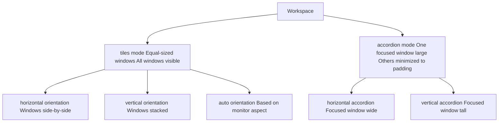
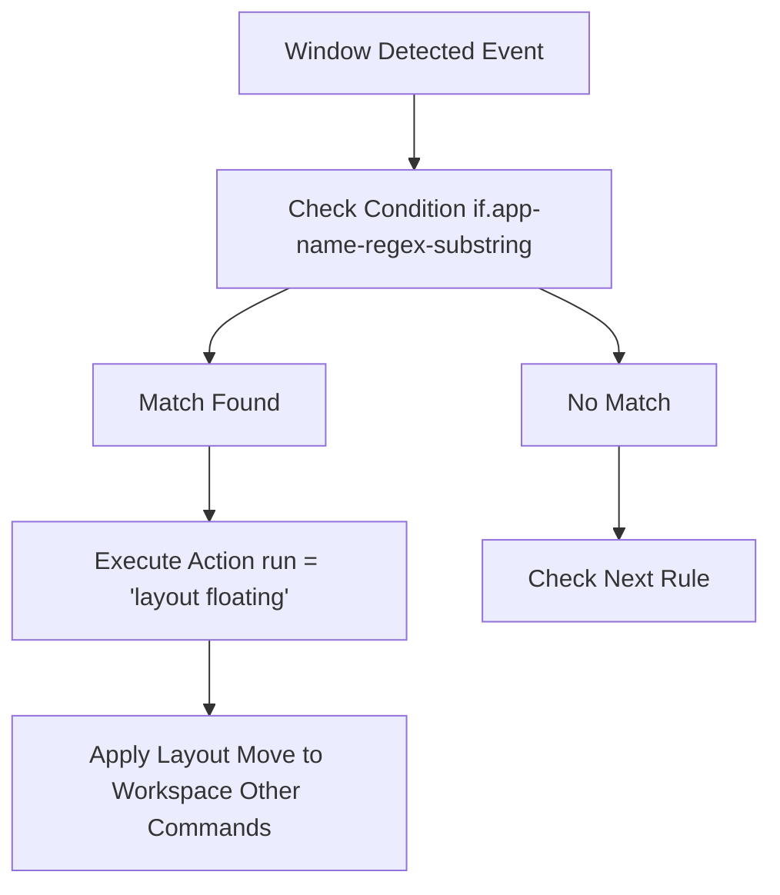
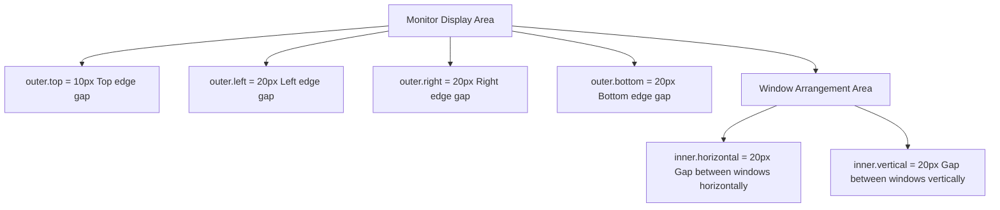
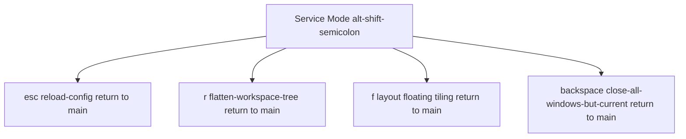
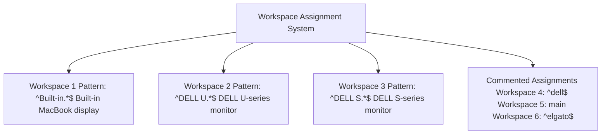
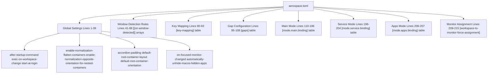

[/](/)

[/search](/search)

[/wiki](/wiki)

[/settings/members](/settings/members)

[/settings/support](/settings/support)

[Add repo](/repositories)

[All repos](/wiki)

[backend](/wiki/Klaudioz/backend)

[BH-Workflow-Engine](/wiki/Klaudioz/BH-Workflow-Engine)

[Buckhead_CRM](/wiki/Klaudioz/Buckhead_CRM)

[dotfiles](/wiki/Klaudioz/dotfiles)

[frontend](/wiki/Klaudioz/frontend)

[godeep.wiki-jb](/wiki/Klaudioz/godeep.wiki-jb)

[pi-mono-zero](/wiki/Klaudioz/pi-mono-zero)

[VirtualOracle](/wiki/Klaudioz/VirtualOracle)

# AeroSpace Tiling Window ManagerLink copied!

> **Relevant source files**
> * [aerospace/aerospace.toml](https://github.com/Klaudioz/dotfiles/blob/2febda55/aerospace/aerospace.toml)

This document provides comprehensive documentation for the AeroSpace tiling window manager configuration (importance: 8.88). AeroSpace is a macOS-native tiling window manager that organizes application windows into non-overlapping layouts, providing i3-like window management for macOS. For information about the skhd hotkey daemon that complements AeroSpace, see [skhd Hotkey Configuration](#6.2). For overall window management concepts, see [Window Management](#6).

The configuration is defined entirely in [aerospace/aerospace.toml L1-L216](https://github.com/Klaudioz/dotfiles/blob/2febda55/aerospace/aerospace.toml#L1-L216)

 and controls workspace organization, window layout behavior, application-specific rules, keybindings, and monitor assignments.

## Configuration StructureLink copied!

AeroSpace uses a single TOML configuration file that defines all window management behavior. The configuration is organized into several logical sections:

```mermaid
flowchart TD

ConfigFile["aerospace.toml"]
Startup["Startup Configuration after-startup-command exec-on-workspace-change"]
Normalization["Normalization Settings flatten-containers opposite-orientation"]
Layout["Layout Configuration accordion-padding default layouts"]
Behavior["Behavior Settings mouse behavior auto-unhide apps"]
WindowRules["Window Detection Rules [[on-window-detected]]"]
Gaps["Gap Configuration [gaps]"]
Bindings["Keybinding Modes [mode.main.binding] [mode.service.binding]"]
Monitors["Monitor Assignment [workspace-to-monitor-force-assignment]"]
FloatingApps["Floating App Rules telegram, finder, safari discord, mail, etc."]
MainMode["main mode window focus/move workspace switching layout controls"]
ServiceMode["service mode reload-config flatten-workspace-tree close-all-windows-but-current"]
AppsMode["apps mode application launchers"]
BuiltIn["Workspace 1 Built-in display"]
DellU["Workspace 2 DELL U monitor"]
DellS["Workspace 3 DELL S monitor"]

ConfigFile --> Startup
ConfigFile --> Normalization
ConfigFile --> Layout
ConfigFile --> Behavior
ConfigFile --> WindowRules
ConfigFile --> Gaps
ConfigFile --> Bindings
ConfigFile --> Monitors
WindowRules --> FloatingApps
Bindings --> MainMode
Bindings --> ServiceMode
Bindings --> AppsMode
Monitors --> BuiltIn
Monitors --> DellU
Monitors --> DellS
```



Sources: [aerospace/aerospace.toml L1-L216](https://github.com/Klaudioz/dotfiles/blob/2febda55/aerospace/aerospace.toml#L1-L216)

## Startup and Integration HooksLink copied!

AeroSpace integrates with external tools through startup commands and workspace change callbacks. These hooks enable integration with status bars and visual indicators.

### After Startup CommandsLink copied!

[aerospace/aerospace.toml L1](https://github.com/Klaudioz/dotfiles/blob/2febda55/aerospace/aerospace.toml#L1-L1)

 defines the `after-startup-command`:

```
after-startup-command = ['exec-and-forget sketchybar']
```

This launches `sketchybar` (a macOS status bar tool) immediately after AeroSpace starts. The `exec-and-forget` command runs the process asynchronously without blocking AeroSpace initialization.

### Workspace Change CallbacksLink copied!

[aerospace/aerospace.toml L4-L7](https://github.com/Klaudioz/dotfiles/blob/2febda55/aerospace/aerospace.toml#L4-L7)

 defines the `exec-on-workspace-change` hook:

```
exec-on-workspace-change = ['/bin/bash', '-c',  'sketchybar --trigger aerospace_workspace_change FOCUSED_WORKSPACE=$AEROSPACE_FOCUSED_WORKSPACE',  'exec-and-forget borders active_color=0xffe1e3e4 inactive_color=0xff494d64 width=0']
```

This executes two commands whenever the focused workspace changes:

1. Triggers a `sketchybar` update with the `$AEROSPACE_FOCUSED_WORKSPACE` environment variable
2. Updates the `borders` tool with active/inactive window border colors

### Startup BehaviorLink copied!

[aerospace/aerospace.toml L10](https://github.com/Klaudioz/dotfiles/blob/2febda55/aerospace/aerospace.toml#L10-L10)

 sets:

```
start-at-login = false
```

AeroSpace does not automatically start at system login, requiring manual launch or alternative startup mechanisms.

Sources: [aerospace/aerospace.toml L1-L10](https://github.com/Klaudioz/dotfiles/blob/2febda55/aerospace/aerospace.toml#L1-L10)

## Normalization SettingsLink copied!

Normalization features automatically reorganize window container hierarchies to maintain clean layouts. [aerospace/aerospace.toml L13-L14](https://github.com/Klaudioz/dotfiles/blob/2febda55/aerospace/aerospace.toml#L13-L14)

 enables two normalization behaviors:

| Setting | Value | Purpose |
| --- | --- | --- |
| `enable-normalization-flatten-containers` | `true` | Removes unnecessary nested containers to simplify the window tree structure |
| `enable-normalization-opposite-orientation-for-nested-containers` | `true` | Automatically alternates container orientation (horizontal/vertical) for nested containers |

These settings prevent the window tree from becoming unnecessarily complex through repeated split operations.

Sources: [aerospace/aerospace.toml L12-L14](https://github.com/Klaudioz/dotfiles/blob/2febda55/aerospace/aerospace.toml#L12-L14)

## Layout ConfigurationLink copied!

AeroSpace supports two primary layout modes: **tiles** and **accordion**. Layout configuration controls how windows are arranged within workspaces.

### Layout ModesLink copied!



### Layout ParametersLink copied!

[aerospace/aerospace.toml L19-L27](https://github.com/Klaudioz/dotfiles/blob/2febda55/aerospace/aerospace.toml#L19-L27)

 defines layout parameters:

| Parameter | Value | Description |
| --- | --- | --- |
| `accordion-padding` | `300` | Size in pixels of minimized windows in accordion mode (0 to disable) |
| `default-root-container-layout` | `tiles` | Initial layout mode for new workspaces |
| `default-root-container-orientation` | `auto` | Initial orientation: `horizontal`, `vertical`, or `auto` based on monitor aspect ratio |

The `auto` orientation means wide monitors (wider than tall) use horizontal orientation, while tall monitors use vertical orientation.

Sources: [aerospace/aerospace.toml L16-L27](https://github.com/Klaudioz/dotfiles/blob/2febda55/aerospace/aerospace.toml#L16-L27)

## Mouse BehaviorLink copied!

[aerospace/aerospace.toml L34](https://github.com/Klaudioz/dotfiles/blob/2febda55/aerospace/aerospace.toml#L34-L34)

 configures mouse cursor behavior:

```
on-focused-monitor-changed = ['move-mouse monitor-lazy-center']
```

This callback moves the mouse cursor to the center of a monitor when focus changes to that monitor, implementing a "mouse follows focus" behavior for multi-monitor setups. The `monitor-lazy-center` command centers the cursor on the newly focused monitor.

Sources: [aerospace/aerospace.toml L29-L34](https://github.com/Klaudioz/dotfiles/blob/2febda55/aerospace/aerospace.toml#L29-L34)

## macOS IntegrationLink copied!

[aerospace/aerospace.toml L39](https://github.com/Klaudioz/dotfiles/blob/2febda55/aerospace/aerospace.toml#L39-L39)

 controls macOS hide application behavior:

```
automatically-unhide-macos-hidden-apps = false
```

With this set to `false`, applications hidden via macOS's native "Hide Application" feature (⌘H) remain hidden. Setting it to `true` would automatically unhide applications when AeroSpace tries to focus them, effectively disabling the native hide feature.

Sources: [aerospace/aerospace.toml L36-L39](https://github.com/Klaudioz/dotfiles/blob/2febda55/aerospace/aerospace.toml#L36-L39)

## Window Detection RulesLink copied!

AeroSpace can apply specific behaviors to windows based on their application properties. Window detection rules use the `[[on-window-detected]]` array of tables syntax.

### Detection Rule StructureLink copied!

Each rule consists of a condition (`if`) and an action (`run`):



### Configured Floating ApplicationsLink copied!

[aerospace/aerospace.toml L50-L88](https://github.com/Klaudioz/dotfiles/blob/2febda55/aerospace/aerospace.toml#L50-L88)

 defines applications that should use floating layout instead of tiling:

| Application | Regex Substring | Line Reference |
| --- | --- | --- |
| Telegram | `telegram` | [aerospace/aerospace.toml L50-L52](https://github.com/Klaudioz/dotfiles/blob/2febda55/aerospace/aerospace.toml#L50-L52) |
| Finder | `finder` | [aerospace/aerospace.toml L54-L56](https://github.com/Klaudioz/dotfiles/blob/2febda55/aerospace/aerospace.toml#L54-L56) |
| Safari | `safari` | [aerospace/aerospace.toml L58-L60](https://github.com/Klaudioz/dotfiles/blob/2febda55/aerospace/aerospace.toml#L58-L60) |
| Camera | `camera` | [aerospace/aerospace.toml L62-L64](https://github.com/Klaudioz/dotfiles/blob/2febda55/aerospace/aerospace.toml#L62-L64) |
| Elgato | `elgato` | [aerospace/aerospace.toml L66-L68](https://github.com/Klaudioz/dotfiles/blob/2febda55/aerospace/aerospace.toml#L66-L68) |
| Discord | `dicord` (typo) | [aerospace/aerospace.toml L70-L72](https://github.com/Klaudioz/dotfiles/blob/2febda55/aerospace/aerospace.toml#L70-L72) |
| Mail | `mail` | [aerospace/aerospace.toml L74-L76](https://github.com/Klaudioz/dotfiles/blob/2febda55/aerospace/aerospace.toml#L74-L76) |
| Trello | `trello` | [aerospace/aerospace.toml L78-L80](https://github.com/Klaudioz/dotfiles/blob/2febda55/aerospace/aerospace.toml#L78-L80) |
| QuickTime | `quicktime` | [aerospace/aerospace.toml L82-L84](https://github.com/Klaudioz/dotfiles/blob/2febda55/aerospace/aerospace.toml#L82-L84) |
| Discord | `discord` (correct) | [aerospace/aerospace.toml L86-L88](https://github.com/Klaudioz/dotfiles/blob/2febda55/aerospace/aerospace.toml#L86-L88) |

Note: Line 71 contains a typo (`dicord` instead of `discord`), with the correct spelling appearing in line 87.

### Example Rule SyntaxLink copied!

[aerospace/aerospace.toml L50-L52](https://github.com/Klaudioz/dotfiles/blob/2febda55/aerospace/aerospace.toml#L50-L52)

 shows a typical rule:

```
[[on-window-detected]]if.app-name-regex-substring = 'telegram'run = 'layout floating'
```

### Available Condition PropertiesLink copied!

[aerospace/aerospace.toml L41-L46](https://github.com/Klaudioz/dotfiles/blob/2febda55/aerospace/aerospace.toml#L41-L46)

 documents (in comments) additional condition properties:

* `if.app-id` - Match by bundle identifier
* `if.app-name-regex-substring` - Match substring in app name
* `if.window-title-regex-substring` - Match substring in window title
* `if.workspace` - Match by workspace name
* `if.during-aerospace-startup` - Only apply during AeroSpace startup
* `check-further-callbacks` - Continue checking subsequent rules after match

Sources: [aerospace/aerospace.toml L41-L88](https://github.com/Klaudioz/dotfiles/blob/2febda55/aerospace/aerospace.toml#L41-L88)

## Key MappingLink copied!

[aerospace/aerospace.toml L92-L93](https://github.com/Klaudioz/dotfiles/blob/2febda55/aerospace/aerospace.toml#L92-L93)

 defines keyboard layout:

```
[key-mapping]preset = 'qwerty'
```

The `preset` can be `qwerty` or `dvorak`, determining how key names map to physical keyboard positions.

Sources: [aerospace/aerospace.toml L90-L93](https://github.com/Klaudioz/dotfiles/blob/2febda55/aerospace/aerospace.toml#L90-L93)

## Gap ConfigurationLink copied!

Gaps define spacing between windows and monitor edges. [aerospace/aerospace.toml L102-L108](https://github.com/Klaudioz/dotfiles/blob/2febda55/aerospace/aerospace.toml#L102-L108)

 configures gap sizes:



| Gap Type | Value | Purpose |
| --- | --- | --- |
| `inner.horizontal` | `20` | Pixels between windows horizontally |
| `inner.vertical` | `20` | Pixels between windows vertically |
| `outer.left` | `20` | Pixels from left monitor edge |
| `outer.bottom` | `20` | Pixels from bottom monitor edge |
| `outer.top` | `10` | Pixels from top monitor edge (smaller for status bar) |
| `outer.right` | `20` | Pixels from right monitor edge |

The smaller top gap (10px vs 20px) accommodates macOS menu bar and status bar elements.

Sources: [aerospace/aerospace.toml L95-L108](https://github.com/Klaudioz/dotfiles/blob/2febda55/aerospace/aerospace.toml#L95-L108)

## Keybinding SystemLink copied!

AeroSpace uses a modal keybinding system with multiple modes. The system supports mode transitions and mode-specific keybindings.

```mermaid
stateDiagram-v2
    [*] --> Main Mode Window/workspace operations Application launchers Focus/move commands
    Main Mode Window/workspace operations Application launchers Focus/move commands --> Service Mode Configuration management Workspace tree operations : "r (after flatten-workspace-tree)"
    Service Mode Configuration management Workspace tree operations --> Main Mode Window/workspace operations Application launchers Focus/move commands : "r (after flatten-workspace-tree)"
    Service Mode Configuration management Workspace tree operations --> Main Mode Window/workspace operations Application launchers Focus/move commands : "f (after layout toggle)"
    Main Mode Window/workspace operations Application launchers Focus/move commands --> Apps Mode Application launching : "backspace (after close-all-windows-but-current)"
    Apps Mode Application launching --> Main Mode Window/workspace operations Application launchers Focus/move commands : "alt-shift-enter"
```



### Available Modifiers and KeysLink copied!

[aerospace/aerospace.toml L116-L127](https://github.com/Klaudioz/dotfiles/blob/2febda55/aerospace/aerospace.toml#L116-L127)

 documents available keys:

**Modifiers:** `cmd`, `alt`, `ctrl`, `shift`

**Key Types:**

* Letters: `a-z`
* Numbers: `0-9`
* Keypad numbers: `keypad0-keypad9`
* F-keys: `f1-f20`
* Special keys: `minus`, `equal`, `period`, `comma`, `slash`, `backslash`, `quote`, `semicolon`, `backtick`, `leftSquareBracket`, `rightSquareBracket`, `space`, `enter`, `esc`, `backspace`, `tab`
* Keypad special: `keypadClear`, `keypadDecimalMark`, `keypadDivide`, `keypadEnter`, `keypadEqual`, `keypadMinus`, `keypadMultiply`, `keypadPlus`
* Arrows: `left`, `down`, `up`, `right`

Sources: [aerospace/aerospace.toml L116-L127](https://github.com/Klaudioz/dotfiles/blob/2febda55/aerospace/aerospace.toml#L116-L127)

## Main Mode KeybindingsLink copied!

The `main` mode is the default active mode containing most window management operations. [aerospace/aerospace.toml L114-L196](https://github.com/Klaudioz/dotfiles/blob/2febda55/aerospace/aerospace.toml#L114-L196)

 defines main mode bindings.

### Layout ControlLink copied!

| Keybinding | Command | Description |
| --- | --- | --- |
| `alt-ctrl-shift-f` | `fullscreen` | Toggle fullscreen for focused window |
| `alt-ctrl-f` | `layout floating tiling` | Toggle between floating and tiling layout |
| `alt-slash` | `layout tiles horizontal vertical` | Cycle through tiles layouts |
| `alt-comma` | `layout accordion horizontal vertical` | Cycle through accordion layouts |

Sources: [aerospace/aerospace.toml L140-L150](https://github.com/Klaudioz/dotfiles/blob/2febda55/aerospace/aerospace.toml#L140-L150)

### Focus NavigationLink copied!

[aerospace/aerospace.toml L153-L156](https://github.com/Klaudioz/dotfiles/blob/2febda55/aerospace/aerospace.toml#L153-L156)

 defines vi-style directional focus:

| Keybinding | Command | Direction |
| --- | --- | --- |
| `alt-h` | `focus left` | Focus window to the left |
| `alt-j` | `focus down` | Focus window below |
| `alt-k` | `focus up` | Focus window above |
| `alt-l` | `focus right` | Focus window to the right |

### Window MovementLink copied!

[aerospace/aerospace.toml L159-L162](https://github.com/Klaudioz/dotfiles/blob/2febda55/aerospace/aerospace.toml#L159-L162)

 defines window movement (same directions with shift):

| Keybinding | Command | Description |
| --- | --- | --- |
| `alt-shift-h` | `move left` | Move window left |
| `alt-shift-j` | `move down` | Move window down |
| `alt-shift-k` | `move up` | Move window up |
| `alt-shift-l` | `move right` | Move window right |

### Window JoiningLink copied!

[aerospace/aerospace.toml L143-L146](https://github.com/Klaudioz/dotfiles/blob/2febda55/aerospace/aerospace.toml#L143-L146)

 defines join operations:

| Keybinding | Command | Description |
| --- | --- | --- |
| `alt-shift-left` | `join-with left` | Join with window on the left |
| `alt-shift-down` | `join-with down` | Join with window below |
| `alt-shift-up` | `join-with up` | Join with window above |
| `alt-shift-right` | `join-with right` | Join with window on the right |

### Window ResizingLink copied!

[aerospace/aerospace.toml L165-L166](https://github.com/Klaudioz/dotfiles/blob/2febda55/aerospace/aerospace.toml#L165-L166)

 defines resize commands:

| Keybinding | Command | Description |
| --- | --- | --- |
| `alt-shift-minus` | `resize smart -50` | Decrease window size by 50 pixels |
| `alt-shift-equal` | `resize smart +50` | Increase window size by 50 pixels |

The `resize smart` command automatically determines whether to resize horizontally or vertically based on container orientation.

Sources: [aerospace/aerospace.toml L143-L166](https://github.com/Klaudioz/dotfiles/blob/2febda55/aerospace/aerospace.toml#L143-L166)

### Workspace NavigationLink copied!

[aerospace/aerospace.toml L169-L181](https://github.com/Klaudioz/dotfiles/blob/2febda55/aerospace/aerospace.toml#L169-L181)

 defines workspace operations:

| Keybinding | Command | Description |
| --- | --- | --- |
| `alt-1` | `workspace 1` | Switch to workspace 1 |
| `alt-2` | `workspace 2` | Switch to workspace 2 |
| `alt-3` | `workspace 3` | Switch to workspace 3 |
| `alt-4` | `workspace 4` | Switch to workspace 4 |
| `alt-shift-1` | `move-node-to-workspace 1 --focus-follows-window` | Move focused window to workspace 1 and follow |
| `alt-shift-2` | `move-node-to-workspace 2 --focus-follows-window` | Move focused window to workspace 2 and follow |
| `alt-shift-3` | `move-node-to-workspace 3 --focus-follows-window` | Move focused window to workspace 3 and follow |
| `alt-shift-4` | `move-node-to-workspace 4 --focus-follows-window` | Move focused window to workspace 4 and follow |
| `alt-tab` | `workspace-back-and-forth` | Toggle between current and previous workspace |
| `alt-shift-tab` | `move-workspace-to-monitor --wrap-around next` | Move entire workspace to next monitor |

The `--focus-follows-window` flag causes focus to switch to the workspace where the window is moved.

Sources: [aerospace/aerospace.toml L168-L181](https://github.com/Klaudioz/dotfiles/blob/2febda55/aerospace/aerospace.toml#L168-L181)

### Mode SwitchingLink copied!

[aerospace/aerospace.toml L184-L185](https://github.com/Klaudioz/dotfiles/blob/2febda55/aerospace/aerospace.toml#L184-L185)

 defines mode transition keys:

| Keybinding | Command | Description |
| --- | --- | --- |
| `alt-shift-semicolon` | `mode service` | Enter service mode |
| `alt-shift-enter` | `mode apps` | Enter apps mode |

### Application LaunchersLink copied!

[aerospace/aerospace.toml L188-L195](https://github.com/Klaudioz/dotfiles/blob/2febda55/aerospace/aerospace.toml#L188-L195)

 defines direct application launchers in main mode:

| Keybinding | Application | Path |
| --- | --- | --- |
| `alt-o` | Obsidian | `/Applications/Obsidian.app` |
| `alt-b` | Brain.fm | `/Applications/Brain.fm.app` |
| `alt-s` | Slack | `/Applications/Slack.app` |
| `alt-q` | QuickTime Player | `/System/Applications/QuickTime Player.app` |
| `alt-w` | WezTerm | `/Applications/WezTerm.app` |
| `alt-f` | Finder | `/System/Library/CoreServices/Finder.app` |
| `alt-e` | Final Cut Pro | `/Applications/Final Cut Pro.app` |
| `alt-z` | Zen Browser | `/Applications/Zen.app` |

These use the `exec-and-forget open -a` command pattern to launch applications asynchronously.

Sources: [aerospace/aerospace.toml L187-L195](https://github.com/Klaudioz/dotfiles/blob/2febda55/aerospace/aerospace.toml#L187-L195)

## Service ModeLink copied!

Service mode provides configuration and workspace management operations. [aerospace/aerospace.toml L200-L204](https://github.com/Klaudioz/dotfiles/blob/2febda55/aerospace/aerospace.toml#L200-L204)

 defines service mode bindings:



| Keybinding | Commands | Description |
| --- | --- | --- |
| `esc` | `reload-config`, `mode main` | Reload AeroSpace configuration and return to main mode |
| `r` | `flatten-workspace-tree`, `mode main` | Reset workspace layout by flattening container tree |
| `f` | `layout floating tiling`, `mode main` | Toggle floating/tiling and return to main |
| `backspace` | `close-all-windows-but-current`, `mode main` | Close all windows except currently focused |

All service mode commands return to main mode after execution.

Sources: [aerospace/aerospace.toml L198-L204](https://github.com/Klaudioz/dotfiles/blob/2febda55/aerospace/aerospace.toml#L198-L204)

## Apps ModeLink copied!

Apps mode provides an alternative namespace for application launching. [aerospace/aerospace.toml L206-L207](https://github.com/Klaudioz/dotfiles/blob/2febda55/aerospace/aerospace.toml#L206-L207)

 currently defines only one binding:

| Keybinding | Commands | Description |
| --- | --- | --- |
| `alt-w` | `exec-and-forget open -a /Applications/WezTerm.app`, `mode main` | Launch WezTerm and return to main mode |

This mode can be expanded with additional application launchers to avoid conflicts with main mode keybindings.

Sources: [aerospace/aerospace.toml L206-L207](https://github.com/Klaudioz/dotfiles/blob/2febda55/aerospace/aerospace.toml#L206-L207)

## Workspace to Monitor AssignmentLink copied!

AeroSpace can force specific workspaces to specific monitors using regex patterns. [aerospace/aerospace.toml L209-L215](https://github.com/Klaudioz/dotfiles/blob/2febda55/aerospace/aerospace.toml#L209-L215)

 defines monitor assignments:



### Active AssignmentsLink copied!

```
[workspace-to-monitor-force-assignment]1 = '^Built-in.*$'2 = '^DELL U.*$'3 = '^DELL S.*$'
```

| Workspace | Regex Pattern | Monitor Description |
| --- | --- | --- |
| `1` | `^Built-in.*$` | Built-in MacBook display (matches any string starting with "Built-in") |
| `2` | `^DELL U.*$` | DELL U-series external monitor |
| `3` | `^DELL S.*$` | DELL S-series external monitor |

### Commented AssignmentsLink copied!

[aerospace/aerospace.toml L213-L215](https://github.com/Klaudioz/dotfiles/blob/2febda55/aerospace/aerospace.toml#L213-L215)

 shows commented-out additional assignments:

* Workspace 4: `^dell$` (exact match for "dell")
* Workspace 5: `main` (literal "main")
* Workspace 6: `^elgato$` (Elgato capture device display)

The regex patterns use standard regex syntax where `^` matches the beginning of the string, `.*` matches any characters, and `$` matches the end of the string.

Sources: [aerospace/aerospace.toml L209-L215](https://github.com/Klaudioz/dotfiles/blob/2febda55/aerospace/aerospace.toml#L209-L215)

## Command Reference SummaryLink copied!

The following table summarizes AeroSpace commands used throughout the configuration:

| Command | Purpose | Example Usage |
| --- | --- | --- |
| `exec-and-forget` | Execute external command asynchronously | `exec-and-forget sketchybar` |
| `layout` | Change or toggle window layout | `layout floating tiling` |
| `focus` | Move focus to adjacent window | `focus left` |
| `move` | Move focused window | `move right` |
| `join-with` | Join focused window with adjacent | `join-with down` |
| `resize smart` | Intelligently resize window | `resize smart +50` |
| `workspace` | Switch to workspace | `workspace 2` |
| `move-node-to-workspace` | Move window to workspace | `move-node-to-workspace 3 --focus-follows-window` |
| `workspace-back-and-forth` | Toggle between workspaces | `workspace-back-and-forth` |
| `move-workspace-to-monitor` | Move workspace to different monitor | `move-workspace-to-monitor --wrap-around next` |
| `mode` | Switch binding mode | `mode service` |
| `reload-config` | Reload configuration file | `reload-config` |
| `flatten-workspace-tree` | Reset workspace container hierarchy | `flatten-workspace-tree` |
| `close-all-windows-but-current` | Close all except focused window | `close-all-windows-but-current` |
| `fullscreen` | Toggle fullscreen | `fullscreen` |
| `move-mouse` | Move mouse cursor | `move-mouse monitor-lazy-center` |

Sources: [aerospace/aerospace.toml L1-L216](https://github.com/Klaudioz/dotfiles/blob/2febda55/aerospace/aerospace.toml#L1-L216)

## Configuration File OrganizationLink copied!

The complete configuration structure:



Sources: [aerospace/aerospace.toml L1-L216](https://github.com/Klaudioz/dotfiles/blob/2febda55/aerospace/aerospace.toml#L1-L216)

Refresh this wiki

Last indexed: 18 December 2025 ([2febda](https://github.com/Klaudioz/dotfiles/commit/2febda55))

### On this page

* [AeroSpace Tiling Window Manager](#6.1-aerospace-tiling-window-manager)
* [Configuration Structure](#6.1-configuration-structure)
* [Startup and Integration Hooks](#6.1-startup-and-integration-hooks)
* [After Startup Commands](#6.1-after-startup-commands)
* [Workspace Change Callbacks](#6.1-workspace-change-callbacks)
* [Startup Behavior](#6.1-startup-behavior)
* [Normalization Settings](#6.1-normalization-settings)
* [Layout Configuration](#6.1-layout-configuration)
* [Layout Modes](#6.1-layout-modes)
* [Layout Parameters](#6.1-layout-parameters)
* [Mouse Behavior](#6.1-mouse-behavior)
* [macOS Integration](#6.1-macos-integration)
* [Window Detection Rules](#6.1-window-detection-rules)
* [Detection Rule Structure](#6.1-detection-rule-structure)
* [Configured Floating Applications](#6.1-configured-floating-applications)
* [Example Rule Syntax](#6.1-example-rule-syntax)
* [Available Condition Properties](#6.1-available-condition-properties)
* [Key Mapping](#6.1-key-mapping)
* [Gap Configuration](#6.1-gap-configuration)
* [Keybinding System](#6.1-keybinding-system)
* [Available Modifiers and Keys](#6.1-available-modifiers-and-keys)
* [Main Mode Keybindings](#6.1-main-mode-keybindings)
* [Layout Control](#6.1-layout-control)
* [Focus Navigation](#6.1-focus-navigation)
* [Window Movement](#6.1-window-movement)
* [Window Joining](#6.1-window-joining)
* [Window Resizing](#6.1-window-resizing)
* [Workspace Navigation](#6.1-workspace-navigation)
* [Mode Switching](#6.1-mode-switching)
* [Application Launchers](#6.1-application-launchers)
* [Service Mode](#6.1-service-mode)
* [Apps Mode](#6.1-apps-mode)
* [Workspace to Monitor Assignment](#6.1-workspace-to-monitor-assignment)
* [Active Assignments](#6.1-active-assignments)
* [Commented Assignments](#6.1-commented-assignments)
* [Command Reference Summary](#6.1-command-reference-summary)
* [Configuration File Organization](#6.1-configuration-file-organization)

Ask Devin about dotfiles

  

Syntax error in text

mermaid version 11.4.1

Syntax error in text

mermaid version 11.4.1

Syntax error in text

mermaid version 11.4.1

Syntax error in text

mermaid version 11.4.1

Syntax error in text

mermaid version 11.4.1

Syntax error in text

mermaid version 11.4.1

Syntax error in text

mermaid version 11.4.1

Syntax error in text

mermaid version 11.4.1

Syntax error in text

mermaid version 11.4.1