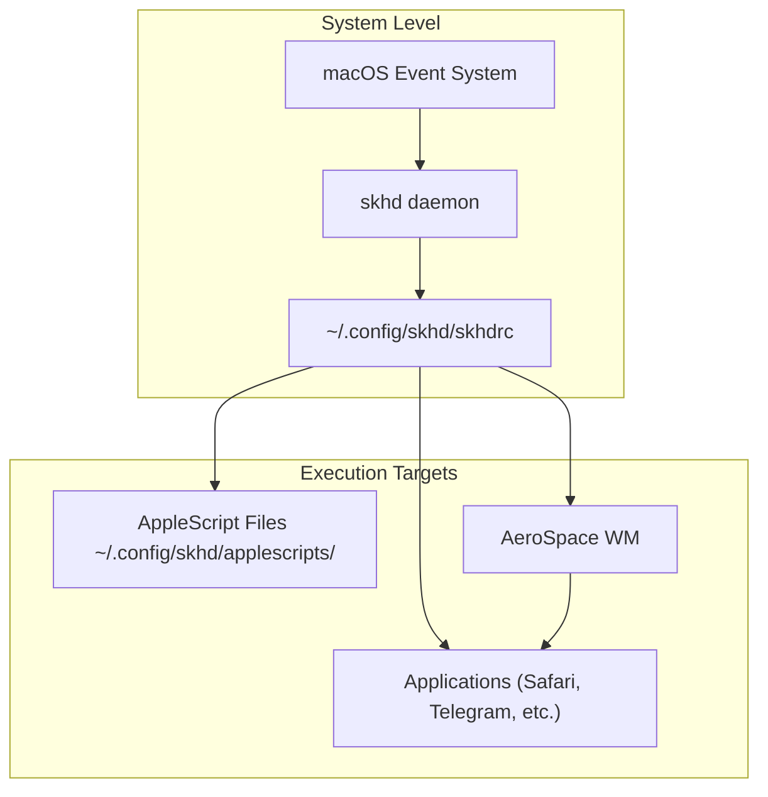
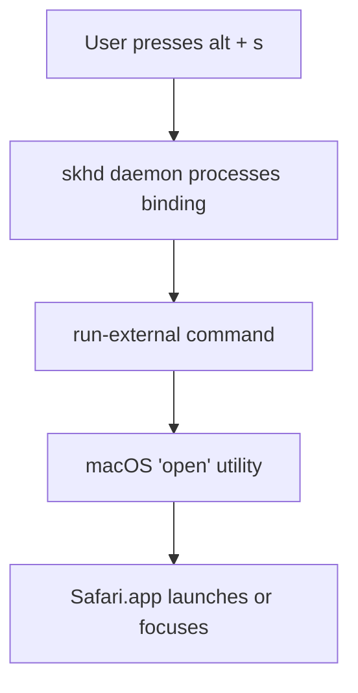
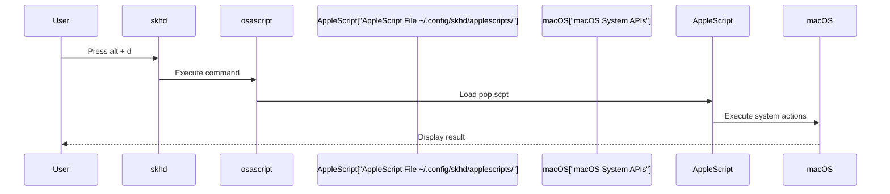
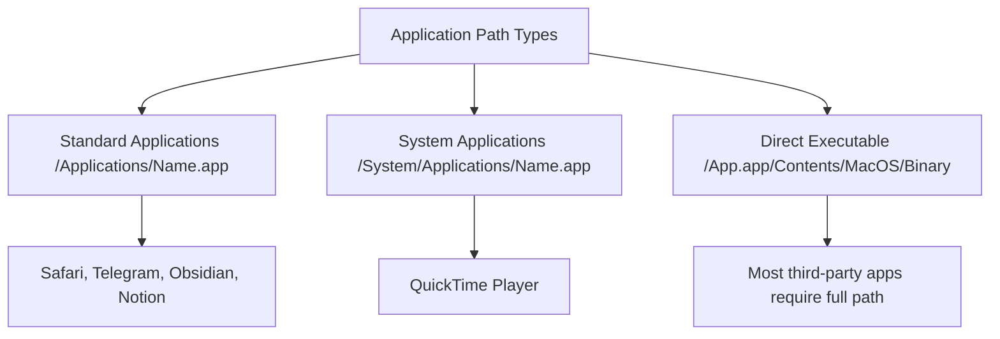

[/](/)

[/search](/search)

[/wiki](/wiki)

[/settings/members](/settings/members)

[/settings/support](/settings/support)

[Add repo](/repositories)

[All repos](/wiki)

[backend](/wiki/Klaudioz/backend)

[BH-Workflow-Engine](/wiki/Klaudioz/BH-Workflow-Engine)

[Buckhead_CRM](/wiki/Klaudioz/Buckhead_CRM)

[dotfiles](/wiki/Klaudioz/dotfiles)

[frontend](/wiki/Klaudioz/frontend)

[godeep.wiki-jb](/wiki/Klaudioz/godeep.wiki-jb)

[pi-mono-zero](/wiki/Klaudioz/pi-mono-zero)

[VirtualOracle](/wiki/Klaudioz/VirtualOracle)

# skhd Hotkey ConfigurationLink copied!

> **Relevant source files**
> * [skhd/skhdrc](https://github.com/Klaudioz/dotfiles/blob/2febda55/skhd/skhdrc)

## Purpose and ScopeLink copied!

This document describes the skhd hotkey daemon configuration, which provides global keyboard shortcuts for launching applications and executing system actions on macOS. skhd serves as a lightweight hotkey manager that complements the AeroSpace window manager (see [AeroSpace Tiling Window Manager](#6.1)) by providing application launcher shortcuts and system automation through AppleScript execution.

The configuration is minimal compared to typical window management hotkeys (which are handled by AeroSpace itself), focusing specifically on quick application access and system utility functions.

## skhd OverviewLink copied!

skhd is a simple hotkey daemon for macOS that translates keyboard events into commands. Unlike AeroSpace's integrated hotkey system, skhd operates at the system level and can execute arbitrary shell commands, launch applications, and run AppleScripts.

**Key characteristics:**

* **Lightweight**: Single configuration file with straightforward syntax
* **System-level**: Operates independently of window managers
* **AppleScript support**: Can execute macOS automation scripts
* **Application launching**: Primary use case in this configuration

### Integration PointsLink copied!



**Sources:** [skhd/skhdrc L1-L32](https://github.com/Klaudioz/dotfiles/blob/2febda55/skhd/skhdrc#L1-L32)

## Configuration File StructureLink copied!

The skhd configuration resides at `~/.config/skhd/skhdrc` and uses a simple declarative syntax:

```
modifier - key : command
```

### Syntax ComponentsLink copied!

| Component | Description | Example |
| --- | --- | --- |
| **Modifier** | Keyboard modifier key(s) | `alt`, `ralt`, `lalt`, `cmd`, `shift` |
| **Key** | The character key to bind | `s`, `t`, `o`, `d`, `n`, etc. |
| **Command** | Shell command to execute | `run-external`, `osascript` |

### Modifier Key VariantsLink copied!

The configuration distinguishes between left and right Alt keys:

* `alt`: Either Alt key
* `lalt`: Left Alt key only
* `ralt`: Right Alt key only

This allows for more hotkey combinations without conflicts. For example, `lalt - n` launches Notion while `ralt - n` closes notifications [skhd/skhdrc L16-L19](https://github.com/Klaudioz/dotfiles/blob/2febda55/skhd/skhdrc#L16-L19)

**Sources:** [skhd/skhdrc L1-L32](https://github.com/Klaudioz/dotfiles/blob/2febda55/skhd/skhdrc#L1-L32)

## Application LaunchersLink copied!

The primary use of skhd in this configuration is launching applications via the `run-external` command combined with macOS's `open` utility.

### Application Launch PatternLink copied!



### Configured Application BindingsLink copied!

| Hotkey | Application | Application Path | Line Reference |
| --- | --- | --- | --- |
| `alt - s` | Safari | `/Applications/Safari.app` | [skhd/skhdrc L4](https://github.com/Klaudioz/dotfiles/blob/2febda55/skhd/skhdrc#L4-L4) |
| `alt - t` | Telegram | `/Applications/Telegram.app` | [skhd/skhdrc L7](https://github.com/Klaudioz/dotfiles/blob/2febda55/skhd/skhdrc#L7-L7) |
| `alt - o` | Obsidian | `/Applications/Obsidian.app` | [skhd/skhdrc L10](https://github.com/Klaudioz/dotfiles/blob/2febda55/skhd/skhdrc#L10-L10) |
| `lalt - n` | Notion | `/Applications/Notion.app` | [skhd/skhdrc L19](https://github.com/Klaudioz/dotfiles/blob/2febda55/skhd/skhdrc#L19-L19) |
| `ralt - m` | Min Browser | `/Applications/Min.app` | [skhd/skhdrc L22](https://github.com/Klaudioz/dotfiles/blob/2febda55/skhd/skhdrc#L22-L22) |
| `alt - q` | QuickTime Player | `/System/Applications/QuickTime Player.app` | [skhd/skhdrc L25](https://github.com/Klaudioz/dotfiles/blob/2febda55/skhd/skhdrc#L25-L25) |
| `alt - f` | Final Cut Pro | `/Applications/Final Cut Pro.app` | [skhd/skhdrc L28](https://github.com/Klaudioz/dotfiles/blob/2febda55/skhd/skhdrc#L28-L28) |
| `alt - g` | Ghostty Terminal | `/Applications/Ghostty.app` | [skhd/skhdrc L31](https://github.com/Klaudioz/dotfiles/blob/2febda55/skhd/skhdrc#L31-L31) |

### Application Launch BehaviorLink copied!

The `open -a` command exhibits smart behavior:

* If the application is **not running**: Launches it
* If the application is **already running**: Brings it to focus
* Multiple presses cycle through windows of the same application

This provides a quick application switching mechanism that complements macOS's native application switcher (Cmd+Tab).

**Sources:** [skhd/skhdrc L3-L32](https://github.com/Klaudioz/dotfiles/blob/2febda55/skhd/skhdrc#L3-L32)

## AppleScript IntegrationLink copied!

Beyond simple application launching, skhd can execute AppleScript files for more complex system automation.

### AppleScript Execution PatternLink copied!



### Configured AppleScript BindingsLink copied!

| Hotkey | Function | Script Path | Purpose |
| --- | --- | --- | --- |
| `alt - d` | Show Date | `~/.config/skhd/applescripts/pop.scpt` | Display date popup |
| `ralt - n` | Close Notifications | `~/.config/skhd/applescripts/notifications.scpt` | Dismiss all notifications |

**Implementation details:**

For date display [skhd/skhdrc L13](https://github.com/Klaudioz/dotfiles/blob/2febda55/skhd/skhdrc#L13-L13)

:

```
alt - d : osascript ~/.config/skhd/applescripts/pop.scpt
```

For closing notifications [skhd/skhdrc L16](https://github.com/Klaudioz/dotfiles/blob/2febda55/skhd/skhdrc#L16-L16)

:

```
ralt - n : osascript ~/.config/skhd/applescripts/notifications.scpt
```

The AppleScript files are stored in a dedicated subdirectory, keeping system automation logic separate from the main hotkey configuration.

**Sources:** [skhd/skhdrc L13-L16](https://github.com/Klaudioz/dotfiles/blob/2febda55/skhd/skhdrc#L13-L16)

## Keybinding Patterns and SyntaxLink copied!

### Command TypesLink copied!

The configuration uses two primary command types:

#### 1. run-external Command

Used for launching external applications:

```
modifier - key : run-external "command" "arg1" "arg2" ...
```

The `run-external` prefix indicates that skhd should spawn a new process. Arguments are space-separated and quoted.

**Example structure:**

```
alt - s : run-external "open" "-a" "/Applications/Safari.app/Contents/MacOS/Safari"
```

**Components:**

* `run-external`: Command type
* `"open"`: macOS utility
* `"-a"`: Open application flag
* `"/Applications/Safari.app/Contents/MacOS/Safari"`: Full application path

#### 2. osascript Command

Used for executing AppleScript files:

```
modifier - key : osascript /path/to/script.scpt
```

No `run-external` prefix is needed; skhd executes `osascript` directly.

### Application Path PatternsLink copied!



**Path conventions:**

1. **Standard third-party apps** [skhd/skhdrc L4-L31](https://github.com/Klaudioz/dotfiles/blob/2febda55/skhd/skhdrc#L4-L31) : * Location: `/Applications/` * Full executable path often specified: `.app/Contents/MacOS/Binary`
2. **System apps** [skhd/skhdrc L25](https://github.com/Klaudioz/dotfiles/blob/2febda55/skhd/skhdrc#L25-L25) : * Location: `/System/Applications/` * QuickTime uses backticks for path with spaces
3. **Some apps allow short form** [skhd/skhdrc L31](https://github.com/Klaudioz/dotfiles/blob/2febda55/skhd/skhdrc#L31-L31) : * Ghostty uses just `/Applications/Ghostty.app` without executable path * Depends on application bundle structure

### Configuration OrganizationLink copied!

The configuration file uses comment headers to organize bindings by category:

```
# APPS #
```

This simple organizational pattern groups related hotkeys together. In this configuration, all bindings are application-related, so only one category exists.

**Sources:** [skhd/skhdrc L1-L32](https://github.com/Klaudioz/dotfiles/blob/2febda55/skhd/skhdrc#L1-L32)

## Relationship to AeroSpaceLink copied!

While AeroSpace handles window management hotkeys (workspace switching, layout changes, window focus), skhd handles application launching and system utilities. This separation of concerns provides:

1. **Clarity**: Window management vs. application launching are distinct functions
2. **Flexibility**: Can swap window managers without losing application shortcuts
3. **Simplicity**: Each tool has a focused responsibility

**Hotkey domains:**

| Domain | Managed By | Examples |
| --- | --- | --- |
| Window management | AeroSpace | Workspace switching, layout modes, window focus |
| Application launching | skhd | Safari, Telegram, Ghostty, etc. |
| System utilities | skhd | Date display, notification management |

The two systems coexist peacefully because they use different hotkey combinations:

* **AeroSpace**: Typically uses `alt + hjkl` for navigation and `alt + number` for workspaces
* **skhd**: Uses `alt + letter` for application shortcuts

**Sources:** [skhd/skhdrc L1-L32](https://github.com/Klaudioz/dotfiles/blob/2febda55/skhd/skhdrc#L1-L32)

## Configuration ManagementLink copied!

The skhd configuration file can be managed through either:

1. **Stow-based deployment** (see [Installation and Setup](#1.1))
2. **Nix-darwin integration** (see [System Configuration with Nix-Darwin](#2))

Changes to `skhd/skhdrc` require reloading the skhd service:

```
# Via Homebrew servicesbrew services restart skhd# Or via nix-darwindarwin-rebuild switch --flake .
```

**Sources:** [skhd/skhdrc L1-L32](https://github.com/Klaudioz/dotfiles/blob/2febda55/skhd/skhdrc#L1-L32)

Refresh this wiki

Last indexed: 18 December 2025 ([2febda](https://github.com/Klaudioz/dotfiles/commit/2febda55))

### On this page

* [skhd Hotkey Configuration](#6.2-skhd-hotkey-configuration)
* [Purpose and Scope](#6.2-purpose-and-scope)
* [skhd Overview](#6.2-skhd-overview)
* [Integration Points](#6.2-integration-points)
* [Configuration File Structure](#6.2-configuration-file-structure)
* [Syntax Components](#6.2-syntax-components)
* [Modifier Key Variants](#6.2-modifier-key-variants)
* [Application Launchers](#6.2-application-launchers)
* [Application Launch Pattern](#6.2-application-launch-pattern)
* [Configured Application Bindings](#6.2-configured-application-bindings)
* [Application Launch Behavior](#6.2-application-launch-behavior)
* [AppleScript Integration](#6.2-applescript-integration)
* [AppleScript Execution Pattern](#6.2-applescript-execution-pattern)
* [Configured AppleScript Bindings](#6.2-configured-applescript-bindings)
* [Keybinding Patterns and Syntax](#6.2-keybinding-patterns-and-syntax)
* [Command Types](#6.2-command-types)
* [Application Path Patterns](#6.2-application-path-patterns)
* [Configuration Organization](#6.2-configuration-organization)
* [Relationship to AeroSpace](#6.2-relationship-to-aerospace)
* [Configuration Management](#6.2-configuration-management)

Ask Devin about dotfiles

  

Syntax error in text

mermaid version 11.4.1

Syntax error in text

mermaid version 11.4.1

Syntax error in text

mermaid version 11.4.1

Syntax error in text

mermaid version 11.4.1

Syntax error in text

mermaid version 11.4.1

Syntax error in text

mermaid version 11.4.1

Syntax error in text

mermaid version 11.4.1

Syntax error in text

mermaid version 11.4.1

Syntax error in text

mermaid version 11.4.1