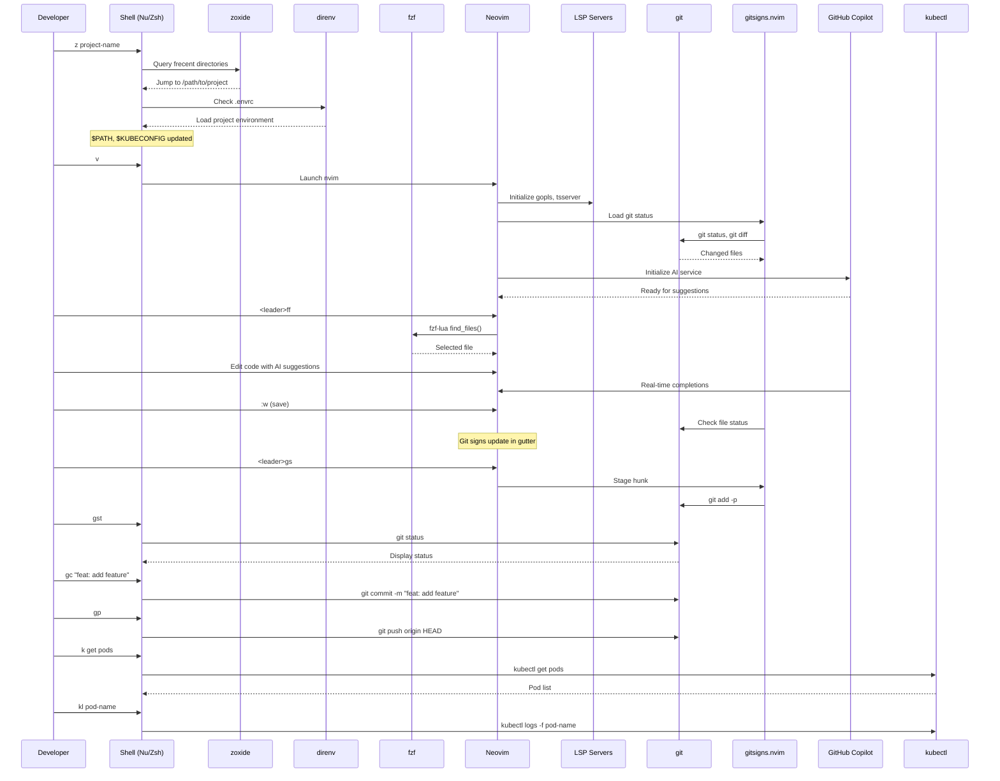
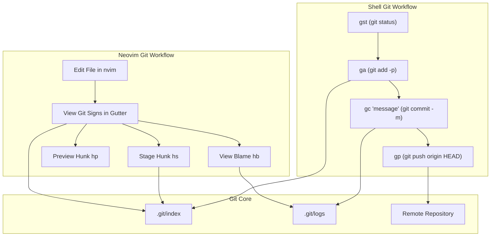
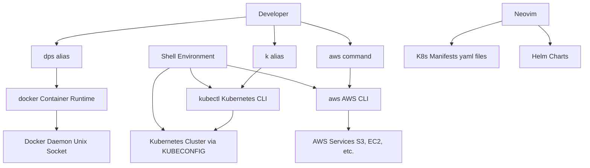
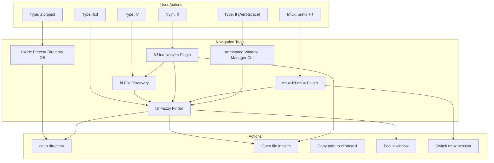
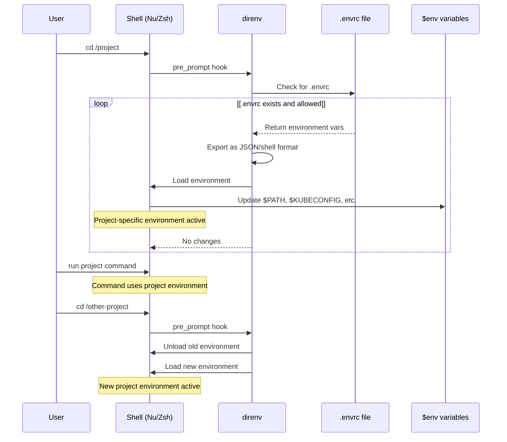
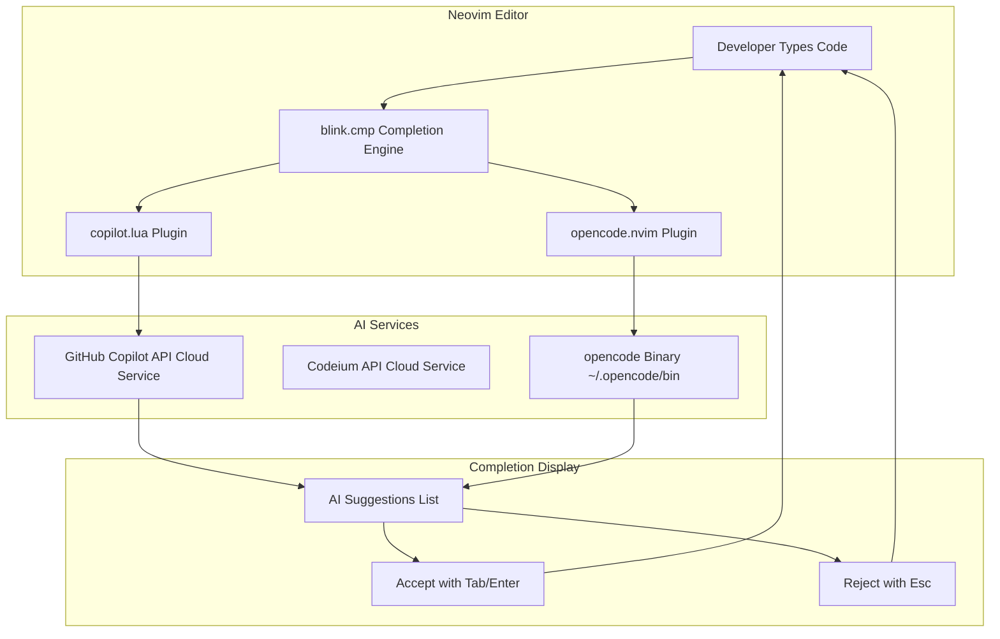
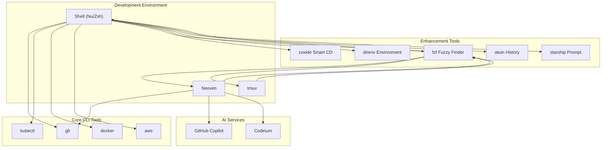

[/](/)

[/search](/search)

[/wiki](/wiki)

[/settings/members](/settings/members)

[/settings/support](/settings/support)

[Add repo](/repositories)

[All repos](/wiki)

[backend](/wiki/Klaudioz/backend)

[BH-Workflow-Engine](/wiki/Klaudioz/BH-Workflow-Engine)

[Buckhead_CRM](/wiki/Klaudioz/Buckhead_CRM)

[dotfiles](/wiki/Klaudioz/dotfiles)

[frontend](/wiki/Klaudioz/frontend)

[godeep.wiki-jb](/wiki/Klaudioz/godeep.wiki-jb)

[pi-mono-zero](/wiki/Klaudioz/pi-mono-zero)

[VirtualOracle](/wiki/Klaudioz/VirtualOracle)

# Development Workflow IntegrationLink copied!

> **Relevant source files**
> * [.gitignore](https://github.com/Klaudioz/dotfiles/blob/2febda55/.gitignore)
> * [nushell/config.nu](https://github.com/Klaudioz/dotfiles/blob/2febda55/nushell/config.nu)
> * [nushell/env.nu](https://github.com/Klaudioz/dotfiles/blob/2febda55/nushell/env.nu)
> * [nvim/lazy-lock.json](https://github.com/Klaudioz/dotfiles/blob/2febda55/nvim/lazy-lock.json)
> * [zshrc/.zshrc](https://github.com/Klaudioz/dotfiles/blob/2febda55/zshrc/.zshrc)

## Purpose and ScopeLink copied!

This document explains how various development tools integrate across the dotfiles ecosystem to create a cohesive daily development workflow. It covers the practical integration patterns between shells, editors, and external services that enable efficient software development tasks.

For detailed configuration of individual tools, see:

* Shell-specific configurations: [Nushell Setup](#3.2.1) and [Zsh Setup](#3.2.2)
* Editor configuration: [Neovim Editor Configuration](#4)
* Terminal multiplexing: [Terminal Multiplexing with tmux](#5)

This page focuses on cross-tool workflows rather than individual tool setup.

## Integration ArchitectureLink copied!

The dotfiles ecosystem integrates development tools across multiple layers, creating consistent workflows regardless of which shell or terminal environment is active. The integration spans version control, containerization platforms, cloud services, navigation utilities, and AI-assisted coding tools.

### Cross-Layer Integration MapLink copied!

```mermaid
flowchart TD

Copilot["GitHub Copilot copilot.lua"]
Codeium["Codeium AI Completion Service"]
AtuinCloud["Atuin Cloud Shell History Sync"]
GitHubAPI["GitHub API Remote Repository"]
GitAliases["Git Aliases gc, gp, gst, etc."]
K8sAliases["K8s Aliases k, ka, kg, etc."]
DockerAliases["Docker Aliases dco, dps, dx"]
NavFunctions["Navigation Functions cx, fcd, fv"]
AtuinInit["atuin init"]
ZoxideInit["zoxide init"]
DirenvHook["direnv hook"]
Gitsigns["gitsigns.nvim Git Integration"]
LSP["LSP Servers gopls, tsserver, etc."]
DAP["DAP Adapters Debugging"]
CopilotPlugin["copilot.lua AI Completion"]
FzfLua["fzf-lua Fuzzy Finding"]
TmuxFzf["tmux-fzf Session Selection"]
TmuxSessionx["tmux-sessionx Project Switching"]
Git["git Version Control"]
Kubectl["kubectl K8s Client"]
Docker["docker Container Runtime"]
Fzf["fzf Fuzzy Finder"]
Fd["fd File Discovery"]
Zoxide["zoxide Smart CD"]
Direnv["direnv Environment Manager"]

Copilot --> CopilotPlugin
AtuinCloud --> AtuinInit
GitHubAPI --> Git
GitAliases --> Git
K8sAliases --> Kubectl
DockerAliases --> Docker
NavFunctions --> Fzf
NavFunctions --> Fd
Gitsigns --> Git
FzfLua --> Fzf
TmuxFzf --> Fzf
Git --> Gitsigns
Kubectl --> LSP
Zoxide --> NavFunctions

subgraph Tools ["CLI Tools"]
    Git
    Kubectl
    Docker
    Fzf
    Fd
    Zoxide
    Direnv
end

subgraph Multiplexer ["tmux Layer"]
    TmuxFzf
    TmuxSessionx
end

subgraph Editor ["Neovim Layer"]
    Gitsigns
    LSP
    DAP
    CopilotPlugin
    FzfLua
end

subgraph Shell ["Shell Layer (Nu/Zsh)"]
    GitAliases
    K8sAliases
    DockerAliases
    NavFunctions
    AtuinInit
    ZoxideInit
    DirenvHook
end

subgraph External ["External Services"]
    Copilot
    Codeium
    AtuinCloud
    GitHubAPI
end
```



**Sources:** [nushell/config.nu L904-L972](https://github.com/Klaudioz/dotfiles/blob/2febda55/nushell/config.nu#L904-L972)

 [zshrc/.zshrc L1-L157](https://github.com/Klaudioz/dotfiles/blob/2febda55/zshrc/.zshrc#L1-L157)

 [nvim/lazy-lock.json L1-L54](https://github.com/Klaudioz/dotfiles/blob/2febda55/nvim/lazy-lock.json#L1-L54)

### Workflow Integration LayersLink copied!

The integration architecture consists of four primary layers that work together:

| Layer | Components | Integration Points | Primary Function |
| --- | --- | --- | --- |
| **External Services** | GitHub Copilot, Codeium, Atuin Cloud | API-based connections | Cloud-powered enhancements |
| **Shell** | Nushell/Zsh with aliases and functions | Command aliases, completion systems | Primary user interface |
| **Editor** | Neovim with plugins | LSP, DAP, Git integration | Code editing and analysis |
| **CLI Tools** | git, kubectl, docker, fzf, fd, zoxide | Direct execution, pipe integration | Core functionality |

**Sources:** [nushell/config.nu L1-L973](https://github.com/Klaudioz/dotfiles/blob/2febda55/nushell/config.nu#L1-L973)

 [zshrc/.zshrc L1-L157](https://github.com/Klaudioz/dotfiles/blob/2febda55/zshrc/.zshrc#L1-L157)

## Daily Development Workflow SequenceLink copied!



**Sources:** [nushell/config.nu L904-L957](https://github.com/Klaudioz/dotfiles/blob/2febda55/nushell/config.nu#L904-L957)

 [zshrc/.zshrc L30-L156](https://github.com/Klaudioz/dotfiles/blob/2febda55/zshrc/.zshrc#L30-L156)

 [nvim/lazy-lock.json L10-L14](https://github.com/Klaudioz/dotfiles/blob/2febda55/nvim/lazy-lock.json#L10-L14)

## Version Control IntegrationLink copied!

### Git Command AliasesLink copied!

Both Nushell and Zsh provide extensive Git aliases that streamline common version control operations. These aliases are consistently named across both shells to maintain workflow continuity.

#### Core Git Aliases

| Alias | Command | Purpose | Shell Support |
| --- | --- | --- | --- |
| `gc` | `git commit -m` | Quick commit with message | Nu, Zsh |
| `gca` | `git commit -a -m` | Commit all changes | Nu, Zsh |
| `gp` | `git push origin HEAD` | Push current branch | Nu, Zsh |
| `gpu` | `git pull origin` | Pull from origin | Nu, Zsh |
| `gst` | `git status` | Repository status | Nu, Zsh |
| `glog` | `git log --graph --topo-order...` | Formatted log view | Nu, Zsh |
| `gdiff` | `git diff` | Show differences | Nu, Zsh |
| `gco` | `git checkout` | Branch/file checkout | Nu, Zsh |
| `gb` | `git branch` | List branches | Nu, Zsh |
| `gba` | `git branch -a` | List all branches | Nu, Zsh |
| `ga` | `git add -p` | Interactive staging | Nu, Zsh |
| `gadd` | `git add` | Stage files | Nu, Zsh |
| `gr` | `git remote` | Manage remotes | Nu, Zsh |
| `gre` | `git reset` | Reset changes | Nu, Zsh |
| `gcoall` | `git checkout -- .` | Discard all changes | Nu, Zsh |

**Nushell Implementation:**

```xml
<FileRef file-url="https://github.com/Klaudioz/dotfiles/blob/2febda55/nushell/config.nu#L922-L937" min=922 max=937 file-path="nushell/config.nu">Hii</FileRef>
```

**Zsh Implementation:**

```xml
<FileRef file-url="https://github.com/Klaudioz/dotfiles/blob/2febda55/zshrc/.zshrc#L30-L45" min=30 max=45 file-path="zshrc/.zshrc">Hii</FileRef>
```

### Neovim Git IntegrationLink copied!

Neovim integrates Git functionality through the `gitsigns.nvim` plugin, which provides real-time Git status visualization and interactive staging capabilities within the editor.

#### Gitsigns Features

The `gitsigns.nvim` plugin (version locked in `lazy-lock.json` at commit `6e3c66548035e50db7bd8e360a29aec6620c3641`) provides:

* **Inline Git Signs**: Visual indicators in the sign column showing added, modified, and deleted lines
* **Hunk Navigation**: Jump between changed sections using keybindings
* **Interactive Staging**: Stage and unstage hunks directly from the editor
* **Blame Information**: Display git blame information inline
* **Diff View**: Compare current buffer with git index

**Sources:** [nvim/lazy-lock.json L14](https://github.com/Klaudioz/dotfiles/blob/2febda55/nvim/lazy-lock.json#L14-L14)

### Git Workflow PatternLink copied!



**Sources:** [nushell/config.nu L922-L937](https://github.com/Klaudioz/dotfiles/blob/2febda55/nushell/config.nu#L922-L937)

 [zshrc/.zshrc L30-L45](https://github.com/Klaudioz/dotfiles/blob/2febda55/zshrc/.zshrc#L30-L45)

 [nvim/lazy-lock.json L14](https://github.com/Klaudioz/dotfiles/blob/2febda55/nvim/lazy-lock.json#L14-L14)

## Container and Cloud Tools IntegrationLink copied!

### Kubernetes IntegrationLink copied!

Kubernetes tooling is deeply integrated into the shell environment with aliases that cover common operations. The `kubectl` CLI tool is supplemented with completion systems in both shells.

#### Kubernetes Aliases

| Alias | Full Command | Purpose |
| --- | --- | --- |
| `k` | `kubectl` | Base kubectl command |
| `ka` | `kubectl apply -f` | Apply configuration |
| `kg` | `kubectl get` | Get resources |
| `kd` | `kubectl describe` | Describe resources |
| `kdel` | `kubectl delete` | Delete resources |
| `kl` | `kubectl logs -f` | Follow logs |
| `ke` | `kubectl exec -it` | Interactive exec |
| `kgpo` | `kubectl get pod` | Get pods |
| `kgd` | `kubectl get deployments` | Get deployments |
| `kc` | `kubectx` | Switch context |
| `kns` | `kubens` | Switch namespace |
| `kcns` | `kubectl config set-context --current --namespace` | Set namespace (Zsh) |

**Nushell Kubernetes Aliases:**

```xml
<FileRef file-url="https://github.com/Klaudioz/dotfiles/blob/2febda55/nushell/config.nu#L939-L951" min=939 max=951 file-path="nushell/config.nu">Hii</FileRef>
```

**Zsh Kubernetes Aliases and Configuration:**

```xml
<FileRef file-url="https://github.com/Klaudioz/dotfiles/blob/2febda55/zshrc/.zshrc#L74-L89" min=74 max=89 file-path="zshrc/.zshrc">Hii</FileRef>
```

The Zsh configuration also includes kubectl completion system initialization:

```xml
<FileRef file-url="https://github.com/Klaudioz/dotfiles/blob/2febda55/zshrc/.zshrc#L8-L8" min=8  file-path="zshrc/.zshrc">Hii</FileRef>
```

### Docker IntegrationLink copied!

Docker commands are aliased for rapid container management workflows, primarily in the Zsh configuration.

#### Docker Aliases (Zsh)

| Alias | Command | Purpose |
| --- | --- | --- |
| `dco` | `docker compose` | Docker Compose operations |
| `dps` | `docker ps` | List running containers |
| `dpa` | `docker ps -a` | List all containers |
| `dl` | `docker ps -l -q` | Last container ID |
| `dx` | `docker exec -it` | Interactive container exec |

**Sources:** [zshrc/.zshrc L47-L52](https://github.com/Klaudioz/dotfiles/blob/2febda55/zshrc/.zshrc#L47-L52)

### AWS CLI IntegrationLink copied!

AWS CLI completion is configured in Zsh to provide command-line suggestions for AWS services:

```xml
<FileRef file-url="https://github.com/Klaudioz/dotfiles/blob/2febda55/zshrc/.zshrc#L9-L9" min=9  file-path="zshrc/.zshrc">Hii</FileRef>
```

### Cloud Tools WorkflowLink copied!



**Sources:** [nushell/config.nu L939-L951](https://github.com/Klaudioz/dotfiles/blob/2febda55/nushell/config.nu#L939-L951)

 [zshrc/.zshrc L8-L89](https://github.com/Klaudioz/dotfiles/blob/2febda55/zshrc/.zshrc#L8-L89)

 [nvim/lazy-lock.json L51](https://github.com/Klaudioz/dotfiles/blob/2febda55/nvim/lazy-lock.json#L51-L51)

## Navigation and Discovery ToolsLink copied!

### Smart Directory Navigation with ZoxideLink copied!

`zoxide` provides intelligent directory jumping based on frecency (frequency + recency). It's initialized in both Nushell and Zsh environments.

**Nushell Initialization:**

```xml
<FileRef file-url="https://github.com/Klaudioz/dotfiles/blob/2febda55/nushell/env.nu#L125-L125" min=125  file-path="nushell/env.nu">Hii</FileRef>
```

**Zsh Initialization:**

```xml
<FileRef file-url="https://github.com/Klaudioz/dotfiles/blob/2febda55/zshrc/.zshrc#L154-L154" min=154  file-path="zshrc/.zshrc">Hii</FileRef>
```

The initialized command `z` allows jumping to frequently used directories by partial name matching rather than full path specification.

### Fuzzy Finding with fzfLink copied!

`fzf` is a core integration point across multiple tools, providing fuzzy finding capabilities in shells, Neovim, and tmux.

#### FZF Configuration and Integration Points

**Default Command Configuration (Zsh):**

```xml
<FileRef file-url="https://github.com/Klaudioz/dotfiles/blob/2febda55/zshrc/.zshrc#L112-L112" min=112  file-path="zshrc/.zshrc">Hii</FileRef>
```

The `FZF_DEFAULT_COMMAND` uses `fd` (fast find alternative) to discover files while respecting `.gitignore` patterns.

#### FZF Integration in Neovim

Neovim uses the `fzf-lua` plugin for fuzzy finding operations:

* File finding
* Buffer switching
* Grep operations
* LSP symbol search
* Git file navigation

**Plugin Version:**

```xml
<FileRef file-url="https://github.com/Klaudioz/dotfiles/blob/2febda55/nvim/lazy-lock.json#L13-L13" min=13  file-path="nvim/lazy-lock.json">Hii</FileRef>
```

#### FZF Integration in tmux

tmux uses multiple fzf-based plugins for session and window management:

* `tmux-fzf`: General tmux fuzzy finding
* `tmux-fzf-url`: URL extraction and opening
* `tmux-sessionx`: Advanced session switching

Referenced in tmux plugin configuration (see [tmux Plugin System](#5.2) for details).

### Navigation FunctionsLink copied!

Both shells provide custom navigation functions that combine directory changing with listing.

#### Nushell Navigation

**Function `cx`:**

```xml
<FileRef file-url="https://github.com/Klaudioz/dotfiles/blob/2febda55/nushell/config.nu#L904-L907" min=904 max=907 file-path="nushell/config.nu">Hii</FileRef>
```

Changes directory and automatically lists contents.

#### Zsh Navigation Functions

**Function `cx`:**

```xml
<FileRef file-url="https://github.com/Klaudioz/dotfiles/blob/2febda55/zshrc/.zshrc#L141-L141" min=141  file-path="zshrc/.zshrc">Hii</FileRef>
```

**Fuzzy Directory Change `fcd`:**

```xml
<FileRef file-url="https://github.com/Klaudioz/dotfiles/blob/2febda55/zshrc/.zshrc#L142-L142" min=142  file-path="zshrc/.zshrc">Hii</FileRef>
```

Uses `fzf` to select target directory from current tree.

**Fuzzy File Copy `f`:**

```xml
<FileRef file-url="https://github.com/Klaudioz/dotfiles/blob/2febda55/zshrc/.zshrc#L143-L143" min=143  file-path="zshrc/.zshrc">Hii</FileRef>
```

Finds file with `fzf` and copies path to clipboard.

**Fuzzy Neovim Open `fv`:**

```xml
<FileRef file-url="https://github.com/Klaudioz/dotfiles/blob/2febda55/zshrc/.zshrc#L144-L144" min=144  file-path="zshrc/.zshrc">Hii</FileRef>
```

Finds file with `fzf` and opens in Neovim.

#### AeroSpace Window Finder (Nushell)

Custom function for fuzzy window finding across AeroSpace workspaces:

```xml
<FileRef file-url="https://github.com/Klaudioz/dotfiles/blob/2febda55/nushell/config.nu#L918-L920" min=918 max=920 file-path="nushell/config.nu">Hii</FileRef>
```

Uses `fzf` to select and focus windows from `aerospace list-windows --all` output.

**Sources:** [nushell/config.nu L904-L920](https://github.com/Klaudioz/dotfiles/blob/2febda55/nushell/config.nu#L904-L920)

 [zshrc/.zshrc L141-L144](https://github.com/Klaudioz/dotfiles/blob/2febda55/zshrc/.zshrc#L141-L144)

 [nvim/lazy-lock.json L13](https://github.com/Klaudioz/dotfiles/blob/2febda55/nvim/lazy-lock.json#L13-L13)

### File Discovery with fdLink copied!

The `fd` tool serves as a faster, user-friendly alternative to the traditional `find` command. It's integrated as the backend for `fzf` operations:

```xml
<FileRef file-url="https://github.com/Klaudioz/dotfiles/blob/2febda55/zshrc/.zshrc#L112-L112" min=112  file-path="zshrc/.zshrc">Hii</FileRef>
```

### Navigation Tools Interaction MapLink copied!



**Sources:** [nushell/config.nu L918-L920](https://github.com/Klaudioz/dotfiles/blob/2febda55/nushell/config.nu#L918-L920)

 [zshrc/.zshrc L112-L154](https://github.com/Klaudioz/dotfiles/blob/2febda55/zshrc/.zshrc#L112-L154)

 [nushell/env.nu L125](https://github.com/Klaudioz/dotfiles/blob/2febda55/nushell/env.nu#L125-L125)

 [nvim/lazy-lock.json L13](https://github.com/Klaudioz/dotfiles/blob/2febda55/nvim/lazy-lock.json#L13-L13)

## Environment Management with direnvLink copied!

`direnv` provides automatic per-directory environment variable management, enabling project-specific configurations without manual environment switching.

### Direnv Integration ArchitectureLink copied!

#### Nushell Direnv Hook

Direnv is integrated via a pre-prompt hook that exports environment variables before each command:

```xml
<FileRef file-url="https://github.com/Klaudioz/dotfiles/blob/2febda55/nushell/config.nu#L280-L290" min=280 max=290 file-path="nushell/config.nu">Hii</FileRef>
```

The hook:

1. Checks if `direnv` is available
2. Exports environment as JSON
3. Loads variables into current shell environment
4. Handles `PATH` variable splitting correctly

Direnv logging is silenced:

```xml
<FileRef file-url="https://github.com/Klaudioz/dotfiles/blob/2febda55/nushell/config.nu#L971-L971" min=971  file-path="nushell/config.nu">Hii</FileRef>
```

#### Zsh Direnv Hook

```xml
<FileRef file-url="https://github.com/Klaudioz/dotfiles/blob/2febda55/zshrc/.zshrc#L156-L156" min=156  file-path="zshrc/.zshrc">Hii</FileRef>
```

### Direnv WorkflowLink copied!



**Sources:** [nushell/config.nu L280-L971](https://github.com/Klaudioz/dotfiles/blob/2febda55/nushell/config.nu#L280-L971)

 [zshrc/.zshrc L156](https://github.com/Klaudioz/dotfiles/blob/2febda55/zshrc/.zshrc#L156-L156)

### Common direnv Use CasesLink copied!

1. **Project-specific tool versions**: Different Node.js, Python, or Go versions per project
2. **Credential isolation**: Project-specific AWS credentials or API keys
3. **Kubernetes context**: Auto-switching `KUBECONFIG` based on project directory
4. **PATH modifications**: Adding project-local bin directories to PATH
5. **Development/staging environments**: Different environment variables per project branch

## Shell History Integration with AtuinLink copied!

Atuin provides cloud-synchronized shell history with enhanced search capabilities across both Nushell and Zsh.

### Atuin InitializationLink copied!

**Nushell:**

```xml
<FileRef file-url="https://github.com/Klaudioz/dotfiles/blob/2febda55/nushell/config.nu#L956-L956" min=956  file-path="nushell/config.nu">Hii</FileRef>
```

**Zsh:**

```xml
<FileRef file-url="https://github.com/Klaudioz/dotfiles/blob/2febda55/zshrc/.zshrc#L155-L155" min=155  file-path="zshrc/.zshrc">Hii</FileRef>
```

### Atuin Script Execution AliasLink copied!

Nushell includes an alias for running Atuin scripts:

```xml
<FileRef file-url="https://github.com/Klaudioz/dotfiles/blob/2febda55/nushell/config.nu#L916-L916" min=916  file-path="nushell/config.nu">Hii</FileRef>
```

This allows executing shell commands stored in Atuin cloud scripts using `asr script-name`.

**Sources:** [nushell/config.nu L916-L956](https://github.com/Klaudioz/dotfiles/blob/2febda55/nushell/config.nu#L916-L956)

 [zshrc/.zshrc L155](https://github.com/Klaudioz/dotfiles/blob/2febda55/zshrc/.zshrc#L155-L155)

## AI-Assisted Development IntegrationLink copied!

### GitHub Copilot IntegrationLink copied!

GitHub Copilot is integrated into Neovim via the `copilot.lua` plugin, providing AI-powered code completion and suggestions.

**Plugin Version:**

```xml
<FileRef file-url="https://github.com/Klaudioz/dotfiles/blob/2febda55/nvim/lazy-lock.json#L10-L10" min=10  file-path="nvim/lazy-lock.json">Hii</FileRef>
```

Copilot provides:

* Real-time code suggestions as you type
* Multi-line completion
* Context-aware recommendations based on surrounding code
* Support for multiple programming languages

### Codeium IntegrationLink copied!

Codeium provides an alternative or complementary AI completion service. It integrates through the Neovim plugin ecosystem and can be used alongside or instead of Copilot.

### opencode.nvim PluginLink copied!

The `opencode.nvim` plugin enables additional AI-assisted coding features:

**Plugin Version:**

```xml
<FileRef file-url="https://github.com/Klaudioz/dotfiles/blob/2febda55/nvim/lazy-lock.json#L42-L42" min=42  file-path="nvim/lazy-lock.json">Hii</FileRef>
```

This plugin is accompanied by a local binary installation path:

```xml
<FileRef file-url="https://github.com/Klaudioz/dotfiles/blob/2febda55/nushell/env.nu#L107-L107" min=107  file-path="nushell/env.nu">Hii</FileRef>
```

### AI Integration WorkflowLink copied!



**Sources:** [nvim/lazy-lock.json L5-L42](https://github.com/Klaudioz/dotfiles/blob/2febda55/nvim/lazy-lock.json#L5-L42)

 [nushell/env.nu L107](https://github.com/Klaudioz/dotfiles/blob/2febda55/nushell/env.nu#L107-L107)

## Cross-Tool Integration PatternsLink copied!

### Shell → Editor IntegrationLink copied!

Both shells include aliases for launching Neovim with consistent naming:

**Nushell:**

```xml
<FileRef file-url="https://github.com/Klaudioz/dotfiles/blob/2febda55/nushell/config.nu#L913-L913" min=913  file-path="nushell/config.nu">Hii</FileRef>
```

**Zsh:**

```xml
<FileRef file-url="https://github.com/Klaudioz/dotfiles/blob/2febda55/zshrc/.zshrc#L65-L65" min=65  file-path="zshrc/.zshrc">Hii</FileRef>
```

The `fv` function in Zsh combines fuzzy finding with editor launching:

```xml
<FileRef file-url="https://github.com/Klaudioz/dotfiles/blob/2febda55/zshrc/.zshrc#L144-L144" min=144  file-path="zshrc/.zshrc">Hii</FileRef>
```

### Editor → Shell IntegrationLink copied!

Neovim's terminal mode and external command execution allow running shell aliases and commands from within the editor, maintaining workflow continuity.

### Completion System IntegrationLink copied!

**Nushell Carapace:**

```xml
<FileRef file-url="https://github.com/Klaudioz/dotfiles/blob/2febda55/nushell/env.nu#L129-L131" min=129 max=131 file-path="nushell/env.nu">Hii</FileRef>
```

Carapace provides completion bridging from multiple shell formats (zsh, fish, bash) into Nushell.

**Zsh Completions:**

```xml
<FileRef file-url="https://github.com/Klaudioz/dotfiles/blob/2febda55/zshrc/.zshrc#L4-L9" min=4 max=9 file-path="zshrc/.zshrc">Hii</FileRef>
```

Zsh uses both native completion system and external completers like kubectl and AWS CLI.

### Integrated Tool Ecosystem SummaryLink copied!



**Sources:** [nushell/config.nu L1-L973](https://github.com/Klaudioz/dotfiles/blob/2febda55/nushell/config.nu#L1-L973)

 [nushell/env.nu L1-L134](https://github.com/Klaudioz/dotfiles/blob/2febda55/nushell/env.nu#L1-L134)

 [zshrc/.zshrc L1-L157](https://github.com/Klaudioz/dotfiles/blob/2febda55/zshrc/.zshrc#L1-L157)

 [nvim/lazy-lock.json L1-L54](https://github.com/Klaudioz/dotfiles/blob/2febda55/nvim/lazy-lock.json#L1-L54)

## Configuration ConsistencyLink copied!

The dotfiles repository maintains configuration consistency across shells through:

1. **Parallel Alias Definitions**: Git, Kubernetes, and Docker aliases use identical names in both Nu and Zsh
2. **Shared Tool Initialization**: Tools like zoxide, atuin, direnv, and starship are initialized in both shells
3. **Common Configuration Files**: Starship uses the same `starship.toml` configuration regardless of shell
4. **Environment Variable Consistency**: Both shells set identical editor, path, and tool configuration variables

This design allows developers to switch between shells without relearning command patterns or losing workflow muscle memory.

**Sources:** [nushell/config.nu L909-L951](https://github.com/Klaudioz/dotfiles/blob/2febda55/nushell/config.nu#L909-L951)

 [zshrc/.zshrc L27-L88](https://github.com/Klaudioz/dotfiles/blob/2febda55/zshrc/.zshrc#L27-L88)

 [nushell/env.nu L127-L133](https://github.com/Klaudioz/dotfiles/blob/2febda55/nushell/env.nu#L127-L133)

 [zshrc/.zshrc L19-L156](https://github.com/Klaudioz/dotfiles/blob/2febda55/zshrc/.zshrc#L19-L156)

Refresh this wiki

Last indexed: 18 December 2025 ([2febda](https://github.com/Klaudioz/dotfiles/commit/2febda55))

### On this page

* [Development Workflow Integration](#7-development-workflow-integration)
* [Purpose and Scope](#7-purpose-and-scope)
* [Integration Architecture](#7-integration-architecture)
* [Cross-Layer Integration Map](#7-cross-layer-integration-map)
* [Workflow Integration Layers](#7-workflow-integration-layers)
* [Daily Development Workflow Sequence](#7-daily-development-workflow-sequence)
* [Version Control Integration](#7-version-control-integration)
* [Git Command Aliases](#7-git-command-aliases)
* [Neovim Git Integration](#7-neovim-git-integration)
* [Git Workflow Pattern](#7-git-workflow-pattern)
* [Container and Cloud Tools Integration](#7-container-and-cloud-tools-integration)
* [Kubernetes Integration](#7-kubernetes-integration)
* [Docker Integration](#7-docker-integration)
* [AWS CLI Integration](#7-aws-cli-integration)
* [Cloud Tools Workflow](#7-cloud-tools-workflow)
* [Navigation and Discovery Tools](#7-navigation-and-discovery-tools)
* [Smart Directory Navigation with Zoxide](#7-smart-directory-navigation-with-zoxide)
* [Fuzzy Finding with fzf](#7-fuzzy-finding-with-fzf)
* [Navigation Functions](#7-navigation-functions)
* [File Discovery with fd](#7-file-discovery-with-fd)
* [Navigation Tools Interaction Map](#7-navigation-tools-interaction-map)
* [Environment Management with direnv](#7-environment-management-with-direnv)
* [Direnv Integration Architecture](#7-direnv-integration-architecture)
* [Direnv Workflow](#7-direnv-workflow)
* [Common direnv Use Cases](#7-common-direnv-use-cases)
* [Shell History Integration with Atuin](#7-shell-history-integration-with-atuin)
* [Atuin Initialization](#7-atuin-initialization)
* [Atuin Script Execution Alias](#7-atuin-script-execution-alias)
* [AI-Assisted Development Integration](#7-ai-assisted-development-integration)
* [GitHub Copilot Integration](#7-github-copilot-integration)
* [Codeium Integration](#7-codeium-integration)
* [opencode.nvim Plugin](#7-opencodenvim-plugin)
* [AI Integration Workflow](#7-ai-integration-workflow)
* [Cross-Tool Integration Patterns](#7-cross-tool-integration-patterns)
* [Shell → Editor Integration](#7-shell-editor-integration)
* [Editor → Shell Integration](#7-editor-shell-integration)
* [Completion System Integration](#7-completion-system-integration)
* [Integrated Tool Ecosystem Summary](#7-integrated-tool-ecosystem-summary)
* [Configuration Consistency](#7-configuration-consistency)

Ask Devin about dotfiles

  

Syntax error in text

mermaid version 11.4.1

Syntax error in text

mermaid version 11.4.1

Syntax error in text

mermaid version 11.4.1

Syntax error in text

mermaid version 11.4.1

Syntax error in text

mermaid version 11.4.1

Syntax error in text

mermaid version 11.4.1

Syntax error in text

mermaid version 11.4.1

Syntax error in text

mermaid version 11.4.1

Syntax error in text

mermaid version 11.4.1