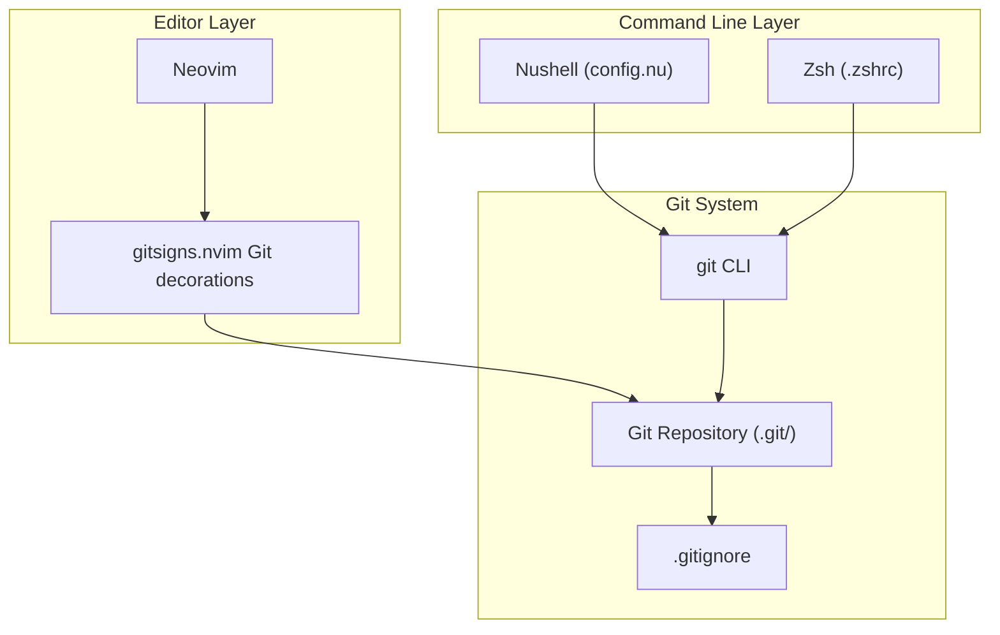
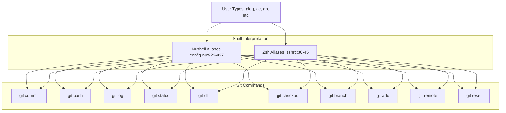
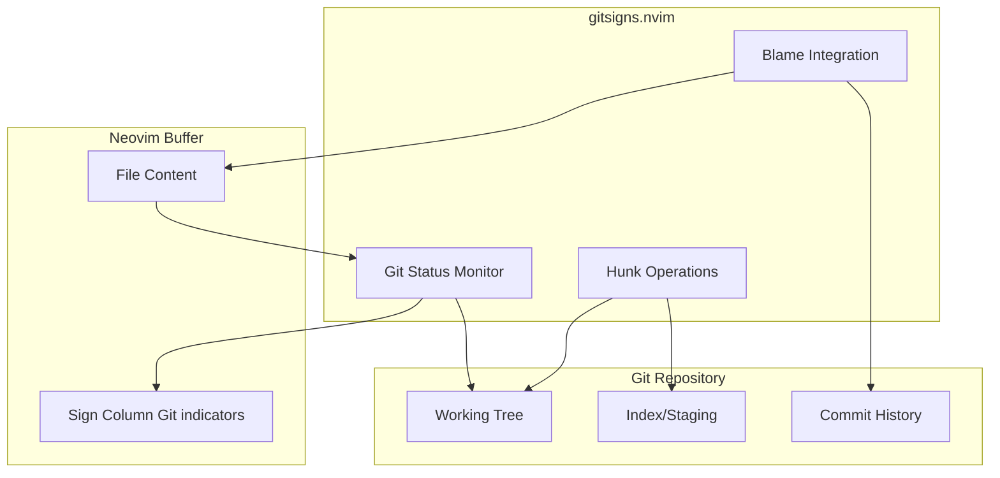
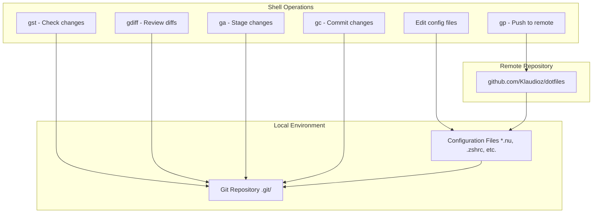

[/](/)

[/search](/search)

[/wiki](/wiki)

[/settings/members](/settings/members)

[/settings/support](/settings/support)

[Add repo](/repositories)

[All repos](/wiki)

[backend](/wiki/Klaudioz/backend)

[BH-Workflow-Engine](/wiki/Klaudioz/BH-Workflow-Engine)

[Buckhead_CRM](/wiki/Klaudioz/Buckhead_CRM)

[dotfiles](/wiki/Klaudioz/dotfiles)

[frontend](/wiki/Klaudioz/frontend)

[godeep.wiki-jb](/wiki/Klaudioz/godeep.wiki-jb)

[pi-mono-zero](/wiki/Klaudioz/pi-mono-zero)

[VirtualOracle](/wiki/Klaudioz/VirtualOracle)

# Version Control IntegrationLink copied!

> **Relevant source files**
> * [.gitignore](https://github.com/Klaudioz/dotfiles/blob/2febda55/.gitignore)
> * [nushell/config.nu](https://github.com/Klaudioz/dotfiles/blob/2febda55/nushell/config.nu)
> * [nushell/env.nu](https://github.com/Klaudioz/dotfiles/blob/2febda55/nushell/env.nu)
> * [zshrc/.zshrc](https://github.com/Klaudioz/dotfiles/blob/2febda55/zshrc/.zshrc)

This document describes how Git version control is integrated throughout the dotfiles ecosystem, including shell-level aliases in both Nushell and Zsh, editor-level integration through Neovim plugins, and common workflow patterns. The integration provides a consistent Git experience across different tools while adapting to each tool's strengths.

For information about Neovim-specific plugin configurations, see [Plugin Ecosystem](#4.2). For shell-specific configurations beyond Git, see [Nushell Setup](#3.2.1) and [Zsh Setup](#3.2.2).

## Overview of Git IntegrationLink copied!

Git is integrated at multiple layers within the dotfiles system, providing version control capabilities from both the command line and within the editor. The integration follows a layered approach where each environment provides Git functionality appropriate to its context.



**Diagram: Git Integration Architecture**

Sources: [nushell/config.nu L922-L937](https://github.com/Klaudioz/dotfiles/blob/2febda55/nushell/config.nu#L922-L937)

 [zshrc/.zshrc L30-L45](https://github.com/Klaudioz/dotfiles/blob/2febda55/zshrc/.zshrc#L30-L45)

 [.gitignore L1-L6](https://github.com/Klaudioz/dotfiles/blob/2febda55/.gitignore#L1-L6)

## Shell-Level Git AliasesLink copied!

Both Nushell and Zsh provide extensive Git alias definitions to streamline common version control operations. The aliases are nearly identical between the two shells, ensuring a consistent command-line experience regardless of which shell is active.

### Nushell Git AliasesLink copied!

Nushell defines Git aliases using the `alias` keyword in the main configuration file. These aliases map short commands to full Git operations with common options.

[nushell/config.nu L922-L937](https://github.com/Klaudioz/dotfiles/blob/2febda55/nushell/config.nu#L922-L937)

 defines the following Git aliases:

| Alias | Full Command | Purpose |
| --- | --- | --- |
| `gc` | `git commit -m` | Commit with message |
| `gca` | `git commit -a -m` | Commit all changes with message |
| `gp` | `git push origin HEAD` | Push current branch to origin |
| `gpu` | `git pull origin` | Pull from origin |
| `gst` | `git status` | Show working tree status |
| `glog` | `git log --graph --topo-order --pretty='%w(100,0,6)%C(yellow)%h%C(bold)%C(black)%d %C(cyan)%ar %C(green)%an%n%C(bold)%C(white)%s %N' --abbrev-commit` | Formatted, graphical log |
| `gdiff` | `git diff` | Show changes |
| `gco` | `git checkout` | Checkout branch/files |
| `gb` | `git branch` | List branches |
| `gba` | `git branch -a` | List all branches (including remote) |
| `gadd` | `git add` | Add files to staging |
| `ga` | `git add -p` | Interactively stage changes |
| `gcoall` | `git checkout -- .` | Discard all working directory changes |
| `gr` | `git remote` | Manage remotes |
| `gre` | `git reset` | Reset current HEAD |

Sources: [nushell/config.nu L922-L937](https://github.com/Klaudioz/dotfiles/blob/2febda55/nushell/config.nu#L922-L937)

### Zsh Git AliasesLink copied!

Zsh provides an identical set of Git aliases with the same mapping conventions, ensuring workflow consistency when switching between shells.

[zshrc/.zshrc L30-L45](https://github.com/Klaudioz/dotfiles/blob/2febda55/zshrc/.zshrc#L30-L45)

 defines Git aliases using the standard Zsh `alias` syntax:

```
alias gc="git commit -m"
alias gca="git commit -a -m"
alias gp="git push origin HEAD"
alias gpu="git pull origin"
alias gst="git status"
alias glog="git log --graph --topo-order --pretty='%w(100,0,6)%C(yellow)%h%C(bold)%C(black)%d %C(cyan)%ar %C(green)%an%n%C(bold)%C(white)%s %N' --abbrev-commit"
alias gdiff="git diff"
alias gco="git checkout"
alias gb='git branch'
alias gba='git branch -a'
alias gadd='git add'
alias ga='git add -p'
alias gcoall='git checkout -- .'
alias gr='git remote'
alias gre='git reset'
```

Sources: [zshrc/.zshrc L30-L45](https://github.com/Klaudioz/dotfiles/blob/2febda55/zshrc/.zshrc#L30-L45)

### Cross-Shell ConsistencyLink copied!

The Git aliases are intentionally kept identical between Nushell and Zsh to provide a consistent muscle-memory experience. The only syntactic difference is the alias definition format:

* Nushell: `alias gc = git commit -m`
* Zsh: `alias gc="git commit -m"`

Both shells execute the same underlying Git commands with identical flags and options.



**Diagram: Git Alias Resolution Flow**

Sources: [nushell/config.nu L922-L937](https://github.com/Klaudioz/dotfiles/blob/2febda55/nushell/config.nu#L922-L937)

 [zshrc/.zshrc L30-L45](https://github.com/Klaudioz/dotfiles/blob/2febda55/zshrc/.zshrc#L30-L45)

## Git Log FormattingLink copied!

The `glog` alias deserves special attention as it provides a highly formatted, visual representation of the Git history. The formatting string is identical in both shells:

```
--pretty='%w(100,0,6)%C(yellow)%h%C(bold)%C(black)%d %C(cyan)%ar %C(green)%an%n%C(bold)%C(white)%s %N'
```

This format string produces:

* **Line wrapping** at 100 characters with 6-character indent for wrapped lines (`%w(100,0,6)`)
* **Yellow** abbreviated commit hash (`%C(yellow)%h`)
* **Black bold** branch/tag decorations (`%C(bold)%C(black)%d`)
* **Cyan** relative commit date (`%C(cyan)%ar`)
* **Green** author name (`%C(green)%an`)
* **White bold** commit subject (`%C(bold)%C(white)%s`)
* Graph visualization (`--graph --topo-order`)
* Abbreviated commit hashes (`--abbrev-commit`)

Sources: [nushell/config.nu L928](https://github.com/Klaudioz/dotfiles/blob/2febda55/nushell/config.nu#L928-L928)

 [zshrc/.zshrc L36](https://github.com/Klaudioz/dotfiles/blob/2febda55/zshrc/.zshrc#L36-L36)

## Editor-Level Git IntegrationLink copied!

Within Neovim, Git integration is provided by the `gitsigns.nvim` plugin, which offers visual indicators and operations for Git-tracked changes directly in the editor buffer.

While the `gitsigns.nvim` configuration is not visible in the provided files, it is part of the Neovim plugin ecosystem (see [Plugin Ecosystem](#4.2)). The plugin typically provides:

* **Inline change indicators** in the sign column (added, modified, deleted lines)
* **Hunk navigation** to jump between changed sections
* **Hunk staging** to stage individual hunks from within Neovim
* **Blame integration** to show Git blame information for the current line
* **Diff visualization** to preview changes before committing



**Diagram: Neovim Git Integration via gitsigns.nvim**

Sources: System architecture overview (mentioned in high-level diagrams)

## Git Ignore ConfigurationLink copied!

The repository includes a `.gitignore` file that specifies patterns for files that should not be tracked by Git. This ensures that system-specific, temporary, or plugin-managed files remain local.

[.gitignore L1-L6](https://github.com/Klaudioz/dotfiles/blob/2febda55/.gitignore#L1-L6)

 defines the following patterns:

| Pattern | Purpose |
| --- | --- |
| `.DS_Store` | macOS file system metadata files |
| `tmux/plugins/` | tmux plugin directory (managed by tpm) |
| `raycast` | Raycast application data |
| `fzf` | fzf temporary/cache files |
| `history.txt` | Shell history files |

The `tmux/plugins/` entry is particularly important as it prevents the tmux plugin manager (tpm) from committing downloaded plugins to the repository. Instead, the repository only tracks the plugin configuration, and tpm handles plugin installation on each system.

Sources: [.gitignore L1-L6](https://github.com/Klaudioz/dotfiles/blob/2febda55/.gitignore#L1-L6)

## Common Workflow PatternsLink copied!

The Git aliases enable several common workflow patterns:

### Pattern 1: Quick Commit and PushLink copied!

```markdown
gst              # Check status
ga               # Interactively stage changes
gc "Fix bug"     # Commit with message
gp               # Push to origin
```

### Pattern 2: Branch ManagementLink copied!

```markdown
gb               # List local branches
gba              # List all branches including remotes
gco feature-xyz  # Switch to feature branch
gc "Add feature" # Commit changes
gp               # Push feature branch
```

### Pattern 3: Reviewing ChangesLink copied!

```markdown
gst              # Check working tree status
gdiff            # View unstaged changes
glog             # Review commit history with graph
```

### Pattern 4: Syncing with RemoteLink copied!

```python
gst              # Check current status
gpu main         # Pull latest from main branch
gco feature-xyz  # Switch back to feature branch
```

### Pattern 5: Interactive StagingLink copied!

The `ga` alias (`git add -p`) enables interactive staging, allowing selective staging of changes within files:

```markdown
ga               # Start interactive staging
                # Choose: y (yes), n (no), s (split), e (edit)
gc "Partial fix" # Commit only staged changes
```

Sources: [nushell/config.nu L922-L937](https://github.com/Klaudioz/dotfiles/blob/2febda55/nushell/config.nu#L922-L937)

 [zshrc/.zshrc L30-L45](https://github.com/Klaudioz/dotfiles/blob/2febda55/zshrc/.zshrc#L30-L45)

## Integration with Repository ManagementLink copied!

The dotfiles repository itself is managed using Git, and the version control integration enables self-referential operations:



**Diagram: Self-Referential Git Workflow for Dotfiles**

Sources: [.gitignore L1-L6](https://github.com/Klaudioz/dotfiles/blob/2febda55/.gitignore#L1-L6)

 system architecture overview

## Version Locking and ReproducibilityLink copied!

While not directly part of the Git integration, the dotfiles repository uses Git-tracked lock files to ensure reproducibility:

* **flake.lock**: Locks Nix package versions (see [Flake Configuration](#2.1))
* **lazy-lock.json**: Locks Neovim plugin versions (see [Plugin Ecosystem](#4.2))

These lock files are tracked in Git, ensuring that cloning the repository and deploying the configuration produces identical results across different machines.

Sources: System architecture overview (Diagram 3: Data Flow and Integration Points)

Refresh this wiki

Last indexed: 18 December 2025 ([2febda](https://github.com/Klaudioz/dotfiles/commit/2febda55))

### On this page

* [Version Control Integration](#7.1-version-control-integration)
* [Overview of Git Integration](#7.1-overview-of-git-integration)
* [Shell-Level Git Aliases](#7.1-shell-level-git-aliases)
* [Nushell Git Aliases](#7.1-nushell-git-aliases)
* [Zsh Git Aliases](#7.1-zsh-git-aliases)
* [Cross-Shell Consistency](#7.1-cross-shell-consistency)
* [Git Log Formatting](#7.1-git-log-formatting)
* [Editor-Level Git Integration](#7.1-editor-level-git-integration)
* [Git Ignore Configuration](#7.1-git-ignore-configuration)
* [Common Workflow Patterns](#7.1-common-workflow-patterns)
* [Pattern 1: Quick Commit and Push](#7.1-pattern-1-quick-commit-and-push)
* [Pattern 2: Branch Management](#7.1-pattern-2-branch-management)
* [Pattern 3: Reviewing Changes](#7.1-pattern-3-reviewing-changes)
* [Pattern 4: Syncing with Remote](#7.1-pattern-4-syncing-with-remote)
* [Pattern 5: Interactive Staging](#7.1-pattern-5-interactive-staging)
* [Integration with Repository Management](#7.1-integration-with-repository-management)
* [Version Locking and Reproducibility](#7.1-version-locking-and-reproducibility)

Ask Devin about dotfiles

  

Syntax error in text

mermaid version 11.4.1

Syntax error in text

mermaid version 11.4.1

Syntax error in text

mermaid version 11.4.1

Syntax error in text

mermaid version 11.4.1

Syntax error in text

mermaid version 11.4.1

Syntax error in text

mermaid version 11.4.1

Syntax error in text

mermaid version 11.4.1

Syntax error in text

mermaid version 11.4.1

Syntax error in text

mermaid version 11.4.1