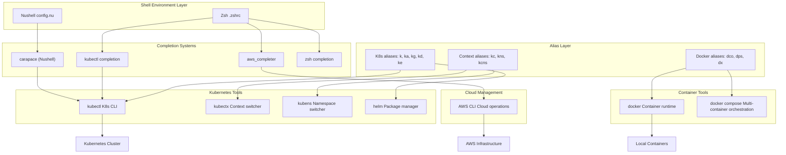
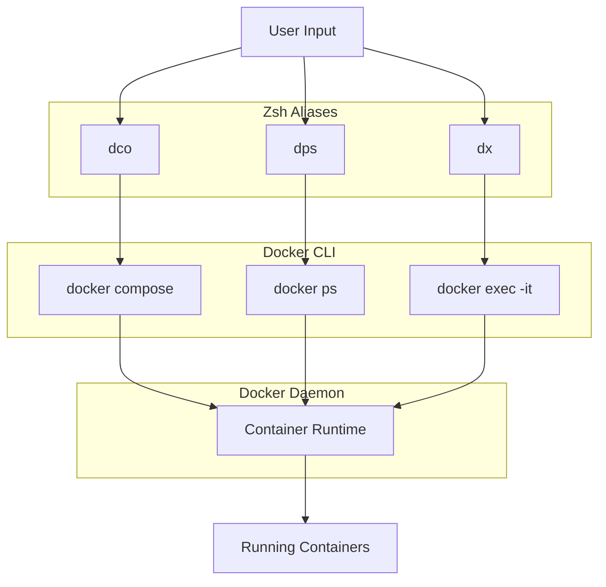
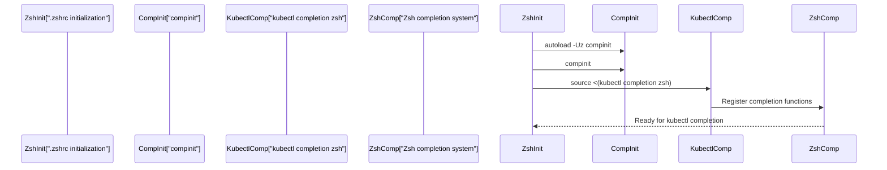
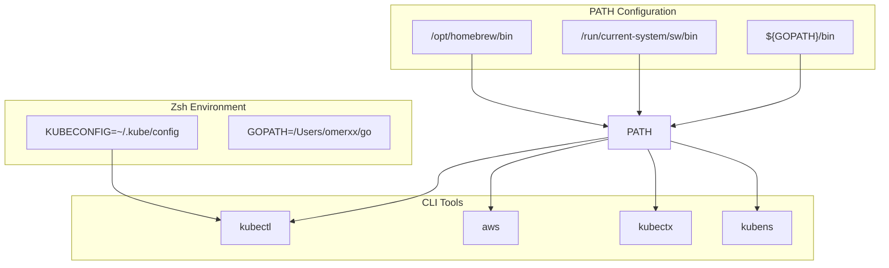
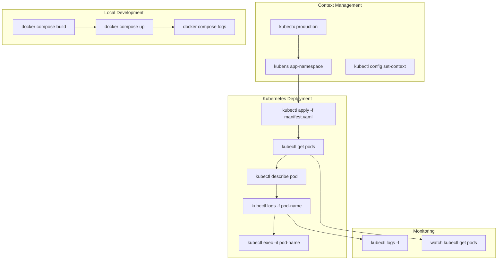
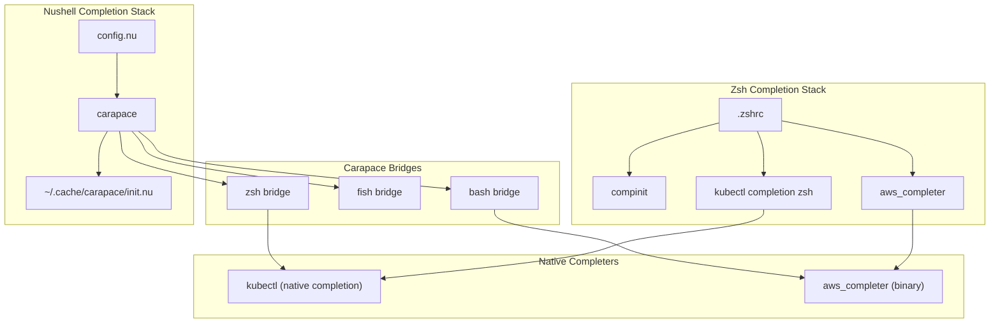

[/](/)

[/search](/search)

[/wiki](/wiki)

[/settings/members](/settings/members)

[/settings/support](/settings/support)

[Add repo](/repositories)

[All repos](/wiki)

[backend](/wiki/Klaudioz/backend)

[BH-Workflow-Engine](/wiki/Klaudioz/BH-Workflow-Engine)

[Buckhead_CRM](/wiki/Klaudioz/Buckhead_CRM)

[dotfiles](/wiki/Klaudioz/dotfiles)

[frontend](/wiki/Klaudioz/frontend)

[godeep.wiki-jb](/wiki/Klaudioz/godeep.wiki-jb)

[pi-mono-zero](/wiki/Klaudioz/pi-mono-zero)

[VirtualOracle](/wiki/Klaudioz/VirtualOracle)

# Container and Cloud ToolsLink copied!

> **Relevant source files**
> * [.gitignore](https://github.com/Klaudioz/dotfiles/blob/2febda55/.gitignore)
> * [nushell/config.nu](https://github.com/Klaudioz/dotfiles/blob/2febda55/nushell/config.nu)
> * [nushell/env.nu](https://github.com/Klaudioz/dotfiles/blob/2febda55/nushell/env.nu)
> * [zshrc/.zshrc](https://github.com/Klaudioz/dotfiles/blob/2febda55/zshrc/.zshrc)

## Purpose and ScopeLink copied!

This document explains the integration of container and cloud management tools within the shell environments. It covers Docker for container management, Kubernetes tools (kubectl, kubectx, kubens, Helm) for orchestration, and AWS CLI for cloud infrastructure. The focus is on how these tools are configured through extensive alias systems, shell completion integrations, and workflow optimizations across both Nushell and Zsh.

For Git workflow integration, see [Version Control Integration](#7.1). For general navigation and discovery tools like fzf and fd, see [Navigation and Discovery Tools](#7.3).

## Tool Integration ArchitectureLink copied!



**Sources:** [nushell/config.nu L939-L951](https://github.com/Klaudioz/dotfiles/blob/2febda55/nushell/config.nu#L939-L951)

 [zshrc/.zshrc L47-L89](https://github.com/Klaudioz/dotfiles/blob/2febda55/zshrc/.zshrc#L47-L89)

## Docker Container ManagementLink copied!

Docker integration provides local container management with workflow-optimized aliases for common operations. Configuration differs between shells but provides equivalent functionality.

### Docker Aliases in ZshLink copied!

The Zsh configuration defines Docker aliases for container lifecycle management:

| Alias | Command | Purpose |
| --- | --- | --- |
| `dco` | `docker compose` | Execute docker compose commands |
| `dps` | `docker ps` | List running containers |
| `dpa` | `docker ps -a` | List all containers (including stopped) |
| `dl` | `docker ps -l -q` | Get ID of last container |
| `dx` | `docker exec -it` | Execute interactive shell in container |

**Sources:** [zshrc/.zshrc L47-L52](https://github.com/Klaudioz/dotfiles/blob/2febda55/zshrc/.zshrc#L47-L52)

### Docker Integration FlowLink copied!



**Sources:** [zshrc/.zshrc L47-L52](https://github.com/Klaudioz/dotfiles/blob/2febda55/zshrc/.zshrc#L47-L52)

### Nushell Docker IntegrationLink copied!

Nushell does not currently define Docker-specific aliases in the provided configuration, relying instead on direct tool invocation. Users can add Docker aliases following the same pattern as other tools.

**Sources:** [nushell/config.nu](https://github.com/Klaudioz/dotfiles/blob/2febda55/nushell/config.nu)

## Kubernetes Ecosystem IntegrationLink copied!

Kubernetes integration is extensive across both shells, providing aliases for cluster management, resource operations, and context switching. The configuration includes KUBECONFIG environment setup and comprehensive kubectl operations.

### Kubernetes ConfigurationLink copied!

```mermaid
flowchart TD

KUBECONFIG["KUBECONFIG=~/.kube/config"]
k["k (kubectl)"]
ka["ka (kubectl apply -f)"]
kg["kg (kubectl get)"]
kd["kd (kubectl describe)"]
kdel["kdel (kubectl delete)"]
kl["kl (kubectl logs -f)"]
ke["ke (kubectl exec -it)"]
kgpo["kgpo (kubectl get pod)"]
kgd["kgd (kubectl get deployments)"]
kc["kc (kubectx)"]
kns["kns (kubens)"]
kcns["kcns (kubectl config set-context)"]
kubectl["kubectl CLI"]
kubectx_tool["kubectx"]
kubens_tool["kubens"]
cluster["Kubernetes Cluster"]

KUBECONFIG --> kubectl
k --> kubectl
ka --> kubectl
kg --> kubectl
kd --> kubectl
kdel --> kubectl
kl --> kubectl
ke --> kubectl
kgpo --> kubectl
kgd --> kubectl
kc --> kubectx_tool
kns --> kubens_tool
kcns --> kubectl
kubectl --> cluster
kubectx_tool --> cluster
kubens_tool --> cluster

subgraph Tools ["External Tools"]
    kubectl
    kubectx_tool
    kubens_tool
end

subgraph ContextManagement ["Context Management"]
    kc
    kns
    kcns
end

subgraph ResourceAliases ["Resource-Specific Aliases"]
    kgpo
    kgd
end

subgraph CoreAliases ["Core kubectl Aliases"]
    k
    ka
    kg
    kd
    kdel
    kl
    ke
end

subgraph EnvSetup ["Environment Setup"]
    KUBECONFIG
end
```



**Sources:** [nushell/config.nu L939-L951](https://github.com/Klaudioz/dotfiles/blob/2febda55/nushell/config.nu#L939-L951)

 [zshrc/.zshrc L74-L89](https://github.com/Klaudioz/dotfiles/blob/2febda55/zshrc/.zshrc#L74-L89)

### Cross-Shell Kubernetes Alias ComparisonLink copied!

Both Nushell and Zsh define identical Kubernetes aliases for workflow consistency:

| Alias | Nushell | Zsh | Expanded Command |
| --- | --- | --- | --- |
| `k` | ✓ | ✓ | `kubectl` |
| `ka` | ✓ | ✓ | `kubectl apply -f` |
| `kg` | ✓ | ✓ | `kubectl get` |
| `kd` | ✓ | ✓ | `kubectl describe` |
| `kdel` | ✓ | ✓ | `kubectl delete` |
| `kl` | ✓ | ✓ | `kubectl logs -f` |
| `ke` | ✓ | ✓ | `kubectl exec -it` |
| `kgpo` | ✓ | ✓ | `kubectl get pod` |
| `kgd` | ✓ | ✓ | `kubectl get deployments` |
| `kc` | ✓ | ✓ | `kubectx` |
| `kns` | ✓ | ✓ | `kubens` |
| `kcns` | - | ✓ | `kubectl config set-context --current --namespace` |

**Sources:** [nushell/config.nu L939-L951](https://github.com/Klaudioz/dotfiles/blob/2febda55/nushell/config.nu#L939-L951)

 [zshrc/.zshrc L74-L89](https://github.com/Klaudioz/dotfiles/blob/2febda55/zshrc/.zshrc#L74-L89)

### Kubernetes Alias ImplementationLink copied!

**Nushell Configuration:**

```sql
# K8s
alias k = kubectl
alias ka = kubectl apply -f
alias kg = kubectl get
alias kd = kubectl describe
alias kdel = kubectl delete
alias kl = kubectl logs
alias kgpo = kubectl get pod
alias kgd = kubectl get deployments
alias kc = kubectx
alias kns = kubens
alias kl = kubectl logs -f
alias ke = kubectl exec -it
```

**Sources:** [nushell/config.nu L939-L951](https://github.com/Klaudioz/dotfiles/blob/2febda55/nushell/config.nu#L939-L951)

**Zsh Configuration:**

```javascript
# K8S
export KUBECONFIG=~/.kube/config
alias k="kubectl"
alias ka="kubectl apply -f"
alias kg="kubectl get"
alias kd="kubectl describe"
alias kdel="kubectl delete"
alias kl="kubectl logs"
alias kgpo="kubectl get pod"
alias kgd="kubectl get deployments"
alias kc="kubectx"
alias kns="kubens"
alias kl="kubectl logs -f"
alias ke="kubectl exec -it"
alias kcns='kubectl config set-context --current --namespace'
```

**Sources:** [zshrc/.zshrc L74-L89](https://github.com/Klaudioz/dotfiles/blob/2febda55/zshrc/.zshrc#L74-L89)

## Kubernetes Completion SystemLink copied!

Shell completion enables context-aware suggestions for kubectl commands, including resources, namespaces, and flags.

### Zsh Kubectl CompletionLink copied!

Zsh loads kubectl completion during shell initialization:



**Sources:** [zshrc/.zshrc L6-L8](https://github.com/Klaudioz/dotfiles/blob/2febda55/zshrc/.zshrc#L6-L8)

The completion system initialization:

```
autoload -Uz compinitcompinitsource <(kubectl completion zsh)
```

**Sources:** [zshrc/.zshrc L6-L8](https://github.com/Klaudioz/dotfiles/blob/2febda55/zshrc/.zshrc#L6-L8)

### Nushell Carapace IntegrationLink copied!

Nushell uses Carapace for multi-shell completion support, including kubectl completions:

```markdown
$env.CARAPACE_BRIDGES = 'zsh,fish,bash,inshellisense' # optional
mkdir ~/.cache/carapace
carapace _carapace nushell | save --force ~/.cache/carapace/init.nu
```

Then loaded in config:

```
source ~/.cache/carapace/init.nu
```

**Sources:** [nushell/env.nu L129-L131](https://github.com/Klaudioz/dotfiles/blob/2febda55/nushell/env.nu#L129-L131)

 [nushell/config.nu L955](https://github.com/Klaudioz/dotfiles/blob/2febda55/nushell/config.nu#L955-L955)

## AWS CLI IntegrationLink copied!

AWS CLI provides cloud infrastructure management with completion support configured differently per shell.

### Zsh AWS CompletionLink copied!

Zsh uses the AWS-provided completer binary:

```
complete -C '/usr/local/bin/aws_completer' aws
```

This enables bash-style completion for AWS commands through the dedicated completer.

**Sources:** [zshrc/.zshrc L9](https://github.com/Klaudioz/dotfiles/blob/2febda55/zshrc/.zshrc#L9-L9)

### AWS and Kubernetes Environment VariablesLink copied!



**Sources:** [zshrc/.zshrc L70-L121](https://github.com/Klaudioz/dotfiles/blob/2febda55/zshrc/.zshrc#L70-L121)

## Helm Package ManagerLink copied!

Helm is available through both shell environments but does not have dedicated aliases defined. It is typically used with its native command structure:

* `helm install <name> <chart>`
* `helm upgrade <release> <chart>`
* `helm list`
* `helm uninstall <release>`

Users can add custom Helm aliases following the pattern established for kubectl.

## Tool Integration PatternsLink copied!

### Common Workflow PatternsLink copied!

The alias system supports common container and cloud workflows:



### Alias Usage ExamplesLink copied!

**Docker Compose Workflow:**

```
dco build        # Build containersdco up -d        # Start in detached modedps              # Check running containersdx <container>   # Execute shell in container
```

**Kubernetes Deployment Workflow:**

```html
kc production    # Switch to production contextkns app          # Switch to app namespaceka deployment.yaml  # Apply deploymentkgpo             # List podskl <pod-name>    # Follow pod logske <pod-name>    # Execute shell in pod
```

**Sources:** [nushell/config.nu L939-L951](https://github.com/Klaudioz/dotfiles/blob/2febda55/nushell/config.nu#L939-L951)

 [zshrc/.zshrc L47-L89](https://github.com/Klaudioz/dotfiles/blob/2febda55/zshrc/.zshrc#L47-L89)

## Configuration File LocationsLink copied!

Container and cloud tool configurations are stored in standard locations:

| Tool | Config Location | Environment Variable |
| --- | --- | --- |
| Docker | `~/.docker/config.json` | - |
| kubectl | `~/.kube/config` | `KUBECONFIG` |
| AWS CLI | `~/.aws/config`, `~/.aws/credentials` | `AWS_CONFIG_FILE` |
| Helm | `~/.config/helm/` | - |

The `KUBECONFIG` environment variable is explicitly set in Zsh:

```
export KUBECONFIG=~/.kube/config
```

**Sources:** [zshrc/.zshrc L75](https://github.com/Klaudioz/dotfiles/blob/2febda55/zshrc/.zshrc#L75-L75)

## Completion Bridge ArchitectureLink copied!



**Sources:** [nushell/env.nu L129-L131](https://github.com/Klaudioz/dotfiles/blob/2febda55/nushell/env.nu#L129-L131)

 [nushell/config.nu L955](https://github.com/Klaudioz/dotfiles/blob/2febda55/nushell/config.nu#L955-L955)

 [zshrc/.zshrc L6-L9](https://github.com/Klaudioz/dotfiles/blob/2febda55/zshrc/.zshrc#L6-L9)

## SummaryLink copied!

Container and cloud tools are deeply integrated into the shell environments through:

1. **Extensive Alias Systems**: Both Nushell and Zsh define consistent aliases for Docker, kubectl, and context management
2. **Shell Completion**: kubectl completion via native integration (Zsh) and Carapace bridges (Nushell)
3. **AWS Integration**: AWS CLI with bash completion in Zsh
4. **Environment Configuration**: KUBECONFIG and PATH setup for tool accessibility
5. **Workflow Optimization**: Short aliases (k, ka, dco) reduce typing for frequent operations

The cross-shell consistency ensures that users switching between Nushell and Zsh maintain the same muscle memory for container and cloud operations.

**Sources:** [nushell/config.nu L939-L951](https://github.com/Klaudioz/dotfiles/blob/2febda55/nushell/config.nu#L939-L951)

 [nushell/env.nu L129-L131](https://github.com/Klaudioz/dotfiles/blob/2febda55/nushell/env.nu#L129-L131)

 [zshrc/.zshrc L6-L89](https://github.com/Klaudioz/dotfiles/blob/2febda55/zshrc/.zshrc#L6-L89)

Refresh this wiki

Last indexed: 18 December 2025 ([2febda](https://github.com/Klaudioz/dotfiles/commit/2febda55))

### On this page

* [Container and Cloud Tools](#7.2-container-and-cloud-tools)
* [Purpose and Scope](#7.2-purpose-and-scope)
* [Tool Integration Architecture](#7.2-tool-integration-architecture)
* [Docker Container Management](#7.2-docker-container-management)
* [Docker Aliases in Zsh](#7.2-docker-aliases-in-zsh)
* [Docker Integration Flow](#7.2-docker-integration-flow)
* [Nushell Docker Integration](#7.2-nushell-docker-integration)
* [Kubernetes Ecosystem Integration](#7.2-kubernetes-ecosystem-integration)
* [Kubernetes Configuration](#7.2-kubernetes-configuration)
* [Cross-Shell Kubernetes Alias Comparison](#7.2-cross-shell-kubernetes-alias-comparison)
* [Kubernetes Alias Implementation](#7.2-kubernetes-alias-implementation)
* [Kubernetes Completion System](#7.2-kubernetes-completion-system)
* [Zsh Kubectl Completion](#7.2-zsh-kubectl-completion)
* [Nushell Carapace Integration](#7.2-nushell-carapace-integration)
* [AWS CLI Integration](#7.2-aws-cli-integration)
* [Zsh AWS Completion](#7.2-zsh-aws-completion)
* [AWS and Kubernetes Environment Variables](#7.2-aws-and-kubernetes-environment-variables)
* [Helm Package Manager](#7.2-helm-package-manager)
* [Tool Integration Patterns](#7.2-tool-integration-patterns)
* [Common Workflow Patterns](#7.2-common-workflow-patterns)
* [Alias Usage Examples](#7.2-alias-usage-examples)
* [Configuration File Locations](#7.2-configuration-file-locations)
* [Completion Bridge Architecture](#7.2-completion-bridge-architecture)
* [Summary](#7.2-summary)

Ask Devin about dotfiles

  

Syntax error in text

mermaid version 11.4.1

Syntax error in text

mermaid version 11.4.1

Syntax error in text

mermaid version 11.4.1

Syntax error in text

mermaid version 11.4.1

Syntax error in text

mermaid version 11.4.1

Syntax error in text

mermaid version 11.4.1

Syntax error in text

mermaid version 11.4.1

Syntax error in text

mermaid version 11.4.1

Syntax error in text

mermaid version 11.4.1