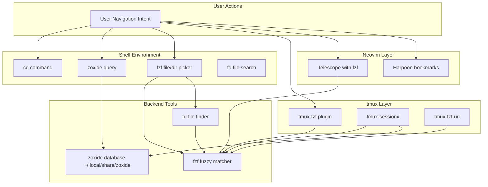
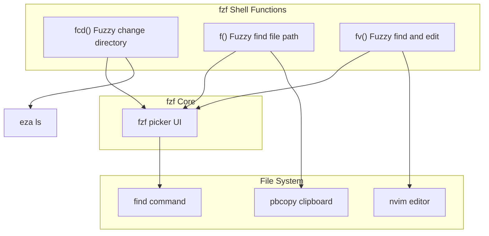
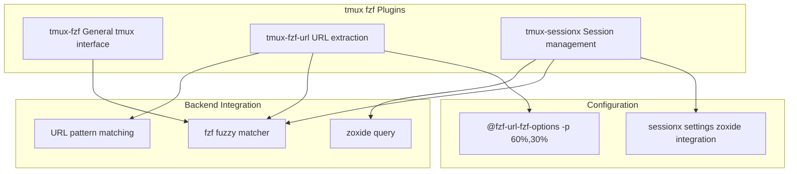
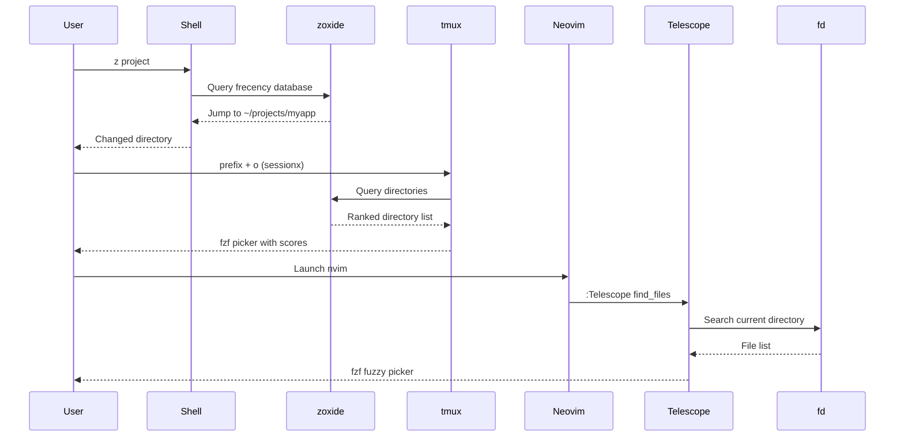
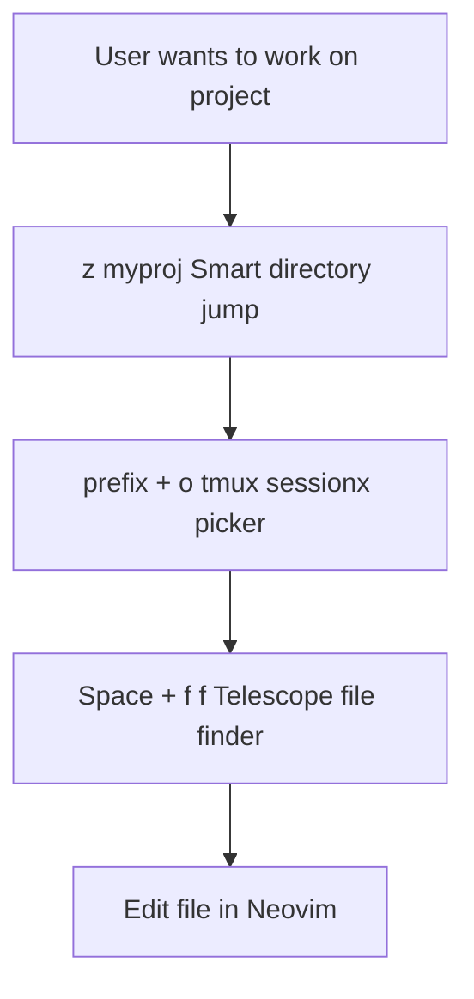

[/](/)

[/search](/search)

[/wiki](/wiki)

[/settings/members](/settings/members)

[/settings/support](/settings/support)

[Add repo](/repositories)

[All repos](/wiki)

[backend](/wiki/Klaudioz/backend)

[BH-Workflow-Engine](/wiki/Klaudioz/BH-Workflow-Engine)

[Buckhead_CRM](/wiki/Klaudioz/Buckhead_CRM)

[dotfiles](/wiki/Klaudioz/dotfiles)

[frontend](/wiki/Klaudioz/frontend)

[godeep.wiki-jb](/wiki/Klaudioz/godeep.wiki-jb)

[pi-mono-zero](/wiki/Klaudioz/pi-mono-zero)

[VirtualOracle](/wiki/Klaudioz/VirtualOracle)

# Navigation and Discovery ToolsLink copied!

> **Relevant source files**
> * [.gitignore](https://github.com/Klaudioz/dotfiles/blob/2febda55/.gitignore)
> * [nushell/config.nu](https://github.com/Klaudioz/dotfiles/blob/2febda55/nushell/config.nu)
> * [nushell/env.nu](https://github.com/Klaudioz/dotfiles/blob/2febda55/nushell/env.nu)
> * [tmux/tmux.conf](https://github.com/Klaudioz/dotfiles/blob/2febda55/tmux/tmux.conf)
> * [zshrc/.zshrc](https://github.com/Klaudioz/dotfiles/blob/2febda55/zshrc/.zshrc)

## Purpose and ScopeLink copied!

This page documents the navigation and discovery tools integrated throughout the dotfiles environment, which enable efficient filesystem navigation, file discovery, and content search. These tools form a cohesive system that works across Nushell, Zsh, tmux, and Neovim, providing consistent fuzzy finding and smart directory jumping capabilities.

For version control integration (Git tools), see [Version Control Integration](#7.1). For AI-assisted development tools, see [AI-Assisted Development](#7.4).

---

## OverviewLink copied!

The navigation and discovery system consists of four primary tools that work together to enhance productivity:

| Tool | Primary Function | Importance | Integration Points |
| --- | --- | --- | --- |
| `zoxide` | Smart directory jumping with frecency algorithm | High | Nushell, Zsh, tmux-sessionx |
| `fzf` | Fuzzy finder for files, directories, and content | Critical | Shell, tmux, Neovim |
| `fd` | Fast file discovery (find replacement) | Medium | Powers fzf searches |
| `harpoon` | File bookmarking within Neovim | Medium | Neovim only |

These tools are designed to minimize navigation friction by learning from user behavior (zoxide), providing fast fuzzy search (fzf/fd), and enabling quick access to frequently-used files (harpoon).

**Sources:** High-level architecture diagrams (Diagram 4: Tool Integration and Dependency Network)

---

## Integration ArchitectureLink copied!

### Cross-Environment Navigation FlowLink copied!



**Sources:** [nushell/config.nu L954](https://github.com/Klaudioz/dotfiles/blob/2febda55/nushell/config.nu#L954-L954)

 [nushell/env.nu L125](https://github.com/Klaudioz/dotfiles/blob/2febda55/nushell/env.nu#L125-L125)

 [zshrc/.zshrc L112-L113](https://github.com/Klaudioz/dotfiles/blob/2febda55/zshrc/.zshrc#L112-L113)

 [zshrc/.zshrc L154](https://github.com/Klaudioz/dotfiles/blob/2febda55/zshrc/.zshrc#L154-L154)

 [tmux/tmux.conf L27-L28](https://github.com/Klaudioz/dotfiles/blob/2febda55/tmux/tmux.conf#L27-L28)

---

## zoxide: Smart Directory JumpingLink copied!

### FunctionalityLink copied!

`zoxide` is a smarter `cd` command that tracks directory usage frequency and recency (frecency algorithm). It learns from your navigation patterns and allows jumping to directories by typing partial matches.

### Shell IntegrationLink copied!

#### Nushell Configuration

The zoxide integration in Nushell is initialized during shell startup:

[nushell/env.nu L125](https://github.com/Klaudioz/dotfiles/blob/2febda55/nushell/env.nu#L125-L125)

```
zoxide init nushell | save -f ~/.zoxide.nu
```

This command generates initialization code and saves it to `~/.zoxide.nu`, which is then sourced in the main configuration:

[nushell/config.nu L954](https://github.com/Klaudioz/dotfiles/blob/2febda55/nushell/config.nu#L954-L954)

```
source ~/.zoxide.nu
```

#### Zsh Configuration

The zoxide integration in Zsh is loaded via `eval`:

[zshrc/.zshrc L154](https://github.com/Klaudioz/dotfiles/blob/2febda55/zshrc/.zshrc#L154-L154)

```
eval "$(zoxide init zsh)"
```

### Usage PatternsLink copied!

| Command | Behavior | Example |
| --- | --- | --- |
| `z <partial>` | Jump to highest-ranked directory matching partial | `z dot` → jumps to `~/dotfiles` |
| `zi <partial>` | Interactive selection with fzf | `zi proj` → shows matching projects |
| `z -` | Jump to previous directory | `z -` → cd to last location |
| `zoxide query <partial>` | Query database without jumping | Returns matching paths |

The custom `cx` function in both shells enhances navigation by listing directory contents after changing:

[zshrc/.zshrc L141](https://github.com/Klaudioz/dotfiles/blob/2febda55/zshrc/.zshrc#L141-L141)

```
cx() { cd "$@" && l; }
```

[nushell/config.nu L904-L907](https://github.com/Klaudioz/dotfiles/blob/2febda55/nushell/config.nu#L904-L907)

```python
def --env cx [arg] {
    cd $arg
    ls -l
}
```

**Sources:** [nushell/env.nu L125](https://github.com/Klaudioz/dotfiles/blob/2febda55/nushell/env.nu#L125-L125)

 [nushell/config.nu L954](https://github.com/Klaudioz/dotfiles/blob/2febda55/nushell/config.nu#L954-L954)

 [zshrc/.zshrc L154](https://github.com/Klaudioz/dotfiles/blob/2febda55/zshrc/.zshrc#L154-L154)

 [nushell/config.nu L904-L907](https://github.com/Klaudioz/dotfiles/blob/2febda55/nushell/config.nu#L904-L907)

 [zshrc/.zshrc L141](https://github.com/Klaudioz/dotfiles/blob/2febda55/zshrc/.zshrc#L141-L141)

---

## fzf: Fuzzy Finding InterfaceLink copied!

### Core ConfigurationLink copied!

`fzf` serves as the universal fuzzy finder across all environments. Its default behavior is configured to use `fd` for file discovery:

[zshrc/.zshrc L112-L113](https://github.com/Klaudioz/dotfiles/blob/2febda55/zshrc/.zshrc#L112-L113)

```javascript
export FZF_DEFAULT_COMMAND='fd --type f --hidden --follow'
[ -f ~/.fzf.zsh ] && source ~/.fzf.zsh
```

This configuration ensures that:

* Only files (not directories) are searched by default (`--type f`)
* Hidden files are included (`--hidden`)
* Symbolic links are followed (`--follow`)

### Shell IntegrationLink copied!

#### Zsh Custom Functions

The Zsh configuration provides several fzf-powered navigation functions:



[zshrc/.zshrc L142-L144](https://github.com/Klaudioz/dotfiles/blob/2febda55/zshrc/.zshrc#L142-L144)

```php
fcd() { cd "$(find . -type d -not -path '*/.*' | fzf)" && l; }
f() { echo "$(find . -type f -not -path '*/.*' | fzf)" | pbcopy }
fv() { nvim "$(find . -type f -not -path '*/.*' | fzf)" }
```

#### Nushell Window Focus Function

Nushell includes an fzf-powered window focusing function that integrates with AeroSpace:

[nushell/config.nu L918-L920](https://github.com/Klaudioz/dotfiles/blob/2febda55/nushell/config.nu#L918-L920)

```python
def ff [] {
    aerospace list-windows --all | fzf --bind 'enter:execute(bash -c "aerospace focus --window-id {1}")+abort'
}
```

**Sources:** [zshrc/.zshrc L112-L113](https://github.com/Klaudioz/dotfiles/blob/2febda55/zshrc/.zshrc#L112-L113)

 [zshrc/.zshrc L142-L144](https://github.com/Klaudioz/dotfiles/blob/2febda55/zshrc/.zshrc#L142-L144)

 [nushell/config.nu L918-L920](https://github.com/Klaudioz/dotfiles/blob/2febda55/nushell/config.nu#L918-L920)

---

## tmux IntegrationLink copied!

### tmux-fzf Plugin EcosystemLink copied!

The tmux configuration includes multiple fzf-powered plugins that enhance session and window management:



### tmux-fzf-url ConfigurationLink copied!

This plugin extracts URLs from tmux panes and allows fuzzy selection:

[tmux/tmux.conf L18-L19](https://github.com/Klaudioz/dotfiles/blob/2febda55/tmux/tmux.conf#L18-L19)

```
set -g @fzf-url-fzf-options '-p 60%,30% --prompt="   " --border-label=" Open URL "'
set -g @fzf-url-history-limit '2000'
```

[tmux/tmux.conf L28](https://github.com/Klaudioz/dotfiles/blob/2febda55/tmux/tmux.conf#L28-L28)

```
set -g @plugin 'wfxr/tmux-fzf-url'
```

### tmux-sessionx: Advanced Session ManagementLink copied!

`tmux-sessionx` provides a sophisticated session management interface with zoxide integration:

[tmux/tmux.conf L30-L47](https://github.com/Klaudioz/dotfiles/blob/2febda55/tmux/tmux.conf#L30-L47)

```
set -g @plugin 'omerxx/tmux-sessionx'
set -g @sessionx-bind-zo-new-window 'ctrl-y'
set -g @sessionx-auto-accept 'off'
set -g @sessionx-custom-paths '/Users/omerxx/dotfiles'
set -g @sessionx-bind 'o'
set -g @sessionx-x-path '~/dotfiles'
set -g @sessionx-window-height '85%'
set -g @sessionx-window-width '75%'
set -g @sessionx-zoxide-mode 'on'
set -g @sessionx-custom-paths-subdirectories 'false'
set -g @sessionx-filter-current 'false'
```

| Setting | Value | Purpose |
| --- | --- | --- |
| `@sessionx-bind` | `'o'` | Keybinding to open sessionx |
| `@sessionx-zoxide-mode` | `'on'` | Enable zoxide directory scoring |
| `@sessionx-window-height` | `'85%'` | Popup window height |
| `@sessionx-window-width` | `'75%'` | Popup window width |
| `@sessionx-custom-paths` | `'/Users/omerxx/dotfiles'` | Additional search paths |

The zoxide integration means that session selection is ranked by directory access frequency, making frequently-used projects appear at the top of the list.

**Sources:** [tmux/tmux.conf L18-L19](https://github.com/Klaudioz/dotfiles/blob/2febda55/tmux/tmux.conf#L18-L19)

 [tmux/tmux.conf L27-L28](https://github.com/Klaudioz/dotfiles/blob/2febda55/tmux/tmux.conf#L27-L28)

 [tmux/tmux.conf L30-L47](https://github.com/Klaudioz/dotfiles/blob/2febda55/tmux/tmux.conf#L30-L47)

---

## fd: Fast File DiscoveryLink copied!

### Purpose and ConfigurationLink copied!

`fd` is a modern replacement for the Unix `find` command, offering:

* Faster performance through parallel directory traversal
* Sensible defaults (ignores `.git`, respects `.gitignore`)
* Colored output
* Regular expression support

### Integration with fzfLink copied!

The primary use of `fd` is as the backend for `fzf` searches:

[zshrc/.zshrc L112](https://github.com/Klaudioz/dotfiles/blob/2febda55/zshrc/.zshrc#L112-L112)

```javascript
export FZF_DEFAULT_COMMAND='fd --type f --hidden --follow'
```

This configuration makes `fd` the default file source for all `fzf` operations, providing:

* File type filtering (`--type f`)
* Hidden file inclusion (`--hidden`)
* Symlink following (`--follow`)

### Common Usage PatternsLink copied!

While `fd` is primarily used implicitly through `fzf`, it can be invoked directly for advanced searches:

| Pattern | Command | Result |
| --- | --- | --- |
| Find files by extension | `fd -e lua` | All `.lua` files |
| Find in specific directory | `fd pattern ~/.config` | Search in config dir |
| Execute on results | `fd -e md -x cat` | Concatenate all markdown |
| Exclude patterns | `fd -E node_modules` | Ignore node_modules |

**Sources:** [zshrc/.zshrc L112](https://github.com/Klaudioz/dotfiles/blob/2febda55/zshrc/.zshrc#L112-L112)

 [.gitignore L4](https://github.com/Klaudioz/dotfiles/blob/2febda55/.gitignore#L4-L4)

---

## Neovim IntegrationLink copied!

### Harpoon: File BookmarkingLink copied!

While not directly related to `fzf` or `zoxide`, `harpoon` serves as Neovim's internal navigation system for frequently-accessed files. It allows marking files and quickly jumping between them.

### Telescope with fzf IntegrationLink copied!

Neovim's Telescope plugin uses `fzf` as a fuzzy matching algorithm, providing file finding, live grep, and buffer switching capabilities. The integration is managed through the LazyVim plugin ecosystem.

### File Navigation WorkflowLink copied!



**Sources:** High-level architecture diagrams (Diagram 4: Tool Integration and Dependency Network)

---

## Configuration File LocationsLink copied!

| Tool | Configuration File | Initialization Location |
| --- | --- | --- |
| zoxide | Database: `~/.local/share/zoxide/db.zo` | [nushell/env.nu L125](https://github.com/Klaudioz/dotfiles/blob/2febda55/nushell/env.nu#L125-L125) <br>  [zshrc/.zshrc L154](https://github.com/Klaudioz/dotfiles/blob/2febda55/zshrc/.zshrc#L154-L154) |
| fzf | Shell: `~/.fzf.zsh` | [zshrc/.zshrc L113](https://github.com/Klaudioz/dotfiles/blob/2febda55/zshrc/.zshrc#L113-L113) |
| fd | None (uses command-line args) | [zshrc/.zshrc L112](https://github.com/Klaudioz/dotfiles/blob/2febda55/zshrc/.zshrc#L112-L112) |
| tmux-fzf | Managed by tpm | [tmux/tmux.conf L27](https://github.com/Klaudioz/dotfiles/blob/2febda55/tmux/tmux.conf#L27-L27) |
| tmux-fzf-url | Managed by tpm | [tmux/tmux.conf L28](https://github.com/Klaudioz/dotfiles/blob/2febda55/tmux/tmux.conf#L28-L28) |
| tmux-sessionx | Managed by tpm | [tmux/tmux.conf L30](https://github.com/Klaudioz/dotfiles/blob/2febda55/tmux/tmux.conf#L30-L30) |

**Sources:** [nushell/env.nu L125](https://github.com/Klaudioz/dotfiles/blob/2febda55/nushell/env.nu#L125-L125)

 [zshrc/.zshrc L112-L113](https://github.com/Klaudioz/dotfiles/blob/2febda55/zshrc/.zshrc#L112-L113)

 [zshrc/.zshrc L154](https://github.com/Klaudioz/dotfiles/blob/2febda55/zshrc/.zshrc#L154-L154)

 [tmux/tmux.conf L27-L28](https://github.com/Klaudioz/dotfiles/blob/2febda55/tmux/tmux.conf#L27-L28)

 [tmux/tmux.conf L30](https://github.com/Klaudioz/dotfiles/blob/2febda55/tmux/tmux.conf#L30-L30)

---

## Workflow ExamplesLink copied!

### Example 1: Project NavigationLink copied!



1. User types `z myproj` to jump to project directory using zoxide
2. User presses tmux prefix + `o` to open sessionx and select/create session
3. Within Neovim, user presses leader + `ff` to fuzzy find files via Telescope
4. User navigates and edits files

### Example 2: URL Extraction from Terminal OutputLink copied!

1. User runs command that outputs URLs (e.g., `git remote -v`)
2. User presses tmux prefix + `u` to trigger tmux-fzf-url
3. Plugin extracts all URLs from visible panes
4. User fuzzy searches and selects URL to open in browser

### Example 3: Cross-Directory File SearchLink copied!

1. User in shell runs custom `fv` function
2. Function invokes `find . -type f | fzf`
3. User fuzzy searches for filename
4. Selected file opens in Neovim

**Sources:** [nushell/config.nu L918-L920](https://github.com/Klaudioz/dotfiles/blob/2febda55/nushell/config.nu#L918-L920)

 [zshrc/.zshrc L142-L144](https://github.com/Klaudioz/dotfiles/blob/2febda55/zshrc/.zshrc#L142-L144)

 [tmux/tmux.conf L18-L19](https://github.com/Klaudioz/dotfiles/blob/2febda55/tmux/tmux.conf#L18-L19)

---

## Performance ConsiderationsLink copied!

| Tool | Performance Characteristic | Optimization |
| --- | --- | --- |
| zoxide | O(1) database lookup | Maintains frecency scores, prunes old entries |
| fzf | O(n) fuzzy matching | Parallel processing, incremental updates |
| fd | O(n) directory traversal | Parallel execution, respects `.gitignore` |
| tmux-sessionx | O(n) session listing | Cached zoxide scores, limited directory depth |

The navigation system is designed for sub-second response times even in large directory trees, achieved through:

* Pre-computed zoxide frecency scores
* Parallel file searching with `fd`
* Incremental fuzzy matching in `fzf`
* Intelligent caching in tmux plugins

**Sources:** [zshrc/.zshrc L112](https://github.com/Klaudioz/dotfiles/blob/2febda55/zshrc/.zshrc#L112-L112)

 [tmux/tmux.conf L38-L47](https://github.com/Klaudioz/dotfiles/blob/2febda55/tmux/tmux.conf#L38-L47)

---

## Keybindings SummaryLink copied!

### Shell KeybindingsLink copied!

| Key | Shell | Function |
| --- | --- | --- |
| `Ctrl-R` | Both | fzf history search (via atuin in Nushell) |
| `Ctrl-T` | Zsh | fzf file picker |
| `Alt-C` | Zsh | fzf directory picker |

### tmux KeybindingsLink copied!

| Key | Function |
| --- | --- |
| `prefix + o` | tmux-sessionx session picker |
| `prefix + u` | tmux-fzf-url URL picker |
| `prefix + F` | tmux-fzf command |

### Neovim Keybindings (via LazyVim)Link copied!

| Key | Function |
| --- | --- |
| `<leader>ff` | Telescope find files |
| `<leader>fg` | Telescope live grep |
| `<leader>fb` | Telescope buffers |

**Sources:** [nushell/config.nu L422-L427](https://github.com/Klaudioz/dotfiles/blob/2febda55/nushell/config.nu#L422-L427)

 [tmux/tmux.conf L41](https://github.com/Klaudioz/dotfiles/blob/2febda55/tmux/tmux.conf#L41-L41)

 [tmux/tmux.conf L18](https://github.com/Klaudioz/dotfiles/blob/2febda55/tmux/tmux.conf#L18-L18)

Refresh this wiki

Last indexed: 18 December 2025 ([2febda](https://github.com/Klaudioz/dotfiles/commit/2febda55))

### On this page

* [Navigation and Discovery Tools](#7.3-navigation-and-discovery-tools)
* [Purpose and Scope](#7.3-purpose-and-scope)
* [Overview](#7.3-overview)
* [Integration Architecture](#7.3-integration-architecture)
* [Cross-Environment Navigation Flow](#7.3-cross-environment-navigation-flow)
* [zoxide: Smart Directory Jumping](#7.3-zoxide-smart-directory-jumping)
* [Functionality](#7.3-functionality)
* [Shell Integration](#7.3-shell-integration)
* [Usage Patterns](#7.3-usage-patterns)
* [fzf: Fuzzy Finding Interface](#7.3-fzf-fuzzy-finding-interface)
* [Core Configuration](#7.3-core-configuration)
* [Shell Integration](#7.3-shell-integration-1)
* [tmux Integration](#7.3-tmux-integration)
* [tmux-fzf Plugin Ecosystem](#7.3-tmux-fzf-plugin-ecosystem)
* [tmux-fzf-url Configuration](#7.3-tmux-fzf-url-configuration)
* [tmux-sessionx: Advanced Session Management](#7.3-tmux-sessionx-advanced-session-management)
* [fd: Fast File Discovery](#7.3-fd-fast-file-discovery)
* [Purpose and Configuration](#7.3-purpose-and-configuration)
* [Integration with fzf](#7.3-integration-with-fzf)
* [Common Usage Patterns](#7.3-common-usage-patterns)
* [Neovim Integration](#7.3-neovim-integration)
* [Harpoon: File Bookmarking](#7.3-harpoon-file-bookmarking)
* [Telescope with fzf Integration](#7.3-telescope-with-fzf-integration)
* [File Navigation Workflow](#7.3-file-navigation-workflow)
* [Configuration File Locations](#7.3-configuration-file-locations)
* [Workflow Examples](#7.3-workflow-examples)
* [Example 1: Project Navigation](#7.3-example-1-project-navigation)
* [Example 2: URL Extraction from Terminal Output](#7.3-example-2-url-extraction-from-terminal-output)
* [Example 3: Cross-Directory File Search](#7.3-example-3-cross-directory-file-search)
* [Performance Considerations](#7.3-performance-considerations)
* [Keybindings Summary](#7.3-keybindings-summary)
* [Shell Keybindings](#7.3-shell-keybindings)
* [tmux Keybindings](#7.3-tmux-keybindings)
* [Neovim Keybindings (via LazyVim)](#7.3-neovim-keybindings-via-lazyvim)

Ask Devin about dotfiles

  

Syntax error in text

mermaid version 11.4.1

Syntax error in text

mermaid version 11.4.1

Syntax error in text

mermaid version 11.4.1

Syntax error in text

mermaid version 11.4.1

Syntax error in text

mermaid version 11.4.1

Syntax error in text

mermaid version 11.4.1

Syntax error in text

mermaid version 11.4.1

Syntax error in text

mermaid version 11.4.1

Syntax error in text

mermaid version 11.4.1