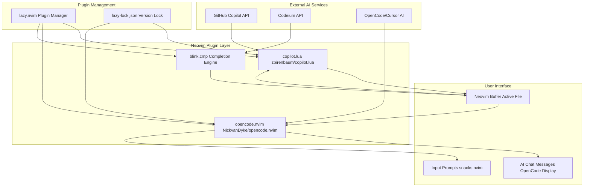
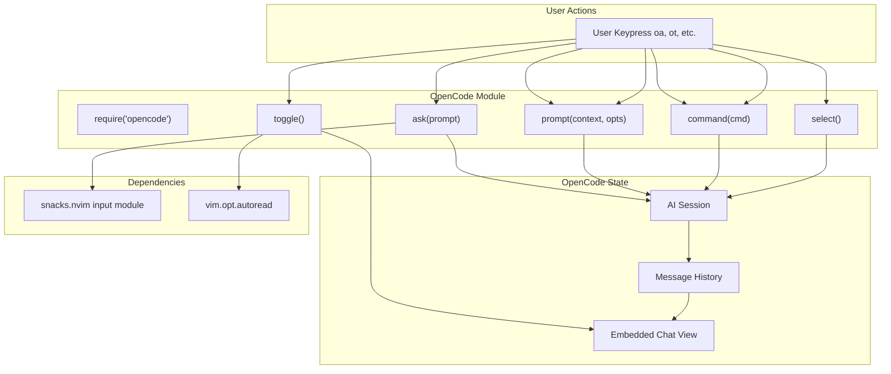

[/](/)

[/search](/search)

[/wiki](/wiki)

[/settings/members](/settings/members)

[/settings/support](/settings/support)

[Add repo](/repositories)

[All repos](/wiki)

[backend](/wiki/Klaudioz/backend)

[BH-Workflow-Engine](/wiki/Klaudioz/BH-Workflow-Engine)

[Buckhead_CRM](/wiki/Klaudioz/Buckhead_CRM)

[dotfiles](/wiki/Klaudioz/dotfiles)

[frontend](/wiki/Klaudioz/frontend)

[godeep.wiki-jb](/wiki/Klaudioz/godeep.wiki-jb)

[pi-mono-zero](/wiki/Klaudioz/pi-mono-zero)

[VirtualOracle](/wiki/Klaudioz/VirtualOracle)

# AI-Assisted DevelopmentLink copied!

> **Relevant source files**
> * [nvim/lazy-lock.json](https://github.com/Klaudioz/dotfiles/blob/2febda55/nvim/lazy-lock.json)
> * [nvim/lua/config/keymaps.lua](https://github.com/Klaudioz/dotfiles/blob/2febda55/nvim/lua/config/keymaps.lua)
> * [nvim/lua/plugins/copilot.lua](https://github.com/Klaudioz/dotfiles/blob/2febda55/nvim/lua/plugins/copilot.lua)
> * [nvim/lua/plugins/go.lua](https://github.com/Klaudioz/dotfiles/blob/2febda55/nvim/lua/plugins/go.lua)
> * [nvim/lua/plugins/opencode.lua](https://github.com/Klaudioz/dotfiles/blob/2febda55/nvim/lua/plugins/opencode.lua)
> * [nvim/lua/plugins/surround.lua](https://github.com/Klaudioz/dotfiles/blob/2febda55/nvim/lua/plugins/surround.lua)

## Purpose and ScopeLink copied!

This document describes the AI-assisted development capabilities integrated into the Neovim editor environment. The system leverages multiple AI providers to enhance coding productivity through code completion, suggestion, and interactive AI assistance. Three primary integrations are configured:

1. **GitHub Copilot** - AI-powered code suggestions and completions
2. **Codeium** - Alternative AI completion provider
3. **OpenCode** - Interactive AI assistant with embedded chat and code explanation

For Neovim's overall plugin architecture, see [Plugin Ecosystem](#4.2). For general code completion configuration, see [Code Intelligence and Completion](#4.6).

---

## AI Integration ArchitectureLink copied!

The following diagram illustrates how AI providers integrate with the Neovim environment and the plugin management system:



**AI Provider Integration Flow**

This architecture shows three distinct AI integration patterns. GitHub Copilot operates through `copilot.lua`, providing inline suggestions directly in the buffer. Codeium integrates through the `blink.cmp` completion engine, appearing in completion menus. OpenCode provides an interactive chat interface using `snacks.nvim` for input prompts and a dedicated display for AI messages. All plugins are managed by `lazy.nvim` with versions locked in `lazy-lock.json`.

**Sources:** [nvim/lazy-lock.json L1-L54](https://github.com/Klaudioz/dotfiles/blob/2febda55/nvim/lazy-lock.json#L1-L54)

 [nvim/lua/plugins/copilot.lua L1-L20](https://github.com/Klaudioz/dotfiles/blob/2febda55/nvim/lua/plugins/copilot.lua#L1-L20)

 [nvim/lua/plugins/opencode.lua L1-L47](https://github.com/Klaudioz/dotfiles/blob/2febda55/nvim/lua/plugins/opencode.lua#L1-L47)

---

## GitHub Copilot ConfigurationLink copied!

GitHub Copilot is configured through the `zbirenbaum/copilot.lua` plugin, providing AI-powered code suggestions as the user types.

### Plugin SetupLink copied!

The Copilot configuration is defined in [nvim/lua/plugins/copilot.lua L1-L20](https://github.com/Klaudioz/dotfiles/blob/2febda55/nvim/lua/plugins/copilot.lua#L1-L20)

:

| Configuration Key | Value | Description |
| --- | --- | --- |
| `suggestion.enabled` | `not vim.g.ai_cmp` | Disabled when using AI in completion engine |
| `suggestion.auto_trigger` | `true` | Suggestions appear automatically while typing |
| `suggestion.hide_during_completion` | `vim.g.ai_cmp` | Hide when completion menu is active |
| `panel.enabled` | `false` | Copilot panel UI is disabled |
| `filetypes.markdown` | `true` | Enable in markdown files |
| `filetypes.help` | `true` | Enable in help files |

### KeybindingsLink copied!

Copilot suggestions use the following keybindings defined in [nvim/lua/plugins/copilot.lua L8-L12](https://github.com/Klaudioz/dotfiles/blob/2febda55/nvim/lua/plugins/copilot.lua#L8-L12)

:

| Keymap | Mode | Action | Description |
| --- | --- | --- | --- |
| `<M-]>` | Insert | `next` | Cycle to next suggestion |
| `<M-<FileRef file-url="https://github.com/Klaudioz/dotfiles/blob/2febda55/>` | Insert | `prev` | Cycle to previous suggestion |

---

## Codeium IntegrationLink copied!

Codeium provides an alternative AI completion service. While not explicitly configured in a dedicated plugin file, it integrates through the completion engine layer. The system supports both Copilot and Codeium, with the completion engine (`blink.cmp`) managing the integration.

### Completion Engine IntegrationLink copied!

The `blink.cmp` completion engine handles AI-powered completions from multiple sources. Version information is tracked in [nvim/lazy-lock.json L5](https://github.com/Klaudioz/dotfiles/blob/2febda55/nvim/lazy-lock.json#L5-L5)

 showing `blink.cmp` locked at commit `bae4bae0eedd1fa55f34b685862e94a222d5c6f8`.

**Sources:** [nvim/lazy-lock.json L5](https://github.com/Klaudioz/dotfiles/blob/2febda55/nvim/lazy-lock.json#L5-L5)

---

## OpenCode Interactive AI AssistantLink copied!

OpenCode (`NickvanDyke/opencode.nvim`) provides an interactive AI assistant that embeds within Neovim, offering conversational AI interactions, code explanations, and context-aware assistance.

### Plugin ArchitectureLink copied!



**OpenCode Function Call Flow**

This diagram maps user keybindings to specific OpenCode API functions. Each leader-prefixed keymap invokes a corresponding function from the `opencode` module: `toggle()` for showing/hiding the embedded view, `ask()` for querying the AI, `prompt()` for sending context, `command()` for session control, and `select()` for prompt selection. The system depends on `snacks.nvim` for input dialogs and requires `autoread` for file synchronization.

**Sources:** [nvim/lua/plugins/opencode.lua L1-L47](https://github.com/Klaudioz/dotfiles/blob/2febda55/nvim/lua/plugins/opencode.lua#L1-L47)

### Configuration and DependenciesLink copied!

OpenCode requires the following setup defined in [nvim/lua/plugins/opencode.lua L1-L13](https://github.com/Klaudioz/dotfiles/blob/2febda55/nvim/lua/plugins/opencode.lua#L1-L13)

:

```
-- Configuration objectvim.g.opencode_opts = {  -- User configuration options}-- Required for opts.auto_reload functionalityvim.opt.autoread = true
```

The plugin depends on `folke/snacks.nvim` with the `input` module enabled, which provides the input dialog interface for AI prompts.

**Sources:** [nvim/lua/plugins/opencode.lua L1-L13](https://github.com/Klaudioz/dotfiles/blob/2febda55/nvim/lua/plugins/opencode.lua#L1-L13)

### Keybinding ReferenceLink copied!

OpenCode provides an extensive set of keybindings organized by functionality:

#### Session Management

| Keymap | Mode | Function | Description |
| --- | --- | --- | --- |
| `<leader>ot` | Normal | `require("opencode").toggle()` | Toggle embedded AI view |
| `<leader>on` | Normal | `require("opencode").command("session_new")` | Create new AI session |

#### Query and Interaction

| Keymap | Mode | Function | Description |
| --- | --- | --- | --- |
| `<leader>oa` | Normal | `require("opencode").ask("@cursor: ")` | Ask about code at cursor |
| `<leader>oa` | Visual | `require("opencode").ask("@selection: ")` | Ask about selected code |
| `<leader>oe` | Normal | `require("opencode").prompt("Explain @cursor and its context")` | Explain code at cursor |

#### Context Management

| Keymap | Mode | Function | Description |
| --- | --- | --- | --- |
| `<leader>o+` | Normal | `require("opencode").prompt("@buffer", {append=true})` | Add buffer to prompt context |
| `<leader>o+` | Visual | `require("opencode").prompt("@selection", {append=true})` | Add selection to prompt context |
| `<leader>os` | Normal/Visual | `require("opencode").select()` | Select prompt from options |

#### Message Navigation

| Keymap | Mode | Function | Description |
| --- | --- | --- | --- |
| `<S-C-u>` | Normal | `require("opencode").command("messages_half_page_up")` | Scroll messages up |
| `<S-C-d>` | Normal | `require("opencode").command("messages_half_page_down")` | Scroll messages down |

**Sources:** [nvim/lua/plugins/opencode.lua L14-L46](https://github.com/Klaudioz/dotfiles/blob/2febda55/nvim/lua/plugins/opencode.lua#L14-L46)

### Context SymbolsLink copied!

OpenCode uses special symbols to reference code context in prompts:

* `@cursor` - Code at the current cursor position
* `@selection` - Currently selected text in visual mode
* `@buffer` - Entire buffer content

These symbols are interpolated by OpenCode when sending prompts to the AI service, allowing context-aware queries.

**Sources:** [nvim/lua/plugins/opencode.lua L16-L33](https://github.com/Klaudioz/dotfiles/blob/2febda55/nvim/lua/plugins/opencode.lua#L16-L33)

---

## Plugin Version ManagementLink copied!

All AI-related plugins are version-locked in `lazy-lock.json` to ensure reproducible environments:

| Plugin | Repository | Commit Hash | Purpose |
| --- | --- | --- | --- |
| `copilot.lua` | zbirenbaum/copilot.lua | `81d289a8ce...` | GitHub Copilot integration |
| `blink.cmp` | saghen/blink.cmp | `bae4bae0ee...` | Completion engine with AI support |
| `opencode.nvim` | NickvanDyke/opencode.nvim | `a72e936eda...` | Interactive AI assistant |

The version lock ensures that all team members and deployment environments use identical plugin versions, preventing compatibility issues and ensuring consistent AI behavior.

**Sources:** [nvim/lazy-lock.json L5](https://github.com/Klaudioz/dotfiles/blob/2febda55/nvim/lazy-lock.json#L5-L5)

 [nvim/lazy-lock.json L10](https://github.com/Klaudioz/dotfiles/blob/2febda55/nvim/lazy-lock.json#L10-L10)

 [nvim/lazy-lock.json L42](https://github.com/Klaudioz/dotfiles/blob/2febda55/nvim/lazy-lock.json#L42-L42)

---

## AI Workflow PatternsLink copied!

The following table summarizes common workflow patterns and which AI tool to use:

| Task | Recommended Tool | Approach |
| --- | --- | --- |
| Code completion while typing | GitHub Copilot or Codeium | Auto-triggered inline suggestions |
| Explain unfamiliar code | OpenCode | `<leader>oe` with cursor on code |
| Refactor code block | OpenCode | Visual select → `<leader>oa` with refactoring request |
| Add context for complex query | OpenCode | `<leader>o+` to append buffer/selection to conversation |
| Quick inline suggestion | GitHub Copilot | Type and wait for suggestion, `<M-]>` to cycle |
| Multi-turn conversation | OpenCode | `<leader>ot` to open embedded view, multiple queries |
| Generate boilerplate | GitHub Copilot | Start typing pattern, accept suggestion |

**Sources:** [nvim/lua/plugins/copilot.lua L1-L20](https://github.com/Klaudioz/dotfiles/blob/2febda55/nvim/lua/plugins/copilot.lua#L1-L20)

 [nvim/lua/plugins/opencode.lua L1-L47](https://github.com/Klaudioz/dotfiles/blob/2febda55/nvim/lua/plugins/opencode.lua#L1-L47)

---

## Configuration CustomizationLink copied!

### Disabling AI FeaturesLink copied!

To disable specific AI features, modify the plugin configuration:

**Disable Copilot suggestions:** Set `vim.g.ai_cmp = true` in `init.lua` to move Copilot to completion menu only, or set `suggestion.enabled = false` in [nvim/lua/plugins/copilot.lua L5](https://github.com/Klaudioz/dotfiles/blob/2febda55/nvim/lua/plugins/copilot.lua#L5-L5)

**Disable OpenCode:** Remove or comment out the OpenCode plugin entry in the plugin configuration.

### AI Provider SelectionLink copied!

The system supports running multiple AI providers simultaneously:

* Copilot and Codeium can coexist, both providing completions through `blink.cmp`
* OpenCode operates independently in its embedded view
* Suggestions from different providers may appear based on context and configuration

**Sources:** [nvim/lua/plugins/copilot.lua L1-L20](https://github.com/Klaudioz/dotfiles/blob/2febda55/nvim/lua/plugins/copilot.lua#L1-L20)

 [nvim/lua/plugins/opencode.lua L1-L47](https://github.com/Klaudioz/dotfiles/blob/2febda55/nvim/lua/plugins/opencode.lua#L1-L47)

---

## Integration with Other SystemsLink copied!

### LSP IntegrationLink copied!

AI-assisted development complements Language Server Protocol (LSP) features (see [Language Server Protocol (LSP)](#4.3)). While LSP provides semantic understanding based on language rules, AI tools provide:

* Context-aware suggestions beyond syntactic correctness
* Natural language explanations of code behavior
* Refactoring suggestions based on patterns

### Completion EngineLink copied!

AI completions integrate with the broader completion system (see [Code Intelligence and Completion](#4.6)). The `blink.cmp` engine aggregates completions from:

* AI providers (Copilot, Codeium)
* LSP servers
* Snippet sources
* Buffer words

**Sources:** [nvim/lazy-lock.json L5](https://github.com/Klaudioz/dotfiles/blob/2febda55/nvim/lazy-lock.json#L5-L5)

 [nvim/lua/plugins/copilot.lua L3-L6](https://github.com/Klaudioz/dotfiles/blob/2febda55/nvim/lua/plugins/copilot.lua#L3-L6)

Refresh this wiki

Last indexed: 18 December 2025 ([2febda](https://github.com/Klaudioz/dotfiles/commit/2febda55))

### On this page

* [AI-Assisted Development](#7.4-ai-assisted-development)
* [Purpose and Scope](#7.4-purpose-and-scope)
* [AI Integration Architecture](#7.4-ai-integration-architecture)
* [GitHub Copilot Configuration](#7.4-github-copilot-configuration)
* [Plugin Setup](#7.4-plugin-setup)
* [Keybindings](#7.4-keybindings)
* [Codeium Integration](#7.4-codeium-integration)
* [Completion Engine Integration](#7.4-completion-engine-integration)
* [OpenCode Interactive AI Assistant](#7.4-opencode-interactive-ai-assistant)
* [Plugin Architecture](#7.4-plugin-architecture)
* [Configuration and Dependencies](#7.4-configuration-and-dependencies)
* [Keybinding Reference](#7.4-keybinding-reference)
* [Context Symbols](#7.4-context-symbols)
* [Plugin Version Management](#7.4-plugin-version-management)
* [AI Workflow Patterns](#7.4-ai-workflow-patterns)
* [Configuration Customization](#7.4-configuration-customization)
* [Disabling AI Features](#7.4-disabling-ai-features)
* [AI Provider Selection](#7.4-ai-provider-selection)
* [Integration with Other Systems](#7.4-integration-with-other-systems)
* [LSP Integration](#7.4-lsp-integration)
* [Completion Engine](#7.4-completion-engine)

Ask Devin about dotfiles

  

Syntax error in text

mermaid version 11.4.1

Syntax error in text

mermaid version 11.4.1

Syntax error in text

mermaid version 11.4.1

Syntax error in text

mermaid version 11.4.1

Syntax error in text

mermaid version 11.4.1

Syntax error in text

mermaid version 11.4.1

Syntax error in text

mermaid version 11.4.1

Syntax error in text

mermaid version 11.4.1

Syntax error in text

mermaid version 11.4.1